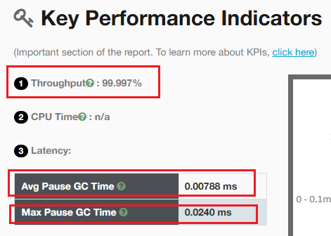
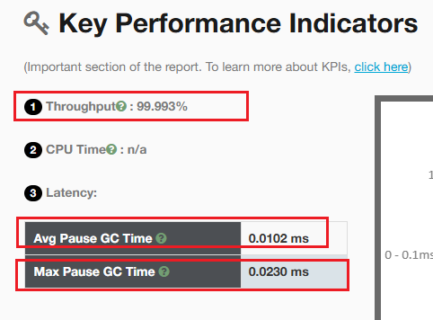
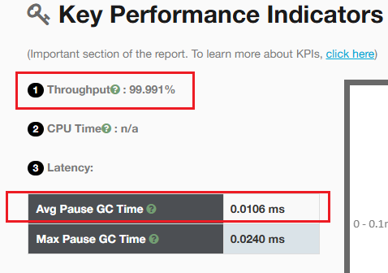
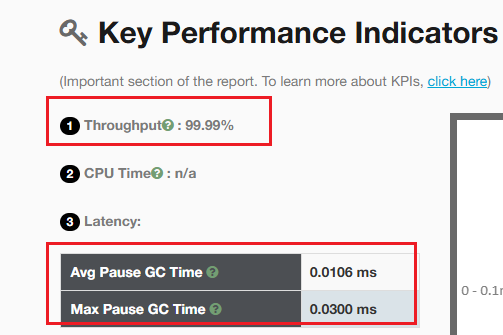
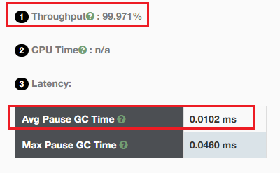
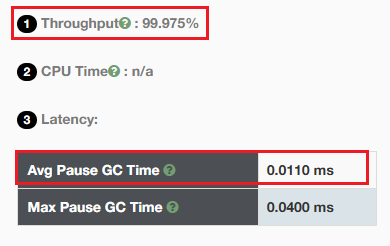
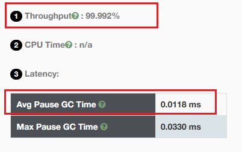
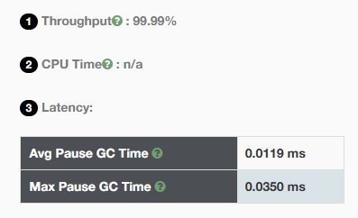
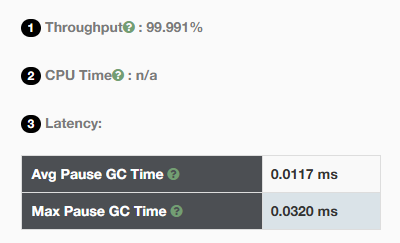
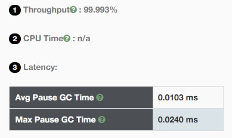

# 1、java程序(使用TencentKona-17.0.11.b1_jdk)

```java
public class ZGCExample {
    public static void main(String[] args) {
        List<byte[]> memoryHog = new ArrayList<>();
        int k = 1;
        while (true) {
            for (int i = 0; i < 1000; i++) {
                // 分配1MB的数组
                byte[] array = new byte[1024 * 1024];
                memoryHog.add(array);
            }
            System.out.println("第" + k++ + "分配1M内存" + "List 大小：" + memoryHog.size());
            // 模拟内存使用情况
            if (memoryHog.size() > 1000) {
                memoryHog.subList(0, 500).clear();
            }

            try {
                // 暂停一段时间，模拟应用程序的其他工作
                Thread.sleep(100);
            } catch (InterruptedException e) {
                e.printStackTrace();
            }
        }
    }
}
```

# 2、java命令

```
-XX:+UseZGC   
-Xlog:gc*:file=gc.log  
```

命令解释：

```angular2html
-XX:+UseZGC             //启用Z垃圾收集器（ZGC）
-Xlog:gc*:file=gc.log  //启用GC日志记录，并将所有GC相关的信息记录到文件gc.log中
```

# 3、运行结果


# 4、GC日志部分分析

<details>
    <summary>gc.log日志</summary>

```log
[0.018s][info][gc,init] Initializing The Z Garbage Collector
[0.018s][info][gc,init] Version: 17.0.2+8-86 (release)
[0.018s][info][gc,init] NUMA Support: Disabled
[0.018s][info][gc,init] CPUs: 8 total, 8 available
[0.018s][info][gc,init] Memory: 16281M
[0.018s][info][gc,init] Large Page Support: Disabled
[0.019s][info][gc,init] GC Workers: 2 (dynamic)
[0.019s][info][gc,init] Address Space Type: Contiguous/Unrestricted/Complete
[0.019s][info][gc,init] Address Space Size: 65152M x 3 = 195456M
[0.019s][info][gc,init] Min Capacity: 8M
[0.019s][info][gc,init] Initial Capacity: 256M
[0.019s][info][gc,init] Max Capacity: 4072M
[0.019s][info][gc,init] Medium Page Size: 32M
[0.019s][info][gc,init] Pre-touch: Disabled
[0.020s][info][gc,init] Uncommit: Enabled
[0.020s][info][gc,init] Uncommit Delay: 300s
[0.037s][info][gc,init] Runtime Workers: 5
[0.038s][info][gc     ] Using The Z Garbage Collector
[0.039s][info][gc,metaspace] CDS archive(s) mapped at: [0x0000000800000000-0x0000000800bc0000-0x0000000800bc0000), size 12320768, SharedBaseAddress: 0x0000000800000000, ArchiveRelocationMode: 0.
[0.039s][info][gc,metaspace] Compressed class space mapped at: 0x0000000800c00000-0x0000000840c00000, reserved size: 1073741824
[0.039s][info][gc,metaspace] Narrow klass base: 0x0000000800000000, Narrow klass shift: 0, Narrow klass range: 0x100000000
[0.468s][info][gc,start    ] GC(0) Garbage Collection (Warmup)
[0.468s][info][gc,task     ] GC(0) Using 2 workers
[0.468s][info][gc,phases   ] GC(0) Pause Mark Start 0.009ms
[0.484s][info][gc,phases   ] GC(0) Concurrent Mark 15.559ms
[0.484s][info][gc,phases   ] GC(0) Pause Mark End 0.015ms
[0.484s][info][gc,phases   ] GC(0) Concurrent Mark Free 0.001ms
[0.484s][info][gc,phases   ] GC(0) Concurrent Process Non-Strong References 0.514ms
[0.484s][info][gc,phases   ] GC(0) Concurrent Reset Relocation Set 0.000ms
[0.497s][info][gc,phases   ] GC(0) Concurrent Select Relocation Set 12.145ms
[0.497s][info][gc,phases   ] GC(0) Pause Relocate Start 0.012ms
[0.498s][info][gc,phases   ] GC(0) Concurrent Relocate 1.003ms
[0.498s][info][gc,load     ] GC(0) Load: 0.00/0.00/0.00
[0.498s][info][gc,mmu      ] GC(0) MMU: 2ms/99.3%, 5ms/99.7%, 10ms/99.9%, 20ms/99.9%, 50ms/99.9%, 100ms/100.0%
[0.498s][info][gc,marking  ] GC(0) Mark: 2 stripe(s), 2 proactive flush(es), 1 terminate flush(es), 0 completion(s), 0 continuation(s) 
[0.498s][info][gc,marking  ] GC(0) Mark Stack Usage: 32M
[0.498s][info][gc,nmethod  ] GC(0) NMethods: 289 registered, 0 unregistered
[0.498s][info][gc,metaspace] GC(0) Metaspace: 0M used, 0M committed, 1032M reserved
[0.498s][info][gc,ref      ] GC(0) Soft: 45 encountered, 0 discovered, 0 enqueued
[0.498s][info][gc,ref      ] GC(0) Weak: 132 encountered, 33 discovered, 32 enqueued
[0.498s][info][gc,ref      ] GC(0) Final: 0 encountered, 0 discovered, 0 enqueued
[0.498s][info][gc,ref      ] GC(0) Phantom: 196 encountered, 136 discovered, 24 enqueued
[0.498s][info][gc,reloc    ] GC(0) Small Pages: 5 / 10M, Empty: 0M, Relocated: 0M, In-Place: 0
[0.498s][info][gc,reloc    ] GC(0) Medium Pages: 15 / 480M, Empty: 0M, Relocated: 0M, In-Place: 0
[0.498s][info][gc,reloc    ] GC(0) Large Pages: 0 / 0M, Empty: 0M, Relocated: 0M, In-Place: 0
[0.498s][info][gc,reloc    ] GC(0) Forwarding Usage: 0M
[0.498s][info][gc,heap     ] GC(0) Min Capacity: 8M(0%)
[0.498s][info][gc,heap     ] GC(0) Max Capacity: 4072M(100%)
[0.498s][info][gc,heap     ] GC(0) Soft Max Capacity: 4072M(100%)
[0.498s][info][gc,heap     ] GC(0)                Mark Start          Mark End        Relocate Start      Relocate End           High               Low         
[0.498s][info][gc,heap     ] GC(0)  Capacity:      512M (13%)         544M (13%)         576M (14%)         576M (14%)         576M (14%)         512M (13%)    
[0.498s][info][gc,heap     ] GC(0)      Free:     3582M (88%)        3550M (87%)        3518M (86%)        3518M (86%)        3582M (88%)        3512M (86%)    
[0.498s][info][gc,heap     ] GC(0)      Used:      490M (12%)         522M (13%)         554M (14%)         554M (14%)         560M (14%)         490M (12%)    
[0.498s][info][gc,heap     ] GC(0)      Live:         -               449M (11%)         449M (11%)         449M (11%)            -                  -          
[0.498s][info][gc,heap     ] GC(0) Allocated:         -                32M (1%)           64M (2%)           65M (2%)             -                  -          
[0.498s][info][gc,heap     ] GC(0)   Garbage:         -                40M (1%)           40M (1%)           38M (1%)             -                  -          
[0.498s][info][gc,heap     ] GC(0) Reclaimed:         -                  -                 0M (0%)            1M (0%)             -                  -          
[0.498s][info][gc          ] GC(0) Garbage Collection (Warmup) 490M(12%)->554M(14%)
[0.781s][info][gc,start    ] GC(1) Garbage Collection (Warmup)
[0.781s][info][gc,task     ] GC(1) Using 2 workers
[0.781s][info][gc,phases   ] GC(1) Pause Mark Start 0.010ms
[0.797s][info][gc,phases   ] GC(1) Concurrent Mark 15.695ms
[0.797s][info][gc,phases   ] GC(1) Pause Mark End 0.014ms
[0.797s][info][gc,phases   ] GC(1) Concurrent Mark Free 0.001ms
[0.797s][info][gc,phases   ] GC(1) Concurrent Process Non-Strong References 0.451ms
[0.797s][info][gc,phases   ] GC(1) Concurrent Reset Relocation Set 0.001ms
[0.799s][info][gc,phases   ] GC(1) Concurrent Select Relocation Set 1.567ms
[0.799s][info][gc,phases   ] GC(1) Pause Relocate Start 0.013ms
[0.800s][info][gc,phases   ] GC(1) Concurrent Relocate 0.606ms
[0.800s][info][gc,load     ] GC(1) Load: 0.00/0.00/0.00
[0.800s][info][gc,mmu      ] GC(1) MMU: 2ms/99.3%, 5ms/99.5%, 10ms/99.7%, 20ms/99.8%, 50ms/99.9%, 100ms/100.0%
[0.800s][info][gc,marking  ] GC(1) Mark: 2 stripe(s), 2 proactive flush(es), 1 terminate flush(es), 0 completion(s), 0 continuation(s) 
[0.800s][info][gc,marking  ] GC(1) Mark Stack Usage: 32M
[0.800s][info][gc,nmethod  ] GC(1) NMethods: 289 registered, 0 unregistered
[0.800s][info][gc,metaspace] GC(1) Metaspace: 0M used, 0M committed, 1032M reserved
[0.800s][info][gc,ref      ] GC(1) Soft: 45 encountered, 0 discovered, 0 enqueued
[0.800s][info][gc,ref      ] GC(1) Weak: 100 encountered, 37 discovered, 0 enqueued
[0.800s][info][gc,ref      ] GC(1) Final: 0 encountered, 0 discovered, 0 enqueued
[0.800s][info][gc,ref      ] GC(1) Phantom: 172 encountered, 112 discovered, 0 enqueued
[0.800s][info][gc,reloc    ] GC(1) Small Pages: 5 / 10M, Empty: 0M, Relocated: 0M, In-Place: 0
[0.800s][info][gc,reloc    ] GC(1) Medium Pages: 29 / 928M, Empty: 0M, Relocated: 0M, In-Place: 0
[0.800s][info][gc,reloc    ] GC(1) Large Pages: 0 / 0M, Empty: 0M, Relocated: 0M, In-Place: 0
[0.800s][info][gc,reloc    ] GC(1) Forwarding Usage: 0M
[0.800s][info][gc,heap     ] GC(1) Min Capacity: 8M(0%)
[0.800s][info][gc,heap     ] GC(1) Max Capacity: 4072M(100%)
[0.800s][info][gc,heap     ] GC(1) Soft Max Capacity: 4072M(100%)
[0.800s][info][gc,heap     ] GC(1)                Mark Start          Mark End        Relocate Start      Relocate End           High               Low         
[0.800s][info][gc,heap     ] GC(1)  Capacity:      960M (24%)         992M (24%)         992M (24%)         992M (24%)         992M (24%)         960M (24%)    
[0.800s][info][gc,heap     ] GC(1)      Free:     3134M (77%)        3102M (76%)        3102M (76%)        3102M (76%)        3134M (77%)        3096M (76%)    
[0.800s][info][gc,heap     ] GC(1)      Used:      938M (23%)         970M (24%)         970M (24%)         970M (24%)         976M (24%)         938M (23%)    
[0.800s][info][gc,heap     ] GC(1)      Live:         -               881M (22%)         881M (22%)         881M (22%)            -                  -          
[0.800s][info][gc,heap     ] GC(1) Allocated:         -                32M (1%)           32M (1%)           33M (1%)             -                  -          
[0.800s][info][gc,heap     ] GC(1)   Garbage:         -                56M (1%)           56M (1%)           54M (1%)             -                  -          
[0.800s][info][gc,heap     ] GC(1) Reclaimed:         -                  -                 0M (0%)            1M (0%)             -                  -          
[0.800s][info][gc          ] GC(1) Garbage Collection (Warmup) 938M(23%)->970M(24%)
[1.171s][info][gc,start    ] GC(2) Garbage Collection (Warmup)
[1.171s][info][gc,task     ] GC(2) Using 2 workers
[1.171s][info][gc,phases   ] GC(2) Pause Mark Start 0.008ms
[1.187s][info][gc,phases   ] GC(2) Concurrent Mark 15.635ms
[1.187s][info][gc,phases   ] GC(2) Pause Mark End 0.014ms
[1.187s][info][gc,phases   ] GC(2) Concurrent Mark Free 0.001ms
[1.187s][info][gc,phases   ] GC(2) Concurrent Process Non-Strong References 0.474ms
[1.187s][info][gc,phases   ] GC(2) Concurrent Reset Relocation Set 0.001ms
[1.190s][info][gc,phases   ] GC(2) Concurrent Select Relocation Set 2.023ms
[1.190s][info][gc,phases   ] GC(2) Pause Relocate Start 0.010ms
[1.200s][info][gc,phases   ] GC(2) Concurrent Relocate 10.026ms
[1.200s][info][gc,load     ] GC(2) Load: 0.00/0.00/0.00
[1.200s][info][gc,mmu      ] GC(2) MMU: 2ms/99.3%, 5ms/99.5%, 10ms/99.7%, 20ms/99.8%, 50ms/99.9%, 100ms/100.0%
[1.200s][info][gc,marking  ] GC(2) Mark: 2 stripe(s), 2 proactive flush(es), 1 terminate flush(es), 0 completion(s), 0 continuation(s) 
[1.200s][info][gc,marking  ] GC(2) Mark Stack Usage: 32M
[1.200s][info][gc,nmethod  ] GC(2) NMethods: 347 registered, 0 unregistered
[1.200s][info][gc,metaspace] GC(2) Metaspace: 1M used, 1M committed, 1032M reserved
[1.200s][info][gc,ref      ] GC(2) Soft: 85 encountered, 0 discovered, 0 enqueued
[1.200s][info][gc,ref      ] GC(2) Weak: 121 encountered, 5 discovered, 5 enqueued
[1.200s][info][gc,ref      ] GC(2) Final: 0 encountered, 0 discovered, 0 enqueued
[1.200s][info][gc,ref      ] GC(2) Phantom: 177 encountered, 117 discovered, 5 enqueued
[1.200s][info][gc,reloc    ] GC(2) Small Pages: 7 / 14M, Empty: 0M, Relocated: 1M, In-Place: 0
[1.200s][info][gc,reloc    ] GC(2) Medium Pages: 42 / 1344M, Empty: 0M, Relocated: 16M, In-Place: 0
[1.200s][info][gc,reloc    ] GC(2) Large Pages: 0 / 0M, Empty: 0M, Relocated: 0M, In-Place: 0
[1.200s][info][gc,reloc    ] GC(2) Forwarding Usage: 0M
[1.200s][info][gc,heap     ] GC(2) Min Capacity: 8M(0%)
[1.200s][info][gc,heap     ] GC(2) Max Capacity: 4072M(100%)
[1.200s][info][gc,heap     ] GC(2) Soft Max Capacity: 4072M(100%)
[1.200s][info][gc,heap     ] GC(2)                Mark Start          Mark End        Relocate Start      Relocate End           High               Low         
[1.200s][info][gc,heap     ] GC(2)  Capacity:     1376M (34%)        1408M (35%)        1408M (35%)        1472M (36%)        1472M (36%)        1376M (34%)    
[1.200s][info][gc,heap     ] GC(2)      Free:     2714M (67%)        2682M (66%)        2682M (66%)        2688M (66%)        2714M (67%)        2616M (64%)    
[1.200s][info][gc,heap     ] GC(2)      Used:     1358M (33%)        1390M (34%)        1390M (34%)        1384M (34%)        1456M (36%)        1358M (33%)    
[1.200s][info][gc,heap     ] GC(2)      Live:         -              1261M (31%)        1261M (31%)        1261M (31%)            -                  -          
[1.200s][info][gc,heap     ] GC(2) Allocated:         -                32M (1%)           32M (1%)           65M (2%)             -                  -          
[1.200s][info][gc,heap     ] GC(2)   Garbage:         -                96M (2%)           96M (2%)           56M (1%)             -                  -          
[1.200s][info][gc,heap     ] GC(2) Reclaimed:         -                  -                 0M (0%)           39M (1%)             -                  -          
[1.200s][info][gc          ] GC(2) Garbage Collection (Warmup) 1358M(33%)->1384M(34%)
[2.767s][info][gc,start    ] GC(3) Garbage Collection (Allocation Rate)
[2.767s][info][gc,task     ] GC(3) Using 1 workers
[2.767s][info][gc,phases   ] GC(3) Pause Mark Start 0.010ms
[2.780s][info][gc,phases   ] GC(3) Concurrent Mark 12.778ms
[2.781s][info][gc,phases   ] GC(3) Pause Mark End 0.025ms
[2.781s][info][gc,phases   ] GC(3) Concurrent Mark Free 0.001ms
[2.782s][info][gc,phases   ] GC(3) Concurrent Process Non-Strong References 1.244ms
[2.782s][info][gc,phases   ] GC(3) Concurrent Reset Relocation Set 0.002ms
[2.784s][info][gc,phases   ] GC(3) Concurrent Select Relocation Set 1.979ms
[2.784s][info][gc,phases   ] GC(3) Pause Relocate Start 0.006ms
[2.788s][info][gc,phases   ] GC(3) Concurrent Relocate 3.182ms
[2.788s][info][gc,load     ] GC(3) Load: 0.00/0.00/0.00
[2.788s][info][gc,mmu      ] GC(3) MMU: 2ms/98.8%, 5ms/99.4%, 10ms/99.7%, 20ms/99.8%, 50ms/99.9%, 100ms/100.0%
[2.788s][info][gc,marking  ] GC(3) Mark: 1 stripe(s), 2 proactive flush(es), 1 terminate flush(es), 0 completion(s), 0 continuation(s) 
[2.788s][info][gc,marking  ] GC(3) Mark Stack Usage: 32M
[2.788s][info][gc,nmethod  ] GC(3) NMethods: 347 registered, 0 unregistered
[2.788s][info][gc,metaspace] GC(3) Metaspace: 1M used, 1M committed, 1032M reserved
[2.788s][info][gc,ref      ] GC(3) Soft: 85 encountered, 0 discovered, 0 enqueued
[2.788s][info][gc,ref      ] GC(3) Weak: 116 encountered, 0 discovered, 0 enqueued
[2.788s][info][gc,ref      ] GC(3) Final: 0 encountered, 0 discovered, 0 enqueued
[2.788s][info][gc,ref      ] GC(3) Phantom: 172 encountered, 86 discovered, 0 enqueued
[2.788s][info][gc,reloc    ] GC(3) Small Pages: 4 / 8M, Empty: 0M, Relocated: 1M, In-Place: 0
[2.788s][info][gc,reloc    ] GC(3) Medium Pages: 116 / 3712M, Empty: 992M, Relocated: 8M, In-Place: 0
[2.788s][info][gc,reloc    ] GC(3) Large Pages: 0 / 0M, Empty: 0M, Relocated: 0M, In-Place: 0
[2.788s][info][gc,reloc    ] GC(3) Forwarding Usage: 0M
[2.788s][info][gc,heap     ] GC(3) Min Capacity: 8M(0%)
[2.788s][info][gc,heap     ] GC(3) Max Capacity: 4072M(100%)
[2.788s][info][gc,heap     ] GC(3) Soft Max Capacity: 4072M(100%)
[2.788s][info][gc,heap     ] GC(3)                Mark Start          Mark End        Relocate Start      Relocate End           High               Low         
[2.788s][info][gc,heap     ] GC(3)  Capacity:     3744M (92%)        3776M (93%)        3776M (93%)        3776M (93%)        3776M (93%)        3744M (92%)    
[2.788s][info][gc,heap     ] GC(3)      Free:      352M (9%)          320M (8%)         1312M (32%)        1376M (34%)        1376M (34%)         320M (8%)     
[2.788s][info][gc,heap     ] GC(3)      Used:     3720M (91%)        3752M (92%)        2760M (68%)        2696M (66%)        3752M (92%)        2696M (66%)    
[2.788s][info][gc,heap     ] GC(3)      Live:         -              2562M (63%)        2562M (63%)        2562M (63%)            -                  -          
[2.788s][info][gc,heap     ] GC(3) Allocated:         -                32M (1%)           32M (1%)           33M (1%)             -                  -          
[2.788s][info][gc,heap     ] GC(3)   Garbage:         -              1157M (28%)         165M (4%)           99M (2%)             -                  -          
[2.788s][info][gc,heap     ] GC(3) Reclaimed:         -                  -               992M (24%)        1057M (26%)            -                  -          
[2.788s][info][gc          ] GC(3) Garbage Collection (Allocation Rate) 3720M(91%)->2696M(66%)
[3.066s][info][gc,start    ] GC(4) Garbage Collection (Allocation Rate)
[3.066s][info][gc,task     ] GC(4) Using 1 workers
[3.066s][info][gc,phases   ] GC(4) Pause Mark Start 0.007ms
[3.078s][info][gc,phases   ] GC(4) Concurrent Mark 12.059ms
[3.078s][info][gc,phases   ] GC(4) Pause Mark End 0.009ms
[3.078s][info][gc,phases   ] GC(4) Concurrent Mark Free 0.001ms
[3.079s][info][gc,phases   ] GC(4) Concurrent Process Non-Strong References 0.964ms
[3.079s][info][gc,phases   ] GC(4) Concurrent Reset Relocation Set 0.001ms
[3.083s][info][gc,phases   ] GC(4) Concurrent Select Relocation Set 3.275ms
[3.083s][info][gc,phases   ] GC(4) Pause Relocate Start 0.009ms
[3.088s][info][gc,phases   ] GC(4) Concurrent Relocate 5.406ms
[3.088s][info][gc,load     ] GC(4) Load: 0.00/0.00/0.00
[3.088s][info][gc,mmu      ] GC(4) MMU: 2ms/98.8%, 5ms/99.4%, 10ms/99.7%, 20ms/99.8%, 50ms/99.9%, 100ms/100.0%
[3.088s][info][gc,marking  ] GC(4) Mark: 1 stripe(s), 2 proactive flush(es), 1 terminate flush(es), 0 completion(s), 0 continuation(s) 
[3.089s][info][gc,marking  ] GC(4) Mark Stack Usage: 32M
[3.089s][info][gc,nmethod  ] GC(4) NMethods: 347 registered, 0 unregistered
[3.089s][info][gc,metaspace] GC(4) Metaspace: 1M used, 1M committed, 1032M reserved
[3.089s][info][gc,ref      ] GC(4) Soft: 85 encountered, 0 discovered, 0 enqueued
[3.089s][info][gc,ref      ] GC(4) Weak: 116 encountered, 0 discovered, 0 enqueued
[3.089s][info][gc,ref      ] GC(4) Final: 0 encountered, 0 discovered, 0 enqueued
[3.089s][info][gc,ref      ] GC(4) Phantom: 172 encountered, 86 discovered, 0 enqueued
[3.089s][info][gc,reloc    ] GC(4) Small Pages: 4 / 8M, Empty: 0M, Relocated: 1M, In-Place: 0
[3.089s][info][gc,reloc    ] GC(4) Medium Pages: 118 / 3776M, Empty: 512M, Relocated: 15M, In-Place: 0
[3.089s][info][gc,reloc    ] GC(4) Large Pages: 0 / 0M, Empty: 0M, Relocated: 0M, In-Place: 0
[3.089s][info][gc,reloc    ] GC(4) Forwarding Usage: 0M
[3.089s][info][gc,heap     ] GC(4) Min Capacity: 8M(0%)
[3.089s][info][gc,heap     ] GC(4) Max Capacity: 4072M(100%)
[3.089s][info][gc,heap     ] GC(4) Soft Max Capacity: 4072M(100%)
[3.089s][info][gc,heap     ] GC(4)                Mark Start          Mark End        Relocate Start      Relocate End           High               Low         
[3.089s][info][gc,heap     ] GC(4)  Capacity:     3808M (94%)        3840M (94%)        3840M (94%)        3840M (94%)        3840M (94%)        3808M (94%)    
[3.089s][info][gc,heap     ] GC(4)      Free:      288M (7%)          256M (6%)          768M (19%)         800M (20%)         800M (20%)         256M (6%)     
[3.089s][info][gc,heap     ] GC(4)      Used:     3784M (93%)        3816M (94%)        3304M (81%)        3272M (80%)        3816M (94%)        3272M (80%)    
[3.089s][info][gc,heap     ] GC(4)      Live:         -              3131M (77%)        3131M (77%)        3131M (77%)            -                  -          
[3.089s][info][gc,heap     ] GC(4) Allocated:         -                32M (1%)           32M (1%)           33M (1%)             -                  -          
[3.089s][info][gc,heap     ] GC(4)   Garbage:         -               652M (16%)         140M (3%)          106M (3%)             -                  -          
[3.089s][info][gc,heap     ] GC(4) Reclaimed:         -                  -               512M (13%)         545M (13%)            -                  -          
[3.089s][info][gc          ] GC(4) Garbage Collection (Allocation Rate) 3784M(93%)->3272M(80%)
[3.176s][info][gc,start    ] GC(5) Garbage Collection (Allocation Rate)
[3.176s][info][gc,task     ] GC(5) Using 1 workers
[3.176s][info][gc,phases   ] GC(5) Pause Mark Start 0.020ms
[3.182s][info][gc,phases   ] GC(5) Concurrent Mark 5.505ms
[3.182s][info][gc,phases   ] GC(5) Pause Mark End 0.014ms
[3.182s][info][gc,phases   ] GC(5) Concurrent Mark Free 0.001ms
[3.182s][info][gc,phases   ] GC(5) Concurrent Process Non-Strong References 0.667ms
[3.182s][info][gc,phases   ] GC(5) Concurrent Reset Relocation Set 0.001ms
[3.184s][info][gc,phases   ] GC(5) Concurrent Select Relocation Set 1.555ms
[3.184s][info][gc,phases   ] GC(5) Pause Relocate Start 0.006ms
[3.185s][info][gc,phases   ] GC(5) Concurrent Relocate 0.777ms
[3.185s][info][gc,load     ] GC(5) Load: 0.00/0.00/0.00
[3.185s][info][gc,mmu      ] GC(5) MMU: 2ms/98.8%, 5ms/99.4%, 10ms/99.6%, 20ms/99.8%, 50ms/99.9%, 100ms/100.0%
[3.185s][info][gc,marking  ] GC(5) Mark: 1 stripe(s), 1 proactive flush(es), 1 terminate flush(es), 0 completion(s), 0 continuation(s) 
[3.185s][info][gc,marking  ] GC(5) Mark Stack Usage: 32M
[3.185s][info][gc,nmethod  ] GC(5) NMethods: 347 registered, 0 unregistered
[3.185s][info][gc,metaspace] GC(5) Metaspace: 1M used, 1M committed, 1032M reserved
[3.185s][info][gc,ref      ] GC(5) Soft: 85 encountered, 0 discovered, 0 enqueued
[3.185s][info][gc,ref      ] GC(5) Weak: 116 encountered, 0 discovered, 0 enqueued
[3.185s][info][gc,ref      ] GC(5) Final: 0 encountered, 0 discovered, 0 enqueued
[3.185s][info][gc,ref      ] GC(5) Phantom: 172 encountered, 86 discovered, 0 enqueued
[3.185s][info][gc,reloc    ] GC(5) Small Pages: 4 / 8M, Empty: 0M, Relocated: 1M, In-Place: 0
[3.185s][info][gc,reloc    ] GC(5) Medium Pages: 114 / 3648M, Empty: 512M, Relocated: 0M, In-Place: 0
[3.185s][info][gc,reloc    ] GC(5) Large Pages: 0 / 0M, Empty: 0M, Relocated: 0M, In-Place: 0
[3.185s][info][gc,reloc    ] GC(5) Forwarding Usage: 0M
[3.185s][info][gc,heap     ] GC(5) Min Capacity: 8M(0%)
[3.185s][info][gc,heap     ] GC(5) Max Capacity: 4072M(100%)
[3.185s][info][gc,heap     ] GC(5) Soft Max Capacity: 4072M(100%)
[3.185s][info][gc,heap     ] GC(5)                Mark Start          Mark End        Relocate Start      Relocate End           High               Low         
[3.185s][info][gc,heap     ] GC(5)  Capacity:     3840M (94%)        3840M (94%)        3840M (94%)        3840M (94%)        3840M (94%)        3840M (94%)    
[3.185s][info][gc,heap     ] GC(5)      Free:      416M (10%)         416M (10%)         928M (23%)         930M (23%)         930M (23%)         416M (10%)    
[3.185s][info][gc,heap     ] GC(5)      Used:     3656M (90%)        3656M (90%)        3144M (77%)        3142M (77%)        3656M (90%)        3142M (77%)    
[3.185s][info][gc,heap     ] GC(5)      Live:         -              3016M (74%)        3016M (74%)        3016M (74%)            -                  -          
[3.185s][info][gc,heap     ] GC(5) Allocated:         -                 0M (0%)            0M (0%)            0M (0%)             -                  -          
[3.185s][info][gc,heap     ] GC(5)   Garbage:         -               639M (16%)         127M (3%)          125M (3%)             -                  -          
[3.185s][info][gc,heap     ] GC(5) Reclaimed:         -                  -               512M (13%)         514M (13%)            -                  -          
[3.185s][info][gc          ] GC(5) Garbage Collection (Allocation Rate) 3656M(90%)->3142M(77%)
[3.379s][info][gc,start    ] GC(6) Garbage Collection (Allocation Rate)
[3.379s][info][gc,task     ] GC(6) Using 2 workers
[3.380s][info][gc,phases   ] GC(6) Pause Mark Start 0.005ms
[3.394s][info][gc,phases   ] GC(6) Concurrent Mark 14.186ms
[3.394s][info][gc,phases   ] GC(6) Pause Mark End 0.014ms
[3.394s][info][gc,phases   ] GC(6) Concurrent Mark Free 0.001ms
[3.395s][info][gc,phases   ] GC(6) Concurrent Process Non-Strong References 0.785ms
[3.395s][info][gc,phases   ] GC(6) Concurrent Reset Relocation Set 0.002ms
[3.397s][info][gc,phases   ] GC(6) Concurrent Select Relocation Set 1.797ms
[3.397s][info][gc,phases   ] GC(6) Pause Relocate Start 0.006ms
[3.409s][info][gc,phases   ] GC(6) Concurrent Relocate 11.921ms
[3.409s][info][gc,load     ] GC(6) Load: 0.00/0.00/0.00
[3.409s][info][gc,mmu      ] GC(6) MMU: 2ms/98.8%, 5ms/99.4%, 10ms/99.6%, 20ms/99.8%, 50ms/99.9%, 100ms/100.0%
[3.409s][info][gc,marking  ] GC(6) Mark: 2 stripe(s), 2 proactive flush(es), 1 terminate flush(es), 0 completion(s), 0 continuation(s) 
[3.409s][info][gc,marking  ] GC(6) Mark Stack Usage: 32M
[3.409s][info][gc,nmethod  ] GC(6) NMethods: 348 registered, 0 unregistered
[3.409s][info][gc,metaspace] GC(6) Metaspace: 1M used, 1M committed, 1032M reserved
[3.409s][info][gc,ref      ] GC(6) Soft: 85 encountered, 0 discovered, 0 enqueued
[3.409s][info][gc,ref      ] GC(6) Weak: 116 encountered, 92 discovered, 0 enqueued
[3.409s][info][gc,ref      ] GC(6) Final: 0 encountered, 0 discovered, 0 enqueued
[3.409s][info][gc,ref      ] GC(6) Phantom: 172 encountered, 154 discovered, 0 enqueued
[3.410s][info][gc,reloc    ] GC(6) Small Pages: 4 / 8M, Empty: 0M, Relocated: 1M, In-Place: 0
[3.410s][info][gc,reloc    ] GC(6) Medium Pages: 124 / 3968M, Empty: 0M, Relocated: 14M, In-Place: 0
[3.410s][info][gc,reloc    ] GC(6) Large Pages: 0 / 0M, Empty: 0M, Relocated: 0M, In-Place: 0
[3.410s][info][gc,reloc    ] GC(6) Forwarding Usage: 0M
[3.410s][info][gc,heap     ] GC(6) Min Capacity: 8M(0%)
[3.410s][info][gc,heap     ] GC(6) Max Capacity: 4072M(100%)
[3.410s][info][gc,heap     ] GC(6) Soft Max Capacity: 4072M(100%)
[3.410s][info][gc,heap     ] GC(6)                Mark Start          Mark End        Relocate Start      Relocate End           High               Low         
[3.410s][info][gc,heap     ] GC(6)  Capacity:     4000M (98%)        4032M (99%)        4032M (99%)        4064M (100%)       4064M (100%)       4000M (98%)    
[3.410s][info][gc,heap     ] GC(6)      Free:       96M (2%)           64M (2%)           64M (2%)           64M (2%)           96M (2%)           30M (1%)     
[3.410s][info][gc,heap     ] GC(6)      Used:     3976M (98%)        4008M (98%)        4008M (98%)        4008M (98%)        4042M (99%)        3976M (98%)    
[3.410s][info][gc,heap     ] GC(6)      Live:         -              3795M (93%)        3795M (93%)        3795M (93%)            -                  -          
[3.410s][info][gc,heap     ] GC(6) Allocated:         -                32M (1%)           32M (1%)           65M (2%)             -                  -          
[3.410s][info][gc,heap     ] GC(6)   Garbage:         -               180M (4%)          180M (4%)          146M (4%)             -                  -          
[3.410s][info][gc,heap     ] GC(6) Reclaimed:         -                  -                 0M (0%)           33M (1%)             -                  -          
[3.410s][info][gc          ] GC(6) Garbage Collection (Allocation Rate) 3976M(98%)->4008M(98%)
[3.449s][info][gc,start    ] GC(7) Garbage Collection (Allocation Stall)
[3.449s][info][gc,ref      ] GC(7) Clearing All SoftReferences
[3.449s][info][gc,task     ] GC(7) Using 2 workers
[3.449s][info][gc,phases   ] GC(7) Pause Mark Start 0.006ms
[3.457s][info][gc,phases   ] GC(7) Concurrent Mark 8.020ms
[3.457s][info][gc,phases   ] GC(7) Pause Mark End 0.008ms
[3.457s][info][gc,phases   ] GC(7) Concurrent Mark Free 0.001ms
[3.458s][info][gc,phases   ] GC(7) Concurrent Process Non-Strong References 0.758ms
[3.458s][info][gc,phases   ] GC(7) Concurrent Reset Relocation Set 0.001ms
[3.460s][info][gc,phases   ] GC(7) Concurrent Select Relocation Set 1.592ms
[3.460s][info][gc,phases   ] GC(7) Pause Relocate Start 0.004ms
[3.461s][info][gc,phases   ] GC(7) Concurrent Relocate 0.776ms
[3.461s][info][gc,load     ] GC(7) Load: 0.00/0.00/0.00
[3.461s][info][gc,mmu      ] GC(7) MMU: 2ms/98.8%, 5ms/99.4%, 10ms/99.6%, 20ms/99.8%, 50ms/99.9%, 100ms/100.0%
[3.461s][info][gc,marking  ] GC(7) Mark: 2 stripe(s), 1 proactive flush(es), 1 terminate flush(es), 0 completion(s), 0 continuation(s) 
[3.461s][info][gc,marking  ] GC(7) Mark Stack Usage: 32M
[3.461s][info][gc,nmethod  ] GC(7) NMethods: 348 registered, 0 unregistered
[3.461s][info][gc,metaspace] GC(7) Metaspace: 1M used, 1M committed, 1032M reserved
[3.461s][info][gc,ref      ] GC(7) Soft: 85 encountered, 55 discovered, 43 enqueued
[3.461s][info][gc,ref      ] GC(7) Weak: 116 encountered, 4 discovered, 0 enqueued
[3.461s][info][gc,ref      ] GC(7) Final: 0 encountered, 0 discovered, 0 enqueued
[3.461s][info][gc,ref      ] GC(7) Phantom: 172 encountered, 170 discovered, 0 enqueued
[3.461s][info][gc,reloc    ] GC(7) Small Pages: 4 / 8M, Empty: 0M, Relocated: 1M, In-Place: 1
[3.461s][info][gc,reloc    ] GC(7) Medium Pages: 127 / 4064M, Empty: 0M, Relocated: 0M, In-Place: 0
[3.461s][info][gc,reloc    ] GC(7) Large Pages: 0 / 0M, Empty: 0M, Relocated: 0M, In-Place: 0
[3.461s][info][gc,reloc    ] GC(7) Forwarding Usage: 0M
[3.461s][info][gc,heap     ] GC(7) Min Capacity: 8M(0%)
[3.461s][info][gc,heap     ] GC(7) Max Capacity: 4072M(100%)
[3.461s][info][gc,heap     ] GC(7) Soft Max Capacity: 4072M(100%)
[3.461s][info][gc,heap     ] GC(7)                Mark Start          Mark End        Relocate Start      Relocate End           High               Low         
[3.461s][info][gc,heap     ] GC(7)  Capacity:     4072M (100%)       4072M (100%)       4072M (100%)       4072M (100%)       4072M (100%)       4072M (100%)   
[3.461s][info][gc,heap     ] GC(7)      Free:        0M (0%)            0M (0%)            0M (0%)            2M (0%)            2M (0%)            0M (0%)     
[3.461s][info][gc,heap     ] GC(7)      Used:     4072M (100%)       4072M (100%)       4072M (100%)       4070M (100%)       4072M (100%)       4070M (100%)   
[3.461s][info][gc,heap     ] GC(7)      Live:         -              3919M (96%)        3919M (96%)        3919M (96%)            -                  -          
[3.461s][info][gc,heap     ] GC(7) Allocated:         -                 0M (0%)            0M (0%)            0M (0%)             -                  -          
[3.461s][info][gc,heap     ] GC(7)   Garbage:         -               152M (4%)          152M (4%)          150M (4%)             -                  -          
[3.461s][info][gc,heap     ] GC(7) Reclaimed:         -                  -                 0M (0%)            2M (0%)             -                  -          
[3.461s][info][gc          ] GC(7) Garbage Collection (Allocation Stall) 4072M(100%)->4070M(100%)
[3.461s][info][gc          ] Allocation Stall (main) 12.590ms
[3.461s][info][gc          ] Out Of Memory (main)
[3.462s][info][gc,heap,exit] Heap
[3.462s][info][gc,heap,exit]  ZHeap           used 4072M, capacity 4072M, max capacity 4072M
[3.462s][info][gc,heap,exit]  Metaspace       used 1039K, committed 1216K, reserved 1056768K
[3.462s][info][gc,heap,exit]   class space    used 77K, committed 192K, reserved 1048576K

```

</details>

## 1、基础信息分析

<details>
    <summary>基础日志（未涉及垃圾回收）</summary>

| 基础日志分析   |                                                                                                |
|----------|------------------------------------------------------------------------------------------------|
| 相对时间     | 日志内容及解释                                                                                        |
| [0.013s] | [gc,init] Initializing The Z Garbage  Collector：  JVM在启动0.013秒时开始初始化ZGC。                       |
| [0.014s] | [gc,init] Version: 21.0.3+9-LTS (release)：  使用的是Java 21的版本21.0.3+9-LTS（长期支持版本）。                |
| [0.014s] | [gc,init] Using legacy single-generation  mode：  使用传统的单代模式，这意味着不区分年轻代和老年代。                     |
| [0.014s] | [gc,init] NUMA Support: Disabled：  非统一内存访问（NUMA）支持被禁用。                                         |
| [0.014s] | [gc,init] CPUs: 8 total, 8 available：  系统有8个CPU核心，全部可用。                                        |
| [0.014s] | [gc,init] Memory: 16281M：  系统有16281MB（约15.9GB）的内存。                                             |
| [0.014s] | [gc,init] Large Page Support: Disabled：  大页内存支持被禁用。                                            |
| [0.014s] | [gc,init] GC Workers: 2 (dynamic)：  有2个动态分配的GC工作线程。                                            |
| [0.015s] | [gc,init] Address Space Type:  Contiguous/Unrestricted/Complete：  地址空间类型为连续、无限制、完整。            |
| [0.015s] | [gc,init] Address Space Size: 65152M x 3  = 195456M：  地址空间大小为65152MB x 3 = 195456MB（约190.5GB）。 |
| [0.015s] | [gc,init] Min Capacity: 8M：  最小堆容量为8MB。                                                        |
| [0.015s] | [gc,init] Initial Capacity: 256M：  初始堆容量为256MB。                                                |
| [0.015s] | [gc,init] Max Capacity: 4072M：  最大堆容量为4072MB（约3.98GB）。                                         |
| [0.015s] | [gc,init] Medium Page Size: 32M：  中等页面大小为32MB。                                                 |
| [0.015s] | [gc,init] Pre-touch: Disabled：  预触摸内存页面的功能被禁用。                                                 |
| [0.015s] | [gc,init] Uncommit: Enabled：  允许未使用的堆内存被操作系统回收。                                                |
| [0.015s] | [gc,init] Uncommit Delay: 300s：  未使用内存被回收前的延迟时间为300秒。                                          |
| [0.027s] | [gc,init] Runtime Workers: 5：  有5个运行时工作线程。                                                     |
| [0.028s] | [gc ] Using The Z Garbage Collector：  确认使用Z垃圾收集器。                                              |

</details>

## 2、垃圾回收日志
下图是一次GC的全过程

<details>
    <summary>垃圾回收过程日志</summary>

| GC日志分析                                     |                                                                                                                                                                                                                                                                                                                                                                                                                                                                                                                                                                                                                                                                                                                                                                                                                                                                      |
|--------------------------------------------|----------------------------------------------------------------------------------------------------------------------------------------------------------------------------------------------------------------------------------------------------------------------------------------------------------------------------------------------------------------------------------------------------------------------------------------------------------------------------------------------------------------------------------------------------------------------------------------------------------------------------------------------------------------------------------------------------------------------------------------------------------------------------------------------------------------------------------------------------------------------|
| GC启动：                                      |                                                                                                                                                                                                                                                                                                                                                                                                                                                                                                                                                                                                                                                                                                                                                                                                                                                                      |
| [0.460s]                                   | [gc,start] GC(0) Garbage Collection  (Warmup)<br> 在0.460秒时，JVM开始了一次垃圾收集（GC），这是一次预热（Warmup）GC。                                                                                                                                                                                                                                                                                                                                                                                                                                                                                                                                                                                                                                                                                                                                                                        |
| GC任务<br>                                   |                                                                                                                                                                                                                                                                                                                                                                                                                                                                                                                                                                                                                                                                                                                                                                                                                                                                      |
| [0.461s]                                   | [gc,task]  GC(0) Using 2 workers<br>使用了2个GC工作线程。                                                                                                                                                                                                                                                                                                                                                                                                                                                                                                                                                                                                                                                                                                                                                                                                                     |
| GC阶段<br>                                   |                                                                                                                                                                                                                                                                                                                                                                                                                                                                                                                                                                                                                                                                                                                                                                                                                                                                      |
| [0.461s]                                   | [gc,phases]  GC(0) Pause Mark Start 0.007ms<br>  标记阶段开始，暂停时间为0.007毫秒。                                                                                                                                                                                                                                                                                                                                                                                                                                                                                                                                                                                                                                                                                                                                                                                                |
| [0.475s]                                   | [gc,phases]  GC(0) Concurrent Mark 14.514ms<br>  并发标记阶段，耗时14.514毫秒。                                                                                                                                                                                                                                                                                                                                                                                                                                                                                                                                                                                                                                                                                                                                                                                                  |
| [0.476s]                                   | [gc,phases]  GC(0) Pause Mark End 0.018ms<br>  标记阶段结束，暂停时间为0.018毫秒。                                                                                                                                                                                                                                                                                                                                                                                                                                                                                                                                                                                                                                                                                                                                                                                                  |
| [0.476s]                                   | [gc,phases]  GC(0) Concurrent Process Non-Strong References 0.650ms<br>  并发处理非强引用阶段，耗时0.650毫秒。                                                                                                                                                                                                                                                                                                                                                                                                                                                                                                                                                                                                                                                                                                                                                                       |
| [0.476s]                                   | [gc,phases]  GC(0) Concurrent Reset Relocation Set 0.001ms<br>  并发重置重定位集阶段，耗时0.001毫秒。                                                                                                                                                                                                                                                                                                                                                                                                                                                                                                                                                                                                                                                                                                                                                                                |
| [0.485s]                                   | [gc,phases]  GC(0) Concurrent Select Relocation Set 9.009ms<br>  并发选择重定位集阶段，耗时9.009毫秒。                                                                                                                                                                                                                                                                                                                                                                                                                                                                                                                                                                                                                                                                                                                                                                               |
| [0.486s]                                   | [gc,phases]  GC(0) Pause Relocate Start 0.013ms<br>  重定位阶段开始，暂停时间为0.013毫秒。                                                                                                                                                                                                                                                                                                                                                                                                                                                                                                                                                                                                                                                                                                                                                                                           |
| [0.487s]                                   | [gc,phases]  GC(0) Concurrent Relocate 0.810ms<br>  并发重定位阶段，耗时0.810毫秒。                                                                                                                                                                                                                                                                                                                                                                                                                                                                                                                                                                                                                                                                                                                                                                                               |
| GC负载<br>                                   |                                                                                                                                                                                                                                                                                                                                                                                                                                                                                                                                                                                                                                                                                                                                                                                                                                                                      |
| [0.487s]                                   | [gc,load]  GC(0) Load: 0.00/0.00/0.00<br>  GC负载信息。                                                                                                                                                                                                                                                                                                                                                                                                                                                                                                                                                                                                                                                                                                                                                                                                                   |
| GC（Minimum  Mutator Utilisation）=非GC时间/时间片 |                                                                                                                                                                                                                                                                                                                                                                                                                                                                                                                                                                                                                                                                                                                                                                                                                                                                      |
| [0.487s]                                   | [gc,mmu]  GC(0) MMU: 2ms/99.1%, 5ms/99.6%, 10ms/99.8%, 20ms/99.8%, 50ms/99.9%,  100ms/100.0%<br>  是一个指标2ms/99.1%在 2 毫秒的时间片内，至少 99.1% 的时间用于应用程序线程的执行。                                                                                                                                                                                                                                                                                                                                                                                                                                                                                                                                                                                                                                                                                                                 |
| GC标记                                       |                                                                                                                                                                                                                                                                                                                                                                                                                                                                                                                                                                                                                                                                                                                                                                                                                                                                      |
| [0.487s]                                   | [gc,marking]  GC(0) Mark: 2 stripe(s), 2 proactive flush(es), 1 terminate flush(es), 0  completion(s), 0 continuation(s)<br>  2 stripe(s)：表示标记阶段分为两个条带（stri），每个条带是并行标记的pe一部分。  <br>2 proactive flush(es)：表示在标记过程中进行了两次主动刷新（flush），这通常是为了确保标记信息及时更新。<br>  1 terminate flush(es)：表示在标记阶段结束时进行了1次终止刷新，确保所有标记信息都已处理完毕。<br>  0 completion(s)：表示没有完成的标记任务。 <br> 0 continuation(s)：表示没有需要继续的标记任务。                                                                                                                                                                                                                                                                                                                                                                                                                                                                           |
| [0.487s]                                   | [gc,marking]  GC(0) Mark Stack Usage: 32M<br>  表示在标记阶段使用了 32MB 的标记栈（Mark Stack）。标记栈用于存储在标记过程中需要处理的对象引用。                                                                                                                                                                                                                                                                                                                                                                                                                                                                                                                                                                                                                                                                                                                                                              |
| GC方法<br>                                   |                                                                                                                                                                                                                                                                                                                                                                                                                                                                                                                                                                                                                                                                                                                                                                                                                                                                      |
| [0.487s]                                   | [gc,nmethod] GC(0) NMethods: 289  registered, 41 unregistered<br>  289 registered：当前注册的本地方法（NMethods）数量为 289，这些方法已经被编译并存储在代码缓存中，供 JVM 执行。  <br>41 unregistered：当前未注册的本地方法数量为 41，这些方法可能已经被移除或不再使用。                                                                                                                                                                                                                                                                                                                                                                                                                                                                                                                                                                                                                                                                    |
| 元空间<br>                                    |                                                                                                                                                                                                                                                                                                                                                                                                                                                                                                                                                                                                                                                                                                                                                                                                                                                                      |
| [0.487s]                                   | [gc,metaspace]  GC(0) Metaspace: 0M used, 0M committed, 1088M reserved<br>  0M used<br>当前没有使用的元空间（Metaspace）。  0M committed<br>当前没有分配的元空间。  1088M reserved<br>预留了 1088MB 的元空间。                                                                                                                                                                                                                                                                                                                                                                                                                                                                                                                                                                                                                                                                                       |
| 引用处理<br>                                   |                                                                                                                                                                                                                                                                                                                                                                                                                                                                                                                                                                                                                                                                                                                                                                                                                                                                      |
| [0.487s]                                   | [gc,ref] GC(0) Soft: 54 encountered, 0  discovered, 0 enqueued<br>[gc,ref] GC(0) Weak: 171 encountered, 48  discovered, 45 enqueued<br>[gc,ref] GC(0) Final: 0 encountered, 0  discovered, 0 enqueued<br>[gc,ref] GC(0) Phantom: 187 encountered,  90 discovered, 15 enqueued<br>软引用（Soft Reference）：<br>54 encountered：遇到了 54 个软引用。  0 discovered：发现了  0 个需要处理的软引用。  0 enqueued：入队了 0 个软引用。  <br/>弱引用（Weak Reference）：<br> 171 encountered：遇到了 171 个弱引用。  48 discovered：发现了  48 个需要处理的弱引用。  45 enqueued：入队了  45 个弱引用。  <br/>终结引用（Final Reference）：<br>  0 encountered：遇到了0  个终结引用。  0 discovered：发现了0  个需要处理的终结引用。  0 enqueued：入队了0 个终结引用。  <br/>虚引用（Phantom Reference）：<br>187 encountered：遇到了 187 个虚引用。  90 discovered：发现了  90 个需要处理的虚引用。  15 enqueued：入队了  15 个虚引用。  <br/>强引用是默认的引用类型，任何通过普通变量引用的对象都是强引用。强引用的对象在 GC  时不会被回收，除非没有任何强引用指向它们。因此，强引用不需要在 GC 日志中单独记录。 |
| 重定位<br>                                    |                                                                                                                                                                                                                                                                                                                                                                                                                                                                                                                                                                                                                                                                                                                                                                                                                                                                      |
| [0.487s]                                   | [gc,reloc]  GC(0) Small Pages: 6 / 12M, Empty: 0M, Relocated: 0M, In-Place: 0<br>[gc,reloc]  GC(0) Medium Pages: 14 / 448M, Empty: 0M, Relocated: 0M, In-Place: 0<br>[gc,reloc]  GC(0) Large Pages: 0 / 0M, Empty: 0M, Relocated: 0M, In-Place: 0<br>[gc,reloc] GC(0) Forwarding Usage: 0M<br>Small Pages：  6 / 12M：表示有 6 个小页面，总共 12MB。<br/>Empty: 0M：没有空闲的小页面。<br/>Relocated: 0M：没有小页面被重新定位。  <br/>In-Place: 0：没有小页面在原地处理。<br/>Medium Pages:14 / 448M：表示有 14 个中等大小的页面，总共 448MB。<br/>Empty: 0M：没有空闲的中等页面。  <br/>Relocated: 0M：没有中等页面被重新定位。<br/>In-Place: 0：没有中等页面在原地处理。<br/>Large Pages: 0 / 0M：没有大页面。  <br/>Empty: 0M：没有空闲的大页面。  <br/>Relocated: 0M：没有大页面被重新定位。  <br/>In-Place: 0：没有大页面在原地处理。  <br/>Forwarding Usage：  0M：没有使用转发内存。                                                                                                                                 |
| 堆内存<br>                                    | [gc,heap     ] GC(0) Min Capacity: 8M(0%)[gc,heap     ] GC(0) Max Capacity: 4072M(100%)<br/>[gc,heap     ] GC(0) Soft Max Capacity: 4072M(100%)Min Capacity: 8M (0%)<br>最小堆容量为 8MB，占总容量的 0%。这是 JVM 启动时的初始堆大小。<br/>Max Capacity: 4072M (100%)：最大堆容量为 4072MB，占总容量的 100%。这是 JVM 可以扩展到的最大堆大小。：<br/>Soft Max Capacity: 4072M (100%)：软最大堆容量为 4072MB，占总容量的 100%。这是 JVM 在正常情况下不会超过的堆大小，但在特殊情况下可以临时超过。                                                                                                                                                                                                                                                                                                                                                                                                                                                                        |

堆内存日志


| 时间   | 0.487s      | 0.487s      | 0.487s         | 0.487s       | 0.487s      | 0.487s      |
|------|-------------|-------------|----------------|--------------|-------------|-------------|
| 阶段   | Mark Start  | Mark End    | Relocate Start | Relocate End | High        | Low         |
| 容量变化 | 480M (12%)  | 512M (13%)  | 544M (13%)     | 544M (13%)   | 544M (13%)  | 480M (12%)  |
| 空闲变化 | 3612M (89%) | 3580M (88%) | 3546M (87%)    | 3548M (87%)  | 3612M (89%) | 3542M (87%) |
| 使用变化 | 460M (11%)  | 492M (12%)  | 526M (13%)     | 524M (13%)   | 530M (13%)  | 460M (11%)  |
| 活跃对象 | -           | 437M (11%)  | 437M (11%)     | 437M (11%)   | -           | -           |
| 分配内存 | -           | 32M (1%)    | 66M (2%)       | 67M (2%)     | -           | -           |
| 垃圾内存 | -           | 22M (1%)    | 22M (1%)       | 18M (0%)     | -           | -           |
| 回收内存 | -           | -           | 0M (0%)        | 3M (0%)      | -           | -           |
</details>

## 3、其他触发条件得到的日志（修改了程序） //todo

<details>
    <summary>修改后的程序</summary>

```java

public class IdleGCTest {

    public static void main(String[] args) {
        System.out.println("Starting Idle GC Test...");

        // 分配大量对象以填充堆内存
        for (int i = 0; i < 100_000; i++) {
            byte[] array = new byte[1024 * 1024]; // 1MB
        }

        System.out.println("Finished allocating memory. Waiting for Idle GC...");
        System.gc();
        try {
            // 保持空闲状态，等待Idle GC触发
            Thread.sleep(30000); // 30秒
        } catch (InterruptedException e) {
            e.printStackTrace();
        }

        System.out.println("Test finished.");
    }
}

```
</details>
<details>
    <summary>修改的jvm参数</summary>

``` log
-XX:+UseZGC
-XX:ZCollectionInterval=15
-Xlog:gc*:file=./gc.log
```


</details>

<details>
    <summary>新增加的日志截取</summary>

``` log
[13.786s][info][gc,start    ] GC(46) Garbage Collection (System.gc())
[13.787s][info][gc,task     ] GC(46) Using 2 workers
[13.787s][info][gc,phases   ] GC(46) Pause Mark Start 0.007ms
[13.802s][info][gc,phases   ] GC(46) Concurrent Mark 15.370ms
[13.802s][info][gc,phases   ] GC(46) Pause Mark End 0.010ms
[13.803s][info][gc,phases   ] GC(46) Concurrent Mark Free 0.001ms
[13.804s][info][gc,phases   ] GC(46) Concurrent Process Non-Strong References 0.876ms
[13.804s][info][gc,phases   ] GC(46) Concurrent Reset Relocation Set 0.000ms
[13.805s][info][gc,phases   ] GC(46) Concurrent Select Relocation Set 1.803ms
[13.806s][info][gc,phases   ] GC(46) Pause Relocate Start 0.005ms
[13.806s][info][gc,phases   ] GC(46) Concurrent Relocate 0.124ms
[13.806s][info][gc,load     ] GC(46) Load: 0.00/0.00/0.00
[13.806s][info][gc,mmu      ] GC(46) MMU: 2ms/97.7%, 5ms/98.8%, 10ms/99.2%, 20ms/99.6%, 50ms/99.8%, 100ms/99.9%
[13.806s][info][gc,marking  ] GC(46) Mark: 2 stripe(s), 1 proactive flush(es), 1 terminate flush(es), 0 completion(s), 0 continuation(s) 
[13.806s][info][gc,marking  ] GC(46) Mark Stack Usage: 32M
[13.806s][info][gc,nmethod  ] GC(46) NMethods: 344 registered, 0 unregistered
[13.806s][info][gc,metaspace] GC(46) Metaspace: 1M used, 1M committed, 1032M reserved
[13.806s][info][gc,ref      ] GC(46) Soft: 85 encountered, 0 discovered, 0 enqueued
[13.806s][info][gc,ref      ] GC(46) Weak: 116 encountered, 1 discovered, 0 enqueued
[13.806s][info][gc,ref      ] GC(46) Final: 0 encountered, 0 discovered, 0 enqueued
[13.806s][info][gc,ref      ] GC(46) Phantom: 184 encountered, 180 discovered, 0 enqueued
[13.806s][info][gc,reloc    ] GC(46) Small Pages: 3 / 6M, Empty: 0M, Relocated: 0M, In-Place: 0
[13.806s][info][gc,reloc    ] GC(46) Medium Pages: 1 / 32M, Empty: 0M, Relocated: 0M, In-Place: 0
[13.806s][info][gc,reloc    ] GC(46) Large Pages: 0 / 0M, Empty: 0M, Relocated: 0M, In-Place: 0
[13.806s][info][gc,reloc    ] GC(46) Forwarding Usage: 0M
[13.806s][info][gc,heap     ] GC(46) Min Capacity: 8M(0%)
[13.806s][info][gc,heap     ] GC(46) Max Capacity: 4072M(100%)
[13.806s][info][gc,heap     ] GC(46) Soft Max Capacity: 4072M(100%)
[13.806s][info][gc,heap     ] GC(46)                Mark Start          Mark End        Relocate Start      Relocate End           High               Low         
[13.806s][info][gc,heap     ] GC(46)  Capacity:     3776M (93%)        3776M (93%)        3776M (93%)        3776M (93%)        3776M (93%)        3776M (93%)    
[13.806s][info][gc,heap     ] GC(46)      Free:     4034M (99%)        4034M (99%)        4034M (99%)        4034M (99%)        4034M (99%)        4034M (99%)    
[13.806s][info][gc,heap     ] GC(46)      Used:       38M (1%)           38M (1%)           38M (1%)           38M (1%)           38M (1%)           38M (1%)     
[13.806s][info][gc,heap     ] GC(46)      Live:         -                 4M (0%)            4M (0%)            4M (0%)             -                  -          
[13.806s][info][gc,heap     ] GC(46) Allocated:         -                 0M (0%)            0M (0%)            0M (0%)             -                  -          
[13.806s][info][gc,heap     ] GC(46)   Garbage:         -                33M (1%)           33M (1%)           33M (1%)             -                  -          
[13.806s][info][gc,heap     ] GC(46) Reclaimed:         -                  -                 0M (0%)            0M (0%)             -                  -          
[13.806s][info][gc          ] GC(46) Garbage Collection (System.gc()) 38M(1%)->38M(1%)
[20.070s][info][gc,stats    ] === Garbage Collection Statistics =======================================================================================================================
[20.071s][info][gc,stats    ]                                                              Last 10s              Last 10m              Last 10h                Total
[20.071s][info][gc,stats    ]                                                              Avg / Max             Avg / Max             Avg / Max             Avg / Max
[20.071s][info][gc,stats    ]   Collector: Garbage Collection Cycle                     15.002 / 19.739       14.516 / 29.018       14.516 / 29.018       14.516 / 29.018      ms
[20.071s][info][gc,stats    ]  Contention: Mark Segment Reset Contention                     0 / 0                 0 / 2                 0 / 2                 0 / 2           ops/s
[20.071s][info][gc,stats    ]  Contention: Mark SeqNum Reset Contention                      0 / 0                 0 / 2                 0 / 2                 0 / 2           ops/s
[20.071s][info][gc,stats    ]    Critical: Allocation Stall                                  0 / 0                 0 / 0                 0 / 0                 0 / 0           ops/s
[20.071s][info][gc,stats    ]    Critical: Allocation Stall                              0.000 / 0.000         0.000 / 0.000         0.000 / 0.000         0.000 / 0.000       ms
[20.071s][info][gc,stats    ]    Critical: GC Locker Stall                                   0 / 0                 0 / 0                 0 / 0                 0 / 0           ops/s
[20.071s][info][gc,stats    ]    Critical: GC Locker Stall                               0.000 / 0.000         0.000 / 0.000         0.000 / 0.000         0.000 / 0.000       ms
[20.071s][info][gc,stats    ]    Critical: Relocation Stall                                  0 / 0                 0 / 0                 0 / 0                 0 / 0           ops/s
[20.071s][info][gc,stats    ]    Critical: Relocation Stall                              0.000 / 0.000         0.000 / 0.000         0.000 / 0.000         0.000 / 0.000       ms
[20.071s][info][gc,stats    ]      Memory: Allocation Rate                                1018 / 10184          5198 / 13482          5198 / 13482          5198 / 13482       MB/s
[20.071s][info][gc,stats    ]      Memory: Out Of Memory                                     0 / 0                 0 / 0                 0 / 0                 0 / 0           ops/s
[20.071s][info][gc,stats    ]      Memory: Page Cache Flush                                  0 / 0                 0 / 0                 0 / 0                 0 / 0           MB/s
[20.071s][info][gc,stats    ]      Memory: Page Cache Hit L1                                33 / 330             163 / 436             163 / 436             163 / 436         ops/s
[20.071s][info][gc,stats    ]      Memory: Page Cache Hit L2                                 0 / 0                 0 / 0                 0 / 0                 0 / 0           ops/s
[20.071s][info][gc,stats    ]      Memory: Page Cache Hit L3                                 0 / 0                 0 / 14                0 / 14                0 / 14          ops/s
[20.071s][info][gc,stats    ]      Memory: Page Cache Miss                                   0 / 0                 5 / 44                5 / 44                5 / 44          ops/s
[20.071s][info][gc,stats    ]      Memory: Uncommit                                          0 / 0                 0 / 0                 0 / 0                 0 / 0           MB/s
[20.071s][info][gc,stats    ]      Memory: Undo Object Allocation Failed                     0 / 0                 0 / 0                 0 / 0                 0 / 0           ops/s
[20.071s][info][gc,stats    ]      Memory: Undo Object Allocation Succeeded                  0 / 0                 0 / 0                 0 / 0                 0 / 0           ops/s
[20.071s][info][gc,stats    ]      Memory: Undo Page Allocation                              0 / 0                 0 / 0                 0 / 0                 0 / 0           ops/s
[20.071s][info][gc,stats    ]       Phase: Concurrent Mark                              10.287 / 15.606        8.379 / 15.943        8.379 / 15.943        8.379 / 15.943      ms
[20.071s][info][gc,stats    ]       Phase: Concurrent Mark Continue                      0.000 / 0.000         0.000 / 0.000         0.000 / 0.000         0.000 / 0.000       ms
[20.071s][info][gc,stats    ]       Phase: Concurrent Mark Free                          0.001 / 0.001         0.001 / 0.003         0.001 / 0.003         0.001 / 0.003       ms
[20.071s][info][gc,stats    ]       Phase: Concurrent Process Non-Strong References      0.912 / 1.078         0.952 / 1.417         0.952 / 1.417         0.952 / 1.417       ms
[20.071s][info][gc,stats    ]       Phase: Concurrent Relocate                           0.641 / 1.219         1.472 / 4.077         1.472 / 4.077         1.472 / 4.077       ms
[20.071s][info][gc,stats    ]       Phase: Concurrent Reset Relocation Set               0.001 / 0.001         0.001 / 0.004         0.001 / 0.004         0.001 / 0.004       ms
[20.071s][info][gc,stats    ]       Phase: Concurrent Select Relocation Set              1.839 / 1.888         2.277 / 10.574        2.277 / 10.574        2.277 / 10.574      ms
[20.071s][info][gc,stats    ]       Phase: Pause Mark End                                0.011 / 0.014         0.013 / 0.045         0.013 / 0.045         0.013 / 0.045       ms
[20.071s][info][gc,stats    ]       Phase: Pause Mark Start                              0.007 / 0.008         0.009 / 0.038         0.009 / 0.038         0.009 / 0.038       ms
[20.071s][info][gc,stats    ]       Phase: Pause Relocate Start                          0.006 / 0.006         0.008 / 0.046         0.008 / 0.046         0.008 / 0.046       ms
[20.071s][info][gc,stats    ]    Subphase: Concurrent Classes Purge                      0.121 / 0.131         0.097 / 0.171         0.097 / 0.171         0.097 / 0.171       ms
[20.071s][info][gc,stats    ]    Subphase: Concurrent Classes Unlink                     0.319 / 0.415         0.369 / 0.695         0.369 / 0.695         0.369 / 0.695       ms
[20.071s][info][gc,stats    ]    Subphase: Concurrent Mark                               6.843 / 15.079        6.402 / 15.489        6.402 / 15.489        6.402 / 15.489      ms
[20.071s][info][gc,stats    ]    Subphase: Concurrent Mark Try Flush                     0.124 / 0.157         0.112 / 0.244         0.112 / 0.244         0.112 / 0.244       ms
[20.071s][info][gc,stats    ]    Subphase: Concurrent Mark Try Terminate                 2.948 / 13.777        2.001 / 13.777        2.001 / 13.777        2.001 / 13.777      ms
[20.071s][info][gc,stats    ]    Subphase: Concurrent References Enqueue                 0.000 / 0.000         0.000 / 0.005         0.000 / 0.005         0.000 / 0.005       ms
[20.071s][info][gc,stats    ]    Subphase: Concurrent References Process                 0.125 / 0.174         0.097 / 0.174         0.097 / 0.174         0.097 / 0.174       ms
[20.071s][info][gc,stats    ]    Subphase: Concurrent Roots ClassLoaderDataGraph         0.042 / 0.081         0.080 / 0.398         0.080 / 0.398         0.080 / 0.398       ms
[20.071s][info][gc,stats    ]    Subphase: Concurrent Roots CodeCache                    0.000 / 0.000         0.000 / 0.000         0.000 / 0.000         0.000 / 0.000       ms
[20.071s][info][gc,stats    ]    Subphase: Concurrent Roots JavaThreads                  0.204 / 0.303         0.257 / 0.777         0.257 / 0.777         0.257 / 0.777       ms
[20.071s][info][gc,stats    ]    Subphase: Concurrent Roots OopStorageSet                0.008 / 0.013         0.015 / 0.058         0.015 / 0.058         0.015 / 0.058       ms
[20.071s][info][gc,stats    ]    Subphase: Concurrent Weak Roots OopStorageSet           0.102 / 0.155         0.191 / 0.464         0.191 / 0.464         0.191 / 0.464       ms
[20.071s][info][gc,stats    ]    Subphase: Pause Mark Try Complete                       0.000 / 0.000         0.000 / 0.000         0.000 / 0.000         0.000 / 0.000       ms
[20.071s][info][gc,stats    ]      System: Java Threads                                     13 / 13               13 / 14               13 / 14               13 / 14          threads
[20.071s][info][gc,stats    ] =========================================================================================================================================================
[28.867s][info][gc,start    ] GC(47) Garbage Collection (Timer)
[28.867s][info][gc,task     ] GC(47) Using 2 workers
[28.868s][info][gc,phases   ] GC(47) Pause Mark Start 0.007ms
[28.883s][info][gc,phases   ] GC(47) Concurrent Mark 15.099ms
[28.883s][info][gc,phases   ] GC(47) Pause Mark End 0.012ms
[28.883s][info][gc,phases   ] GC(47) Concurrent Mark Free 0.001ms
[28.884s][info][gc,phases   ] GC(47) Concurrent Process Non-Strong References 0.909ms
[28.884s][info][gc,phases   ] GC(47) Concurrent Reset Relocation Set 0.000ms
[28.886s][info][gc,phases   ] GC(47) Concurrent Select Relocation Set 1.788ms
[28.886s][info][gc,phases   ] GC(47) Pause Relocate Start 0.005ms
[28.887s][info][gc,phases   ] GC(47) Concurrent Relocate 0.125ms
[28.887s][info][gc,load     ] GC(47) Load: 0.00/0.00/0.00
[28.887s][info][gc,mmu      ] GC(47) MMU: 2ms/97.7%, 5ms/98.8%, 10ms/99.2%, 20ms/99.6%, 50ms/99.8%, 100ms/99.9%
[28.887s][info][gc,marking  ] GC(47) Mark: 2 stripe(s), 1 proactive flush(es), 1 terminate flush(es), 0 completion(s), 0 continuation(s) 
[28.887s][info][gc,marking  ] GC(47) Mark Stack Usage: 32M
[28.887s][info][gc,nmethod  ] GC(47) NMethods: 344 registered, 0 unregistered
[28.887s][info][gc,metaspace] GC(47) Metaspace: 1M used, 1M committed, 1032M reserved
[28.887s][info][gc,ref      ] GC(47) Soft: 85 encountered, 0 discovered, 0 enqueued
[28.887s][info][gc,ref      ] GC(47) Weak: 116 encountered, 1 discovered, 0 enqueued
[28.887s][info][gc,ref      ] GC(47) Final: 0 encountered, 0 discovered, 0 enqueued
[28.887s][info][gc,ref      ] GC(47) Phantom: 184 encountered, 180 discovered, 0 enqueued
[28.887s][info][gc,reloc    ] GC(47) Small Pages: 3 / 6M, Empty: 0M, Relocated: 0M, In-Place: 0
[28.887s][info][gc,reloc    ] GC(47) Medium Pages: 1 / 32M, Empty: 0M, Relocated: 0M, In-Place: 0
[28.887s][info][gc,reloc    ] GC(47) Large Pages: 0 / 0M, Empty: 0M, Relocated: 0M, In-Place: 0
[28.887s][info][gc,reloc    ] GC(47) Forwarding Usage: 0M
[28.887s][info][gc,heap     ] GC(47) Min Capacity: 8M(0%)
[28.887s][info][gc,heap     ] GC(47) Max Capacity: 4072M(100%)
[28.887s][info][gc,heap     ] GC(47) Soft Max Capacity: 4072M(100%)
[28.887s][info][gc,heap     ] GC(47)                Mark Start          Mark End        Relocate Start      Relocate End           High               Low         
[28.887s][info][gc,heap     ] GC(47)  Capacity:     3776M (93%)        3776M (93%)        3776M (93%)        3776M (93%)        3776M (93%)        3776M (93%)    
[28.887s][info][gc,heap     ] GC(47)      Free:     4034M (99%)        4034M (99%)        4034M (99%)        4034M (99%)        4034M (99%)        4034M (99%)    
[28.887s][info][gc,heap     ] GC(47)      Used:       38M (1%)           38M (1%)           38M (1%)           38M (1%)           38M (1%)           38M (1%)     
[28.887s][info][gc,heap     ] GC(47)      Live:         -                 4M (0%)            4M (0%)            4M (0%)             -                  -          
[28.887s][info][gc,heap     ] GC(47) Allocated:         -                 0M (0%)            0M (0%)            0M (0%)             -                  -          
[28.887s][info][gc,heap     ] GC(47)   Garbage:         -                33M (1%)           33M (1%)           33M (1%)             -                  -          
[28.887s][info][gc,heap     ] GC(47) Reclaimed:         -                  -                 0M (0%)            0M (0%)             -                  -          
[28.887s][info][gc          ] GC(47) Garbage Collection (Timer) 38M(1%)->38M(1%)
```

</details>

## 4、垃圾回收器特点的体现
### 4.1 垃圾回收过程中的暂停
为了能更好的对比，没有删除其他的日志

| 基础日志分析     |                                                                                                            |
|------------|------------------------------------------------------------------------------------------------------------|
| GC阶段<br>   |                                                                                                            |
| [0.461s]   |  <span style="color:red">[gc,phases] GC(0) Pause Mark Start 0.007ms</span> <br>  标记阶段开始，暂停时间为0.007毫秒。 |
| [0.475s]   | [gc,phases]  GC(0) Concurrent Mark 14.514ms<br>  并发标记阶段，耗时14.514毫秒。                                        |
| [0.476s]   |  <span style="color:red">[gc,phases]  GC(0) Pause Mark End 0.018ms<br></span>  标记阶段结束，暂停时间为0.018毫秒。                                        |
| [0.476s]   | [gc,phases]  GC(0) Concurrent Process Non-Strong References 0.650ms<br>  并发处理非强引用阶段，耗时0.650毫秒。             |
| [0.476s]   | [gc,phases]  GC(0) Concurrent Reset Relocation Set 0.001ms<br>  并发重置重定位集阶段，耗时0.001毫秒。                      |
| [0.485s]   | [gc,phases]  GC(0) Concurrent Select Relocation Set 9.009ms<br>  并发选择重定位集阶段，耗时9.009毫秒。                     |
| [0.486s]   |  <span style="color:red">[gc,phases]  GC(0) Pause Relocate Start 0.013ms</span><br>  重定位阶段开始，暂停时间为0.013毫秒。                                 |
| [0.487s]   | [gc,phases]  GC(0) Concurrent Relocate 0.810ms<br>  并发重定位阶段，耗时0.810毫秒。                                     |
其中，表里有三次进行了程序的暂停，分别是

| 阶段                               | 解释                                                                                                                                                                     |
|----------------------------------|------------------------------------------------------------------------------------------------------------------------------------------------------------------------|
| Phase-Pause Mark Start（初始标记）     | 这是垃圾回收过程的开始，ZGC会扫描所有的GC Roots，并标记直接可达的对象。由于需要访问所有的GC Roots，这个阶段需要STW暂停。这个阶段通常很快，因为GC Roots的数量相对较少。<br>                                                                 |
| Phase-Pause Mark End（再次标记）       | 在并发标记阶段之后，ZGC会进行再次标记，这个阶段也是STW的。它的目的是重新标记那些在并发标记阶段可能发生变化的对象。这个阶段的暂停时间通常也很短。<br>                                                                                        |
| Phase-Pause Relocate Start（初始转移） | 在这个阶段，ZGC会开始转移阶段，这也是一个STW暂停。在这个阶段，ZGC会处理所有存活的对象，将它们复制到新的内存地址上。虽然内存分配通常耗时非常短，但对象成员变量的复制耗时可能较长，因为复制耗时与存活对象数量和对象复杂度成正比。对象越复杂，复制耗时越长。这个阶段的耗时可能会比前两个阶段长，因为它需要处理所有存活的对象。<br> |

### 4.2 垃圾回收触发
#### 4.2.1之前的日志中出现过的触发条件
| 日志                                           | 阶段 | 解释 |
|----------------------------------------------|----|----|
| GC(0) Garbage Collection (Warmup)<br>        | 预热垃圾回收   |  在 JVM 启动时进行的第一次垃圾回收，用于初始化和预热内存管理系统  |
| GC(3) Garbage Collection (Proactive)<br>         |  主动垃圾回收  |  由 ZGC 主动触发，以确保内存使用保持在合理范围内，避免内存不足的情况  |
| GC(4) Garbage Collection (Allocation Rate) <br>  |  分配率垃圾回收  |  当对象分配速率过高时触发，以防止内存快速耗尽  |
| GC(10) Garbage Collection (Allocation Stall)<br> |  分配停滞垃圾回收  |  当内存分配出现停滞（例如没有足够的空闲内存页面）时触发，以确保内存分配能够继续进行  |


# 5、调优 //todo
## 1、修改程序的ConcGCThreads
参数为
```
-XX:+UseZGC
-Xms2g
-Xmx4g
-Xlog:gc*:file=./gc.log:time,uptime
```
增加调整参数
```
-XX:ConcGCThreads=1
-XX:ConcGCThreads=2
-XX:ConcGCThreads=3
-XX:ConcGCThreads=4
```

<details>
    <summary>对应日志ConcGCThreads=1</summary>

```text
[2024-07-14T16:34:01.606+0800][0.074s] Initializing The Z Garbage Collector
[2024-07-14T16:34:01.607+0800][0.074s] Version: 17.0.2+8-86 (release)
[2024-07-14T16:34:01.607+0800][0.075s] NUMA Support: Disabled
[2024-07-14T16:34:01.607+0800][0.075s] CPUs: 8 total, 8 available
[2024-07-14T16:34:01.609+0800][0.076s] Memory: 16281M
[2024-07-14T16:34:01.609+0800][0.076s] Large Page Support: Disabled
[2024-07-14T16:34:01.609+0800][0.076s] GC Workers: 1 (dynamic)
[2024-07-14T16:34:01.609+0800][0.077s] Address Space Type: Contiguous/Unrestricted/Complete
[2024-07-14T16:34:01.609+0800][0.077s] Address Space Size: 65536M x 3 = 196608M
[2024-07-14T16:34:01.609+0800][0.077s] Min Capacity: 2048M
[2024-07-14T16:34:01.610+0800][0.077s] Initial Capacity: 2048M
[2024-07-14T16:34:01.610+0800][0.078s] Max Capacity: 4096M
[2024-07-14T16:34:01.610+0800][0.078s] Medium Page Size: 32M
[2024-07-14T16:34:01.610+0800][0.078s] Pre-touch: Disabled
[2024-07-14T16:34:01.610+0800][0.078s] Uncommit: Enabled
[2024-07-14T16:34:01.610+0800][0.078s] Uncommit Delay: 300s
[2024-07-14T16:34:01.741+0800][0.208s] Runtime Workers: 5
[2024-07-14T16:34:01.742+0800][0.209s] Using The Z Garbage Collector
[2024-07-14T16:34:01.746+0800][0.213s] CDS archive(s) mapped at: [0x0000000800000000-0x0000000800bc0000-0x0000000800bc0000), size 12320768, SharedBaseAddress: 0x0000000800000000, ArchiveRelocationMode: 0.
[2024-07-14T16:34:01.746+0800][0.213s] Compressed class space mapped at: 0x0000000800c00000-0x0000000840c00000, reserved size: 1073741824
[2024-07-14T16:34:01.746+0800][0.213s] Narrow klass base: 0x0000000800000000, Narrow klass shift: 0, Narrow klass range: 0x100000000
[2024-07-14T16:34:04.298+0800][2.765s] GC(0) Garbage Collection (Warmup)
[2024-07-14T16:34:04.298+0800][2.765s] GC(0) Using 1 workers
[2024-07-14T16:34:04.298+0800][2.765s] GC(0) Pause Mark Start 0.008ms
[2024-07-14T16:34:04.306+0800][2.773s] GC(0) Concurrent Mark 7.835ms
[2024-07-14T16:34:04.306+0800][2.773s] GC(0) Pause Mark End 0.024ms
[2024-07-14T16:34:04.307+0800][2.773s] GC(0) Concurrent Mark Free 0.002ms
[2024-07-14T16:34:04.308+0800][2.775s] GC(0) Concurrent Process Non-Strong References 1.062ms
[2024-07-14T16:34:04.308+0800][2.775s] GC(0) Concurrent Reset Relocation Set 0.000ms
[2024-07-14T16:34:04.319+0800][2.786s] GC(0) Concurrent Select Relocation Set 11.367ms
[2024-07-14T16:34:04.319+0800][2.786s] GC(0) Pause Relocate Start 0.008ms
[2024-07-14T16:34:04.322+0800][2.789s] GC(0) Concurrent Relocate 2.622ms
[2024-07-14T16:34:04.322+0800][2.789s] GC(0) Load: 0.00/0.00/0.00
[2024-07-14T16:34:04.322+0800][2.789s] GC(0) MMU: 2ms/98.8%, 5ms/99.5%, 10ms/99.7%, 20ms/99.8%, 50ms/99.9%, 100ms/100.0%
[2024-07-14T16:34:04.322+0800][2.789s] GC(0) Mark: 1 stripe(s), 2 proactive flush(es), 1 terminate flush(es), 0 completion(s), 0 continuation(s) 
[2024-07-14T16:34:04.322+0800][2.789s] GC(0) Mark Stack Usage: 32M
[2024-07-14T16:34:04.322+0800][2.789s] GC(0) NMethods: 353 registered, 0 unregistered
[2024-07-14T16:34:04.322+0800][2.789s] GC(0) Metaspace: 1M used, 1M committed, 1032M reserved
[2024-07-14T16:34:04.322+0800][2.789s] GC(0) Soft: 85 encountered, 0 discovered, 0 enqueued
[2024-07-14T16:34:04.322+0800][2.789s] GC(0) Weak: 153 encountered, 37 discovered, 37 enqueued
[2024-07-14T16:34:04.322+0800][2.789s] GC(0) Final: 0 encountered, 0 discovered, 0 enqueued
[2024-07-14T16:34:04.322+0800][2.789s] GC(0) Phantom: 213 encountered, 136 discovered, 29 enqueued
[2024-07-14T16:34:04.322+0800][2.789s] GC(0) Small Pages: 7 / 14M, Empty: 0M, Relocated: 1M, In-Place: 0
[2024-07-14T16:34:04.322+0800][2.789s] GC(0) Medium Pages: 16 / 512M, Empty: 0M, Relocated: 0M, In-Place: 0
[2024-07-14T16:34:04.322+0800][2.789s] GC(0) Large Pages: 0 / 0M, Empty: 0M, Relocated: 0M, In-Place: 0
[2024-07-14T16:34:04.322+0800][2.789s] GC(0) Forwarding Usage: 0M
[2024-07-14T16:34:04.322+0800][2.789s] GC(0) Min Capacity: 2048M(50%)
[2024-07-14T16:34:04.322+0800][2.789s] GC(0) Max Capacity: 4096M(100%)
[2024-07-14T16:34:04.322+0800][2.789s] GC(0) Soft Max Capacity: 4096M(100%)
[2024-07-14T16:34:04.323+0800][2.789s] GC(0)                Mark Start          Mark End        Relocate Start      Relocate End           High               Low         
[2024-07-14T16:34:04.323+0800][2.789s] GC(0)  Capacity:     2048M (50%)        2048M (50%)        2048M (50%)        2048M (50%)        2048M (50%)        2048M (50%)    
[2024-07-14T16:34:04.323+0800][2.789s] GC(0)      Free:     3570M (87%)        3538M (86%)        3538M (86%)        3512M (86%)        3570M (87%)        3510M (86%)    
[2024-07-14T16:34:04.323+0800][2.789s] GC(0)      Used:      526M (13%)         558M (14%)         558M (14%)         584M (14%)         586M (14%)         526M (13%)    
[2024-07-14T16:34:04.323+0800][2.789s] GC(0)      Live:         -               476M (12%)         476M (12%)         476M (12%)            -                  -          
[2024-07-14T16:34:04.323+0800][2.789s] GC(0) Allocated:         -                32M (1%)           32M (1%)           65M (2%)             -                  -          
[2024-07-14T16:34:04.323+0800][2.789s] GC(0)   Garbage:         -                49M (1%)           49M (1%)           41M (1%)             -                  -          
[2024-07-14T16:34:04.323+0800][2.790s] GC(0) Reclaimed:         -                  -                 0M (0%)            7M (0%)             -                  -          
[2024-07-14T16:34:04.323+0800][2.790s] GC(0) Garbage Collection (Warmup) 526M(13%)->584M(14%)
[2024-07-14T16:34:04.501+0800][2.968s] GC(1) Garbage Collection (Warmup)
[2024-07-14T16:34:04.501+0800][2.968s] GC(1) Using 1 workers
[2024-07-14T16:34:04.501+0800][2.968s] GC(1) Pause Mark Start 0.006ms
[2024-07-14T16:34:04.510+0800][2.977s] GC(1) Concurrent Mark 9.276ms
[2024-07-14T16:34:04.511+0800][2.978s] GC(1) Pause Mark End 0.009ms
[2024-07-14T16:34:04.511+0800][2.978s] GC(1) Concurrent Mark Free 0.001ms
[2024-07-14T16:34:04.512+0800][2.979s] GC(1) Concurrent Process Non-Strong References 1.189ms
[2024-07-14T16:34:04.512+0800][2.979s] GC(1) Concurrent Reset Relocation Set 0.001ms
[2024-07-14T16:34:04.514+0800][2.981s] GC(1) Concurrent Select Relocation Set 2.049ms
[2024-07-14T16:34:04.514+0800][2.981s] GC(1) Pause Relocate Start 0.007ms
[2024-07-14T16:34:04.528+0800][2.995s] GC(1) Concurrent Relocate 13.513ms
[2024-07-14T16:34:04.528+0800][2.995s] GC(1) Load: 0.00/0.00/0.00
[2024-07-14T16:34:04.528+0800][2.995s] GC(1) MMU: 2ms/98.8%, 5ms/99.5%, 10ms/99.7%, 20ms/99.8%, 50ms/99.9%, 100ms/100.0%
[2024-07-14T16:34:04.528+0800][2.995s] GC(1) Mark: 1 stripe(s), 2 proactive flush(es), 1 terminate flush(es), 0 completion(s), 0 continuation(s) 
[2024-07-14T16:34:04.528+0800][2.995s] GC(1) Mark Stack Usage: 32M
[2024-07-14T16:34:04.528+0800][2.995s] GC(1) NMethods: 353 registered, 0 unregistered
[2024-07-14T16:34:04.528+0800][2.995s] GC(1) Metaspace: 1M used, 1M committed, 1032M reserved
[2024-07-14T16:34:04.528+0800][2.995s] GC(1) Soft: 85 encountered, 0 discovered, 0 enqueued
[2024-07-14T16:34:04.528+0800][2.995s] GC(1) Weak: 116 encountered, 0 discovered, 0 enqueued
[2024-07-14T16:34:04.528+0800][2.995s] GC(1) Final: 0 encountered, 0 discovered, 0 enqueued
[2024-07-14T16:34:04.528+0800][2.995s] GC(1) Phantom: 184 encountered, 98 discovered, 0 enqueued
[2024-07-14T16:34:04.528+0800][2.995s] GC(1) Small Pages: 4 / 8M, Empty: 0M, Relocated: 1M, In-Place: 0
[2024-07-14T16:34:04.528+0800][2.995s] GC(1) Medium Pages: 27 / 864M, Empty: 0M, Relocated: 17M, In-Place: 0
[2024-07-14T16:34:04.528+0800][2.995s] GC(1) Large Pages: 0 / 0M, Empty: 0M, Relocated: 0M, In-Place: 0
[2024-07-14T16:34:04.528+0800][2.995s] GC(1) Forwarding Usage: 0M
[2024-07-14T16:34:04.528+0800][2.995s] GC(1) Min Capacity: 2048M(50%)
[2024-07-14T16:34:04.528+0800][2.995s] GC(1) Max Capacity: 4096M(100%)
[2024-07-14T16:34:04.528+0800][2.995s] GC(1) Soft Max Capacity: 4096M(100%)
[2024-07-14T16:34:04.528+0800][2.995s] GC(1)                Mark Start          Mark End        Relocate Start      Relocate End           High               Low         
[2024-07-14T16:34:04.528+0800][2.995s] GC(1)  Capacity:     2048M (50%)        2048M (50%)        2048M (50%)        2048M (50%)        2048M (50%)        2048M (50%)    
[2024-07-14T16:34:04.528+0800][2.995s] GC(1)      Free:     3224M (79%)        3192M (78%)        3192M (78%)        3192M (78%)        3224M (79%)        3158M (77%)    
[2024-07-14T16:34:04.528+0800][2.995s] GC(1)      Used:      872M (21%)         904M (22%)         904M (22%)         904M (22%)         938M (23%)         872M (21%)    
[2024-07-14T16:34:04.528+0800][2.995s] GC(1)      Live:         -               799M (20%)         799M (20%)         799M (20%)            -                  -          
[2024-07-14T16:34:04.528+0800][2.995s] GC(1) Allocated:         -                32M (1%)           32M (1%)           62M (2%)             -                  -          
[2024-07-14T16:34:04.528+0800][2.995s] GC(1)   Garbage:         -                72M (2%)           72M (2%)           41M (1%)             -                  -          
[2024-07-14T16:34:04.528+0800][2.995s] GC(1) Reclaimed:         -                  -                 0M (0%)           30M (1%)             -                  -          
[2024-07-14T16:34:04.528+0800][2.995s] GC(1) Garbage Collection (Warmup) 872M(21%)->904M(22%)
[2024-07-14T16:34:04.910+0800][3.377s] GC(2) Garbage Collection (Warmup)
[2024-07-14T16:34:04.910+0800][3.377s] GC(2) Using 1 workers
[2024-07-14T16:34:04.910+0800][3.377s] GC(2) Pause Mark Start 0.006ms
[2024-07-14T16:34:04.918+0800][3.385s] GC(2) Concurrent Mark 7.686ms
[2024-07-14T16:34:04.918+0800][3.385s] GC(2) Pause Mark End 0.009ms
[2024-07-14T16:34:04.918+0800][3.385s] GC(2) Concurrent Mark Free 0.001ms
[2024-07-14T16:34:04.919+0800][3.386s] GC(2) Concurrent Process Non-Strong References 0.907ms
[2024-07-14T16:34:04.919+0800][3.386s] GC(2) Concurrent Reset Relocation Set 0.001ms
[2024-07-14T16:34:04.921+0800][3.388s] GC(2) Concurrent Select Relocation Set 1.716ms
[2024-07-14T16:34:04.921+0800][3.388s] GC(2) Pause Relocate Start 0.006ms
[2024-07-14T16:34:04.922+0800][3.389s] GC(2) Concurrent Relocate 1.196ms
[2024-07-14T16:34:04.922+0800][3.389s] GC(2) Load: 0.00/0.00/0.00
[2024-07-14T16:34:04.922+0800][3.389s] GC(2) MMU: 2ms/98.8%, 5ms/99.5%, 10ms/99.7%, 20ms/99.8%, 50ms/99.9%, 100ms/100.0%
[2024-07-14T16:34:04.922+0800][3.389s] GC(2) Mark: 1 stripe(s), 2 proactive flush(es), 1 terminate flush(es), 0 completion(s), 0 continuation(s) 
[2024-07-14T16:34:04.922+0800][3.389s] GC(2) Mark Stack Usage: 32M
[2024-07-14T16:34:04.922+0800][3.389s] GC(2) NMethods: 354 registered, 0 unregistered
[2024-07-14T16:34:04.922+0800][3.389s] GC(2) Metaspace: 1M used, 1M committed, 1032M reserved
[2024-07-14T16:34:04.922+0800][3.389s] GC(2) Soft: 85 encountered, 0 discovered, 0 enqueued
[2024-07-14T16:34:04.922+0800][3.389s] GC(2) Weak: 116 encountered, 0 discovered, 0 enqueued
[2024-07-14T16:34:04.922+0800][3.389s] GC(2) Final: 0 encountered, 0 discovered, 0 enqueued
[2024-07-14T16:34:04.922+0800][3.389s] GC(2) Phantom: 184 encountered, 98 discovered, 0 enqueued
[2024-07-14T16:34:04.922+0800][3.389s] GC(2) Small Pages: 4 / 8M, Empty: 0M, Relocated: 1M, In-Place: 0
[2024-07-14T16:34:04.922+0800][3.390s] GC(2) Medium Pages: 42 / 1344M, Empty: 0M, Relocated: 0M, In-Place: 0
[2024-07-14T16:34:04.922+0800][3.390s] GC(2) Large Pages: 0 / 0M, Empty: 0M, Relocated: 0M, In-Place: 0
[2024-07-14T16:34:04.923+0800][3.390s] GC(2) Forwarding Usage: 0M
[2024-07-14T16:34:04.923+0800][3.390s] GC(2) Min Capacity: 2048M(50%)
[2024-07-14T16:34:04.923+0800][3.390s] GC(2) Max Capacity: 4096M(100%)
[2024-07-14T16:34:04.923+0800][3.390s] GC(2) Soft Max Capacity: 4096M(100%)
[2024-07-14T16:34:04.923+0800][3.390s] GC(2)                Mark Start          Mark End        Relocate Start      Relocate End           High               Low         
[2024-07-14T16:34:04.923+0800][3.390s] GC(2)  Capacity:     2048M (50%)        2048M (50%)        2048M (50%)        2048M (50%)        2048M (50%)        2048M (50%)    
[2024-07-14T16:34:04.923+0800][3.390s] GC(2)      Free:     2744M (67%)        2712M (66%)        2712M (66%)        2712M (66%)        2744M (67%)        2708M (66%)    
[2024-07-14T16:34:04.923+0800][3.390s] GC(2)      Used:     1352M (33%)        1384M (34%)        1384M (34%)        1384M (34%)        1388M (34%)        1352M (33%)    
[2024-07-14T16:34:04.923+0800][3.390s] GC(2)      Live:         -              1288M (31%)        1288M (31%)        1288M (31%)            -                  -          
[2024-07-14T16:34:04.923+0800][3.390s] GC(2) Allocated:         -                32M (1%)           32M (1%)           33M (1%)             -                  -          
[2024-07-14T16:34:04.923+0800][3.390s] GC(2)   Garbage:         -                63M (2%)           63M (2%)           61M (1%)             -                  -          
[2024-07-14T16:34:04.923+0800][3.390s] GC(2) Reclaimed:         -                  -                 0M (0%)            1M (0%)             -                  -          
[2024-07-14T16:34:04.923+0800][3.390s] GC(2) Garbage Collection (Warmup) 1352M(33%)->1384M(34%)
[2024-07-14T16:34:06.703+0800][5.170s] GC(3) Garbage Collection (Allocation Rate)
[2024-07-14T16:34:06.703+0800][5.170s] GC(3) Using 1 workers
[2024-07-14T16:34:06.703+0800][5.170s] GC(3) Pause Mark Start 0.005ms
[2024-07-14T16:34:06.719+0800][5.186s] GC(3) Concurrent Mark 16.125ms
[2024-07-14T16:34:06.719+0800][5.187s] GC(3) Pause Mark End 0.010ms
[2024-07-14T16:34:06.720+0800][5.187s] GC(3) Concurrent Mark Free 0.001ms
[2024-07-14T16:34:06.721+0800][5.188s] GC(3) Concurrent Process Non-Strong References 1.289ms
[2024-07-14T16:34:06.721+0800][5.188s] GC(3) Concurrent Reset Relocation Set 0.001ms
[2024-07-14T16:34:06.723+0800][5.190s] GC(3) Concurrent Select Relocation Set 2.369ms
[2024-07-14T16:34:06.724+0800][5.191s] GC(3) Pause Relocate Start 0.006ms
[2024-07-14T16:34:06.728+0800][5.195s] GC(3) Concurrent Relocate 3.889ms
[2024-07-14T16:34:06.728+0800][5.195s] GC(3) Load: 0.00/0.00/0.00
[2024-07-14T16:34:06.728+0800][5.195s] GC(3) MMU: 2ms/98.8%, 5ms/99.5%, 10ms/99.7%, 20ms/99.8%, 50ms/99.9%, 100ms/100.0%
[2024-07-14T16:34:06.728+0800][5.195s] GC(3) Mark: 1 stripe(s), 2 proactive flush(es), 1 terminate flush(es), 0 completion(s), 0 continuation(s) 
[2024-07-14T16:34:06.728+0800][5.195s] GC(3) Mark Stack Usage: 32M
[2024-07-14T16:34:06.728+0800][5.195s] GC(3) NMethods: 355 registered, 0 unregistered
[2024-07-14T16:34:06.728+0800][5.195s] GC(3) Metaspace: 1M used, 1M committed, 1032M reserved
[2024-07-14T16:34:06.728+0800][5.195s] GC(3) Soft: 85 encountered, 0 discovered, 0 enqueued
[2024-07-14T16:34:06.728+0800][5.195s] GC(3) Weak: 116 encountered, 0 discovered, 0 enqueued
[2024-07-14T16:34:06.728+0800][5.195s] GC(3) Final: 0 encountered, 0 discovered, 0 enqueued
[2024-07-14T16:34:06.728+0800][5.195s] GC(3) Phantom: 184 encountered, 98 discovered, 0 enqueued
[2024-07-14T16:34:06.728+0800][5.195s] GC(3) Small Pages: 4 / 8M, Empty: 0M, Relocated: 1M, In-Place: 0
[2024-07-14T16:34:06.728+0800][5.195s] GC(3) Medium Pages: 120 / 3840M, Empty: 992M, Relocated: 13M, In-Place: 0
[2024-07-14T16:34:06.728+0800][5.195s] GC(3) Large Pages: 0 / 0M, Empty: 0M, Relocated: 0M, In-Place: 0
[2024-07-14T16:34:06.728+0800][5.195s] GC(3) Forwarding Usage: 0M
[2024-07-14T16:34:06.728+0800][5.195s] GC(3) Min Capacity: 2048M(50%)
[2024-07-14T16:34:06.728+0800][5.195s] GC(3) Max Capacity: 4096M(100%)
[2024-07-14T16:34:06.728+0800][5.195s] GC(3) Soft Max Capacity: 4096M(100%)
[2024-07-14T16:34:06.728+0800][5.195s] GC(3)                Mark Start          Mark End        Relocate Start      Relocate End           High               Low         
[2024-07-14T16:34:06.728+0800][5.195s] GC(3)  Capacity:     3872M (95%)        3904M (95%)        3904M (95%)        3904M (95%)        3904M (95%)        3872M (95%)    
[2024-07-14T16:34:06.728+0800][5.195s] GC(3)      Free:      248M (6%)          216M (5%)         1208M (29%)        1272M (31%)        1272M (31%)         216M (5%)     
[2024-07-14T16:34:06.728+0800][5.195s] GC(3)      Used:     3848M (94%)        3880M (95%)        2888M (71%)        2824M (69%)        3880M (95%)        2824M (69%)    
[2024-07-14T16:34:06.728+0800][5.195s] GC(3)      Live:         -              2688M (66%)        2688M (66%)        2688M (66%)            -                  -          
[2024-07-14T16:34:06.728+0800][5.195s] GC(3) Allocated:         -                32M (1%)           32M (1%)           33M (1%)             -                  -          
[2024-07-14T16:34:06.728+0800][5.195s] GC(3)   Garbage:         -              1159M (28%)         167M (4%)          101M (2%)             -                  -          
[2024-07-14T16:34:06.728+0800][5.195s] GC(3) Reclaimed:         -                  -               992M (24%)        1057M (26%)            -                  -          
[2024-07-14T16:34:06.728+0800][5.195s] GC(3) Garbage Collection (Allocation Rate) 3848M(94%)->2824M(69%)
[2024-07-14T16:34:07.003+0800][5.470s] GC(4) Garbage Collection (Allocation Rate)
[2024-07-14T16:34:07.003+0800][5.470s] GC(4) Using 1 workers
[2024-07-14T16:34:07.003+0800][5.470s] GC(4) Pause Mark Start 0.005ms
[2024-07-14T16:34:07.015+0800][5.482s] GC(4) Concurrent Mark 11.784ms
[2024-07-14T16:34:07.015+0800][5.482s] GC(4) Pause Mark End 0.008ms
[2024-07-14T16:34:07.015+0800][5.482s] GC(4) Concurrent Mark Free 0.001ms
[2024-07-14T16:34:07.016+0800][5.483s] GC(4) Concurrent Process Non-Strong References 1.122ms
[2024-07-14T16:34:07.016+0800][5.483s] GC(4) Concurrent Reset Relocation Set 0.001ms
[2024-07-14T16:34:07.018+0800][5.485s] GC(4) Concurrent Select Relocation Set 1.831ms
[2024-07-14T16:34:07.019+0800][5.485s] GC(4) Pause Relocate Start 0.017ms
[2024-07-14T16:34:07.021+0800][5.488s] GC(4) Concurrent Relocate 2.694ms
[2024-07-14T16:34:07.021+0800][5.488s] GC(4) Load: 0.00/0.00/0.00
[2024-07-14T16:34:07.021+0800][5.488s] GC(4) MMU: 2ms/98.8%, 5ms/99.5%, 10ms/99.7%, 20ms/99.8%, 50ms/99.9%, 100ms/100.0%
[2024-07-14T16:34:07.021+0800][5.488s] GC(4) Mark: 1 stripe(s), 2 proactive flush(es), 1 terminate flush(es), 0 completion(s), 0 continuation(s) 
[2024-07-14T16:34:07.021+0800][5.488s] GC(4) Mark Stack Usage: 32M
[2024-07-14T16:34:07.021+0800][5.488s] GC(4) NMethods: 355 registered, 0 unregistered
[2024-07-14T16:34:07.021+0800][5.488s] GC(4) Metaspace: 1M used, 1M committed, 1032M reserved
[2024-07-14T16:34:07.021+0800][5.488s] GC(4) Soft: 85 encountered, 0 discovered, 0 enqueued
[2024-07-14T16:34:07.021+0800][5.488s] GC(4) Weak: 116 encountered, 0 discovered, 0 enqueued
[2024-07-14T16:34:07.021+0800][5.488s] GC(4) Final: 0 encountered, 0 discovered, 0 enqueued
[2024-07-14T16:34:07.022+0800][5.488s] GC(4) Phantom: 184 encountered, 98 discovered, 0 enqueued
[2024-07-14T16:34:07.022+0800][5.488s] GC(4) Small Pages: 4 / 8M, Empty: 0M, Relocated: 1M, In-Place: 0
[2024-07-14T16:34:07.022+0800][5.488s] GC(4) Medium Pages: 124 / 3968M, Empty: 512M, Relocated: 8M, In-Place: 0
[2024-07-14T16:34:07.022+0800][5.488s] GC(4) Large Pages: 0 / 0M, Empty: 0M, Relocated: 0M, In-Place: 0
[2024-07-14T16:34:07.022+0800][5.489s] GC(4) Forwarding Usage: 0M
[2024-07-14T16:34:07.022+0800][5.489s] GC(4) Min Capacity: 2048M(50%)
[2024-07-14T16:34:07.022+0800][5.489s] GC(4) Max Capacity: 4096M(100%)
[2024-07-14T16:34:07.022+0800][5.489s] GC(4) Soft Max Capacity: 4096M(100%)
[2024-07-14T16:34:07.022+0800][5.489s] GC(4)                Mark Start          Mark End        Relocate Start      Relocate End           High               Low         
[2024-07-14T16:34:07.022+0800][5.489s] GC(4)  Capacity:     4000M (98%)        4032M (98%)        4032M (98%)        4032M (98%)        4032M (98%)        4000M (98%)    
[2024-07-14T16:34:07.022+0800][5.489s] GC(4)      Free:      120M (3%)           88M (2%)          600M (15%)         632M (15%)         632M (15%)          88M (2%)     
[2024-07-14T16:34:07.022+0800][5.489s] GC(4)      Used:     3976M (97%)        4008M (98%)        3496M (85%)        3464M (85%)        4008M (98%)        3464M (85%)    
[2024-07-14T16:34:07.022+0800][5.489s] GC(4)      Live:         -              3307M (81%)        3307M (81%)        3307M (81%)            -                  -          
[2024-07-14T16:34:07.022+0800][5.489s] GC(4) Allocated:         -                32M (1%)           32M (1%)           33M (1%)             -                  -          
[2024-07-14T16:34:07.022+0800][5.489s] GC(4)   Garbage:         -               668M (16%)         156M (4%)          122M (3%)             -                  -          
[2024-07-14T16:34:07.022+0800][5.489s] GC(4) Reclaimed:         -                  -               512M (12%)         545M (13%)            -                  -          
[2024-07-14T16:34:07.022+0800][5.489s] GC(4) Garbage Collection (Allocation Rate) 3976M(97%)->3464M(85%)
[2024-07-14T16:34:07.098+0800][5.565s] GC(5) Garbage Collection (Allocation Rate)
[2024-07-14T16:34:07.098+0800][5.565s] GC(5) Using 1 workers
[2024-07-14T16:34:07.099+0800][5.565s] GC(5) Pause Mark Start 0.006ms
[2024-07-14T16:34:07.104+0800][5.571s] GC(5) Concurrent Mark 5.692ms
[2024-07-14T16:34:07.104+0800][5.571s] GC(5) Pause Mark End 0.007ms
[2024-07-14T16:34:07.104+0800][5.571s] GC(5) Concurrent Mark Free 0.001ms
[2024-07-14T16:34:07.105+0800][5.572s] GC(5) Concurrent Process Non-Strong References 0.995ms
[2024-07-14T16:34:07.105+0800][5.572s] GC(5) Concurrent Reset Relocation Set 0.001ms
[2024-07-14T16:34:07.107+0800][5.574s] GC(5) Concurrent Select Relocation Set 1.797ms
[2024-07-14T16:34:07.108+0800][5.575s] GC(5) Pause Relocate Start 0.004ms
[2024-07-14T16:34:07.108+0800][5.575s] GC(5) Concurrent Relocate 0.707ms
[2024-07-14T16:34:07.108+0800][5.575s] GC(5) Load: 0.00/0.00/0.00
[2024-07-14T16:34:07.108+0800][5.575s] GC(5) MMU: 2ms/98.8%, 5ms/99.5%, 10ms/99.7%, 20ms/99.8%, 50ms/99.9%, 100ms/100.0%
[2024-07-14T16:34:07.108+0800][5.575s] GC(5) Mark: 1 stripe(s), 1 proactive flush(es), 1 terminate flush(es), 0 completion(s), 0 continuation(s) 
[2024-07-14T16:34:07.108+0800][5.575s] GC(5) Mark Stack Usage: 32M
[2024-07-14T16:34:07.108+0800][5.575s] GC(5) NMethods: 355 registered, 0 unregistered
[2024-07-14T16:34:07.108+0800][5.575s] GC(5) Metaspace: 1M used, 1M committed, 1032M reserved
[2024-07-14T16:34:07.108+0800][5.575s] GC(5) Soft: 85 encountered, 0 discovered, 0 enqueued
[2024-07-14T16:34:07.108+0800][5.575s] GC(5) Weak: 116 encountered, 0 discovered, 0 enqueued
[2024-07-14T16:34:07.109+0800][5.575s] GC(5) Final: 0 encountered, 0 discovered, 0 enqueued
[2024-07-14T16:34:07.109+0800][5.576s] GC(5) Phantom: 184 encountered, 98 discovered, 0 enqueued
[2024-07-14T16:34:07.109+0800][5.576s] GC(5) Small Pages: 4 / 8M, Empty: 0M, Relocated: 1M, In-Place: 0
[2024-07-14T16:34:07.109+0800][5.576s] GC(5) Medium Pages: 114 / 3648M, Empty: 512M, Relocated: 0M, In-Place: 0
[2024-07-14T16:34:07.109+0800][5.576s] GC(5) Large Pages: 0 / 0M, Empty: 0M, Relocated: 0M, In-Place: 0
[2024-07-14T16:34:07.109+0800][5.576s] GC(5) Forwarding Usage: 0M
[2024-07-14T16:34:07.109+0800][5.576s] GC(5) Min Capacity: 2048M(50%)
[2024-07-14T16:34:07.109+0800][5.576s] GC(5) Max Capacity: 4096M(100%)
[2024-07-14T16:34:07.109+0800][5.576s] GC(5) Soft Max Capacity: 4096M(100%)
[2024-07-14T16:34:07.109+0800][5.576s] GC(5)                Mark Start          Mark End        Relocate Start      Relocate End           High               Low         
[2024-07-14T16:34:07.109+0800][5.576s] GC(5)  Capacity:     4032M (98%)        4032M (98%)        4032M (98%)        4032M (98%)        4032M (98%)        4032M (98%)    
[2024-07-14T16:34:07.109+0800][5.576s] GC(5)      Free:      440M (11%)         440M (11%)         952M (23%)         954M (23%)         954M (23%)         440M (11%)    
[2024-07-14T16:34:07.109+0800][5.576s] GC(5)      Used:     3656M (89%)        3656M (89%)        3144M (77%)        3142M (77%)        3656M (89%)        3142M (77%)    
[2024-07-14T16:34:07.109+0800][5.576s] GC(5)      Live:         -              3016M (74%)        3016M (74%)        3016M (74%)            -                  -          
[2024-07-14T16:34:07.109+0800][5.576s] GC(5) Allocated:         -                 0M (0%)            0M (0%)            0M (0%)             -                  -          
[2024-07-14T16:34:07.109+0800][5.576s] GC(5)   Garbage:         -               639M (16%)         127M (3%)          125M (3%)             -                  -          
[2024-07-14T16:34:07.109+0800][5.576s] GC(5) Reclaimed:         -                  -               512M (12%)         514M (13%)            -                  -          
[2024-07-14T16:34:07.109+0800][5.576s] GC(5) Garbage Collection (Allocation Rate) 3656M(89%)->3142M(77%)
[2024-07-14T16:34:07.208+0800][5.675s] GC(6) Garbage Collection (Allocation Rate)
[2024-07-14T16:34:07.208+0800][5.675s] GC(6) Using 1 workers
[2024-07-14T16:34:07.208+0800][5.676s] GC(6) Pause Mark Start 0.008ms
[2024-07-14T16:34:07.214+0800][5.681s] GC(6) Concurrent Mark 5.260ms
[2024-07-14T16:34:07.214+0800][5.681s] GC(6) Pause Mark End 0.009ms
[2024-07-14T16:34:07.214+0800][5.681s] GC(6) Concurrent Mark Free 0.001ms
[2024-07-14T16:34:07.215+0800][5.683s] GC(6) Concurrent Process Non-Strong References 1.111ms
[2024-07-14T16:34:07.215+0800][5.683s] GC(6) Concurrent Reset Relocation Set 0.001ms
[2024-07-14T16:34:07.217+0800][5.684s] GC(6) Concurrent Select Relocation Set 1.650ms
[2024-07-14T16:34:07.217+0800][5.684s] GC(6) Pause Relocate Start 0.006ms
[2024-07-14T16:34:07.218+0800][5.686s] GC(6) Concurrent Relocate 1.159ms
[2024-07-14T16:34:07.218+0800][5.686s] GC(6) Load: 0.00/0.00/0.00
[2024-07-14T16:34:07.218+0800][5.686s] GC(6) MMU: 2ms/98.8%, 5ms/99.5%, 10ms/99.7%, 20ms/99.8%, 50ms/99.9%, 100ms/100.0%
[2024-07-14T16:34:07.218+0800][5.686s] GC(6) Mark: 1 stripe(s), 2 proactive flush(es), 1 terminate flush(es), 0 completion(s), 0 continuation(s) 
[2024-07-14T16:34:07.218+0800][5.686s] GC(6) Mark Stack Usage: 32M
[2024-07-14T16:34:07.218+0800][5.686s] GC(6) NMethods: 356 registered, 0 unregistered
[2024-07-14T16:34:07.218+0800][5.686s] GC(6) Metaspace: 1M used, 1M committed, 1032M reserved
[2024-07-14T16:34:07.218+0800][5.686s] GC(6) Soft: 85 encountered, 0 discovered, 0 enqueued
[2024-07-14T16:34:07.218+0800][5.686s] GC(6) Weak: 116 encountered, 0 discovered, 0 enqueued
[2024-07-14T16:34:07.218+0800][5.686s] GC(6) Final: 0 encountered, 0 discovered, 0 enqueued
[2024-07-14T16:34:07.219+0800][5.686s] GC(6) Phantom: 184 encountered, 98 discovered, 0 enqueued
[2024-07-14T16:34:07.219+0800][5.686s] GC(6) Small Pages: 4 / 8M, Empty: 0M, Relocated: 1M, In-Place: 0
[2024-07-14T16:34:07.219+0800][5.686s] GC(6) Medium Pages: 116 / 3712M, Empty: 0M, Relocated: 0M, In-Place: 0
[2024-07-14T16:34:07.219+0800][5.686s] GC(6) Large Pages: 0 / 0M, Empty: 0M, Relocated: 0M, In-Place: 0
[2024-07-14T16:34:07.219+0800][5.686s] GC(6) Forwarding Usage: 0M
[2024-07-14T16:34:07.219+0800][5.686s] GC(6) Min Capacity: 2048M(50%)
[2024-07-14T16:34:07.219+0800][5.686s] GC(6) Max Capacity: 4096M(100%)
[2024-07-14T16:34:07.219+0800][5.686s] GC(6) Soft Max Capacity: 4096M(100%)
[2024-07-14T16:34:07.219+0800][5.686s] GC(6)                Mark Start          Mark End        Relocate Start      Relocate End           High               Low         
[2024-07-14T16:34:07.219+0800][5.686s] GC(6)  Capacity:     4032M (98%)        4032M (98%)        4032M (98%)        4032M (98%)        4032M (98%)        4032M (98%)    
[2024-07-14T16:34:07.219+0800][5.686s] GC(6)      Free:      376M (9%)          344M (8%)          344M (8%)          344M (8%)          376M (9%)          340M (8%)     
[2024-07-14T16:34:07.219+0800][5.686s] GC(6)      Used:     3720M (91%)        3752M (92%)        3752M (92%)        3752M (92%)        3756M (92%)        3720M (91%)    
[2024-07-14T16:34:07.219+0800][5.686s] GC(6)      Live:         -              3575M (87%)        3575M (87%)        3575M (87%)            -                  -          
[2024-07-14T16:34:07.219+0800][5.686s] GC(6) Allocated:         -                32M (1%)           32M (1%)           33M (1%)             -                  -          
[2024-07-14T16:34:07.219+0800][5.686s] GC(6)   Garbage:         -               144M (4%)          144M (4%)          142M (3%)             -                  -          
[2024-07-14T16:34:07.219+0800][5.686s] GC(6) Reclaimed:         -                  -                 0M (0%)            1M (0%)             -                  -          
[2024-07-14T16:34:07.219+0800][5.686s] GC(6) Garbage Collection (Allocation Rate) 3720M(91%)->3752M(92%)
[2024-07-14T16:34:07.284+0800][5.751s] GC(7) Garbage Collection (Allocation Stall)
[2024-07-14T16:34:07.284+0800][5.751s] GC(7) Clearing All SoftReferences
[2024-07-14T16:34:07.284+0800][5.751s] GC(7) Using 1 workers
[2024-07-14T16:34:07.284+0800][5.751s] GC(7) Pause Mark Start 0.006ms
[2024-07-14T16:34:07.289+0800][5.756s] GC(7) Concurrent Mark 4.529ms
[2024-07-14T16:34:07.289+0800][5.756s] GC(7) Pause Mark End 0.005ms
[2024-07-14T16:34:07.289+0800][5.756s] GC(7) Concurrent Mark Free 0.001ms
[2024-07-14T16:34:07.290+0800][5.757s] GC(7) Concurrent Process Non-Strong References 1.043ms
[2024-07-14T16:34:07.290+0800][5.757s] GC(7) Concurrent Reset Relocation Set 0.001ms
[2024-07-14T16:34:07.292+0800][5.759s] GC(7) Concurrent Select Relocation Set 1.866ms
[2024-07-14T16:34:07.293+0800][5.759s] GC(7) Pause Relocate Start 0.004ms
[2024-07-14T16:34:07.293+0800][5.760s] GC(7) Concurrent Relocate 0.608ms
[2024-07-14T16:34:07.293+0800][5.760s] GC(7) Load: 0.00/0.00/0.00
[2024-07-14T16:34:07.293+0800][5.760s] GC(7) MMU: 2ms/98.8%, 5ms/99.5%, 10ms/99.7%, 20ms/99.8%, 50ms/99.9%, 100ms/100.0%
[2024-07-14T16:34:07.293+0800][5.760s] GC(7) Mark: 1 stripe(s), 1 proactive flush(es), 1 terminate flush(es), 0 completion(s), 0 continuation(s) 
[2024-07-14T16:34:07.293+0800][5.760s] GC(7) Mark Stack Usage: 32M
[2024-07-14T16:34:07.293+0800][5.760s] GC(7) NMethods: 356 registered, 0 unregistered
[2024-07-14T16:34:07.293+0800][5.760s] GC(7) Metaspace: 1M used, 1M committed, 1032M reserved
[2024-07-14T16:34:07.293+0800][5.760s] GC(7) Soft: 85 encountered, 71 discovered, 43 enqueued
[2024-07-14T16:34:07.293+0800][5.760s] GC(7) Weak: 116 encountered, 0 discovered, 0 enqueued
[2024-07-14T16:34:07.293+0800][5.760s] GC(7) Final: 0 encountered, 0 discovered, 0 enqueued
[2024-07-14T16:34:07.293+0800][5.760s] GC(7) Phantom: 184 encountered, 98 discovered, 0 enqueued
[2024-07-14T16:34:07.293+0800][5.760s] GC(7) Small Pages: 4 / 8M, Empty: 0M, Relocated: 1M, In-Place: 0
[2024-07-14T16:34:07.293+0800][5.760s] GC(7) Medium Pages: 127 / 4064M, Empty: 0M, Relocated: 0M, In-Place: 0
[2024-07-14T16:34:07.293+0800][5.760s] GC(7) Large Pages: 0 / 0M, Empty: 0M, Relocated: 0M, In-Place: 0
[2024-07-14T16:34:07.293+0800][5.760s] GC(7) Forwarding Usage: 0M
[2024-07-14T16:34:07.293+0800][5.760s] GC(7) Min Capacity: 2048M(50%)
[2024-07-14T16:34:07.293+0800][5.760s] GC(7) Max Capacity: 4096M(100%)
[2024-07-14T16:34:07.293+0800][5.760s] GC(7) Soft Max Capacity: 4096M(100%)
[2024-07-14T16:34:07.293+0800][5.760s] GC(7)                Mark Start          Mark End        Relocate Start      Relocate End           High               Low         
[2024-07-14T16:34:07.293+0800][5.760s] GC(7)  Capacity:     4096M (100%)       4096M (100%)       4096M (100%)       4096M (100%)       4096M (100%)       4096M (100%)   
[2024-07-14T16:34:07.293+0800][5.760s] GC(7)      Free:       24M (1%)           24M (1%)           24M (1%)           26M (1%)           26M (1%)           22M (1%)     
[2024-07-14T16:34:07.293+0800][5.760s] GC(7)      Used:     4072M (99%)        4072M (99%)        4072M (99%)        4070M (99%)        4074M (99%)        4070M (99%)    
[2024-07-14T16:34:07.293+0800][5.760s] GC(7)      Live:         -              3917M (96%)        3917M (96%)        3917M (96%)            -                  -          
[2024-07-14T16:34:07.294+0800][5.760s] GC(7) Allocated:         -                 0M (0%)            0M (0%)            0M (0%)             -                  -          
[2024-07-14T16:34:07.294+0800][5.760s] GC(7)   Garbage:         -               154M (4%)          154M (4%)          152M (4%)             -                  -          
[2024-07-14T16:34:07.294+0800][5.760s] GC(7) Reclaimed:         -                  -                 0M (0%)            2M (0%)             -                  -          
[2024-07-14T16:34:07.294+0800][5.760s] GC(7) Garbage Collection (Allocation Stall) 4072M(99%)->4070M(99%)
[2024-07-14T16:34:07.294+0800][5.761s] Allocation Stall (main) 9.731ms
[2024-07-14T16:34:07.294+0800][5.761s] Out Of Memory (main)
[2024-07-14T16:34:07.297+0800][5.764s] Heap
[2024-07-14T16:34:07.297+0800][5.764s]  ZHeap           used 4072M, capacity 4096M, max capacity 4096M
[2024-07-14T16:34:07.297+0800][5.764s]  Metaspace       used 1042K, committed 1216K, reserved 1056768K
[2024-07-14T16:34:07.297+0800][5.764s]   class space    used 77K, committed 192K, reserved 1048576K

```

</details>

<details>
    <summary>对应日志ConcGCThreads=2</summary>

```text
[2024-07-14T16:34:21.498+0800][0.015s] Initializing The Z Garbage Collector
[2024-07-14T16:34:21.498+0800][0.015s] Version: 17.0.2+8-86 (release)
[2024-07-14T16:34:21.498+0800][0.015s] NUMA Support: Disabled
[2024-07-14T16:34:21.498+0800][0.015s] CPUs: 8 total, 8 available
[2024-07-14T16:34:21.498+0800][0.015s] Memory: 16281M
[2024-07-14T16:34:21.498+0800][0.015s] Large Page Support: Disabled
[2024-07-14T16:34:21.498+0800][0.015s] GC Workers: 2 (dynamic)
[2024-07-14T16:34:21.499+0800][0.016s] Address Space Type: Contiguous/Unrestricted/Complete
[2024-07-14T16:34:21.499+0800][0.016s] Address Space Size: 65536M x 3 = 196608M
[2024-07-14T16:34:21.499+0800][0.016s] Min Capacity: 2048M
[2024-07-14T16:34:21.499+0800][0.016s] Initial Capacity: 2048M
[2024-07-14T16:34:21.500+0800][0.017s] Max Capacity: 4096M
[2024-07-14T16:34:21.500+0800][0.017s] Medium Page Size: 32M
[2024-07-14T16:34:21.500+0800][0.017s] Pre-touch: Disabled
[2024-07-14T16:34:21.500+0800][0.017s] Uncommit: Enabled
[2024-07-14T16:34:21.500+0800][0.017s] Uncommit Delay: 300s
[2024-07-14T16:34:21.625+0800][0.141s] Runtime Workers: 5
[2024-07-14T16:34:21.626+0800][0.142s] Using The Z Garbage Collector
[2024-07-14T16:34:21.626+0800][0.142s] CDS archive(s) mapped at: [0x0000000800000000-0x0000000800bc0000-0x0000000800bc0000), size 12320768, SharedBaseAddress: 0x0000000800000000, ArchiveRelocationMode: 0.
[2024-07-14T16:34:21.626+0800][0.143s] Compressed class space mapped at: 0x0000000800c00000-0x0000000840c00000, reserved size: 1073741824
[2024-07-14T16:34:21.626+0800][0.143s] Narrow klass base: 0x0000000800000000, Narrow klass shift: 0, Narrow klass range: 0x100000000
[2024-07-14T16:34:22.163+0800][0.680s] GC(0) Garbage Collection (Warmup)
[2024-07-14T16:34:22.163+0800][0.680s] GC(0) Using 2 workers
[2024-07-14T16:34:22.163+0800][0.680s] GC(0) Pause Mark Start 0.007ms
[2024-07-14T16:34:22.179+0800][0.695s] GC(0) Concurrent Mark 14.745ms
[2024-07-14T16:34:22.179+0800][0.695s] GC(0) Pause Mark End 0.016ms
[2024-07-14T16:34:22.179+0800][0.695s] GC(0) Concurrent Mark Free 0.001ms
[2024-07-14T16:34:22.179+0800][0.696s] GC(0) Concurrent Process Non-Strong References 0.724ms
[2024-07-14T16:34:22.179+0800][0.696s] GC(0) Concurrent Reset Relocation Set 0.000ms
[2024-07-14T16:34:22.191+0800][0.707s] GC(0) Concurrent Select Relocation Set 11.067ms
[2024-07-14T16:34:22.191+0800][0.707s] GC(0) Pause Relocate Start 0.007ms
[2024-07-14T16:34:22.192+0800][0.709s] GC(0) Concurrent Relocate 1.177ms
[2024-07-14T16:34:22.192+0800][0.709s] GC(0) Load: 0.00/0.00/0.00
[2024-07-14T16:34:22.192+0800][0.709s] GC(0) MMU: 2ms/99.2%, 5ms/99.7%, 10ms/99.8%, 20ms/99.9%, 50ms/99.9%, 100ms/100.0%
[2024-07-14T16:34:22.192+0800][0.709s] GC(0) Mark: 2 stripe(s), 2 proactive flush(es), 1 terminate flush(es), 0 completion(s), 0 continuation(s) 
[2024-07-14T16:34:22.192+0800][0.709s] GC(0) Mark Stack Usage: 32M
[2024-07-14T16:34:22.192+0800][0.709s] GC(0) NMethods: 300 registered, 0 unregistered
[2024-07-14T16:34:22.192+0800][0.709s] GC(0) Metaspace: 0M used, 0M committed, 1032M reserved
[2024-07-14T16:34:22.192+0800][0.709s] GC(0) Soft: 45 encountered, 0 discovered, 0 enqueued
[2024-07-14T16:34:22.192+0800][0.709s] GC(0) Weak: 132 encountered, 69 discovered, 32 enqueued
[2024-07-14T16:34:22.192+0800][0.709s] GC(0) Final: 0 encountered, 0 discovered, 0 enqueued
[2024-07-14T16:34:22.192+0800][0.709s] GC(0) Phantom: 208 encountered, 186 discovered, 24 enqueued
[2024-07-14T16:34:22.193+0800][0.709s] GC(0) Small Pages: 6 / 12M, Empty: 0M, Relocated: 1M, In-Place: 0
[2024-07-14T16:34:22.193+0800][0.709s] GC(0) Medium Pages: 18 / 576M, Empty: 0M, Relocated: 0M, In-Place: 0
[2024-07-14T16:34:22.193+0800][0.709s] GC(0) Large Pages: 0 / 0M, Empty: 0M, Relocated: 0M, In-Place: 0
[2024-07-14T16:34:22.193+0800][0.709s] GC(0) Forwarding Usage: 0M
[2024-07-14T16:34:22.193+0800][0.709s] GC(0) Min Capacity: 2048M(50%)
[2024-07-14T16:34:22.193+0800][0.709s] GC(0) Max Capacity: 4096M(100%)
[2024-07-14T16:34:22.193+0800][0.709s] GC(0) Soft Max Capacity: 4096M(100%)
[2024-07-14T16:34:22.193+0800][0.709s] GC(0)                Mark Start          Mark End        Relocate Start      Relocate End           High               Low         
[2024-07-14T16:34:22.193+0800][0.709s] GC(0)  Capacity:     2048M (50%)        2048M (50%)        2048M (50%)        2048M (50%)        2048M (50%)        2048M (50%)    
[2024-07-14T16:34:22.193+0800][0.709s] GC(0)      Free:     3508M (86%)        3476M (85%)        3444M (84%)        3446M (84%)        3508M (86%)        3438M (84%)    
[2024-07-14T16:34:22.193+0800][0.709s] GC(0)      Used:      588M (14%)         620M (15%)         652M (16%)         650M (16%)         658M (16%)         588M (14%)    
[2024-07-14T16:34:22.193+0800][0.709s] GC(0)      Live:         -               561M (14%)         561M (14%)         561M (14%)            -                  -          
[2024-07-14T16:34:22.193+0800][0.709s] GC(0) Allocated:         -                32M (1%)           64M (2%)           65M (2%)             -                  -          
[2024-07-14T16:34:22.193+0800][0.709s] GC(0)   Garbage:         -                26M (1%)           26M (1%)           22M (1%)             -                  -          
[2024-07-14T16:34:22.193+0800][0.709s] GC(0) Reclaimed:         -                  -                 0M (0%)            3M (0%)             -                  -          
[2024-07-14T16:34:22.193+0800][0.709s] GC(0) Garbage Collection (Warmup) 588M(14%)->650M(16%)
[2024-07-14T16:34:22.366+0800][0.882s] GC(1) Garbage Collection (Warmup)
[2024-07-14T16:34:22.366+0800][0.882s] GC(1) Using 2 workers
[2024-07-14T16:34:22.366+0800][0.882s] GC(1) Pause Mark Start 0.009ms
[2024-07-14T16:34:22.381+0800][0.897s] GC(1) Concurrent Mark 15.095ms
[2024-07-14T16:34:22.381+0800][0.897s] GC(1) Pause Mark End 0.021ms
[2024-07-14T16:34:22.381+0800][0.897s] GC(1) Concurrent Mark Free 0.001ms
[2024-07-14T16:34:22.382+0800][0.898s] GC(1) Concurrent Process Non-Strong References 0.552ms
[2024-07-14T16:34:22.382+0800][0.898s] GC(1) Concurrent Reset Relocation Set 0.001ms
[2024-07-14T16:34:22.385+0800][0.901s] GC(1) Concurrent Select Relocation Set 2.566ms
[2024-07-14T16:34:22.385+0800][0.901s] GC(1) Pause Relocate Start 0.012ms
[2024-07-14T16:34:22.386+0800][0.902s] GC(1) Concurrent Relocate 1.327ms
[2024-07-14T16:34:22.386+0800][0.902s] GC(1) Load: 0.00/0.00/0.00
[2024-07-14T16:34:22.386+0800][0.902s] GC(1) MMU: 2ms/98.9%, 5ms/99.3%, 10ms/99.7%, 20ms/99.8%, 50ms/99.9%, 100ms/100.0%
[2024-07-14T16:34:22.386+0800][0.902s] GC(1) Mark: 2 stripe(s), 2 proactive flush(es), 1 terminate flush(es), 0 completion(s), 0 continuation(s) 
[2024-07-14T16:34:22.386+0800][0.902s] GC(1) Mark Stack Usage: 32M
[2024-07-14T16:34:22.386+0800][0.902s] GC(1) NMethods: 300 registered, 0 unregistered
[2024-07-14T16:34:22.386+0800][0.902s] GC(1) Metaspace: 0M used, 0M committed, 1032M reserved
[2024-07-14T16:34:22.386+0800][0.903s] GC(1) Soft: 45 encountered, 0 discovered, 0 enqueued
[2024-07-14T16:34:22.386+0800][0.903s] GC(1) Weak: 100 encountered, 2 discovered, 0 enqueued
[2024-07-14T16:34:22.386+0800][0.903s] GC(1) Final: 0 encountered, 0 discovered, 0 enqueued
[2024-07-14T16:34:22.386+0800][0.903s] GC(1) Phantom: 184 encountered, 65 discovered, 0 enqueued
[2024-07-14T16:34:22.386+0800][0.903s] GC(1) Small Pages: 5 / 10M, Empty: 0M, Relocated: 1M, In-Place: 0
[2024-07-14T16:34:22.386+0800][0.903s] GC(1) Medium Pages: 28 / 896M, Empty: 0M, Relocated: 0M, In-Place: 0
[2024-07-14T16:34:22.386+0800][0.903s] GC(1) Large Pages: 0 / 0M, Empty: 0M, Relocated: 0M, In-Place: 0
[2024-07-14T16:34:22.386+0800][0.903s] GC(1) Forwarding Usage: 0M
[2024-07-14T16:34:22.386+0800][0.903s] GC(1) Min Capacity: 2048M(50%)
[2024-07-14T16:34:22.386+0800][0.903s] GC(1) Max Capacity: 4096M(100%)
[2024-07-14T16:34:22.386+0800][0.903s] GC(1) Soft Max Capacity: 4096M(100%)
[2024-07-14T16:34:22.386+0800][0.903s] GC(1)                Mark Start          Mark End        Relocate Start      Relocate End           High               Low         
[2024-07-14T16:34:22.386+0800][0.903s] GC(1)  Capacity:     2048M (50%)        2048M (50%)        2048M (50%)        2048M (50%)        2048M (50%)        2048M (50%)    
[2024-07-14T16:34:22.386+0800][0.903s] GC(1)      Free:     3190M (78%)        3158M (77%)        3158M (77%)        3158M (77%)        3190M (78%)        3152M (77%)    
[2024-07-14T16:34:22.386+0800][0.903s] GC(1)      Used:      906M (22%)         938M (23%)         938M (23%)         938M (23%)         944M (23%)         906M (22%)    
[2024-07-14T16:34:22.386+0800][0.903s] GC(1)      Live:         -               870M (21%)         870M (21%)         870M (21%)            -                  -          
[2024-07-14T16:34:22.386+0800][0.903s] GC(1) Allocated:         -                32M (1%)           32M (1%)           33M (1%)             -                  -          
[2024-07-14T16:34:22.386+0800][0.903s] GC(1)   Garbage:         -                35M (1%)           35M (1%)           33M (1%)             -                  -          
[2024-07-14T16:34:22.386+0800][0.903s] GC(1) Reclaimed:         -                  -                 0M (0%)            1M (0%)             -                  -          
[2024-07-14T16:34:22.386+0800][0.903s] GC(1) Garbage Collection (Warmup) 906M(22%)->938M(23%)
[2024-07-14T16:34:22.753+0800][1.269s] GC(2) Garbage Collection (Warmup)
[2024-07-14T16:34:22.753+0800][1.269s] GC(2) Using 2 workers
[2024-07-14T16:34:22.753+0800][1.270s] GC(2) Pause Mark Start 0.006ms
[2024-07-14T16:34:22.769+0800][1.285s] GC(2) Concurrent Mark 15.694ms
[2024-07-14T16:34:22.769+0800][1.286s] GC(2) Pause Mark End 0.016ms
[2024-07-14T16:34:22.769+0800][1.286s] GC(2) Concurrent Mark Free 0.001ms
[2024-07-14T16:34:22.769+0800][1.286s] GC(2) Concurrent Process Non-Strong References 0.523ms
[2024-07-14T16:34:22.769+0800][1.286s] GC(2) Concurrent Reset Relocation Set 0.001ms
[2024-07-14T16:34:22.771+0800][1.288s] GC(2) Concurrent Select Relocation Set 1.905ms
[2024-07-14T16:34:22.772+0800][1.288s] GC(2) Pause Relocate Start 0.011ms
[2024-07-14T16:34:22.774+0800][1.291s] GC(2) Concurrent Relocate 2.551ms
[2024-07-14T16:34:22.774+0800][1.291s] GC(2) Load: 0.00/0.00/0.00
[2024-07-14T16:34:22.774+0800][1.291s] GC(2) MMU: 2ms/98.9%, 5ms/99.3%, 10ms/99.7%, 20ms/99.8%, 50ms/99.9%, 100ms/100.0%
[2024-07-14T16:34:22.774+0800][1.291s] GC(2) Mark: 2 stripe(s), 2 proactive flush(es), 1 terminate flush(es), 0 completion(s), 0 continuation(s) 
[2024-07-14T16:34:22.774+0800][1.291s] GC(2) Mark Stack Usage: 32M
[2024-07-14T16:34:22.774+0800][1.291s] GC(2) NMethods: 350 registered, 0 unregistered
[2024-07-14T16:34:22.774+0800][1.291s] GC(2) Metaspace: 1M used, 1M committed, 1032M reserved
[2024-07-14T16:34:22.774+0800][1.291s] GC(2) Soft: 85 encountered, 0 discovered, 0 enqueued
[2024-07-14T16:34:22.774+0800][1.291s] GC(2) Weak: 121 encountered, 99 discovered, 5 enqueued
[2024-07-14T16:34:22.774+0800][1.291s] GC(2) Final: 0 encountered, 0 discovered, 0 enqueued
[2024-07-14T16:34:22.774+0800][1.291s] GC(2) Phantom: 189 encountered, 138 discovered, 5 enqueued
[2024-07-14T16:34:22.774+0800][1.291s] GC(2) Small Pages: 7 / 14M, Empty: 0M, Relocated: 2M, In-Place: 0
[2024-07-14T16:34:22.774+0800][1.291s] GC(2) Medium Pages: 42 / 1344M, Empty: 0M, Relocated: 0M, In-Place: 0
[2024-07-14T16:34:22.774+0800][1.291s] GC(2) Large Pages: 0 / 0M, Empty: 0M, Relocated: 0M, In-Place: 0
[2024-07-14T16:34:22.774+0800][1.291s] GC(2) Forwarding Usage: 0M
[2024-07-14T16:34:22.774+0800][1.291s] GC(2) Min Capacity: 2048M(50%)
[2024-07-14T16:34:22.774+0800][1.291s] GC(2) Max Capacity: 4096M(100%)
[2024-07-14T16:34:22.774+0800][1.291s] GC(2) Soft Max Capacity: 4096M(100%)
[2024-07-14T16:34:22.774+0800][1.291s] GC(2)                Mark Start          Mark End        Relocate Start      Relocate End           High               Low         
[2024-07-14T16:34:22.775+0800][1.291s] GC(2)  Capacity:     2048M (50%)        2048M (50%)        2048M (50%)        2048M (50%)        2048M (50%)        2048M (50%)    
[2024-07-14T16:34:22.775+0800][1.291s] GC(2)      Free:     2738M (67%)        2706M (66%)        2674M (65%)        2680M (65%)        2738M (67%)        2670M (65%)    
[2024-07-14T16:34:22.775+0800][1.291s] GC(2)      Used:     1358M (33%)        1390M (34%)        1422M (35%)        1416M (35%)        1426M (35%)        1358M (33%)    
[2024-07-14T16:34:22.775+0800][1.291s] GC(2)      Live:         -              1285M (31%)        1285M (31%)        1285M (31%)            -                  -          
[2024-07-14T16:34:22.775+0800][1.291s] GC(2) Allocated:         -                32M (1%)           64M (2%)           65M (2%)             -                  -          
[2024-07-14T16:34:22.775+0800][1.291s] GC(2)   Garbage:         -                72M (2%)           72M (2%)           64M (2%)             -                  -          
[2024-07-14T16:34:22.775+0800][1.291s] GC(2) Reclaimed:         -                  -                 0M (0%)            7M (0%)             -                  -          
[2024-07-14T16:34:22.775+0800][1.291s] GC(2) Garbage Collection (Warmup) 1358M(33%)->1416M(35%)
[2024-07-14T16:34:24.363+0800][2.880s] GC(3) Garbage Collection (Allocation Rate)
[2024-07-14T16:34:24.363+0800][2.880s] GC(3) Using 1 workers
[2024-07-14T16:34:24.363+0800][2.880s] GC(3) Pause Mark Start 0.009ms
[2024-07-14T16:34:24.377+0800][2.894s] GC(3) Concurrent Mark 14.084ms
[2024-07-14T16:34:24.378+0800][2.894s] GC(3) Pause Mark End 0.013ms
[2024-07-14T16:34:24.378+0800][2.894s] GC(3) Concurrent Mark Free 0.001ms
[2024-07-14T16:34:24.379+0800][2.896s] GC(3) Concurrent Process Non-Strong References 1.351ms
[2024-07-14T16:34:24.379+0800][2.896s] GC(3) Concurrent Reset Relocation Set 0.001ms
[2024-07-14T16:34:24.381+0800][2.898s] GC(3) Concurrent Select Relocation Set 1.862ms
[2024-07-14T16:34:24.381+0800][2.898s] GC(3) Pause Relocate Start 0.007ms
[2024-07-14T16:34:24.385+0800][2.902s] GC(3) Concurrent Relocate 3.658ms
[2024-07-14T16:34:24.385+0800][2.902s] GC(3) Load: 0.00/0.00/0.00
[2024-07-14T16:34:24.385+0800][2.902s] GC(3) MMU: 2ms/98.9%, 5ms/99.3%, 10ms/99.7%, 20ms/99.8%, 50ms/99.9%, 100ms/100.0%
[2024-07-14T16:34:24.385+0800][2.902s] GC(3) Mark: 1 stripe(s), 2 proactive flush(es), 1 terminate flush(es), 0 completion(s), 0 continuation(s) 
[2024-07-14T16:34:24.385+0800][2.902s] GC(3) Mark Stack Usage: 32M
[2024-07-14T16:34:24.385+0800][2.902s] GC(3) NMethods: 350 registered, 0 unregistered
[2024-07-14T16:34:24.385+0800][2.902s] GC(3) Metaspace: 1M used, 1M committed, 1032M reserved
[2024-07-14T16:34:24.385+0800][2.902s] GC(3) Soft: 85 encountered, 0 discovered, 0 enqueued
[2024-07-14T16:34:24.385+0800][2.902s] GC(3) Weak: 116 encountered, 0 discovered, 0 enqueued
[2024-07-14T16:34:24.385+0800][2.902s] GC(3) Final: 0 encountered, 0 discovered, 0 enqueued
[2024-07-14T16:34:24.385+0800][2.902s] GC(3) Phantom: 184 encountered, 98 discovered, 0 enqueued
[2024-07-14T16:34:24.385+0800][2.902s] GC(3) Small Pages: 4 / 8M, Empty: 0M, Relocated: 1M, In-Place: 0
[2024-07-14T16:34:24.385+0800][2.902s] GC(3) Medium Pages: 120 / 3840M, Empty: 992M, Relocated: 10M, In-Place: 0
[2024-07-14T16:34:24.385+0800][2.902s] GC(3) Large Pages: 0 / 0M, Empty: 0M, Relocated: 0M, In-Place: 0
[2024-07-14T16:34:24.385+0800][2.902s] GC(3) Forwarding Usage: 0M
[2024-07-14T16:34:24.385+0800][2.902s] GC(3) Min Capacity: 2048M(50%)
[2024-07-14T16:34:24.385+0800][2.902s] GC(3) Max Capacity: 4096M(100%)
[2024-07-14T16:34:24.385+0800][2.902s] GC(3) Soft Max Capacity: 4096M(100%)
[2024-07-14T16:34:24.385+0800][2.902s] GC(3)                Mark Start          Mark End        Relocate Start      Relocate End           High               Low         
[2024-07-14T16:34:24.385+0800][2.902s] GC(3)  Capacity:     3872M (95%)        3904M (95%)        3904M (95%)        3904M (95%)        3904M (95%)        3872M (95%)    
[2024-07-14T16:34:24.385+0800][2.902s] GC(3)      Free:      248M (6%)          216M (5%)         1208M (29%)        1208M (29%)        1238M (30%)         216M (5%)     
[2024-07-14T16:34:24.385+0800][2.902s] GC(3)      Used:     3848M (94%)        3880M (95%)        2888M (71%)        2888M (71%)        3880M (95%)        2858M (70%)    
[2024-07-14T16:34:24.385+0800][2.902s] GC(3)      Live:         -              2703M (66%)        2703M (66%)        2703M (66%)            -                  -          
[2024-07-14T16:34:24.385+0800][2.902s] GC(3) Allocated:         -                32M (1%)           32M (1%)           65M (2%)             -                  -          
[2024-07-14T16:34:24.385+0800][2.902s] GC(3)   Garbage:         -              1144M (28%)         152M (4%)          118M (3%)             -                  -          
[2024-07-14T16:34:24.385+0800][2.902s] GC(3) Reclaimed:         -                  -               992M (24%)        1025M (25%)            -                  -          
[2024-07-14T16:34:24.385+0800][2.902s] GC(3) Garbage Collection (Allocation Rate) 3848M(94%)->2888M(71%)
[2024-07-14T16:34:24.663+0800][3.179s] GC(4) Garbage Collection (Allocation Rate)
[2024-07-14T16:34:24.663+0800][3.179s] GC(4) Using 2 workers
[2024-07-14T16:34:24.663+0800][3.179s] GC(4) Pause Mark Start 0.005ms
[2024-07-14T16:34:24.679+0800][3.195s] GC(4) Concurrent Mark 15.509ms
[2024-07-14T16:34:24.679+0800][3.195s] GC(4) Pause Mark End 0.023ms
[2024-07-14T16:34:24.679+0800][3.195s] GC(4) Concurrent Mark Free 0.001ms
[2024-07-14T16:34:24.680+0800][3.196s] GC(4) Concurrent Process Non-Strong References 1.002ms
[2024-07-14T16:34:24.680+0800][3.196s] GC(4) Concurrent Reset Relocation Set 0.001ms
[2024-07-14T16:34:24.682+0800][3.198s] GC(4) Concurrent Select Relocation Set 1.743ms
[2024-07-14T16:34:24.682+0800][3.198s] GC(4) Pause Relocate Start 0.006ms
[2024-07-14T16:34:24.684+0800][3.200s] GC(4) Concurrent Relocate 1.566ms
[2024-07-14T16:34:24.684+0800][3.200s] GC(4) Load: 0.00/0.00/0.00
[2024-07-14T16:34:24.684+0800][3.200s] GC(4) MMU: 2ms/98.9%, 5ms/99.3%, 10ms/99.7%, 20ms/99.8%, 50ms/99.9%, 100ms/100.0%
[2024-07-14T16:34:24.684+0800][3.200s] GC(4) Mark: 2 stripe(s), 2 proactive flush(es), 1 terminate flush(es), 0 completion(s), 0 continuation(s) 
[2024-07-14T16:34:24.684+0800][3.200s] GC(4) Mark Stack Usage: 32M
[2024-07-14T16:34:24.684+0800][3.200s] GC(4) NMethods: 350 registered, 0 unregistered
[2024-07-14T16:34:24.684+0800][3.200s] GC(4) Metaspace: 1M used, 1M committed, 1032M reserved
[2024-07-14T16:34:24.684+0800][3.200s] GC(4) Soft: 85 encountered, 0 discovered, 0 enqueued
[2024-07-14T16:34:24.684+0800][3.200s] GC(4) Weak: 116 encountered, 92 discovered, 0 enqueued
[2024-07-14T16:34:24.684+0800][3.200s] GC(4) Final: 0 encountered, 0 discovered, 0 enqueued
[2024-07-14T16:34:24.684+0800][3.200s] GC(4) Phantom: 184 encountered, 145 discovered, 0 enqueued
[2024-07-14T16:34:24.684+0800][3.200s] GC(4) Small Pages: 4 / 8M, Empty: 0M, Relocated: 1M, In-Place: 0
[2024-07-14T16:34:24.684+0800][3.200s] GC(4) Medium Pages: 124 / 3968M, Empty: 512M, Relocated: 0M, In-Place: 0
[2024-07-14T16:34:24.684+0800][3.200s] GC(4) Large Pages: 0 / 0M, Empty: 0M, Relocated: 0M, In-Place: 0
[2024-07-14T16:34:24.684+0800][3.200s] GC(4) Forwarding Usage: 0M
[2024-07-14T16:34:24.684+0800][3.200s] GC(4) Min Capacity: 2048M(50%)
[2024-07-14T16:34:24.684+0800][3.200s] GC(4) Max Capacity: 4096M(100%)
[2024-07-14T16:34:24.684+0800][3.200s] GC(4) Soft Max Capacity: 4096M(100%)
[2024-07-14T16:34:24.684+0800][3.200s] GC(4)                Mark Start          Mark End        Relocate Start      Relocate End           High               Low         
[2024-07-14T16:34:24.684+0800][3.200s] GC(4)  Capacity:     4000M (98%)        4032M (98%)        4032M (98%)        4032M (98%)        4032M (98%)        4000M (98%)    
[2024-07-14T16:34:24.684+0800][3.201s] GC(4)      Free:      120M (3%)           88M (2%)          600M (15%)         568M (14%)         600M (15%)          88M (2%)     
[2024-07-14T16:34:24.684+0800][3.201s] GC(4)      Used:     3976M (97%)        4008M (98%)        3496M (85%)        3528M (86%)        4008M (98%)        3496M (85%)    
[2024-07-14T16:34:24.684+0800][3.201s] GC(4)      Live:         -              3320M (81%)        3320M (81%)        3320M (81%)            -                  -          
[2024-07-14T16:34:24.684+0800][3.201s] GC(4) Allocated:         -                32M (1%)           32M (1%)           65M (2%)             -                  -          
[2024-07-14T16:34:24.684+0800][3.201s] GC(4)   Garbage:         -               655M (16%)         143M (4%)          141M (3%)             -                  -          
[2024-07-14T16:34:24.684+0800][3.201s] GC(4) Reclaimed:         -                  -               512M (12%)         513M (13%)            -                  -          
[2024-07-14T16:34:24.684+0800][3.201s] GC(4) Garbage Collection (Allocation Rate) 3976M(97%)->3528M(86%)
[2024-07-14T16:34:24.757+0800][3.274s] GC(5) Garbage Collection (Allocation Rate)
[2024-07-14T16:34:24.757+0800][3.274s] GC(5) Using 2 workers
[2024-07-14T16:34:24.757+0800][3.274s] GC(5) Pause Mark Start 0.007ms
[2024-07-14T16:34:24.773+0800][3.290s] GC(5) Concurrent Mark 15.468ms
[2024-07-14T16:34:24.773+0800][3.290s] GC(5) Pause Mark End 0.011ms
[2024-07-14T16:34:24.773+0800][3.290s] GC(5) Concurrent Mark Free 0.002ms
[2024-07-14T16:34:24.774+0800][3.291s] GC(5) Concurrent Process Non-Strong References 0.878ms
[2024-07-14T16:34:24.774+0800][3.291s] GC(5) Concurrent Reset Relocation Set 0.001ms
[2024-07-14T16:34:24.776+0800][3.293s] GC(5) Concurrent Select Relocation Set 1.591ms
[2024-07-14T16:34:24.776+0800][3.293s] GC(5) Pause Relocate Start 0.006ms
[2024-07-14T16:34:24.778+0800][3.295s] GC(5) Concurrent Relocate 2.008ms
[2024-07-14T16:34:24.778+0800][3.295s] GC(5) Load: 0.00/0.00/0.00
[2024-07-14T16:34:24.778+0800][3.295s] GC(5) MMU: 2ms/98.9%, 5ms/99.3%, 10ms/99.7%, 20ms/99.8%, 50ms/99.9%, 100ms/99.9%
[2024-07-14T16:34:24.778+0800][3.295s] GC(5) Mark: 2 stripe(s), 1 proactive flush(es), 1 terminate flush(es), 0 completion(s), 0 continuation(s) 
[2024-07-14T16:34:24.778+0800][3.295s] GC(5) Mark Stack Usage: 32M
[2024-07-14T16:34:24.778+0800][3.295s] GC(5) NMethods: 350 registered, 0 unregistered
[2024-07-14T16:34:24.778+0800][3.295s] GC(5) Metaspace: 1M used, 1M committed, 1032M reserved
[2024-07-14T16:34:24.778+0800][3.295s] GC(5) Soft: 85 encountered, 0 discovered, 0 enqueued
[2024-07-14T16:34:24.778+0800][3.295s] GC(5) Weak: 116 encountered, 93 discovered, 0 enqueued
[2024-07-14T16:34:24.778+0800][3.295s] GC(5) Final: 0 encountered, 0 discovered, 0 enqueued
[2024-07-14T16:34:24.778+0800][3.295s] GC(5) Phantom: 184 encountered, 145 discovered, 0 enqueued
[2024-07-14T16:34:24.778+0800][3.295s] GC(5) Small Pages: 4 / 8M, Empty: 0M, Relocated: 1M, In-Place: 0
[2024-07-14T16:34:24.778+0800][3.295s] GC(5) Medium Pages: 115 / 3680M, Empty: 512M, Relocated: 11M, In-Place: 0
[2024-07-14T16:34:24.778+0800][3.295s] GC(5) Large Pages: 0 / 0M, Empty: 0M, Relocated: 0M, In-Place: 0
[2024-07-14T16:34:24.778+0800][3.295s] GC(5) Forwarding Usage: 0M
[2024-07-14T16:34:24.778+0800][3.295s] GC(5) Min Capacity: 2048M(50%)
[2024-07-14T16:34:24.779+0800][3.295s] GC(5) Max Capacity: 4096M(100%)
[2024-07-14T16:34:24.779+0800][3.295s] GC(5) Soft Max Capacity: 4096M(100%)
[2024-07-14T16:34:24.779+0800][3.295s] GC(5)                Mark Start          Mark End        Relocate Start      Relocate End           High               Low         
[2024-07-14T16:34:24.779+0800][3.295s] GC(5)  Capacity:     4032M (98%)        4032M (98%)        4032M (98%)        4032M (98%)        4032M (98%)        4032M (98%)    
[2024-07-14T16:34:24.779+0800][3.295s] GC(5)      Free:      408M (10%)         408M (10%)         920M (22%)         954M (23%)         954M (23%)         408M (10%)    
[2024-07-14T16:34:24.779+0800][3.295s] GC(5)      Used:     3688M (90%)        3688M (90%)        3176M (78%)        3142M (77%)        3688M (90%)        3142M (77%)    
[2024-07-14T16:34:24.779+0800][3.295s] GC(5)      Live:         -              3016M (74%)        3016M (74%)        3016M (74%)            -                  -          
[2024-07-14T16:34:24.779+0800][3.295s] GC(5) Allocated:         -                 0M (0%)            0M (0%)            0M (0%)             -                  -          
[2024-07-14T16:34:24.779+0800][3.295s] GC(5)   Garbage:         -               671M (16%)         159M (4%)          125M (3%)             -                  -          
[2024-07-14T16:34:24.779+0800][3.295s] GC(5) Reclaimed:         -                  -               512M (12%)         546M (13%)            -                  -          
[2024-07-14T16:34:24.779+0800][3.295s] GC(5) Garbage Collection (Allocation Rate) 3688M(90%)->3142M(77%)
[2024-07-14T16:34:24.853+0800][3.369s] GC(6) Garbage Collection (Allocation Rate)
[2024-07-14T16:34:24.853+0800][3.369s] GC(6) Using 2 workers
[2024-07-14T16:34:24.853+0800][3.369s] GC(6) Pause Mark Start 0.013ms
[2024-07-14T16:34:24.868+0800][3.385s] GC(6) Concurrent Mark 15.454ms
[2024-07-14T16:34:24.868+0800][3.385s] GC(6) Pause Mark End 0.010ms
[2024-07-14T16:34:24.868+0800][3.385s] GC(6) Concurrent Mark Free 0.001ms
[2024-07-14T16:34:24.869+0800][3.386s] GC(6) Concurrent Process Non-Strong References 1.093ms
[2024-07-14T16:34:24.869+0800][3.386s] GC(6) Concurrent Reset Relocation Set 0.001ms
[2024-07-14T16:34:24.871+0800][3.388s] GC(6) Concurrent Select Relocation Set 1.636ms
[2024-07-14T16:34:24.871+0800][3.388s] GC(6) Pause Relocate Start 0.006ms
[2024-07-14T16:34:24.876+0800][3.393s] GC(6) Concurrent Relocate 4.639ms
[2024-07-14T16:34:24.876+0800][3.393s] GC(6) Load: 0.00/0.00/0.00
[2024-07-14T16:34:24.876+0800][3.393s] GC(6) MMU: 2ms/98.9%, 5ms/99.3%, 10ms/99.7%, 20ms/99.8%, 50ms/99.9%, 100ms/99.9%
[2024-07-14T16:34:24.876+0800][3.393s] GC(6) Mark: 2 stripe(s), 2 proactive flush(es), 1 terminate flush(es), 0 completion(s), 0 continuation(s) 
[2024-07-14T16:34:24.876+0800][3.393s] GC(6) Mark Stack Usage: 32M
[2024-07-14T16:34:24.876+0800][3.393s] GC(6) NMethods: 351 registered, 0 unregistered
[2024-07-14T16:34:24.876+0800][3.393s] GC(6) Metaspace: 1M used, 1M committed, 1032M reserved
[2024-07-14T16:34:24.876+0800][3.393s] GC(6) Soft: 85 encountered, 0 discovered, 0 enqueued
[2024-07-14T16:34:24.876+0800][3.393s] GC(6) Weak: 116 encountered, 92 discovered, 0 enqueued
[2024-07-14T16:34:24.876+0800][3.393s] GC(6) Final: 0 encountered, 0 discovered, 0 enqueued
[2024-07-14T16:34:24.876+0800][3.393s] GC(6) Phantom: 184 encountered, 145 discovered, 0 enqueued
[2024-07-14T16:34:24.876+0800][3.393s] GC(6) Small Pages: 4 / 8M, Empty: 0M, Relocated: 1M, In-Place: 0
[2024-07-14T16:34:24.876+0800][3.393s] GC(6) Medium Pages: 116 / 3712M, Empty: 0M, Relocated: 14M, In-Place: 0
[2024-07-14T16:34:24.876+0800][3.393s] GC(6) Large Pages: 0 / 0M, Empty: 0M, Relocated: 0M, In-Place: 0
[2024-07-14T16:34:24.876+0800][3.393s] GC(6) Forwarding Usage: 0M
[2024-07-14T16:34:24.876+0800][3.393s] GC(6) Min Capacity: 2048M(50%)
[2024-07-14T16:34:24.876+0800][3.393s] GC(6) Max Capacity: 4096M(100%)
[2024-07-14T16:34:24.876+0800][3.393s] GC(6) Soft Max Capacity: 4096M(100%)
[2024-07-14T16:34:24.876+0800][3.393s] GC(6)                Mark Start          Mark End        Relocate Start      Relocate End           High               Low         
[2024-07-14T16:34:24.876+0800][3.393s] GC(6)  Capacity:     4032M (98%)        4032M (98%)        4032M (98%)        4032M (98%)        4032M (98%)        4032M (98%)    
[2024-07-14T16:34:24.876+0800][3.393s] GC(6)      Free:      376M (9%)          312M (8%)          312M (8%)          314M (8%)          376M (9%)          280M (7%)     
[2024-07-14T16:34:24.876+0800][3.393s] GC(6)      Used:     3720M (91%)        3784M (92%)        3784M (92%)        3782M (92%)        3816M (93%)        3720M (91%)    
[2024-07-14T16:34:24.876+0800][3.393s] GC(6)      Live:         -              3548M (87%)        3548M (87%)        3548M (87%)            -                  -          
[2024-07-14T16:34:24.876+0800][3.393s] GC(6) Allocated:         -                64M (2%)           64M (2%)           96M (2%)             -                  -          
[2024-07-14T16:34:24.876+0800][3.393s] GC(6)   Garbage:         -               171M (4%)          171M (4%)          137M (3%)             -                  -          
[2024-07-14T16:34:24.876+0800][3.393s] GC(6) Reclaimed:         -                  -                 0M (0%)           34M (1%)             -                  -          
[2024-07-14T16:34:24.876+0800][3.393s] GC(6) Garbage Collection (Allocation Rate) 3720M(91%)->3782M(92%)
[2024-07-14T16:34:24.949+0800][3.466s] GC(7) Garbage Collection (Allocation Stall)
[2024-07-14T16:34:24.950+0800][3.466s] GC(7) Clearing All SoftReferences
[2024-07-14T16:34:24.950+0800][3.466s] GC(7) Using 2 workers
[2024-07-14T16:34:24.950+0800][3.466s] GC(7) Pause Mark Start 0.009ms
[2024-07-14T16:34:24.963+0800][3.480s] GC(7) Concurrent Mark 13.215ms
[2024-07-14T16:34:24.964+0800][3.480s] GC(7) Pause Mark End 0.010ms
[2024-07-14T16:34:24.964+0800][3.480s] GC(7) Concurrent Mark Free 0.001ms
[2024-07-14T16:34:24.964+0800][3.481s] GC(7) Concurrent Process Non-Strong References 0.845ms
[2024-07-14T16:34:24.964+0800][3.481s] GC(7) Concurrent Reset Relocation Set 0.001ms
[2024-07-14T16:34:24.967+0800][3.483s] GC(7) Concurrent Select Relocation Set 2.341ms
[2024-07-14T16:34:24.967+0800][3.484s] GC(7) Pause Relocate Start 0.005ms
[2024-07-14T16:34:24.967+0800][3.484s] GC(7) Concurrent Relocate 0.117ms
[2024-07-14T16:34:24.967+0800][3.484s] GC(7) Load: 0.00/0.00/0.00
[2024-07-14T16:34:24.967+0800][3.484s] GC(7) MMU: 2ms/98.9%, 5ms/99.3%, 10ms/99.7%, 20ms/99.8%, 50ms/99.9%, 100ms/99.9%
[2024-07-14T16:34:24.967+0800][3.484s] GC(7) Mark: 2 stripe(s), 1 proactive flush(es), 1 terminate flush(es), 0 completion(s), 0 continuation(s) 
[2024-07-14T16:34:24.967+0800][3.484s] GC(7) Mark Stack Usage: 32M
[2024-07-14T16:34:24.967+0800][3.484s] GC(7) NMethods: 351 registered, 0 unregistered
[2024-07-14T16:34:24.967+0800][3.484s] GC(7) Metaspace: 1M used, 1M committed, 1032M reserved
[2024-07-14T16:34:24.967+0800][3.484s] GC(7) Soft: 85 encountered, 63 discovered, 43 enqueued
[2024-07-14T16:34:24.967+0800][3.484s] GC(7) Weak: 116 encountered, 92 discovered, 0 enqueued
[2024-07-14T16:34:24.967+0800][3.484s] GC(7) Final: 0 encountered, 0 discovered, 0 enqueued
[2024-07-14T16:34:24.967+0800][3.484s] GC(7) Phantom: 184 encountered, 145 discovered, 0 enqueued
[2024-07-14T16:34:24.967+0800][3.484s] GC(7) Small Pages: 3 / 6M, Empty: 0M, Relocated: 0M, In-Place: 0
[2024-07-14T16:34:24.967+0800][3.484s] GC(7) Medium Pages: 127 / 4064M, Empty: 0M, Relocated: 0M, In-Place: 0
[2024-07-14T16:34:24.967+0800][3.484s] GC(7) Large Pages: 0 / 0M, Empty: 0M, Relocated: 0M, In-Place: 0
[2024-07-14T16:34:24.967+0800][3.484s] GC(7) Forwarding Usage: 0M
[2024-07-14T16:34:24.967+0800][3.484s] GC(7) Min Capacity: 2048M(50%)
[2024-07-14T16:34:24.967+0800][3.484s] GC(7) Max Capacity: 4096M(100%)
[2024-07-14T16:34:24.967+0800][3.484s] GC(7) Soft Max Capacity: 4096M(100%)
[2024-07-14T16:34:24.967+0800][3.484s] GC(7)                Mark Start          Mark End        Relocate Start      Relocate End           High               Low         
[2024-07-14T16:34:24.967+0800][3.484s] GC(7)  Capacity:     4096M (100%)       4096M (100%)       4096M (100%)       4096M (100%)       4096M (100%)       4096M (100%)   
[2024-07-14T16:34:24.967+0800][3.484s] GC(7)      Free:       26M (1%)           26M (1%)           26M (1%)           26M (1%)           26M (1%)           26M (1%)     
[2024-07-14T16:34:24.967+0800][3.484s] GC(7)      Used:     4070M (99%)        4070M (99%)        4070M (99%)        4070M (99%)        4070M (99%)        4070M (99%)    
[2024-07-14T16:34:24.967+0800][3.484s] GC(7)      Live:         -              3921M (96%)        3921M (96%)        3921M (96%)            -                  -          
[2024-07-14T16:34:24.967+0800][3.484s] GC(7) Allocated:         -                 0M (0%)            0M (0%)            0M (0%)             -                  -          
[2024-07-14T16:34:24.967+0800][3.484s] GC(7)   Garbage:         -               148M (4%)          148M (4%)          148M (4%)             -                  -          
[2024-07-14T16:34:24.967+0800][3.484s] GC(7) Reclaimed:         -                  -                 0M (0%)            0M (0%)             -                  -          
[2024-07-14T16:34:24.968+0800][3.484s] GC(7) Garbage Collection (Allocation Stall) 4070M(99%)->4070M(99%)
[2024-07-14T16:34:24.968+0800][3.484s] Allocation Stall (main) 18.243ms
[2024-07-14T16:34:24.968+0800][3.484s] Out Of Memory (main)
[2024-07-14T16:34:24.969+0800][3.486s] Heap
[2024-07-14T16:34:24.969+0800][3.486s]  ZHeap           used 4072M, capacity 4096M, max capacity 4096M
[2024-07-14T16:34:24.969+0800][3.486s]  Metaspace       used 1039K, committed 1216K, reserved 1056768K
[2024-07-14T16:34:24.969+0800][3.486s]   class space    used 77K, committed 192K, reserved 1048576K

```

</details>

<details>
    <summary>对应日志ConcGCThreads=3</summary>

```text
[2024-07-14T16:34:41.486+0800][0.013s] Initializing The Z Garbage Collector
[2024-07-14T16:34:41.486+0800][0.013s] Version: 17.0.2+8-86 (release)
[2024-07-14T16:34:41.486+0800][0.013s] NUMA Support: Disabled
[2024-07-14T16:34:41.486+0800][0.013s] CPUs: 8 total, 8 available
[2024-07-14T16:34:41.486+0800][0.013s] Memory: 16281M
[2024-07-14T16:34:41.486+0800][0.013s] Large Page Support: Disabled
[2024-07-14T16:34:41.486+0800][0.013s] GC Workers: 4 (dynamic)
[2024-07-14T16:34:41.487+0800][0.014s] Address Space Type: Contiguous/Unrestricted/Complete
[2024-07-14T16:34:41.487+0800][0.014s] Address Space Size: 65536M x 3 = 196608M
[2024-07-14T16:34:41.487+0800][0.014s] Min Capacity: 2048M
[2024-07-14T16:34:41.487+0800][0.014s] Initial Capacity: 2048M
[2024-07-14T16:34:41.488+0800][0.014s] Max Capacity: 4096M
[2024-07-14T16:34:41.488+0800][0.014s] Medium Page Size: 32M
[2024-07-14T16:34:41.488+0800][0.014s] Pre-touch: Disabled
[2024-07-14T16:34:41.488+0800][0.015s] Uncommit: Enabled
[2024-07-14T16:34:41.488+0800][0.015s] Uncommit Delay: 300s
[2024-07-14T16:34:41.587+0800][0.114s] Runtime Workers: 5
[2024-07-14T16:34:41.588+0800][0.115s] Using The Z Garbage Collector
[2024-07-14T16:34:41.589+0800][0.115s] CDS archive(s) mapped at: [0x0000000800000000-0x0000000800bc0000-0x0000000800bc0000), size 12320768, SharedBaseAddress: 0x0000000800000000, ArchiveRelocationMode: 0.
[2024-07-14T16:34:41.589+0800][0.115s] Compressed class space mapped at: 0x0000000800c00000-0x0000000840c00000, reserved size: 1073741824
[2024-07-14T16:34:41.589+0800][0.115s] Narrow klass base: 0x0000000800000000, Narrow klass shift: 0, Narrow klass range: 0x100000000
[2024-07-14T16:34:42.025+0800][0.552s] GC(0) Garbage Collection (Warmup)
[2024-07-14T16:34:42.025+0800][0.552s] GC(0) Using 4 workers
[2024-07-14T16:34:42.025+0800][0.552s] GC(0) Pause Mark Start 0.008ms
[2024-07-14T16:34:42.040+0800][0.566s] GC(0) Concurrent Mark 13.944ms
[2024-07-14T16:34:42.040+0800][0.566s] GC(0) Pause Mark End 0.016ms
[2024-07-14T16:34:42.040+0800][0.566s] GC(0) Concurrent Mark Free 0.001ms
[2024-07-14T16:34:42.040+0800][0.567s] GC(0) Concurrent Process Non-Strong References 0.379ms
[2024-07-14T16:34:42.040+0800][0.567s] GC(0) Concurrent Reset Relocation Set 0.001ms
[2024-07-14T16:34:42.050+0800][0.577s] GC(0) Concurrent Select Relocation Set 10.394ms
[2024-07-14T16:34:42.050+0800][0.578s] GC(0) Pause Relocate Start 0.010ms
[2024-07-14T16:34:42.053+0800][0.580s] GC(0) Concurrent Relocate 2.171ms
[2024-07-14T16:34:42.053+0800][0.580s] GC(0) Load: 0.00/0.00/0.00
[2024-07-14T16:34:42.053+0800][0.580s] GC(0) MMU: 2ms/99.2%, 5ms/99.7%, 10ms/99.8%, 20ms/99.9%, 50ms/99.9%, 100ms/100.0%
[2024-07-14T16:34:42.053+0800][0.580s] GC(0) Mark: 4 stripe(s), 2 proactive flush(es), 1 terminate flush(es), 0 completion(s), 0 continuation(s) 
[2024-07-14T16:34:42.053+0800][0.580s] GC(0) Mark Stack Usage: 32M
[2024-07-14T16:34:42.053+0800][0.580s] GC(0) NMethods: 289 registered, 0 unregistered
[2024-07-14T16:34:42.053+0800][0.580s] GC(0) Metaspace: 0M used, 0M committed, 1032M reserved
[2024-07-14T16:34:42.053+0800][0.580s] GC(0) Soft: 45 encountered, 0 discovered, 0 enqueued
[2024-07-14T16:34:42.053+0800][0.580s] GC(0) Weak: 132 encountered, 102 discovered, 32 enqueued
[2024-07-14T16:34:42.053+0800][0.580s] GC(0) Final: 0 encountered, 0 discovered, 0 enqueued
[2024-07-14T16:34:42.053+0800][0.580s] GC(0) Phantom: 208 encountered, 146 discovered, 24 enqueued
[2024-07-14T16:34:42.053+0800][0.580s] GC(0) Small Pages: 5 / 10M, Empty: 0M, Relocated: 1M, In-Place: 0
[2024-07-14T16:34:42.053+0800][0.580s] GC(0) Medium Pages: 17 / 544M, Empty: 0M, Relocated: 0M, In-Place: 0
[2024-07-14T16:34:42.053+0800][0.580s] GC(0) Large Pages: 0 / 0M, Empty: 0M, Relocated: 0M, In-Place: 0
[2024-07-14T16:34:42.053+0800][0.580s] GC(0) Forwarding Usage: 0M
[2024-07-14T16:34:42.053+0800][0.580s] GC(0) Min Capacity: 2048M(50%)
[2024-07-14T16:34:42.053+0800][0.580s] GC(0) Max Capacity: 4096M(100%)
[2024-07-14T16:34:42.053+0800][0.580s] GC(0) Soft Max Capacity: 4096M(100%)
[2024-07-14T16:34:42.053+0800][0.580s] GC(0)                Mark Start          Mark End        Relocate Start      Relocate End           High               Low         
[2024-07-14T16:34:42.053+0800][0.580s] GC(0)  Capacity:     2048M (50%)        2048M (50%)        2048M (50%)        2048M (50%)        2048M (50%)        2048M (50%)    
[2024-07-14T16:34:42.053+0800][0.580s] GC(0)      Free:     3542M (86%)        3510M (86%)        3478M (85%)        3476M (85%)        3542M (86%)        3472M (85%)    
[2024-07-14T16:34:42.053+0800][0.580s] GC(0)      Used:      554M (14%)         586M (14%)         618M (15%)         620M (15%)         624M (15%)         554M (14%)    
[2024-07-14T16:34:42.053+0800][0.580s] GC(0)      Live:         -               504M (12%)         504M (12%)         504M (12%)            -                  -          
[2024-07-14T16:34:42.053+0800][0.580s] GC(0) Allocated:         -                32M (1%)           64M (2%)           66M (2%)             -                  -          
[2024-07-14T16:34:42.053+0800][0.580s] GC(0)   Garbage:         -                49M (1%)           49M (1%)           49M (1%)             -                  -          
[2024-07-14T16:34:42.053+0800][0.581s] GC(0) Reclaimed:         -                  -                 0M (0%)            0M (0%)             -                  -          
[2024-07-14T16:34:42.053+0800][0.581s] GC(0) Garbage Collection (Warmup) 554M(14%)->620M(15%)
[2024-07-14T16:34:42.227+0800][0.754s] GC(1) Garbage Collection (Warmup)
[2024-07-14T16:34:42.227+0800][0.754s] GC(1) Using 4 workers
[2024-07-14T16:34:42.227+0800][0.754s] GC(1) Pause Mark Start 0.006ms
[2024-07-14T16:34:42.243+0800][0.770s] GC(1) Concurrent Mark 15.692ms
[2024-07-14T16:34:42.243+0800][0.770s] GC(1) Pause Mark End 0.018ms
[2024-07-14T16:34:42.243+0800][0.770s] GC(1) Concurrent Mark Free 0.001ms
[2024-07-14T16:34:42.243+0800][0.771s] GC(1) Concurrent Process Non-Strong References 0.429ms
[2024-07-14T16:34:42.243+0800][0.771s] GC(1) Concurrent Reset Relocation Set 0.001ms
[2024-07-14T16:34:42.246+0800][0.773s] GC(1) Concurrent Select Relocation Set 2.480ms
[2024-07-14T16:34:42.247+0800][0.773s] GC(1) Pause Relocate Start 0.007ms
[2024-07-14T16:34:42.265+0800][0.792s] GC(1) Concurrent Relocate 18.706ms
[2024-07-14T16:34:42.265+0800][0.792s] GC(1) Load: 0.00/0.00/0.00
[2024-07-14T16:34:42.265+0800][0.792s] GC(1) MMU: 2ms/99.1%, 5ms/99.5%, 10ms/99.8%, 20ms/99.8%, 50ms/99.9%, 100ms/100.0%
[2024-07-14T16:34:42.265+0800][0.792s] GC(1) Mark: 4 stripe(s), 2 proactive flush(es), 1 terminate flush(es), 0 completion(s), 0 continuation(s) 
[2024-07-14T16:34:42.265+0800][0.792s] GC(1) Mark Stack Usage: 32M
[2024-07-14T16:34:42.265+0800][0.792s] GC(1) NMethods: 289 registered, 0 unregistered
[2024-07-14T16:34:42.265+0800][0.792s] GC(1) Metaspace: 0M used, 0M committed, 1032M reserved
[2024-07-14T16:34:42.265+0800][0.792s] GC(1) Soft: 45 encountered, 0 discovered, 0 enqueued
[2024-07-14T16:34:42.265+0800][0.792s] GC(1) Weak: 100 encountered, 48 discovered, 0 enqueued
[2024-07-14T16:34:42.266+0800][0.792s] GC(1) Final: 0 encountered, 0 discovered, 0 enqueued
[2024-07-14T16:34:42.266+0800][0.792s] GC(1) Phantom: 184 encountered, 144 discovered, 0 enqueued
[2024-07-14T16:34:42.266+0800][0.792s] GC(1) Small Pages: 7 / 14M, Empty: 0M, Relocated: 1M, In-Place: 0
[2024-07-14T16:34:42.266+0800][0.792s] GC(1) Medium Pages: 28 / 896M, Empty: 0M, Relocated: 23M, In-Place: 0
[2024-07-14T16:34:42.266+0800][0.792s] GC(1) Large Pages: 0 / 0M, Empty: 0M, Relocated: 0M, In-Place: 0
[2024-07-14T16:34:42.266+0800][0.792s] GC(1) Forwarding Usage: 0M
[2024-07-14T16:34:42.266+0800][0.792s] GC(1) Min Capacity: 2048M(50%)
[2024-07-14T16:34:42.266+0800][0.792s] GC(1) Max Capacity: 4096M(100%)
[2024-07-14T16:34:42.266+0800][0.793s] GC(1) Soft Max Capacity: 4096M(100%)
[2024-07-14T16:34:42.266+0800][0.793s] GC(1)                Mark Start          Mark End        Relocate Start      Relocate End           High               Low         
[2024-07-14T16:34:42.266+0800][0.793s] GC(1)  Capacity:     2048M (50%)        2048M (50%)        2048M (50%)        2048M (50%)        2048M (50%)        2048M (50%)    
[2024-07-14T16:34:42.266+0800][0.793s] GC(1)      Free:     3186M (78%)        3154M (77%)        3154M (77%)        3158M (77%)        3186M (78%)        3092M (75%)    
[2024-07-14T16:34:42.266+0800][0.793s] GC(1)      Used:      910M (22%)         942M (23%)         942M (23%)         938M (23%)        1004M (25%)         910M (22%)    
[2024-07-14T16:34:42.266+0800][0.793s] GC(1)      Live:         -               836M (20%)         836M (20%)         836M (20%)            -                  -          
[2024-07-14T16:34:42.266+0800][0.793s] GC(1) Allocated:         -                32M (1%)           32M (1%)           66M (2%)             -                  -          
[2024-07-14T16:34:42.266+0800][0.793s] GC(1)   Garbage:         -                73M (2%)           73M (2%)           35M (1%)             -                  -          
[2024-07-14T16:34:42.266+0800][0.793s] GC(1) Reclaimed:         -                  -                 0M (0%)           38M (1%)             -                  -          
[2024-07-14T16:34:42.266+0800][0.793s] GC(1) Garbage Collection (Warmup) 910M(22%)->938M(23%)
[2024-07-14T16:34:42.618+0800][1.144s] GC(2) Garbage Collection (Warmup)
[2024-07-14T16:34:42.618+0800][1.144s] GC(2) Using 4 workers
[2024-07-14T16:34:42.618+0800][1.145s] GC(2) Pause Mark Start 0.007ms
[2024-07-14T16:34:42.633+0800][1.160s] GC(2) Concurrent Mark 15.030ms
[2024-07-14T16:34:42.633+0800][1.160s] GC(2) Pause Mark End 0.012ms
[2024-07-14T16:34:42.633+0800][1.160s] GC(2) Concurrent Mark Free 0.002ms
[2024-07-14T16:34:42.634+0800][1.161s] GC(2) Concurrent Process Non-Strong References 0.714ms
[2024-07-14T16:34:42.634+0800][1.161s] GC(2) Concurrent Reset Relocation Set 0.002ms
[2024-07-14T16:34:42.636+0800][1.163s] GC(2) Concurrent Select Relocation Set 2.496ms
[2024-07-14T16:34:42.636+0800][1.163s] GC(2) Pause Relocate Start 0.007ms
[2024-07-14T16:34:42.638+0800][1.165s] GC(2) Concurrent Relocate 1.336ms
[2024-07-14T16:34:42.638+0800][1.165s] GC(2) Load: 0.00/0.00/0.00
[2024-07-14T16:34:42.638+0800][1.165s] GC(2) MMU: 2ms/99.1%, 5ms/99.5%, 10ms/99.8%, 20ms/99.8%, 50ms/99.9%, 100ms/100.0%
[2024-07-14T16:34:42.638+0800][1.165s] GC(2) Mark: 4 stripe(s), 2 proactive flush(es), 1 terminate flush(es), 0 completion(s), 0 continuation(s) 
[2024-07-14T16:34:42.638+0800][1.165s] GC(2) Mark Stack Usage: 32M
[2024-07-14T16:34:42.638+0800][1.165s] GC(2) NMethods: 339 registered, 0 unregistered
[2024-07-14T16:34:42.638+0800][1.165s] GC(2) Metaspace: 1M used, 1M committed, 1032M reserved
[2024-07-14T16:34:42.638+0800][1.165s] GC(2) Soft: 85 encountered, 0 discovered, 0 enqueued
[2024-07-14T16:34:42.638+0800][1.165s] GC(2) Weak: 121 encountered, 9 discovered, 5 enqueued
[2024-07-14T16:34:42.638+0800][1.165s] GC(2) Final: 0 encountered, 0 discovered, 0 enqueued
[2024-07-14T16:34:42.638+0800][1.165s] GC(2) Phantom: 189 encountered, 129 discovered, 5 enqueued
[2024-07-14T16:34:42.638+0800][1.165s] GC(2) Small Pages: 6 / 12M, Empty: 0M, Relocated: 1M, In-Place: 0
[2024-07-14T16:34:42.638+0800][1.165s] GC(2) Medium Pages: 43 / 1376M, Empty: 0M, Relocated: 0M, In-Place: 0
[2024-07-14T16:34:42.638+0800][1.165s] GC(2) Large Pages: 0 / 0M, Empty: 0M, Relocated: 0M, In-Place: 0
[2024-07-14T16:34:42.638+0800][1.165s] GC(2) Forwarding Usage: 0M
[2024-07-14T16:34:42.638+0800][1.165s] GC(2) Min Capacity: 2048M(50%)
[2024-07-14T16:34:42.638+0800][1.165s] GC(2) Max Capacity: 4096M(100%)
[2024-07-14T16:34:42.638+0800][1.165s] GC(2) Soft Max Capacity: 4096M(100%)
[2024-07-14T16:34:42.638+0800][1.165s] GC(2)                Mark Start          Mark End        Relocate Start      Relocate End           High               Low         
[2024-07-14T16:34:42.638+0800][1.165s] GC(2)  Capacity:     2048M (50%)        2048M (50%)        2048M (50%)        2048M (50%)        2048M (50%)        2048M (50%)    
[2024-07-14T16:34:42.638+0800][1.165s] GC(2)      Free:     2708M (66%)        2676M (65%)        2676M (65%)        2644M (65%)        2708M (66%)        2640M (64%)    
[2024-07-14T16:34:42.638+0800][1.165s] GC(2)      Used:     1388M (34%)        1420M (35%)        1420M (35%)        1452M (35%)        1456M (36%)        1388M (34%)    
[2024-07-14T16:34:42.638+0800][1.165s] GC(2)      Live:         -              1324M (32%)        1324M (32%)        1324M (32%)            -                  -          
[2024-07-14T16:34:42.638+0800][1.165s] GC(2) Allocated:         -                32M (1%)           32M (1%)           64M (2%)             -                  -          
[2024-07-14T16:34:42.638+0800][1.165s] GC(2)   Garbage:         -                63M (2%)           63M (2%)           63M (2%)             -                  -          
[2024-07-14T16:34:42.638+0800][1.165s] GC(2) Reclaimed:         -                  -                 0M (0%)            0M (0%)             -                  -          
[2024-07-14T16:34:42.638+0800][1.165s] GC(2) Garbage Collection (Warmup) 1388M(34%)->1452M(35%)
[2024-07-14T16:34:44.028+0800][2.554s] GC(3) Garbage Collection (Allocation Rate)
[2024-07-14T16:34:44.028+0800][2.554s] GC(3) Using 1 workers
[2024-07-14T16:34:44.028+0800][2.555s] GC(3) Pause Mark Start 0.011ms
[2024-07-14T16:34:44.041+0800][2.567s] GC(3) Concurrent Mark 12.795ms
[2024-07-14T16:34:44.041+0800][2.568s] GC(3) Pause Mark End 0.009ms
[2024-07-14T16:34:44.041+0800][2.568s] GC(3) Concurrent Mark Free 0.001ms
[2024-07-14T16:34:44.043+0800][2.569s] GC(3) Concurrent Process Non-Strong References 1.371ms
[2024-07-14T16:34:44.043+0800][2.569s] GC(3) Concurrent Reset Relocation Set 0.001ms
[2024-07-14T16:34:44.045+0800][2.572s] GC(3) Concurrent Select Relocation Set 2.406ms
[2024-07-14T16:34:44.045+0800][2.572s] GC(3) Pause Relocate Start 0.007ms
[2024-07-14T16:34:44.067+0800][2.593s] GC(3) Concurrent Relocate 21.080ms
[2024-07-14T16:34:44.067+0800][2.593s] GC(3) Load: 0.00/0.00/0.00
[2024-07-14T16:34:44.067+0800][2.593s] GC(3) MMU: 2ms/99.1%, 5ms/99.5%, 10ms/99.8%, 20ms/99.8%, 50ms/99.9%, 100ms/100.0%
[2024-07-14T16:34:44.067+0800][2.593s] GC(3) Mark: 1 stripe(s), 2 proactive flush(es), 1 terminate flush(es), 0 completion(s), 0 continuation(s) 
[2024-07-14T16:34:44.067+0800][2.593s] GC(3) Mark Stack Usage: 32M
[2024-07-14T16:34:44.067+0800][2.593s] GC(3) NMethods: 339 registered, 0 unregistered
[2024-07-14T16:34:44.067+0800][2.593s] GC(3) Metaspace: 1M used, 1M committed, 1032M reserved
[2024-07-14T16:34:44.067+0800][2.593s] GC(3) Soft: 85 encountered, 0 discovered, 0 enqueued
[2024-07-14T16:34:44.067+0800][2.593s] GC(3) Weak: 116 encountered, 0 discovered, 0 enqueued
[2024-07-14T16:34:44.067+0800][2.593s] GC(3) Final: 0 encountered, 0 discovered, 0 enqueued
[2024-07-14T16:34:44.067+0800][2.593s] GC(3) Phantom: 184 encountered, 98 discovered, 0 enqueued
[2024-07-14T16:34:44.067+0800][2.593s] GC(3) Small Pages: 7 / 14M, Empty: 0M, Relocated: 1M, In-Place: 0
[2024-07-14T16:34:44.067+0800][2.593s] GC(3) Medium Pages: 111 / 3552M, Empty: 992M, Relocated: 52M, In-Place: 0
[2024-07-14T16:34:44.067+0800][2.593s] GC(3) Large Pages: 0 / 0M, Empty: 0M, Relocated: 0M, In-Place: 0
[2024-07-14T16:34:44.067+0800][2.593s] GC(3) Forwarding Usage: 0M
[2024-07-14T16:34:44.067+0800][2.593s] GC(3) Min Capacity: 2048M(50%)
[2024-07-14T16:34:44.067+0800][2.593s] GC(3) Max Capacity: 4096M(100%)
[2024-07-14T16:34:44.067+0800][2.593s] GC(3) Soft Max Capacity: 4096M(100%)
[2024-07-14T16:34:44.067+0800][2.594s] GC(3)                Mark Start          Mark End        Relocate Start      Relocate End           High               Low         
[2024-07-14T16:34:44.067+0800][2.594s] GC(3)  Capacity:     3584M (88%)        3616M (88%)        3616M (88%)        3616M (88%)        3616M (88%)        3584M (88%)    
[2024-07-14T16:34:44.067+0800][2.594s] GC(3)      Free:      530M (13%)         498M (12%)        1490M (36%)        1432M (35%)        1490M (36%)         498M (12%)    
[2024-07-14T16:34:44.067+0800][2.594s] GC(3)      Used:     3566M (87%)        3598M (88%)        2606M (64%)        2664M (65%)        3598M (88%)        2606M (64%)    
[2024-07-14T16:34:44.067+0800][2.594s] GC(3)      Live:         -              2422M (59%)        2422M (59%)        2422M (59%)            -                  -          
[2024-07-14T16:34:44.067+0800][2.594s] GC(3) Allocated:         -                32M (1%)           32M (1%)          161M (4%)             -                  -          
[2024-07-14T16:34:44.067+0800][2.594s] GC(3)   Garbage:         -              1143M (28%)         151M (4%)           79M (2%)             -                  -          
[2024-07-14T16:34:44.067+0800][2.594s] GC(3) Reclaimed:         -                  -               992M (24%)        1063M (26%)            -                  -          
[2024-07-14T16:34:44.067+0800][2.594s] GC(3) Garbage Collection (Allocation Rate) 3566M(87%)->2664M(65%)
[2024-07-14T16:34:44.329+0800][2.855s] GC(4) Garbage Collection (Allocation Rate)
[2024-07-14T16:34:44.329+0800][2.855s] GC(4) Using 2 workers
[2024-07-14T16:34:44.329+0800][2.855s] GC(4) Pause Mark Start 0.006ms
[2024-07-14T16:34:44.344+0800][2.871s] GC(4) Concurrent Mark 15.464ms
[2024-07-14T16:34:44.344+0800][2.871s] GC(4) Pause Mark End 0.010ms
[2024-07-14T16:34:44.344+0800][2.872s] GC(4) Concurrent Mark Free 0.001ms
[2024-07-14T16:34:44.345+0800][2.873s] GC(4) Concurrent Process Non-Strong References 1.017ms
[2024-07-14T16:34:44.345+0800][2.873s] GC(4) Concurrent Reset Relocation Set 0.001ms
[2024-07-14T16:34:44.348+0800][2.874s] GC(4) Concurrent Select Relocation Set 1.664ms
[2024-07-14T16:34:44.348+0800][2.875s] GC(4) Pause Relocate Start 0.016ms
[2024-07-14T16:34:44.352+0800][2.878s] GC(4) Concurrent Relocate 3.582ms
[2024-07-14T16:34:44.352+0800][2.878s] GC(4) Load: 0.00/0.00/0.00
[2024-07-14T16:34:44.352+0800][2.878s] GC(4) MMU: 2ms/99.1%, 5ms/99.5%, 10ms/99.7%, 20ms/99.8%, 50ms/99.9%, 100ms/100.0%
[2024-07-14T16:34:44.352+0800][2.878s] GC(4) Mark: 2 stripe(s), 2 proactive flush(es), 1 terminate flush(es), 0 completion(s), 0 continuation(s) 
[2024-07-14T16:34:44.352+0800][2.878s] GC(4) Mark Stack Usage: 32M
[2024-07-14T16:34:44.352+0800][2.878s] GC(4) NMethods: 339 registered, 0 unregistered
[2024-07-14T16:34:44.352+0800][2.878s] GC(4) Metaspace: 1M used, 1M committed, 1032M reserved
[2024-07-14T16:34:44.352+0800][2.879s] GC(4) Soft: 85 encountered, 0 discovered, 0 enqueued
[2024-07-14T16:34:44.352+0800][2.879s] GC(4) Weak: 116 encountered, 94 discovered, 0 enqueued
[2024-07-14T16:34:44.352+0800][2.879s] GC(4) Final: 0 encountered, 0 discovered, 0 enqueued
[2024-07-14T16:34:44.352+0800][2.879s] GC(4) Phantom: 184 encountered, 99 discovered, 0 enqueued
[2024-07-14T16:34:44.352+0800][2.879s] GC(4) Small Pages: 4 / 8M, Empty: 0M, Relocated: 1M, In-Place: 0
[2024-07-14T16:34:44.352+0800][2.879s] GC(4) Medium Pages: 116 / 3712M, Empty: 480M, Relocated: 14M, In-Place: 0
[2024-07-14T16:34:44.352+0800][2.879s] GC(4) Large Pages: 0 / 0M, Empty: 0M, Relocated: 0M, In-Place: 0
[2024-07-14T16:34:44.352+0800][2.879s] GC(4) Forwarding Usage: 0M
[2024-07-14T16:34:44.352+0800][2.879s] GC(4) Min Capacity: 2048M(50%)
[2024-07-14T16:34:44.352+0800][2.879s] GC(4) Max Capacity: 4096M(100%)
[2024-07-14T16:34:44.352+0800][2.879s] GC(4) Soft Max Capacity: 4096M(100%)
[2024-07-14T16:34:44.352+0800][2.879s] GC(4)                Mark Start          Mark End        Relocate Start      Relocate End           High               Low         
[2024-07-14T16:34:44.352+0800][2.879s] GC(4)  Capacity:     3744M (91%)        3776M (92%)        3776M (92%)        3776M (92%)        3776M (92%)        3744M (91%)    
[2024-07-14T16:34:44.352+0800][2.879s] GC(4)      Free:      376M (9%)          344M (8%)          824M (20%)         824M (20%)         824M (20%)         344M (8%)     
[2024-07-14T16:34:44.352+0800][2.879s] GC(4)      Used:     3720M (91%)        3752M (92%)        3272M (80%)        3272M (80%)        3752M (92%)        3272M (80%)    
[2024-07-14T16:34:44.352+0800][2.879s] GC(4)      Live:         -              3084M (75%)        3084M (75%)        3084M (75%)            -                  -          
[2024-07-14T16:34:44.352+0800][2.879s] GC(4) Allocated:         -                32M (1%)           32M (1%)           65M (2%)             -                  -          
[2024-07-14T16:34:44.352+0800][2.879s] GC(4)   Garbage:         -               635M (16%)         155M (4%)          121M (3%)             -                  -          
[2024-07-14T16:34:44.352+0800][2.879s] GC(4) Reclaimed:         -                  -               480M (12%)         513M (13%)            -                  -          
[2024-07-14T16:34:44.352+0800][2.879s] GC(4) Garbage Collection (Allocation Rate) 3720M(91%)->3272M(80%)
[2024-07-14T16:34:44.422+0800][2.948s] GC(5) Garbage Collection (Allocation Rate)
[2024-07-14T16:34:44.422+0800][2.949s] GC(5) Using 2 workers
[2024-07-14T16:34:44.422+0800][2.949s] GC(5) Pause Mark Start 0.011ms
[2024-07-14T16:34:44.438+0800][2.964s] GC(5) Concurrent Mark 15.302ms
[2024-07-14T16:34:44.438+0800][2.964s] GC(5) Pause Mark End 0.023ms
[2024-07-14T16:34:44.438+0800][2.965s] GC(5) Concurrent Mark Free 0.002ms
[2024-07-14T16:34:44.438+0800][2.965s] GC(5) Concurrent Process Non-Strong References 0.827ms
[2024-07-14T16:34:44.438+0800][2.965s] GC(5) Concurrent Reset Relocation Set 0.001ms
[2024-07-14T16:34:44.440+0800][2.967s] GC(5) Concurrent Select Relocation Set 1.896ms
[2024-07-14T16:34:44.441+0800][2.968s] GC(5) Pause Relocate Start 0.007ms
[2024-07-14T16:34:44.441+0800][2.968s] GC(5) Concurrent Relocate 0.391ms
[2024-07-14T16:34:44.441+0800][2.968s] GC(5) Load: 0.00/0.00/0.00
[2024-07-14T16:34:44.441+0800][2.968s] GC(5) MMU: 2ms/98.9%, 5ms/99.4%, 10ms/99.7%, 20ms/99.8%, 50ms/99.9%, 100ms/99.9%
[2024-07-14T16:34:44.441+0800][2.968s] GC(5) Mark: 2 stripe(s), 2 proactive flush(es), 1 terminate flush(es), 0 completion(s), 0 continuation(s) 
[2024-07-14T16:34:44.441+0800][2.968s] GC(5) Mark Stack Usage: 32M
[2024-07-14T16:34:44.441+0800][2.968s] GC(5) NMethods: 339 registered, 0 unregistered
[2024-07-14T16:34:44.441+0800][2.968s] GC(5) Metaspace: 1M used, 1M committed, 1032M reserved
[2024-07-14T16:34:44.441+0800][2.968s] GC(5) Soft: 85 encountered, 0 discovered, 0 enqueued
[2024-07-14T16:34:44.441+0800][2.968s] GC(5) Weak: 116 encountered, 0 discovered, 0 enqueued
[2024-07-14T16:34:44.441+0800][2.968s] GC(5) Final: 0 encountered, 0 discovered, 0 enqueued
[2024-07-14T16:34:44.441+0800][2.968s] GC(5) Phantom: 184 encountered, 145 discovered, 0 enqueued
[2024-07-14T16:34:44.441+0800][2.968s] GC(5) Small Pages: 4 / 8M, Empty: 0M, Relocated: 1M, In-Place: 0
[2024-07-14T16:34:44.441+0800][2.968s] GC(5) Medium Pages: 114 / 3648M, Empty: 512M, Relocated: 0M, In-Place: 0
[2024-07-14T16:34:44.441+0800][2.968s] GC(5) Large Pages: 0 / 0M, Empty: 0M, Relocated: 0M, In-Place: 0
[2024-07-14T16:34:44.441+0800][2.968s] GC(5) Forwarding Usage: 0M
[2024-07-14T16:34:44.441+0800][2.968s] GC(5) Min Capacity: 2048M(50%)
[2024-07-14T16:34:44.441+0800][2.968s] GC(5) Max Capacity: 4096M(100%)
[2024-07-14T16:34:44.441+0800][2.968s] GC(5) Soft Max Capacity: 4096M(100%)
[2024-07-14T16:34:44.441+0800][2.968s] GC(5)                Mark Start          Mark End        Relocate Start      Relocate End           High               Low         
[2024-07-14T16:34:44.441+0800][2.968s] GC(5)  Capacity:     3776M (92%)        3776M (92%)        3776M (92%)        3776M (92%)        3776M (92%)        3776M (92%)    
[2024-07-14T16:34:44.441+0800][2.968s] GC(5)      Free:      440M (11%)         440M (11%)         952M (23%)         954M (23%)         954M (23%)         440M (11%)    
[2024-07-14T16:34:44.441+0800][2.968s] GC(5)      Used:     3656M (89%)        3656M (89%)        3144M (77%)        3142M (77%)        3656M (89%)        3142M (77%)    
[2024-07-14T16:34:44.441+0800][2.968s] GC(5)      Live:         -              3016M (74%)        3016M (74%)        3016M (74%)            -                  -          
[2024-07-14T16:34:44.441+0800][2.968s] GC(5) Allocated:         -                 0M (0%)            0M (0%)            0M (0%)             -                  -          
[2024-07-14T16:34:44.441+0800][2.968s] GC(5)   Garbage:         -               639M (16%)         127M (3%)          125M (3%)             -                  -          
[2024-07-14T16:34:44.441+0800][2.968s] GC(5) Reclaimed:         -                  -               512M (12%)         514M (13%)            -                  -          
[2024-07-14T16:34:44.441+0800][2.968s] GC(5) Garbage Collection (Allocation Rate) 3656M(89%)->3142M(77%)
[2024-07-14T16:34:44.627+0800][3.153s] GC(6) Garbage Collection (Allocation Rate)
[2024-07-14T16:34:44.627+0800][3.153s] GC(6) Using 3 workers
[2024-07-14T16:34:44.627+0800][3.153s] GC(6) Pause Mark Start 0.013ms
[2024-07-14T16:34:44.642+0800][3.168s] GC(6) Concurrent Mark 14.523ms
[2024-07-14T16:34:44.642+0800][3.168s] GC(6) Pause Mark End 0.018ms
[2024-07-14T16:34:44.642+0800][3.169s] GC(6) Concurrent Mark Free 0.001ms
[2024-07-14T16:34:44.643+0800][3.169s] GC(6) Concurrent Process Non-Strong References 0.749ms
[2024-07-14T16:34:44.643+0800][3.169s] GC(6) Concurrent Reset Relocation Set 0.001ms
[2024-07-14T16:34:44.645+0800][3.171s] GC(6) Concurrent Select Relocation Set 1.868ms
[2024-07-14T16:34:44.645+0800][3.172s] GC(6) Pause Relocate Start 0.007ms
[2024-07-14T16:34:44.669+0800][3.196s] GC(6) Concurrent Relocate 23.937ms
[2024-07-14T16:34:44.669+0800][3.196s] GC(6) Load: 0.00/0.00/0.00
[2024-07-14T16:34:44.669+0800][3.196s] GC(6) MMU: 2ms/98.9%, 5ms/99.4%, 10ms/99.7%, 20ms/99.8%, 50ms/99.9%, 100ms/99.9%
[2024-07-14T16:34:44.669+0800][3.196s] GC(6) Mark: 2 stripe(s), 2 proactive flush(es), 1 terminate flush(es), 0 completion(s), 0 continuation(s) 
[2024-07-14T16:34:44.669+0800][3.196s] GC(6) Mark Stack Usage: 32M
[2024-07-14T16:34:44.669+0800][3.196s] GC(6) NMethods: 340 registered, 0 unregistered
[2024-07-14T16:34:44.669+0800][3.196s] GC(6) Metaspace: 1M used, 1M committed, 1032M reserved
[2024-07-14T16:34:44.669+0800][3.196s] GC(6) Soft: 85 encountered, 0 discovered, 0 enqueued
[2024-07-14T16:34:44.669+0800][3.196s] GC(6) Weak: 116 encountered, 94 discovered, 0 enqueued
[2024-07-14T16:34:44.669+0800][3.196s] GC(6) Final: 0 encountered, 0 discovered, 0 enqueued
[2024-07-14T16:34:44.669+0800][3.196s] GC(6) Phantom: 184 encountered, 81 discovered, 0 enqueued
[2024-07-14T16:34:44.669+0800][3.196s] GC(6) Small Pages: 4 / 8M, Empty: 0M, Relocated: 1M, In-Place: 0
[2024-07-14T16:34:44.669+0800][3.196s] GC(6) Medium Pages: 121 / 3872M, Empty: 0M, Relocated: 52M, In-Place: 0
[2024-07-14T16:34:44.669+0800][3.196s] GC(6) Large Pages: 0 / 0M, Empty: 0M, Relocated: 0M, In-Place: 0
[2024-07-14T16:34:44.669+0800][3.196s] GC(6) Forwarding Usage: 0M
[2024-07-14T16:34:44.669+0800][3.196s] GC(6) Min Capacity: 2048M(50%)
[2024-07-14T16:34:44.669+0800][3.196s] GC(6) Max Capacity: 4096M(100%)
[2024-07-14T16:34:44.669+0800][3.196s] GC(6) Soft Max Capacity: 4096M(100%)
[2024-07-14T16:34:44.669+0800][3.196s] GC(6)                Mark Start          Mark End        Relocate Start      Relocate End           High               Low         
[2024-07-14T16:34:44.669+0800][3.196s] GC(6)  Capacity:     3904M (95%)        3936M (96%)        3936M (96%)        4032M (98%)        4032M (98%)        3904M (95%)    
[2024-07-14T16:34:44.669+0800][3.196s] GC(6)      Free:      216M (5%)          184M (4%)          184M (4%)          184M (4%)          216M (5%)           86M (2%)     
[2024-07-14T16:34:44.669+0800][3.196s] GC(6)      Used:     3880M (95%)        3912M (96%)        3912M (96%)        3912M (96%)        4010M (98%)        3880M (95%)    
[2024-07-14T16:34:44.669+0800][3.196s] GC(6)      Live:         -              3724M (91%)        3724M (91%)        3724M (91%)            -                  -          
[2024-07-14T16:34:44.669+0800][3.196s] GC(6) Allocated:         -                32M (1%)           32M (1%)           65M (2%)             -                  -          
[2024-07-14T16:34:44.669+0800][3.196s] GC(6)   Garbage:         -               155M (4%)          155M (4%)          121M (3%)             -                  -          
[2024-07-14T16:34:44.670+0800][3.196s] GC(6) Reclaimed:         -                  -                 0M (0%)           33M (1%)             -                  -          
[2024-07-14T16:34:44.670+0800][3.196s] GC(6) Garbage Collection (Allocation Rate) 3880M(95%)->3912M(96%)
[2024-07-14T16:34:44.722+0800][3.248s] GC(7) Garbage Collection (Allocation Rate)
[2024-07-14T16:34:44.722+0800][3.248s] GC(7) Using 4 workers
[2024-07-14T16:34:44.722+0800][3.249s] GC(7) Pause Mark Start 0.006ms
[2024-07-14T16:34:44.737+0800][3.263s] GC(7) Concurrent Mark 14.793ms
[2024-07-14T16:34:44.737+0800][3.264s] GC(7) Pause Mark End 0.024ms
[2024-07-14T16:34:44.737+0800][3.264s] GC(7) Concurrent Mark Free 0.001ms
[2024-07-14T16:34:44.738+0800][3.265s] GC(7) Concurrent Process Non-Strong References 0.711ms
[2024-07-14T16:34:44.738+0800][3.265s] GC(7) Concurrent Reset Relocation Set 0.001ms
[2024-07-14T16:34:44.740+0800][3.267s] GC(7) Concurrent Select Relocation Set 1.815ms
[2024-07-14T16:34:44.740+0800][3.267s] GC(7) Pause Relocate Start 0.005ms
[2024-07-14T16:34:44.741+0800][3.267s] GC(7) Concurrent Relocate 0.412ms
[2024-07-14T16:34:44.741+0800][3.267s] GC(7) Load: 0.00/0.00/0.00
[2024-07-14T16:34:44.741+0800][3.267s] GC(7) MMU: 2ms/98.8%, 5ms/99.4%, 10ms/99.7%, 20ms/99.8%, 50ms/99.9%, 100ms/99.9%
[2024-07-14T16:34:44.741+0800][3.267s] GC(7) Mark: 4 stripe(s), 2 proactive flush(es), 1 terminate flush(es), 0 completion(s), 0 continuation(s) 
[2024-07-14T16:34:44.741+0800][3.267s] GC(7) Mark Stack Usage: 32M
[2024-07-14T16:34:44.741+0800][3.267s] GC(7) NMethods: 340 registered, 0 unregistered
[2024-07-14T16:34:44.741+0800][3.267s] GC(7) Metaspace: 1M used, 1M committed, 1032M reserved
[2024-07-14T16:34:44.741+0800][3.267s] GC(7) Soft: 85 encountered, 0 discovered, 0 enqueued
[2024-07-14T16:34:44.741+0800][3.267s] GC(7) Weak: 116 encountered, 94 discovered, 0 enqueued
[2024-07-14T16:34:44.741+0800][3.267s] GC(7) Final: 0 encountered, 0 discovered, 0 enqueued
[2024-07-14T16:34:44.741+0800][3.267s] GC(7) Phantom: 184 encountered, 110 discovered, 0 enqueued
[2024-07-14T16:34:44.741+0800][3.267s] GC(7) Small Pages: 4 / 8M, Empty: 0M, Relocated: 1M, In-Place: 0
[2024-07-14T16:34:44.741+0800][3.267s] GC(7) Medium Pages: 127 / 4064M, Empty: 0M, Relocated: 0M, In-Place: 0
[2024-07-14T16:34:44.741+0800][3.267s] GC(7) Large Pages: 0 / 0M, Empty: 0M, Relocated: 0M, In-Place: 0
[2024-07-14T16:34:44.741+0800][3.267s] GC(7) Forwarding Usage: 0M
[2024-07-14T16:34:44.741+0800][3.267s] GC(7) Min Capacity: 2048M(50%)
[2024-07-14T16:34:44.741+0800][3.267s] GC(7) Max Capacity: 4096M(100%)
[2024-07-14T16:34:44.741+0800][3.268s] GC(7) Soft Max Capacity: 4096M(100%)
[2024-07-14T16:34:44.741+0800][3.268s] GC(7)                Mark Start          Mark End        Relocate Start      Relocate End           High               Low         
[2024-07-14T16:34:44.741+0800][3.268s] GC(7)  Capacity:     4096M (100%)       4096M (100%)       4096M (100%)       4096M (100%)       4096M (100%)       4096M (100%)   
[2024-07-14T16:34:44.741+0800][3.268s] GC(7)      Free:       24M (1%)           24M (1%)           24M (1%)           24M (1%)           24M (1%)           20M (0%)     
[2024-07-14T16:34:44.741+0800][3.268s] GC(7)      Used:     4072M (99%)        4072M (99%)        4072M (99%)        4072M (99%)        4076M (100%)       4072M (99%)    
[2024-07-14T16:34:44.741+0800][3.268s] GC(7)      Live:         -              3940M (96%)        3940M (96%)        3940M (96%)            -                  -          
[2024-07-14T16:34:44.741+0800][3.268s] GC(7) Allocated:         -                 0M (0%)            0M (0%)            0M (0%)             -                  -          
[2024-07-14T16:34:44.741+0800][3.268s] GC(7)   Garbage:         -               131M (3%)          131M (3%)          131M (3%)             -                  -          
[2024-07-14T16:34:44.741+0800][3.268s] GC(7) Reclaimed:         -                  -                 0M (0%)            0M (0%)             -                  -          
[2024-07-14T16:34:44.741+0800][3.268s] GC(7) Garbage Collection (Allocation Rate) 4072M(99%)->4072M(99%)
[2024-07-14T16:34:44.741+0800][3.268s] GC(8) Garbage Collection (Allocation Stall)
[2024-07-14T16:34:44.741+0800][3.268s] GC(8) Clearing All SoftReferences
[2024-07-14T16:34:44.741+0800][3.268s] GC(8) Using 4 workers
[2024-07-14T16:34:44.742+0800][3.268s] GC(8) Pause Mark Start 0.004ms
[2024-07-14T16:34:44.753+0800][3.279s] GC(8) Concurrent Mark 11.303ms
[2024-07-14T16:34:44.753+0800][3.280s] GC(8) Pause Mark End 0.011ms
[2024-07-14T16:34:44.753+0800][3.280s] GC(8) Concurrent Mark Free 0.001ms
[2024-07-14T16:34:44.754+0800][3.281s] GC(8) Concurrent Process Non-Strong References 0.724ms
[2024-07-14T16:34:44.754+0800][3.281s] GC(8) Concurrent Reset Relocation Set 0.001ms
[2024-07-14T16:34:44.756+0800][3.282s] GC(8) Concurrent Select Relocation Set 1.767ms
[2024-07-14T16:34:44.756+0800][3.283s] GC(8) Pause Relocate Start 0.006ms
[2024-07-14T16:34:44.757+0800][3.283s] GC(8) Concurrent Relocate 0.394ms
[2024-07-14T16:34:44.757+0800][3.283s] GC(8) Load: 0.00/0.00/0.00
[2024-07-14T16:34:44.757+0800][3.283s] GC(8) MMU: 2ms/98.8%, 5ms/99.3%, 10ms/99.7%, 20ms/99.8%, 50ms/99.9%, 100ms/99.9%
[2024-07-14T16:34:44.757+0800][3.283s] GC(8) Mark: 4 stripe(s), 1 proactive flush(es), 1 terminate flush(es), 0 completion(s), 0 continuation(s) 
[2024-07-14T16:34:44.757+0800][3.283s] GC(8) Mark Stack Usage: 32M
[2024-07-14T16:34:44.757+0800][3.283s] GC(8) NMethods: 340 registered, 0 unregistered
[2024-07-14T16:34:44.757+0800][3.283s] GC(8) Metaspace: 1M used, 1M committed, 1032M reserved
[2024-07-14T16:34:44.757+0800][3.283s] GC(8) Soft: 85 encountered, 81 discovered, 43 enqueued
[2024-07-14T16:34:44.757+0800][3.283s] GC(8) Weak: 116 encountered, 94 discovered, 0 enqueued
[2024-07-14T16:34:44.757+0800][3.283s] GC(8) Final: 0 encountered, 0 discovered, 0 enqueued
[2024-07-14T16:34:44.757+0800][3.283s] GC(8) Phantom: 184 encountered, 123 discovered, 0 enqueued
[2024-07-14T16:34:44.757+0800][3.283s] GC(8) Small Pages: 4 / 8M, Empty: 0M, Relocated: 1M, In-Place: 0
[2024-07-14T16:34:44.757+0800][3.283s] GC(8) Medium Pages: 127 / 4064M, Empty: 0M, Relocated: 0M, In-Place: 0
[2024-07-14T16:34:44.757+0800][3.283s] GC(8) Large Pages: 0 / 0M, Empty: 0M, Relocated: 0M, In-Place: 0
[2024-07-14T16:34:44.757+0800][3.283s] GC(8) Forwarding Usage: 0M
[2024-07-14T16:34:44.757+0800][3.283s] GC(8) Min Capacity: 2048M(50%)
[2024-07-14T16:34:44.757+0800][3.283s] GC(8) Max Capacity: 4096M(100%)
[2024-07-14T16:34:44.757+0800][3.283s] GC(8) Soft Max Capacity: 4096M(100%)
[2024-07-14T16:34:44.757+0800][3.283s] GC(8)                Mark Start          Mark End        Relocate Start      Relocate End           High               Low         
[2024-07-14T16:34:44.757+0800][3.283s] GC(8)  Capacity:     4096M (100%)       4096M (100%)       4096M (100%)       4096M (100%)       4096M (100%)       4096M (100%)   
[2024-07-14T16:34:44.757+0800][3.283s] GC(8)      Free:       24M (1%)           24M (1%)           24M (1%)           26M (1%)           26M (1%)           22M (1%)     
[2024-07-14T16:34:44.757+0800][3.283s] GC(8)      Used:     4072M (99%)        4072M (99%)        4072M (99%)        4070M (99%)        4074M (99%)        4070M (99%)    
[2024-07-14T16:34:44.757+0800][3.283s] GC(8)      Live:         -              3939M (96%)        3939M (96%)        3939M (96%)            -                  -          
[2024-07-14T16:34:44.757+0800][3.283s] GC(8) Allocated:         -                 0M (0%)            0M (0%)            0M (0%)             -                  -          
[2024-07-14T16:34:44.757+0800][3.283s] GC(8)   Garbage:         -               132M (3%)          132M (3%)          130M (3%)             -                  -          
[2024-07-14T16:34:44.757+0800][3.284s] GC(8) Reclaimed:         -                  -                 0M (0%)            2M (0%)             -                  -          
[2024-07-14T16:34:44.757+0800][3.284s] GC(8) Garbage Collection (Allocation Stall) 4072M(99%)->4070M(99%)
[2024-07-14T16:34:44.757+0800][3.284s] Allocation Stall (main) 34.661ms
[2024-07-14T16:34:44.757+0800][3.284s] Out Of Memory (main)
[2024-07-14T16:34:44.758+0800][3.285s] Heap
[2024-07-14T16:34:44.758+0800][3.285s]  ZHeap           used 4072M, capacity 4096M, max capacity 4096M
[2024-07-14T16:34:44.758+0800][3.285s]  Metaspace       used 1036K, committed 1216K, reserved 1056768K
[2024-07-14T16:34:44.758+0800][3.285s]   class space    used 77K, committed 192K, reserved 1048576K

```
</details>

<details>
    <summary>对应日志ConcGCThreads=4</summary>

```text
[2024-07-14T16:34:58.143+0800][0.013s] Initializing The Z Garbage Collector
[2024-07-14T16:34:58.144+0800][0.014s] Version: 17.0.2+8-86 (release)
[2024-07-14T16:34:58.144+0800][0.014s] NUMA Support: Disabled
[2024-07-14T16:34:58.144+0800][0.014s] CPUs: 8 total, 8 available
[2024-07-14T16:34:58.144+0800][0.014s] Memory: 16281M
[2024-07-14T16:34:58.144+0800][0.014s] Large Page Support: Disabled
[2024-07-14T16:34:58.144+0800][0.014s] GC Workers: 8 (dynamic)
[2024-07-14T16:34:58.144+0800][0.014s] Address Space Type: Contiguous/Unrestricted/Complete
[2024-07-14T16:34:58.145+0800][0.015s] Address Space Size: 65536M x 3 = 196608M
[2024-07-14T16:34:58.145+0800][0.015s] Min Capacity: 2048M
[2024-07-14T16:34:58.145+0800][0.015s] Initial Capacity: 2048M
[2024-07-14T16:34:58.146+0800][0.016s] Max Capacity: 4096M
[2024-07-14T16:34:58.146+0800][0.016s] Medium Page Size: 32M
[2024-07-14T16:34:58.146+0800][0.016s] Pre-touch: Disabled
[2024-07-14T16:34:58.146+0800][0.016s] Uncommit: Enabled
[2024-07-14T16:34:58.146+0800][0.016s] Uncommit Delay: 300s
[2024-07-14T16:34:58.248+0800][0.118s] Runtime Workers: 5
[2024-07-14T16:34:58.248+0800][0.119s] Using The Z Garbage Collector
[2024-07-14T16:34:58.249+0800][0.119s] CDS archive(s) mapped at: [0x0000000800000000-0x0000000800bc0000-0x0000000800bc0000), size 12320768, SharedBaseAddress: 0x0000000800000000, ArchiveRelocationMode: 0.
[2024-07-14T16:34:58.249+0800][0.119s] Compressed class space mapped at: 0x0000000800c00000-0x0000000840c00000, reserved size: 1073741824
[2024-07-14T16:34:58.249+0800][0.119s] Narrow klass base: 0x0000000800000000, Narrow klass shift: 0, Narrow klass range: 0x100000000
[2024-07-14T16:34:58.682+0800][0.552s] GC(0) Garbage Collection (Warmup)
[2024-07-14T16:34:58.682+0800][0.552s] GC(0) Using 8 workers
[2024-07-14T16:34:58.682+0800][0.552s] GC(0) Pause Mark Start 0.007ms
[2024-07-14T16:34:58.697+0800][0.567s] GC(0) Concurrent Mark 14.844ms
[2024-07-14T16:34:58.697+0800][0.567s] GC(0) Pause Mark End 0.022ms
[2024-07-14T16:34:58.697+0800][0.567s] GC(0) Concurrent Mark Free 0.002ms
[2024-07-14T16:34:58.697+0800][0.568s] GC(0) Concurrent Process Non-Strong References 0.279ms
[2024-07-14T16:34:58.697+0800][0.568s] GC(0) Concurrent Reset Relocation Set 0.000ms
[2024-07-14T16:34:58.709+0800][0.580s] GC(0) Concurrent Select Relocation Set 11.723ms
[2024-07-14T16:34:58.709+0800][0.580s] GC(0) Pause Relocate Start 0.008ms
[2024-07-14T16:34:58.711+0800][0.582s] GC(0) Concurrent Relocate 1.891ms
[2024-07-14T16:34:58.711+0800][0.582s] GC(0) Load: 0.00/0.00/0.00
[2024-07-14T16:34:58.711+0800][0.582s] GC(0) MMU: 2ms/98.9%, 5ms/99.6%, 10ms/99.8%, 20ms/99.9%, 50ms/99.9%, 100ms/100.0%
[2024-07-14T16:34:58.711+0800][0.582s] GC(0) Mark: 8 stripe(s), 2 proactive flush(es), 1 terminate flush(es), 0 completion(s), 0 continuation(s) 
[2024-07-14T16:34:58.711+0800][0.582s] GC(0) Mark Stack Usage: 32M
[2024-07-14T16:34:58.711+0800][0.582s] GC(0) NMethods: 293 registered, 0 unregistered
[2024-07-14T16:34:58.711+0800][0.582s] GC(0) Metaspace: 0M used, 0M committed, 1032M reserved
[2024-07-14T16:34:58.711+0800][0.582s] GC(0) Soft: 45 encountered, 0 discovered, 0 enqueued
[2024-07-14T16:34:58.711+0800][0.582s] GC(0) Weak: 132 encountered, 53 discovered, 32 enqueued
[2024-07-14T16:34:58.711+0800][0.582s] GC(0) Final: 0 encountered, 0 discovered, 0 enqueued
[2024-07-14T16:34:58.711+0800][0.582s] GC(0) Phantom: 208 encountered, 194 discovered, 24 enqueued
[2024-07-14T16:34:58.711+0800][0.582s] GC(0) Small Pages: 5 / 10M, Empty: 0M, Relocated: 1M, In-Place: 0
[2024-07-14T16:34:58.711+0800][0.582s] GC(0) Medium Pages: 16 / 512M, Empty: 0M, Relocated: 0M, In-Place: 0
[2024-07-14T16:34:58.711+0800][0.582s] GC(0) Large Pages: 0 / 0M, Empty: 0M, Relocated: 0M, In-Place: 0
[2024-07-14T16:34:58.712+0800][0.582s] GC(0) Forwarding Usage: 0M
[2024-07-14T16:34:58.712+0800][0.582s] GC(0) Min Capacity: 2048M(50%)
[2024-07-14T16:34:58.712+0800][0.582s] GC(0) Max Capacity: 4096M(100%)
[2024-07-14T16:34:58.712+0800][0.582s] GC(0) Soft Max Capacity: 4096M(100%)
[2024-07-14T16:34:58.712+0800][0.582s] GC(0)                Mark Start          Mark End        Relocate Start      Relocate End           High               Low         
[2024-07-14T16:34:58.712+0800][0.582s] GC(0)  Capacity:     2048M (50%)        2048M (50%)        2048M (50%)        2048M (50%)        2048M (50%)        2048M (50%)    
[2024-07-14T16:34:58.712+0800][0.582s] GC(0)      Free:     3574M (87%)        3542M (86%)        3510M (86%)        3508M (86%)        3574M (87%)        3502M (85%)    
[2024-07-14T16:34:58.712+0800][0.582s] GC(0)      Used:      522M (13%)         554M (14%)         586M (14%)         588M (14%)         594M (15%)         522M (13%)    
[2024-07-14T16:34:58.712+0800][0.582s] GC(0)      Live:         -               486M (12%)         486M (12%)         486M (12%)            -                  -          
[2024-07-14T16:34:58.712+0800][0.582s] GC(0) Allocated:         -                32M (1%)           64M (2%)           66M (2%)             -                  -          
[2024-07-14T16:34:58.712+0800][0.582s] GC(0)   Garbage:         -                35M (1%)           35M (1%)           35M (1%)             -                  -          
[2024-07-14T16:34:58.712+0800][0.582s] GC(0) Reclaimed:         -                  -                 0M (0%)            0M (0%)             -                  -          
[2024-07-14T16:34:58.712+0800][0.582s] GC(0) Garbage Collection (Warmup) 522M(13%)->588M(14%)
[2024-07-14T16:34:58.885+0800][0.755s] GC(1) Garbage Collection (Warmup)
[2024-07-14T16:34:58.885+0800][0.755s] GC(1) Using 8 workers
[2024-07-14T16:34:58.885+0800][0.755s] GC(1) Pause Mark Start 0.008ms
[2024-07-14T16:34:58.901+0800][0.771s] GC(1) Concurrent Mark 15.819ms
[2024-07-14T16:34:58.901+0800][0.771s] GC(1) Pause Mark End 0.018ms
[2024-07-14T16:34:58.901+0800][0.771s] GC(1) Concurrent Mark Free 0.001ms
[2024-07-14T16:34:58.901+0800][0.772s] GC(1) Concurrent Process Non-Strong References 0.318ms
[2024-07-14T16:34:58.901+0800][0.772s] GC(1) Concurrent Reset Relocation Set 0.001ms
[2024-07-14T16:34:58.906+0800][0.776s] GC(1) Concurrent Select Relocation Set 4.287ms
[2024-07-14T16:34:58.906+0800][0.776s] GC(1) Pause Relocate Start 0.008ms
[2024-07-14T16:34:58.908+0800][0.778s] GC(1) Concurrent Relocate 1.872ms
[2024-07-14T16:34:58.908+0800][0.778s] GC(1) Load: 0.00/0.00/0.00
[2024-07-14T16:34:58.908+0800][0.778s] GC(1) MMU: 2ms/98.9%, 5ms/99.5%, 10ms/99.7%, 20ms/99.9%, 50ms/99.9%, 100ms/100.0%
[2024-07-14T16:34:58.908+0800][0.778s] GC(1) Mark: 8 stripe(s), 2 proactive flush(es), 1 terminate flush(es), 0 completion(s), 0 continuation(s) 
[2024-07-14T16:34:58.908+0800][0.778s] GC(1) Mark Stack Usage: 32M
[2024-07-14T16:34:58.908+0800][0.778s] GC(1) NMethods: 293 registered, 0 unregistered
[2024-07-14T16:34:58.908+0800][0.778s] GC(1) Metaspace: 0M used, 0M committed, 1032M reserved
[2024-07-14T16:34:58.908+0800][0.778s] GC(1) Soft: 45 encountered, 0 discovered, 0 enqueued
[2024-07-14T16:34:58.908+0800][0.778s] GC(1) Weak: 100 encountered, 15 discovered, 0 enqueued
[2024-07-14T16:34:58.908+0800][0.778s] GC(1) Final: 0 encountered, 0 discovered, 0 enqueued
[2024-07-14T16:34:58.908+0800][0.778s] GC(1) Phantom: 184 encountered, 161 discovered, 0 enqueued
[2024-07-14T16:34:58.908+0800][0.778s] GC(1) Small Pages: 6 / 12M, Empty: 0M, Relocated: 1M, In-Place: 0
[2024-07-14T16:34:58.908+0800][0.778s] GC(1) Medium Pages: 26 / 832M, Empty: 0M, Relocated: 0M, In-Place: 0
[2024-07-14T16:34:58.908+0800][0.778s] GC(1) Large Pages: 0 / 0M, Empty: 0M, Relocated: 0M, In-Place: 0
[2024-07-14T16:34:58.908+0800][0.778s] GC(1) Forwarding Usage: 0M
[2024-07-14T16:34:58.908+0800][0.778s] GC(1) Min Capacity: 2048M(50%)
[2024-07-14T16:34:58.908+0800][0.778s] GC(1) Max Capacity: 4096M(100%)
[2024-07-14T16:34:58.908+0800][0.778s] GC(1) Soft Max Capacity: 4096M(100%)
[2024-07-14T16:34:58.908+0800][0.778s] GC(1)                Mark Start          Mark End        Relocate Start      Relocate End           High               Low         
[2024-07-14T16:34:58.908+0800][0.778s] GC(1)  Capacity:     2048M (50%)        2048M (50%)        2048M (50%)        2048M (50%)        2048M (50%)        2048M (50%)    
[2024-07-14T16:34:58.908+0800][0.779s] GC(1)      Free:     3252M (79%)        3220M (79%)        3220M (79%)        3220M (79%)        3252M (79%)        3212M (78%)    
[2024-07-14T16:34:58.908+0800][0.779s] GC(1)      Used:      844M (21%)         876M (21%)         876M (21%)         876M (21%)         884M (22%)         844M (21%)    
[2024-07-14T16:34:58.908+0800][0.779s] GC(1)      Live:         -               783M (19%)         783M (19%)         783M (19%)            -                  -          
[2024-07-14T16:34:58.908+0800][0.779s] GC(1) Allocated:         -                32M (1%)           32M (1%)           32M (1%)             -                  -          
[2024-07-14T16:34:58.908+0800][0.779s] GC(1)   Garbage:         -                60M (1%)           60M (1%)           60M (1%)             -                  -          
[2024-07-14T16:34:58.908+0800][0.779s] GC(1) Reclaimed:         -                  -                 0M (0%)            0M (0%)             -                  -          
[2024-07-14T16:34:58.908+0800][0.779s] GC(1) Garbage Collection (Warmup) 844M(21%)->876M(21%)
[2024-07-14T16:34:59.275+0800][1.145s] GC(2) Garbage Collection (Warmup)
[2024-07-14T16:34:59.275+0800][1.145s] GC(2) Using 8 workers
[2024-07-14T16:34:59.275+0800][1.145s] GC(2) Pause Mark Start 0.009ms
[2024-07-14T16:34:59.291+0800][1.161s] GC(2) Concurrent Mark 15.734ms
[2024-07-14T16:34:59.291+0800][1.161s] GC(2) Pause Mark End 0.013ms
[2024-07-14T16:34:59.291+0800][1.161s] GC(2) Concurrent Mark Free 0.001ms
[2024-07-14T16:34:59.292+0800][1.162s] GC(2) Concurrent Process Non-Strong References 0.470ms
[2024-07-14T16:34:59.292+0800][1.162s] GC(2) Concurrent Reset Relocation Set 0.003ms
[2024-07-14T16:34:59.294+0800][1.164s] GC(2) Concurrent Select Relocation Set 2.185ms
[2024-07-14T16:34:59.294+0800][1.164s] GC(2) Pause Relocate Start 0.007ms
[2024-07-14T16:34:59.313+0800][1.183s] GC(2) Concurrent Relocate 18.010ms
[2024-07-14T16:34:59.313+0800][1.183s] GC(2) Load: 0.00/0.00/0.00
[2024-07-14T16:34:59.313+0800][1.183s] GC(2) MMU: 2ms/98.9%, 5ms/99.5%, 10ms/99.7%, 20ms/99.9%, 50ms/99.9%, 100ms/100.0%
[2024-07-14T16:34:59.313+0800][1.183s] GC(2) Mark: 8 stripe(s), 2 proactive flush(es), 1 terminate flush(es), 0 completion(s), 0 continuation(s) 
[2024-07-14T16:34:59.313+0800][1.183s] GC(2) Mark Stack Usage: 32M
[2024-07-14T16:34:59.313+0800][1.183s] GC(2) NMethods: 344 registered, 0 unregistered
[2024-07-14T16:34:59.313+0800][1.183s] GC(2) Metaspace: 1M used, 1M committed, 1032M reserved
[2024-07-14T16:34:59.313+0800][1.183s] GC(2) Soft: 85 encountered, 0 discovered, 0 enqueued
[2024-07-14T16:34:59.313+0800][1.183s] GC(2) Weak: 121 encountered, 8 discovered, 5 enqueued
[2024-07-14T16:34:59.313+0800][1.183s] GC(2) Final: 0 encountered, 0 discovered, 0 enqueued
[2024-07-14T16:34:59.313+0800][1.183s] GC(2) Phantom: 189 encountered, 169 discovered, 5 enqueued
[2024-07-14T16:34:59.313+0800][1.183s] GC(2) Small Pages: 8 / 16M, Empty: 0M, Relocated: 2M, In-Place: 0
[2024-07-14T16:34:59.313+0800][1.183s] GC(2) Medium Pages: 41 / 1312M, Empty: 0M, Relocated: 45M, In-Place: 0
[2024-07-14T16:34:59.313+0800][1.183s] GC(2) Large Pages: 0 / 0M, Empty: 0M, Relocated: 0M, In-Place: 0
[2024-07-14T16:34:59.313+0800][1.183s] GC(2) Forwarding Usage: 0M
[2024-07-14T16:34:59.313+0800][1.183s] GC(2) Min Capacity: 2048M(50%)
[2024-07-14T16:34:59.313+0800][1.183s] GC(2) Max Capacity: 4096M(100%)
[2024-07-14T16:34:59.313+0800][1.183s] GC(2) Soft Max Capacity: 4096M(100%)
[2024-07-14T16:34:59.313+0800][1.183s] GC(2)                Mark Start          Mark End        Relocate Start      Relocate End           High               Low         
[2024-07-14T16:34:59.313+0800][1.183s] GC(2)  Capacity:     2048M (50%)        2048M (50%)        2048M (50%)        2048M (50%)        2048M (50%)        2048M (50%)    
[2024-07-14T16:34:59.313+0800][1.183s] GC(2)      Free:     2768M (68%)        2734M (67%)        2734M (67%)        2738M (67%)        2768M (68%)        2642M (65%)    
[2024-07-14T16:34:59.313+0800][1.183s] GC(2)      Used:     1328M (32%)        1362M (33%)        1362M (33%)        1358M (33%)        1454M (35%)        1328M (32%)    
[2024-07-14T16:34:59.313+0800][1.183s] GC(2)      Live:         -              1232M (30%)        1232M (30%)        1232M (30%)            -                  -          
[2024-07-14T16:34:59.313+0800][1.183s] GC(2) Allocated:         -                34M (1%)           34M (1%)           67M (2%)             -                  -          
[2024-07-14T16:34:59.313+0800][1.183s] GC(2)   Garbage:         -                95M (2%)           95M (2%)           57M (1%)             -                  -          
[2024-07-14T16:34:59.313+0800][1.183s] GC(2) Reclaimed:         -                  -                 0M (0%)           37M (1%)             -                  -          
[2024-07-14T16:34:59.313+0800][1.183s] GC(2) Garbage Collection (Warmup) 1328M(32%)->1358M(33%)
[2024-07-14T16:35:00.380+0800][2.250s] GC(3) Garbage Collection (Allocation Rate)
[2024-07-14T16:35:00.380+0800][2.250s] GC(3) Using 1 workers
[2024-07-14T16:35:00.380+0800][2.250s] GC(3) Pause Mark Start 0.007ms
[2024-07-14T16:35:00.393+0800][2.263s] GC(3) Concurrent Mark 12.627ms
[2024-07-14T16:35:00.393+0800][2.263s] GC(3) Pause Mark End 0.011ms
[2024-07-14T16:35:00.393+0800][2.263s] GC(3) Concurrent Mark Free 0.002ms
[2024-07-14T16:35:00.395+0800][2.264s] GC(3) Concurrent Process Non-Strong References 1.343ms
[2024-07-14T16:35:00.395+0800][2.264s] GC(3) Concurrent Reset Relocation Set 0.002ms
[2024-07-14T16:35:00.396+0800][2.267s] GC(3) Concurrent Select Relocation Set 2.030ms
[2024-07-14T16:35:00.397+0800][2.267s] GC(3) Pause Relocate Start 0.007ms
[2024-07-14T16:35:00.407+0800][2.277s] GC(3) Concurrent Relocate 10.510ms
[2024-07-14T16:35:00.408+0800][2.277s] GC(3) Load: 0.00/0.00/0.00
[2024-07-14T16:35:00.408+0800][2.277s] GC(3) MMU: 2ms/98.9%, 5ms/99.5%, 10ms/99.7%, 20ms/99.9%, 50ms/99.9%, 100ms/100.0%
[2024-07-14T16:35:00.408+0800][2.277s] GC(3) Mark: 1 stripe(s), 2 proactive flush(es), 1 terminate flush(es), 0 completion(s), 0 continuation(s) 
[2024-07-14T16:35:00.408+0800][2.277s] GC(3) Mark Stack Usage: 32M
[2024-07-14T16:35:00.408+0800][2.277s] GC(3) NMethods: 344 registered, 0 unregistered
[2024-07-14T16:35:00.408+0800][2.277s] GC(3) Metaspace: 1M used, 1M committed, 1032M reserved
[2024-07-14T16:35:00.408+0800][2.278s] GC(3) Soft: 85 encountered, 0 discovered, 0 enqueued
[2024-07-14T16:35:00.408+0800][2.278s] GC(3) Weak: 116 encountered, 0 discovered, 0 enqueued
[2024-07-14T16:35:00.408+0800][2.278s] GC(3) Final: 0 encountered, 0 discovered, 0 enqueued
[2024-07-14T16:35:00.408+0800][2.278s] GC(3) Phantom: 184 encountered, 98 discovered, 0 enqueued
[2024-07-14T16:35:00.408+0800][2.278s] GC(3) Small Pages: 7 / 14M, Empty: 0M, Relocated: 2M, In-Place: 0
[2024-07-14T16:35:00.408+0800][2.278s] GC(3) Medium Pages: 97 / 3104M, Empty: 448M, Relocated: 20M, In-Place: 0
[2024-07-14T16:35:00.408+0800][2.278s] GC(3) Large Pages: 0 / 0M, Empty: 0M, Relocated: 0M, In-Place: 0
[2024-07-14T16:35:00.408+0800][2.278s] GC(3) Forwarding Usage: 0M
[2024-07-14T16:35:00.408+0800][2.278s] GC(3) Min Capacity: 2048M(50%)
[2024-07-14T16:35:00.408+0800][2.278s] GC(3) Max Capacity: 4096M(100%)
[2024-07-14T16:35:00.408+0800][2.278s] GC(3) Soft Max Capacity: 4096M(100%)
[2024-07-14T16:35:00.408+0800][2.278s] GC(3)                Mark Start          Mark End        Relocate Start      Relocate End           High               Low         
[2024-07-14T16:35:00.408+0800][2.278s] GC(3)  Capacity:     3136M (77%)        3168M (77%)        3168M (77%)        3168M (77%)        3168M (77%)        3136M (77%)    
[2024-07-14T16:35:00.408+0800][2.278s] GC(3)      Free:      978M (24%)         946M (23%)        1392M (34%)        1464M (36%)        1464M (36%)         944M (23%)    
[2024-07-14T16:35:00.408+0800][2.278s] GC(3)      Used:     3118M (76%)        3150M (77%)        2704M (66%)        2632M (64%)        3152M (77%)        2632M (64%)    
[2024-07-14T16:35:00.408+0800][2.278s] GC(3)      Live:         -              2492M (61%)        2492M (61%)        2492M (61%)            -                  -          
[2024-07-14T16:35:00.408+0800][2.278s] GC(3) Allocated:         -                32M (1%)           34M (1%)           34M (1%)             -                  -          
[2024-07-14T16:35:00.408+0800][2.278s] GC(3)   Garbage:         -               625M (15%)         177M (4%)          105M (3%)             -                  -          
[2024-07-14T16:35:00.408+0800][2.278s] GC(3) Reclaimed:         -                  -               448M (11%)         520M (13%)            -                  -          
[2024-07-14T16:35:00.408+0800][2.278s] GC(3) Garbage Collection (Allocation Rate) 3118M(76%)->2632M(64%)
[2024-07-14T16:35:00.585+0800][2.455s] GC(4) Garbage Collection (Allocation Rate)
[2024-07-14T16:35:00.585+0800][2.455s] GC(4) Using 2 workers
[2024-07-14T16:35:00.585+0800][2.455s] GC(4) Pause Mark Start 0.006ms
[2024-07-14T16:35:00.601+0800][2.471s] GC(4) Concurrent Mark 15.450ms
[2024-07-14T16:35:00.601+0800][2.471s] GC(4) Pause Mark End 0.016ms
[2024-07-14T16:35:00.601+0800][2.471s] GC(4) Concurrent Mark Free 0.001ms
[2024-07-14T16:35:00.602+0800][2.472s] GC(4) Concurrent Process Non-Strong References 0.869ms
[2024-07-14T16:35:00.602+0800][2.472s] GC(4) Concurrent Reset Relocation Set 0.002ms
[2024-07-14T16:35:00.605+0800][2.475s] GC(4) Concurrent Select Relocation Set 2.646ms
[2024-07-14T16:35:00.605+0800][2.475s] GC(4) Pause Relocate Start 0.007ms
[2024-07-14T16:35:00.607+0800][2.478s] GC(4) Concurrent Relocate 2.228ms
[2024-07-14T16:35:00.607+0800][2.478s] GC(4) Load: 0.00/0.00/0.00
[2024-07-14T16:35:00.607+0800][2.478s] GC(4) MMU: 2ms/98.9%, 5ms/99.5%, 10ms/99.7%, 20ms/99.9%, 50ms/99.9%, 100ms/100.0%
[2024-07-14T16:35:00.607+0800][2.478s] GC(4) Mark: 2 stripe(s), 2 proactive flush(es), 1 terminate flush(es), 0 completion(s), 0 continuation(s) 
[2024-07-14T16:35:00.607+0800][2.478s] GC(4) Mark Stack Usage: 32M
[2024-07-14T16:35:00.607+0800][2.478s] GC(4) NMethods: 344 registered, 0 unregistered
[2024-07-14T16:35:00.607+0800][2.478s] GC(4) Metaspace: 1M used, 1M committed, 1032M reserved
[2024-07-14T16:35:00.607+0800][2.478s] GC(4) Soft: 85 encountered, 0 discovered, 0 enqueued
[2024-07-14T16:35:00.607+0800][2.478s] GC(4) Weak: 116 encountered, 0 discovered, 0 enqueued
[2024-07-14T16:35:00.608+0800][2.478s] GC(4) Final: 0 encountered, 0 discovered, 0 enqueued
[2024-07-14T16:35:00.608+0800][2.478s] GC(4) Phantom: 184 encountered, 88 discovered, 0 enqueued
[2024-07-14T16:35:00.608+0800][2.478s] GC(4) Small Pages: 4 / 8M, Empty: 2M, Relocated: 0M, In-Place: 0
[2024-07-14T16:35:00.608+0800][2.478s] GC(4) Medium Pages: 99 / 3168M, Empty: 480M, Relocated: 13M, In-Place: 0
[2024-07-14T16:35:00.608+0800][2.478s] GC(4) Large Pages: 0 / 0M, Empty: 0M, Relocated: 0M, In-Place: 0
[2024-07-14T16:35:00.608+0800][2.478s] GC(4) Forwarding Usage: 0M
[2024-07-14T16:35:00.608+0800][2.478s] GC(4) Min Capacity: 2048M(50%)
[2024-07-14T16:35:00.608+0800][2.478s] GC(4) Max Capacity: 4096M(100%)
[2024-07-14T16:35:00.608+0800][2.478s] GC(4) Soft Max Capacity: 4096M(100%)
[2024-07-14T16:35:00.608+0800][2.478s] GC(4)                Mark Start          Mark End        Relocate Start      Relocate End           High               Low         
[2024-07-14T16:35:00.608+0800][2.478s] GC(4)  Capacity:     3200M (78%)        3232M (79%)        3232M (79%)        3232M (79%)        3232M (79%)        3200M (78%)    
[2024-07-14T16:35:00.608+0800][2.478s] GC(4)      Free:      920M (22%)         888M (22%)        1370M (33%)        1370M (33%)        1402M (34%)         888M (22%)    
[2024-07-14T16:35:00.608+0800][2.478s] GC(4)      Used:     3176M (78%)        3208M (78%)        2726M (67%)        2726M (67%)        3208M (78%)        2694M (66%)    
[2024-07-14T16:35:00.608+0800][2.478s] GC(4)      Live:         -              2550M (62%)        2550M (62%)        2550M (62%)            -                  -          
[2024-07-14T16:35:00.608+0800][2.478s] GC(4) Allocated:         -                32M (1%)           32M (1%)           64M (2%)             -                  -          
[2024-07-14T16:35:00.608+0800][2.478s] GC(4)   Garbage:         -               625M (15%)         143M (4%)          111M (3%)             -                  -          
[2024-07-14T16:35:00.608+0800][2.478s] GC(4) Reclaimed:         -                  -               482M (12%)         514M (13%)            -                  -          
[2024-07-14T16:35:00.608+0800][2.478s] GC(4) Garbage Collection (Allocation Rate) 3176M(78%)->2726M(67%)
[2024-07-14T16:35:00.883+0800][2.753s] GC(5) Garbage Collection (Allocation Rate)
[2024-07-14T16:35:00.883+0800][2.753s] GC(5) Using 4 workers
[2024-07-14T16:35:00.883+0800][2.753s] GC(5) Pause Mark Start 0.009ms
[2024-07-14T16:35:00.899+0800][2.769s] GC(5) Concurrent Mark 15.644ms
[2024-07-14T16:35:00.899+0800][2.769s] GC(5) Pause Mark End 0.014ms
[2024-07-14T16:35:00.899+0800][2.769s] GC(5) Concurrent Mark Free 0.001ms
[2024-07-14T16:35:00.900+0800][2.770s] GC(5) Concurrent Process Non-Strong References 0.608ms
[2024-07-14T16:35:00.900+0800][2.770s] GC(5) Concurrent Reset Relocation Set 0.001ms
[2024-07-14T16:35:00.902+0800][2.773s] GC(5) Concurrent Select Relocation Set 2.608ms
[2024-07-14T16:35:00.903+0800][2.773s] GC(5) Pause Relocate Start 0.007ms
[2024-07-14T16:35:00.909+0800][2.780s] GC(5) Concurrent Relocate 6.469ms
[2024-07-14T16:35:00.909+0800][2.780s] GC(5) Load: 0.00/0.00/0.00
[2024-07-14T16:35:00.909+0800][2.780s] GC(5) MMU: 2ms/98.9%, 5ms/99.5%, 10ms/99.7%, 20ms/99.9%, 50ms/99.9%, 100ms/100.0%
[2024-07-14T16:35:00.909+0800][2.780s] GC(5) Mark: 4 stripe(s), 3 proactive flush(es), 1 terminate flush(es), 0 completion(s), 0 continuation(s) 
[2024-07-14T16:35:00.909+0800][2.780s] GC(5) Mark Stack Usage: 32M
[2024-07-14T16:35:00.909+0800][2.780s] GC(5) NMethods: 344 registered, 0 unregistered
[2024-07-14T16:35:00.909+0800][2.780s] GC(5) Metaspace: 1M used, 1M committed, 1032M reserved
[2024-07-14T16:35:00.909+0800][2.780s] GC(5) Soft: 85 encountered, 0 discovered, 0 enqueued
[2024-07-14T16:35:00.909+0800][2.780s] GC(5) Weak: 116 encountered, 8 discovered, 0 enqueued
[2024-07-14T16:35:00.909+0800][2.780s] GC(5) Final: 0 encountered, 0 discovered, 0 enqueued
[2024-07-14T16:35:00.909+0800][2.780s] GC(5) Phantom: 184 encountered, 179 discovered, 0 enqueued
[2024-07-14T16:35:00.909+0800][2.780s] GC(5) Small Pages: 4 / 8M, Empty: 0M, Relocated: 0M, In-Place: 0
[2024-07-14T16:35:00.909+0800][2.780s] GC(5) Medium Pages: 107 / 3424M, Empty: 480M, Relocated: 17M, In-Place: 0
[2024-07-14T16:35:00.909+0800][2.780s] GC(5) Large Pages: 0 / 0M, Empty: 0M, Relocated: 0M, In-Place: 0
[2024-07-14T16:35:00.909+0800][2.780s] GC(5) Forwarding Usage: 0M
[2024-07-14T16:35:00.909+0800][2.780s] GC(5) Min Capacity: 2048M(50%)
[2024-07-14T16:35:00.909+0800][2.780s] GC(5) Max Capacity: 4096M(100%)
[2024-07-14T16:35:00.909+0800][2.780s] GC(5) Soft Max Capacity: 4096M(100%)
[2024-07-14T16:35:00.909+0800][2.780s] GC(5)                Mark Start          Mark End        Relocate Start      Relocate End           High               Low         
[2024-07-14T16:35:00.910+0800][2.780s] GC(5)  Capacity:     3456M (84%)        3488M (85%)        3488M (85%)        3488M (85%)        3488M (85%)        3456M (84%)    
[2024-07-14T16:35:00.910+0800][2.780s] GC(5)      Free:      664M (16%)         632M (15%)        1112M (27%)        1114M (27%)        1114M (27%)         632M (15%)    
[2024-07-14T16:35:00.910+0800][2.780s] GC(5)      Used:     3432M (84%)        3464M (85%)        2984M (73%)        2982M (73%)        3464M (85%)        2982M (73%)    
[2024-07-14T16:35:00.910+0800][2.780s] GC(5)      Live:         -              2779M (68%)        2779M (68%)        2779M (68%)            -                  -          
[2024-07-14T16:35:00.910+0800][2.780s] GC(5) Allocated:         -                32M (1%)           32M (1%)           96M (2%)             -                  -          
[2024-07-14T16:35:00.910+0800][2.780s] GC(5)   Garbage:         -               652M (16%)         172M (4%)          106M (3%)             -                  -          
[2024-07-14T16:35:00.910+0800][2.780s] GC(5) Reclaimed:         -                  -               480M (12%)         546M (13%)            -                  -          
[2024-07-14T16:35:00.910+0800][2.780s] GC(5) Garbage Collection (Allocation Rate) 3432M(84%)->2982M(73%)
[2024-07-14T16:35:00.977+0800][2.847s] GC(6) Garbage Collection (Allocation Rate)
[2024-07-14T16:35:00.977+0800][2.847s] GC(6) Using 4 workers
[2024-07-14T16:35:00.977+0800][2.847s] GC(6) Pause Mark Start 0.009ms
[2024-07-14T16:35:00.993+0800][2.863s] GC(6) Concurrent Mark 14.981ms
[2024-07-14T16:35:00.993+0800][2.863s] GC(6) Pause Mark End 0.030ms
[2024-07-14T16:35:00.993+0800][2.863s] GC(6) Concurrent Mark Free 0.002ms
[2024-07-14T16:35:00.994+0800][2.864s] GC(6) Concurrent Process Non-Strong References 0.568ms
[2024-07-14T16:35:00.994+0800][2.864s] GC(6) Concurrent Reset Relocation Set 0.001ms
[2024-07-14T16:35:00.997+0800][2.867s] GC(6) Concurrent Select Relocation Set 3.086ms
[2024-07-14T16:35:00.997+0800][2.867s] GC(6) Pause Relocate Start 0.007ms
[2024-07-14T16:35:01.012+0800][2.882s] GC(6) Concurrent Relocate 14.847ms
[2024-07-14T16:35:01.012+0800][2.882s] GC(6) Load: 0.00/0.00/0.00
[2024-07-14T16:35:01.012+0800][2.882s] GC(6) MMU: 2ms/98.5%, 5ms/99.3%, 10ms/99.6%, 20ms/99.8%, 50ms/99.9%, 100ms/99.9%
[2024-07-14T16:35:01.012+0800][2.882s] GC(6) Mark: 4 stripe(s), 2 proactive flush(es), 1 terminate flush(es), 0 completion(s), 0 continuation(s) 
[2024-07-14T16:35:01.012+0800][2.882s] GC(6) Mark Stack Usage: 32M
[2024-07-14T16:35:01.012+0800][2.882s] GC(6) NMethods: 344 registered, 0 unregistered
[2024-07-14T16:35:01.012+0800][2.882s] GC(6) Metaspace: 1M used, 1M committed, 1032M reserved
[2024-07-14T16:35:01.012+0800][2.882s] GC(6) Soft: 85 encountered, 0 discovered, 0 enqueued
[2024-07-14T16:35:01.012+0800][2.882s] GC(6) Weak: 116 encountered, 52 discovered, 0 enqueued
[2024-07-14T16:35:01.012+0800][2.882s] GC(6) Final: 0 encountered, 0 discovered, 0 enqueued
[2024-07-14T16:35:01.012+0800][2.882s] GC(6) Phantom: 184 encountered, 117 discovered, 0 enqueued
[2024-07-14T16:35:01.012+0800][2.882s] GC(6) Small Pages: 3 / 6M, Empty: 0M, Relocated: 0M, In-Place: 0
[2024-07-14T16:35:01.012+0800][2.882s] GC(6) Medium Pages: 109 / 3488M, Empty: 0M, Relocated: 23M, In-Place: 0
[2024-07-14T16:35:01.012+0800][2.882s] GC(6) Large Pages: 0 / 0M, Empty: 0M, Relocated: 0M, In-Place: 0
[2024-07-14T16:35:01.012+0800][2.882s] GC(6) Forwarding Usage: 0M
[2024-07-14T16:35:01.012+0800][2.882s] GC(6) Min Capacity: 2048M(50%)
[2024-07-14T16:35:01.012+0800][2.882s] GC(6) Max Capacity: 4096M(100%)
[2024-07-14T16:35:01.012+0800][2.882s] GC(6) Soft Max Capacity: 4096M(100%)
[2024-07-14T16:35:01.012+0800][2.882s] GC(6)                Mark Start          Mark End        Relocate Start      Relocate End           High               Low         
[2024-07-14T16:35:01.012+0800][2.882s] GC(6)  Capacity:     3520M (86%)        3552M (87%)        3552M (87%)        3616M (88%)        3616M (88%)        3520M (86%)    
[2024-07-14T16:35:01.012+0800][2.882s] GC(6)      Free:      602M (15%)         570M (14%)         570M (14%)         570M (14%)         602M (15%)         506M (12%)    
[2024-07-14T16:35:01.012+0800][2.882s] GC(6)      Used:     3494M (85%)        3526M (86%)        3526M (86%)        3526M (86%)        3590M (88%)        3494M (85%)    
[2024-07-14T16:35:01.012+0800][2.882s] GC(6)      Live:         -              3345M (82%)        3345M (82%)        3345M (82%)            -                  -          
[2024-07-14T16:35:01.012+0800][2.882s] GC(6) Allocated:         -                32M (1%)           32M (1%)           64M (2%)             -                  -          
[2024-07-14T16:35:01.012+0800][2.882s] GC(6)   Garbage:         -               148M (4%)          148M (4%)          116M (3%)             -                  -          
[2024-07-14T16:35:01.012+0800][2.882s] GC(6) Reclaimed:         -                  -                 0M (0%)           32M (1%)             -                  -          
[2024-07-14T16:35:01.012+0800][2.882s] GC(6) Garbage Collection (Allocation Rate) 3494M(85%)->3526M(86%)
[2024-07-14T16:35:01.085+0800][2.954s] GC(7) Garbage Collection (Allocation Rate)
[2024-07-14T16:35:01.085+0800][2.954s] GC(7) Using 4 workers
[2024-07-14T16:35:01.085+0800][2.955s] GC(7) Pause Mark Start 0.006ms
[2024-07-14T16:35:01.100+0800][2.970s] GC(7) Concurrent Mark 15.008ms
[2024-07-14T16:35:01.100+0800][2.970s] GC(7) Pause Mark End 0.022ms
[2024-07-14T16:35:01.100+0800][2.970s] GC(7) Concurrent Mark Free 0.000ms
[2024-07-14T16:35:01.100+0800][2.970s] GC(7) Concurrent Process Non-Strong References 0.377ms
[2024-07-14T16:35:01.100+0800][2.970s] GC(7) Concurrent Reset Relocation Set 0.001ms
[2024-07-14T16:35:01.102+0800][2.972s] GC(7) Concurrent Select Relocation Set 1.970ms
[2024-07-14T16:35:01.102+0800][2.972s] GC(7) Pause Relocate Start 0.007ms
[2024-07-14T16:35:01.103+0800][2.973s] GC(7) Concurrent Relocate 0.037ms
[2024-07-14T16:35:01.103+0800][2.973s] GC(7) Load: 0.00/0.00/0.00
[2024-07-14T16:35:01.103+0800][2.973s] GC(7) MMU: 2ms/98.5%, 5ms/99.3%, 10ms/99.6%, 20ms/99.8%, 50ms/99.9%, 100ms/99.9%
[2024-07-14T16:35:01.103+0800][2.973s] GC(7) Mark: 4 stripe(s), 1 proactive flush(es), 1 terminate flush(es), 0 completion(s), 0 continuation(s) 
[2024-07-14T16:35:01.103+0800][2.973s] GC(7) Mark Stack Usage: 32M
[2024-07-14T16:35:01.103+0800][2.973s] GC(7) NMethods: 344 registered, 0 unregistered
[2024-07-14T16:35:01.103+0800][2.973s] GC(7) Metaspace: 1M used, 1M committed, 1032M reserved
[2024-07-14T16:35:01.103+0800][2.973s] GC(7) Soft: 85 encountered, 0 discovered, 0 enqueued
[2024-07-14T16:35:01.103+0800][2.973s] GC(7) Weak: 116 encountered, 91 discovered, 0 enqueued
[2024-07-14T16:35:01.103+0800][2.973s] GC(7) Final: 0 encountered, 0 discovered, 0 enqueued
[2024-07-14T16:35:01.103+0800][2.973s] GC(7) Phantom: 184 encountered, 115 discovered, 0 enqueued
[2024-07-14T16:35:01.103+0800][2.973s] GC(7) Small Pages: 4 / 8M, Empty: 2M, Relocated: 0M, In-Place: 0
[2024-07-14T16:35:01.103+0800][2.973s] GC(7) Medium Pages: 114 / 3648M, Empty: 512M, Relocated: 0M, In-Place: 0
[2024-07-14T16:35:01.103+0800][2.973s] GC(7) Large Pages: 0 / 0M, Empty: 0M, Relocated: 0M, In-Place: 0
[2024-07-14T16:35:01.103+0800][2.973s] GC(7) Forwarding Usage: 0M
[2024-07-14T16:35:01.103+0800][2.973s] GC(7) Min Capacity: 2048M(50%)
[2024-07-14T16:35:01.103+0800][2.973s] GC(7) Max Capacity: 4096M(100%)
[2024-07-14T16:35:01.103+0800][2.973s] GC(7) Soft Max Capacity: 4096M(100%)
[2024-07-14T16:35:01.103+0800][2.973s] GC(7)                Mark Start          Mark End        Relocate Start      Relocate End           High               Low         
[2024-07-14T16:35:01.103+0800][2.973s] GC(7)  Capacity:     3680M (90%)        3680M (90%)        3680M (90%)        3680M (90%)        3680M (90%)        3680M (90%)    
[2024-07-14T16:35:01.103+0800][2.973s] GC(7)      Free:      440M (11%)         440M (11%)         954M (23%)         954M (23%)         954M (23%)         440M (11%)    
[2024-07-14T16:35:01.103+0800][2.973s] GC(7)      Used:     3656M (89%)        3656M (89%)        3142M (77%)        3142M (77%)        3656M (89%)        3142M (77%)    
[2024-07-14T16:35:01.103+0800][2.973s] GC(7)      Live:         -              3016M (74%)        3016M (74%)        3016M (74%)            -                  -          
[2024-07-14T16:35:01.103+0800][2.973s] GC(7) Allocated:         -                 0M (0%)            0M (0%)            0M (0%)             -                  -          
[2024-07-14T16:35:01.103+0800][2.973s] GC(7)   Garbage:         -               639M (16%)         125M (3%)          125M (3%)             -                  -          
[2024-07-14T16:35:01.103+0800][2.973s] GC(7) Reclaimed:         -                  -               514M (13%)         514M (13%)            -                  -          
[2024-07-14T16:35:01.103+0800][2.973s] GC(7) Garbage Collection (Allocation Rate) 3656M(89%)->3142M(77%)
[2024-07-14T16:35:01.284+0800][3.154s] GC(8) Garbage Collection (Allocation Rate)
[2024-07-14T16:35:01.284+0800][3.154s] GC(8) Using 4 workers
[2024-07-14T16:35:01.284+0800][3.154s] GC(8) Pause Mark Start 0.006ms
[2024-07-14T16:35:01.300+0800][3.170s] GC(8) Concurrent Mark 15.487ms
[2024-07-14T16:35:01.300+0800][3.170s] GC(8) Pause Mark End 0.011ms
[2024-07-14T16:35:01.300+0800][3.170s] GC(8) Concurrent Mark Free 0.001ms
[2024-07-14T16:35:01.301+0800][3.171s] GC(8) Concurrent Process Non-Strong References 0.681ms
[2024-07-14T16:35:01.301+0800][3.171s] GC(8) Concurrent Reset Relocation Set 0.000ms
[2024-07-14T16:35:01.303+0800][3.173s] GC(8) Concurrent Select Relocation Set 1.939ms
[2024-07-14T16:35:01.303+0800][3.173s] GC(8) Pause Relocate Start 0.019ms
[2024-07-14T16:35:01.304+0800][3.174s] GC(8) Concurrent Relocate 0.753ms
[2024-07-14T16:35:01.304+0800][3.174s] GC(8) Load: 0.00/0.00/0.00
[2024-07-14T16:35:01.304+0800][3.174s] GC(8) MMU: 2ms/98.5%, 5ms/99.3%, 10ms/99.6%, 20ms/99.8%, 50ms/99.9%, 100ms/99.9%
[2024-07-14T16:35:01.304+0800][3.174s] GC(8) Mark: 4 stripe(s), 2 proactive flush(es), 1 terminate flush(es), 0 completion(s), 0 continuation(s) 
[2024-07-14T16:35:01.304+0800][3.174s] GC(8) Mark Stack Usage: 32M
[2024-07-14T16:35:01.304+0800][3.174s] GC(8) NMethods: 345 registered, 0 unregistered
[2024-07-14T16:35:01.304+0800][3.175s] GC(8) Metaspace: 1M used, 1M committed, 1032M reserved
[2024-07-14T16:35:01.304+0800][3.175s] GC(8) Soft: 85 encountered, 0 discovered, 0 enqueued
[2024-07-14T16:35:01.304+0800][3.175s] GC(8) Weak: 116 encountered, 0 discovered, 0 enqueued
[2024-07-14T16:35:01.304+0800][3.175s] GC(8) Final: 0 encountered, 0 discovered, 0 enqueued
[2024-07-14T16:35:01.304+0800][3.175s] GC(8) Phantom: 184 encountered, 136 discovered, 0 enqueued
[2024-07-14T16:35:01.304+0800][3.175s] GC(8) Small Pages: 4 / 8M, Empty: 0M, Relocated: 0M, In-Place: 0
[2024-07-14T16:35:01.304+0800][3.175s] GC(8) Medium Pages: 118 / 3776M, Empty: 0M, Relocated: 0M, In-Place: 0
[2024-07-14T16:35:01.304+0800][3.175s] GC(8) Large Pages: 0 / 0M, Empty: 0M, Relocated: 0M, In-Place: 0
[2024-07-14T16:35:01.304+0800][3.175s] GC(8) Forwarding Usage: 0M
[2024-07-14T16:35:01.304+0800][3.175s] GC(8) Min Capacity: 2048M(50%)
[2024-07-14T16:35:01.304+0800][3.175s] GC(8) Max Capacity: 4096M(100%)
[2024-07-14T16:35:01.304+0800][3.175s] GC(8) Soft Max Capacity: 4096M(100%)
[2024-07-14T16:35:01.304+0800][3.175s] GC(8)                Mark Start          Mark End        Relocate Start      Relocate End           High               Low         
[2024-07-14T16:35:01.304+0800][3.175s] GC(8)  Capacity:     3808M (93%)        3840M (94%)        3840M (94%)        3872M (95%)        3872M (95%)        3808M (93%)    
[2024-07-14T16:35:01.304+0800][3.175s] GC(8)      Free:      312M (8%)          280M (7%)          280M (7%)          250M (6%)          312M (8%)          248M (6%)     
[2024-07-14T16:35:01.304+0800][3.175s] GC(8)      Used:     3784M (92%)        3816M (93%)        3816M (93%)        3846M (94%)        3848M (94%)        3784M (92%)    
[2024-07-14T16:35:01.304+0800][3.175s] GC(8)      Live:         -              3630M (89%)        3630M (89%)        3630M (89%)            -                  -          
[2024-07-14T16:35:01.304+0800][3.175s] GC(8) Allocated:         -                32M (1%)           32M (1%)           64M (2%)             -                  -          
[2024-07-14T16:35:01.304+0800][3.175s] GC(8)   Garbage:         -               153M (4%)          153M (4%)          151M (4%)             -                  -          
[2024-07-14T16:35:01.304+0800][3.175s] GC(8) Reclaimed:         -                  -                 0M (0%)            2M (0%)             -                  -          
[2024-07-14T16:35:01.304+0800][3.175s] GC(8) Garbage Collection (Allocation Rate) 3784M(92%)->3846M(94%)
[2024-07-14T16:35:01.379+0800][3.249s] GC(9) Garbage Collection (Allocation Rate)
[2024-07-14T16:35:01.379+0800][3.249s] GC(9) Using 8 workers
[2024-07-14T16:35:01.379+0800][3.249s] GC(9) Pause Mark Start 0.005ms
[2024-07-14T16:35:01.409+0800][3.279s] GC(9) Concurrent Mark 30.192ms
[2024-07-14T16:35:01.410+0800][3.280s] GC(9) Pause Mark End 0.016ms
[2024-07-14T16:35:01.410+0800][3.280s] GC(9) Concurrent Mark Free 0.001ms
[2024-07-14T16:35:01.410+0800][3.280s] GC(9) Concurrent Process Non-Strong References 0.713ms
[2024-07-14T16:35:01.410+0800][3.280s] GC(9) Concurrent Reset Relocation Set 0.001ms
[2024-07-14T16:35:01.412+0800][3.282s] GC(9) Concurrent Select Relocation Set 1.785ms
[2024-07-14T16:35:01.412+0800][3.283s] GC(9) Pause Relocate Start 0.007ms
[2024-07-14T16:35:01.434+0800][3.305s] GC(9) Concurrent Relocate 22.000ms
[2024-07-14T16:35:01.434+0800][3.305s] GC(9) Load: 0.00/0.00/0.00
[2024-07-14T16:35:01.434+0800][3.305s] GC(9) MMU: 2ms/98.5%, 5ms/99.3%, 10ms/99.6%, 20ms/99.8%, 50ms/99.9%, 100ms/99.9%
[2024-07-14T16:35:01.434+0800][3.305s] GC(9) Mark: 8 stripe(s), 3 proactive flush(es), 1 terminate flush(es), 0 completion(s), 0 continuation(s) 
[2024-07-14T16:35:01.435+0800][3.305s] GC(9) Mark Stack Usage: 32M
[2024-07-14T16:35:01.435+0800][3.305s] GC(9) NMethods: 345 registered, 0 unregistered
[2024-07-14T16:35:01.435+0800][3.305s] GC(9) Metaspace: 1M used, 1M committed, 1032M reserved
[2024-07-14T16:35:01.435+0800][3.305s] GC(9) Soft: 85 encountered, 0 discovered, 0 enqueued
[2024-07-14T16:35:01.435+0800][3.305s] GC(9) Weak: 116 encountered, 20 discovered, 0 enqueued
[2024-07-14T16:35:01.435+0800][3.305s] GC(9) Final: 0 encountered, 0 discovered, 0 enqueued
[2024-07-14T16:35:01.435+0800][3.305s] GC(9) Phantom: 184 encountered, 159 discovered, 0 enqueued
[2024-07-14T16:35:01.435+0800][3.305s] GC(9) Small Pages: 3 / 6M, Empty: 0M, Relocated: 0M, In-Place: 0
[2024-07-14T16:35:01.435+0800][3.305s] GC(9) Medium Pages: 124 / 3968M, Empty: 0M, Relocated: 82M, In-Place: 2
[2024-07-14T16:35:01.435+0800][3.305s] GC(9) Large Pages: 0 / 0M, Empty: 0M, Relocated: 0M, In-Place: 0
[2024-07-14T16:35:01.435+0800][3.305s] GC(9) Forwarding Usage: 0M
[2024-07-14T16:35:01.435+0800][3.305s] GC(9) Min Capacity: 2048M(50%)
[2024-07-14T16:35:01.435+0800][3.305s] GC(9) Max Capacity: 4096M(100%)
[2024-07-14T16:35:01.435+0800][3.305s] GC(9) Soft Max Capacity: 4096M(100%)
[2024-07-14T16:35:01.435+0800][3.305s] GC(9)                Mark Start          Mark End        Relocate Start      Relocate End           High               Low         
[2024-07-14T16:35:01.435+0800][3.305s] GC(9)  Capacity:     4000M (98%)        4064M (99%)        4064M (99%)        4096M (100%)       4096M (100%)       4000M (98%)    
[2024-07-14T16:35:01.435+0800][3.305s] GC(9)      Free:      122M (3%)           58M (1%)           58M (1%)           90M (2%)          122M (3%)           26M (1%)     
[2024-07-14T16:35:01.435+0800][3.305s] GC(9)      Used:     3974M (97%)        4038M (99%)        4038M (99%)        4006M (98%)        4070M (99%)        3974M (97%)    
[2024-07-14T16:35:01.435+0800][3.305s] GC(9)      Live:         -              3788M (92%)        3788M (92%)        3788M (92%)            -                  -          
[2024-07-14T16:35:01.435+0800][3.305s] GC(9) Allocated:         -                64M (2%)           64M (2%)           96M (2%)             -                  -          
[2024-07-14T16:35:01.435+0800][3.305s] GC(9)   Garbage:         -               185M (5%)          185M (5%)          121M (3%)             -                  -          
[2024-07-14T16:35:01.435+0800][3.305s] GC(9) Reclaimed:         -                  -                 0M (0%)           64M (2%)             -                  -          
[2024-07-14T16:35:01.435+0800][3.305s] GC(9) Garbage Collection (Allocation Rate) 3974M(97%)->4006M(98%)
[2024-07-14T16:35:01.457+0800][3.327s] GC(10) Garbage Collection (Allocation Stall)
[2024-07-14T16:35:01.457+0800][3.327s] GC(10) Clearing All SoftReferences
[2024-07-14T16:35:01.457+0800][3.327s] GC(10) Using 8 workers
[2024-07-14T16:35:01.457+0800][3.327s] GC(10) Pause Mark Start 0.007ms
[2024-07-14T16:35:01.472+0800][3.342s] GC(10) Concurrent Mark 14.088ms
[2024-07-14T16:35:01.472+0800][3.342s] GC(10) Pause Mark End 0.010ms
[2024-07-14T16:35:01.472+0800][3.342s] GC(10) Concurrent Mark Free 0.001ms
[2024-07-14T16:35:01.473+0800][3.342s] GC(10) Concurrent Process Non-Strong References 0.515ms
[2024-07-14T16:35:01.473+0800][3.342s] GC(10) Concurrent Reset Relocation Set 0.006ms
[2024-07-14T16:35:01.474+0800][3.344s] GC(10) Concurrent Select Relocation Set 1.796ms
[2024-07-14T16:35:01.475+0800][3.344s] GC(10) Pause Relocate Start 0.004ms
[2024-07-14T16:35:01.475+0800][3.345s] GC(10) Concurrent Relocate 0.138ms
[2024-07-14T16:35:01.475+0800][3.345s] GC(10) Load: 0.00/0.00/0.00
[2024-07-14T16:35:01.475+0800][3.345s] GC(10) MMU: 2ms/98.5%, 5ms/99.3%, 10ms/99.6%, 20ms/99.8%, 50ms/99.9%, 100ms/99.9%
[2024-07-14T16:35:01.475+0800][3.345s] GC(10) Mark: 8 stripe(s), 2 proactive flush(es), 1 terminate flush(es), 0 completion(s), 0 continuation(s) 
[2024-07-14T16:35:01.475+0800][3.345s] GC(10) Mark Stack Usage: 32M
[2024-07-14T16:35:01.475+0800][3.345s] GC(10) NMethods: 345 registered, 0 unregistered
[2024-07-14T16:35:01.475+0800][3.345s] GC(10) Metaspace: 1M used, 1M committed, 1032M reserved
[2024-07-14T16:35:01.475+0800][3.345s] GC(10) Soft: 85 encountered, 58 discovered, 43 enqueued
[2024-07-14T16:35:01.475+0800][3.345s] GC(10) Weak: 116 encountered, 21 discovered, 0 enqueued
[2024-07-14T16:35:01.475+0800][3.345s] GC(10) Final: 0 encountered, 0 discovered, 0 enqueued
[2024-07-14T16:35:01.475+0800][3.345s] GC(10) Phantom: 184 encountered, 161 discovered, 0 enqueued
[2024-07-14T16:35:01.475+0800][3.345s] GC(10) Small Pages: 3 / 6M, Empty: 0M, Relocated: 0M, In-Place: 0
[2024-07-14T16:35:01.475+0800][3.345s] GC(10) Medium Pages: 127 / 4064M, Empty: 0M, Relocated: 0M, In-Place: 0
[2024-07-14T16:35:01.475+0800][3.345s] GC(10) Large Pages: 0 / 0M, Empty: 0M, Relocated: 0M, In-Place: 0
[2024-07-14T16:35:01.475+0800][3.345s] GC(10) Forwarding Usage: 0M
[2024-07-14T16:35:01.475+0800][3.345s] GC(10) Min Capacity: 2048M(50%)
[2024-07-14T16:35:01.475+0800][3.345s] GC(10) Max Capacity: 4096M(100%)
[2024-07-14T16:35:01.475+0800][3.345s] GC(10) Soft Max Capacity: 4096M(100%)
[2024-07-14T16:35:01.475+0800][3.345s] GC(10)                Mark Start          Mark End        Relocate Start      Relocate End           High               Low         
[2024-07-14T16:35:01.475+0800][3.345s] GC(10)  Capacity:     4096M (100%)       4096M (100%)       4096M (100%)       4096M (100%)       4096M (100%)       4096M (100%)   
[2024-07-14T16:35:01.475+0800][3.345s] GC(10)      Free:       26M (1%)           26M (1%)           26M (1%)           26M (1%)           26M (1%)           26M (1%)     
[2024-07-14T16:35:01.475+0800][3.345s] GC(10)      Used:     4070M (99%)        4070M (99%)        4070M (99%)        4070M (99%)        4070M (99%)        4070M (99%)    
[2024-07-14T16:35:01.475+0800][3.345s] GC(10)      Live:         -              3943M (96%)        3943M (96%)        3943M (96%)            -                  -          
[2024-07-14T16:35:01.475+0800][3.345s] GC(10) Allocated:         -                 0M (0%)            0M (0%)            0M (0%)             -                  -          
[2024-07-14T16:35:01.475+0800][3.345s] GC(10)   Garbage:         -               126M (3%)          126M (3%)          126M (3%)             -                  -          
[2024-07-14T16:35:01.475+0800][3.345s] GC(10) Reclaimed:         -                  -                 0M (0%)            0M (0%)             -                  -          
[2024-07-14T16:35:01.475+0800][3.345s] GC(10) Garbage Collection (Allocation Stall) 4070M(99%)->4070M(99%)
[2024-07-14T16:35:01.475+0800][3.345s] Allocation Stall (main) 18.205ms
[2024-07-14T16:35:01.475+0800][3.345s] Out Of Memory (main)
[2024-07-14T16:35:01.477+0800][3.347s] Heap
[2024-07-14T16:35:01.477+0800][3.347s]  ZHeap           used 4072M, capacity 4096M, max capacity 4096M
[2024-07-14T16:35:01.477+0800][3.347s]  Metaspace       used 1039K, committed 1216K, reserved 1056768K
[2024-07-14T16:35:01.477+0800][3.347s]   class space    used 77K, committed 192K, reserved 1048576K

```
</details>

吞吐量和最大暂停时间对比
<table>
  <tr>
    <td><br>ConcGCThreads=1</td>
    <td><br>ConcGCThreads=2</td>
  </tr>
  <tr>
    <td><br>ConcGCThreads=4</td>
    <td><br>ConcGCThreads=8</td>
  </tr>
</table>
从图中可以看出，当并发线程不断增加的时候，吞吐量也会变大

## 2、修改程序的SoftMaxHeapSize

参数为
```
-XX:+UseZGC
-Xlog:gc*:file=./gc.log:time,uptime
```
增加调整参数(默认值为最大堆内存4G)
```
-XX:SoftMaxHeapSize=1g	
-XX:SoftMaxHeapSize=2g	
-XX:SoftMaxHeapSize=4g	
```

<details>
    <summary>SoftMaxHeapSize=1g</summary>

```text
[2024-07-14T20:23:13.177+0800][0.013s] Initializing The Z Garbage Collector
[2024-07-14T20:23:13.177+0800][0.014s] Version: 17.0.2+8-86 (release)
[2024-07-14T20:23:13.177+0800][0.014s] NUMA Support: Disabled
[2024-07-14T20:23:13.177+0800][0.014s] CPUs: 8 total, 8 available
[2024-07-14T20:23:13.177+0800][0.014s] Memory: 16281M
[2024-07-14T20:23:13.177+0800][0.014s] Large Page Support: Disabled
[2024-07-14T20:23:13.178+0800][0.014s] GC Workers: 2 (dynamic)
[2024-07-14T20:23:13.178+0800][0.014s] Address Space Type: Contiguous/Unrestricted/Complete
[2024-07-14T20:23:13.178+0800][0.014s] Address Space Size: 65536M x 3 = 196608M
[2024-07-14T20:23:13.178+0800][0.015s] Min Capacity: 2048M
[2024-07-14T20:23:13.178+0800][0.015s] Initial Capacity: 2048M
[2024-07-14T20:23:13.179+0800][0.015s] Max Capacity: 4096M
[2024-07-14T20:23:13.179+0800][0.015s] Medium Page Size: 32M
[2024-07-14T20:23:13.179+0800][0.015s] Pre-touch: Disabled
[2024-07-14T20:23:13.179+0800][0.016s] Uncommit: Enabled
[2024-07-14T20:23:13.179+0800][0.016s] Uncommit Delay: 300s
[2024-07-14T20:23:13.285+0800][0.122s] Runtime Workers: 5
[2024-07-14T20:23:13.286+0800][0.122s] Using The Z Garbage Collector
[2024-07-14T20:23:13.286+0800][0.123s] CDS archive(s) mapped at: [0x0000000800000000-0x0000000800bc0000-0x0000000800bc0000), size 12320768, SharedBaseAddress: 0x0000000800000000, ArchiveRelocationMode: 0.
[2024-07-14T20:23:13.286+0800][0.123s] Compressed class space mapped at: 0x0000000800c00000-0x0000000840c00000, reserved size: 1073741824
[2024-07-14T20:23:13.286+0800][0.123s] Narrow klass base: 0x0000000800000000, Narrow klass shift: 0, Narrow klass range: 0x100000000
[2024-07-14T20:23:13.512+0800][0.348s] GC(0) Garbage Collection (Warmup)
[2024-07-14T20:23:13.512+0800][0.348s] GC(0) Using 2 workers
[2024-07-14T20:23:13.512+0800][0.348s] GC(0) Pause Mark Start 0.006ms
[2024-07-14T20:23:13.527+0800][0.363s] GC(0) Concurrent Mark 14.886ms
[2024-07-14T20:23:13.527+0800][0.363s] GC(0) Pause Mark End 0.017ms
[2024-07-14T20:23:13.527+0800][0.364s] GC(0) Concurrent Mark Free 0.001ms
[2024-07-14T20:23:13.527+0800][0.364s] GC(0) Concurrent Process Non-Strong References 0.418ms
[2024-07-14T20:23:13.527+0800][0.364s] GC(0) Concurrent Reset Relocation Set 0.000ms
[2024-07-14T20:23:13.537+0800][0.373s] GC(0) Concurrent Select Relocation Set 9.318ms
[2024-07-14T20:23:13.537+0800][0.374s] GC(0) Pause Relocate Start 0.009ms
[2024-07-14T20:23:13.538+0800][0.375s] GC(0) Concurrent Relocate 1.256ms
[2024-07-14T20:23:13.538+0800][0.375s] GC(0) Load: 0.00/0.00/0.00
[2024-07-14T20:23:13.538+0800][0.375s] GC(0) MMU: 2ms/99.1%, 5ms/99.7%, 10ms/99.8%, 20ms/99.9%, 50ms/99.9%, 100ms/100.0%
[2024-07-14T20:23:13.538+0800][0.375s] GC(0) Mark: 2 stripe(s), 2 proactive flush(es), 1 terminate flush(es), 0 completion(s), 0 continuation(s) 
[2024-07-14T20:23:13.538+0800][0.375s] GC(0) Mark Stack Usage: 32M
[2024-07-14T20:23:13.538+0800][0.375s] GC(0) NMethods: 298 registered, 0 unregistered
[2024-07-14T20:23:13.538+0800][0.375s] GC(0) Metaspace: 0M used, 0M committed, 1032M reserved
[2024-07-14T20:23:13.538+0800][0.375s] GC(0) Soft: 45 encountered, 0 discovered, 0 enqueued
[2024-07-14T20:23:13.538+0800][0.375s] GC(0) Weak: 132 encountered, 69 discovered, 32 enqueued
[2024-07-14T20:23:13.538+0800][0.375s] GC(0) Final: 0 encountered, 0 discovered, 0 enqueued
[2024-07-14T20:23:13.538+0800][0.375s] GC(0) Phantom: 208 encountered, 148 discovered, 24 enqueued
[2024-07-14T20:23:13.538+0800][0.375s] GC(0) Small Pages: 6 / 12M, Empty: 0M, Relocated: 1M, In-Place: 0
[2024-07-14T20:23:13.538+0800][0.375s] GC(0) Medium Pages: 4 / 128M, Empty: 0M, Relocated: 0M, In-Place: 0
[2024-07-14T20:23:13.538+0800][0.375s] GC(0) Large Pages: 0 / 0M, Empty: 0M, Relocated: 0M, In-Place: 0
[2024-07-14T20:23:13.538+0800][0.375s] GC(0) Forwarding Usage: 0M
[2024-07-14T20:23:13.538+0800][0.375s] GC(0) Min Capacity: 2048M(50%)
[2024-07-14T20:23:13.538+0800][0.375s] GC(0) Max Capacity: 4096M(100%)
[2024-07-14T20:23:13.538+0800][0.375s] GC(0) Soft Max Capacity: 1024M(25%)
[2024-07-14T20:23:13.539+0800][0.375s] GC(0)                Mark Start          Mark End        Relocate Start      Relocate End           High               Low         
[2024-07-14T20:23:13.539+0800][0.375s] GC(0)  Capacity:     2048M (50%)        2048M (50%)        2048M (50%)        2048M (50%)        2048M (50%)        2048M (50%)    
[2024-07-14T20:23:13.539+0800][0.375s] GC(0)      Free:     3956M (97%)        3922M (96%)        3890M (95%)        3894M (95%)        3956M (97%)        3886M (95%)    
[2024-07-14T20:23:13.539+0800][0.375s] GC(0)      Used:      140M (3%)          174M (4%)          206M (5%)          202M (5%)          210M (5%)          140M (3%)     
[2024-07-14T20:23:13.539+0800][0.375s] GC(0)      Live:         -               106M (3%)          106M (3%)          106M (3%)             -                  -          
[2024-07-14T20:23:13.539+0800][0.375s] GC(0) Allocated:         -                34M (1%)           66M (2%)           65M (2%)             -                  -          
[2024-07-14T20:23:13.539+0800][0.375s] GC(0)   Garbage:         -                33M (1%)           33M (1%)           29M (1%)             -                  -          
[2024-07-14T20:23:13.539+0800][0.375s] GC(0) Reclaimed:         -                  -                 0M (0%)            3M (0%)             -                  -          
[2024-07-14T20:23:13.539+0800][0.375s] GC(0) Garbage Collection (Warmup) 140M(3%)->202M(5%)
[2024-07-14T20:23:13.622+0800][0.458s] GC(1) Garbage Collection (Warmup)
[2024-07-14T20:23:13.622+0800][0.458s] GC(1) Using 2 workers
[2024-07-14T20:23:13.622+0800][0.458s] GC(1) Pause Mark Start 0.006ms
[2024-07-14T20:23:13.638+0800][0.474s] GC(1) Concurrent Mark 15.560ms
[2024-07-14T20:23:13.638+0800][0.474s] GC(1) Pause Mark End 0.012ms
[2024-07-14T20:23:13.638+0800][0.474s] GC(1) Concurrent Mark Free 0.001ms
[2024-07-14T20:23:13.638+0800][0.475s] GC(1) Concurrent Process Non-Strong References 0.439ms
[2024-07-14T20:23:13.638+0800][0.475s] GC(1) Concurrent Reset Relocation Set 0.001ms
[2024-07-14T20:23:13.640+0800][0.477s] GC(1) Concurrent Select Relocation Set 1.778ms
[2024-07-14T20:23:13.641+0800][0.477s] GC(1) Pause Relocate Start 0.008ms
[2024-07-14T20:23:13.648+0800][0.485s] GC(1) Concurrent Relocate 7.582ms
[2024-07-14T20:23:13.648+0800][0.485s] GC(1) Load: 0.00/0.00/0.00
[2024-07-14T20:23:13.648+0800][0.485s] GC(1) MMU: 2ms/99.1%, 5ms/99.6%, 10ms/99.8%, 20ms/99.9%, 50ms/99.9%, 100ms/100.0%
[2024-07-14T20:23:13.648+0800][0.485s] GC(1) Mark: 2 stripe(s), 2 proactive flush(es), 1 terminate flush(es), 0 completion(s), 0 continuation(s) 
[2024-07-14T20:23:13.648+0800][0.485s] GC(1) Mark Stack Usage: 32M
[2024-07-14T20:23:13.648+0800][0.485s] GC(1) NMethods: 298 registered, 0 unregistered
[2024-07-14T20:23:13.648+0800][0.485s] GC(1) Metaspace: 0M used, 0M committed, 1032M reserved
[2024-07-14T20:23:13.648+0800][0.485s] GC(1) Soft: 45 encountered, 0 discovered, 0 enqueued
[2024-07-14T20:23:13.648+0800][0.485s] GC(1) Weak: 100 encountered, 40 discovered, 0 enqueued
[2024-07-14T20:23:13.648+0800][0.485s] GC(1) Final: 0 encountered, 0 discovered, 0 enqueued
[2024-07-14T20:23:13.648+0800][0.485s] GC(1) Phantom: 184 encountered, 122 discovered, 0 enqueued
[2024-07-14T20:23:13.648+0800][0.485s] GC(1) Small Pages: 5 / 10M, Empty: 0M, Relocated: 1M, In-Place: 0
[2024-07-14T20:23:13.648+0800][0.485s] GC(1) Medium Pages: 11 / 352M, Empty: 0M, Relocated: 12M, In-Place: 0
[2024-07-14T20:23:13.648+0800][0.485s] GC(1) Large Pages: 0 / 0M, Empty: 0M, Relocated: 0M, In-Place: 0
[2024-07-14T20:23:13.648+0800][0.485s] GC(1) Forwarding Usage: 0M
[2024-07-14T20:23:13.648+0800][0.485s] GC(1) Min Capacity: 2048M(50%)
[2024-07-14T20:23:13.648+0800][0.485s] GC(1) Max Capacity: 4096M(100%)
[2024-07-14T20:23:13.648+0800][0.485s] GC(1) Soft Max Capacity: 1024M(25%)
[2024-07-14T20:23:13.649+0800][0.485s] GC(1)                Mark Start          Mark End        Relocate Start      Relocate End           High               Low         
[2024-07-14T20:23:13.649+0800][0.485s] GC(1)  Capacity:     2048M (50%)        2048M (50%)        2048M (50%)        2048M (50%)        2048M (50%)        2048M (50%)    
[2024-07-14T20:23:13.649+0800][0.485s] GC(1)      Free:     3734M (91%)        3702M (90%)        3702M (90%)        3704M (90%)        3734M (91%)        3636M (89%)    
[2024-07-14T20:23:13.649+0800][0.485s] GC(1)      Used:      362M (9%)          394M (10%)         394M (10%)         392M (10%)         460M (11%)         362M (9%)     
[2024-07-14T20:23:13.649+0800][0.485s] GC(1)      Live:         -               296M (7%)          296M (7%)          296M (7%)             -                  -          
[2024-07-14T20:23:13.649+0800][0.485s] GC(1) Allocated:         -                32M (1%)           32M (1%)           65M (2%)             -                  -          
[2024-07-14T20:23:13.649+0800][0.485s] GC(1)   Garbage:         -                65M (2%)           65M (2%)           29M (1%)             -                  -          
[2024-07-14T20:23:13.649+0800][0.485s] GC(1) Reclaimed:         -                  -                 0M (0%)           35M (1%)             -                  -          
[2024-07-14T20:23:13.649+0800][0.485s] GC(1) Garbage Collection (Warmup) 362M(9%)->392M(10%)
[2024-07-14T20:23:13.715+0800][0.551s] GC(2) Garbage Collection (Warmup)
[2024-07-14T20:23:13.715+0800][0.551s] GC(2) Using 2 workers
[2024-07-14T20:23:13.715+0800][0.551s] GC(2) Pause Mark Start 0.005ms
[2024-07-14T20:23:13.730+0800][0.566s] GC(2) Concurrent Mark 14.571ms
[2024-07-14T20:23:13.730+0800][0.566s] GC(2) Pause Mark End 0.011ms
[2024-07-14T20:23:13.730+0800][0.566s] GC(2) Concurrent Mark Free 0.001ms
[2024-07-14T20:23:13.730+0800][0.567s] GC(2) Concurrent Process Non-Strong References 0.428ms
[2024-07-14T20:23:13.730+0800][0.567s] GC(2) Concurrent Reset Relocation Set 0.001ms
[2024-07-14T20:23:13.732+0800][0.569s] GC(2) Concurrent Select Relocation Set 1.915ms
[2024-07-14T20:23:13.733+0800][0.569s] GC(2) Pause Relocate Start 0.013ms
[2024-07-14T20:23:13.748+0800][0.584s] GC(2) Concurrent Relocate 15.212ms
[2024-07-14T20:23:13.748+0800][0.584s] GC(2) Load: 0.00/0.00/0.00
[2024-07-14T20:23:13.748+0800][0.584s] GC(2) MMU: 2ms/99.1%, 5ms/99.5%, 10ms/99.8%, 20ms/99.9%, 50ms/99.9%, 100ms/100.0%
[2024-07-14T20:23:13.748+0800][0.584s] GC(2) Mark: 2 stripe(s), 2 proactive flush(es), 1 terminate flush(es), 0 completion(s), 0 continuation(s) 
[2024-07-14T20:23:13.748+0800][0.584s] GC(2) Mark Stack Usage: 32M
[2024-07-14T20:23:13.748+0800][0.584s] GC(2) NMethods: 298 registered, 0 unregistered
[2024-07-14T20:23:13.748+0800][0.584s] GC(2) Metaspace: 0M used, 0M committed, 1032M reserved
[2024-07-14T20:23:13.748+0800][0.584s] GC(2) Soft: 45 encountered, 0 discovered, 0 enqueued
[2024-07-14T20:23:13.748+0800][0.584s] GC(2) Weak: 100 encountered, 1 discovered, 0 enqueued
[2024-07-14T20:23:13.748+0800][0.585s] GC(2) Final: 0 encountered, 0 discovered, 0 enqueued
[2024-07-14T20:23:13.748+0800][0.585s] GC(2) Phantom: 184 encountered, 125 discovered, 0 enqueued
[2024-07-14T20:23:13.748+0800][0.585s] GC(2) Small Pages: 4 / 8M, Empty: 0M, Relocated: 1M, In-Place: 0
[2024-07-14T20:23:13.748+0800][0.585s] GC(2) Medium Pages: 16 / 512M, Empty: 0M, Relocated: 27M, In-Place: 0
[2024-07-14T20:23:13.748+0800][0.585s] GC(2) Large Pages: 0 / 0M, Empty: 0M, Relocated: 0M, In-Place: 0
[2024-07-14T20:23:13.748+0800][0.585s] GC(2) Forwarding Usage: 0M
[2024-07-14T20:23:13.748+0800][0.585s] GC(2) Min Capacity: 2048M(50%)
[2024-07-14T20:23:13.748+0800][0.585s] GC(2) Max Capacity: 4096M(100%)
[2024-07-14T20:23:13.748+0800][0.585s] GC(2) Soft Max Capacity: 1024M(25%)
[2024-07-14T20:23:13.748+0800][0.585s] GC(2)                Mark Start          Mark End        Relocate Start      Relocate End           High               Low         
[2024-07-14T20:23:13.748+0800][0.585s] GC(2)  Capacity:     2048M (50%)        2048M (50%)        2048M (50%)        2048M (50%)        2048M (50%)        2048M (50%)    
[2024-07-14T20:23:13.748+0800][0.585s] GC(2)      Free:     3576M (87%)        3544M (87%)        3544M (87%)        3544M (87%)        3576M (87%)        3478M (85%)    
[2024-07-14T20:23:13.748+0800][0.585s] GC(2)      Used:      520M (13%)         552M (13%)         552M (13%)         552M (13%)         618M (15%)         520M (13%)    
[2024-07-14T20:23:13.748+0800][0.585s] GC(2)      Live:         -               466M (11%)         466M (11%)         466M (11%)            -                  -          
[2024-07-14T20:23:13.748+0800][0.585s] GC(2) Allocated:         -                32M (1%)           32M (1%)           65M (2%)             -                  -          
[2024-07-14T20:23:13.748+0800][0.585s] GC(2)   Garbage:         -                53M (1%)           53M (1%)           19M (0%)             -                  -          
[2024-07-14T20:23:13.748+0800][0.585s] GC(2) Reclaimed:         -                  -                 0M (0%)           33M (1%)             -                  -          
[2024-07-14T20:23:13.748+0800][0.585s] GC(2) Garbage Collection (Warmup) 520M(13%)->552M(13%)
[2024-07-14T20:23:13.821+0800][0.657s] GC(3) Garbage Collection (Allocation Rate)
[2024-07-14T20:23:13.821+0800][0.657s] GC(3) Using 2 workers
[2024-07-14T20:23:13.821+0800][0.657s] GC(3) Pause Mark Start 0.008ms
[2024-07-14T20:23:13.836+0800][0.672s] GC(3) Concurrent Mark 14.618ms
[2024-07-14T20:23:13.836+0800][0.672s] GC(3) Pause Mark End 0.042ms
[2024-07-14T20:23:13.836+0800][0.672s] GC(3) Concurrent Mark Free 0.001ms
[2024-07-14T20:23:13.837+0800][0.673s] GC(3) Concurrent Process Non-Strong References 0.616ms
[2024-07-14T20:23:13.837+0800][0.673s] GC(3) Concurrent Reset Relocation Set 0.001ms
[2024-07-14T20:23:13.841+0800][0.677s] GC(3) Concurrent Select Relocation Set 3.622ms
[2024-07-14T20:23:13.841+0800][0.677s] GC(3) Pause Relocate Start 0.011ms
[2024-07-14T20:23:13.843+0800][0.679s] GC(3) Concurrent Relocate 2.171ms
[2024-07-14T20:23:13.843+0800][0.679s] GC(3) Load: 0.00/0.00/0.00
[2024-07-14T20:23:13.843+0800][0.679s] GC(3) MMU: 2ms/97.9%, 5ms/99.0%, 10ms/99.5%, 20ms/99.7%, 50ms/99.9%, 100ms/99.9%
[2024-07-14T20:23:13.843+0800][0.679s] GC(3) Mark: 2 stripe(s), 2 proactive flush(es), 1 terminate flush(es), 0 completion(s), 0 continuation(s) 
[2024-07-14T20:23:13.843+0800][0.679s] GC(3) Mark Stack Usage: 32M
[2024-07-14T20:23:13.843+0800][0.679s] GC(3) NMethods: 298 registered, 0 unregistered
[2024-07-14T20:23:13.843+0800][0.679s] GC(3) Metaspace: 0M used, 0M committed, 1032M reserved
[2024-07-14T20:23:13.843+0800][0.680s] GC(3) Soft: 45 encountered, 0 discovered, 0 enqueued
[2024-07-14T20:23:13.843+0800][0.680s] GC(3) Weak: 100 encountered, 1 discovered, 0 enqueued
[2024-07-14T20:23:13.843+0800][0.680s] GC(3) Final: 0 encountered, 0 discovered, 0 enqueued
[2024-07-14T20:23:13.843+0800][0.680s] GC(3) Phantom: 184 encountered, 129 discovered, 0 enqueued
[2024-07-14T20:23:13.843+0800][0.680s] GC(3) Small Pages: 4 / 8M, Empty: 0M, Relocated: 1M, In-Place: 0
[2024-07-14T20:23:13.843+0800][0.680s] GC(3) Medium Pages: 22 / 704M, Empty: 0M, Relocated: 0M, In-Place: 0
[2024-07-14T20:23:13.843+0800][0.680s] GC(3) Large Pages: 0 / 0M, Empty: 0M, Relocated: 0M, In-Place: 0
[2024-07-14T20:23:13.843+0800][0.680s] GC(3) Forwarding Usage: 0M
[2024-07-14T20:23:13.843+0800][0.680s] GC(3) Min Capacity: 2048M(50%)
[2024-07-14T20:23:13.843+0800][0.680s] GC(3) Max Capacity: 4096M(100%)
[2024-07-14T20:23:13.843+0800][0.680s] GC(3) Soft Max Capacity: 1024M(25%)
[2024-07-14T20:23:13.843+0800][0.680s] GC(3)                Mark Start          Mark End        Relocate Start      Relocate End           High               Low         
[2024-07-14T20:23:13.843+0800][0.680s] GC(3)  Capacity:     2048M (50%)        2048M (50%)        2048M (50%)        2048M (50%)        2048M (50%)        2048M (50%)    
[2024-07-14T20:23:13.843+0800][0.680s] GC(3)      Free:     3384M (83%)        3352M (82%)        3352M (82%)        3318M (81%)        3384M (83%)        3316M (81%)    
[2024-07-14T20:23:13.843+0800][0.680s] GC(3)      Used:      712M (17%)         744M (18%)         744M (18%)         778M (19%)         780M (19%)         712M (17%)    
[2024-07-14T20:23:13.843+0800][0.680s] GC(3)      Live:         -               667M (16%)         667M (16%)         667M (16%)            -                  -          
[2024-07-14T20:23:13.843+0800][0.680s] GC(3) Allocated:         -                32M (1%)           32M (1%)           66M (2%)             -                  -          
[2024-07-14T20:23:13.844+0800][0.680s] GC(3)   Garbage:         -                44M (1%)           44M (1%)           44M (1%)             -                  -          
[2024-07-14T20:23:13.844+0800][0.680s] GC(3) Reclaimed:         -                  -                 0M (0%)            0M (0%)             -                  -          
[2024-07-14T20:23:13.844+0800][0.680s] GC(3) Garbage Collection (Allocation Rate) 712M(17%)->778M(19%)
[2024-07-14T20:23:13.915+0800][0.751s] GC(4) Garbage Collection (Allocation Rate)
[2024-07-14T20:23:13.915+0800][0.751s] GC(4) Using 2 workers
[2024-07-14T20:23:13.915+0800][0.752s] GC(4) Pause Mark Start 0.008ms
[2024-07-14T20:23:13.931+0800][0.767s] GC(4) Concurrent Mark 15.179ms
[2024-07-14T20:23:13.931+0800][0.767s] GC(4) Pause Mark End 0.022ms
[2024-07-14T20:23:13.931+0800][0.767s] GC(4) Concurrent Mark Free 0.001ms
[2024-07-14T20:23:13.931+0800][0.768s] GC(4) Concurrent Process Non-Strong References 0.572ms
[2024-07-14T20:23:13.931+0800][0.768s] GC(4) Concurrent Reset Relocation Set 0.001ms
[2024-07-14T20:23:13.934+0800][0.771s] GC(4) Concurrent Select Relocation Set 2.899ms
[2024-07-14T20:23:13.934+0800][0.771s] GC(4) Pause Relocate Start 0.014ms
[2024-07-14T20:23:13.935+0800][0.772s] GC(4) Concurrent Relocate 1.011ms
[2024-07-14T20:23:13.935+0800][0.772s] GC(4) Load: 0.00/0.00/0.00
[2024-07-14T20:23:13.935+0800][0.772s] GC(4) MMU: 2ms/97.9%, 5ms/99.0%, 10ms/99.5%, 20ms/99.7%, 50ms/99.9%, 100ms/99.9%
[2024-07-14T20:23:13.935+0800][0.772s] GC(4) Mark: 2 stripe(s), 2 proactive flush(es), 1 terminate flush(es), 0 completion(s), 0 continuation(s) 
[2024-07-14T20:23:13.935+0800][0.772s] GC(4) Mark Stack Usage: 32M
[2024-07-14T20:23:13.935+0800][0.772s] GC(4) NMethods: 298 registered, 0 unregistered
[2024-07-14T20:23:13.935+0800][0.772s] GC(4) Metaspace: 0M used, 0M committed, 1032M reserved
[2024-07-14T20:23:13.935+0800][0.772s] GC(4) Soft: 45 encountered, 0 discovered, 0 enqueued
[2024-07-14T20:23:13.935+0800][0.772s] GC(4) Weak: 100 encountered, 1 discovered, 0 enqueued
[2024-07-14T20:23:13.935+0800][0.772s] GC(4) Final: 0 encountered, 0 discovered, 0 enqueued
[2024-07-14T20:23:13.935+0800][0.772s] GC(4) Phantom: 184 encountered, 178 discovered, 0 enqueued
[2024-07-14T20:23:13.935+0800][0.772s] GC(4) Small Pages: 5 / 10M, Empty: 0M, Relocated: 1M, In-Place: 0
[2024-07-14T20:23:13.935+0800][0.772s] GC(4) Medium Pages: 27 / 864M, Empty: 0M, Relocated: 0M, In-Place: 0
[2024-07-14T20:23:13.935+0800][0.772s] GC(4) Large Pages: 0 / 0M, Empty: 0M, Relocated: 0M, In-Place: 0
[2024-07-14T20:23:13.935+0800][0.772s] GC(4) Forwarding Usage: 0M
[2024-07-14T20:23:13.935+0800][0.772s] GC(4) Min Capacity: 2048M(50%)
[2024-07-14T20:23:13.935+0800][0.772s] GC(4) Max Capacity: 4096M(100%)
[2024-07-14T20:23:13.935+0800][0.772s] GC(4) Soft Max Capacity: 1024M(25%)
[2024-07-14T20:23:13.935+0800][0.772s] GC(4)                Mark Start          Mark End        Relocate Start      Relocate End           High               Low         
[2024-07-14T20:23:13.935+0800][0.772s] GC(4)  Capacity:     2048M (50%)        2048M (50%)        2048M (50%)        2048M (50%)        2048M (50%)        2048M (50%)    
[2024-07-14T20:23:13.935+0800][0.772s] GC(4)      Free:     3222M (79%)        3188M (78%)        3188M (78%)        3190M (78%)        3222M (79%)        3186M (78%)    
[2024-07-14T20:23:13.935+0800][0.772s] GC(4)      Used:      874M (21%)         908M (22%)         908M (22%)         906M (22%)         910M (22%)         874M (21%)    
[2024-07-14T20:23:13.935+0800][0.772s] GC(4)      Live:         -               820M (20%)         820M (20%)         820M (20%)            -                  -          
[2024-07-14T20:23:13.935+0800][0.772s] GC(4) Allocated:         -                34M (1%)           34M (1%)           33M (1%)             -                  -          
[2024-07-14T20:23:13.935+0800][0.772s] GC(4)   Garbage:         -                53M (1%)           53M (1%)           51M (1%)             -                  -          
[2024-07-14T20:23:13.935+0800][0.773s] GC(4) Reclaimed:         -                  -                 0M (0%)            1M (0%)             -                  -          
[2024-07-14T20:23:13.935+0800][0.773s] GC(4) Garbage Collection (Allocation Rate) 874M(21%)->906M(22%)
[2024-07-14T20:23:14.009+0800][0.845s] GC(5) Garbage Collection (Allocation Rate)
[2024-07-14T20:23:14.009+0800][0.845s] GC(5) Using 2 workers
[2024-07-14T20:23:14.009+0800][0.846s] GC(5) Pause Mark Start 0.008ms
[2024-07-14T20:23:14.025+0800][0.861s] GC(5) Concurrent Mark 15.707ms
[2024-07-14T20:23:14.025+0800][0.862s] GC(5) Pause Mark End 0.015ms
[2024-07-14T20:23:14.025+0800][0.862s] GC(5) Concurrent Mark Free 0.001ms
[2024-07-14T20:23:14.025+0800][0.862s] GC(5) Concurrent Process Non-Strong References 0.480ms
[2024-07-14T20:23:14.025+0800][0.862s] GC(5) Concurrent Reset Relocation Set 0.001ms
[2024-07-14T20:23:14.027+0800][0.864s] GC(5) Concurrent Select Relocation Set 2.049ms
[2024-07-14T20:23:14.028+0800][0.864s] GC(5) Pause Relocate Start 0.007ms
[2024-07-14T20:23:14.030+0800][0.866s] GC(5) Concurrent Relocate 1.635ms
[2024-07-14T20:23:14.030+0800][0.866s] GC(5) Load: 0.00/0.00/0.00
[2024-07-14T20:23:14.030+0800][0.866s] GC(5) MMU: 2ms/97.9%, 5ms/99.0%, 10ms/99.5%, 20ms/99.7%, 50ms/99.9%, 100ms/99.9%
[2024-07-14T20:23:14.030+0800][0.866s] GC(5) Mark: 2 stripe(s), 2 proactive flush(es), 1 terminate flush(es), 0 completion(s), 0 continuation(s) 
[2024-07-14T20:23:14.030+0800][0.866s] GC(5) Mark Stack Usage: 32M
[2024-07-14T20:23:14.030+0800][0.866s] GC(5) NMethods: 298 registered, 0 unregistered
[2024-07-14T20:23:14.030+0800][0.866s] GC(5) Metaspace: 0M used, 0M committed, 1032M reserved
[2024-07-14T20:23:14.030+0800][0.866s] GC(5) Soft: 45 encountered, 0 discovered, 0 enqueued
[2024-07-14T20:23:14.030+0800][0.866s] GC(5) Weak: 100 encountered, 0 discovered, 0 enqueued
[2024-07-14T20:23:14.030+0800][0.866s] GC(5) Final: 0 encountered, 0 discovered, 0 enqueued
[2024-07-14T20:23:14.030+0800][0.866s] GC(5) Phantom: 184 encountered, 130 discovered, 0 enqueued
[2024-07-14T20:23:14.030+0800][0.866s] GC(5) Small Pages: 5 / 10M, Empty: 0M, Relocated: 1M, In-Place: 0
[2024-07-14T20:23:14.030+0800][0.866s] GC(5) Medium Pages: 32 / 1024M, Empty: 0M, Relocated: 0M, In-Place: 0
[2024-07-14T20:23:14.030+0800][0.866s] GC(5) Large Pages: 0 / 0M, Empty: 0M, Relocated: 0M, In-Place: 0
[2024-07-14T20:23:14.030+0800][0.866s] GC(5) Forwarding Usage: 0M
[2024-07-14T20:23:14.030+0800][0.866s] GC(5) Min Capacity: 2048M(50%)
[2024-07-14T20:23:14.030+0800][0.866s] GC(5) Max Capacity: 4096M(100%)
[2024-07-14T20:23:14.030+0800][0.866s] GC(5) Soft Max Capacity: 1024M(25%)
[2024-07-14T20:23:14.030+0800][0.866s] GC(5)                Mark Start          Mark End        Relocate Start      Relocate End           High               Low         
[2024-07-14T20:23:14.030+0800][0.866s] GC(5)  Capacity:     2048M (50%)        2048M (50%)        2048M (50%)        2048M (50%)        2048M (50%)        2048M (50%)    
[2024-07-14T20:23:14.030+0800][0.866s] GC(5)      Free:     3062M (75%)        3030M (74%)        2998M (73%)        2998M (73%)        3062M (75%)        2994M (73%)    
[2024-07-14T20:23:14.030+0800][0.867s] GC(5)      Used:     1034M (25%)        1066M (26%)        1098M (27%)        1098M (27%)        1102M (27%)        1034M (25%)    
[2024-07-14T20:23:14.030+0800][0.867s] GC(5)      Live:         -               962M (24%)         962M (24%)         962M (24%)            -                  -          
[2024-07-14T20:23:14.030+0800][0.867s] GC(5) Allocated:         -                32M (1%)           64M (2%)           65M (2%)             -                  -          
[2024-07-14T20:23:14.030+0800][0.867s] GC(5)   Garbage:         -                71M (2%)           71M (2%)           69M (2%)             -                  -          
[2024-07-14T20:23:14.030+0800][0.867s] GC(5) Reclaimed:         -                  -                 0M (0%)            1M (0%)             -                  -          
[2024-07-14T20:23:14.030+0800][0.867s] GC(5) Garbage Collection (Allocation Rate) 1034M(25%)->1098M(27%)
[2024-07-14T20:23:14.119+0800][0.955s] GC(6) Garbage Collection (Allocation Rate)
[2024-07-14T20:23:14.119+0800][0.955s] GC(6) Using 2 workers
[2024-07-14T20:23:14.119+0800][0.955s] GC(6) Pause Mark Start 0.005ms
[2024-07-14T20:23:14.134+0800][0.970s] GC(6) Concurrent Mark 15.229ms
[2024-07-14T20:23:14.134+0800][0.971s] GC(6) Pause Mark End 0.015ms
[2024-07-14T20:23:14.134+0800][0.971s] GC(6) Concurrent Mark Free 0.001ms
[2024-07-14T20:23:14.134+0800][0.971s] GC(6) Concurrent Process Non-Strong References 0.545ms
[2024-07-14T20:23:14.134+0800][0.971s] GC(6) Concurrent Reset Relocation Set 0.001ms
[2024-07-14T20:23:14.138+0800][0.974s] GC(6) Concurrent Select Relocation Set 2.909ms
[2024-07-14T20:23:14.138+0800][0.974s] GC(6) Pause Relocate Start 0.009ms
[2024-07-14T20:23:14.158+0800][0.995s] GC(6) Concurrent Relocate 20.877ms
[2024-07-14T20:23:14.159+0800][0.995s] GC(6) Load: 0.00/0.00/0.00
[2024-07-14T20:23:14.159+0800][0.995s] GC(6) MMU: 2ms/97.9%, 5ms/99.0%, 10ms/99.5%, 20ms/99.7%, 50ms/99.9%, 100ms/99.9%
[2024-07-14T20:23:14.159+0800][0.995s] GC(6) Mark: 2 stripe(s), 1 proactive flush(es), 1 terminate flush(es), 0 completion(s), 0 continuation(s) 
[2024-07-14T20:23:14.159+0800][0.995s] GC(6) Mark Stack Usage: 32M
[2024-07-14T20:23:14.159+0800][0.995s] GC(6) NMethods: 299 registered, 0 unregistered
[2024-07-14T20:23:14.159+0800][0.995s] GC(6) Metaspace: 0M used, 0M committed, 1032M reserved
[2024-07-14T20:23:14.159+0800][0.995s] GC(6) Soft: 45 encountered, 0 discovered, 0 enqueued
[2024-07-14T20:23:14.159+0800][0.995s] GC(6) Weak: 100 encountered, 38 discovered, 0 enqueued
[2024-07-14T20:23:14.159+0800][0.996s] GC(6) Final: 0 encountered, 0 discovered, 0 enqueued
[2024-07-14T20:23:14.159+0800][0.996s] GC(6) Phantom: 184 encountered, 119 discovered, 0 enqueued
[2024-07-14T20:23:14.159+0800][0.996s] GC(6) Small Pages: 5 / 10M, Empty: 0M, Relocated: 1M, In-Place: 0
[2024-07-14T20:23:14.159+0800][0.996s] GC(6) Medium Pages: 34 / 1088M, Empty: 0M, Relocated: 46M, In-Place: 0
[2024-07-14T20:23:14.159+0800][0.996s] GC(6) Large Pages: 0 / 0M, Empty: 0M, Relocated: 0M, In-Place: 0
[2024-07-14T20:23:14.159+0800][0.996s] GC(6) Forwarding Usage: 0M
[2024-07-14T20:23:14.159+0800][0.996s] GC(6) Min Capacity: 2048M(50%)
[2024-07-14T20:23:14.159+0800][0.996s] GC(6) Max Capacity: 4096M(100%)
[2024-07-14T20:23:14.159+0800][0.996s] GC(6) Soft Max Capacity: 1024M(25%)
[2024-07-14T20:23:14.159+0800][0.996s] GC(6)                Mark Start          Mark End        Relocate Start      Relocate End           High               Low         
[2024-07-14T20:23:14.159+0800][0.996s] GC(6)  Capacity:     2048M (50%)        2048M (50%)        2048M (50%)        2048M (50%)        2048M (50%)        2048M (50%)    
[2024-07-14T20:23:14.159+0800][0.996s] GC(6)      Free:     2998M (73%)        2998M (73%)        2998M (73%)        3000M (73%)        3000M (73%)        2932M (72%)    
[2024-07-14T20:23:14.159+0800][0.996s] GC(6)      Used:     1098M (27%)        1098M (27%)        1098M (27%)        1096M (27%)        1164M (28%)        1096M (27%)    
[2024-07-14T20:23:14.159+0800][0.996s] GC(6)      Live:         -              1007M (25%)        1007M (25%)        1007M (25%)            -                  -          
[2024-07-14T20:23:14.159+0800][0.996s] GC(6) Allocated:         -                 0M (0%)            0M (0%)           33M (1%)             -                  -          
[2024-07-14T20:23:14.159+0800][0.996s] GC(6)   Garbage:         -                90M (2%)           90M (2%)           54M (1%)             -                  -          
[2024-07-14T20:23:14.159+0800][0.996s] GC(6) Reclaimed:         -                  -                 0M (0%)           35M (1%)             -                  -          
[2024-07-14T20:23:14.159+0800][0.996s] GC(6) Garbage Collection (Allocation Rate) 1098M(27%)->1096M(27%)
[2024-07-14T20:23:14.214+0800][1.051s] GC(7) Garbage Collection (Allocation Rate)
[2024-07-14T20:23:14.214+0800][1.051s] GC(7) Using 2 workers
[2024-07-14T20:23:14.214+0800][1.051s] GC(7) Pause Mark Start 0.006ms
[2024-07-14T20:23:14.230+0800][1.067s] GC(7) Concurrent Mark 15.772ms
[2024-07-14T20:23:14.231+0800][1.067s] GC(7) Pause Mark End 0.014ms
[2024-07-14T20:23:14.231+0800][1.067s] GC(7) Concurrent Mark Free 0.001ms
[2024-07-14T20:23:14.231+0800][1.068s] GC(7) Concurrent Process Non-Strong References 0.639ms
[2024-07-14T20:23:14.231+0800][1.068s] GC(7) Concurrent Reset Relocation Set 0.001ms
[2024-07-14T20:23:14.235+0800][1.071s] GC(7) Concurrent Select Relocation Set 3.360ms
[2024-07-14T20:23:14.235+0800][1.071s] GC(7) Pause Relocate Start 0.007ms
[2024-07-14T20:23:14.236+0800][1.073s] GC(7) Concurrent Relocate 2.032ms
[2024-07-14T20:23:14.236+0800][1.073s] GC(7) Load: 0.00/0.00/0.00
[2024-07-14T20:23:14.236+0800][1.073s] GC(7) MMU: 2ms/97.9%, 5ms/99.0%, 10ms/99.5%, 20ms/99.7%, 50ms/99.9%, 100ms/99.9%
[2024-07-14T20:23:14.236+0800][1.073s] GC(7) Mark: 2 stripe(s), 2 proactive flush(es), 1 terminate flush(es), 0 completion(s), 0 continuation(s) 
[2024-07-14T20:23:14.236+0800][1.073s] GC(7) Mark Stack Usage: 32M
[2024-07-14T20:23:14.236+0800][1.073s] GC(7) NMethods: 348 registered, 0 unregistered
[2024-07-14T20:23:14.236+0800][1.073s] GC(7) Metaspace: 1M used, 1M committed, 1032M reserved
[2024-07-14T20:23:14.236+0800][1.073s] GC(7) Soft: 64 encountered, 0 discovered, 0 enqueued
[2024-07-14T20:23:14.236+0800][1.073s] GC(7) Weak: 100 encountered, 3 discovered, 0 enqueued
[2024-07-14T20:23:14.236+0800][1.074s] GC(7) Final: 0 encountered, 0 discovered, 0 enqueued
[2024-07-14T20:23:14.236+0800][1.074s] GC(7) Phantom: 184 encountered, 134 discovered, 0 enqueued
[2024-07-14T20:23:14.236+0800][1.074s] GC(7) Small Pages: 6 / 12M, Empty: 0M, Relocated: 1M, In-Place: 0
[2024-07-14T20:23:14.237+0800][1.074s] GC(7) Medium Pages: 37 / 1184M, Empty: 0M, Relocated: 0M, In-Place: 0
[2024-07-14T20:23:14.237+0800][1.074s] GC(7) Large Pages: 0 / 0M, Empty: 0M, Relocated: 0M, In-Place: 0
[2024-07-14T20:23:14.237+0800][1.074s] GC(7) Forwarding Usage: 0M
[2024-07-14T20:23:14.237+0800][1.074s] GC(7) Min Capacity: 2048M(50%)
[2024-07-14T20:23:14.237+0800][1.074s] GC(7) Max Capacity: 4096M(100%)
[2024-07-14T20:23:14.237+0800][1.074s] GC(7) Soft Max Capacity: 1024M(25%)
[2024-07-14T20:23:14.237+0800][1.074s] GC(7)                Mark Start          Mark End        Relocate Start      Relocate End           High               Low         
[2024-07-14T20:23:14.237+0800][1.074s] GC(7)  Capacity:     2048M (50%)        2048M (50%)        2048M (50%)        2048M (50%)        2048M (50%)        2048M (50%)    
[2024-07-14T20:23:14.237+0800][1.074s] GC(7)      Free:     2900M (71%)        2864M (70%)        2864M (70%)        2864M (70%)        2900M (71%)        2856M (70%)    
[2024-07-14T20:23:14.237+0800][1.074s] GC(7)      Used:     1196M (29%)        1232M (30%)        1232M (30%)        1232M (30%)        1240M (30%)        1196M (29%)    
[2024-07-14T20:23:14.237+0800][1.074s] GC(7)      Live:         -              1119M (27%)        1119M (27%)        1119M (27%)            -                  -          
[2024-07-14T20:23:14.237+0800][1.074s] GC(7) Allocated:         -                36M (1%)           36M (1%)           39M (1%)             -                  -          
[2024-07-14T20:23:14.237+0800][1.074s] GC(7)   Garbage:         -                76M (2%)           76M (2%)           72M (2%)             -                  -          
[2024-07-14T20:23:14.237+0800][1.074s] GC(7) Reclaimed:         -                  -                 0M (0%)            3M (0%)             -                  -          
[2024-07-14T20:23:14.237+0800][1.074s] GC(7) Garbage Collection (Allocation Rate) 1196M(29%)->1232M(30%)
[2024-07-14T20:23:14.323+0800][1.160s] GC(8) Garbage Collection (Allocation Rate)
[2024-07-14T20:23:14.323+0800][1.160s] GC(8) Using 2 workers
[2024-07-14T20:23:14.323+0800][1.160s] GC(8) Pause Mark Start 0.006ms
[2024-07-14T20:23:14.339+0800][1.175s] GC(8) Concurrent Mark 15.049ms
[2024-07-14T20:23:14.339+0800][1.175s] GC(8) Pause Mark End 0.012ms
[2024-07-14T20:23:14.339+0800][1.175s] GC(8) Concurrent Mark Free 0.001ms
[2024-07-14T20:23:14.339+0800][1.176s] GC(8) Concurrent Process Non-Strong References 0.698ms
[2024-07-14T20:23:14.339+0800][1.176s] GC(8) Concurrent Reset Relocation Set 0.001ms
[2024-07-14T20:23:14.342+0800][1.179s] GC(8) Concurrent Select Relocation Set 2.945ms
[2024-07-14T20:23:14.343+0800][1.179s] GC(8) Pause Relocate Start 0.011ms
[2024-07-14T20:23:14.343+0800][1.180s] GC(8) Concurrent Relocate 1.238ms
[2024-07-14T20:23:14.344+0800][1.181s] GC(8) Load: 0.00/0.00/0.00
[2024-07-14T20:23:14.344+0800][1.181s] GC(8) MMU: 2ms/97.9%, 5ms/99.0%, 10ms/99.5%, 20ms/99.7%, 50ms/99.9%, 100ms/99.9%
[2024-07-14T20:23:14.344+0800][1.181s] GC(8) Mark: 2 stripe(s), 2 proactive flush(es), 1 terminate flush(es), 0 completion(s), 0 continuation(s) 
[2024-07-14T20:23:14.344+0800][1.181s] GC(8) Mark Stack Usage: 32M
[2024-07-14T20:23:14.344+0800][1.181s] GC(8) NMethods: 348 registered, 0 unregistered
[2024-07-14T20:23:14.344+0800][1.181s] GC(8) Metaspace: 1M used, 1M committed, 1032M reserved
[2024-07-14T20:23:14.344+0800][1.181s] GC(8) Soft: 85 encountered, 0 discovered, 0 enqueued
[2024-07-14T20:23:14.344+0800][1.181s] GC(8) Weak: 121 encountered, 85 discovered, 5 enqueued
[2024-07-14T20:23:14.344+0800][1.181s] GC(8) Final: 0 encountered, 0 discovered, 0 enqueued
[2024-07-14T20:23:14.344+0800][1.181s] GC(8) Phantom: 189 encountered, 185 discovered, 5 enqueued
[2024-07-14T20:23:14.344+0800][1.181s] GC(8) Small Pages: 8 / 16M, Empty: 0M, Relocated: 1M, In-Place: 0
[2024-07-14T20:23:14.344+0800][1.181s] GC(8) Medium Pages: 42 / 1344M, Empty: 0M, Relocated: 0M, In-Place: 0
[2024-07-14T20:23:14.344+0800][1.181s] GC(8) Large Pages: 0 / 0M, Empty: 0M, Relocated: 0M, In-Place: 0
[2024-07-14T20:23:14.344+0800][1.181s] GC(8) Forwarding Usage: 0M
[2024-07-14T20:23:14.344+0800][1.181s] GC(8) Min Capacity: 2048M(50%)
[2024-07-14T20:23:14.344+0800][1.181s] GC(8) Max Capacity: 4096M(100%)
[2024-07-14T20:23:14.344+0800][1.181s] GC(8) Soft Max Capacity: 1024M(25%)
[2024-07-14T20:23:14.344+0800][1.181s] GC(8)                Mark Start          Mark End        Relocate Start      Relocate End           High               Low         
[2024-07-14T20:23:14.344+0800][1.181s] GC(8)  Capacity:     2048M (50%)        2048M (50%)        2048M (50%)        2048M (50%)        2048M (50%)        2048M (50%)    
[2024-07-14T20:23:14.344+0800][1.181s] GC(8)      Free:     2736M (67%)        2704M (66%)        2704M (66%)        2710M (66%)        2736M (67%)        2698M (66%)    
[2024-07-14T20:23:14.344+0800][1.181s] GC(8)      Used:     1360M (33%)        1392M (34%)        1392M (34%)        1386M (34%)        1398M (34%)        1360M (33%)    
[2024-07-14T20:23:14.344+0800][1.181s] GC(8)      Live:         -              1269M (31%)        1269M (31%)        1269M (31%)            -                  -          
[2024-07-14T20:23:14.344+0800][1.181s] GC(8) Allocated:         -                32M (1%)           32M (1%)           33M (1%)             -                  -          
[2024-07-14T20:23:14.344+0800][1.181s] GC(8)   Garbage:         -                90M (2%)           90M (2%)           82M (2%)             -                  -          
[2024-07-14T20:23:14.344+0800][1.181s] GC(8) Reclaimed:         -                  -                 0M (0%)            7M (0%)             -                  -          
[2024-07-14T20:23:14.344+0800][1.181s] GC(8) Garbage Collection (Allocation Rate) 1360M(33%)->1386M(34%)
[2024-07-14T20:23:14.418+0800][1.255s] GC(9) Garbage Collection (Allocation Rate)
[2024-07-14T20:23:14.418+0800][1.255s] GC(9) Using 2 workers
[2024-07-14T20:23:14.418+0800][1.255s] GC(9) Pause Mark Start 0.009ms
[2024-07-14T20:23:14.434+0800][1.270s] GC(9) Concurrent Mark 15.160ms
[2024-07-14T20:23:14.434+0800][1.270s] GC(9) Pause Mark End 0.012ms
[2024-07-14T20:23:14.434+0800][1.271s] GC(9) Concurrent Mark Free 0.001ms
[2024-07-14T20:23:14.435+0800][1.271s] GC(9) Concurrent Process Non-Strong References 0.753ms
[2024-07-14T20:23:14.435+0800][1.271s] GC(9) Concurrent Reset Relocation Set 0.001ms
[2024-07-14T20:23:14.438+0800][1.274s] GC(9) Concurrent Select Relocation Set 2.753ms
[2024-07-14T20:23:14.438+0800][1.274s] GC(9) Pause Relocate Start 0.007ms
[2024-07-14T20:23:14.455+0800][1.291s] GC(9) Concurrent Relocate 17.093ms
[2024-07-14T20:23:14.455+0800][1.292s] GC(9) Load: 0.00/0.00/0.00
[2024-07-14T20:23:14.455+0800][1.292s] GC(9) MMU: 2ms/97.9%, 5ms/99.0%, 10ms/99.5%, 20ms/99.7%, 50ms/99.9%, 100ms/99.9%
[2024-07-14T20:23:14.455+0800][1.292s] GC(9) Mark: 2 stripe(s), 2 proactive flush(es), 1 terminate flush(es), 0 completion(s), 0 continuation(s) 
[2024-07-14T20:23:14.455+0800][1.292s] GC(9) Mark Stack Usage: 32M
[2024-07-14T20:23:14.455+0800][1.292s] GC(9) NMethods: 348 registered, 0 unregistered
[2024-07-14T20:23:14.455+0800][1.292s] GC(9) Metaspace: 1M used, 1M committed, 1032M reserved
[2024-07-14T20:23:14.455+0800][1.292s] GC(9) Soft: 85 encountered, 0 discovered, 0 enqueued
[2024-07-14T20:23:14.455+0800][1.292s] GC(9) Weak: 116 encountered, 66 discovered, 0 enqueued
[2024-07-14T20:23:14.455+0800][1.292s] GC(9) Final: 0 encountered, 0 discovered, 0 enqueued
[2024-07-14T20:23:14.455+0800][1.292s] GC(9) Phantom: 184 encountered, 118 discovered, 0 enqueued
[2024-07-14T20:23:14.455+0800][1.292s] GC(9) Small Pages: 5 / 10M, Empty: 0M, Relocated: 1M, In-Place: 0
[2024-07-14T20:23:14.455+0800][1.292s] GC(9) Medium Pages: 47 / 1504M, Empty: 0M, Relocated: 21M, In-Place: 0
[2024-07-14T20:23:14.455+0800][1.292s] GC(9) Large Pages: 0 / 0M, Empty: 0M, Relocated: 0M, In-Place: 0
[2024-07-14T20:23:14.455+0800][1.292s] GC(9) Forwarding Usage: 0M
[2024-07-14T20:23:14.455+0800][1.292s] GC(9) Min Capacity: 2048M(50%)
[2024-07-14T20:23:14.455+0800][1.292s] GC(9) Max Capacity: 4096M(100%)
[2024-07-14T20:23:14.456+0800][1.292s] GC(9) Soft Max Capacity: 1024M(25%)
[2024-07-14T20:23:14.456+0800][1.292s] GC(9)                Mark Start          Mark End        Relocate Start      Relocate End           High               Low         
[2024-07-14T20:23:14.456+0800][1.292s] GC(9)  Capacity:     2048M (50%)        2048M (50%)        2048M (50%)        2048M (50%)        2048M (50%)        2048M (50%)    
[2024-07-14T20:23:14.456+0800][1.292s] GC(9)      Free:     2582M (63%)        2550M (62%)        2550M (62%)        2552M (62%)        2582M (63%)        2516M (61%)    
[2024-07-14T20:23:14.456+0800][1.292s] GC(9)      Used:     1514M (37%)        1546M (38%)        1546M (38%)        1544M (38%)        1580M (39%)        1514M (37%)    
[2024-07-14T20:23:14.456+0800][1.292s] GC(9)      Live:         -              1400M (34%)        1400M (34%)        1400M (34%)            -                  -          
[2024-07-14T20:23:14.456+0800][1.292s] GC(9) Allocated:         -                32M (1%)           32M (1%)           65M (2%)             -                  -          
[2024-07-14T20:23:14.456+0800][1.292s] GC(9)   Garbage:         -               113M (3%)          113M (3%)           77M (2%)             -                  -          
[2024-07-14T20:23:14.456+0800][1.292s] GC(9) Reclaimed:         -                  -                 0M (0%)           35M (1%)             -                  -          
[2024-07-14T20:23:14.456+0800][1.292s] GC(9) Garbage Collection (Allocation Rate) 1514M(37%)->1544M(38%)
[2024-07-14T20:23:14.513+0800][1.349s] GC(10) Garbage Collection (Allocation Rate)
[2024-07-14T20:23:14.513+0800][1.349s] GC(10) Using 2 workers
[2024-07-14T20:23:14.513+0800][1.350s] GC(10) Pause Mark Start 0.005ms
[2024-07-14T20:23:14.529+0800][1.365s] GC(10) Concurrent Mark 15.651ms
[2024-07-14T20:23:14.529+0800][1.365s] GC(10) Pause Mark End 0.010ms
[2024-07-14T20:23:14.529+0800][1.365s] GC(10) Concurrent Mark Free 0.001ms
[2024-07-14T20:23:14.529+0800][1.366s] GC(10) Concurrent Process Non-Strong References 0.566ms
[2024-07-14T20:23:14.529+0800][1.366s] GC(10) Concurrent Reset Relocation Set 0.001ms
[2024-07-14T20:23:14.532+0800][1.368s] GC(10) Concurrent Select Relocation Set 2.199ms
[2024-07-14T20:23:14.532+0800][1.369s] GC(10) Pause Relocate Start 0.008ms
[2024-07-14T20:23:14.563+0800][1.399s] GC(10) Concurrent Relocate 30.441ms
[2024-07-14T20:23:14.563+0800][1.399s] GC(10) Load: 0.00/0.00/0.00
[2024-07-14T20:23:14.563+0800][1.399s] GC(10) MMU: 2ms/97.9%, 5ms/99.0%, 10ms/99.5%, 20ms/99.7%, 50ms/99.9%, 100ms/99.9%
[2024-07-14T20:23:14.563+0800][1.399s] GC(10) Mark: 2 stripe(s), 2 proactive flush(es), 1 terminate flush(es), 0 completion(s), 0 continuation(s) 
[2024-07-14T20:23:14.563+0800][1.399s] GC(10) Mark Stack Usage: 32M
[2024-07-14T20:23:14.563+0800][1.399s] GC(10) NMethods: 348 registered, 0 unregistered
[2024-07-14T20:23:14.563+0800][1.399s] GC(10) Metaspace: 1M used, 1M committed, 1032M reserved
[2024-07-14T20:23:14.563+0800][1.399s] GC(10) Soft: 85 encountered, 0 discovered, 0 enqueued
[2024-07-14T20:23:14.563+0800][1.399s] GC(10) Weak: 116 encountered, 71 discovered, 0 enqueued
[2024-07-14T20:23:14.563+0800][1.399s] GC(10) Final: 0 encountered, 0 discovered, 0 enqueued
[2024-07-14T20:23:14.563+0800][1.399s] GC(10) Phantom: 184 encountered, 179 discovered, 0 enqueued
[2024-07-14T20:23:14.563+0800][1.399s] GC(10) Small Pages: 4 / 8M, Empty: 0M, Relocated: 1M, In-Place: 0
[2024-07-14T20:23:14.563+0800][1.399s] GC(10) Medium Pages: 50 / 1600M, Empty: 0M, Relocated: 54M, In-Place: 0
[2024-07-14T20:23:14.563+0800][1.399s] GC(10) Large Pages: 0 / 0M, Empty: 0M, Relocated: 0M, In-Place: 0
[2024-07-14T20:23:14.563+0800][1.399s] GC(10) Forwarding Usage: 0M
[2024-07-14T20:23:14.563+0800][1.399s] GC(10) Min Capacity: 2048M(50%)
[2024-07-14T20:23:14.563+0800][1.399s] GC(10) Max Capacity: 4096M(100%)
[2024-07-14T20:23:14.563+0800][1.399s] GC(10) Soft Max Capacity: 1024M(25%)
[2024-07-14T20:23:14.563+0800][1.399s] GC(10)                Mark Start          Mark End        Relocate Start      Relocate End           High               Low         
[2024-07-14T20:23:14.563+0800][1.399s] GC(10)  Capacity:     2048M (50%)        2048M (50%)        2048M (50%)        2048M (50%)        2048M (50%)        2048M (50%)    
[2024-07-14T20:23:14.563+0800][1.399s] GC(10)      Free:     2488M (61%)        2456M (60%)        2456M (60%)        2456M (60%)        2488M (61%)        2390M (58%)    
[2024-07-14T20:23:14.563+0800][1.399s] GC(10)      Used:     1608M (39%)        1640M (40%)        1640M (40%)        1640M (40%)        1706M (42%)        1608M (39%)    
[2024-07-14T20:23:14.563+0800][1.399s] GC(10)      Live:         -              1508M (37%)        1508M (37%)        1508M (37%)            -                  -          
[2024-07-14T20:23:14.563+0800][1.399s] GC(10) Allocated:         -                32M (1%)           32M (1%)           65M (2%)             -                  -          
[2024-07-14T20:23:14.563+0800][1.399s] GC(10)   Garbage:         -                99M (2%)           99M (2%)           65M (2%)             -                  -          
[2024-07-14T20:23:14.563+0800][1.399s] GC(10) Reclaimed:         -                  -                 0M (0%)           33M (1%)             -                  -          
[2024-07-14T20:23:14.563+0800][1.399s] GC(10) Garbage Collection (Allocation Rate) 1608M(39%)->1640M(40%)
[2024-07-14T20:23:14.622+0800][1.458s] GC(11) Garbage Collection (Allocation Rate)
[2024-07-14T20:23:14.622+0800][1.458s] GC(11) Using 2 workers
[2024-07-14T20:23:14.622+0800][1.459s] GC(11) Pause Mark Start 0.006ms
[2024-07-14T20:23:14.638+0800][1.474s] GC(11) Concurrent Mark 15.436ms
[2024-07-14T20:23:14.638+0800][1.474s] GC(11) Pause Mark End 0.011ms
[2024-07-14T20:23:14.638+0800][1.474s] GC(11) Concurrent Mark Free 0.002ms
[2024-07-14T20:23:14.639+0800][1.475s] GC(11) Concurrent Process Non-Strong References 0.593ms
[2024-07-14T20:23:14.639+0800][1.475s] GC(11) Concurrent Reset Relocation Set 0.001ms
[2024-07-14T20:23:14.640+0800][1.477s] GC(11) Concurrent Select Relocation Set 1.828ms
[2024-07-14T20:23:14.641+0800][1.477s] GC(11) Pause Relocate Start 0.006ms
[2024-07-14T20:23:14.642+0800][1.478s] GC(11) Concurrent Relocate 1.125ms
[2024-07-14T20:23:14.642+0800][1.478s] GC(11) Load: 0.00/0.00/0.00
[2024-07-14T20:23:14.642+0800][1.478s] GC(11) MMU: 2ms/97.9%, 5ms/99.0%, 10ms/99.5%, 20ms/99.7%, 50ms/99.9%, 100ms/99.9%
[2024-07-14T20:23:14.642+0800][1.478s] GC(11) Mark: 2 stripe(s), 2 proactive flush(es), 1 terminate flush(es), 0 completion(s), 0 continuation(s) 
[2024-07-14T20:23:14.642+0800][1.478s] GC(11) Mark Stack Usage: 32M
[2024-07-14T20:23:14.642+0800][1.478s] GC(11) NMethods: 348 registered, 0 unregistered
[2024-07-14T20:23:14.642+0800][1.478s] GC(11) Metaspace: 1M used, 1M committed, 1032M reserved
[2024-07-14T20:23:14.642+0800][1.478s] GC(11) Soft: 85 encountered, 0 discovered, 0 enqueued
[2024-07-14T20:23:14.642+0800][1.478s] GC(11) Weak: 116 encountered, 66 discovered, 0 enqueued
[2024-07-14T20:23:14.642+0800][1.478s] GC(11) Final: 0 encountered, 0 discovered, 0 enqueued
[2024-07-14T20:23:14.642+0800][1.478s] GC(11) Phantom: 184 encountered, 180 discovered, 0 enqueued
[2024-07-14T20:23:14.642+0800][1.478s] GC(11) Small Pages: 4 / 8M, Empty: 0M, Relocated: 1M, In-Place: 0
[2024-07-14T20:23:14.642+0800][1.478s] GC(11) Medium Pages: 55 / 1760M, Empty: 0M, Relocated: 0M, In-Place: 0
[2024-07-14T20:23:14.642+0800][1.478s] GC(11) Large Pages: 0 / 0M, Empty: 0M, Relocated: 0M, In-Place: 0
[2024-07-14T20:23:14.642+0800][1.478s] GC(11) Forwarding Usage: 0M
[2024-07-14T20:23:14.642+0800][1.478s] GC(11) Min Capacity: 2048M(50%)
[2024-07-14T20:23:14.642+0800][1.478s] GC(11) Max Capacity: 4096M(100%)
[2024-07-14T20:23:14.642+0800][1.478s] GC(11) Soft Max Capacity: 1024M(25%)
[2024-07-14T20:23:14.642+0800][1.478s] GC(11)                Mark Start          Mark End        Relocate Start      Relocate End           High               Low         
[2024-07-14T20:23:14.642+0800][1.479s] GC(11)  Capacity:     2048M (50%)        2048M (50%)        2048M (50%)        2048M (50%)        2048M (50%)        2048M (50%)    
[2024-07-14T20:23:14.642+0800][1.479s] GC(11)      Free:     2328M (57%)        2296M (56%)        2296M (56%)        2294M (56%)        2328M (57%)        2290M (56%)    
[2024-07-14T20:23:14.642+0800][1.479s] GC(11)      Used:     1768M (43%)        1800M (44%)        1800M (44%)        1802M (44%)        1806M (44%)        1768M (43%)    
[2024-07-14T20:23:14.642+0800][1.479s] GC(11)      Live:         -              1692M (41%)        1692M (41%)        1692M (41%)            -                  -          
[2024-07-14T20:23:14.642+0800][1.479s] GC(11) Allocated:         -                32M (1%)           32M (1%)           34M (1%)             -                  -          
[2024-07-14T20:23:14.642+0800][1.479s] GC(11)   Garbage:         -                75M (2%)           75M (2%)           75M (2%)             -                  -          
[2024-07-14T20:23:14.642+0800][1.479s] GC(11) Reclaimed:         -                  -                 0M (0%)            0M (0%)             -                  -          
[2024-07-14T20:23:14.642+0800][1.479s] GC(11) Garbage Collection (Allocation Rate) 1768M(43%)->1802M(44%)
[2024-07-14T20:23:14.716+0800][1.552s] GC(12) Garbage Collection (Allocation Rate)
[2024-07-14T20:23:14.716+0800][1.552s] GC(12) Using 2 workers
[2024-07-14T20:23:14.716+0800][1.553s] GC(12) Pause Mark Start 0.006ms
[2024-07-14T20:23:14.732+0800][1.568s] GC(12) Concurrent Mark 15.613ms
[2024-07-14T20:23:14.732+0800][1.569s] GC(12) Pause Mark End 0.030ms
[2024-07-14T20:23:14.732+0800][1.569s] GC(12) Concurrent Mark Free 0.001ms
[2024-07-14T20:23:14.733+0800][1.570s] GC(12) Concurrent Process Non-Strong References 0.863ms
[2024-07-14T20:23:14.733+0800][1.570s] GC(12) Concurrent Reset Relocation Set 0.001ms
[2024-07-14T20:23:14.735+0800][1.571s] GC(12) Concurrent Select Relocation Set 1.817ms
[2024-07-14T20:23:14.735+0800][1.572s] GC(12) Pause Relocate Start 0.006ms
[2024-07-14T20:23:14.736+0800][1.573s] GC(12) Concurrent Relocate 0.929ms
[2024-07-14T20:23:14.736+0800][1.573s] GC(12) Load: 0.00/0.00/0.00
[2024-07-14T20:23:14.736+0800][1.573s] GC(12) MMU: 2ms/97.9%, 5ms/99.0%, 10ms/99.5%, 20ms/99.7%, 50ms/99.9%, 100ms/99.9%
[2024-07-14T20:23:14.736+0800][1.573s] GC(12) Mark: 2 stripe(s), 2 proactive flush(es), 1 terminate flush(es), 0 completion(s), 0 continuation(s) 
[2024-07-14T20:23:14.736+0800][1.573s] GC(12) Mark Stack Usage: 32M
[2024-07-14T20:23:14.736+0800][1.573s] GC(12) NMethods: 348 registered, 0 unregistered
[2024-07-14T20:23:14.736+0800][1.573s] GC(12) Metaspace: 1M used, 1M committed, 1032M reserved
[2024-07-14T20:23:14.736+0800][1.573s] GC(12) Soft: 85 encountered, 0 discovered, 0 enqueued
[2024-07-14T20:23:14.736+0800][1.573s] GC(12) Weak: 116 encountered, 66 discovered, 0 enqueued
[2024-07-14T20:23:14.736+0800][1.573s] GC(12) Final: 0 encountered, 0 discovered, 0 enqueued
[2024-07-14T20:23:14.736+0800][1.573s] GC(12) Phantom: 184 encountered, 180 discovered, 0 enqueued
[2024-07-14T20:23:14.736+0800][1.573s] GC(12) Small Pages: 5 / 10M, Empty: 0M, Relocated: 1M, In-Place: 0
[2024-07-14T20:23:14.736+0800][1.573s] GC(12) Medium Pages: 60 / 1920M, Empty: 0M, Relocated: 0M, In-Place: 0
[2024-07-14T20:23:14.736+0800][1.573s] GC(12) Large Pages: 0 / 0M, Empty: 0M, Relocated: 0M, In-Place: 0
[2024-07-14T20:23:14.736+0800][1.573s] GC(12) Forwarding Usage: 0M
[2024-07-14T20:23:14.736+0800][1.573s] GC(12) Min Capacity: 2048M(50%)
[2024-07-14T20:23:14.736+0800][1.573s] GC(12) Max Capacity: 4096M(100%)
[2024-07-14T20:23:14.736+0800][1.573s] GC(12) Soft Max Capacity: 1024M(25%)
[2024-07-14T20:23:14.736+0800][1.573s] GC(12)                Mark Start          Mark End        Relocate Start      Relocate End           High               Low         
[2024-07-14T20:23:14.736+0800][1.573s] GC(12)  Capacity:     2048M (50%)        2048M (50%)        2048M (50%)        2048M (50%)        2048M (50%)        2048M (50%)    
[2024-07-14T20:23:14.736+0800][1.573s] GC(12)      Free:     2166M (53%)        2132M (52%)        2132M (52%)        2102M (51%)        2166M (53%)        2100M (51%)    
[2024-07-14T20:23:14.736+0800][1.573s] GC(12)      Used:     1930M (47%)        1964M (48%)        1964M (48%)        1994M (49%)        1996M (49%)        1930M (47%)    
[2024-07-14T20:23:14.736+0800][1.573s] GC(12)      Live:         -              1838M (45%)        1838M (45%)        1838M (45%)            -                  -          
[2024-07-14T20:23:14.736+0800][1.573s] GC(12) Allocated:         -                34M (1%)           34M (1%)           65M (2%)             -                  -          
[2024-07-14T20:23:14.736+0800][1.573s] GC(12)   Garbage:         -                91M (2%)           91M (2%)           89M (2%)             -                  -          
[2024-07-14T20:23:14.736+0800][1.573s] GC(12) Reclaimed:         -                  -                 0M (0%)            1M (0%)             -                  -          
[2024-07-14T20:23:14.736+0800][1.573s] GC(12) Garbage Collection (Allocation Rate) 1930M(47%)->1994M(49%)
[2024-07-14T20:23:14.812+0800][1.648s] GC(13) Garbage Collection (Allocation Rate)
[2024-07-14T20:23:14.812+0800][1.648s] GC(13) Using 2 workers
[2024-07-14T20:23:14.812+0800][1.649s] GC(13) Pause Mark Start 0.006ms
[2024-07-14T20:23:14.828+0800][1.665s] GC(13) Concurrent Mark 15.869ms
[2024-07-14T20:23:14.828+0800][1.665s] GC(13) Pause Mark End 0.016ms
[2024-07-14T20:23:14.828+0800][1.665s] GC(13) Concurrent Mark Free 0.003ms
[2024-07-14T20:23:14.829+0800][1.666s] GC(13) Concurrent Process Non-Strong References 0.920ms
[2024-07-14T20:23:14.829+0800][1.666s] GC(13) Concurrent Reset Relocation Set 0.001ms
[2024-07-14T20:23:14.831+0800][1.668s] GC(13) Concurrent Select Relocation Set 1.839ms
[2024-07-14T20:23:14.831+0800][1.668s] GC(13) Pause Relocate Start 0.005ms
[2024-07-14T20:23:14.832+0800][1.669s] GC(13) Concurrent Relocate 0.849ms
[2024-07-14T20:23:14.832+0800][1.669s] GC(13) Load: 0.00/0.00/0.00
[2024-07-14T20:23:14.832+0800][1.669s] GC(13) MMU: 2ms/97.9%, 5ms/99.0%, 10ms/99.5%, 20ms/99.7%, 50ms/99.9%, 100ms/99.9%
[2024-07-14T20:23:14.832+0800][1.669s] GC(13) Mark: 2 stripe(s), 2 proactive flush(es), 1 terminate flush(es), 0 completion(s), 0 continuation(s) 
[2024-07-14T20:23:14.832+0800][1.669s] GC(13) Mark Stack Usage: 32M
[2024-07-14T20:23:14.832+0800][1.669s] GC(13) NMethods: 348 registered, 0 unregistered
[2024-07-14T20:23:14.832+0800][1.669s] GC(13) Metaspace: 1M used, 1M committed, 1032M reserved
[2024-07-14T20:23:14.832+0800][1.669s] GC(13) Soft: 85 encountered, 0 discovered, 0 enqueued
[2024-07-14T20:23:14.832+0800][1.669s] GC(13) Weak: 116 encountered, 92 discovered, 0 enqueued
[2024-07-14T20:23:14.832+0800][1.669s] GC(13) Final: 0 encountered, 0 discovered, 0 enqueued
[2024-07-14T20:23:14.832+0800][1.669s] GC(13) Phantom: 184 encountered, 140 discovered, 0 enqueued
[2024-07-14T20:23:14.832+0800][1.669s] GC(13) Small Pages: 5 / 10M, Empty: 2M, Relocated: 1M, In-Place: 0
[2024-07-14T20:23:14.832+0800][1.669s] GC(13) Medium Pages: 65 / 2080M, Empty: 0M, Relocated: 0M, In-Place: 0
[2024-07-14T20:23:14.832+0800][1.669s] GC(13) Large Pages: 0 / 0M, Empty: 0M, Relocated: 0M, In-Place: 0
[2024-07-14T20:23:14.832+0800][1.669s] GC(13) Forwarding Usage: 0M
[2024-07-14T20:23:14.832+0800][1.669s] GC(13) Min Capacity: 2048M(50%)
[2024-07-14T20:23:14.832+0800][1.669s] GC(13) Max Capacity: 4096M(100%)
[2024-07-14T20:23:14.832+0800][1.669s] GC(13) Soft Max Capacity: 1024M(25%)
[2024-07-14T20:23:14.832+0800][1.669s] GC(13)                Mark Start          Mark End        Relocate Start      Relocate End           High               Low         
[2024-07-14T20:23:14.832+0800][1.669s] GC(13)  Capacity:     2112M (52%)        2144M (52%)        2144M (52%)        2144M (52%)        2144M (52%)        2112M (52%)    
[2024-07-14T20:23:14.832+0800][1.669s] GC(13)      Free:     2006M (49%)        1972M (48%)        1974M (48%)        1976M (48%)        2006M (49%)        1972M (48%)    
[2024-07-14T20:23:14.833+0800][1.669s] GC(13)      Used:     2090M (51%)        2124M (52%)        2122M (52%)        2120M (52%)        2124M (52%)        2090M (51%)    
[2024-07-14T20:23:14.833+0800][1.669s] GC(13)      Live:         -              1991M (49%)        1991M (49%)        1991M (49%)            -                  -          
[2024-07-14T20:23:14.833+0800][1.669s] GC(13) Allocated:         -                34M (1%)           34M (1%)           34M (1%)             -                  -          
[2024-07-14T20:23:14.833+0800][1.669s] GC(13)   Garbage:         -                98M (2%)           96M (2%)           94M (2%)             -                  -          
[2024-07-14T20:23:14.833+0800][1.669s] GC(13) Reclaimed:         -                  -                 2M (0%)            4M (0%)             -                  -          
[2024-07-14T20:23:14.833+0800][1.669s] GC(13) Garbage Collection (Allocation Rate) 2090M(51%)->2120M(52%)
[2024-07-14T20:23:14.922+0800][1.758s] GC(14) Garbage Collection (Allocation Rate)
[2024-07-14T20:23:14.922+0800][1.758s] GC(14) Using 2 workers
[2024-07-14T20:23:14.922+0800][1.758s] GC(14) Pause Mark Start 0.007ms
[2024-07-14T20:23:14.938+0800][1.774s] GC(14) Concurrent Mark 15.557ms
[2024-07-14T20:23:14.954+0800][1.790s] GC(14) Pause Mark End 0.022ms
[2024-07-14T20:23:14.954+0800][1.790s] GC(14) Concurrent Mark Free 0.003ms
[2024-07-14T20:23:14.954+0800][1.791s] GC(14) Concurrent Process Non-Strong References 0.920ms
[2024-07-14T20:23:14.954+0800][1.791s] GC(14) Concurrent Reset Relocation Set 0.001ms
[2024-07-14T20:23:14.956+0800][1.793s] GC(14) Concurrent Select Relocation Set 1.942ms
[2024-07-14T20:23:14.956+0800][1.793s] GC(14) Pause Relocate Start 0.008ms
[2024-07-14T20:23:14.970+0800][1.807s] GC(14) Concurrent Relocate 13.800ms
[2024-07-14T20:23:14.970+0800][1.807s] GC(14) Load: 0.00/0.00/0.00
[2024-07-14T20:23:14.971+0800][1.807s] GC(14) MMU: 2ms/97.9%, 5ms/99.0%, 10ms/99.5%, 20ms/99.7%, 50ms/99.9%, 100ms/99.9%
[2024-07-14T20:23:14.971+0800][1.808s] GC(14) Mark: 2 stripe(s), 2 proactive flush(es), 1 terminate flush(es), 0 completion(s), 0 continuation(s) 
[2024-07-14T20:23:14.971+0800][1.808s] GC(14) Mark Stack Usage: 32M
[2024-07-14T20:23:14.971+0800][1.808s] GC(14) NMethods: 348 registered, 0 unregistered
[2024-07-14T20:23:14.971+0800][1.808s] GC(14) Metaspace: 1M used, 1M committed, 1032M reserved
[2024-07-14T20:23:14.971+0800][1.808s] GC(14) Soft: 85 encountered, 0 discovered, 0 enqueued
[2024-07-14T20:23:14.971+0800][1.808s] GC(14) Weak: 116 encountered, 66 discovered, 0 enqueued
[2024-07-14T20:23:14.971+0800][1.808s] GC(14) Final: 0 encountered, 0 discovered, 0 enqueued
[2024-07-14T20:23:14.971+0800][1.808s] GC(14) Phantom: 184 encountered, 150 discovered, 0 enqueued
[2024-07-14T20:23:14.971+0800][1.808s] GC(14) Small Pages: 4 / 8M, Empty: 0M, Relocated: 1M, In-Place: 0
[2024-07-14T20:23:14.971+0800][1.808s] GC(14) Medium Pages: 66 / 2112M, Empty: 480M, Relocated: 21M, In-Place: 0
[2024-07-14T20:23:14.971+0800][1.808s] GC(14) Large Pages: 0 / 0M, Empty: 0M, Relocated: 0M, In-Place: 0
[2024-07-14T20:23:14.971+0800][1.808s] GC(14) Forwarding Usage: 0M
[2024-07-14T20:23:14.971+0800][1.808s] GC(14) Min Capacity: 2048M(50%)
[2024-07-14T20:23:14.971+0800][1.808s] GC(14) Max Capacity: 4096M(100%)
[2024-07-14T20:23:14.971+0800][1.808s] GC(14) Soft Max Capacity: 1024M(25%)
[2024-07-14T20:23:14.971+0800][1.808s] GC(14)                Mark Start          Mark End        Relocate Start      Relocate End           High               Low         
[2024-07-14T20:23:14.971+0800][1.808s] GC(14)  Capacity:     2144M (52%)        2176M (53%)        2176M (53%)        2176M (53%)        2176M (53%)        2144M (52%)    
[2024-07-14T20:23:14.971+0800][1.808s] GC(14)      Free:     1976M (48%)        1944M (47%)        2424M (59%)        2456M (60%)        2456M (60%)        1944M (47%)    
[2024-07-14T20:23:14.971+0800][1.808s] GC(14)      Used:     2120M (52%)        2152M (53%)        1672M (41%)        1640M (40%)        2152M (53%)        1640M (40%)    
[2024-07-14T20:23:14.971+0800][1.808s] GC(14)      Live:         -              1510M (37%)        1510M (37%)        1510M (37%)            -                  -          
[2024-07-14T20:23:14.971+0800][1.808s] GC(14) Allocated:         -                32M (1%)           32M (1%)           33M (1%)             -                  -          
[2024-07-14T20:23:14.971+0800][1.808s] GC(14)   Garbage:         -               609M (15%)         129M (3%)           95M (2%)             -                  -          
[2024-07-14T20:23:14.971+0800][1.808s] GC(14) Reclaimed:         -                  -               480M (12%)         513M (13%)            -                  -          
[2024-07-14T20:23:14.971+0800][1.808s] GC(14) Garbage Collection (Allocation Rate) 2120M(52%)->1640M(40%)
[2024-07-14T20:23:15.016+0800][1.853s] GC(15) Garbage Collection (Allocation Rate)
[2024-07-14T20:23:15.016+0800][1.853s] GC(15) Using 2 workers
[2024-07-14T20:23:15.017+0800][1.853s] GC(15) Pause Mark Start 0.006ms
[2024-07-14T20:23:15.032+0800][1.869s] GC(15) Concurrent Mark 15.495ms
[2024-07-14T20:23:15.032+0800][1.869s] GC(15) Pause Mark End 0.015ms
[2024-07-14T20:23:15.032+0800][1.869s] GC(15) Concurrent Mark Free 0.001ms
[2024-07-14T20:23:15.033+0800][1.870s] GC(15) Concurrent Process Non-Strong References 0.869ms
[2024-07-14T20:23:15.033+0800][1.870s] GC(15) Concurrent Reset Relocation Set 0.001ms
[2024-07-14T20:23:15.035+0800][1.872s] GC(15) Concurrent Select Relocation Set 1.598ms
[2024-07-14T20:23:15.035+0800][1.872s] GC(15) Pause Relocate Start 0.006ms
[2024-07-14T20:23:15.058+0800][1.894s] GC(15) Concurrent Relocate 22.357ms
[2024-07-14T20:23:15.058+0800][1.894s] GC(15) Load: 0.00/0.00/0.00
[2024-07-14T20:23:15.058+0800][1.894s] GC(15) MMU: 2ms/97.9%, 5ms/99.0%, 10ms/99.5%, 20ms/99.7%, 50ms/99.9%, 100ms/99.9%
[2024-07-14T20:23:15.058+0800][1.894s] GC(15) Mark: 2 stripe(s), 2 proactive flush(es), 1 terminate flush(es), 0 completion(s), 0 continuation(s) 
[2024-07-14T20:23:15.058+0800][1.894s] GC(15) Mark Stack Usage: 32M
[2024-07-14T20:23:15.058+0800][1.894s] GC(15) NMethods: 348 registered, 0 unregistered
[2024-07-14T20:23:15.058+0800][1.894s] GC(15) Metaspace: 1M used, 1M committed, 1032M reserved
[2024-07-14T20:23:15.058+0800][1.895s] GC(15) Soft: 85 encountered, 0 discovered, 0 enqueued
[2024-07-14T20:23:15.058+0800][1.895s] GC(15) Weak: 116 encountered, 68 discovered, 0 enqueued
[2024-07-14T20:23:15.058+0800][1.895s] GC(15) Final: 0 encountered, 0 discovered, 0 enqueued
[2024-07-14T20:23:15.058+0800][1.895s] GC(15) Phantom: 184 encountered, 182 discovered, 0 enqueued
[2024-07-14T20:23:15.058+0800][1.895s] GC(15) Small Pages: 4 / 8M, Empty: 0M, Relocated: 1M, In-Place: 0
[2024-07-14T20:23:15.058+0800][1.895s] GC(15) Medium Pages: 57 / 1824M, Empty: 0M, Relocated: 55M, In-Place: 0
[2024-07-14T20:23:15.058+0800][1.895s] GC(15) Large Pages: 0 / 0M, Empty: 0M, Relocated: 0M, In-Place: 0
[2024-07-14T20:23:15.058+0800][1.895s] GC(15) Forwarding Usage: 0M
[2024-07-14T20:23:15.058+0800][1.895s] GC(15) Min Capacity: 2048M(50%)
[2024-07-14T20:23:15.058+0800][1.895s] GC(15) Max Capacity: 4096M(100%)
[2024-07-14T20:23:15.058+0800][1.895s] GC(15) Soft Max Capacity: 1024M(25%)
[2024-07-14T20:23:15.058+0800][1.895s] GC(15)                Mark Start          Mark End        Relocate Start      Relocate End           High               Low         
[2024-07-14T20:23:15.058+0800][1.895s] GC(15)  Capacity:     2176M (53%)        2176M (53%)        2176M (53%)        2176M (53%)        2176M (53%)        2176M (53%)    
[2024-07-14T20:23:15.058+0800][1.895s] GC(15)      Free:     2264M (55%)        2200M (54%)        2200M (54%)        2104M (51%)        2264M (55%)        2072M (51%)    
[2024-07-14T20:23:15.058+0800][1.895s] GC(15)      Used:     1832M (45%)        1896M (46%)        1896M (46%)        1992M (49%)        2024M (49%)        1832M (45%)    
[2024-07-14T20:23:15.058+0800][1.895s] GC(15)      Live:         -              1709M (42%)        1709M (42%)        1709M (42%)            -                  -          
[2024-07-14T20:23:15.058+0800][1.895s] GC(15) Allocated:         -                64M (2%)           64M (2%)          193M (5%)             -                  -          
[2024-07-14T20:23:15.058+0800][1.895s] GC(15)   Garbage:         -               122M (3%)          122M (3%)           88M (2%)             -                  -          
[2024-07-14T20:23:15.058+0800][1.895s] GC(15) Reclaimed:         -                  -                 0M (0%)           33M (1%)             -                  -          
[2024-07-14T20:23:15.058+0800][1.895s] GC(15) Garbage Collection (Allocation Rate) 1832M(45%)->1992M(49%)
[2024-07-14T20:23:15.112+0800][1.948s] GC(16) Garbage Collection (Allocation Rate)
[2024-07-14T20:23:15.112+0800][1.948s] GC(16) Using 2 workers
[2024-07-14T20:23:15.112+0800][1.949s] GC(16) Pause Mark Start 0.011ms
[2024-07-14T20:23:15.128+0800][1.964s] GC(16) Concurrent Mark 15.451ms
[2024-07-14T20:23:15.128+0800][1.965s] GC(16) Pause Mark End 0.010ms
[2024-07-14T20:23:15.128+0800][1.965s] GC(16) Concurrent Mark Free 0.001ms
[2024-07-14T20:23:15.129+0800][1.966s] GC(16) Concurrent Process Non-Strong References 0.929ms
[2024-07-14T20:23:15.129+0800][1.966s] GC(16) Concurrent Reset Relocation Set 0.001ms
[2024-07-14T20:23:15.131+0800][1.968s] GC(16) Concurrent Select Relocation Set 1.830ms
[2024-07-14T20:23:15.131+0800][1.968s] GC(16) Pause Relocate Start 0.006ms
[2024-07-14T20:23:15.132+0800][1.969s] GC(16) Concurrent Relocate 1.032ms
[2024-07-14T20:23:15.132+0800][1.969s] GC(16) Load: 0.00/0.00/0.00
[2024-07-14T20:23:15.132+0800][1.969s] GC(16) MMU: 2ms/97.9%, 5ms/99.0%, 10ms/99.5%, 20ms/99.7%, 50ms/99.9%, 100ms/99.9%
[2024-07-14T20:23:15.132+0800][1.969s] GC(16) Mark: 2 stripe(s), 2 proactive flush(es), 1 terminate flush(es), 0 completion(s), 0 continuation(s) 
[2024-07-14T20:23:15.132+0800][1.969s] GC(16) Mark Stack Usage: 32M
[2024-07-14T20:23:15.132+0800][1.969s] GC(16) NMethods: 348 registered, 0 unregistered
[2024-07-14T20:23:15.133+0800][1.969s] GC(16) Metaspace: 1M used, 1M committed, 1032M reserved
[2024-07-14T20:23:15.133+0800][1.969s] GC(16) Soft: 85 encountered, 0 discovered, 0 enqueued
[2024-07-14T20:23:15.133+0800][1.969s] GC(16) Weak: 116 encountered, 92 discovered, 0 enqueued
[2024-07-14T20:23:15.133+0800][1.969s] GC(16) Final: 0 encountered, 0 discovered, 0 enqueued
[2024-07-14T20:23:15.133+0800][1.969s] GC(16) Phantom: 184 encountered, 169 discovered, 0 enqueued
[2024-07-14T20:23:15.133+0800][1.969s] GC(16) Small Pages: 4 / 8M, Empty: 0M, Relocated: 1M, In-Place: 0
[2024-07-14T20:23:15.133+0800][1.969s] GC(16) Medium Pages: 68 / 2176M, Empty: 0M, Relocated: 0M, In-Place: 0
[2024-07-14T20:23:15.133+0800][1.969s] GC(16) Large Pages: 0 / 0M, Empty: 0M, Relocated: 0M, In-Place: 0
[2024-07-14T20:23:15.133+0800][1.969s] GC(16) Forwarding Usage: 0M
[2024-07-14T20:23:15.133+0800][1.969s] GC(16) Min Capacity: 2048M(50%)
[2024-07-14T20:23:15.133+0800][1.969s] GC(16) Max Capacity: 4096M(100%)
[2024-07-14T20:23:15.133+0800][1.969s] GC(16) Soft Max Capacity: 1024M(25%)
[2024-07-14T20:23:15.133+0800][1.969s] GC(16)                Mark Start          Mark End        Relocate Start      Relocate End           High               Low         
[2024-07-14T20:23:15.133+0800][1.969s] GC(16)  Capacity:     2208M (54%)        2240M (55%)        2240M (55%)        2240M (55%)        2240M (55%)        2208M (54%)    
[2024-07-14T20:23:15.133+0800][1.969s] GC(16)      Free:     1912M (47%)        1880M (46%)        1880M (46%)        1880M (46%)        1912M (47%)        1876M (46%)    
[2024-07-14T20:23:15.133+0800][1.969s] GC(16)      Used:     2184M (53%)        2216M (54%)        2216M (54%)        2216M (54%)        2220M (54%)        2184M (53%)    
[2024-07-14T20:23:15.133+0800][1.969s] GC(16)      Live:         -              2081M (51%)        2081M (51%)        2081M (51%)            -                  -          
[2024-07-14T20:23:15.133+0800][1.969s] GC(16) Allocated:         -                32M (1%)           32M (1%)           33M (1%)             -                  -          
[2024-07-14T20:23:15.133+0800][1.969s] GC(16)   Garbage:         -               102M (2%)          102M (2%)          100M (2%)             -                  -          
[2024-07-14T20:23:15.133+0800][1.969s] GC(16) Reclaimed:         -                  -                 0M (0%)            1M (0%)             -                  -          
[2024-07-14T20:23:15.133+0800][1.969s] GC(16) Garbage Collection (Allocation Rate) 2184M(53%)->2216M(54%)
[2024-07-14T20:23:15.223+0800][2.059s] GC(17) Garbage Collection (Allocation Rate)
[2024-07-14T20:23:15.223+0800][2.059s] GC(17) Using 2 workers
[2024-07-14T20:23:15.223+0800][2.059s] GC(17) Pause Mark Start 0.006ms
[2024-07-14T20:23:15.239+0800][2.075s] GC(17) Concurrent Mark 15.664ms
[2024-07-14T20:23:15.239+0800][2.076s] GC(17) Pause Mark End 0.010ms
[2024-07-14T20:23:15.239+0800][2.076s] GC(17) Concurrent Mark Free 0.001ms
[2024-07-14T20:23:15.240+0800][2.077s] GC(17) Concurrent Process Non-Strong References 0.995ms
[2024-07-14T20:23:15.240+0800][2.077s] GC(17) Concurrent Reset Relocation Set 0.001ms
[2024-07-14T20:23:15.242+0800][2.079s] GC(17) Concurrent Select Relocation Set 1.771ms
[2024-07-14T20:23:15.242+0800][2.079s] GC(17) Pause Relocate Start 0.006ms
[2024-07-14T20:23:15.243+0800][2.080s] GC(17) Concurrent Relocate 0.938ms
[2024-07-14T20:23:15.243+0800][2.080s] GC(17) Load: 0.00/0.00/0.00
[2024-07-14T20:23:15.243+0800][2.080s] GC(17) MMU: 2ms/97.9%, 5ms/99.0%, 10ms/99.5%, 20ms/99.7%, 50ms/99.9%, 100ms/99.9%
[2024-07-14T20:23:15.243+0800][2.080s] GC(17) Mark: 2 stripe(s), 2 proactive flush(es), 1 terminate flush(es), 0 completion(s), 0 continuation(s) 
[2024-07-14T20:23:15.243+0800][2.080s] GC(17) Mark Stack Usage: 32M
[2024-07-14T20:23:15.243+0800][2.080s] GC(17) NMethods: 348 registered, 0 unregistered
[2024-07-14T20:23:15.243+0800][2.080s] GC(17) Metaspace: 1M used, 1M committed, 1032M reserved
[2024-07-14T20:23:15.243+0800][2.080s] GC(17) Soft: 85 encountered, 0 discovered, 0 enqueued
[2024-07-14T20:23:15.243+0800][2.080s] GC(17) Weak: 116 encountered, 69 discovered, 0 enqueued
[2024-07-14T20:23:15.243+0800][2.080s] GC(17) Final: 0 encountered, 0 discovered, 0 enqueued
[2024-07-14T20:23:15.243+0800][2.080s] GC(17) Phantom: 184 encountered, 180 discovered, 0 enqueued
[2024-07-14T20:23:15.243+0800][2.080s] GC(17) Small Pages: 4 / 8M, Empty: 0M, Relocated: 1M, In-Place: 0
[2024-07-14T20:23:15.244+0800][2.080s] GC(17) Medium Pages: 74 / 2368M, Empty: 0M, Relocated: 0M, In-Place: 0
[2024-07-14T20:23:15.244+0800][2.080s] GC(17) Large Pages: 0 / 0M, Empty: 0M, Relocated: 0M, In-Place: 0
[2024-07-14T20:23:15.244+0800][2.080s] GC(17) Forwarding Usage: 0M
[2024-07-14T20:23:15.244+0800][2.080s] GC(17) Min Capacity: 2048M(50%)
[2024-07-14T20:23:15.244+0800][2.080s] GC(17) Max Capacity: 4096M(100%)
[2024-07-14T20:23:15.244+0800][2.080s] GC(17) Soft Max Capacity: 1024M(25%)
[2024-07-14T20:23:15.244+0800][2.080s] GC(17)                Mark Start          Mark End        Relocate Start      Relocate End           High               Low         
[2024-07-14T20:23:15.244+0800][2.080s] GC(17)  Capacity:     2400M (59%)        2432M (59%)        2432M (59%)        2432M (59%)        2432M (59%)        2400M (59%)    
[2024-07-14T20:23:15.244+0800][2.080s] GC(17)      Free:     1720M (42%)        1688M (41%)        1688M (41%)        1688M (41%)        1720M (42%)        1686M (41%)    
[2024-07-14T20:23:15.244+0800][2.080s] GC(17)      Used:     2376M (58%)        2408M (59%)        2408M (59%)        2408M (59%)        2410M (59%)        2376M (58%)    
[2024-07-14T20:23:15.244+0800][2.080s] GC(17)      Live:         -              2254M (55%)        2254M (55%)        2254M (55%)            -                  -          
[2024-07-14T20:23:15.244+0800][2.080s] GC(17) Allocated:         -                32M (1%)           32M (1%)           33M (1%)             -                  -          
[2024-07-14T20:23:15.244+0800][2.080s] GC(17)   Garbage:         -               121M (3%)          121M (3%)          119M (3%)             -                  -          
[2024-07-14T20:23:15.244+0800][2.080s] GC(17) Reclaimed:         -                  -                 0M (0%)            1M (0%)             -                  -          
[2024-07-14T20:23:15.244+0800][2.080s] GC(17) Garbage Collection (Allocation Rate) 2376M(58%)->2408M(59%)
[2024-07-14T20:23:15.318+0800][2.154s] GC(18) Garbage Collection (Allocation Rate)
[2024-07-14T20:23:15.318+0800][2.155s] GC(18) Using 2 workers
[2024-07-14T20:23:15.318+0800][2.155s] GC(18) Pause Mark Start 0.005ms
[2024-07-14T20:23:15.334+0800][2.170s] GC(18) Concurrent Mark 15.667ms
[2024-07-14T20:23:15.334+0800][2.171s] GC(18) Pause Mark End 0.013ms
[2024-07-14T20:23:15.334+0800][2.171s] GC(18) Concurrent Mark Free 0.001ms
[2024-07-14T20:23:15.335+0800][2.172s] GC(18) Concurrent Process Non-Strong References 0.808ms
[2024-07-14T20:23:15.335+0800][2.172s] GC(18) Concurrent Reset Relocation Set 0.001ms
[2024-07-14T20:23:15.337+0800][2.173s] GC(18) Concurrent Select Relocation Set 1.740ms
[2024-07-14T20:23:15.337+0800][2.174s] GC(18) Pause Relocate Start 0.006ms
[2024-07-14T20:23:15.338+0800][2.175s] GC(18) Concurrent Relocate 0.967ms
[2024-07-14T20:23:15.338+0800][2.175s] GC(18) Load: 0.00/0.00/0.00
[2024-07-14T20:23:15.338+0800][2.175s] GC(18) MMU: 2ms/97.9%, 5ms/99.0%, 10ms/99.5%, 20ms/99.7%, 50ms/99.9%, 100ms/99.9%
[2024-07-14T20:23:15.338+0800][2.175s] GC(18) Mark: 2 stripe(s), 2 proactive flush(es), 1 terminate flush(es), 0 completion(s), 0 continuation(s) 
[2024-07-14T20:23:15.338+0800][2.175s] GC(18) Mark Stack Usage: 32M
[2024-07-14T20:23:15.338+0800][2.175s] GC(18) NMethods: 348 registered, 0 unregistered
[2024-07-14T20:23:15.338+0800][2.175s] GC(18) Metaspace: 1M used, 1M committed, 1032M reserved
[2024-07-14T20:23:15.338+0800][2.175s] GC(18) Soft: 85 encountered, 0 discovered, 0 enqueued
[2024-07-14T20:23:15.338+0800][2.175s] GC(18) Weak: 116 encountered, 66 discovered, 0 enqueued
[2024-07-14T20:23:15.338+0800][2.175s] GC(18) Final: 0 encountered, 0 discovered, 0 enqueued
[2024-07-14T20:23:15.338+0800][2.175s] GC(18) Phantom: 184 encountered, 180 discovered, 0 enqueued
[2024-07-14T20:23:15.338+0800][2.175s] GC(18) Small Pages: 4 / 8M, Empty: 0M, Relocated: 1M, In-Place: 0
[2024-07-14T20:23:15.338+0800][2.175s] GC(18) Medium Pages: 79 / 2528M, Empty: 0M, Relocated: 0M, In-Place: 0
[2024-07-14T20:23:15.338+0800][2.175s] GC(18) Large Pages: 0 / 0M, Empty: 0M, Relocated: 0M, In-Place: 0
[2024-07-14T20:23:15.338+0800][2.175s] GC(18) Forwarding Usage: 0M
[2024-07-14T20:23:15.338+0800][2.175s] GC(18) Min Capacity: 2048M(50%)
[2024-07-14T20:23:15.338+0800][2.175s] GC(18) Max Capacity: 4096M(100%)
[2024-07-14T20:23:15.338+0800][2.175s] GC(18) Soft Max Capacity: 1024M(25%)
[2024-07-14T20:23:15.338+0800][2.175s] GC(18)                Mark Start          Mark End        Relocate Start      Relocate End           High               Low         
[2024-07-14T20:23:15.338+0800][2.175s] GC(18)  Capacity:     2560M (62%)        2592M (63%)        2592M (63%)        2592M (63%)        2592M (63%)        2560M (62%)    
[2024-07-14T20:23:15.338+0800][2.175s] GC(18)      Free:     1560M (38%)        1528M (37%)        1528M (37%)        1528M (37%)        1560M (38%)        1526M (37%)    
[2024-07-14T20:23:15.338+0800][2.175s] GC(18)      Used:     2536M (62%)        2568M (63%)        2568M (63%)        2568M (63%)        2570M (63%)        2536M (62%)    
[2024-07-14T20:23:15.338+0800][2.175s] GC(18)      Live:         -              2403M (59%)        2403M (59%)        2403M (59%)            -                  -          
[2024-07-14T20:23:15.338+0800][2.175s] GC(18) Allocated:         -                32M (1%)           32M (1%)           33M (1%)             -                  -          
[2024-07-14T20:23:15.338+0800][2.175s] GC(18)   Garbage:         -               132M (3%)          132M (3%)          130M (3%)             -                  -          
[2024-07-14T20:23:15.338+0800][2.175s] GC(18) Reclaimed:         -                  -                 0M (0%)            1M (0%)             -                  -          
[2024-07-14T20:23:15.338+0800][2.175s] GC(18) Garbage Collection (Allocation Rate) 2536M(62%)->2568M(63%)
[2024-07-14T20:23:15.414+0800][2.251s] GC(19) Garbage Collection (Allocation Rate)
[2024-07-14T20:23:15.414+0800][2.251s] GC(19) Using 2 workers
[2024-07-14T20:23:15.415+0800][2.251s] GC(19) Pause Mark Start 0.007ms
[2024-07-14T20:23:15.430+0800][2.266s] GC(19) Concurrent Mark 15.224ms
[2024-07-14T20:23:15.430+0800][2.267s] GC(19) Pause Mark End 0.012ms
[2024-07-14T20:23:15.430+0800][2.267s] GC(19) Concurrent Mark Free 0.001ms
[2024-07-14T20:23:15.431+0800][2.268s] GC(19) Concurrent Process Non-Strong References 0.959ms
[2024-07-14T20:23:15.431+0800][2.268s] GC(19) Concurrent Reset Relocation Set 0.001ms
[2024-07-14T20:23:15.433+0800][2.269s] GC(19) Concurrent Select Relocation Set 1.566ms
[2024-07-14T20:23:15.433+0800][2.269s] GC(19) Pause Relocate Start 0.005ms
[2024-07-14T20:23:15.438+0800][2.274s] GC(19) Concurrent Relocate 4.439ms
[2024-07-14T20:23:15.438+0800][2.274s] GC(19) Load: 0.00/0.00/0.00
[2024-07-14T20:23:15.438+0800][2.274s] GC(19) MMU: 2ms/97.9%, 5ms/99.0%, 10ms/99.5%, 20ms/99.7%, 50ms/99.9%, 100ms/99.9%
[2024-07-14T20:23:15.438+0800][2.274s] GC(19) Mark: 2 stripe(s), 1 proactive flush(es), 1 terminate flush(es), 0 completion(s), 0 continuation(s) 
[2024-07-14T20:23:15.438+0800][2.274s] GC(19) Mark Stack Usage: 32M
[2024-07-14T20:23:15.438+0800][2.274s] GC(19) NMethods: 348 registered, 0 unregistered
[2024-07-14T20:23:15.438+0800][2.274s] GC(19) Metaspace: 1M used, 1M committed, 1032M reserved
[2024-07-14T20:23:15.438+0800][2.274s] GC(19) Soft: 85 encountered, 0 discovered, 0 enqueued
[2024-07-14T20:23:15.438+0800][2.274s] GC(19) Weak: 116 encountered, 92 discovered, 0 enqueued
[2024-07-14T20:23:15.438+0800][2.274s] GC(19) Final: 0 encountered, 0 discovered, 0 enqueued
[2024-07-14T20:23:15.438+0800][2.274s] GC(19) Phantom: 184 encountered, 136 discovered, 0 enqueued
[2024-07-14T20:23:15.438+0800][2.274s] GC(19) Small Pages: 4 / 8M, Empty: 0M, Relocated: 1M, In-Place: 0
[2024-07-14T20:23:15.438+0800][2.274s] GC(19) Medium Pages: 83 / 2656M, Empty: 512M, Relocated: 25M, In-Place: 0
[2024-07-14T20:23:15.438+0800][2.274s] GC(19) Large Pages: 0 / 0M, Empty: 0M, Relocated: 0M, In-Place: 0
[2024-07-14T20:23:15.438+0800][2.274s] GC(19) Forwarding Usage: 0M
[2024-07-14T20:23:15.438+0800][2.274s] GC(19) Min Capacity: 2048M(50%)
[2024-07-14T20:23:15.438+0800][2.274s] GC(19) Max Capacity: 4096M(100%)
[2024-07-14T20:23:15.438+0800][2.274s] GC(19) Soft Max Capacity: 1024M(25%)
[2024-07-14T20:23:15.438+0800][2.274s] GC(19)                Mark Start          Mark End        Relocate Start      Relocate End           High               Low         
[2024-07-14T20:23:15.438+0800][2.274s] GC(19)  Capacity:     2688M (66%)        2688M (66%)        2688M (66%)        2688M (66%)        2688M (66%)        2688M (66%)    
[2024-07-14T20:23:15.438+0800][2.274s] GC(19)      Free:     1432M (35%)        1432M (35%)        1944M (47%)        1978M (48%)        1978M (48%)        1432M (35%)    
[2024-07-14T20:23:15.438+0800][2.274s] GC(19)      Used:     2664M (65%)        2664M (65%)        2152M (53%)        2118M (52%)        2664M (65%)        2118M (52%)    
[2024-07-14T20:23:15.438+0800][2.274s] GC(19)      Live:         -              2012M (49%)        2012M (49%)        2012M (49%)            -                  -          
[2024-07-14T20:23:15.438+0800][2.274s] GC(19) Allocated:         -                 0M (0%)            0M (0%)            0M (0%)             -                  -          
[2024-07-14T20:23:15.438+0800][2.274s] GC(19)   Garbage:         -               651M (16%)         139M (3%)          105M (3%)             -                  -          
[2024-07-14T20:23:15.438+0800][2.274s] GC(19) Reclaimed:         -                  -               512M (12%)         546M (13%)            -                  -          
[2024-07-14T20:23:15.438+0800][2.274s] GC(19) Garbage Collection (Allocation Rate) 2664M(65%)->2118M(52%)
[2024-07-14T20:23:15.525+0800][2.361s] GC(20) Garbage Collection (Allocation Rate)
[2024-07-14T20:23:15.525+0800][2.361s] GC(20) Using 2 workers
[2024-07-14T20:23:15.525+0800][2.362s] GC(20) Pause Mark Start 0.006ms
[2024-07-14T20:23:15.541+0800][2.377s] GC(20) Concurrent Mark 15.224ms
[2024-07-14T20:23:15.541+0800][2.377s] GC(20) Pause Mark End 0.010ms
[2024-07-14T20:23:15.541+0800][2.377s] GC(20) Concurrent Mark Free 0.001ms
[2024-07-14T20:23:15.542+0800][2.379s] GC(20) Concurrent Process Non-Strong References 1.026ms
[2024-07-14T20:23:15.542+0800][2.379s] GC(20) Concurrent Reset Relocation Set 0.001ms
[2024-07-14T20:23:15.544+0800][2.380s] GC(20) Concurrent Select Relocation Set 1.861ms
[2024-07-14T20:23:15.544+0800][2.381s] GC(20) Pause Relocate Start 0.006ms
[2024-07-14T20:23:15.545+0800][2.381s] GC(20) Concurrent Relocate 0.102ms
[2024-07-14T20:23:15.545+0800][2.381s] GC(20) Load: 0.00/0.00/0.00
[2024-07-14T20:23:15.545+0800][2.381s] GC(20) MMU: 2ms/97.9%, 5ms/99.0%, 10ms/99.5%, 20ms/99.7%, 50ms/99.9%, 100ms/99.9%
[2024-07-14T20:23:15.545+0800][2.381s] GC(20) Mark: 2 stripe(s), 2 proactive flush(es), 1 terminate flush(es), 0 completion(s), 0 continuation(s) 
[2024-07-14T20:23:15.545+0800][2.381s] GC(20) Mark Stack Usage: 32M
[2024-07-14T20:23:15.545+0800][2.381s] GC(20) NMethods: 348 registered, 0 unregistered
[2024-07-14T20:23:15.545+0800][2.381s] GC(20) Metaspace: 1M used, 1M committed, 1032M reserved
[2024-07-14T20:23:15.545+0800][2.381s] GC(20) Soft: 85 encountered, 0 discovered, 0 enqueued
[2024-07-14T20:23:15.545+0800][2.381s] GC(20) Weak: 116 encountered, 69 discovered, 0 enqueued
[2024-07-14T20:23:15.545+0800][2.381s] GC(20) Final: 0 encountered, 0 discovered, 0 enqueued
[2024-07-14T20:23:15.545+0800][2.381s] GC(20) Phantom: 184 encountered, 180 discovered, 0 enqueued
[2024-07-14T20:23:15.545+0800][2.381s] GC(20) Small Pages: 3 / 6M, Empty: 0M, Relocated: 0M, In-Place: 0
[2024-07-14T20:23:15.545+0800][2.381s] GC(20) Medium Pages: 70 / 2240M, Empty: 0M, Relocated: 0M, In-Place: 0
[2024-07-14T20:23:15.545+0800][2.381s] GC(20) Large Pages: 0 / 0M, Empty: 0M, Relocated: 0M, In-Place: 0
[2024-07-14T20:23:15.545+0800][2.381s] GC(20) Forwarding Usage: 0M
[2024-07-14T20:23:15.545+0800][2.381s] GC(20) Min Capacity: 2048M(50%)
[2024-07-14T20:23:15.545+0800][2.381s] GC(20) Max Capacity: 4096M(100%)
[2024-07-14T20:23:15.545+0800][2.381s] GC(20) Soft Max Capacity: 1024M(25%)
[2024-07-14T20:23:15.545+0800][2.381s] GC(20)                Mark Start          Mark End        Relocate Start      Relocate End           High               Low         
[2024-07-14T20:23:15.545+0800][2.381s] GC(20)  Capacity:     2688M (66%)        2688M (66%)        2688M (66%)        2688M (66%)        2688M (66%)        2688M (66%)    
[2024-07-14T20:23:15.545+0800][2.381s] GC(20)      Free:     1850M (45%)        1786M (44%)        1786M (44%)        1786M (44%)        1850M (45%)        1786M (44%)    
[2024-07-14T20:23:15.545+0800][2.381s] GC(20)      Used:     2246M (55%)        2310M (56%)        2310M (56%)        2310M (56%)        2310M (56%)        2246M (55%)    
[2024-07-14T20:23:15.545+0800][2.381s] GC(20)      Live:         -              2122M (52%)        2122M (52%)        2122M (52%)            -                  -          
[2024-07-14T20:23:15.545+0800][2.381s] GC(20) Allocated:         -                64M (2%)           64M (2%)           64M (2%)             -                  -          
[2024-07-14T20:23:15.545+0800][2.381s] GC(20)   Garbage:         -               123M (3%)          123M (3%)          123M (3%)             -                  -          
[2024-07-14T20:23:15.545+0800][2.381s] GC(20) Reclaimed:         -                  -                 0M (0%)            0M (0%)             -                  -          
[2024-07-14T20:23:15.545+0800][2.381s] GC(20) Garbage Collection (Allocation Rate) 2246M(55%)->2310M(56%)
[2024-07-14T20:23:15.620+0800][2.456s] GC(21) Garbage Collection (Allocation Rate)
[2024-07-14T20:23:15.620+0800][2.457s] GC(21) Using 2 workers
[2024-07-14T20:23:15.620+0800][2.457s] GC(21) Pause Mark Start 0.009ms
[2024-07-14T20:23:15.636+0800][2.472s] GC(21) Concurrent Mark 15.635ms
[2024-07-14T20:23:15.636+0800][2.473s] GC(21) Pause Mark End 0.010ms
[2024-07-14T20:23:15.636+0800][2.473s] GC(21) Concurrent Mark Free 0.001ms
[2024-07-14T20:23:15.637+0800][2.474s] GC(21) Concurrent Process Non-Strong References 0.722ms
[2024-07-14T20:23:15.637+0800][2.474s] GC(21) Concurrent Reset Relocation Set 0.000ms
[2024-07-14T20:23:15.639+0800][2.476s] GC(21) Concurrent Select Relocation Set 1.988ms
[2024-07-14T20:23:15.639+0800][2.476s] GC(21) Pause Relocate Start 0.016ms
[2024-07-14T20:23:15.654+0800][2.491s] GC(21) Concurrent Relocate 14.847ms
[2024-07-14T20:23:15.654+0800][2.491s] GC(21) Load: 0.00/0.00/0.00
[2024-07-14T20:23:15.654+0800][2.491s] GC(21) MMU: 2ms/97.9%, 5ms/99.0%, 10ms/99.5%, 20ms/99.7%, 50ms/99.9%, 100ms/99.9%
[2024-07-14T20:23:15.654+0800][2.491s] GC(21) Mark: 2 stripe(s), 3 proactive flush(es), 1 terminate flush(es), 0 completion(s), 0 continuation(s) 
[2024-07-14T20:23:15.654+0800][2.491s] GC(21) Mark Stack Usage: 32M
[2024-07-14T20:23:15.654+0800][2.491s] GC(21) NMethods: 348 registered, 0 unregistered
[2024-07-14T20:23:15.654+0800][2.491s] GC(21) Metaspace: 1M used, 1M committed, 1032M reserved
[2024-07-14T20:23:15.654+0800][2.491s] GC(21) Soft: 85 encountered, 0 discovered, 0 enqueued
[2024-07-14T20:23:15.654+0800][2.491s] GC(21) Weak: 116 encountered, 66 discovered, 0 enqueued
[2024-07-14T20:23:15.654+0800][2.491s] GC(21) Final: 0 encountered, 0 discovered, 0 enqueued
[2024-07-14T20:23:15.654+0800][2.491s] GC(21) Phantom: 184 encountered, 180 discovered, 0 enqueued
[2024-07-14T20:23:15.654+0800][2.491s] GC(21) Small Pages: 3 / 6M, Empty: 0M, Relocated: 0M, In-Place: 0
[2024-07-14T20:23:15.654+0800][2.491s] GC(21) Medium Pages: 85 / 2720M, Empty: 0M, Relocated: 18M, In-Place: 0
[2024-07-14T20:23:15.654+0800][2.491s] GC(21) Large Pages: 0 / 0M, Empty: 0M, Relocated: 0M, In-Place: 0
[2024-07-14T20:23:15.654+0800][2.491s] GC(21) Forwarding Usage: 0M
[2024-07-14T20:23:15.654+0800][2.491s] GC(21) Min Capacity: 2048M(50%)
[2024-07-14T20:23:15.654+0800][2.491s] GC(21) Max Capacity: 4096M(100%)
[2024-07-14T20:23:15.654+0800][2.491s] GC(21) Soft Max Capacity: 1024M(25%)
[2024-07-14T20:23:15.654+0800][2.491s] GC(21)                Mark Start          Mark End        Relocate Start      Relocate End           High               Low         
[2024-07-14T20:23:15.654+0800][2.491s] GC(21)  Capacity:     2752M (67%)        2784M (68%)        2784M (68%)        2848M (70%)        2848M (70%)        2752M (67%)    
[2024-07-14T20:23:15.654+0800][2.491s] GC(21)      Free:     1370M (33%)        1338M (33%)        1338M (33%)        1338M (33%)        1370M (33%)        1274M (31%)    
[2024-07-14T20:23:15.655+0800][2.491s] GC(21)      Used:     2726M (67%)        2758M (67%)        2758M (67%)        2758M (67%)        2822M (69%)        2726M (67%)    
[2024-07-14T20:23:15.655+0800][2.491s] GC(21)      Live:         -              2559M (62%)        2559M (62%)        2559M (62%)            -                  -          
[2024-07-14T20:23:15.655+0800][2.491s] GC(21) Allocated:         -                32M (1%)           32M (1%)           64M (2%)             -                  -          
[2024-07-14T20:23:15.655+0800][2.491s] GC(21)   Garbage:         -               166M (4%)          166M (4%)          134M (3%)             -                  -          
[2024-07-14T20:23:15.655+0800][2.491s] GC(21) Reclaimed:         -                  -                 0M (0%)           32M (1%)             -                  -          
[2024-07-14T20:23:15.655+0800][2.491s] GC(21) Garbage Collection (Allocation Rate) 2726M(67%)->2758M(67%)
[2024-07-14T20:23:15.715+0800][2.551s] GC(22) Garbage Collection (Allocation Rate)
[2024-07-14T20:23:15.715+0800][2.552s] GC(22) Using 2 workers
[2024-07-14T20:23:15.715+0800][2.552s] GC(22) Pause Mark Start 0.005ms
[2024-07-14T20:23:15.731+0800][2.567s] GC(22) Concurrent Mark 15.438ms
[2024-07-14T20:23:15.731+0800][2.568s] GC(22) Pause Mark End 0.013ms
[2024-07-14T20:23:15.731+0800][2.568s] GC(22) Concurrent Mark Free 0.001ms
[2024-07-14T20:23:15.732+0800][2.569s] GC(22) Concurrent Process Non-Strong References 0.701ms
[2024-07-14T20:23:15.732+0800][2.569s] GC(22) Concurrent Reset Relocation Set 0.001ms
[2024-07-14T20:23:15.734+0800][2.570s] GC(22) Concurrent Select Relocation Set 1.799ms
[2024-07-14T20:23:15.734+0800][2.571s] GC(22) Pause Relocate Start 0.006ms
[2024-07-14T20:23:15.763+0800][2.600s] GC(22) Concurrent Relocate 28.666ms
[2024-07-14T20:23:15.763+0800][2.600s] GC(22) Load: 0.00/0.00/0.00
[2024-07-14T20:23:15.763+0800][2.600s] GC(22) MMU: 2ms/97.9%, 5ms/99.0%, 10ms/99.5%, 20ms/99.7%, 50ms/99.9%, 100ms/99.9%
[2024-07-14T20:23:15.763+0800][2.600s] GC(22) Mark: 2 stripe(s), 2 proactive flush(es), 1 terminate flush(es), 0 completion(s), 0 continuation(s) 
[2024-07-14T20:23:15.763+0800][2.600s] GC(22) Mark Stack Usage: 32M
[2024-07-14T20:23:15.763+0800][2.600s] GC(22) NMethods: 348 registered, 0 unregistered
[2024-07-14T20:23:15.763+0800][2.600s] GC(22) Metaspace: 1M used, 1M committed, 1032M reserved
[2024-07-14T20:23:15.763+0800][2.600s] GC(22) Soft: 85 encountered, 0 discovered, 0 enqueued
[2024-07-14T20:23:15.763+0800][2.600s] GC(22) Weak: 116 encountered, 66 discovered, 0 enqueued
[2024-07-14T20:23:15.763+0800][2.600s] GC(22) Final: 0 encountered, 0 discovered, 0 enqueued
[2024-07-14T20:23:15.763+0800][2.600s] GC(22) Phantom: 184 encountered, 180 discovered, 0 enqueued
[2024-07-14T20:23:15.763+0800][2.600s] GC(22) Small Pages: 3 / 6M, Empty: 0M, Relocated: 0M, In-Place: 0
[2024-07-14T20:23:15.763+0800][2.600s] GC(22) Medium Pages: 90 / 2880M, Empty: 0M, Relocated: 55M, In-Place: 0
[2024-07-14T20:23:15.763+0800][2.600s] GC(22) Large Pages: 0 / 0M, Empty: 0M, Relocated: 0M, In-Place: 0
[2024-07-14T20:23:15.763+0800][2.600s] GC(22) Forwarding Usage: 0M
[2024-07-14T20:23:15.763+0800][2.600s] GC(22) Min Capacity: 2048M(50%)
[2024-07-14T20:23:15.763+0800][2.600s] GC(22) Max Capacity: 4096M(100%)
[2024-07-14T20:23:15.763+0800][2.600s] GC(22) Soft Max Capacity: 1024M(25%)
[2024-07-14T20:23:15.763+0800][2.600s] GC(22)                Mark Start          Mark End        Relocate Start      Relocate End           High               Low         
[2024-07-14T20:23:15.763+0800][2.600s] GC(22)  Capacity:     2912M (71%)        2944M (72%)        2944M (72%)        3040M (74%)        3040M (74%)        2912M (71%)    
[2024-07-14T20:23:15.763+0800][2.600s] GC(22)      Free:     1210M (30%)        1178M (29%)        1178M (29%)        1144M (28%)        1210M (30%)        1082M (26%)    
[2024-07-14T20:23:15.763+0800][2.600s] GC(22)      Used:     2886M (70%)        2918M (71%)        2918M (71%)        2952M (72%)        3014M (74%)        2886M (70%)    
[2024-07-14T20:23:15.763+0800][2.600s] GC(22)      Live:         -              2734M (67%)        2734M (67%)        2734M (67%)            -                  -          
[2024-07-14T20:23:15.763+0800][2.600s] GC(22) Allocated:         -                32M (1%)           32M (1%)           90M (2%)             -                  -          
[2024-07-14T20:23:15.763+0800][2.600s] GC(22)   Garbage:         -               151M (4%)          151M (4%)          126M (3%)             -                  -          
[2024-07-14T20:23:15.763+0800][2.600s] GC(22) Reclaimed:         -                  -                 0M (0%)           24M (1%)             -                  -          
[2024-07-14T20:23:15.763+0800][2.600s] GC(22) Garbage Collection (Allocation Rate) 2886M(70%)->2952M(72%)
[2024-07-14T20:23:15.810+0800][2.646s] GC(23) Garbage Collection (Allocation Rate)
[2024-07-14T20:23:15.810+0800][2.647s] GC(23) Using 2 workers
[2024-07-14T20:23:15.810+0800][2.647s] GC(23) Pause Mark Start 0.006ms
[2024-07-14T20:23:15.826+0800][2.662s] GC(23) Concurrent Mark 15.482ms
[2024-07-14T20:23:15.826+0800][2.663s] GC(23) Pause Mark End 0.011ms
[2024-07-14T20:23:15.826+0800][2.663s] GC(23) Concurrent Mark Free 0.001ms
[2024-07-14T20:23:15.827+0800][2.664s] GC(23) Concurrent Process Non-Strong References 0.777ms
[2024-07-14T20:23:15.827+0800][2.664s] GC(23) Concurrent Reset Relocation Set 0.001ms
[2024-07-14T20:23:15.829+0800][2.666s] GC(23) Concurrent Select Relocation Set 2.201ms
[2024-07-14T20:23:15.829+0800][2.666s] GC(23) Pause Relocate Start 0.027ms
[2024-07-14T20:23:15.844+0800][2.681s] GC(23) Concurrent Relocate 14.690ms
[2024-07-14T20:23:15.844+0800][2.681s] GC(23) Load: 0.00/0.00/0.00
[2024-07-14T20:23:15.844+0800][2.681s] GC(23) MMU: 2ms/97.9%, 5ms/99.0%, 10ms/99.5%, 20ms/99.7%, 50ms/99.9%, 100ms/99.9%
[2024-07-14T20:23:15.844+0800][2.681s] GC(23) Mark: 2 stripe(s), 2 proactive flush(es), 1 terminate flush(es), 0 completion(s), 0 continuation(s) 
[2024-07-14T20:23:15.844+0800][2.681s] GC(23) Mark Stack Usage: 32M
[2024-07-14T20:23:15.844+0800][2.681s] GC(23) NMethods: 348 registered, 0 unregistered
[2024-07-14T20:23:15.844+0800][2.681s] GC(23) Metaspace: 1M used, 1M committed, 1032M reserved
[2024-07-14T20:23:15.844+0800][2.681s] GC(23) Soft: 85 encountered, 0 discovered, 0 enqueued
[2024-07-14T20:23:15.844+0800][2.681s] GC(23) Weak: 116 encountered, 70 discovered, 0 enqueued
[2024-07-14T20:23:15.844+0800][2.681s] GC(23) Final: 0 encountered, 0 discovered, 0 enqueued
[2024-07-14T20:23:15.844+0800][2.681s] GC(23) Phantom: 184 encountered, 180 discovered, 0 enqueued
[2024-07-14T20:23:15.844+0800][2.681s] GC(23) Small Pages: 4 / 8M, Empty: 0M, Relocated: 1M, In-Place: 0
[2024-07-14T20:23:15.844+0800][2.681s] GC(23) Medium Pages: 96 / 3072M, Empty: 0M, Relocated: 19M, In-Place: 0
[2024-07-14T20:23:15.844+0800][2.681s] GC(23) Large Pages: 0 / 0M, Empty: 0M, Relocated: 0M, In-Place: 0
[2024-07-14T20:23:15.844+0800][2.681s] GC(23) Forwarding Usage: 0M
[2024-07-14T20:23:15.844+0800][2.681s] GC(23) Min Capacity: 2048M(50%)
[2024-07-14T20:23:15.845+0800][2.681s] GC(23) Max Capacity: 4096M(100%)
[2024-07-14T20:23:15.845+0800][2.681s] GC(23) Soft Max Capacity: 1024M(25%)
[2024-07-14T20:23:15.845+0800][2.681s] GC(23)                Mark Start          Mark End        Relocate Start      Relocate End           High               Low         
[2024-07-14T20:23:15.845+0800][2.681s] GC(23)  Capacity:     3104M (76%)        3136M (77%)        3136M (77%)        3200M (78%)        3200M (78%)        3104M (76%)    
[2024-07-14T20:23:15.845+0800][2.681s] GC(23)      Free:     1016M (25%)         984M (24%)         984M (24%)         984M (24%)        1016M (25%)         918M (22%)    
[2024-07-14T20:23:15.845+0800][2.681s] GC(23)      Used:     3080M (75%)        3112M (76%)        3112M (76%)        3112M (76%)        3178M (78%)        3080M (75%)    
[2024-07-14T20:23:15.845+0800][2.681s] GC(23)      Live:         -              2916M (71%)        2916M (71%)        2916M (71%)            -                  -          
[2024-07-14T20:23:15.845+0800][2.681s] GC(23) Allocated:         -                32M (1%)           32M (1%)           65M (2%)             -                  -          
[2024-07-14T20:23:15.845+0800][2.681s] GC(23)   Garbage:         -               163M (4%)          163M (4%)          130M (3%)             -                  -          
[2024-07-14T20:23:15.845+0800][2.681s] GC(23) Reclaimed:         -                  -                 0M (0%)           33M (1%)             -                  -          
[2024-07-14T20:23:15.845+0800][2.681s] GC(23) Garbage Collection (Allocation Rate) 3080M(75%)->3112M(76%)
[2024-07-14T20:23:15.919+0800][2.755s] GC(24) Garbage Collection (Allocation Rate)
[2024-07-14T20:23:15.919+0800][2.755s] GC(24) Using 2 workers
[2024-07-14T20:23:15.919+0800][2.755s] GC(24) Pause Mark Start 0.007ms
[2024-07-14T20:23:15.934+0800][2.770s] GC(24) Concurrent Mark 14.890ms
[2024-07-14T20:23:15.934+0800][2.770s] GC(24) Pause Mark End 0.014ms
[2024-07-14T20:23:15.934+0800][2.771s] GC(24) Concurrent Mark Free 0.001ms
[2024-07-14T20:23:15.934+0800][2.771s] GC(24) Concurrent Process Non-Strong References 0.576ms
[2024-07-14T20:23:15.934+0800][2.771s] GC(24) Concurrent Reset Relocation Set 0.001ms
[2024-07-14T20:23:15.937+0800][2.773s] GC(24) Concurrent Select Relocation Set 1.635ms
[2024-07-14T20:23:15.937+0800][2.773s] GC(24) Pause Relocate Start 0.006ms
[2024-07-14T20:23:15.942+0800][2.779s] GC(24) Concurrent Relocate 5.624ms
[2024-07-14T20:23:15.942+0800][2.779s] GC(24) Load: 0.00/0.00/0.00
[2024-07-14T20:23:15.942+0800][2.779s] GC(24) MMU: 2ms/97.9%, 5ms/99.0%, 10ms/99.5%, 20ms/99.7%, 50ms/99.9%, 100ms/99.9%
[2024-07-14T20:23:15.942+0800][2.779s] GC(24) Mark: 2 stripe(s), 1 proactive flush(es), 1 terminate flush(es), 0 completion(s), 0 continuation(s) 
[2024-07-14T20:23:15.942+0800][2.779s] GC(24) Mark Stack Usage: 32M
[2024-07-14T20:23:15.942+0800][2.779s] GC(24) NMethods: 348 registered, 0 unregistered
[2024-07-14T20:23:15.942+0800][2.779s] GC(24) Metaspace: 1M used, 1M committed, 1032M reserved
[2024-07-14T20:23:15.942+0800][2.779s] GC(24) Soft: 85 encountered, 0 discovered, 0 enqueued
[2024-07-14T20:23:15.942+0800][2.779s] GC(24) Weak: 116 encountered, 92 discovered, 0 enqueued
[2024-07-14T20:23:15.942+0800][2.779s] GC(24) Final: 0 encountered, 0 discovered, 0 enqueued
[2024-07-14T20:23:15.942+0800][2.779s] GC(24) Phantom: 184 encountered, 140 discovered, 0 enqueued
[2024-07-14T20:23:15.942+0800][2.779s] GC(24) Small Pages: 4 / 8M, Empty: 0M, Relocated: 1M, In-Place: 0
[2024-07-14T20:23:15.942+0800][2.779s] GC(24) Medium Pages: 99 / 3168M, Empty: 512M, Relocated: 24M, In-Place: 0
[2024-07-14T20:23:15.942+0800][2.779s] GC(24) Large Pages: 0 / 0M, Empty: 0M, Relocated: 0M, In-Place: 0
[2024-07-14T20:23:15.942+0800][2.779s] GC(24) Forwarding Usage: 0M
[2024-07-14T20:23:15.942+0800][2.779s] GC(24) Min Capacity: 2048M(50%)
[2024-07-14T20:23:15.943+0800][2.779s] GC(24) Max Capacity: 4096M(100%)
[2024-07-14T20:23:15.943+0800][2.779s] GC(24) Soft Max Capacity: 1024M(25%)
[2024-07-14T20:23:15.943+0800][2.779s] GC(24)                Mark Start          Mark End        Relocate Start      Relocate End           High               Low         
[2024-07-14T20:23:15.943+0800][2.779s] GC(24)  Capacity:     3200M (78%)        3200M (78%)        3200M (78%)        3200M (78%)        3200M (78%)        3200M (78%)    
[2024-07-14T20:23:15.943+0800][2.779s] GC(24)      Free:      920M (22%)         920M (22%)        1432M (35%)        1466M (36%)        1466M (36%)         920M (22%)    
[2024-07-14T20:23:15.943+0800][2.779s] GC(24)      Used:     3176M (78%)        3176M (78%)        2664M (65%)        2630M (64%)        3176M (78%)        2630M (64%)    
[2024-07-14T20:23:15.943+0800][2.779s] GC(24)      Live:         -              2514M (61%)        2514M (61%)        2514M (61%)            -                  -          
[2024-07-14T20:23:15.943+0800][2.779s] GC(24) Allocated:         -                 0M (0%)            0M (0%)            0M (0%)             -                  -          
[2024-07-14T20:23:15.943+0800][2.779s] GC(24)   Garbage:         -               661M (16%)         149M (4%)          115M (3%)             -                  -          
[2024-07-14T20:23:15.943+0800][2.779s] GC(24) Reclaimed:         -                  -               512M (12%)         546M (13%)            -                  -          
[2024-07-14T20:23:15.943+0800][2.779s] GC(24) Garbage Collection (Allocation Rate) 3176M(78%)->2630M(64%)
[2024-07-14T20:23:16.010+0800][2.847s] GC(25) Garbage Collection (Allocation Rate)
[2024-07-14T20:23:16.011+0800][2.847s] GC(25) Using 2 workers
[2024-07-14T20:23:16.011+0800][2.847s] GC(25) Pause Mark Start 0.006ms
[2024-07-14T20:23:16.025+0800][2.862s] GC(25) Concurrent Mark 14.739ms
[2024-07-14T20:23:16.025+0800][2.862s] GC(25) Pause Mark End 0.021ms
[2024-07-14T20:23:16.025+0800][2.862s] GC(25) Concurrent Mark Free 0.001ms
[2024-07-14T20:23:16.026+0800][2.863s] GC(25) Concurrent Process Non-Strong References 0.762ms
[2024-07-14T20:23:16.026+0800][2.863s] GC(25) Concurrent Reset Relocation Set 0.001ms
[2024-07-14T20:23:16.028+0800][2.865s] GC(25) Concurrent Select Relocation Set 1.901ms
[2024-07-14T20:23:16.028+0800][2.865s] GC(25) Pause Relocate Start 0.007ms
[2024-07-14T20:23:16.028+0800][2.865s] GC(25) Concurrent Relocate 0.030ms
[2024-07-14T20:23:16.028+0800][2.865s] GC(25) Load: 0.00/0.00/0.00
[2024-07-14T20:23:16.028+0800][2.865s] GC(25) MMU: 2ms/97.9%, 5ms/99.0%, 10ms/99.5%, 20ms/99.7%, 50ms/99.9%, 100ms/99.9%
[2024-07-14T20:23:16.028+0800][2.865s] GC(25) Mark: 2 stripe(s), 3 proactive flush(es), 1 terminate flush(es), 0 completion(s), 0 continuation(s) 
[2024-07-14T20:23:16.028+0800][2.865s] GC(25) Mark Stack Usage: 32M
[2024-07-14T20:23:16.028+0800][2.865s] GC(25) NMethods: 348 registered, 0 unregistered
[2024-07-14T20:23:16.028+0800][2.865s] GC(25) Metaspace: 1M used, 1M committed, 1032M reserved
[2024-07-14T20:23:16.028+0800][2.865s] GC(25) Soft: 85 encountered, 0 discovered, 0 enqueued
[2024-07-14T20:23:16.028+0800][2.865s] GC(25) Weak: 116 encountered, 69 discovered, 0 enqueued
[2024-07-14T20:23:16.028+0800][2.865s] GC(25) Final: 0 encountered, 0 discovered, 0 enqueued
[2024-07-14T20:23:16.028+0800][2.865s] GC(25) Phantom: 184 encountered, 120 discovered, 0 enqueued
[2024-07-14T20:23:16.028+0800][2.865s] GC(25) Small Pages: 3 / 6M, Empty: 0M, Relocated: 0M, In-Place: 0
[2024-07-14T20:23:16.028+0800][2.865s] GC(25) Medium Pages: 85 / 2720M, Empty: 0M, Relocated: 0M, In-Place: 0
[2024-07-14T20:23:16.028+0800][2.865s] GC(25) Large Pages: 0 / 0M, Empty: 0M, Relocated: 0M, In-Place: 0
[2024-07-14T20:23:16.028+0800][2.865s] GC(25) Forwarding Usage: 0M
[2024-07-14T20:23:16.028+0800][2.866s] GC(25) Min Capacity: 2048M(50%)
[2024-07-14T20:23:16.028+0800][2.866s] GC(25) Max Capacity: 4096M(100%)
[2024-07-14T20:23:16.028+0800][2.866s] GC(25) Soft Max Capacity: 1024M(25%)
[2024-07-14T20:23:16.028+0800][2.866s] GC(25)                Mark Start          Mark End        Relocate Start      Relocate End           High               Low         
[2024-07-14T20:23:16.028+0800][2.866s] GC(25)  Capacity:     3200M (78%)        3200M (78%)        3200M (78%)        3200M (78%)        3200M (78%)        3200M (78%)    
[2024-07-14T20:23:16.028+0800][2.866s] GC(25)      Free:     1370M (33%)        1338M (33%)        1306M (32%)        1306M (32%)        1370M (33%)        1306M (32%)    
[2024-07-14T20:23:16.028+0800][2.866s] GC(25)      Used:     2726M (67%)        2758M (67%)        2790M (68%)        2790M (68%)        2790M (68%)        2726M (67%)    
[2024-07-14T20:23:16.028+0800][2.866s] GC(25)      Live:         -              2590M (63%)        2590M (63%)        2590M (63%)            -                  -          
[2024-07-14T20:23:16.028+0800][2.866s] GC(25) Allocated:         -                32M (1%)           64M (2%)           64M (2%)             -                  -          
[2024-07-14T20:23:16.028+0800][2.866s] GC(25)   Garbage:         -               135M (3%)          135M (3%)          135M (3%)             -                  -          
[2024-07-14T20:23:16.028+0800][2.866s] GC(25) Reclaimed:         -                  -                 0M (0%)            0M (0%)             -                  -          
[2024-07-14T20:23:16.029+0800][2.866s] GC(25) Garbage Collection (Allocation Rate) 2726M(67%)->2790M(68%)
[2024-07-14T20:23:16.117+0800][2.954s] GC(26) Garbage Collection (Allocation Rate)
[2024-07-14T20:23:16.117+0800][2.954s] GC(26) Using 2 workers
[2024-07-14T20:23:16.117+0800][2.954s] GC(26) Pause Mark Start 0.006ms
[2024-07-14T20:23:16.133+0800][2.970s] GC(26) Concurrent Mark 15.645ms
[2024-07-14T20:23:16.133+0800][2.970s] GC(26) Pause Mark End 0.046ms
[2024-07-14T20:23:16.133+0800][2.970s] GC(26) Concurrent Mark Free 0.001ms
[2024-07-14T20:23:16.134+0800][2.971s] GC(26) Concurrent Process Non-Strong References 0.750ms
[2024-07-14T20:23:16.134+0800][2.971s] GC(26) Concurrent Reset Relocation Set 0.000ms
[2024-07-14T20:23:16.136+0800][2.973s] GC(26) Concurrent Select Relocation Set 1.877ms
[2024-07-14T20:23:16.136+0800][2.973s] GC(26) Pause Relocate Start 0.007ms
[2024-07-14T20:23:16.151+0800][2.987s] GC(26) Concurrent Relocate 14.215ms
[2024-07-14T20:23:16.151+0800][2.988s] GC(26) Load: 0.00/0.00/0.00
[2024-07-14T20:23:16.151+0800][2.988s] GC(26) MMU: 2ms/97.7%, 5ms/98.9%, 10ms/99.5%, 20ms/99.7%, 50ms/99.9%, 100ms/99.9%
[2024-07-14T20:23:16.151+0800][2.988s] GC(26) Mark: 2 stripe(s), 2 proactive flush(es), 1 terminate flush(es), 0 completion(s), 0 continuation(s) 
[2024-07-14T20:23:16.151+0800][2.988s] GC(26) Mark Stack Usage: 32M
[2024-07-14T20:23:16.151+0800][2.988s] GC(26) NMethods: 348 registered, 0 unregistered
[2024-07-14T20:23:16.151+0800][2.988s] GC(26) Metaspace: 1M used, 1M committed, 1032M reserved
[2024-07-14T20:23:16.151+0800][2.988s] GC(26) Soft: 85 encountered, 0 discovered, 0 enqueued
[2024-07-14T20:23:16.151+0800][2.988s] GC(26) Weak: 116 encountered, 66 discovered, 0 enqueued
[2024-07-14T20:23:16.151+0800][2.988s] GC(26) Final: 0 encountered, 0 discovered, 0 enqueued
[2024-07-14T20:23:16.151+0800][2.988s] GC(26) Phantom: 184 encountered, 180 discovered, 0 enqueued
[2024-07-14T20:23:16.151+0800][2.988s] GC(26) Small Pages: 3 / 6M, Empty: 0M, Relocated: 0M, In-Place: 0
[2024-07-14T20:23:16.151+0800][2.988s] GC(26) Medium Pages: 101 / 3232M, Empty: 0M, Relocated: 25M, In-Place: 0
[2024-07-14T20:23:16.151+0800][2.988s] GC(26) Large Pages: 0 / 0M, Empty: 0M, Relocated: 0M, In-Place: 0
[2024-07-14T20:23:16.152+0800][2.988s] GC(26) Forwarding Usage: 0M
[2024-07-14T20:23:16.152+0800][2.988s] GC(26) Min Capacity: 2048M(50%)
[2024-07-14T20:23:16.152+0800][2.988s] GC(26) Max Capacity: 4096M(100%)
[2024-07-14T20:23:16.152+0800][2.988s] GC(26) Soft Max Capacity: 1024M(25%)
[2024-07-14T20:23:16.152+0800][2.988s] GC(26)                Mark Start          Mark End        Relocate Start      Relocate End           High               Low         
[2024-07-14T20:23:16.152+0800][2.988s] GC(26)  Capacity:     3264M (80%)        3296M (80%)        3296M (80%)        3360M (82%)        3360M (82%)        3264M (80%)    
[2024-07-14T20:23:16.152+0800][2.988s] GC(26)      Free:      858M (21%)         826M (20%)         826M (20%)         826M (20%)         858M (21%)         762M (19%)    
[2024-07-14T20:23:16.152+0800][2.988s] GC(26)      Used:     3238M (79%)        3270M (80%)        3270M (80%)        3270M (80%)        3334M (81%)        3238M (79%)    
[2024-07-14T20:23:16.152+0800][2.988s] GC(26)      Live:         -              3068M (75%)        3068M (75%)        3068M (75%)            -                  -          
[2024-07-14T20:23:16.152+0800][2.988s] GC(26) Allocated:         -                32M (1%)           32M (1%)           64M (2%)             -                  -          
[2024-07-14T20:23:16.152+0800][2.988s] GC(26)   Garbage:         -               169M (4%)          169M (4%)          137M (3%)             -                  -          
[2024-07-14T20:23:16.152+0800][2.988s] GC(26) Reclaimed:         -                  -                 0M (0%)           32M (1%)             -                  -          
[2024-07-14T20:23:16.152+0800][2.988s] GC(26) Garbage Collection (Allocation Rate) 3238M(79%)->3270M(80%)
[2024-07-14T20:23:16.213+0800][3.049s] GC(27) Garbage Collection (Allocation Rate)
[2024-07-14T20:23:16.213+0800][3.049s] GC(27) Using 2 workers
[2024-07-14T20:23:16.213+0800][3.049s] GC(27) Pause Mark Start 0.006ms
[2024-07-14T20:23:16.228+0800][3.064s] GC(27) Concurrent Mark 14.636ms
[2024-07-14T20:23:16.228+0800][3.064s] GC(27) Pause Mark End 0.010ms
[2024-07-14T20:23:16.228+0800][3.065s] GC(27) Concurrent Mark Free 0.001ms
[2024-07-14T20:23:16.228+0800][3.065s] GC(27) Concurrent Process Non-Strong References 0.786ms
[2024-07-14T20:23:16.228+0800][3.065s] GC(27) Concurrent Reset Relocation Set 0.001ms
[2024-07-14T20:23:16.231+0800][3.067s] GC(27) Concurrent Select Relocation Set 1.865ms
[2024-07-14T20:23:16.231+0800][3.068s] GC(27) Pause Relocate Start 0.006ms
[2024-07-14T20:23:16.231+0800][3.068s] GC(27) Concurrent Relocate 0.067ms
[2024-07-14T20:23:16.231+0800][3.068s] GC(27) Load: 0.00/0.00/0.00
[2024-07-14T20:23:16.231+0800][3.068s] GC(27) MMU: 2ms/97.7%, 5ms/98.9%, 10ms/99.5%, 20ms/99.7%, 50ms/99.9%, 100ms/99.9%
[2024-07-14T20:23:16.231+0800][3.068s] GC(27) Mark: 2 stripe(s), 2 proactive flush(es), 1 terminate flush(es), 0 completion(s), 0 continuation(s) 
[2024-07-14T20:23:16.231+0800][3.068s] GC(27) Mark Stack Usage: 32M
[2024-07-14T20:23:16.231+0800][3.068s] GC(27) NMethods: 348 registered, 0 unregistered
[2024-07-14T20:23:16.231+0800][3.068s] GC(27) Metaspace: 1M used, 1M committed, 1032M reserved
[2024-07-14T20:23:16.231+0800][3.068s] GC(27) Soft: 85 encountered, 0 discovered, 0 enqueued
[2024-07-14T20:23:16.231+0800][3.068s] GC(27) Weak: 116 encountered, 66 discovered, 0 enqueued
[2024-07-14T20:23:16.231+0800][3.068s] GC(27) Final: 0 encountered, 0 discovered, 0 enqueued
[2024-07-14T20:23:16.231+0800][3.068s] GC(27) Phantom: 184 encountered, 180 discovered, 0 enqueued
[2024-07-14T20:23:16.231+0800][3.068s] GC(27) Small Pages: 3 / 6M, Empty: 0M, Relocated: 0M, In-Place: 0
[2024-07-14T20:23:16.231+0800][3.068s] GC(27) Medium Pages: 106 / 3392M, Empty: 0M, Relocated: 0M, In-Place: 0
[2024-07-14T20:23:16.231+0800][3.068s] GC(27) Large Pages: 0 / 0M, Empty: 0M, Relocated: 0M, In-Place: 0
[2024-07-14T20:23:16.231+0800][3.068s] GC(27) Forwarding Usage: 0M
[2024-07-14T20:23:16.231+0800][3.068s] GC(27) Min Capacity: 2048M(50%)
[2024-07-14T20:23:16.231+0800][3.068s] GC(27) Max Capacity: 4096M(100%)
[2024-07-14T20:23:16.231+0800][3.068s] GC(27) Soft Max Capacity: 1024M(25%)
[2024-07-14T20:23:16.231+0800][3.068s] GC(27)                Mark Start          Mark End        Relocate Start      Relocate End           High               Low         
[2024-07-14T20:23:16.231+0800][3.068s] GC(27)  Capacity:     3424M (84%)        3456M (84%)        3456M (84%)        3456M (84%)        3456M (84%)        3424M (84%)    
[2024-07-14T20:23:16.231+0800][3.068s] GC(27)      Free:      698M (17%)         666M (16%)         666M (16%)         666M (16%)         698M (17%)         666M (16%)    
[2024-07-14T20:23:16.231+0800][3.068s] GC(27)      Used:     3398M (83%)        3430M (84%)        3430M (84%)        3430M (84%)        3430M (84%)        3398M (83%)    
[2024-07-14T20:23:16.231+0800][3.068s] GC(27)      Live:         -              3243M (79%)        3243M (79%)        3243M (79%)            -                  -          
[2024-07-14T20:23:16.231+0800][3.068s] GC(27) Allocated:         -                32M (1%)           32M (1%)           32M (1%)             -                  -          
[2024-07-14T20:23:16.231+0800][3.068s] GC(27)   Garbage:         -               154M (4%)          154M (4%)          154M (4%)             -                  -          
[2024-07-14T20:23:16.231+0800][3.068s] GC(27) Reclaimed:         -                  -                 0M (0%)            0M (0%)             -                  -          
[2024-07-14T20:23:16.231+0800][3.068s] GC(27) Garbage Collection (Allocation Rate) 3398M(83%)->3430M(84%)
[2024-07-14T20:23:16.321+0800][3.157s] GC(28) Garbage Collection (Allocation Rate)
[2024-07-14T20:23:16.321+0800][3.157s] GC(28) Using 2 workers
[2024-07-14T20:23:16.321+0800][3.158s] GC(28) Pause Mark Start 0.006ms
[2024-07-14T20:23:16.337+0800][3.173s] GC(28) Concurrent Mark 15.550ms
[2024-07-14T20:23:16.337+0800][3.174s] GC(28) Pause Mark End 0.014ms
[2024-07-14T20:23:16.337+0800][3.174s] GC(28) Concurrent Mark Free 0.001ms
[2024-07-14T20:23:16.338+0800][3.174s] GC(28) Concurrent Process Non-Strong References 0.474ms
[2024-07-14T20:23:16.338+0800][3.174s] GC(28) Concurrent Reset Relocation Set 0.000ms
[2024-07-14T20:23:16.339+0800][3.176s] GC(28) Concurrent Select Relocation Set 1.654ms
[2024-07-14T20:23:16.339+0800][3.176s] GC(28) Pause Relocate Start 0.005ms
[2024-07-14T20:23:16.362+0800][3.199s] GC(28) Concurrent Relocate 22.810ms
[2024-07-14T20:23:16.362+0800][3.199s] GC(28) Load: 0.00/0.00/0.00
[2024-07-14T20:23:16.362+0800][3.199s] GC(28) MMU: 2ms/97.7%, 5ms/98.9%, 10ms/99.5%, 20ms/99.7%, 50ms/99.9%, 100ms/99.9%
[2024-07-14T20:23:16.362+0800][3.199s] GC(28) Mark: 2 stripe(s), 2 proactive flush(es), 1 terminate flush(es), 0 completion(s), 0 continuation(s) 
[2024-07-14T20:23:16.362+0800][3.199s] GC(28) Mark Stack Usage: 32M
[2024-07-14T20:23:16.362+0800][3.199s] GC(28) NMethods: 348 registered, 0 unregistered
[2024-07-14T20:23:16.362+0800][3.199s] GC(28) Metaspace: 1M used, 1M committed, 1032M reserved
[2024-07-14T20:23:16.362+0800][3.199s] GC(28) Soft: 85 encountered, 0 discovered, 0 enqueued
[2024-07-14T20:23:16.362+0800][3.199s] GC(28) Weak: 116 encountered, 67 discovered, 0 enqueued
[2024-07-14T20:23:16.362+0800][3.199s] GC(28) Final: 0 encountered, 0 discovered, 0 enqueued
[2024-07-14T20:23:16.362+0800][3.199s] GC(28) Phantom: 184 encountered, 180 discovered, 0 enqueued
[2024-07-14T20:23:16.362+0800][3.199s] GC(28) Small Pages: 3 / 6M, Empty: 0M, Relocated: 0M, In-Place: 0
[2024-07-14T20:23:16.362+0800][3.199s] GC(28) Medium Pages: 112 / 3584M, Empty: 0M, Relocated: 49M, In-Place: 0
[2024-07-14T20:23:16.362+0800][3.199s] GC(28) Large Pages: 0 / 0M, Empty: 0M, Relocated: 0M, In-Place: 0
[2024-07-14T20:23:16.362+0800][3.199s] GC(28) Forwarding Usage: 0M
[2024-07-14T20:23:16.362+0800][3.199s] GC(28) Min Capacity: 2048M(50%)
[2024-07-14T20:23:16.362+0800][3.199s] GC(28) Max Capacity: 4096M(100%)
[2024-07-14T20:23:16.362+0800][3.199s] GC(28) Soft Max Capacity: 1024M(25%)
[2024-07-14T20:23:16.362+0800][3.199s] GC(28)                Mark Start          Mark End        Relocate Start      Relocate End           High               Low         
[2024-07-14T20:23:16.362+0800][3.199s] GC(28)  Capacity:     3616M (88%)        3648M (89%)        3648M (89%)        3712M (91%)        3712M (91%)        3616M (88%)    
[2024-07-14T20:23:16.362+0800][3.199s] GC(28)      Free:      506M (12%)         474M (12%)         474M (12%)         474M (12%)         506M (12%)         410M (10%)    
[2024-07-14T20:23:16.362+0800][3.199s] GC(28)      Used:     3590M (88%)        3622M (88%)        3622M (88%)        3622M (88%)        3686M (90%)        3590M (88%)    
[2024-07-14T20:23:16.363+0800][3.199s] GC(28)      Live:         -              3409M (83%)        3409M (83%)        3409M (83%)            -                  -          
[2024-07-14T20:23:16.363+0800][3.199s] GC(28) Allocated:         -                32M (1%)           32M (1%)           64M (2%)             -                  -          
[2024-07-14T20:23:16.363+0800][3.199s] GC(28)   Garbage:         -               180M (4%)          180M (4%)          148M (4%)             -                  -          
[2024-07-14T20:23:16.363+0800][3.199s] GC(28) Reclaimed:         -                  -                 0M (0%)           32M (1%)             -                  -          
[2024-07-14T20:23:16.363+0800][3.199s] GC(28) Garbage Collection (Allocation Rate) 3590M(88%)->3622M(88%)
[2024-07-14T20:23:16.417+0800][3.254s] GC(29) Garbage Collection (Allocation Rate)
[2024-07-14T20:23:16.417+0800][3.254s] GC(29) Using 2 workers
[2024-07-14T20:23:16.418+0800][3.254s] GC(29) Pause Mark Start 0.005ms
[2024-07-14T20:23:16.433+0800][3.269s] GC(29) Concurrent Mark 15.241ms
[2024-07-14T20:23:16.433+0800][3.270s] GC(29) Pause Mark End 0.012ms
[2024-07-14T20:23:16.433+0800][3.270s] GC(29) Concurrent Mark Free 0.001ms
[2024-07-14T20:23:16.433+0800][3.270s] GC(29) Concurrent Process Non-Strong References 0.674ms
[2024-07-14T20:23:16.434+0800][3.271s] GC(29) Concurrent Reset Relocation Set 0.016ms
[2024-07-14T20:23:16.435+0800][3.273s] GC(29) Concurrent Select Relocation Set 1.956ms
[2024-07-14T20:23:16.436+0800][3.273s] GC(29) Pause Relocate Start 0.008ms
[2024-07-14T20:23:16.440+0800][3.278s] GC(29) Concurrent Relocate 4.814ms
[2024-07-14T20:23:16.441+0800][3.278s] GC(29) Load: 0.00/0.00/0.00
[2024-07-14T20:23:16.441+0800][3.278s] GC(29) MMU: 2ms/97.7%, 5ms/98.9%, 10ms/99.5%, 20ms/99.7%, 50ms/99.9%, 100ms/99.9%
[2024-07-14T20:23:16.441+0800][3.278s] GC(29) Mark: 2 stripe(s), 1 proactive flush(es), 1 terminate flush(es), 0 completion(s), 0 continuation(s) 
[2024-07-14T20:23:16.441+0800][3.278s] GC(29) Mark Stack Usage: 32M
[2024-07-14T20:23:16.441+0800][3.278s] GC(29) NMethods: 348 registered, 0 unregistered
[2024-07-14T20:23:16.441+0800][3.278s] GC(29) Metaspace: 1M used, 1M committed, 1032M reserved
[2024-07-14T20:23:16.441+0800][3.278s] GC(29) Soft: 85 encountered, 0 discovered, 0 enqueued
[2024-07-14T20:23:16.441+0800][3.278s] GC(29) Weak: 116 encountered, 66 discovered, 0 enqueued
[2024-07-14T20:23:16.441+0800][3.278s] GC(29) Final: 0 encountered, 0 discovered, 0 enqueued
[2024-07-14T20:23:16.441+0800][3.278s] GC(29) Phantom: 184 encountered, 180 discovered, 0 enqueued
[2024-07-14T20:23:16.441+0800][3.278s] GC(29) Small Pages: 4 / 8M, Empty: 2M, Relocated: 0M, In-Place: 0
[2024-07-14T20:23:16.441+0800][3.278s] GC(29) Medium Pages: 115 / 3680M, Empty: 512M, Relocated: 27M, In-Place: 0
[2024-07-14T20:23:16.441+0800][3.278s] GC(29) Large Pages: 0 / 0M, Empty: 0M, Relocated: 0M, In-Place: 0
[2024-07-14T20:23:16.441+0800][3.278s] GC(29) Forwarding Usage: 0M
[2024-07-14T20:23:16.441+0800][3.278s] GC(29) Min Capacity: 2048M(50%)
[2024-07-14T20:23:16.441+0800][3.278s] GC(29) Max Capacity: 4096M(100%)
[2024-07-14T20:23:16.441+0800][3.278s] GC(29) Soft Max Capacity: 1024M(25%)
[2024-07-14T20:23:16.441+0800][3.278s] GC(29)                Mark Start          Mark End        Relocate Start      Relocate End           High               Low         
[2024-07-14T20:23:16.441+0800][3.278s] GC(29)  Capacity:     3712M (91%)        3712M (91%)        3712M (91%)        3712M (91%)        3712M (91%)        3712M (91%)    
[2024-07-14T20:23:16.441+0800][3.278s] GC(29)      Free:      408M (10%)         408M (10%)         922M (23%)         954M (23%)         954M (23%)         408M (10%)    
[2024-07-14T20:23:16.441+0800][3.278s] GC(29)      Used:     3688M (90%)        3688M (90%)        3174M (77%)        3142M (77%)        3688M (90%)        3142M (77%)    
[2024-07-14T20:23:16.441+0800][3.278s] GC(29)      Live:         -              3016M (74%)        3016M (74%)        3016M (74%)            -                  -          
[2024-07-14T20:23:16.441+0800][3.278s] GC(29) Allocated:         -                 0M (0%)            0M (0%)            0M (0%)             -                  -          
[2024-07-14T20:23:16.441+0800][3.278s] GC(29)   Garbage:         -               671M (16%)         157M (4%)          125M (3%)             -                  -          
[2024-07-14T20:23:16.441+0800][3.278s] GC(29) Reclaimed:         -                  -               514M (13%)         546M (13%)            -                  -          
[2024-07-14T20:23:16.441+0800][3.278s] GC(29) Garbage Collection (Allocation Rate) 3688M(90%)->3142M(77%)
[2024-07-14T20:23:16.512+0800][3.348s] GC(30) Garbage Collection (Allocation Rate)
[2024-07-14T20:23:16.512+0800][3.348s] GC(30) Using 2 workers
[2024-07-14T20:23:16.512+0800][3.349s] GC(30) Pause Mark Start 0.006ms
[2024-07-14T20:23:16.528+0800][3.364s] GC(30) Concurrent Mark 15.528ms
[2024-07-14T20:23:16.528+0800][3.365s] GC(30) Pause Mark End 0.009ms
[2024-07-14T20:23:16.528+0800][3.365s] GC(30) Concurrent Mark Free 0.003ms
[2024-07-14T20:23:16.529+0800][3.365s] GC(30) Concurrent Process Non-Strong References 0.619ms
[2024-07-14T20:23:16.529+0800][3.365s] GC(30) Concurrent Reset Relocation Set 0.001ms
[2024-07-14T20:23:16.530+0800][3.367s] GC(30) Concurrent Select Relocation Set 1.572ms
[2024-07-14T20:23:16.531+0800][3.367s] GC(30) Pause Relocate Start 0.006ms
[2024-07-14T20:23:16.531+0800][3.368s] GC(30) Concurrent Relocate 0.124ms
[2024-07-14T20:23:16.531+0800][3.368s] GC(30) Load: 0.00/0.00/0.00
[2024-07-14T20:23:16.531+0800][3.368s] GC(30) MMU: 2ms/97.7%, 5ms/98.9%, 10ms/99.5%, 20ms/99.7%, 50ms/99.9%, 100ms/99.9%
[2024-07-14T20:23:16.531+0800][3.368s] GC(30) Mark: 2 stripe(s), 2 proactive flush(es), 1 terminate flush(es), 0 completion(s), 0 continuation(s) 
[2024-07-14T20:23:16.531+0800][3.368s] GC(30) Mark Stack Usage: 32M
[2024-07-14T20:23:16.531+0800][3.368s] GC(30) NMethods: 349 registered, 0 unregistered
[2024-07-14T20:23:16.531+0800][3.368s] GC(30) Metaspace: 1M used, 1M committed, 1032M reserved
[2024-07-14T20:23:16.531+0800][3.368s] GC(30) Soft: 85 encountered, 0 discovered, 0 enqueued
[2024-07-14T20:23:16.531+0800][3.368s] GC(30) Weak: 116 encountered, 66 discovered, 0 enqueued
[2024-07-14T20:23:16.531+0800][3.368s] GC(30) Final: 0 encountered, 0 discovered, 0 enqueued
[2024-07-14T20:23:16.531+0800][3.368s] GC(30) Phantom: 184 encountered, 180 discovered, 0 enqueued
[2024-07-14T20:23:16.531+0800][3.368s] GC(30) Small Pages: 3 / 6M, Empty: 0M, Relocated: 0M, In-Place: 0
[2024-07-14T20:23:16.531+0800][3.368s] GC(30) Medium Pages: 104 / 3328M, Empty: 0M, Relocated: 0M, In-Place: 0
[2024-07-14T20:23:16.531+0800][3.368s] GC(30) Large Pages: 0 / 0M, Empty: 0M, Relocated: 0M, In-Place: 0
[2024-07-14T20:23:16.531+0800][3.368s] GC(30) Forwarding Usage: 0M
[2024-07-14T20:23:16.531+0800][3.368s] GC(30) Min Capacity: 2048M(50%)
[2024-07-14T20:23:16.531+0800][3.368s] GC(30) Max Capacity: 4096M(100%)
[2024-07-14T20:23:16.531+0800][3.368s] GC(30) Soft Max Capacity: 1024M(25%)
[2024-07-14T20:23:16.531+0800][3.368s] GC(30)                Mark Start          Mark End        Relocate Start      Relocate End           High               Low         
[2024-07-14T20:23:16.531+0800][3.368s] GC(30)  Capacity:     3712M (91%)        3712M (91%)        3712M (91%)        3712M (91%)        3712M (91%)        3712M (91%)    
[2024-07-14T20:23:16.531+0800][3.368s] GC(30)      Free:      762M (19%)         696M (17%)         696M (17%)         696M (17%)         762M (19%)         696M (17%)    
[2024-07-14T20:23:16.531+0800][3.368s] GC(30)      Used:     3334M (81%)        3400M (83%)        3400M (83%)        3400M (83%)        3400M (83%)        3334M (81%)    
[2024-07-14T20:23:16.531+0800][3.368s] GC(30)      Live:         -              3195M (78%)        3195M (78%)        3195M (78%)            -                  -          
[2024-07-14T20:23:16.531+0800][3.368s] GC(30) Allocated:         -                66M (2%)           66M (2%)           66M (2%)             -                  -          
[2024-07-14T20:23:16.531+0800][3.368s] GC(30)   Garbage:         -               138M (3%)          138M (3%)          138M (3%)             -                  -          
[2024-07-14T20:23:16.531+0800][3.368s] GC(30) Reclaimed:         -                  -                 0M (0%)            0M (0%)             -                  -          
[2024-07-14T20:23:16.531+0800][3.368s] GC(30) Garbage Collection (Allocation Rate) 3334M(81%)->3400M(83%)
[2024-07-14T20:23:16.623+0800][3.459s] GC(31) Garbage Collection (Allocation Rate)
[2024-07-14T20:23:16.623+0800][3.459s] GC(31) Using 2 workers
[2024-07-14T20:23:16.623+0800][3.459s] GC(31) Pause Mark Start 0.006ms
[2024-07-14T20:23:16.639+0800][3.475s] GC(31) Concurrent Mark 15.452ms
[2024-07-14T20:23:16.639+0800][3.476s] GC(31) Pause Mark End 0.037ms
[2024-07-14T20:23:16.639+0800][3.476s] GC(31) Concurrent Mark Free 0.001ms
[2024-07-14T20:23:16.640+0800][3.477s] GC(31) Concurrent Process Non-Strong References 0.852ms
[2024-07-14T20:23:16.640+0800][3.477s] GC(31) Concurrent Reset Relocation Set 0.000ms
[2024-07-14T20:23:16.642+0800][3.478s] GC(31) Concurrent Select Relocation Set 1.911ms
[2024-07-14T20:23:16.642+0800][3.479s] GC(31) Pause Relocate Start 0.006ms
[2024-07-14T20:23:16.658+0800][3.494s] GC(31) Concurrent Relocate 15.620ms
[2024-07-14T20:23:16.658+0800][3.495s] GC(31) Load: 0.00/0.00/0.00
[2024-07-14T20:23:16.658+0800][3.495s] GC(31) MMU: 2ms/97.7%, 5ms/98.9%, 10ms/99.5%, 20ms/99.7%, 50ms/99.9%, 100ms/99.9%
[2024-07-14T20:23:16.658+0800][3.495s] GC(31) Mark: 2 stripe(s), 3 proactive flush(es), 1 terminate flush(es), 0 completion(s), 0 continuation(s) 
[2024-07-14T20:23:16.658+0800][3.495s] GC(31) Mark Stack Usage: 32M
[2024-07-14T20:23:16.658+0800][3.495s] GC(31) NMethods: 349 registered, 0 unregistered
[2024-07-14T20:23:16.658+0800][3.495s] GC(31) Metaspace: 1M used, 1M committed, 1032M reserved
[2024-07-14T20:23:16.658+0800][3.495s] GC(31) Soft: 85 encountered, 0 discovered, 0 enqueued
[2024-07-14T20:23:16.658+0800][3.495s] GC(31) Weak: 116 encountered, 69 discovered, 0 enqueued
[2024-07-14T20:23:16.658+0800][3.495s] GC(31) Final: 0 encountered, 0 discovered, 0 enqueued
[2024-07-14T20:23:16.658+0800][3.495s] GC(31) Phantom: 184 encountered, 180 discovered, 0 enqueued
[2024-07-14T20:23:16.658+0800][3.495s] GC(31) Small Pages: 4 / 8M, Empty: 0M, Relocated: 1M, In-Place: 0
[2024-07-14T20:23:16.658+0800][3.495s] GC(31) Medium Pages: 118 / 3776M, Empty: 0M, Relocated: 21M, In-Place: 0
[2024-07-14T20:23:16.658+0800][3.495s] GC(31) Large Pages: 0 / 0M, Empty: 0M, Relocated: 0M, In-Place: 0
[2024-07-14T20:23:16.658+0800][3.495s] GC(31) Forwarding Usage: 0M
[2024-07-14T20:23:16.658+0800][3.495s] GC(31) Min Capacity: 2048M(50%)
[2024-07-14T20:23:16.658+0800][3.495s] GC(31) Max Capacity: 4096M(100%)
[2024-07-14T20:23:16.658+0800][3.495s] GC(31) Soft Max Capacity: 1024M(25%)
[2024-07-14T20:23:16.658+0800][3.495s] GC(31)                Mark Start          Mark End        Relocate Start      Relocate End           High               Low         
[2024-07-14T20:23:16.658+0800][3.495s] GC(31)  Capacity:     3808M (93%)        3840M (94%)        3840M (94%)        3904M (95%)        3904M (95%)        3808M (93%)    
[2024-07-14T20:23:16.658+0800][3.495s] GC(31)      Free:      312M (8%)          280M (7%)          280M (7%)          280M (7%)          312M (8%)          214M (5%)     
[2024-07-14T20:23:16.658+0800][3.495s] GC(31)      Used:     3784M (92%)        3816M (93%)        3816M (93%)        3816M (93%)        3882M (95%)        3784M (92%)    
[2024-07-14T20:23:16.658+0800][3.495s] GC(31)      Live:         -              3602M (88%)        3602M (88%)        3602M (88%)            -                  -          
[2024-07-14T20:23:16.658+0800][3.495s] GC(31) Allocated:         -                32M (1%)           32M (1%)           65M (2%)             -                  -          
[2024-07-14T20:23:16.658+0800][3.495s] GC(31)   Garbage:         -               181M (4%)          181M (4%)          147M (4%)             -                  -          
[2024-07-14T20:23:16.658+0800][3.495s] GC(31) Reclaimed:         -                  -                 0M (0%)           33M (1%)             -                  -          
[2024-07-14T20:23:16.658+0800][3.495s] GC(31) Garbage Collection (Allocation Rate) 3784M(92%)->3816M(93%)
[2024-07-14T20:23:16.717+0800][3.553s] GC(32) Garbage Collection (Allocation Rate)
[2024-07-14T20:23:16.717+0800][3.554s] GC(32) Using 2 workers
[2024-07-14T20:23:16.717+0800][3.554s] GC(32) Pause Mark Start 0.007ms
[2024-07-14T20:23:16.733+0800][3.569s] GC(32) Concurrent Mark 15.575ms
[2024-07-14T20:23:16.733+0800][3.570s] GC(32) Pause Mark End 0.009ms
[2024-07-14T20:23:16.733+0800][3.570s] GC(32) Concurrent Mark Free 0.001ms
[2024-07-14T20:23:16.734+0800][3.571s] GC(32) Concurrent Process Non-Strong References 0.900ms
[2024-07-14T20:23:16.734+0800][3.571s] GC(32) Concurrent Reset Relocation Set 0.001ms
[2024-07-14T20:23:16.736+0800][3.573s] GC(32) Concurrent Select Relocation Set 1.811ms
[2024-07-14T20:23:16.736+0800][3.573s] GC(32) Pause Relocate Start 0.006ms
[2024-07-14T20:23:16.764+0800][3.600s] GC(32) Concurrent Relocate 27.119ms
[2024-07-14T20:23:16.764+0800][3.600s] GC(32) Load: 0.00/0.00/0.00
[2024-07-14T20:23:16.764+0800][3.600s] GC(32) MMU: 2ms/97.7%, 5ms/98.9%, 10ms/99.5%, 20ms/99.7%, 50ms/99.9%, 100ms/99.9%
[2024-07-14T20:23:16.764+0800][3.600s] GC(32) Mark: 2 stripe(s), 3 proactive flush(es), 1 terminate flush(es), 0 completion(s), 0 continuation(s) 
[2024-07-14T20:23:16.764+0800][3.600s] GC(32) Mark Stack Usage: 32M
[2024-07-14T20:23:16.764+0800][3.600s] GC(32) NMethods: 349 registered, 0 unregistered
[2024-07-14T20:23:16.764+0800][3.600s] GC(32) Metaspace: 1M used, 1M committed, 1032M reserved
[2024-07-14T20:23:16.764+0800][3.600s] GC(32) Soft: 85 encountered, 0 discovered, 0 enqueued
[2024-07-14T20:23:16.764+0800][3.600s] GC(32) Weak: 116 encountered, 69 discovered, 0 enqueued
[2024-07-14T20:23:16.764+0800][3.600s] GC(32) Final: 0 encountered, 0 discovered, 0 enqueued
[2024-07-14T20:23:16.764+0800][3.600s] GC(32) Phantom: 184 encountered, 180 discovered, 0 enqueued
[2024-07-14T20:23:16.764+0800][3.600s] GC(32) Small Pages: 4 / 8M, Empty: 0M, Relocated: 1M, In-Place: 0
[2024-07-14T20:23:16.764+0800][3.600s] GC(32) Medium Pages: 123 / 3936M, Empty: 0M, Relocated: 52M, In-Place: 0
[2024-07-14T20:23:16.764+0800][3.600s] GC(32) Large Pages: 0 / 0M, Empty: 0M, Relocated: 0M, In-Place: 0
[2024-07-14T20:23:16.764+0800][3.600s] GC(32) Forwarding Usage: 0M
[2024-07-14T20:23:16.764+0800][3.600s] GC(32) Min Capacity: 2048M(50%)
[2024-07-14T20:23:16.764+0800][3.600s] GC(32) Max Capacity: 4096M(100%)
[2024-07-14T20:23:16.764+0800][3.600s] GC(32) Soft Max Capacity: 1024M(25%)
[2024-07-14T20:23:16.764+0800][3.600s] GC(32)                Mark Start          Mark End        Relocate Start      Relocate End           High               Low         
[2024-07-14T20:23:16.764+0800][3.600s] GC(32)  Capacity:     3968M (97%)        4000M (98%)        4000M (98%)        4064M (99%)        4064M (99%)        3968M (97%)    
[2024-07-14T20:23:16.764+0800][3.600s] GC(32)      Free:      152M (4%)          120M (3%)          120M (3%)          120M (3%)          152M (4%)           54M (1%)     
[2024-07-14T20:23:16.764+0800][3.600s] GC(32)      Used:     3944M (96%)        3976M (97%)        3976M (97%)        3976M (97%)        4042M (99%)        3944M (96%)    
[2024-07-14T20:23:16.764+0800][3.600s] GC(32)      Live:         -              3766M (92%)        3766M (92%)        3766M (92%)            -                  -          
[2024-07-14T20:23:16.764+0800][3.601s] GC(32) Allocated:         -                32M (1%)           32M (1%)           65M (2%)             -                  -          
[2024-07-14T20:23:16.764+0800][3.601s] GC(32)   Garbage:         -               177M (4%)          177M (4%)          143M (4%)             -                  -          
[2024-07-14T20:23:16.764+0800][3.601s] GC(32) Reclaimed:         -                  -                 0M (0%)           33M (1%)             -                  -          
[2024-07-14T20:23:16.764+0800][3.601s] GC(32) Garbage Collection (Allocation Rate) 3944M(96%)->3976M(97%)
[2024-07-14T20:23:16.797+0800][3.634s] GC(33) Garbage Collection (Allocation Stall)
[2024-07-14T20:23:16.797+0800][3.634s] GC(33) Clearing All SoftReferences
[2024-07-14T20:23:16.797+0800][3.634s] GC(33) Using 2 workers
[2024-07-14T20:23:16.797+0800][3.635s] GC(33) Pause Mark Start 0.005ms
[2024-07-14T20:23:16.812+0800][3.648s] GC(33) Concurrent Mark 13.516ms
[2024-07-14T20:23:16.812+0800][3.648s] GC(33) Pause Mark End 0.008ms
[2024-07-14T20:23:16.812+0800][3.648s] GC(33) Concurrent Mark Free 0.001ms
[2024-07-14T20:23:16.813+0800][3.649s] GC(33) Concurrent Process Non-Strong References 0.723ms
[2024-07-14T20:23:16.813+0800][3.649s] GC(33) Concurrent Reset Relocation Set 0.001ms
[2024-07-14T20:23:16.814+0800][3.651s] GC(33) Concurrent Select Relocation Set 1.538ms
[2024-07-14T20:23:16.814+0800][3.651s] GC(33) Pause Relocate Start 0.005ms
[2024-07-14T20:23:16.815+0800][3.652s] GC(33) Concurrent Relocate 0.907ms
[2024-07-14T20:23:16.815+0800][3.652s] GC(33) Load: 0.00/0.00/0.00
[2024-07-14T20:23:16.815+0800][3.652s] GC(33) MMU: 2ms/97.7%, 5ms/98.9%, 10ms/99.5%, 20ms/99.7%, 50ms/99.9%, 100ms/99.9%
[2024-07-14T20:23:16.815+0800][3.652s] GC(33) Mark: 2 stripe(s), 3 proactive flush(es), 1 terminate flush(es), 0 completion(s), 0 continuation(s) 
[2024-07-14T20:23:16.815+0800][3.652s] GC(33) Mark Stack Usage: 32M
[2024-07-14T20:23:16.815+0800][3.652s] GC(33) NMethods: 349 registered, 0 unregistered
[2024-07-14T20:23:16.815+0800][3.652s] GC(33) Metaspace: 1M used, 1M committed, 1032M reserved
[2024-07-14T20:23:16.815+0800][3.652s] GC(33) Soft: 85 encountered, 58 discovered, 43 enqueued
[2024-07-14T20:23:16.815+0800][3.652s] GC(33) Weak: 116 encountered, 66 discovered, 0 enqueued
[2024-07-14T20:23:16.815+0800][3.652s] GC(33) Final: 0 encountered, 0 discovered, 0 enqueued
[2024-07-14T20:23:16.815+0800][3.652s] GC(33) Phantom: 184 encountered, 180 discovered, 0 enqueued
[2024-07-14T20:23:16.815+0800][3.652s] GC(33) Small Pages: 4 / 8M, Empty: 0M, Relocated: 1M, In-Place: 0
[2024-07-14T20:23:16.815+0800][3.652s] GC(33) Medium Pages: 127 / 4064M, Empty: 0M, Relocated: 0M, In-Place: 0
[2024-07-14T20:23:16.815+0800][3.652s] GC(33) Large Pages: 0 / 0M, Empty: 0M, Relocated: 0M, In-Place: 0
[2024-07-14T20:23:16.815+0800][3.652s] GC(33) Forwarding Usage: 0M
[2024-07-14T20:23:16.815+0800][3.652s] GC(33) Min Capacity: 2048M(50%)
[2024-07-14T20:23:16.815+0800][3.652s] GC(33) Max Capacity: 4096M(100%)
[2024-07-14T20:23:16.815+0800][3.652s] GC(33) Soft Max Capacity: 1024M(25%)
[2024-07-14T20:23:16.815+0800][3.652s] GC(33)                Mark Start          Mark End        Relocate Start      Relocate End           High               Low         
[2024-07-14T20:23:16.815+0800][3.652s] GC(33)  Capacity:     4096M (100%)       4096M (100%)       4096M (100%)       4096M (100%)       4096M (100%)       4096M (100%)   
[2024-07-14T20:23:16.815+0800][3.652s] GC(33)      Free:       24M (1%)           24M (1%)           24M (1%)           24M (1%)           24M (1%)           20M (0%)     
[2024-07-14T20:23:16.815+0800][3.652s] GC(33)      Used:     4072M (99%)        4072M (99%)        4072M (99%)        4072M (99%)        4076M (100%)       4072M (99%)    
[2024-07-14T20:23:16.815+0800][3.652s] GC(33)      Live:         -              3921M (96%)        3921M (96%)        3921M (96%)            -                  -          
[2024-07-14T20:23:16.815+0800][3.652s] GC(33) Allocated:         -                 0M (0%)            0M (0%)            0M (0%)             -                  -          
[2024-07-14T20:23:16.815+0800][3.652s] GC(33)   Garbage:         -               150M (4%)          150M (4%)          150M (4%)             -                  -          
[2024-07-14T20:23:16.815+0800][3.652s] GC(33) Reclaimed:         -                  -                 0M (0%)            0M (0%)             -                  -          
[2024-07-14T20:23:16.815+0800][3.652s] GC(33) Garbage Collection (Allocation Stall) 4072M(99%)->4072M(99%)
[2024-07-14T20:23:16.815+0800][3.652s] Allocation Stall (main) 18.731ms
[2024-07-14T20:23:16.815+0800][3.652s] Out Of Memory (main)
[2024-07-14T20:23:16.819+0800][3.656s] Heap
[2024-07-14T20:23:16.819+0800][3.656s]  ZHeap           used 4074M, capacity 4096M, max capacity 4096M
[2024-07-14T20:23:16.819+0800][3.656s]  Metaspace       used 1036K, committed 1216K, reserved 1056768K
[2024-07-14T20:23:16.819+0800][3.656s]   class space    used 77K, committed 192K, reserved 1048576K

```
</details>

<details>
    <summary>SoftMaxHeapSize=2g</summary>

```text
[2024-07-14T20:24:05.682+0800][0.015s] Initializing The Z Garbage Collector
[2024-07-14T20:24:05.682+0800][0.015s] Version: 17.0.2+8-86 (release)
[2024-07-14T20:24:05.682+0800][0.015s] NUMA Support: Disabled
[2024-07-14T20:24:05.682+0800][0.015s] CPUs: 8 total, 8 available
[2024-07-14T20:24:05.682+0800][0.015s] Memory: 16281M
[2024-07-14T20:24:05.682+0800][0.015s] Large Page Support: Disabled
[2024-07-14T20:24:05.682+0800][0.015s] GC Workers: 2 (dynamic)
[2024-07-14T20:24:05.683+0800][0.016s] Address Space Type: Contiguous/Unrestricted/Complete
[2024-07-14T20:24:05.683+0800][0.016s] Address Space Size: 65536M x 3 = 196608M
[2024-07-14T20:24:05.683+0800][0.016s] Min Capacity: 2048M
[2024-07-14T20:24:05.683+0800][0.016s] Initial Capacity: 2048M
[2024-07-14T20:24:05.756+0800][0.089s] Max Capacity: 4096M
[2024-07-14T20:24:05.756+0800][0.089s] Medium Page Size: 32M
[2024-07-14T20:24:05.756+0800][0.089s] Pre-touch: Disabled
[2024-07-14T20:24:05.756+0800][0.089s] Uncommit: Enabled
[2024-07-14T20:24:05.756+0800][0.089s] Uncommit Delay: 300s
[2024-07-14T20:24:05.871+0800][0.204s] Runtime Workers: 5
[2024-07-14T20:24:05.872+0800][0.204s] Using The Z Garbage Collector
[2024-07-14T20:24:05.872+0800][0.205s] CDS archive(s) mapped at: [0x0000000800000000-0x0000000800bc0000-0x0000000800bc0000), size 12320768, SharedBaseAddress: 0x0000000800000000, ArchiveRelocationMode: 0.
[2024-07-14T20:24:05.872+0800][0.205s] Compressed class space mapped at: 0x0000000800c00000-0x0000000840c00000, reserved size: 1073741824
[2024-07-14T20:24:05.872+0800][0.205s] Narrow klass base: 0x0000000800000000, Narrow klass shift: 0, Narrow klass range: 0x100000000
[2024-07-14T20:24:06.203+0800][0.535s] GC(0) Garbage Collection (Warmup)
[2024-07-14T20:24:06.203+0800][0.536s] GC(0) Using 2 workers
[2024-07-14T20:24:06.203+0800][0.536s] GC(0) Pause Mark Start 0.006ms
[2024-07-14T20:24:06.218+0800][0.551s] GC(0) Concurrent Mark 14.907ms
[2024-07-14T20:24:06.218+0800][0.551s] GC(0) Pause Mark End 0.015ms
[2024-07-14T20:24:06.218+0800][0.551s] GC(0) Concurrent Mark Free 0.001ms
[2024-07-14T20:24:06.219+0800][0.552s] GC(0) Concurrent Process Non-Strong References 0.626ms
[2024-07-14T20:24:06.219+0800][0.552s] GC(0) Concurrent Reset Relocation Set 0.001ms
[2024-07-14T20:24:06.228+0800][0.561s] GC(0) Concurrent Select Relocation Set 9.295ms
[2024-07-14T20:24:06.229+0800][0.561s] GC(0) Pause Relocate Start 0.007ms
[2024-07-14T20:24:06.229+0800][0.562s] GC(0) Concurrent Relocate 0.957ms
[2024-07-14T20:24:06.229+0800][0.562s] GC(0) Load: 0.00/0.00/0.00
[2024-07-14T20:24:06.229+0800][0.562s] GC(0) MMU: 2ms/99.2%, 5ms/99.7%, 10ms/99.8%, 20ms/99.9%, 50ms/99.9%, 100ms/100.0%
[2024-07-14T20:24:06.229+0800][0.562s] GC(0) Mark: 2 stripe(s), 2 proactive flush(es), 1 terminate flush(es), 0 completion(s), 0 continuation(s) 
[2024-07-14T20:24:06.229+0800][0.562s] GC(0) Mark Stack Usage: 32M
[2024-07-14T20:24:06.229+0800][0.563s] GC(0) NMethods: 297 registered, 0 unregistered
[2024-07-14T20:24:06.229+0800][0.563s] GC(0) Metaspace: 0M used, 0M committed, 1032M reserved
[2024-07-14T20:24:06.229+0800][0.563s] GC(0) Soft: 45 encountered, 0 discovered, 0 enqueued
[2024-07-14T20:24:06.229+0800][0.563s] GC(0) Weak: 132 encountered, 69 discovered, 32 enqueued
[2024-07-14T20:24:06.229+0800][0.563s] GC(0) Final: 0 encountered, 0 discovered, 0 enqueued
[2024-07-14T20:24:06.229+0800][0.563s] GC(0) Phantom: 208 encountered, 148 discovered, 24 enqueued
[2024-07-14T20:24:06.229+0800][0.563s] GC(0) Small Pages: 6 / 12M, Empty: 0M, Relocated: 1M, In-Place: 0
[2024-07-14T20:24:06.230+0800][0.563s] GC(0) Medium Pages: 9 / 288M, Empty: 0M, Relocated: 0M, In-Place: 0
[2024-07-14T20:24:06.230+0800][0.563s] GC(0) Large Pages: 0 / 0M, Empty: 0M, Relocated: 0M, In-Place: 0
[2024-07-14T20:24:06.230+0800][0.563s] GC(0) Forwarding Usage: 0M
[2024-07-14T20:24:06.230+0800][0.563s] GC(0) Min Capacity: 2048M(50%)
[2024-07-14T20:24:06.230+0800][0.563s] GC(0) Max Capacity: 4096M(100%)
[2024-07-14T20:24:06.230+0800][0.563s] GC(0) Soft Max Capacity: 2048M(50%)
[2024-07-14T20:24:06.230+0800][0.563s] GC(0)                Mark Start          Mark End        Relocate Start      Relocate End           High               Low         
[2024-07-14T20:24:06.230+0800][0.563s] GC(0)  Capacity:     2048M (50%)        2048M (50%)        2048M (50%)        2048M (50%)        2048M (50%)        2048M (50%)    
[2024-07-14T20:24:06.230+0800][0.563s] GC(0)      Free:     3796M (93%)        3764M (92%)        3732M (91%)        3734M (91%)        3796M (93%)        3726M (91%)    
[2024-07-14T20:24:06.230+0800][0.563s] GC(0)      Used:      300M (7%)          332M (8%)          364M (9%)          362M (9%)          370M (9%)          300M (7%)     
[2024-07-14T20:24:06.230+0800][0.563s] GC(0)      Live:         -               267M (7%)          267M (7%)          267M (7%)             -                  -          
[2024-07-14T20:24:06.230+0800][0.563s] GC(0) Allocated:         -                32M (1%)           64M (2%)           65M (2%)             -                  -          
[2024-07-14T20:24:06.230+0800][0.563s] GC(0)   Garbage:         -                32M (1%)           32M (1%)           28M (1%)             -                  -          
[2024-07-14T20:24:06.230+0800][0.563s] GC(0) Reclaimed:         -                  -                 0M (0%)            3M (0%)             -                  -          
[2024-07-14T20:24:06.230+0800][0.563s] GC(0) Garbage Collection (Warmup) 300M(7%)->362M(9%)
[2024-07-14T20:24:06.310+0800][0.643s] GC(1) Garbage Collection (Warmup)
[2024-07-14T20:24:06.310+0800][0.643s] GC(1) Using 2 workers
[2024-07-14T20:24:06.310+0800][0.643s] GC(1) Pause Mark Start 0.008ms
[2024-07-14T20:24:06.326+0800][0.658s] GC(1) Concurrent Mark 14.900ms
[2024-07-14T20:24:06.326+0800][0.659s] GC(1) Pause Mark End 0.016ms
[2024-07-14T20:24:06.326+0800][0.659s] GC(1) Concurrent Mark Free 0.001ms
[2024-07-14T20:24:06.326+0800][0.659s] GC(1) Concurrent Process Non-Strong References 0.471ms
[2024-07-14T20:24:06.326+0800][0.659s] GC(1) Concurrent Reset Relocation Set 0.001ms
[2024-07-14T20:24:06.330+0800][0.662s] GC(1) Concurrent Select Relocation Set 3.198ms
[2024-07-14T20:24:06.330+0800][0.663s] GC(1) Pause Relocate Start 0.010ms
[2024-07-14T20:24:06.331+0800][0.664s] GC(1) Concurrent Relocate 0.937ms
[2024-07-14T20:24:06.331+0800][0.664s] GC(1) Load: 0.00/0.00/0.00
[2024-07-14T20:24:06.331+0800][0.664s] GC(1) MMU: 2ms/99.2%, 5ms/99.5%, 10ms/99.7%, 20ms/99.8%, 50ms/99.9%, 100ms/100.0%
[2024-07-14T20:24:06.331+0800][0.664s] GC(1) Mark: 2 stripe(s), 2 proactive flush(es), 1 terminate flush(es), 0 completion(s), 0 continuation(s) 
[2024-07-14T20:24:06.331+0800][0.664s] GC(1) Mark Stack Usage: 32M
[2024-07-14T20:24:06.331+0800][0.664s] GC(1) NMethods: 297 registered, 0 unregistered
[2024-07-14T20:24:06.331+0800][0.664s] GC(1) Metaspace: 0M used, 0M committed, 1032M reserved
[2024-07-14T20:24:06.331+0800][0.664s] GC(1) Soft: 45 encountered, 0 discovered, 0 enqueued
[2024-07-14T20:24:06.331+0800][0.664s] GC(1) Weak: 100 encountered, 40 discovered, 0 enqueued
[2024-07-14T20:24:06.331+0800][0.664s] GC(1) Final: 0 encountered, 0 discovered, 0 enqueued
[2024-07-14T20:24:06.331+0800][0.664s] GC(1) Phantom: 184 encountered, 122 discovered, 0 enqueued
[2024-07-14T20:24:06.331+0800][0.664s] GC(1) Small Pages: 5 / 10M, Empty: 0M, Relocated: 1M, In-Place: 0
[2024-07-14T20:24:06.331+0800][0.664s] GC(1) Medium Pages: 15 / 480M, Empty: 0M, Relocated: 0M, In-Place: 0
[2024-07-14T20:24:06.331+0800][0.664s] GC(1) Large Pages: 0 / 0M, Empty: 0M, Relocated: 0M, In-Place: 0
[2024-07-14T20:24:06.331+0800][0.664s] GC(1) Forwarding Usage: 0M
[2024-07-14T20:24:06.331+0800][0.664s] GC(1) Min Capacity: 2048M(50%)
[2024-07-14T20:24:06.331+0800][0.664s] GC(1) Max Capacity: 4096M(100%)
[2024-07-14T20:24:06.331+0800][0.664s] GC(1) Soft Max Capacity: 2048M(50%)
[2024-07-14T20:24:06.331+0800][0.664s] GC(1)                Mark Start          Mark End        Relocate Start      Relocate End           High               Low         
[2024-07-14T20:24:06.331+0800][0.664s] GC(1)  Capacity:     2048M (50%)        2048M (50%)        2048M (50%)        2048M (50%)        2048M (50%)        2048M (50%)    
[2024-07-14T20:24:06.331+0800][0.664s] GC(1)      Free:     3606M (88%)        3574M (87%)        3574M (87%)        3574M (87%)        3606M (88%)        3568M (87%)    
[2024-07-14T20:24:06.331+0800][0.664s] GC(1)      Used:      490M (12%)         522M (13%)         522M (13%)         522M (13%)         528M (13%)         490M (12%)    
[2024-07-14T20:24:06.331+0800][0.664s] GC(1)      Live:         -               438M (11%)         438M (11%)         438M (11%)            -                  -          
[2024-07-14T20:24:06.332+0800][0.664s] GC(1) Allocated:         -                32M (1%)           32M (1%)           33M (1%)             -                  -          
[2024-07-14T20:24:06.332+0800][0.664s] GC(1)   Garbage:         -                51M (1%)           51M (1%)           49M (1%)             -                  -          
[2024-07-14T20:24:06.332+0800][0.664s] GC(1) Reclaimed:         -                  -                 0M (0%)            1M (0%)             -                  -          
[2024-07-14T20:24:06.332+0800][0.664s] GC(1) Garbage Collection (Warmup) 490M(12%)->522M(13%)
[2024-07-14T20:24:06.402+0800][0.735s] GC(2) Garbage Collection (Warmup)
[2024-07-14T20:24:06.402+0800][0.735s] GC(2) Using 2 workers
[2024-07-14T20:24:06.402+0800][0.735s] GC(2) Pause Mark Start 0.008ms
[2024-07-14T20:24:06.418+0800][0.750s] GC(2) Concurrent Mark 14.965ms
[2024-07-14T20:24:06.418+0800][0.751s] GC(2) Pause Mark End 0.036ms
[2024-07-14T20:24:06.418+0800][0.751s] GC(2) Concurrent Mark Free 0.001ms
[2024-07-14T20:24:06.418+0800][0.751s] GC(2) Concurrent Process Non-Strong References 0.519ms
[2024-07-14T20:24:06.418+0800][0.751s] GC(2) Concurrent Reset Relocation Set 0.001ms
[2024-07-14T20:24:06.422+0800][0.755s] GC(2) Concurrent Select Relocation Set 3.997ms
[2024-07-14T20:24:06.422+0800][0.756s] GC(2) Pause Relocate Start 0.012ms
[2024-07-14T20:24:06.439+0800][0.771s] GC(2) Concurrent Relocate 15.732ms
[2024-07-14T20:24:06.439+0800][0.771s] GC(2) Load: 0.00/0.00/0.00
[2024-07-14T20:24:06.439+0800][0.771s] GC(2) MMU: 2ms/98.2%, 5ms/99.0%, 10ms/99.5%, 20ms/99.8%, 50ms/99.9%, 100ms/99.9%
[2024-07-14T20:24:06.439+0800][0.772s] GC(2) Mark: 2 stripe(s), 2 proactive flush(es), 1 terminate flush(es), 0 completion(s), 0 continuation(s) 
[2024-07-14T20:24:06.439+0800][0.772s] GC(2) Mark Stack Usage: 32M
[2024-07-14T20:24:06.439+0800][0.772s] GC(2) NMethods: 297 registered, 0 unregistered
[2024-07-14T20:24:06.439+0800][0.772s] GC(2) Metaspace: 0M used, 0M committed, 1032M reserved
[2024-07-14T20:24:06.439+0800][0.772s] GC(2) Soft: 45 encountered, 0 discovered, 0 enqueued
[2024-07-14T20:24:06.439+0800][0.772s] GC(2) Weak: 100 encountered, 2 discovered, 0 enqueued
[2024-07-14T20:24:06.439+0800][0.772s] GC(2) Final: 0 encountered, 0 discovered, 0 enqueued
[2024-07-14T20:24:06.439+0800][0.772s] GC(2) Phantom: 184 encountered, 180 discovered, 0 enqueued
[2024-07-14T20:24:06.439+0800][0.772s] GC(2) Small Pages: 5 / 10M, Empty: 0M, Relocated: 1M, In-Place: 0
[2024-07-14T20:24:06.439+0800][0.772s] GC(2) Medium Pages: 20 / 640M, Empty: 0M, Relocated: 23M, In-Place: 0
[2024-07-14T20:24:06.439+0800][0.772s] GC(2) Large Pages: 0 / 0M, Empty: 0M, Relocated: 0M, In-Place: 0
[2024-07-14T20:24:06.439+0800][0.772s] GC(2) Forwarding Usage: 0M
[2024-07-14T20:24:06.439+0800][0.772s] GC(2) Min Capacity: 2048M(50%)
[2024-07-14T20:24:06.439+0800][0.772s] GC(2) Max Capacity: 4096M(100%)
[2024-07-14T20:24:06.439+0800][0.772s] GC(2) Soft Max Capacity: 2048M(50%)
[2024-07-14T20:24:06.439+0800][0.772s] GC(2)                Mark Start          Mark End        Relocate Start      Relocate End           High               Low         
[2024-07-14T20:24:06.439+0800][0.772s] GC(2)  Capacity:     2048M (50%)        2048M (50%)        2048M (50%)        2048M (50%)        2048M (50%)        2048M (50%)    
[2024-07-14T20:24:06.439+0800][0.772s] GC(2)      Free:     3446M (84%)        3414M (83%)        3414M (83%)        3416M (83%)        3446M (84%)        3348M (82%)    
[2024-07-14T20:24:06.439+0800][0.772s] GC(2)      Used:      650M (16%)         682M (17%)         682M (17%)         680M (17%)         748M (18%)         650M (16%)    
[2024-07-14T20:24:06.439+0800][0.772s] GC(2)      Live:         -               572M (14%)         572M (14%)         572M (14%)            -                  -          
[2024-07-14T20:24:06.439+0800][0.772s] GC(2) Allocated:         -                32M (1%)           32M (1%)           65M (2%)             -                  -          
[2024-07-14T20:24:06.439+0800][0.772s] GC(2)   Garbage:         -                77M (2%)           77M (2%)           41M (1%)             -                  -          
[2024-07-14T20:24:06.439+0800][0.772s] GC(2) Reclaimed:         -                  -                 0M (0%)           35M (1%)             -                  -          
[2024-07-14T20:24:06.439+0800][0.772s] GC(2) Garbage Collection (Warmup) 650M(16%)->680M(17%)
[2024-07-14T20:24:07.010+0800][1.342s] GC(3) Garbage Collection (Allocation Rate)
[2024-07-14T20:24:07.010+0800][1.342s] GC(3) Using 2 workers
[2024-07-14T20:24:07.010+0800][1.342s] GC(3) Pause Mark Start 0.015ms
[2024-07-14T20:24:07.025+0800][1.357s] GC(3) Concurrent Mark 14.973ms
[2024-07-14T20:24:07.025+0800][1.358s] GC(3) Pause Mark End 0.010ms
[2024-07-14T20:24:07.025+0800][1.358s] GC(3) Concurrent Mark Free 0.001ms
[2024-07-14T20:24:07.026+0800][1.358s] GC(3) Concurrent Process Non-Strong References 0.675ms
[2024-07-14T20:24:07.026+0800][1.358s] GC(3) Concurrent Reset Relocation Set 0.002ms
[2024-07-14T20:24:07.028+0800][1.361s] GC(3) Concurrent Select Relocation Set 2.266ms
[2024-07-14T20:24:07.028+0800][1.361s] GC(3) Pause Relocate Start 0.006ms
[2024-07-14T20:24:07.062+0800][1.395s] GC(3) Concurrent Relocate 34.058ms
[2024-07-14T20:24:07.062+0800][1.395s] GC(3) Load: 0.00/0.00/0.00
[2024-07-14T20:24:07.062+0800][1.395s] GC(3) MMU: 2ms/98.2%, 5ms/99.0%, 10ms/99.5%, 20ms/99.8%, 50ms/99.9%, 100ms/99.9%
[2024-07-14T20:24:07.062+0800][1.395s] GC(3) Mark: 2 stripe(s), 2 proactive flush(es), 1 terminate flush(es), 0 completion(s), 0 continuation(s) 
[2024-07-14T20:24:07.062+0800][1.395s] GC(3) Mark Stack Usage: 32M
[2024-07-14T20:24:07.062+0800][1.395s] GC(3) NMethods: 344 registered, 0 unregistered
[2024-07-14T20:24:07.062+0800][1.395s] GC(3) Metaspace: 1M used, 1M committed, 1032M reserved
[2024-07-14T20:24:07.062+0800][1.395s] GC(3) Soft: 85 encountered, 0 discovered, 0 enqueued
[2024-07-14T20:24:07.062+0800][1.395s] GC(3) Weak: 121 encountered, 5 discovered, 5 enqueued
[2024-07-14T20:24:07.062+0800][1.395s] GC(3) Final: 0 encountered, 0 discovered, 0 enqueued
[2024-07-14T20:24:07.062+0800][1.395s] GC(3) Phantom: 189 encountered, 112 discovered, 5 enqueued
[2024-07-14T20:24:07.062+0800][1.395s] GC(3) Small Pages: 6 / 12M, Empty: 0M, Relocated: 1M, In-Place: 0
[2024-07-14T20:24:07.062+0800][1.395s] GC(3) Medium Pages: 44 / 1408M, Empty: 0M, Relocated: 55M, In-Place: 0
[2024-07-14T20:24:07.062+0800][1.395s] GC(3) Large Pages: 0 / 0M, Empty: 0M, Relocated: 0M, In-Place: 0
[2024-07-14T20:24:07.062+0800][1.395s] GC(3) Forwarding Usage: 0M
[2024-07-14T20:24:07.062+0800][1.395s] GC(3) Min Capacity: 2048M(50%)
[2024-07-14T20:24:07.062+0800][1.395s] GC(3) Max Capacity: 4096M(100%)
[2024-07-14T20:24:07.062+0800][1.395s] GC(3) Soft Max Capacity: 2048M(50%)
[2024-07-14T20:24:07.062+0800][1.395s] GC(3)                Mark Start          Mark End        Relocate Start      Relocate End           High               Low         
[2024-07-14T20:24:07.062+0800][1.395s] GC(3)  Capacity:     2048M (50%)        2048M (50%)        2048M (50%)        2048M (50%)        2048M (50%)        2048M (50%)    
[2024-07-14T20:24:07.063+0800][1.395s] GC(3)      Free:     2676M (65%)        2644M (65%)        2644M (65%)        2616M (64%)        2676M (65%)        2546M (62%)    
[2024-07-14T20:24:07.063+0800][1.396s] GC(3)      Used:     1420M (35%)        1452M (35%)        1452M (35%)        1480M (36%)        1550M (38%)        1420M (35%)    
[2024-07-14T20:24:07.063+0800][1.396s] GC(3)      Live:         -              1335M (33%)        1335M (33%)        1335M (33%)            -                  -          
[2024-07-14T20:24:07.063+0800][1.396s] GC(3) Allocated:         -                32M (1%)           32M (1%)           97M (2%)             -                  -          
[2024-07-14T20:24:07.063+0800][1.396s] GC(3)   Garbage:         -                84M (2%)           84M (2%)           46M (1%)             -                  -          
[2024-07-14T20:24:07.063+0800][1.396s] GC(3) Reclaimed:         -                  -                 0M (0%)           37M (1%)             -                  -          
[2024-07-14T20:24:07.063+0800][1.396s] GC(3) Garbage Collection (Allocation Rate) 1420M(35%)->1480M(36%)
[2024-07-14T20:24:07.102+0800][1.435s] GC(4) Garbage Collection (Allocation Rate)
[2024-07-14T20:24:07.102+0800][1.435s] GC(4) Using 2 workers
[2024-07-14T20:24:07.102+0800][1.435s] GC(4) Pause Mark Start 0.006ms
[2024-07-14T20:24:07.117+0800][1.450s] GC(4) Concurrent Mark 14.694ms
[2024-07-14T20:24:07.117+0800][1.450s] GC(4) Pause Mark End 0.013ms
[2024-07-14T20:24:07.117+0800][1.450s] GC(4) Concurrent Mark Free 0.001ms
[2024-07-14T20:24:07.118+0800][1.451s] GC(4) Concurrent Process Non-Strong References 0.645ms
[2024-07-14T20:24:07.118+0800][1.451s] GC(4) Concurrent Reset Relocation Set 0.001ms
[2024-07-14T20:24:07.119+0800][1.452s] GC(4) Concurrent Select Relocation Set 1.582ms
[2024-07-14T20:24:07.119+0800][1.453s] GC(4) Pause Relocate Start 0.007ms
[2024-07-14T20:24:07.120+0800][1.454s] GC(4) Concurrent Relocate 0.906ms
[2024-07-14T20:24:07.120+0800][1.454s] GC(4) Load: 0.00/0.00/0.00
[2024-07-14T20:24:07.120+0800][1.454s] GC(4) MMU: 2ms/98.2%, 5ms/99.0%, 10ms/99.5%, 20ms/99.8%, 50ms/99.9%, 100ms/99.9%
[2024-07-14T20:24:07.120+0800][1.454s] GC(4) Mark: 2 stripe(s), 2 proactive flush(es), 1 terminate flush(es), 0 completion(s), 0 continuation(s) 
[2024-07-14T20:24:07.120+0800][1.454s] GC(4) Mark Stack Usage: 32M
[2024-07-14T20:24:07.120+0800][1.454s] GC(4) NMethods: 344 registered, 0 unregistered
[2024-07-14T20:24:07.120+0800][1.454s] GC(4) Metaspace: 1M used, 1M committed, 1032M reserved
[2024-07-14T20:24:07.120+0800][1.454s] GC(4) Soft: 85 encountered, 0 discovered, 0 enqueued
[2024-07-14T20:24:07.120+0800][1.454s] GC(4) Weak: 116 encountered, 92 discovered, 0 enqueued
[2024-07-14T20:24:07.121+0800][1.454s] GC(4) Final: 0 encountered, 0 discovered, 0 enqueued
[2024-07-14T20:24:07.121+0800][1.454s] GC(4) Phantom: 184 encountered, 142 discovered, 0 enqueued
[2024-07-14T20:24:07.121+0800][1.454s] GC(4) Small Pages: 4 / 8M, Empty: 0M, Relocated: 1M, In-Place: 0
[2024-07-14T20:24:07.121+0800][1.454s] GC(4) Medium Pages: 50 / 1600M, Empty: 0M, Relocated: 0M, In-Place: 0
[2024-07-14T20:24:07.121+0800][1.454s] GC(4) Large Pages: 0 / 0M, Empty: 0M, Relocated: 0M, In-Place: 0
[2024-07-14T20:24:07.121+0800][1.454s] GC(4) Forwarding Usage: 0M
[2024-07-14T20:24:07.121+0800][1.454s] GC(4) Min Capacity: 2048M(50%)
[2024-07-14T20:24:07.121+0800][1.454s] GC(4) Max Capacity: 4096M(100%)
[2024-07-14T20:24:07.121+0800][1.454s] GC(4) Soft Max Capacity: 2048M(50%)
[2024-07-14T20:24:07.121+0800][1.454s] GC(4)                Mark Start          Mark End        Relocate Start      Relocate End           High               Low         
[2024-07-14T20:24:07.121+0800][1.454s] GC(4)  Capacity:     2048M (50%)        2048M (50%)        2048M (50%)        2048M (50%)        2048M (50%)        2048M (50%)    
[2024-07-14T20:24:07.121+0800][1.454s] GC(4)      Free:     2488M (61%)        2456M (60%)        2456M (60%)        2456M (60%)        2488M (61%)        2454M (60%)    
[2024-07-14T20:24:07.121+0800][1.454s] GC(4)      Used:     1608M (39%)        1640M (40%)        1640M (40%)        1640M (40%)        1642M (40%)        1608M (39%)    
[2024-07-14T20:24:07.121+0800][1.454s] GC(4)      Live:         -              1528M (37%)        1528M (37%)        1528M (37%)            -                  -          
[2024-07-14T20:24:07.121+0800][1.454s] GC(4) Allocated:         -                32M (1%)           32M (1%)           33M (1%)             -                  -          
[2024-07-14T20:24:07.121+0800][1.454s] GC(4)   Garbage:         -                79M (2%)           79M (2%)           77M (2%)             -                  -          
[2024-07-14T20:24:07.121+0800][1.454s] GC(4) Reclaimed:         -                  -                 0M (0%)            1M (0%)             -                  -          
[2024-07-14T20:24:07.121+0800][1.454s] GC(4) Garbage Collection (Allocation Rate) 1608M(39%)->1640M(40%)
[2024-07-14T20:24:07.213+0800][1.546s] GC(5) Garbage Collection (Allocation Rate)
[2024-07-14T20:24:07.213+0800][1.546s] GC(5) Using 2 workers
[2024-07-14T20:24:07.213+0800][1.546s] GC(5) Pause Mark Start 0.006ms
[2024-07-14T20:24:07.228+0800][1.561s] GC(5) Concurrent Mark 14.564ms
[2024-07-14T20:24:07.228+0800][1.561s] GC(5) Pause Mark End 0.010ms
[2024-07-14T20:24:07.229+0800][1.561s] GC(5) Concurrent Mark Free 0.001ms
[2024-07-14T20:24:07.229+0800][1.562s] GC(5) Concurrent Process Non-Strong References 0.533ms
[2024-07-14T20:24:07.229+0800][1.562s] GC(5) Concurrent Reset Relocation Set 0.001ms
[2024-07-14T20:24:07.230+0800][1.563s] GC(5) Concurrent Select Relocation Set 1.553ms
[2024-07-14T20:24:07.230+0800][1.564s] GC(5) Pause Relocate Start 0.006ms
[2024-07-14T20:24:07.240+0800][1.573s] GC(5) Concurrent Relocate 9.493ms
[2024-07-14T20:24:07.240+0800][1.573s] GC(5) Load: 0.00/0.00/0.00
[2024-07-14T20:24:07.240+0800][1.573s] GC(5) MMU: 2ms/98.2%, 5ms/99.0%, 10ms/99.5%, 20ms/99.8%, 50ms/99.9%, 100ms/99.9%
[2024-07-14T20:24:07.240+0800][1.573s] GC(5) Mark: 2 stripe(s), 2 proactive flush(es), 1 terminate flush(es), 0 completion(s), 0 continuation(s) 
[2024-07-14T20:24:07.240+0800][1.573s] GC(5) Mark Stack Usage: 32M
[2024-07-14T20:24:07.240+0800][1.573s] GC(5) NMethods: 344 registered, 0 unregistered
[2024-07-14T20:24:07.240+0800][1.573s] GC(5) Metaspace: 1M used, 1M committed, 1032M reserved
[2024-07-14T20:24:07.240+0800][1.573s] GC(5) Soft: 85 encountered, 0 discovered, 0 enqueued
[2024-07-14T20:24:07.240+0800][1.573s] GC(5) Weak: 116 encountered, 1 discovered, 0 enqueued
[2024-07-14T20:24:07.240+0800][1.574s] GC(5) Final: 0 encountered, 0 discovered, 0 enqueued
[2024-07-14T20:24:07.240+0800][1.574s] GC(5) Phantom: 184 encountered, 180 discovered, 0 enqueued
[2024-07-14T20:24:07.240+0800][1.574s] GC(5) Small Pages: 4 / 8M, Empty: 0M, Relocated: 1M, In-Place: 0
[2024-07-14T20:24:07.240+0800][1.574s] GC(5) Medium Pages: 57 / 1824M, Empty: 0M, Relocated: 17M, In-Place: 0
[2024-07-14T20:24:07.240+0800][1.574s] GC(5) Large Pages: 0 / 0M, Empty: 0M, Relocated: 0M, In-Place: 0
[2024-07-14T20:24:07.240+0800][1.574s] GC(5) Forwarding Usage: 0M
[2024-07-14T20:24:07.240+0800][1.574s] GC(5) Min Capacity: 2048M(50%)
[2024-07-14T20:24:07.240+0800][1.574s] GC(5) Max Capacity: 4096M(100%)
[2024-07-14T20:24:07.240+0800][1.574s] GC(5) Soft Max Capacity: 2048M(50%)
[2024-07-14T20:24:07.240+0800][1.574s] GC(5)                Mark Start          Mark End        Relocate Start      Relocate End           High               Low         
[2024-07-14T20:24:07.240+0800][1.574s] GC(5)  Capacity:     2048M (50%)        2048M (50%)        2048M (50%)        2048M (50%)        2048M (50%)        2048M (50%)    
[2024-07-14T20:24:07.240+0800][1.574s] GC(5)      Free:     2264M (55%)        2232M (54%)        2200M (54%)        2232M (54%)        2264M (55%)        2166M (53%)    
[2024-07-14T20:24:07.240+0800][1.574s] GC(5)      Used:     1832M (45%)        1864M (46%)        1896M (46%)        1864M (46%)        1930M (47%)        1832M (45%)    
[2024-07-14T20:24:07.240+0800][1.574s] GC(5)      Live:         -              1726M (42%)        1726M (42%)        1726M (42%)            -                  -          
[2024-07-14T20:24:07.240+0800][1.574s] GC(5) Allocated:         -                32M (1%)           64M (2%)           65M (2%)             -                  -          
[2024-07-14T20:24:07.240+0800][1.574s] GC(5)   Garbage:         -               105M (3%)          105M (3%)           71M (2%)             -                  -          
[2024-07-14T20:24:07.240+0800][1.574s] GC(5) Reclaimed:         -                  -                 0M (0%)           33M (1%)             -                  -          
[2024-07-14T20:24:07.240+0800][1.574s] GC(5) Garbage Collection (Allocation Rate) 1832M(45%)->1864M(46%)
[2024-07-14T20:24:07.307+0800][1.640s] GC(6) Garbage Collection (Allocation Rate)
[2024-07-14T20:24:07.307+0800][1.640s] GC(6) Using 2 workers
[2024-07-14T20:24:07.307+0800][1.640s] GC(6) Pause Mark Start 0.005ms
[2024-07-14T20:24:07.323+0800][1.656s] GC(6) Concurrent Mark 15.258ms
[2024-07-14T20:24:07.323+0800][1.656s] GC(6) Pause Mark End 0.010ms
[2024-07-14T20:24:07.323+0800][1.656s] GC(6) Concurrent Mark Free 0.001ms
[2024-07-14T20:24:07.324+0800][1.657s] GC(6) Concurrent Process Non-Strong References 0.664ms
[2024-07-14T20:24:07.324+0800][1.657s] GC(6) Concurrent Reset Relocation Set 0.001ms
[2024-07-14T20:24:07.325+0800][1.658s] GC(6) Concurrent Select Relocation Set 1.639ms
[2024-07-14T20:24:07.326+0800][1.659s] GC(6) Pause Relocate Start 0.005ms
[2024-07-14T20:24:07.327+0800][1.660s] GC(6) Concurrent Relocate 0.428ms
[2024-07-14T20:24:07.327+0800][1.660s] GC(6) Load: 0.00/0.00/0.00
[2024-07-14T20:24:07.327+0800][1.660s] GC(6) MMU: 2ms/98.2%, 5ms/99.0%, 10ms/99.5%, 20ms/99.8%, 50ms/99.9%, 100ms/99.9%
[2024-07-14T20:24:07.327+0800][1.660s] GC(6) Mark: 2 stripe(s), 2 proactive flush(es), 1 terminate flush(es), 0 completion(s), 0 continuation(s) 
[2024-07-14T20:24:07.327+0800][1.660s] GC(6) Mark Stack Usage: 32M
[2024-07-14T20:24:07.327+0800][1.660s] GC(6) NMethods: 344 registered, 0 unregistered
[2024-07-14T20:24:07.327+0800][1.660s] GC(6) Metaspace: 1M used, 1M committed, 1032M reserved
[2024-07-14T20:24:07.327+0800][1.660s] GC(6) Soft: 85 encountered, 0 discovered, 0 enqueued
[2024-07-14T20:24:07.327+0800][1.660s] GC(6) Weak: 116 encountered, 80 discovered, 0 enqueued
[2024-07-14T20:24:07.327+0800][1.660s] GC(6) Final: 0 encountered, 0 discovered, 0 enqueued
[2024-07-14T20:24:07.327+0800][1.660s] GC(6) Phantom: 184 encountered, 169 discovered, 0 enqueued
[2024-07-14T20:24:07.327+0800][1.660s] GC(6) Small Pages: 4 / 8M, Empty: 0M, Relocated: 1M, In-Place: 0
[2024-07-14T20:24:07.327+0800][1.660s] GC(6) Medium Pages: 62 / 1984M, Empty: 0M, Relocated: 0M, In-Place: 0
[2024-07-14T20:24:07.327+0800][1.660s] GC(6) Large Pages: 0 / 0M, Empty: 0M, Relocated: 0M, In-Place: 0
[2024-07-14T20:24:07.327+0800][1.660s] GC(6) Forwarding Usage: 0M
[2024-07-14T20:24:07.327+0800][1.660s] GC(6) Min Capacity: 2048M(50%)
[2024-07-14T20:24:07.327+0800][1.660s] GC(6) Max Capacity: 4096M(100%)
[2024-07-14T20:24:07.327+0800][1.660s] GC(6) Soft Max Capacity: 2048M(50%)
[2024-07-14T20:24:07.327+0800][1.660s] GC(6)                Mark Start          Mark End        Relocate Start      Relocate End           High               Low         
[2024-07-14T20:24:07.327+0800][1.660s] GC(6)  Capacity:     2048M (50%)        2048M (50%)        2080M (51%)        2080M (51%)        2080M (51%)        2048M (50%)    
[2024-07-14T20:24:07.327+0800][1.660s] GC(6)      Free:     2104M (51%)        2072M (51%)        2040M (50%)        2040M (50%)        2104M (51%)        2036M (50%)    
[2024-07-14T20:24:07.327+0800][1.660s] GC(6)      Used:     1992M (49%)        2024M (49%)        2056M (50%)        2056M (50%)        2060M (50%)        1992M (49%)    
[2024-07-14T20:24:07.327+0800][1.660s] GC(6)      Live:         -              1913M (47%)        1913M (47%)        1913M (47%)            -                  -          
[2024-07-14T20:24:07.327+0800][1.660s] GC(6) Allocated:         -                32M (1%)           64M (2%)           65M (2%)             -                  -          
[2024-07-14T20:24:07.327+0800][1.660s] GC(6)   Garbage:         -                78M (2%)           78M (2%)           76M (2%)             -                  -          
[2024-07-14T20:24:07.327+0800][1.660s] GC(6) Reclaimed:         -                  -                 0M (0%)            1M (0%)             -                  -          
[2024-07-14T20:24:07.327+0800][1.660s] GC(6) Garbage Collection (Allocation Rate) 1992M(49%)->2056M(50%)
[2024-07-14T20:24:07.403+0800][1.736s] GC(7) Garbage Collection (Allocation Rate)
[2024-07-14T20:24:07.403+0800][1.736s] GC(7) Using 2 workers
[2024-07-14T20:24:07.403+0800][1.736s] GC(7) Pause Mark Start 0.006ms
[2024-07-14T20:24:07.418+0800][1.751s] GC(7) Concurrent Mark 14.640ms
[2024-07-14T20:24:07.418+0800][1.751s] GC(7) Pause Mark End 0.023ms
[2024-07-14T20:24:07.418+0800][1.752s] GC(7) Concurrent Mark Free 0.003ms
[2024-07-14T20:24:07.419+0800][1.752s] GC(7) Concurrent Process Non-Strong References 0.654ms
[2024-07-14T20:24:07.419+0800][1.752s] GC(7) Concurrent Reset Relocation Set 0.001ms
[2024-07-14T20:24:07.422+0800][1.755s] GC(7) Concurrent Select Relocation Set 2.286ms
[2024-07-14T20:24:07.422+0800][1.755s] GC(7) Pause Relocate Start 0.010ms
[2024-07-14T20:24:07.432+0800][1.765s] GC(7) Concurrent Relocate 10.053ms
[2024-07-14T20:24:07.432+0800][1.765s] GC(7) Load: 0.00/0.00/0.00
[2024-07-14T20:24:07.432+0800][1.765s] GC(7) MMU: 2ms/98.2%, 5ms/99.0%, 10ms/99.5%, 20ms/99.8%, 50ms/99.9%, 100ms/99.9%
[2024-07-14T20:24:07.432+0800][1.765s] GC(7) Mark: 2 stripe(s), 1 proactive flush(es), 1 terminate flush(es), 0 completion(s), 0 continuation(s) 
[2024-07-14T20:24:07.432+0800][1.765s] GC(7) Mark Stack Usage: 32M
[2024-07-14T20:24:07.432+0800][1.765s] GC(7) NMethods: 344 registered, 0 unregistered
[2024-07-14T20:24:07.432+0800][1.765s] GC(7) Metaspace: 1M used, 1M committed, 1032M reserved
[2024-07-14T20:24:07.432+0800][1.765s] GC(7) Soft: 85 encountered, 0 discovered, 0 enqueued
[2024-07-14T20:24:07.432+0800][1.765s] GC(7) Weak: 116 encountered, 14 discovered, 0 enqueued
[2024-07-14T20:24:07.432+0800][1.765s] GC(7) Final: 0 encountered, 0 discovered, 0 enqueued
[2024-07-14T20:24:07.432+0800][1.765s] GC(7) Phantom: 184 encountered, 182 discovered, 0 enqueued
[2024-07-14T20:24:07.432+0800][1.765s] GC(7) Small Pages: 4 / 8M, Empty: 0M, Relocated: 1M, In-Place: 0
[2024-07-14T20:24:07.432+0800][1.765s] GC(7) Medium Pages: 66 / 2112M, Empty: 448M, Relocated: 48M, In-Place: 0
[2024-07-14T20:24:07.432+0800][1.765s] GC(7) Large Pages: 0 / 0M, Empty: 0M, Relocated: 0M, In-Place: 0
[2024-07-14T20:24:07.432+0800][1.765s] GC(7) Forwarding Usage: 0M
[2024-07-14T20:24:07.432+0800][1.765s] GC(7) Min Capacity: 2048M(50%)
[2024-07-14T20:24:07.432+0800][1.765s] GC(7) Max Capacity: 4096M(100%)
[2024-07-14T20:24:07.432+0800][1.765s] GC(7) Soft Max Capacity: 2048M(50%)
[2024-07-14T20:24:07.432+0800][1.765s] GC(7)                Mark Start          Mark End        Relocate Start      Relocate End           High               Low         
[2024-07-14T20:24:07.432+0800][1.765s] GC(7)  Capacity:     2144M (52%)        2144M (52%)        2144M (52%)        2144M (52%)        2144M (52%)        2144M (52%)    
[2024-07-14T20:24:07.432+0800][1.765s] GC(7)      Free:     1976M (48%)        1976M (48%)        2424M (59%)        2522M (62%)        2522M (62%)        1976M (48%)    
[2024-07-14T20:24:07.432+0800][1.765s] GC(7)      Used:     2120M (52%)        2120M (52%)        1672M (41%)        1574M (38%)        2120M (52%)        1574M (38%)    
[2024-07-14T20:24:07.432+0800][1.765s] GC(7)      Live:         -              1510M (37%)        1510M (37%)        1510M (37%)            -                  -          
[2024-07-14T20:24:07.432+0800][1.765s] GC(7) Allocated:         -                 0M (0%)            0M (0%)            0M (0%)             -                  -          
[2024-07-14T20:24:07.432+0800][1.765s] GC(7)   Garbage:         -               609M (15%)         161M (4%)           63M (2%)             -                  -          
[2024-07-14T20:24:07.432+0800][1.765s] GC(7) Reclaimed:         -                  -               448M (11%)         546M (13%)            -                  -          
[2024-07-14T20:24:07.432+0800][1.766s] GC(7) Garbage Collection (Allocation Rate) 2120M(52%)->1574M(38%)
[2024-07-14T20:24:07.512+0800][1.845s] GC(8) Garbage Collection (Allocation Rate)
[2024-07-14T20:24:07.512+0800][1.845s] GC(8) Using 2 workers
[2024-07-14T20:24:07.512+0800][1.845s] GC(8) Pause Mark Start 0.006ms
[2024-07-14T20:24:07.528+0800][1.861s] GC(8) Concurrent Mark 15.514ms
[2024-07-14T20:24:07.528+0800][1.861s] GC(8) Pause Mark End 0.009ms
[2024-07-14T20:24:07.528+0800][1.861s] GC(8) Concurrent Mark Free 0.002ms
[2024-07-14T20:24:07.529+0800][1.862s] GC(8) Concurrent Process Non-Strong References 0.724ms
[2024-07-14T20:24:07.529+0800][1.862s] GC(8) Concurrent Reset Relocation Set 0.002ms
[2024-07-14T20:24:07.531+0800][1.863s] GC(8) Concurrent Select Relocation Set 1.607ms
[2024-07-14T20:24:07.531+0800][1.864s] GC(8) Pause Relocate Start 0.006ms
[2024-07-14T20:24:07.538+0800][1.871s] GC(8) Concurrent Relocate 7.217ms
[2024-07-14T20:24:07.538+0800][1.871s] GC(8) Load: 0.00/0.00/0.00
[2024-07-14T20:24:07.538+0800][1.871s] GC(8) MMU: 2ms/98.2%, 5ms/99.0%, 10ms/99.5%, 20ms/99.8%, 50ms/99.9%, 100ms/99.9%
[2024-07-14T20:24:07.538+0800][1.871s] GC(8) Mark: 2 stripe(s), 2 proactive flush(es), 1 terminate flush(es), 0 completion(s), 0 continuation(s) 
[2024-07-14T20:24:07.538+0800][1.871s] GC(8) Mark Stack Usage: 32M
[2024-07-14T20:24:07.538+0800][1.871s] GC(8) NMethods: 344 registered, 0 unregistered
[2024-07-14T20:24:07.538+0800][1.871s] GC(8) Metaspace: 1M used, 1M committed, 1032M reserved
[2024-07-14T20:24:07.538+0800][1.871s] GC(8) Soft: 85 encountered, 0 discovered, 0 enqueued
[2024-07-14T20:24:07.538+0800][1.871s] GC(8) Weak: 116 encountered, 92 discovered, 0 enqueued
[2024-07-14T20:24:07.538+0800][1.871s] GC(8) Final: 0 encountered, 0 discovered, 0 enqueued
[2024-07-14T20:24:07.538+0800][1.871s] GC(8) Phantom: 184 encountered, 127 discovered, 0 enqueued
[2024-07-14T20:24:07.538+0800][1.871s] GC(8) Small Pages: 3 / 6M, Empty: 0M, Relocated: 0M, In-Place: 0
[2024-07-14T20:24:07.538+0800][1.871s] GC(8) Medium Pages: 54 / 1728M, Empty: 0M, Relocated: 25M, In-Place: 0
[2024-07-14T20:24:07.538+0800][1.871s] GC(8) Large Pages: 0 / 0M, Empty: 0M, Relocated: 0M, In-Place: 0
[2024-07-14T20:24:07.538+0800][1.871s] GC(8) Forwarding Usage: 0M
[2024-07-14T20:24:07.538+0800][1.871s] GC(8) Min Capacity: 2048M(50%)
[2024-07-14T20:24:07.538+0800][1.871s] GC(8) Max Capacity: 4096M(100%)
[2024-07-14T20:24:07.539+0800][1.871s] GC(8) Soft Max Capacity: 2048M(50%)
[2024-07-14T20:24:07.539+0800][1.872s] GC(8)                Mark Start          Mark End        Relocate Start      Relocate End           High               Low         
[2024-07-14T20:24:07.539+0800][1.872s] GC(8)  Capacity:     2144M (52%)        2144M (52%)        2144M (52%)        2144M (52%)        2144M (52%)        2144M (52%)    
[2024-07-14T20:24:07.539+0800][1.872s] GC(8)      Free:     2362M (58%)        2298M (56%)        2298M (56%)        2298M (56%)        2362M (58%)        2266M (55%)    
[2024-07-14T20:24:07.539+0800][1.872s] GC(8)      Used:     1734M (42%)        1798M (44%)        1798M (44%)        1798M (44%)        1830M (45%)        1734M (42%)    
[2024-07-14T20:24:07.539+0800][1.872s] GC(8)      Live:         -              1643M (40%)        1643M (40%)        1643M (40%)            -                  -          
[2024-07-14T20:24:07.539+0800][1.872s] GC(8) Allocated:         -                64M (2%)           64M (2%)           96M (2%)             -                  -          
[2024-07-14T20:24:07.539+0800][1.872s] GC(8)   Garbage:         -                90M (2%)           90M (2%)           58M (1%)             -                  -          
[2024-07-14T20:24:07.539+0800][1.872s] GC(8) Reclaimed:         -                  -                 0M (0%)           32M (1%)             -                  -          
[2024-07-14T20:24:07.539+0800][1.872s] GC(8) Garbage Collection (Allocation Rate) 1734M(42%)->1798M(44%)
[2024-07-14T20:24:07.606+0800][1.939s] GC(9) Garbage Collection (Allocation Rate)
[2024-07-14T20:24:07.606+0800][1.939s] GC(9) Using 2 workers
[2024-07-14T20:24:07.607+0800][1.939s] GC(9) Pause Mark Start 0.007ms
[2024-07-14T20:24:07.621+0800][1.953s] GC(9) Concurrent Mark 13.947ms
[2024-07-14T20:24:07.621+0800][1.954s] GC(9) Pause Mark End 0.009ms
[2024-07-14T20:24:07.621+0800][1.954s] GC(9) Concurrent Mark Free 0.001ms
[2024-07-14T20:24:07.622+0800][1.955s] GC(9) Concurrent Process Non-Strong References 0.863ms
[2024-07-14T20:24:07.622+0800][1.955s] GC(9) Concurrent Reset Relocation Set 0.001ms
[2024-07-14T20:24:07.624+0800][1.957s] GC(9) Concurrent Select Relocation Set 1.893ms
[2024-07-14T20:24:07.624+0800][1.957s] GC(9) Pause Relocate Start 0.007ms
[2024-07-14T20:24:07.625+0800][1.957s] GC(9) Concurrent Relocate 0.075ms
[2024-07-14T20:24:07.625+0800][1.957s] GC(9) Load: 0.00/0.00/0.00
[2024-07-14T20:24:07.625+0800][1.957s] GC(9) MMU: 2ms/98.2%, 5ms/99.0%, 10ms/99.5%, 20ms/99.8%, 50ms/99.9%, 100ms/99.9%
[2024-07-14T20:24:07.625+0800][1.957s] GC(9) Mark: 2 stripe(s), 2 proactive flush(es), 1 terminate flush(es), 0 completion(s), 0 continuation(s) 
[2024-07-14T20:24:07.625+0800][1.957s] GC(9) Mark Stack Usage: 32M
[2024-07-14T20:24:07.625+0800][1.957s] GC(9) NMethods: 344 registered, 0 unregistered
[2024-07-14T20:24:07.625+0800][1.957s] GC(9) Metaspace: 1M used, 1M committed, 1032M reserved
[2024-07-14T20:24:07.625+0800][1.957s] GC(9) Soft: 85 encountered, 0 discovered, 0 enqueued
[2024-07-14T20:24:07.625+0800][1.957s] GC(9) Weak: 116 encountered, 0 discovered, 0 enqueued
[2024-07-14T20:24:07.625+0800][1.957s] GC(9) Final: 0 encountered, 0 discovered, 0 enqueued
[2024-07-14T20:24:07.625+0800][1.957s] GC(9) Phantom: 184 encountered, 169 discovered, 0 enqueued
[2024-07-14T20:24:07.625+0800][1.957s] GC(9) Small Pages: 3 / 6M, Empty: 0M, Relocated: 0M, In-Place: 0
[2024-07-14T20:24:07.625+0800][1.957s] GC(9) Medium Pages: 67 / 2144M, Empty: 0M, Relocated: 0M, In-Place: 0
[2024-07-14T20:24:07.625+0800][1.957s] GC(9) Large Pages: 0 / 0M, Empty: 0M, Relocated: 0M, In-Place: 0
[2024-07-14T20:24:07.625+0800][1.957s] GC(9) Forwarding Usage: 0M
[2024-07-14T20:24:07.625+0800][1.957s] GC(9) Min Capacity: 2048M(50%)
[2024-07-14T20:24:07.625+0800][1.958s] GC(9) Max Capacity: 4096M(100%)
[2024-07-14T20:24:07.625+0800][1.958s] GC(9) Soft Max Capacity: 2048M(50%)
[2024-07-14T20:24:07.625+0800][1.958s] GC(9)                Mark Start          Mark End        Relocate Start      Relocate End           High               Low         
[2024-07-14T20:24:07.625+0800][1.958s] GC(9)  Capacity:     2176M (53%)        2208M (54%)        2208M (54%)        2208M (54%)        2208M (54%)        2176M (53%)    
[2024-07-14T20:24:07.625+0800][1.958s] GC(9)      Free:     1946M (48%)        1914M (47%)        1914M (47%)        1914M (47%)        1946M (48%)        1914M (47%)    
[2024-07-14T20:24:07.625+0800][1.958s] GC(9)      Used:     2150M (52%)        2182M (53%)        2182M (53%)        2182M (53%)        2182M (53%)        2150M (52%)    
[2024-07-14T20:24:07.625+0800][1.958s] GC(9)      Live:         -              2067M (50%)        2067M (50%)        2067M (50%)            -                  -          
[2024-07-14T20:24:07.625+0800][1.958s] GC(9) Allocated:         -                32M (1%)           32M (1%)           32M (1%)             -                  -          
[2024-07-14T20:24:07.625+0800][1.958s] GC(9)   Garbage:         -                82M (2%)           82M (2%)           82M (2%)             -                  -          
[2024-07-14T20:24:07.625+0800][1.958s] GC(9) Reclaimed:         -                  -                 0M (0%)            0M (0%)             -                  -          
[2024-07-14T20:24:07.625+0800][1.958s] GC(9) Garbage Collection (Allocation Rate) 2150M(52%)->2182M(53%)
[2024-07-14T20:24:07.715+0800][2.047s] GC(10) Garbage Collection (Allocation Rate)
[2024-07-14T20:24:07.715+0800][2.047s] GC(10) Using 2 workers
[2024-07-14T20:24:07.715+0800][2.048s] GC(10) Pause Mark Start 0.013ms
[2024-07-14T20:24:07.731+0800][2.063s] GC(10) Concurrent Mark 15.525ms
[2024-07-14T20:24:07.731+0800][2.064s] GC(10) Pause Mark End 0.011ms
[2024-07-14T20:24:07.731+0800][2.064s] GC(10) Concurrent Mark Free 0.001ms
[2024-07-14T20:24:07.732+0800][2.065s] GC(10) Concurrent Process Non-Strong References 0.693ms
[2024-07-14T20:24:07.732+0800][2.065s] GC(10) Concurrent Reset Relocation Set 0.000ms
[2024-07-14T20:24:07.734+0800][2.066s] GC(10) Concurrent Select Relocation Set 1.607ms
[2024-07-14T20:24:07.734+0800][2.067s] GC(10) Pause Relocate Start 0.008ms
[2024-07-14T20:24:07.734+0800][2.067s] GC(10) Concurrent Relocate 0.033ms
[2024-07-14T20:24:07.734+0800][2.067s] GC(10) Load: 0.00/0.00/0.00
[2024-07-14T20:24:07.734+0800][2.067s] GC(10) MMU: 2ms/98.2%, 5ms/99.0%, 10ms/99.5%, 20ms/99.8%, 50ms/99.9%, 100ms/99.9%
[2024-07-14T20:24:07.734+0800][2.067s] GC(10) Mark: 2 stripe(s), 2 proactive flush(es), 1 terminate flush(es), 0 completion(s), 0 continuation(s) 
[2024-07-14T20:24:07.734+0800][2.067s] GC(10) Mark Stack Usage: 32M
[2024-07-14T20:24:07.734+0800][2.067s] GC(10) NMethods: 344 registered, 0 unregistered
[2024-07-14T20:24:07.734+0800][2.067s] GC(10) Metaspace: 1M used, 1M committed, 1032M reserved
[2024-07-14T20:24:07.734+0800][2.067s] GC(10) Soft: 85 encountered, 0 discovered, 0 enqueued
[2024-07-14T20:24:07.734+0800][2.067s] GC(10) Weak: 116 encountered, 13 discovered, 0 enqueued
[2024-07-14T20:24:07.734+0800][2.067s] GC(10) Final: 0 encountered, 0 discovered, 0 enqueued
[2024-07-14T20:24:07.734+0800][2.067s] GC(10) Phantom: 184 encountered, 124 discovered, 0 enqueued
[2024-07-14T20:24:07.734+0800][2.067s] GC(10) Small Pages: 3 / 6M, Empty: 0M, Relocated: 0M, In-Place: 0
[2024-07-14T20:24:07.734+0800][2.067s] GC(10) Medium Pages: 73 / 2336M, Empty: 0M, Relocated: 0M, In-Place: 0
[2024-07-14T20:24:07.734+0800][2.067s] GC(10) Large Pages: 0 / 0M, Empty: 0M, Relocated: 0M, In-Place: 0
[2024-07-14T20:24:07.734+0800][2.067s] GC(10) Forwarding Usage: 0M
[2024-07-14T20:24:07.734+0800][2.067s] GC(10) Min Capacity: 2048M(50%)
[2024-07-14T20:24:07.734+0800][2.067s] GC(10) Max Capacity: 4096M(100%)
[2024-07-14T20:24:07.734+0800][2.067s] GC(10) Soft Max Capacity: 2048M(50%)
[2024-07-14T20:24:07.734+0800][2.067s] GC(10)                Mark Start          Mark End        Relocate Start      Relocate End           High               Low         
[2024-07-14T20:24:07.734+0800][2.067s] GC(10)  Capacity:     2368M (58%)        2400M (59%)        2400M (59%)        2400M (59%)        2400M (59%)        2368M (58%)    
[2024-07-14T20:24:07.734+0800][2.067s] GC(10)      Free:     1754M (43%)        1722M (42%)        1722M (42%)        1722M (42%)        1754M (43%)        1722M (42%)    
[2024-07-14T20:24:07.734+0800][2.067s] GC(10)      Used:     2342M (57%)        2374M (58%)        2374M (58%)        2374M (58%)        2374M (58%)        2342M (57%)    
[2024-07-14T20:24:07.734+0800][2.067s] GC(10)      Live:         -              2248M (55%)        2248M (55%)        2248M (55%)            -                  -          
[2024-07-14T20:24:07.734+0800][2.067s] GC(10) Allocated:         -                32M (1%)           32M (1%)           32M (1%)             -                  -          
[2024-07-14T20:24:07.734+0800][2.067s] GC(10)   Garbage:         -                93M (2%)           93M (2%)           93M (2%)             -                  -          
[2024-07-14T20:24:07.734+0800][2.067s] GC(10) Reclaimed:         -                  -                 0M (0%)            0M (0%)             -                  -          
[2024-07-14T20:24:07.734+0800][2.067s] GC(10) Garbage Collection (Allocation Rate) 2342M(57%)->2374M(58%)
[2024-07-14T20:24:07.809+0800][2.142s] GC(11) Garbage Collection (Allocation Rate)
[2024-07-14T20:24:07.809+0800][2.142s] GC(11) Using 2 workers
[2024-07-14T20:24:07.810+0800][2.143s] GC(11) Pause Mark Start 0.008ms
[2024-07-14T20:24:07.825+0800][2.158s] GC(11) Concurrent Mark 14.410ms
[2024-07-14T20:24:07.825+0800][2.158s] GC(11) Pause Mark End 0.040ms
[2024-07-14T20:24:07.825+0800][2.158s] GC(11) Concurrent Mark Free 0.001ms
[2024-07-14T20:24:07.826+0800][2.159s] GC(11) Concurrent Process Non-Strong References 0.535ms
[2024-07-14T20:24:07.826+0800][2.159s] GC(11) Concurrent Reset Relocation Set 0.001ms
[2024-07-14T20:24:07.828+0800][2.161s] GC(11) Concurrent Select Relocation Set 1.818ms
[2024-07-14T20:24:07.828+0800][2.161s] GC(11) Pause Relocate Start 0.007ms
[2024-07-14T20:24:07.844+0800][2.178s] GC(11) Concurrent Relocate 16.628ms
[2024-07-14T20:24:07.845+0800][2.178s] GC(11) Load: 0.00/0.00/0.00
[2024-07-14T20:24:07.845+0800][2.178s] GC(11) MMU: 2ms/98.0%, 5ms/99.0%, 10ms/99.5%, 20ms/99.7%, 50ms/99.9%, 100ms/99.9%
[2024-07-14T20:24:07.845+0800][2.178s] GC(11) Mark: 2 stripe(s), 2 proactive flush(es), 1 terminate flush(es), 0 completion(s), 0 continuation(s) 
[2024-07-14T20:24:07.845+0800][2.178s] GC(11) Mark Stack Usage: 32M
[2024-07-14T20:24:07.845+0800][2.178s] GC(11) NMethods: 344 registered, 0 unregistered
[2024-07-14T20:24:07.845+0800][2.178s] GC(11) Metaspace: 1M used, 1M committed, 1032M reserved
[2024-07-14T20:24:07.845+0800][2.178s] GC(11) Soft: 85 encountered, 0 discovered, 0 enqueued
[2024-07-14T20:24:07.845+0800][2.178s] GC(11) Weak: 116 encountered, 92 discovered, 0 enqueued
[2024-07-14T20:24:07.845+0800][2.178s] GC(11) Final: 0 encountered, 0 discovered, 0 enqueued
[2024-07-14T20:24:07.845+0800][2.178s] GC(11) Phantom: 184 encountered, 127 discovered, 0 enqueued
[2024-07-14T20:24:07.845+0800][2.178s] GC(11) Small Pages: 3 / 6M, Empty: 0M, Relocated: 0M, In-Place: 0
[2024-07-14T20:24:07.845+0800][2.178s] GC(11) Medium Pages: 79 / 2528M, Empty: 0M, Relocated: 21M, In-Place: 0
[2024-07-14T20:24:07.845+0800][2.178s] GC(11) Large Pages: 0 / 0M, Empty: 0M, Relocated: 0M, In-Place: 0
[2024-07-14T20:24:07.845+0800][2.178s] GC(11) Forwarding Usage: 0M
[2024-07-14T20:24:07.845+0800][2.178s] GC(11) Min Capacity: 2048M(50%)
[2024-07-14T20:24:07.845+0800][2.178s] GC(11) Max Capacity: 4096M(100%)
[2024-07-14T20:24:07.845+0800][2.178s] GC(11) Soft Max Capacity: 2048M(50%)
[2024-07-14T20:24:07.845+0800][2.178s] GC(11)                Mark Start          Mark End        Relocate Start      Relocate End           High               Low         
[2024-07-14T20:24:07.845+0800][2.178s] GC(11)  Capacity:     2560M (62%)        2592M (63%)        2592M (63%)        2656M (65%)        2656M (65%)        2560M (62%)    
[2024-07-14T20:24:07.845+0800][2.178s] GC(11)      Free:     1562M (38%)        1530M (37%)        1530M (37%)        1530M (37%)        1562M (38%)        1466M (36%)    
[2024-07-14T20:24:07.845+0800][2.178s] GC(11)      Used:     2534M (62%)        2566M (63%)        2566M (63%)        2566M (63%)        2630M (64%)        2534M (62%)    
[2024-07-14T20:24:07.845+0800][2.178s] GC(11)      Live:         -              2405M (59%)        2405M (59%)        2405M (59%)            -                  -          
[2024-07-14T20:24:07.845+0800][2.178s] GC(11) Allocated:         -                32M (1%)           32M (1%)           64M (2%)             -                  -          
[2024-07-14T20:24:07.845+0800][2.178s] GC(11)   Garbage:         -               128M (3%)          128M (3%)           96M (2%)             -                  -          
[2024-07-14T20:24:07.845+0800][2.178s] GC(11) Reclaimed:         -                  -                 0M (0%)           32M (1%)             -                  -          
[2024-07-14T20:24:07.845+0800][2.178s] GC(11) Garbage Collection (Allocation Rate) 2534M(62%)->2566M(63%)
[2024-07-14T20:24:07.902+0800][2.235s] GC(12) Garbage Collection (Allocation Rate)
[2024-07-14T20:24:07.902+0800][2.235s] GC(12) Using 2 workers
[2024-07-14T20:24:07.902+0800][2.235s] GC(12) Pause Mark Start 0.007ms
[2024-07-14T20:24:07.918+0800][2.251s] GC(12) Concurrent Mark 15.727ms
[2024-07-14T20:24:07.918+0800][2.251s] GC(12) Pause Mark End 0.024ms
[2024-07-14T20:24:07.918+0800][2.251s] GC(12) Concurrent Mark Free 0.001ms
[2024-07-14T20:24:07.919+0800][2.252s] GC(12) Concurrent Process Non-Strong References 0.671ms
[2024-07-14T20:24:07.919+0800][2.252s] GC(12) Concurrent Reset Relocation Set 0.001ms
[2024-07-14T20:24:07.920+0800][2.254s] GC(12) Concurrent Select Relocation Set 1.826ms
[2024-07-14T20:24:07.921+0800][2.254s] GC(12) Pause Relocate Start 0.013ms
[2024-07-14T20:24:07.921+0800][2.254s] GC(12) Concurrent Relocate 0.122ms
[2024-07-14T20:24:07.921+0800][2.254s] GC(12) Load: 0.00/0.00/0.00
[2024-07-14T20:24:07.921+0800][2.254s] GC(12) MMU: 2ms/98.0%, 5ms/99.0%, 10ms/99.5%, 20ms/99.7%, 50ms/99.9%, 100ms/99.9%
[2024-07-14T20:24:07.921+0800][2.254s] GC(12) Mark: 2 stripe(s), 1 proactive flush(es), 1 terminate flush(es), 0 completion(s), 0 continuation(s) 
[2024-07-14T20:24:07.921+0800][2.254s] GC(12) Mark Stack Usage: 32M
[2024-07-14T20:24:07.921+0800][2.254s] GC(12) NMethods: 344 registered, 0 unregistered
[2024-07-14T20:24:07.921+0800][2.254s] GC(12) Metaspace: 1M used, 1M committed, 1032M reserved
[2024-07-14T20:24:07.921+0800][2.254s] GC(12) Soft: 85 encountered, 0 discovered, 0 enqueued
[2024-07-14T20:24:07.921+0800][2.254s] GC(12) Weak: 116 encountered, 0 discovered, 0 enqueued
[2024-07-14T20:24:07.921+0800][2.254s] GC(12) Final: 0 encountered, 0 discovered, 0 enqueued
[2024-07-14T20:24:07.921+0800][2.254s] GC(12) Phantom: 184 encountered, 169 discovered, 0 enqueued
[2024-07-14T20:24:07.921+0800][2.254s] GC(12) Small Pages: 4 / 8M, Empty: 2M, Relocated: 0M, In-Place: 0
[2024-07-14T20:24:07.921+0800][2.254s] GC(12) Medium Pages: 82 / 2624M, Empty: 512M, Relocated: 0M, In-Place: 0
[2024-07-14T20:24:07.921+0800][2.254s] GC(12) Large Pages: 0 / 0M, Empty: 0M, Relocated: 0M, In-Place: 0
[2024-07-14T20:24:07.921+0800][2.254s] GC(12) Forwarding Usage: 0M
[2024-07-14T20:24:07.921+0800][2.254s] GC(12) Min Capacity: 2048M(50%)
[2024-07-14T20:24:07.921+0800][2.254s] GC(12) Max Capacity: 4096M(100%)
[2024-07-14T20:24:07.921+0800][2.254s] GC(12) Soft Max Capacity: 2048M(50%)
[2024-07-14T20:24:07.921+0800][2.254s] GC(12)                Mark Start          Mark End        Relocate Start      Relocate End           High               Low         
[2024-07-14T20:24:07.921+0800][2.254s] GC(12)  Capacity:     2656M (65%)        2656M (65%)        2656M (65%)        2656M (65%)        2656M (65%)        2656M (65%)    
[2024-07-14T20:24:07.921+0800][2.254s] GC(12)      Free:     1464M (36%)        1464M (36%)        1978M (48%)        1978M (48%)        1978M (48%)        1464M (36%)    
[2024-07-14T20:24:07.921+0800][2.254s] GC(12)      Used:     2632M (64%)        2632M (64%)        2118M (52%)        2118M (52%)        2632M (64%)        2118M (52%)    
[2024-07-14T20:24:07.921+0800][2.254s] GC(12)      Live:         -              2012M (49%)        2012M (49%)        2012M (49%)            -                  -          
[2024-07-14T20:24:07.921+0800][2.254s] GC(12) Allocated:         -                 0M (0%)            0M (0%)            0M (0%)             -                  -          
[2024-07-14T20:24:07.921+0800][2.255s] GC(12)   Garbage:         -               619M (15%)         105M (3%)          105M (3%)             -                  -          
[2024-07-14T20:24:07.921+0800][2.255s] GC(12) Reclaimed:         -                  -               514M (13%)         514M (13%)            -                  -          
[2024-07-14T20:24:07.921+0800][2.255s] GC(12) Garbage Collection (Allocation Rate) 2632M(64%)->2118M(52%)
[2024-07-14T20:24:08.013+0800][2.345s] GC(13) Garbage Collection (Allocation Rate)
[2024-07-14T20:24:08.013+0800][2.345s] GC(13) Using 2 workers
[2024-07-14T20:24:08.013+0800][2.346s] GC(13) Pause Mark Start 0.013ms
[2024-07-14T20:24:08.028+0800][2.361s] GC(13) Concurrent Mark 15.099ms
[2024-07-14T20:24:08.028+0800][2.361s] GC(13) Pause Mark End 0.011ms
[2024-07-14T20:24:08.029+0800][2.361s] GC(13) Concurrent Mark Free 0.001ms
[2024-07-14T20:24:08.029+0800][2.362s] GC(13) Concurrent Process Non-Strong References 0.735ms
[2024-07-14T20:24:08.029+0800][2.362s] GC(13) Concurrent Reset Relocation Set 0.000ms
[2024-07-14T20:24:08.031+0800][2.364s] GC(13) Concurrent Select Relocation Set 2.048ms
[2024-07-14T20:24:08.031+0800][2.364s] GC(13) Pause Relocate Start 0.006ms
[2024-07-14T20:24:08.037+0800][2.370s] GC(13) Concurrent Relocate 5.927ms
[2024-07-14T20:24:08.037+0800][2.371s] GC(13) Load: 0.00/0.00/0.00
[2024-07-14T20:24:08.037+0800][2.371s] GC(13) MMU: 2ms/98.0%, 5ms/99.0%, 10ms/99.5%, 20ms/99.7%, 50ms/99.9%, 100ms/99.9%
[2024-07-14T20:24:08.038+0800][2.371s] GC(13) Mark: 2 stripe(s), 2 proactive flush(es), 1 terminate flush(es), 0 completion(s), 0 continuation(s) 
[2024-07-14T20:24:08.038+0800][2.371s] GC(13) Mark Stack Usage: 32M
[2024-07-14T20:24:08.038+0800][2.371s] GC(13) NMethods: 344 registered, 0 unregistered
[2024-07-14T20:24:08.038+0800][2.371s] GC(13) Metaspace: 1M used, 1M committed, 1032M reserved
[2024-07-14T20:24:08.038+0800][2.371s] GC(13) Soft: 85 encountered, 0 discovered, 0 enqueued
[2024-07-14T20:24:08.038+0800][2.371s] GC(13) Weak: 116 encountered, 0 discovered, 0 enqueued
[2024-07-14T20:24:08.038+0800][2.371s] GC(13) Final: 0 encountered, 0 discovered, 0 enqueued
[2024-07-14T20:24:08.038+0800][2.371s] GC(13) Phantom: 184 encountered, 133 discovered, 0 enqueued
[2024-07-14T20:24:08.038+0800][2.371s] GC(13) Small Pages: 3 / 6M, Empty: 0M, Relocated: 0M, In-Place: 0
[2024-07-14T20:24:08.038+0800][2.371s] GC(13) Medium Pages: 78 / 2496M, Empty: 0M, Relocated: 22M, In-Place: 0
[2024-07-14T20:24:08.038+0800][2.371s] GC(13) Large Pages: 0 / 0M, Empty: 0M, Relocated: 0M, In-Place: 0
[2024-07-14T20:24:08.038+0800][2.371s] GC(13) Forwarding Usage: 0M
[2024-07-14T20:24:08.038+0800][2.371s] GC(13) Min Capacity: 2048M(50%)
[2024-07-14T20:24:08.038+0800][2.371s] GC(13) Max Capacity: 4096M(100%)
[2024-07-14T20:24:08.038+0800][2.371s] GC(13) Soft Max Capacity: 2048M(50%)
[2024-07-14T20:24:08.038+0800][2.371s] GC(13)                Mark Start          Mark End        Relocate Start      Relocate End           High               Low         
[2024-07-14T20:24:08.038+0800][2.371s] GC(13)  Capacity:     2656M (65%)        2656M (65%)        2656M (65%)        2656M (65%)        2656M (65%)        2656M (65%)    
[2024-07-14T20:24:08.038+0800][2.371s] GC(13)      Free:     1594M (39%)        1562M (38%)        1530M (37%)        1530M (37%)        1594M (39%)        1498M (37%)    
[2024-07-14T20:24:08.038+0800][2.371s] GC(13)      Used:     2502M (61%)        2534M (62%)        2566M (63%)        2566M (63%)        2598M (63%)        2502M (61%)    
[2024-07-14T20:24:08.038+0800][2.371s] GC(13)      Live:         -              2360M (58%)        2360M (58%)        2360M (58%)            -                  -          
[2024-07-14T20:24:08.038+0800][2.371s] GC(13) Allocated:         -                32M (1%)           64M (2%)           96M (2%)             -                  -          
[2024-07-14T20:24:08.038+0800][2.371s] GC(13)   Garbage:         -               141M (3%)          141M (3%)          109M (3%)             -                  -          
[2024-07-14T20:24:08.038+0800][2.371s] GC(13) Reclaimed:         -                  -                 0M (0%)           32M (1%)             -                  -          
[2024-07-14T20:24:08.038+0800][2.371s] GC(13) Garbage Collection (Allocation Rate) 2502M(61%)->2566M(63%)
[2024-07-14T20:24:08.108+0800][2.440s] GC(14) Garbage Collection (Allocation Rate)
[2024-07-14T20:24:08.108+0800][2.440s] GC(14) Using 2 workers
[2024-07-14T20:24:08.108+0800][2.440s] GC(14) Pause Mark Start 0.006ms
[2024-07-14T20:24:08.123+0800][2.456s] GC(14) Concurrent Mark 15.101ms
[2024-07-14T20:24:08.123+0800][2.456s] GC(14) Pause Mark End 0.013ms
[2024-07-14T20:24:08.123+0800][2.456s] GC(14) Concurrent Mark Free 0.001ms
[2024-07-14T20:24:08.124+0800][2.458s] GC(14) Concurrent Process Non-Strong References 1.608ms
[2024-07-14T20:24:08.124+0800][2.458s] GC(14) Concurrent Reset Relocation Set 0.001ms
[2024-07-14T20:24:08.126+0800][2.460s] GC(14) Concurrent Select Relocation Set 2.038ms
[2024-07-14T20:24:08.127+0800][2.460s] GC(14) Pause Relocate Start 0.008ms
[2024-07-14T20:24:08.127+0800][2.460s] GC(14) Concurrent Relocate 0.100ms
[2024-07-14T20:24:08.127+0800][2.460s] GC(14) Load: 0.00/0.00/0.00
[2024-07-14T20:24:08.127+0800][2.460s] GC(14) MMU: 2ms/98.0%, 5ms/99.0%, 10ms/99.5%, 20ms/99.7%, 50ms/99.9%, 100ms/99.9%
[2024-07-14T20:24:08.127+0800][2.460s] GC(14) Mark: 2 stripe(s), 2 proactive flush(es), 1 terminate flush(es), 0 completion(s), 0 continuation(s) 
[2024-07-14T20:24:08.127+0800][2.460s] GC(14) Mark Stack Usage: 32M
[2024-07-14T20:24:08.127+0800][2.460s] GC(14) NMethods: 344 registered, 0 unregistered
[2024-07-14T20:24:08.127+0800][2.460s] GC(14) Metaspace: 1M used, 1M committed, 1032M reserved
[2024-07-14T20:24:08.127+0800][2.460s] GC(14) Soft: 85 encountered, 0 discovered, 0 enqueued
[2024-07-14T20:24:08.127+0800][2.460s] GC(14) Weak: 116 encountered, 0 discovered, 0 enqueued
[2024-07-14T20:24:08.127+0800][2.460s] GC(14) Final: 0 encountered, 0 discovered, 0 enqueued
[2024-07-14T20:24:08.127+0800][2.460s] GC(14) Phantom: 184 encountered, 125 discovered, 0 enqueued
[2024-07-14T20:24:08.127+0800][2.460s] GC(14) Small Pages: 3 / 6M, Empty: 0M, Relocated: 0M, In-Place: 0
[2024-07-14T20:24:08.127+0800][2.460s] GC(14) Medium Pages: 85 / 2720M, Empty: 0M, Relocated: 0M, In-Place: 0
[2024-07-14T20:24:08.127+0800][2.460s] GC(14) Large Pages: 0 / 0M, Empty: 0M, Relocated: 0M, In-Place: 0
[2024-07-14T20:24:08.127+0800][2.460s] GC(14) Forwarding Usage: 0M
[2024-07-14T20:24:08.127+0800][2.460s] GC(14) Min Capacity: 2048M(50%)
[2024-07-14T20:24:08.127+0800][2.460s] GC(14) Max Capacity: 4096M(100%)
[2024-07-14T20:24:08.127+0800][2.461s] GC(14) Soft Max Capacity: 2048M(50%)
[2024-07-14T20:24:08.127+0800][2.461s] GC(14)                Mark Start          Mark End        Relocate Start      Relocate End           High               Low         
[2024-07-14T20:24:08.127+0800][2.461s] GC(14)  Capacity:     2752M (67%)        2784M (68%)        2784M (68%)        2784M (68%)        2784M (68%)        2752M (67%)    
[2024-07-14T20:24:08.127+0800][2.461s] GC(14)      Free:     1370M (33%)        1338M (33%)        1338M (33%)        1338M (33%)        1370M (33%)        1338M (33%)    
[2024-07-14T20:24:08.127+0800][2.461s] GC(14)      Used:     2726M (67%)        2758M (67%)        2758M (67%)        2758M (67%)        2758M (67%)        2726M (67%)    
[2024-07-14T20:24:08.127+0800][2.461s] GC(14)      Live:         -              2593M (63%)        2593M (63%)        2593M (63%)            -                  -          
[2024-07-14T20:24:08.127+0800][2.461s] GC(14) Allocated:         -                32M (1%)           32M (1%)           32M (1%)             -                  -          
[2024-07-14T20:24:08.127+0800][2.461s] GC(14)   Garbage:         -               132M (3%)          132M (3%)          132M (3%)             -                  -          
[2024-07-14T20:24:08.127+0800][2.461s] GC(14) Reclaimed:         -                  -                 0M (0%)            0M (0%)             -                  -          
[2024-07-14T20:24:08.127+0800][2.461s] GC(14) Garbage Collection (Allocation Rate) 2726M(67%)->2758M(67%)
[2024-07-14T20:24:08.202+0800][2.535s] GC(15) Garbage Collection (Allocation Rate)
[2024-07-14T20:24:08.202+0800][2.535s] GC(15) Using 2 workers
[2024-07-14T20:24:08.218+0800][2.551s] GC(15) Pause Mark Start 0.029ms
[2024-07-14T20:24:08.234+0800][2.567s] GC(15) Concurrent Mark 14.390ms
[2024-07-14T20:24:08.235+0800][2.568s] GC(15) Pause Mark End 0.011ms
[2024-07-14T20:24:08.235+0800][2.568s] GC(15) Concurrent Mark Free 0.001ms
[2024-07-14T20:24:08.235+0800][2.568s] GC(15) Concurrent Process Non-Strong References 0.483ms
[2024-07-14T20:24:08.235+0800][2.568s] GC(15) Concurrent Reset Relocation Set 0.000ms
[2024-07-14T20:24:08.238+0800][2.571s] GC(15) Concurrent Select Relocation Set 2.941ms
[2024-07-14T20:24:08.239+0800][2.572s] GC(15) Pause Relocate Start 0.012ms
[2024-07-14T20:24:08.256+0800][2.589s] GC(15) Concurrent Relocate 17.700ms
[2024-07-14T20:24:08.256+0800][2.590s] GC(15) Load: 0.00/0.00/0.00
[2024-07-14T20:24:08.257+0800][2.590s] GC(15) MMU: 2ms/98.0%, 5ms/99.0%, 10ms/99.5%, 20ms/99.7%, 50ms/99.9%, 100ms/99.9%
[2024-07-14T20:24:08.257+0800][2.590s] GC(15) Mark: 2 stripe(s), 2 proactive flush(es), 1 terminate flush(es), 0 completion(s), 0 continuation(s) 
[2024-07-14T20:24:08.257+0800][2.590s] GC(15) Mark Stack Usage: 32M
[2024-07-14T20:24:08.257+0800][2.590s] GC(15) NMethods: 344 registered, 0 unregistered
[2024-07-14T20:24:08.257+0800][2.590s] GC(15) Metaspace: 1M used, 1M committed, 1032M reserved
[2024-07-14T20:24:08.257+0800][2.590s] GC(15) Soft: 85 encountered, 0 discovered, 0 enqueued
[2024-07-14T20:24:08.257+0800][2.590s] GC(15) Weak: 116 encountered, 92 discovered, 0 enqueued
[2024-07-14T20:24:08.257+0800][2.590s] GC(15) Final: 0 encountered, 0 discovered, 0 enqueued
[2024-07-14T20:24:08.257+0800][2.590s] GC(15) Phantom: 184 encountered, 145 discovered, 0 enqueued
[2024-07-14T20:24:08.257+0800][2.590s] GC(15) Small Pages: 3 / 6M, Empty: 0M, Relocated: 0M, In-Place: 0
[2024-07-14T20:24:08.257+0800][2.590s] GC(15) Medium Pages: 89 / 2848M, Empty: 0M, Relocated: 24M, In-Place: 0
[2024-07-14T20:24:08.257+0800][2.590s] GC(15) Large Pages: 0 / 0M, Empty: 0M, Relocated: 0M, In-Place: 0
[2024-07-14T20:24:08.257+0800][2.590s] GC(15) Forwarding Usage: 0M
[2024-07-14T20:24:08.257+0800][2.590s] GC(15) Min Capacity: 2048M(50%)
[2024-07-14T20:24:08.257+0800][2.590s] GC(15) Max Capacity: 4096M(100%)
[2024-07-14T20:24:08.257+0800][2.590s] GC(15) Soft Max Capacity: 2048M(50%)
[2024-07-14T20:24:08.257+0800][2.590s] GC(15)                Mark Start          Mark End        Relocate Start      Relocate End           High               Low         
[2024-07-14T20:24:08.257+0800][2.590s] GC(15)  Capacity:     2880M (70%)        2912M (71%)        2912M (71%)        2976M (73%)        2976M (73%)        2880M (70%)    
[2024-07-14T20:24:08.257+0800][2.590s] GC(15)      Free:     1242M (30%)        1210M (30%)        1210M (30%)        1210M (30%)        1242M (30%)        1146M (28%)    
[2024-07-14T20:24:08.257+0800][2.590s] GC(15)      Used:     2854M (70%)        2886M (70%)        2886M (70%)        2886M (70%)        2950M (72%)        2854M (70%)    
[2024-07-14T20:24:08.257+0800][2.590s] GC(15)      Live:         -              2696M (66%)        2696M (66%)        2696M (66%)            -                  -          
[2024-07-14T20:24:08.257+0800][2.590s] GC(15) Allocated:         -                32M (1%)           32M (1%)           64M (2%)             -                  -          
[2024-07-14T20:24:08.257+0800][2.590s] GC(15)   Garbage:         -               157M (4%)          157M (4%)          125M (3%)             -                  -          
[2024-07-14T20:24:08.257+0800][2.590s] GC(15) Reclaimed:         -                  -                 0M (0%)           32M (1%)             -                  -          
[2024-07-14T20:24:08.257+0800][2.590s] GC(15) Garbage Collection (Allocation Rate) 2854M(70%)->2886M(70%)
[2024-07-14T20:24:08.313+0800][2.646s] GC(16) Garbage Collection (Allocation Rate)
[2024-07-14T20:24:08.313+0800][2.646s] GC(16) Using 2 workers
[2024-07-14T20:24:08.314+0800][2.646s] GC(16) Pause Mark Start 0.006ms
[2024-07-14T20:24:08.329+0800][2.662s] GC(16) Concurrent Mark 15.644ms
[2024-07-14T20:24:08.329+0800][2.662s] GC(16) Pause Mark End 0.011ms
[2024-07-14T20:24:08.329+0800][2.662s] GC(16) Concurrent Mark Free 0.001ms
[2024-07-14T20:24:08.330+0800][2.663s] GC(16) Concurrent Process Non-Strong References 0.804ms
[2024-07-14T20:24:08.330+0800][2.663s] GC(16) Concurrent Reset Relocation Set 0.001ms
[2024-07-14T20:24:08.332+0800][2.665s] GC(16) Concurrent Select Relocation Set 1.873ms
[2024-07-14T20:24:08.332+0800][2.665s] GC(16) Pause Relocate Start 0.007ms
[2024-07-14T20:24:08.332+0800][2.666s] GC(16) Concurrent Relocate 0.425ms
[2024-07-14T20:24:08.332+0800][2.666s] GC(16) Load: 0.00/0.00/0.00
[2024-07-14T20:24:08.332+0800][2.666s] GC(16) MMU: 2ms/98.0%, 5ms/99.0%, 10ms/99.5%, 20ms/99.7%, 50ms/99.9%, 100ms/99.9%
[2024-07-14T20:24:08.332+0800][2.666s] GC(16) Mark: 2 stripe(s), 2 proactive flush(es), 1 terminate flush(es), 0 completion(s), 0 continuation(s) 
[2024-07-14T20:24:08.332+0800][2.666s] GC(16) Mark Stack Usage: 32M
[2024-07-14T20:24:08.333+0800][2.666s] GC(16) NMethods: 344 registered, 0 unregistered
[2024-07-14T20:24:08.333+0800][2.666s] GC(16) Metaspace: 1M used, 1M committed, 1032M reserved
[2024-07-14T20:24:08.333+0800][2.666s] GC(16) Soft: 85 encountered, 0 discovered, 0 enqueued
[2024-07-14T20:24:08.333+0800][2.666s] GC(16) Weak: 116 encountered, 91 discovered, 0 enqueued
[2024-07-14T20:24:08.333+0800][2.666s] GC(16) Final: 0 encountered, 0 discovered, 0 enqueued
[2024-07-14T20:24:08.333+0800][2.666s] GC(16) Phantom: 184 encountered, 134 discovered, 0 enqueued
[2024-07-14T20:24:08.333+0800][2.666s] GC(16) Small Pages: 4 / 8M, Empty: 0M, Relocated: 1M, In-Place: 0
[2024-07-14T20:24:08.333+0800][2.666s] GC(16) Medium Pages: 93 / 2976M, Empty: 0M, Relocated: 0M, In-Place: 0
[2024-07-14T20:24:08.333+0800][2.666s] GC(16) Large Pages: 0 / 0M, Empty: 0M, Relocated: 0M, In-Place: 0
[2024-07-14T20:24:08.333+0800][2.666s] GC(16) Forwarding Usage: 0M
[2024-07-14T20:24:08.333+0800][2.666s] GC(16) Min Capacity: 2048M(50%)
[2024-07-14T20:24:08.333+0800][2.666s] GC(16) Max Capacity: 4096M(100%)
[2024-07-14T20:24:08.333+0800][2.666s] GC(16) Soft Max Capacity: 2048M(50%)
[2024-07-14T20:24:08.333+0800][2.666s] GC(16)                Mark Start          Mark End        Relocate Start      Relocate End           High               Low         
[2024-07-14T20:24:08.333+0800][2.666s] GC(16)  Capacity:     3008M (73%)        3040M (74%)        3040M (74%)        3072M (75%)        3072M (75%)        3008M (73%)    
[2024-07-14T20:24:08.333+0800][2.666s] GC(16)      Free:     1112M (27%)        1080M (26%)        1080M (26%)        1046M (26%)        1112M (27%)        1044M (25%)    
[2024-07-14T20:24:08.333+0800][2.666s] GC(16)      Used:     2984M (73%)        3016M (74%)        3016M (74%)        3050M (74%)        3052M (75%)        2984M (73%)    
[2024-07-14T20:24:08.333+0800][2.666s] GC(16)      Live:         -              2842M (69%)        2842M (69%)        2842M (69%)            -                  -          
[2024-07-14T20:24:08.333+0800][2.666s] GC(16) Allocated:         -                32M (1%)           32M (1%)           66M (2%)             -                  -          
[2024-07-14T20:24:08.333+0800][2.666s] GC(16)   Garbage:         -               141M (3%)          141M (3%)          141M (3%)             -                  -          
[2024-07-14T20:24:08.333+0800][2.666s] GC(16) Reclaimed:         -                  -                 0M (0%)            0M (0%)             -                  -          
[2024-07-14T20:24:08.333+0800][2.666s] GC(16) Garbage Collection (Allocation Rate) 2984M(73%)->3050M(74%)
[2024-07-14T20:24:08.408+0800][2.741s] GC(17) Garbage Collection (Allocation Rate)
[2024-07-14T20:24:08.408+0800][2.741s] GC(17) Using 2 workers
[2024-07-14T20:24:08.408+0800][2.741s] GC(17) Pause Mark Start 0.007ms
[2024-07-14T20:24:08.423+0800][2.756s] GC(17) Concurrent Mark 14.867ms
[2024-07-14T20:24:08.423+0800][2.756s] GC(17) Pause Mark End 0.009ms
[2024-07-14T20:24:08.423+0800][2.756s] GC(17) Concurrent Mark Free 0.001ms
[2024-07-14T20:24:08.424+0800][2.757s] GC(17) Concurrent Process Non-Strong References 0.497ms
[2024-07-14T20:24:08.424+0800][2.757s] GC(17) Concurrent Reset Relocation Set 0.001ms
[2024-07-14T20:24:08.426+0800][2.759s] GC(17) Concurrent Select Relocation Set 1.551ms
[2024-07-14T20:24:08.426+0800][2.759s] GC(17) Pause Relocate Start 0.004ms
[2024-07-14T20:24:08.440+0800][2.774s] GC(17) Concurrent Relocate 15.222ms
[2024-07-14T20:24:08.441+0800][2.774s] GC(17) Load: 0.00/0.00/0.00
[2024-07-14T20:24:08.441+0800][2.774s] GC(17) MMU: 2ms/98.0%, 5ms/99.0%, 10ms/99.5%, 20ms/99.7%, 50ms/99.9%, 100ms/99.9%
[2024-07-14T20:24:08.441+0800][2.774s] GC(17) Mark: 2 stripe(s), 2 proactive flush(es), 1 terminate flush(es), 0 completion(s), 0 continuation(s) 
[2024-07-14T20:24:08.441+0800][2.774s] GC(17) Mark Stack Usage: 32M
[2024-07-14T20:24:08.441+0800][2.774s] GC(17) NMethods: 344 registered, 0 unregistered
[2024-07-14T20:24:08.441+0800][2.774s] GC(17) Metaspace: 1M used, 1M committed, 1032M reserved
[2024-07-14T20:24:08.441+0800][2.774s] GC(17) Soft: 85 encountered, 0 discovered, 0 enqueued
[2024-07-14T20:24:08.441+0800][2.774s] GC(17) Weak: 116 encountered, 73 discovered, 0 enqueued
[2024-07-14T20:24:08.441+0800][2.774s] GC(17) Final: 0 encountered, 0 discovered, 0 enqueued
[2024-07-14T20:24:08.441+0800][2.774s] GC(17) Phantom: 184 encountered, 124 discovered, 0 enqueued
[2024-07-14T20:24:08.441+0800][2.774s] GC(17) Small Pages: 5 / 10M, Empty: 0M, Relocated: 1M, In-Place: 0
[2024-07-14T20:24:08.441+0800][2.774s] GC(17) Medium Pages: 99 / 3168M, Empty: 0M, Relocated: 24M, In-Place: 0
[2024-07-14T20:24:08.441+0800][2.774s] GC(17) Large Pages: 0 / 0M, Empty: 0M, Relocated: 0M, In-Place: 0
[2024-07-14T20:24:08.441+0800][2.774s] GC(17) Forwarding Usage: 0M
[2024-07-14T20:24:08.441+0800][2.774s] GC(17) Min Capacity: 2048M(50%)
[2024-07-14T20:24:08.441+0800][2.774s] GC(17) Max Capacity: 4096M(100%)
[2024-07-14T20:24:08.441+0800][2.774s] GC(17) Soft Max Capacity: 2048M(50%)
[2024-07-14T20:24:08.441+0800][2.774s] GC(17)                Mark Start          Mark End        Relocate Start      Relocate End           High               Low         
[2024-07-14T20:24:08.441+0800][2.775s] GC(17)  Capacity:     3200M (78%)        3232M (79%)        3232M (79%)        3264M (80%)        3264M (80%)        3200M (78%)    
[2024-07-14T20:24:08.441+0800][2.775s] GC(17)      Free:      918M (22%)         884M (22%)         884M (22%)         920M (22%)         920M (22%)         852M (21%)    
[2024-07-14T20:24:08.441+0800][2.775s] GC(17)      Used:     3178M (78%)        3212M (78%)        3212M (78%)        3176M (78%)        3244M (79%)        3176M (78%)    
[2024-07-14T20:24:08.441+0800][2.775s] GC(17)      Live:         -              3001M (73%)        3001M (73%)        3001M (73%)            -                  -          
[2024-07-14T20:24:08.441+0800][2.775s] GC(17) Allocated:         -                34M (1%)           34M (1%)           34M (1%)             -                  -          
[2024-07-14T20:24:08.441+0800][2.775s] GC(17)   Garbage:         -               176M (4%)          176M (4%)          140M (3%)             -                  -          
[2024-07-14T20:24:08.441+0800][2.775s] GC(17) Reclaimed:         -                  -                 0M (0%)           36M (1%)             -                  -          
[2024-07-14T20:24:08.441+0800][2.775s] GC(17) Garbage Collection (Allocation Rate) 3178M(78%)->3176M(78%)
[2024-07-14T20:24:08.515+0800][2.848s] GC(18) Garbage Collection (Allocation Rate)
[2024-07-14T20:24:08.515+0800][2.848s] GC(18) Using 2 workers
[2024-07-14T20:24:08.515+0800][2.848s] GC(18) Pause Mark Start 0.006ms
[2024-07-14T20:24:08.530+0800][2.863s] GC(18) Concurrent Mark 14.984ms
[2024-07-14T20:24:08.531+0800][2.863s] GC(18) Pause Mark End 0.017ms
[2024-07-14T20:24:08.531+0800][2.863s] GC(18) Concurrent Mark Free 0.002ms
[2024-07-14T20:24:08.531+0800][2.864s] GC(18) Concurrent Process Non-Strong References 0.780ms
[2024-07-14T20:24:08.531+0800][2.864s] GC(18) Concurrent Reset Relocation Set 0.001ms
[2024-07-14T20:24:08.534+0800][2.867s] GC(18) Concurrent Select Relocation Set 2.770ms
[2024-07-14T20:24:08.535+0800][2.867s] GC(18) Pause Relocate Start 0.011ms
[2024-07-14T20:24:08.565+0800][2.897s] GC(18) Concurrent Relocate 30.113ms
[2024-07-14T20:24:08.565+0800][2.898s] GC(18) Load: 0.00/0.00/0.00
[2024-07-14T20:24:08.565+0800][2.898s] GC(18) MMU: 2ms/98.0%, 5ms/99.0%, 10ms/99.5%, 20ms/99.7%, 50ms/99.9%, 100ms/99.9%
[2024-07-14T20:24:08.565+0800][2.898s] GC(18) Mark: 2 stripe(s), 1 proactive flush(es), 1 terminate flush(es), 0 completion(s), 0 continuation(s) 
[2024-07-14T20:24:08.565+0800][2.898s] GC(18) Mark Stack Usage: 32M
[2024-07-14T20:24:08.565+0800][2.898s] GC(18) NMethods: 344 registered, 0 unregistered
[2024-07-14T20:24:08.565+0800][2.898s] GC(18) Metaspace: 1M used, 1M committed, 1032M reserved
[2024-07-14T20:24:08.565+0800][2.898s] GC(18) Soft: 85 encountered, 0 discovered, 0 enqueued
[2024-07-14T20:24:08.565+0800][2.898s] GC(18) Weak: 116 encountered, 1 discovered, 0 enqueued
[2024-07-14T20:24:08.565+0800][2.898s] GC(18) Final: 0 encountered, 0 discovered, 0 enqueued
[2024-07-14T20:24:08.565+0800][2.898s] GC(18) Phantom: 184 encountered, 180 discovered, 0 enqueued
[2024-07-14T20:24:08.565+0800][2.898s] GC(18) Small Pages: 4 / 8M, Empty: 2M, Relocated: 0M, In-Place: 0
[2024-07-14T20:24:08.565+0800][2.898s] GC(18) Medium Pages: 99 / 3168M, Empty: 480M, Relocated: 80M, In-Place: 0
[2024-07-14T20:24:08.565+0800][2.898s] GC(18) Large Pages: 0 / 0M, Empty: 0M, Relocated: 0M, In-Place: 0
[2024-07-14T20:24:08.565+0800][2.898s] GC(18) Forwarding Usage: 0M
[2024-07-14T20:24:08.565+0800][2.898s] GC(18) Min Capacity: 2048M(50%)
[2024-07-14T20:24:08.565+0800][2.898s] GC(18) Max Capacity: 4096M(100%)
[2024-07-14T20:24:08.565+0800][2.898s] GC(18) Soft Max Capacity: 2048M(50%)
[2024-07-14T20:24:08.565+0800][2.898s] GC(18)                Mark Start          Mark End        Relocate Start      Relocate End           High               Low         
[2024-07-14T20:24:08.565+0800][2.898s] GC(18)  Capacity:     3264M (80%)        3264M (80%)        3264M (80%)        3264M (80%)        3264M (80%)        3264M (80%)    
[2024-07-14T20:24:08.565+0800][2.898s] GC(18)      Free:      920M (22%)         888M (22%)        1370M (33%)        1370M (33%)        1402M (34%)         888M (22%)    
[2024-07-14T20:24:08.565+0800][2.898s] GC(18)      Used:     3176M (78%)        3208M (78%)        2726M (67%)        2726M (67%)        3208M (78%)        2694M (66%)    
[2024-07-14T20:24:08.565+0800][2.898s] GC(18)      Live:         -              2514M (61%)        2514M (61%)        2514M (61%)            -                  -          
[2024-07-14T20:24:08.565+0800][2.898s] GC(18) Allocated:         -                32M (1%)           32M (1%)           96M (2%)             -                  -          
[2024-07-14T20:24:08.565+0800][2.898s] GC(18)   Garbage:         -               661M (16%)         179M (4%)          115M (3%)             -                  -          
[2024-07-14T20:24:08.565+0800][2.898s] GC(18) Reclaimed:         -                  -               482M (12%)         546M (13%)            -                  -          
[2024-07-14T20:24:08.565+0800][2.898s] GC(18) Garbage Collection (Allocation Rate) 3176M(78%)->2726M(67%)
[2024-07-14T20:24:08.609+0800][2.942s] GC(19) Garbage Collection (Allocation Rate)
[2024-07-14T20:24:08.609+0800][2.942s] GC(19) Using 2 workers
[2024-07-14T20:24:08.609+0800][2.942s] GC(19) Pause Mark Start 0.010ms
[2024-07-14T20:24:08.625+0800][2.958s] GC(19) Concurrent Mark 15.460ms
[2024-07-14T20:24:08.625+0800][2.958s] GC(19) Pause Mark End 0.010ms
[2024-07-14T20:24:08.625+0800][2.958s] GC(19) Concurrent Mark Free 0.001ms
[2024-07-14T20:24:08.626+0800][2.959s] GC(19) Concurrent Process Non-Strong References 0.751ms
[2024-07-14T20:24:08.626+0800][2.959s] GC(19) Concurrent Reset Relocation Set 0.001ms
[2024-07-14T20:24:08.628+0800][2.961s] GC(19) Concurrent Select Relocation Set 1.687ms
[2024-07-14T20:24:08.628+0800][2.961s] GC(19) Pause Relocate Start 0.006ms
[2024-07-14T20:24:08.628+0800][2.961s] GC(19) Concurrent Relocate 0.120ms
[2024-07-14T20:24:08.628+0800][2.961s] GC(19) Load: 0.00/0.00/0.00
[2024-07-14T20:24:08.628+0800][2.961s] GC(19) MMU: 2ms/98.0%, 5ms/99.0%, 10ms/99.5%, 20ms/99.7%, 50ms/99.9%, 100ms/99.9%
[2024-07-14T20:24:08.628+0800][2.961s] GC(19) Mark: 2 stripe(s), 3 proactive flush(es), 1 terminate flush(es), 0 completion(s), 0 continuation(s) 
[2024-07-14T20:24:08.628+0800][2.961s] GC(19) Mark Stack Usage: 32M
[2024-07-14T20:24:08.628+0800][2.961s] GC(19) NMethods: 344 registered, 0 unregistered
[2024-07-14T20:24:08.628+0800][2.961s] GC(19) Metaspace: 1M used, 1M committed, 1032M reserved
[2024-07-14T20:24:08.628+0800][2.961s] GC(19) Soft: 85 encountered, 0 discovered, 0 enqueued
[2024-07-14T20:24:08.628+0800][2.961s] GC(19) Weak: 116 encountered, 1 discovered, 0 enqueued
[2024-07-14T20:24:08.628+0800][2.961s] GC(19) Final: 0 encountered, 0 discovered, 0 enqueued
[2024-07-14T20:24:08.628+0800][2.961s] GC(19) Phantom: 184 encountered, 180 discovered, 0 enqueued
[2024-07-14T20:24:08.628+0800][2.961s] GC(19) Small Pages: 3 / 6M, Empty: 0M, Relocated: 0M, In-Place: 0
[2024-07-14T20:24:08.628+0800][2.961s] GC(19) Medium Pages: 93 / 2976M, Empty: 0M, Relocated: 0M, In-Place: 0
[2024-07-14T20:24:08.628+0800][2.961s] GC(19) Large Pages: 0 / 0M, Empty: 0M, Relocated: 0M, In-Place: 0
[2024-07-14T20:24:08.628+0800][2.961s] GC(19) Forwarding Usage: 0M
[2024-07-14T20:24:08.628+0800][2.961s] GC(19) Min Capacity: 2048M(50%)
[2024-07-14T20:24:08.628+0800][2.961s] GC(19) Max Capacity: 4096M(100%)
[2024-07-14T20:24:08.628+0800][2.962s] GC(19) Soft Max Capacity: 2048M(50%)
[2024-07-14T20:24:08.628+0800][2.962s] GC(19)                Mark Start          Mark End        Relocate Start      Relocate End           High               Low         
[2024-07-14T20:24:08.628+0800][2.962s] GC(19)  Capacity:     3264M (80%)        3264M (80%)        3264M (80%)        3264M (80%)        3264M (80%)        3264M (80%)    
[2024-07-14T20:24:08.628+0800][2.962s] GC(19)      Free:     1114M (27%)        1082M (26%)        1050M (26%)        1050M (26%)        1114M (27%)        1050M (26%)    
[2024-07-14T20:24:08.628+0800][2.962s] GC(19)      Used:     2982M (73%)        3014M (74%)        3046M (74%)        3046M (74%)        3046M (74%)        2982M (73%)    
[2024-07-14T20:24:08.628+0800][2.962s] GC(19)      Live:         -              2851M (70%)        2851M (70%)        2851M (70%)            -                  -          
[2024-07-14T20:24:08.628+0800][2.962s] GC(19) Allocated:         -                32M (1%)           64M (2%)           64M (2%)             -                  -          
[2024-07-14T20:24:08.628+0800][2.962s] GC(19)   Garbage:         -               130M (3%)          130M (3%)          130M (3%)             -                  -          
[2024-07-14T20:24:08.629+0800][2.962s] GC(19) Reclaimed:         -                  -                 0M (0%)            0M (0%)             -                  -          
[2024-07-14T20:24:08.629+0800][2.962s] GC(19) Garbage Collection (Allocation Rate) 2982M(73%)->3046M(74%)
[2024-07-14T20:24:08.703+0800][3.036s] GC(20) Garbage Collection (Allocation Rate)
[2024-07-14T20:24:08.703+0800][3.036s] GC(20) Using 2 workers
[2024-07-14T20:24:08.703+0800][3.036s] GC(20) Pause Mark Start 0.006ms
[2024-07-14T20:24:08.719+0800][3.052s] GC(20) Concurrent Mark 15.614ms
[2024-07-14T20:24:08.719+0800][3.052s] GC(20) Pause Mark End 0.026ms
[2024-07-14T20:24:08.719+0800][3.052s] GC(20) Concurrent Mark Free 0.001ms
[2024-07-14T20:24:08.720+0800][3.053s] GC(20) Concurrent Process Non-Strong References 0.720ms
[2024-07-14T20:24:08.720+0800][3.053s] GC(20) Concurrent Reset Relocation Set 0.000ms
[2024-07-14T20:24:08.722+0800][3.055s] GC(20) Concurrent Select Relocation Set 2.355ms
[2024-07-14T20:24:08.723+0800][3.056s] GC(20) Pause Relocate Start 0.007ms
[2024-07-14T20:24:08.741+0800][3.074s] GC(20) Concurrent Relocate 18.100ms
[2024-07-14T20:24:08.741+0800][3.074s] GC(20) Load: 0.00/0.00/0.00
[2024-07-14T20:24:08.741+0800][3.074s] GC(20) MMU: 2ms/98.0%, 5ms/99.0%, 10ms/99.5%, 20ms/99.7%, 50ms/99.9%, 100ms/99.9%
[2024-07-14T20:24:08.741+0800][3.074s] GC(20) Mark: 2 stripe(s), 2 proactive flush(es), 1 terminate flush(es), 0 completion(s), 0 continuation(s) 
[2024-07-14T20:24:08.741+0800][3.074s] GC(20) Mark Stack Usage: 32M
[2024-07-14T20:24:08.741+0800][3.074s] GC(20) NMethods: 344 registered, 0 unregistered
[2024-07-14T20:24:08.741+0800][3.074s] GC(20) Metaspace: 1M used, 1M committed, 1032M reserved
[2024-07-14T20:24:08.741+0800][3.074s] GC(20) Soft: 85 encountered, 0 discovered, 0 enqueued
[2024-07-14T20:24:08.741+0800][3.074s] GC(20) Weak: 116 encountered, 1 discovered, 0 enqueued
[2024-07-14T20:24:08.741+0800][3.074s] GC(20) Final: 0 encountered, 0 discovered, 0 enqueued
[2024-07-14T20:24:08.741+0800][3.074s] GC(20) Phantom: 184 encountered, 180 discovered, 0 enqueued
[2024-07-14T20:24:08.741+0800][3.074s] GC(20) Small Pages: 3 / 6M, Empty: 0M, Relocated: 0M, In-Place: 0
[2024-07-14T20:24:08.741+0800][3.074s] GC(20) Medium Pages: 104 / 3328M, Empty: 0M, Relocated: 27M, In-Place: 0
[2024-07-14T20:24:08.741+0800][3.074s] GC(20) Large Pages: 0 / 0M, Empty: 0M, Relocated: 0M, In-Place: 0
[2024-07-14T20:24:08.742+0800][3.074s] GC(20) Forwarding Usage: 0M
[2024-07-14T20:24:08.742+0800][3.074s] GC(20) Min Capacity: 2048M(50%)
[2024-07-14T20:24:08.742+0800][3.074s] GC(20) Max Capacity: 4096M(100%)
[2024-07-14T20:24:08.742+0800][3.074s] GC(20) Soft Max Capacity: 2048M(50%)
[2024-07-14T20:24:08.742+0800][3.074s] GC(20)                Mark Start          Mark End        Relocate Start      Relocate End           High               Low         
[2024-07-14T20:24:08.742+0800][3.074s] GC(20)  Capacity:     3360M (82%)        3392M (83%)        3392M (83%)        3456M (84%)        3456M (84%)        3360M (82%)    
[2024-07-14T20:24:08.742+0800][3.074s] GC(20)      Free:      762M (19%)         730M (18%)         730M (18%)         730M (18%)         762M (19%)         666M (16%)    
[2024-07-14T20:24:08.742+0800][3.074s] GC(20)      Used:     3334M (81%)        3366M (82%)        3366M (82%)        3366M (82%)        3430M (84%)        3334M (81%)    
[2024-07-14T20:24:08.742+0800][3.074s] GC(20)      Live:         -              3172M (77%)        3172M (77%)        3172M (77%)            -                  -          
[2024-07-14T20:24:08.742+0800][3.074s] GC(20) Allocated:         -                32M (1%)           32M (1%)           64M (2%)             -                  -          
[2024-07-14T20:24:08.742+0800][3.074s] GC(20)   Garbage:         -               161M (4%)          161M (4%)          129M (3%)             -                  -          
[2024-07-14T20:24:08.742+0800][3.075s] GC(20) Reclaimed:         -                  -                 0M (0%)           32M (1%)             -                  -          
[2024-07-14T20:24:08.742+0800][3.075s] GC(20) Garbage Collection (Allocation Rate) 3334M(81%)->3366M(82%)
[2024-07-14T20:24:08.814+0800][3.146s] GC(21) Garbage Collection (Allocation Rate)
[2024-07-14T20:24:08.814+0800][3.146s] GC(21) Using 2 workers
[2024-07-14T20:24:08.814+0800][3.147s] GC(21) Pause Mark Start 0.006ms
[2024-07-14T20:24:08.829+0800][3.162s] GC(21) Concurrent Mark 14.919ms
[2024-07-14T20:24:08.829+0800][3.162s] GC(21) Pause Mark End 0.015ms
[2024-07-14T20:24:08.829+0800][3.162s] GC(21) Concurrent Mark Free 0.001ms
[2024-07-14T20:24:08.830+0800][3.163s] GC(21) Concurrent Process Non-Strong References 0.610ms
[2024-07-14T20:24:08.830+0800][3.163s] GC(21) Concurrent Reset Relocation Set 0.001ms
[2024-07-14T20:24:08.833+0800][3.166s] GC(21) Concurrent Select Relocation Set 2.806ms
[2024-07-14T20:24:08.833+0800][3.166s] GC(21) Pause Relocate Start 0.007ms
[2024-07-14T20:24:08.833+0800][3.166s] GC(21) Concurrent Relocate 0.095ms
[2024-07-14T20:24:08.833+0800][3.166s] GC(21) Load: 0.00/0.00/0.00
[2024-07-14T20:24:08.833+0800][3.166s] GC(21) MMU: 2ms/98.0%, 5ms/99.0%, 10ms/99.5%, 20ms/99.7%, 50ms/99.9%, 100ms/99.9%
[2024-07-14T20:24:08.833+0800][3.166s] GC(21) Mark: 2 stripe(s), 2 proactive flush(es), 1 terminate flush(es), 0 completion(s), 0 continuation(s) 
[2024-07-14T20:24:08.833+0800][3.166s] GC(21) Mark Stack Usage: 32M
[2024-07-14T20:24:08.833+0800][3.166s] GC(21) NMethods: 344 registered, 0 unregistered
[2024-07-14T20:24:08.833+0800][3.166s] GC(21) Metaspace: 1M used, 1M committed, 1032M reserved
[2024-07-14T20:24:08.833+0800][3.166s] GC(21) Soft: 85 encountered, 0 discovered, 0 enqueued
[2024-07-14T20:24:08.833+0800][3.166s] GC(21) Weak: 116 encountered, 1 discovered, 0 enqueued
[2024-07-14T20:24:08.833+0800][3.166s] GC(21) Final: 0 encountered, 0 discovered, 0 enqueued
[2024-07-14T20:24:08.833+0800][3.166s] GC(21) Phantom: 184 encountered, 180 discovered, 0 enqueued
[2024-07-14T20:24:08.833+0800][3.166s] GC(21) Small Pages: 3 / 6M, Empty: 0M, Relocated: 0M, In-Place: 0
[2024-07-14T20:24:08.833+0800][3.166s] GC(21) Medium Pages: 110 / 3520M, Empty: 0M, Relocated: 0M, In-Place: 0
[2024-07-14T20:24:08.833+0800][3.166s] GC(21) Large Pages: 0 / 0M, Empty: 0M, Relocated: 0M, In-Place: 0
[2024-07-14T20:24:08.833+0800][3.166s] GC(21) Forwarding Usage: 0M
[2024-07-14T20:24:08.833+0800][3.166s] GC(21) Min Capacity: 2048M(50%)
[2024-07-14T20:24:08.833+0800][3.166s] GC(21) Max Capacity: 4096M(100%)
[2024-07-14T20:24:08.833+0800][3.166s] GC(21) Soft Max Capacity: 2048M(50%)
[2024-07-14T20:24:08.833+0800][3.166s] GC(21)                Mark Start          Mark End        Relocate Start      Relocate End           High               Low         
[2024-07-14T20:24:08.833+0800][3.166s] GC(21)  Capacity:     3552M (87%)        3584M (88%)        3584M (88%)        3584M (88%)        3584M (88%)        3552M (87%)    
[2024-07-14T20:24:08.833+0800][3.166s] GC(21)      Free:      570M (14%)         538M (13%)         538M (13%)         538M (13%)         570M (14%)         538M (13%)    
[2024-07-14T20:24:08.833+0800][3.166s] GC(21)      Used:     3526M (86%)        3558M (87%)        3558M (87%)        3558M (87%)        3558M (87%)        3526M (86%)    
[2024-07-14T20:24:08.833+0800][3.166s] GC(21)      Live:         -              3365M (82%)        3365M (82%)        3365M (82%)            -                  -          
[2024-07-14T20:24:08.833+0800][3.166s] GC(21) Allocated:         -                32M (1%)           32M (1%)           32M (1%)             -                  -          
[2024-07-14T20:24:08.833+0800][3.166s] GC(21)   Garbage:         -               160M (4%)          160M (4%)          160M (4%)             -                  -          
[2024-07-14T20:24:08.833+0800][3.167s] GC(21) Reclaimed:         -                  -                 0M (0%)            0M (0%)             -                  -          
[2024-07-14T20:24:08.833+0800][3.167s] GC(21) Garbage Collection (Allocation Rate) 3526M(86%)->3558M(87%)
[2024-07-14T20:24:08.906+0800][3.239s] GC(22) Garbage Collection (Allocation Rate)
[2024-07-14T20:24:08.906+0800][3.240s] GC(22) Using 2 workers
[2024-07-14T20:24:08.906+0800][3.240s] GC(22) Pause Mark Start 0.006ms
[2024-07-14T20:24:08.921+0800][3.254s] GC(22) Concurrent Mark 14.260ms
[2024-07-14T20:24:08.922+0800][3.254s] GC(22) Pause Mark End 0.013ms
[2024-07-14T20:24:08.922+0800][3.254s] GC(22) Concurrent Mark Free 0.001ms
[2024-07-14T20:24:08.922+0800][3.256s] GC(22) Concurrent Process Non-Strong References 1.393ms
[2024-07-14T20:24:08.923+0800][3.256s] GC(22) Concurrent Reset Relocation Set 0.001ms
[2024-07-14T20:24:08.925+0800][3.259s] GC(22) Concurrent Select Relocation Set 2.443ms
[2024-07-14T20:24:08.925+0800][3.259s] GC(22) Pause Relocate Start 0.015ms
[2024-07-14T20:24:08.926+0800][3.259s] GC(22) Concurrent Relocate 0.040ms
[2024-07-14T20:24:08.926+0800][3.259s] GC(22) Load: 0.00/0.00/0.00
[2024-07-14T20:24:08.926+0800][3.259s] GC(22) MMU: 2ms/98.0%, 5ms/99.0%, 10ms/99.5%, 20ms/99.7%, 50ms/99.9%, 100ms/99.9%
[2024-07-14T20:24:08.926+0800][3.259s] GC(22) Mark: 2 stripe(s), 2 proactive flush(es), 1 terminate flush(es), 0 completion(s), 0 continuation(s) 
[2024-07-14T20:24:08.926+0800][3.259s] GC(22) Mark Stack Usage: 32M
[2024-07-14T20:24:08.926+0800][3.259s] GC(22) NMethods: 344 registered, 0 unregistered
[2024-07-14T20:24:08.926+0800][3.259s] GC(22) Metaspace: 1M used, 1M committed, 1032M reserved
[2024-07-14T20:24:08.926+0800][3.259s] GC(22) Soft: 85 encountered, 0 discovered, 0 enqueued
[2024-07-14T20:24:08.926+0800][3.259s] GC(22) Weak: 116 encountered, 1 discovered, 0 enqueued
[2024-07-14T20:24:08.926+0800][3.259s] GC(22) Final: 0 encountered, 0 discovered, 0 enqueued
[2024-07-14T20:24:08.926+0800][3.259s] GC(22) Phantom: 184 encountered, 180 discovered, 0 enqueued
[2024-07-14T20:24:08.926+0800][3.259s] GC(22) Small Pages: 3 / 6M, Empty: 0M, Relocated: 0M, In-Place: 0
[2024-07-14T20:24:08.926+0800][3.259s] GC(22) Medium Pages: 114 / 3648M, Empty: 0M, Relocated: 0M, In-Place: 0
[2024-07-14T20:24:08.926+0800][3.259s] GC(22) Large Pages: 0 / 0M, Empty: 0M, Relocated: 0M, In-Place: 0
[2024-07-14T20:24:08.926+0800][3.259s] GC(22) Forwarding Usage: 0M
[2024-07-14T20:24:08.926+0800][3.259s] GC(22) Min Capacity: 2048M(50%)
[2024-07-14T20:24:08.926+0800][3.259s] GC(22) Max Capacity: 4096M(100%)
[2024-07-14T20:24:08.926+0800][3.259s] GC(22) Soft Max Capacity: 2048M(50%)
[2024-07-14T20:24:08.926+0800][3.259s] GC(22)                Mark Start          Mark End        Relocate Start      Relocate End           High               Low         
[2024-07-14T20:24:08.926+0800][3.259s] GC(22)  Capacity:     3680M (90%)        3712M (91%)        3712M (91%)        3712M (91%)        3712M (91%)        3680M (90%)    
[2024-07-14T20:24:08.926+0800][3.260s] GC(22)      Free:      442M (11%)         410M (10%)         410M (10%)         410M (10%)         442M (11%)         410M (10%)    
[2024-07-14T20:24:08.926+0800][3.260s] GC(22)      Used:     3654M (89%)        3686M (90%)        3686M (90%)        3686M (90%)        3686M (90%)        3654M (89%)    
[2024-07-14T20:24:08.926+0800][3.260s] GC(22)      Live:         -              3487M (85%)        3487M (85%)        3487M (85%)            -                  -          
[2024-07-14T20:24:08.926+0800][3.260s] GC(22) Allocated:         -                32M (1%)           32M (1%)           32M (1%)             -                  -          
[2024-07-14T20:24:08.926+0800][3.260s] GC(22)   Garbage:         -               166M (4%)          166M (4%)          166M (4%)             -                  -          
[2024-07-14T20:24:08.926+0800][3.260s] GC(22) Reclaimed:         -                  -                 0M (0%)            0M (0%)             -                  -          
[2024-07-14T20:24:08.926+0800][3.260s] GC(22) Garbage Collection (Allocation Rate) 3654M(89%)->3686M(90%)
[2024-07-14T20:24:09.014+0800][3.347s] GC(23) Garbage Collection (Allocation Rate)
[2024-07-14T20:24:09.014+0800][3.347s] GC(23) Using 2 workers
[2024-07-14T20:24:09.014+0800][3.347s] GC(23) Pause Mark Start 0.009ms
[2024-07-14T20:24:09.029+0800][3.362s] GC(23) Concurrent Mark 15.074ms
[2024-07-14T20:24:09.029+0800][3.362s] GC(23) Pause Mark End 0.015ms
[2024-07-14T20:24:09.029+0800][3.362s] GC(23) Concurrent Mark Free 0.001ms
[2024-07-14T20:24:09.030+0800][3.363s] GC(23) Concurrent Process Non-Strong References 0.553ms
[2024-07-14T20:24:09.030+0800][3.363s] GC(23) Concurrent Reset Relocation Set 0.000ms
[2024-07-14T20:24:09.032+0800][3.365s] GC(23) Concurrent Select Relocation Set 2.141ms
[2024-07-14T20:24:09.033+0800][3.365s] GC(23) Pause Relocate Start 0.006ms
[2024-07-14T20:24:09.035+0800][3.368s] GC(23) Concurrent Relocate 2.594ms
[2024-07-14T20:24:09.035+0800][3.368s] GC(23) Load: 0.00/0.00/0.00
[2024-07-14T20:24:09.035+0800][3.368s] GC(23) MMU: 2ms/98.0%, 5ms/99.0%, 10ms/99.5%, 20ms/99.7%, 50ms/99.9%, 100ms/99.9%
[2024-07-14T20:24:09.035+0800][3.368s] GC(23) Mark: 2 stripe(s), 1 proactive flush(es), 1 terminate flush(es), 0 completion(s), 0 continuation(s) 
[2024-07-14T20:24:09.035+0800][3.368s] GC(23) Mark Stack Usage: 32M
[2024-07-14T20:24:09.035+0800][3.368s] GC(23) NMethods: 344 registered, 0 unregistered
[2024-07-14T20:24:09.035+0800][3.368s] GC(23) Metaspace: 1M used, 1M committed, 1032M reserved
[2024-07-14T20:24:09.035+0800][3.368s] GC(23) Soft: 85 encountered, 0 discovered, 0 enqueued
[2024-07-14T20:24:09.035+0800][3.368s] GC(23) Weak: 116 encountered, 3 discovered, 0 enqueued
[2024-07-14T20:24:09.035+0800][3.368s] GC(23) Final: 0 encountered, 0 discovered, 0 enqueued
[2024-07-14T20:24:09.035+0800][3.368s] GC(23) Phantom: 184 encountered, 182 discovered, 0 enqueued
[2024-07-14T20:24:09.035+0800][3.368s] GC(23) Small Pages: 4 / 8M, Empty: 2M, Relocated: 0M, In-Place: 0
[2024-07-14T20:24:09.035+0800][3.368s] GC(23) Medium Pages: 115 / 3680M, Empty: 480M, Relocated: 13M, In-Place: 0
[2024-07-14T20:24:09.035+0800][3.368s] GC(23) Large Pages: 0 / 0M, Empty: 0M, Relocated: 0M, In-Place: 0
[2024-07-14T20:24:09.035+0800][3.368s] GC(23) Forwarding Usage: 0M
[2024-07-14T20:24:09.035+0800][3.368s] GC(23) Min Capacity: 2048M(50%)
[2024-07-14T20:24:09.035+0800][3.368s] GC(23) Max Capacity: 4096M(100%)
[2024-07-14T20:24:09.035+0800][3.368s] GC(23) Soft Max Capacity: 2048M(50%)
[2024-07-14T20:24:09.035+0800][3.368s] GC(23)                Mark Start          Mark End        Relocate Start      Relocate End           High               Low         
[2024-07-14T20:24:09.035+0800][3.368s] GC(23)  Capacity:     3712M (91%)        3712M (91%)        3712M (91%)        3712M (91%)        3712M (91%)        3712M (91%)    
[2024-07-14T20:24:09.035+0800][3.368s] GC(23)      Free:      408M (10%)         408M (10%)         890M (22%)         922M (23%)         922M (23%)         408M (10%)    
[2024-07-14T20:24:09.035+0800][3.368s] GC(23)      Used:     3688M (90%)        3688M (90%)        3206M (78%)        3174M (77%)        3688M (90%)        3174M (77%)    
[2024-07-14T20:24:09.035+0800][3.368s] GC(23)      Live:         -              3016M (74%)        3016M (74%)        3016M (74%)            -                  -          
[2024-07-14T20:24:09.035+0800][3.368s] GC(23) Allocated:         -                 0M (0%)            0M (0%)            0M (0%)             -                  -          
[2024-07-14T20:24:09.035+0800][3.368s] GC(23)   Garbage:         -               671M (16%)         189M (5%)          157M (4%)             -                  -          
[2024-07-14T20:24:09.036+0800][3.368s] GC(23) Reclaimed:         -                  -               482M (12%)         514M (13%)            -                  -          
[2024-07-14T20:24:09.036+0800][3.368s] GC(23) Garbage Collection (Allocation Rate) 3688M(90%)->3174M(77%)
[2024-07-14T20:24:09.106+0800][3.439s] GC(24) Garbage Collection (Allocation Rate)
[2024-07-14T20:24:09.107+0800][3.439s] GC(24) Using 2 workers
[2024-07-14T20:24:09.107+0800][3.440s] GC(24) Pause Mark Start 0.013ms
[2024-07-14T20:24:09.121+0800][3.454s] GC(24) Concurrent Mark 14.496ms
[2024-07-14T20:24:09.121+0800][3.454s] GC(24) Pause Mark End 0.019ms
[2024-07-14T20:24:09.121+0800][3.454s] GC(24) Concurrent Mark Free 0.002ms
[2024-07-14T20:24:09.122+0800][3.456s] GC(24) Concurrent Process Non-Strong References 1.315ms
[2024-07-14T20:24:09.122+0800][3.456s] GC(24) Concurrent Reset Relocation Set 0.005ms
[2024-07-14T20:24:09.125+0800][3.459s] GC(24) Concurrent Select Relocation Set 2.821ms
[2024-07-14T20:24:09.126+0800][3.459s] GC(24) Pause Relocate Start 0.016ms
[2024-07-14T20:24:09.134+0800][3.468s] GC(24) Concurrent Relocate 8.431ms
[2024-07-14T20:24:09.134+0800][3.468s] GC(24) Load: 0.00/0.00/0.00
[2024-07-14T20:24:09.134+0800][3.468s] GC(24) MMU: 2ms/98.0%, 5ms/99.0%, 10ms/99.5%, 20ms/99.7%, 50ms/99.9%, 100ms/99.9%
[2024-07-14T20:24:09.134+0800][3.468s] GC(24) Mark: 2 stripe(s), 2 proactive flush(es), 1 terminate flush(es), 0 completion(s), 0 continuation(s) 
[2024-07-14T20:24:09.134+0800][3.468s] GC(24) Mark Stack Usage: 32M
[2024-07-14T20:24:09.134+0800][3.468s] GC(24) NMethods: 345 registered, 0 unregistered
[2024-07-14T20:24:09.134+0800][3.468s] GC(24) Metaspace: 1M used, 1M committed, 1032M reserved
[2024-07-14T20:24:09.134+0800][3.468s] GC(24) Soft: 85 encountered, 0 discovered, 0 enqueued
[2024-07-14T20:24:09.134+0800][3.468s] GC(24) Weak: 116 encountered, 15 discovered, 0 enqueued
[2024-07-14T20:24:09.134+0800][3.468s] GC(24) Final: 0 encountered, 0 discovered, 0 enqueued
[2024-07-14T20:24:09.134+0800][3.468s] GC(24) Phantom: 184 encountered, 182 discovered, 0 enqueued
[2024-07-14T20:24:09.134+0800][3.468s] GC(24) Small Pages: 4 / 8M, Empty: 0M, Relocated: 1M, In-Place: 0
[2024-07-14T20:24:09.134+0800][3.468s] GC(24) Medium Pages: 107 / 3424M, Empty: 0M, Relocated: 20M, In-Place: 0
[2024-07-14T20:24:09.135+0800][3.468s] GC(24) Large Pages: 0 / 0M, Empty: 0M, Relocated: 0M, In-Place: 0
[2024-07-14T20:24:09.135+0800][3.468s] GC(24) Forwarding Usage: 0M
[2024-07-14T20:24:09.135+0800][3.468s] GC(24) Min Capacity: 2048M(50%)
[2024-07-14T20:24:09.135+0800][3.468s] GC(24) Max Capacity: 4096M(100%)
[2024-07-14T20:24:09.135+0800][3.468s] GC(24) Soft Max Capacity: 2048M(50%)
[2024-07-14T20:24:09.135+0800][3.468s] GC(24)                Mark Start          Mark End        Relocate Start      Relocate End           High               Low         
[2024-07-14T20:24:09.135+0800][3.468s] GC(24)  Capacity:     3712M (91%)        3712M (91%)        3712M (91%)        3712M (91%)        3712M (91%)        3712M (91%)    
[2024-07-14T20:24:09.135+0800][3.468s] GC(24)      Free:      664M (16%)         632M (15%)         632M (15%)         600M (15%)         664M (16%)         534M (13%)    
[2024-07-14T20:24:09.135+0800][3.468s] GC(24)      Used:     3432M (84%)        3464M (85%)        3464M (85%)        3496M (85%)        3562M (87%)        3432M (84%)    
[2024-07-14T20:24:09.135+0800][3.468s] GC(24)      Live:         -              3241M (79%)        3241M (79%)        3241M (79%)            -                  -          
[2024-07-14T20:24:09.135+0800][3.468s] GC(24) Allocated:         -                32M (1%)           32M (1%)           97M (2%)             -                  -          
[2024-07-14T20:24:09.135+0800][3.468s] GC(24)   Garbage:         -               190M (5%)          190M (5%)          156M (4%)             -                  -          
[2024-07-14T20:24:09.135+0800][3.468s] GC(24) Reclaimed:         -                  -                 0M (0%)           33M (1%)             -                  -          
[2024-07-14T20:24:09.135+0800][3.468s] GC(24) Garbage Collection (Allocation Rate) 3432M(84%)->3496M(85%)
[2024-07-14T20:24:09.200+0800][3.533s] GC(25) Garbage Collection (Allocation Rate)
[2024-07-14T20:24:09.200+0800][3.533s] GC(25) Using 2 workers
[2024-07-14T20:24:09.201+0800][3.534s] GC(25) Pause Mark Start 0.006ms
[2024-07-14T20:24:09.217+0800][3.549s] GC(25) Concurrent Mark 15.576ms
[2024-07-14T20:24:09.217+0800][3.550s] GC(25) Pause Mark End 0.010ms
[2024-07-14T20:24:09.217+0800][3.550s] GC(25) Concurrent Mark Free 0.001ms
[2024-07-14T20:24:09.217+0800][3.551s] GC(25) Concurrent Process Non-Strong References 0.826ms
[2024-07-14T20:24:09.217+0800][3.551s] GC(25) Concurrent Reset Relocation Set 0.001ms
[2024-07-14T20:24:09.219+0800][3.553s] GC(25) Concurrent Select Relocation Set 2.031ms
[2024-07-14T20:24:09.219+0800][3.553s] GC(25) Pause Relocate Start 0.007ms
[2024-07-14T20:24:09.220+0800][3.553s] GC(25) Concurrent Relocate 0.438ms
[2024-07-14T20:24:09.220+0800][3.553s] GC(25) Load: 0.00/0.00/0.00
[2024-07-14T20:24:09.220+0800][3.553s] GC(25) MMU: 2ms/98.0%, 5ms/99.0%, 10ms/99.5%, 20ms/99.7%, 50ms/99.9%, 100ms/99.9%
[2024-07-14T20:24:09.220+0800][3.553s] GC(25) Mark: 2 stripe(s), 2 proactive flush(es), 1 terminate flush(es), 0 completion(s), 0 continuation(s) 
[2024-07-14T20:24:09.220+0800][3.553s] GC(25) Mark Stack Usage: 32M
[2024-07-14T20:24:09.220+0800][3.553s] GC(25) NMethods: 345 registered, 0 unregistered
[2024-07-14T20:24:09.220+0800][3.553s] GC(25) Metaspace: 1M used, 1M committed, 1032M reserved
[2024-07-14T20:24:09.220+0800][3.553s] GC(25) Soft: 85 encountered, 0 discovered, 0 enqueued
[2024-07-14T20:24:09.220+0800][3.553s] GC(25) Weak: 116 encountered, 66 discovered, 0 enqueued
[2024-07-14T20:24:09.220+0800][3.554s] GC(25) Final: 0 encountered, 0 discovered, 0 enqueued
[2024-07-14T20:24:09.220+0800][3.554s] GC(25) Phantom: 184 encountered, 169 discovered, 0 enqueued
[2024-07-14T20:24:09.220+0800][3.554s] GC(25) Small Pages: 4 / 8M, Empty: 0M, Relocated: 1M, In-Place: 0
[2024-07-14T20:24:09.220+0800][3.554s] GC(25) Medium Pages: 116 / 3712M, Empty: 0M, Relocated: 0M, In-Place: 0
[2024-07-14T20:24:09.220+0800][3.554s] GC(25) Large Pages: 0 / 0M, Empty: 0M, Relocated: 0M, In-Place: 0
[2024-07-14T20:24:09.220+0800][3.554s] GC(25) Forwarding Usage: 0M
[2024-07-14T20:24:09.220+0800][3.554s] GC(25) Min Capacity: 2048M(50%)
[2024-07-14T20:24:09.220+0800][3.554s] GC(25) Max Capacity: 4096M(100%)
[2024-07-14T20:24:09.220+0800][3.554s] GC(25) Soft Max Capacity: 2048M(50%)
[2024-07-14T20:24:09.220+0800][3.554s] GC(25)                Mark Start          Mark End        Relocate Start      Relocate End           High               Low         
[2024-07-14T20:24:09.220+0800][3.554s] GC(25)  Capacity:     3744M (91%)        3776M (92%)        3776M (92%)        3776M (92%)        3776M (92%)        3744M (91%)    
[2024-07-14T20:24:09.220+0800][3.554s] GC(25)      Free:      376M (9%)          344M (8%)          344M (8%)          344M (8%)          376M (9%)          340M (8%)     
[2024-07-14T20:24:09.220+0800][3.554s] GC(25)      Used:     3720M (91%)        3752M (92%)        3752M (92%)        3752M (92%)        3756M (92%)        3720M (91%)    
[2024-07-14T20:24:09.220+0800][3.554s] GC(25)      Live:         -              3549M (87%)        3549M (87%)        3549M (87%)            -                  -          
[2024-07-14T20:24:09.220+0800][3.554s] GC(25) Allocated:         -                32M (1%)           32M (1%)           33M (1%)             -                  -          
[2024-07-14T20:24:09.220+0800][3.554s] GC(25)   Garbage:         -               170M (4%)          170M (4%)          168M (4%)             -                  -          
[2024-07-14T20:24:09.220+0800][3.554s] GC(25) Reclaimed:         -                  -                 0M (0%)            1M (0%)             -                  -          
[2024-07-14T20:24:09.220+0800][3.554s] GC(25) Garbage Collection (Allocation Rate) 3720M(91%)->3752M(92%)
[2024-07-14T20:24:09.312+0800][3.645s] GC(26) Garbage Collection (Allocation Rate)
[2024-07-14T20:24:09.312+0800][3.645s] GC(26) Using 2 workers
[2024-07-14T20:24:09.312+0800][3.645s] GC(26) Pause Mark Start 0.015ms
[2024-07-14T20:24:09.328+0800][3.660s] GC(26) Concurrent Mark 15.235ms
[2024-07-14T20:24:09.328+0800][3.661s] GC(26) Pause Mark End 0.011ms
[2024-07-14T20:24:09.328+0800][3.661s] GC(26) Concurrent Mark Free 0.001ms
[2024-07-14T20:24:09.328+0800][3.661s] GC(26) Concurrent Process Non-Strong References 0.564ms
[2024-07-14T20:24:09.328+0800][3.661s] GC(26) Concurrent Reset Relocation Set 0.001ms
[2024-07-14T20:24:09.331+0800][3.664s] GC(26) Concurrent Select Relocation Set 2.336ms
[2024-07-14T20:24:09.331+0800][3.664s] GC(26) Pause Relocate Start 0.007ms
[2024-07-14T20:24:09.331+0800][3.664s] GC(26) Concurrent Relocate 0.463ms
[2024-07-14T20:24:09.331+0800][3.664s] GC(26) Load: 0.00/0.00/0.00
[2024-07-14T20:24:09.331+0800][3.664s] GC(26) MMU: 2ms/98.0%, 5ms/99.0%, 10ms/99.5%, 20ms/99.7%, 50ms/99.9%, 100ms/99.9%
[2024-07-14T20:24:09.331+0800][3.664s] GC(26) Mark: 2 stripe(s), 2 proactive flush(es), 1 terminate flush(es), 0 completion(s), 0 continuation(s) 
[2024-07-14T20:24:09.331+0800][3.664s] GC(26) Mark Stack Usage: 32M
[2024-07-14T20:24:09.331+0800][3.664s] GC(26) NMethods: 345 registered, 0 unregistered
[2024-07-14T20:24:09.331+0800][3.665s] GC(26) Metaspace: 1M used, 1M committed, 1032M reserved
[2024-07-14T20:24:09.331+0800][3.665s] GC(26) Soft: 85 encountered, 0 discovered, 0 enqueued
[2024-07-14T20:24:09.331+0800][3.665s] GC(26) Weak: 116 encountered, 92 discovered, 0 enqueued
[2024-07-14T20:24:09.331+0800][3.665s] GC(26) Final: 0 encountered, 0 discovered, 0 enqueued
[2024-07-14T20:24:09.331+0800][3.665s] GC(26) Phantom: 184 encountered, 123 discovered, 0 enqueued
[2024-07-14T20:24:09.331+0800][3.665s] GC(26) Small Pages: 4 / 8M, Empty: 0M, Relocated: 1M, In-Place: 0
[2024-07-14T20:24:09.331+0800][3.665s] GC(26) Medium Pages: 121 / 3872M, Empty: 0M, Relocated: 0M, In-Place: 0
[2024-07-14T20:24:09.331+0800][3.665s] GC(26) Large Pages: 0 / 0M, Empty: 0M, Relocated: 0M, In-Place: 0
[2024-07-14T20:24:09.331+0800][3.665s] GC(26) Forwarding Usage: 0M
[2024-07-14T20:24:09.331+0800][3.665s] GC(26) Min Capacity: 2048M(50%)
[2024-07-14T20:24:09.331+0800][3.665s] GC(26) Max Capacity: 4096M(100%)
[2024-07-14T20:24:09.331+0800][3.665s] GC(26) Soft Max Capacity: 2048M(50%)
[2024-07-14T20:24:09.332+0800][3.665s] GC(26)                Mark Start          Mark End        Relocate Start      Relocate End           High               Low         
[2024-07-14T20:24:09.332+0800][3.665s] GC(26)  Capacity:     3904M (95%)        3936M (96%)        3936M (96%)        3936M (96%)        3936M (96%)        3904M (95%)    
[2024-07-14T20:24:09.332+0800][3.665s] GC(26)      Free:      216M (5%)          184M (4%)          184M (4%)          182M (4%)          216M (5%)          178M (4%)     
[2024-07-14T20:24:09.332+0800][3.665s] GC(26)      Used:     3880M (95%)        3912M (96%)        3912M (96%)        3914M (96%)        3918M (96%)        3880M (95%)    
[2024-07-14T20:24:09.332+0800][3.665s] GC(26)      Live:         -              3703M (90%)        3703M (90%)        3703M (90%)            -                  -          
[2024-07-14T20:24:09.332+0800][3.665s] GC(26) Allocated:         -                32M (1%)           32M (1%)           34M (1%)             -                  -          
[2024-07-14T20:24:09.332+0800][3.665s] GC(26)   Garbage:         -               176M (4%)          176M (4%)          176M (4%)             -                  -          
[2024-07-14T20:24:09.332+0800][3.665s] GC(26) Reclaimed:         -                  -                 0M (0%)            0M (0%)             -                  -          
[2024-07-14T20:24:09.332+0800][3.665s] GC(26) Garbage Collection (Allocation Rate) 3880M(95%)->3914M(96%)
[2024-07-14T20:24:09.405+0800][3.738s] GC(27) Garbage Collection (Allocation Rate)
[2024-07-14T20:24:09.405+0800][3.738s] GC(27) Using 2 workers
[2024-07-14T20:24:09.405+0800][3.738s] GC(27) Pause Mark Start 0.008ms
[2024-07-14T20:24:09.420+0800][3.753s] GC(27) Concurrent Mark 14.527ms
[2024-07-14T20:24:09.420+0800][3.753s] GC(27) Pause Mark End 0.020ms
[2024-07-14T20:24:09.420+0800][3.753s] GC(27) Concurrent Mark Free 0.001ms
[2024-07-14T20:24:09.421+0800][3.754s] GC(27) Concurrent Process Non-Strong References 0.697ms
[2024-07-14T20:24:09.421+0800][3.754s] GC(27) Concurrent Reset Relocation Set 0.001ms
[2024-07-14T20:24:09.426+0800][3.759s] GC(27) Concurrent Select Relocation Set 4.266ms
[2024-07-14T20:24:09.426+0800][3.759s] GC(27) Pause Relocate Start 0.009ms
[2024-07-14T20:24:09.448+0800][3.781s] GC(27) Concurrent Relocate 21.954ms
[2024-07-14T20:24:09.448+0800][3.781s] Allocation Stall (main) 7.246ms
[2024-07-14T20:24:09.448+0800][3.781s] GC(27) Load: 0.00/0.00/0.00
[2024-07-14T20:24:09.448+0800][3.781s] GC(27) MMU: 2ms/98.0%, 5ms/99.0%, 10ms/99.5%, 20ms/99.7%, 50ms/99.9%, 100ms/99.9%
[2024-07-14T20:24:09.448+0800][3.781s] GC(27) Mark: 2 stripe(s), 2 proactive flush(es), 1 terminate flush(es), 0 completion(s), 0 continuation(s) 
[2024-07-14T20:24:09.448+0800][3.781s] GC(27) Mark Stack Usage: 32M
[2024-07-14T20:24:09.448+0800][3.781s] GC(27) NMethods: 345 registered, 0 unregistered
[2024-07-14T20:24:09.448+0800][3.781s] GC(27) Metaspace: 1M used, 1M committed, 1032M reserved
[2024-07-14T20:24:09.448+0800][3.781s] GC(27) Soft: 85 encountered, 0 discovered, 0 enqueued
[2024-07-14T20:24:09.448+0800][3.781s] GC(27) Weak: 116 encountered, 1 discovered, 0 enqueued
[2024-07-14T20:24:09.448+0800][3.781s] GC(27) Final: 0 encountered, 0 discovered, 0 enqueued
[2024-07-14T20:24:09.448+0800][3.781s] GC(27) Phantom: 184 encountered, 180 discovered, 0 enqueued
[2024-07-14T20:24:09.448+0800][3.781s] GC(27) Small Pages: 5 / 10M, Empty: 0M, Relocated: 1M, In-Place: 0
[2024-07-14T20:24:09.448+0800][3.781s] GC(27) Medium Pages: 126 / 4032M, Empty: 0M, Relocated: 23M, In-Place: 1
[2024-07-14T20:24:09.448+0800][3.781s] GC(27) Large Pages: 0 / 0M, Empty: 0M, Relocated: 0M, In-Place: 0
[2024-07-14T20:24:09.448+0800][3.781s] GC(27) Forwarding Usage: 0M
[2024-07-14T20:24:09.448+0800][3.781s] GC(27) Min Capacity: 2048M(50%)
[2024-07-14T20:24:09.448+0800][3.781s] GC(27) Max Capacity: 4096M(100%)
[2024-07-14T20:24:09.448+0800][3.781s] GC(27) Soft Max Capacity: 2048M(50%)
[2024-07-14T20:24:09.448+0800][3.781s] GC(27)                Mark Start          Mark End        Relocate Start      Relocate End           High               Low         
[2024-07-14T20:24:09.448+0800][3.781s] GC(27)  Capacity:     4064M (99%)        4096M (100%)       4096M (100%)       4096M (100%)       4096M (100%)       4064M (99%)    
[2024-07-14T20:24:09.448+0800][3.781s] GC(27)      Free:       54M (1%)           22M (1%)           22M (1%)           24M (1%)           56M (1%)           20M (0%)     
[2024-07-14T20:24:09.448+0800][3.781s] GC(27)      Used:     4042M (99%)        4074M (99%)        4074M (99%)        4072M (99%)        4076M (100%)       4040M (99%)    
[2024-07-14T20:24:09.448+0800][3.781s] GC(27)      Live:         -              3830M (94%)        3830M (94%)        3830M (94%)            -                  -          
[2024-07-14T20:24:09.448+0800][3.781s] GC(27) Allocated:         -                32M (1%)           32M (1%)           65M (2%)             -                  -          
[2024-07-14T20:24:09.448+0800][3.781s] GC(27)   Garbage:         -               211M (5%)          211M (5%)          175M (4%)             -                  -          
[2024-07-14T20:24:09.448+0800][3.781s] GC(27) Reclaimed:         -                  -                 0M (0%)           35M (1%)             -                  -          
[2024-07-14T20:24:09.448+0800][3.781s] GC(27) Garbage Collection (Allocation Rate) 4042M(99%)->4072M(99%)
[2024-07-14T20:24:09.452+0800][3.784s] GC(28) Garbage Collection (Allocation Stall)
[2024-07-14T20:24:09.452+0800][3.784s] GC(28) Clearing All SoftReferences
[2024-07-14T20:24:09.452+0800][3.784s] GC(28) Using 2 workers
[2024-07-14T20:24:09.452+0800][3.785s] GC(28) Pause Mark Start 0.016ms
[2024-07-14T20:24:09.467+0800][3.799s] GC(28) Concurrent Mark 14.497ms
[2024-07-14T20:24:09.467+0800][3.800s] GC(28) Pause Mark End 0.012ms
[2024-07-14T20:24:09.467+0800][3.800s] GC(28) Concurrent Mark Free 0.002ms
[2024-07-14T20:24:09.467+0800][3.801s] GC(28) Concurrent Process Non-Strong References 0.759ms
[2024-07-14T20:24:09.467+0800][3.801s] GC(28) Concurrent Reset Relocation Set 0.001ms
[2024-07-14T20:24:09.470+0800][3.803s] GC(28) Concurrent Select Relocation Set 2.371ms
[2024-07-14T20:24:09.470+0800][3.803s] GC(28) Pause Relocate Start 0.009ms
[2024-07-14T20:24:09.471+0800][3.804s] GC(28) Concurrent Relocate 0.599ms
[2024-07-14T20:24:09.471+0800][3.804s] GC(28) Load: 0.00/0.00/0.00
[2024-07-14T20:24:09.471+0800][3.804s] GC(28) MMU: 2ms/98.0%, 5ms/99.0%, 10ms/99.5%, 20ms/99.7%, 50ms/99.9%, 100ms/99.9%
[2024-07-14T20:24:09.471+0800][3.804s] GC(28) Mark: 2 stripe(s), 1 proactive flush(es), 1 terminate flush(es), 0 completion(s), 0 continuation(s) 
[2024-07-14T20:24:09.471+0800][3.804s] GC(28) Mark Stack Usage: 32M
[2024-07-14T20:24:09.471+0800][3.804s] GC(28) NMethods: 345 registered, 0 unregistered
[2024-07-14T20:24:09.471+0800][3.804s] GC(28) Metaspace: 1M used, 1M committed, 1032M reserved
[2024-07-14T20:24:09.471+0800][3.804s] GC(28) Soft: 85 encountered, 80 discovered, 43 enqueued
[2024-07-14T20:24:09.471+0800][3.804s] GC(28) Weak: 116 encountered, 92 discovered, 0 enqueued
[2024-07-14T20:24:09.471+0800][3.804s] GC(28) Final: 0 encountered, 0 discovered, 0 enqueued
[2024-07-14T20:24:09.471+0800][3.804s] GC(28) Phantom: 184 encountered, 170 discovered, 0 enqueued
[2024-07-14T20:24:09.471+0800][3.804s] GC(28) Small Pages: 4 / 8M, Empty: 0M, Relocated: 1M, In-Place: 0
[2024-07-14T20:24:09.471+0800][3.804s] GC(28) Medium Pages: 127 / 4064M, Empty: 0M, Relocated: 0M, In-Place: 0
[2024-07-14T20:24:09.471+0800][3.804s] GC(28) Large Pages: 0 / 0M, Empty: 0M, Relocated: 0M, In-Place: 0
[2024-07-14T20:24:09.471+0800][3.804s] GC(28) Forwarding Usage: 0M
[2024-07-14T20:24:09.471+0800][3.804s] GC(28) Min Capacity: 2048M(50%)
[2024-07-14T20:24:09.471+0800][3.804s] GC(28) Max Capacity: 4096M(100%)
[2024-07-14T20:24:09.471+0800][3.804s] GC(28) Soft Max Capacity: 2048M(50%)
[2024-07-14T20:24:09.471+0800][3.804s] GC(28)                Mark Start          Mark End        Relocate Start      Relocate End           High               Low         
[2024-07-14T20:24:09.471+0800][3.804s] GC(28)  Capacity:     4096M (100%)       4096M (100%)       4096M (100%)       4096M (100%)       4096M (100%)       4096M (100%)   
[2024-07-14T20:24:09.471+0800][3.804s] GC(28)      Free:       24M (1%)           24M (1%)           24M (1%)           26M (1%)           26M (1%)           22M (1%)     
[2024-07-14T20:24:09.471+0800][3.804s] GC(28)      Used:     4072M (99%)        4072M (99%)        4072M (99%)        4070M (99%)        4074M (99%)        4070M (99%)    
[2024-07-14T20:24:09.471+0800][3.804s] GC(28)      Live:         -              3892M (95%)        3892M (95%)        3892M (95%)            -                  -          
[2024-07-14T20:24:09.471+0800][3.804s] GC(28) Allocated:         -                 0M (0%)            0M (0%)            0M (0%)             -                  -          
[2024-07-14T20:24:09.471+0800][3.804s] GC(28)   Garbage:         -               179M (4%)          179M (4%)          177M (4%)             -                  -          
[2024-07-14T20:24:09.471+0800][3.804s] GC(28) Reclaimed:         -                  -                 0M (0%)            2M (0%)             -                  -          
[2024-07-14T20:24:09.471+0800][3.804s] GC(28) Garbage Collection (Allocation Stall) 4072M(99%)->4070M(99%)
[2024-07-14T20:24:09.471+0800][3.805s] Allocation Stall (main) 20.234ms
[2024-07-14T20:24:09.471+0800][3.805s] Out Of Memory (main)
[2024-07-14T20:24:09.473+0800][3.806s] Heap
[2024-07-14T20:24:09.473+0800][3.806s]  ZHeap           used 4072M, capacity 4096M, max capacity 4096M
[2024-07-14T20:24:09.473+0800][3.806s]  Metaspace       used 1036K, committed 1216K, reserved 1056768K
[2024-07-14T20:24:09.473+0800][3.806s]   class space    used 77K, committed 192K, reserved 1048576K

```
</details>
<details>
    <summary>SoftMaxHeapSize=4g</summary>

```text
[2024-07-14T20:24:36.813+0800][0.018s] Initializing The Z Garbage Collector
[2024-07-14T20:24:36.813+0800][0.018s] Version: 17.0.2+8-86 (release)
[2024-07-14T20:24:36.813+0800][0.018s] NUMA Support: Disabled
[2024-07-14T20:24:36.813+0800][0.019s] CPUs: 8 total, 8 available
[2024-07-14T20:24:36.813+0800][0.019s] Memory: 16281M
[2024-07-14T20:24:36.813+0800][0.019s] Large Page Support: Disabled
[2024-07-14T20:24:36.814+0800][0.019s] GC Workers: 2 (dynamic)
[2024-07-14T20:24:36.814+0800][0.019s] Address Space Type: Contiguous/Unrestricted/Complete
[2024-07-14T20:24:36.814+0800][0.020s] Address Space Size: 65536M x 3 = 196608M
[2024-07-14T20:24:36.815+0800][0.020s] Min Capacity: 2048M
[2024-07-14T20:24:36.815+0800][0.020s] Initial Capacity: 2048M
[2024-07-14T20:24:36.815+0800][0.021s] Max Capacity: 4096M
[2024-07-14T20:24:36.816+0800][0.021s] Medium Page Size: 32M
[2024-07-14T20:24:36.816+0800][0.021s] Pre-touch: Disabled
[2024-07-14T20:24:36.816+0800][0.021s] Uncommit: Enabled
[2024-07-14T20:24:36.816+0800][0.021s] Uncommit Delay: 300s
[2024-07-14T20:24:36.922+0800][0.127s] Runtime Workers: 5
[2024-07-14T20:24:36.922+0800][0.127s] Using The Z Garbage Collector
[2024-07-14T20:24:36.923+0800][0.128s] CDS archive(s) mapped at: [0x0000000800000000-0x0000000800bc0000-0x0000000800bc0000), size 12320768, SharedBaseAddress: 0x0000000800000000, ArchiveRelocationMode: 0.
[2024-07-14T20:24:36.923+0800][0.128s] Compressed class space mapped at: 0x0000000800c00000-0x0000000840c00000, reserved size: 1073741824
[2024-07-14T20:24:36.923+0800][0.128s] Narrow klass base: 0x0000000800000000, Narrow klass shift: 0, Narrow klass range: 0x100000000
[2024-07-14T20:24:37.358+0800][0.563s] GC(0) Garbage Collection (Warmup)
[2024-07-14T20:24:37.358+0800][0.563s] GC(0) Using 2 workers
[2024-07-14T20:24:37.358+0800][0.563s] GC(0) Pause Mark Start 0.012ms
[2024-07-14T20:24:37.373+0800][0.578s] GC(0) Concurrent Mark 15.007ms
[2024-07-14T20:24:37.373+0800][0.579s] GC(0) Pause Mark End 0.017ms
[2024-07-14T20:24:37.373+0800][0.579s] GC(0) Concurrent Mark Free 0.001ms
[2024-07-14T20:24:37.374+0800][0.579s] GC(0) Concurrent Process Non-Strong References 0.712ms
[2024-07-14T20:24:37.374+0800][0.579s] GC(0) Concurrent Reset Relocation Set 0.001ms
[2024-07-14T20:24:37.384+0800][0.589s] GC(0) Concurrent Select Relocation Set 9.877ms
[2024-07-14T20:24:37.384+0800][0.589s] GC(0) Pause Relocate Start 0.008ms
[2024-07-14T20:24:37.385+0800][0.591s] GC(0) Concurrent Relocate 1.087ms
[2024-07-14T20:24:37.385+0800][0.591s] GC(0) Load: 0.00/0.00/0.00
[2024-07-14T20:24:37.385+0800][0.591s] GC(0) MMU: 2ms/99.1%, 5ms/99.7%, 10ms/99.8%, 20ms/99.9%, 50ms/99.9%, 100ms/100.0%
[2024-07-14T20:24:37.385+0800][0.591s] GC(0) Mark: 2 stripe(s), 2 proactive flush(es), 1 terminate flush(es), 0 completion(s), 0 continuation(s) 
[2024-07-14T20:24:37.385+0800][0.591s] GC(0) Mark Stack Usage: 32M
[2024-07-14T20:24:37.385+0800][0.591s] GC(0) NMethods: 289 registered, 0 unregistered
[2024-07-14T20:24:37.385+0800][0.591s] GC(0) Metaspace: 0M used, 0M committed, 1032M reserved
[2024-07-14T20:24:37.385+0800][0.591s] GC(0) Soft: 45 encountered, 0 discovered, 0 enqueued
[2024-07-14T20:24:37.385+0800][0.591s] GC(0) Weak: 132 encountered, 33 discovered, 32 enqueued
[2024-07-14T20:24:37.385+0800][0.591s] GC(0) Final: 0 encountered, 0 discovered, 0 enqueued
[2024-07-14T20:24:37.385+0800][0.591s] GC(0) Phantom: 208 encountered, 137 discovered, 24 enqueued
[2024-07-14T20:24:37.385+0800][0.591s] GC(0) Small Pages: 5 / 10M, Empty: 0M, Relocated: 1M, In-Place: 0
[2024-07-14T20:24:37.385+0800][0.591s] GC(0) Medium Pages: 13 / 416M, Empty: 0M, Relocated: 0M, In-Place: 0
[2024-07-14T20:24:37.385+0800][0.591s] GC(0) Large Pages: 0 / 0M, Empty: 0M, Relocated: 0M, In-Place: 0
[2024-07-14T20:24:37.385+0800][0.591s] GC(0) Forwarding Usage: 0M
[2024-07-14T20:24:37.385+0800][0.591s] GC(0) Min Capacity: 2048M(50%)
[2024-07-14T20:24:37.385+0800][0.591s] GC(0) Max Capacity: 4096M(100%)
[2024-07-14T20:24:37.385+0800][0.591s] GC(0) Soft Max Capacity: 4096M(100%)
[2024-07-14T20:24:37.385+0800][0.591s] GC(0)                Mark Start          Mark End        Relocate Start      Relocate End           High               Low         
[2024-07-14T20:24:37.385+0800][0.591s] GC(0)  Capacity:     2048M (50%)        2048M (50%)        2048M (50%)        2048M (50%)        2048M (50%)        2048M (50%)    
[2024-07-14T20:24:37.385+0800][0.591s] GC(0)      Free:     3670M (90%)        3638M (89%)        3606M (88%)        3606M (88%)        3670M (90%)        3600M (88%)    
[2024-07-14T20:24:37.385+0800][0.591s] GC(0)      Used:      426M (10%)         458M (11%)         490M (12%)         490M (12%)         496M (12%)         426M (10%)    
[2024-07-14T20:24:37.385+0800][0.591s] GC(0)      Live:         -               387M (9%)          387M (9%)          387M (9%)             -                  -          
[2024-07-14T20:24:37.385+0800][0.591s] GC(0) Allocated:         -                32M (1%)           64M (2%)           65M (2%)             -                  -          
[2024-07-14T20:24:37.385+0800][0.591s] GC(0)   Garbage:         -                38M (1%)           38M (1%)           36M (1%)             -                  -          
[2024-07-14T20:24:37.385+0800][0.591s] GC(0) Reclaimed:         -                  -                 0M (0%)            1M (0%)             -                  -          
[2024-07-14T20:24:37.385+0800][0.591s] GC(0) Garbage Collection (Warmup) 426M(10%)->490M(12%)
[2024-07-14T20:24:37.654+0800][0.859s] GC(1) Garbage Collection (Warmup)
[2024-07-14T20:24:37.654+0800][0.859s] GC(1) Using 2 workers
[2024-07-14T20:24:37.654+0800][0.860s] GC(1) Pause Mark Start 0.006ms
[2024-07-14T20:24:37.670+0800][0.874s] GC(1) Concurrent Mark 14.860ms
[2024-07-14T20:24:37.670+0800][0.875s] GC(1) Pause Mark End 0.019ms
[2024-07-14T20:24:37.670+0800][0.875s] GC(1) Concurrent Mark Free 0.001ms
[2024-07-14T20:24:37.670+0800][0.876s] GC(1) Concurrent Process Non-Strong References 1.121ms
[2024-07-14T20:24:37.670+0800][0.876s] GC(1) Concurrent Reset Relocation Set 0.001ms
[2024-07-14T20:24:37.674+0800][0.879s] GC(1) Concurrent Select Relocation Set 3.447ms
[2024-07-14T20:24:37.674+0800][0.880s] GC(1) Pause Relocate Start 0.021ms
[2024-07-14T20:24:37.688+0800][0.894s] GC(1) Concurrent Relocate 14.065ms
[2024-07-14T20:24:37.688+0800][0.894s] GC(1) Load: 0.00/0.00/0.00
[2024-07-14T20:24:37.688+0800][0.894s] GC(1) MMU: 2ms/99.0%, 5ms/99.2%, 10ms/99.6%, 20ms/99.8%, 50ms/99.9%, 100ms/100.0%
[2024-07-14T20:24:37.688+0800][0.894s] GC(1) Mark: 2 stripe(s), 3 proactive flush(es), 1 terminate flush(es), 0 completion(s), 0 continuation(s) 
[2024-07-14T20:24:37.688+0800][0.894s] GC(1) Mark Stack Usage: 32M
[2024-07-14T20:24:37.688+0800][0.894s] GC(1) NMethods: 339 registered, 0 unregistered
[2024-07-14T20:24:37.688+0800][0.894s] GC(1) Metaspace: 1M used, 1M committed, 1032M reserved
[2024-07-14T20:24:37.688+0800][0.894s] GC(1) Soft: 66 encountered, 0 discovered, 0 enqueued
[2024-07-14T20:24:37.688+0800][0.894s] GC(1) Weak: 104 encountered, 53 discovered, 1 enqueued
[2024-07-14T20:24:37.688+0800][0.894s] GC(1) Final: 0 encountered, 0 discovered, 0 enqueued
[2024-07-14T20:24:37.688+0800][0.894s] GC(1) Phantom: 185 encountered, 118 discovered, 1 enqueued
[2024-07-14T20:24:37.688+0800][0.894s] GC(1) Small Pages: 7 / 14M, Empty: 0M, Relocated: 1M, In-Place: 0
[2024-07-14T20:24:37.688+0800][0.894s] GC(1) Medium Pages: 28 / 896M, Empty: 0M, Relocated: 12M, In-Place: 0
[2024-07-14T20:24:37.688+0800][0.894s] GC(1) Large Pages: 0 / 0M, Empty: 0M, Relocated: 0M, In-Place: 0
[2024-07-14T20:24:37.688+0800][0.894s] GC(1) Forwarding Usage: 0M
[2024-07-14T20:24:37.688+0800][0.894s] GC(1) Min Capacity: 2048M(50%)
[2024-07-14T20:24:37.689+0800][0.894s] GC(1) Max Capacity: 4096M(100%)
[2024-07-14T20:24:37.689+0800][0.894s] GC(1) Soft Max Capacity: 4096M(100%)
[2024-07-14T20:24:37.689+0800][0.894s] GC(1)                Mark Start          Mark End        Relocate Start      Relocate End           High               Low         
[2024-07-14T20:24:37.689+0800][0.894s] GC(1)  Capacity:     2048M (50%)        2048M (50%)        2048M (50%)        2048M (50%)        2048M (50%)        2048M (50%)    
[2024-07-14T20:24:37.689+0800][0.894s] GC(1)      Free:     3186M (78%)        3148M (77%)        3148M (77%)        3156M (77%)        3186M (78%)        3116M (76%)    
[2024-07-14T20:24:37.689+0800][0.894s] GC(1)      Used:      910M (22%)         948M (23%)         948M (23%)         940M (23%)         980M (24%)         910M (22%)    
[2024-07-14T20:24:37.689+0800][0.894s] GC(1)      Live:         -               825M (20%)         825M (20%)         825M (20%)            -                  -          
[2024-07-14T20:24:37.689+0800][0.894s] GC(1) Allocated:         -                38M (1%)           38M (1%)           69M (2%)             -                  -          
[2024-07-14T20:24:37.689+0800][0.895s] GC(1)   Garbage:         -                84M (2%)           84M (2%)           44M (1%)             -                  -          
[2024-07-14T20:24:37.689+0800][0.895s] GC(1) Reclaimed:         -                  -                 0M (0%)           39M (1%)             -                  -          
[2024-07-14T20:24:37.689+0800][0.895s] GC(1) Garbage Collection (Warmup) 910M(22%)->940M(23%)
[2024-07-14T20:24:38.059+0800][1.264s] GC(2) Garbage Collection (Warmup)
[2024-07-14T20:24:38.059+0800][1.264s] GC(2) Using 2 workers
[2024-07-14T20:24:38.059+0800][1.264s] GC(2) Pause Mark Start 0.006ms
[2024-07-14T20:24:38.074+0800][1.279s] GC(2) Concurrent Mark 15.420ms
[2024-07-14T20:24:38.074+0800][1.280s] GC(2) Pause Mark End 0.023ms
[2024-07-14T20:24:38.075+0800][1.280s] GC(2) Concurrent Mark Free 0.001ms
[2024-07-14T20:24:38.075+0800][1.280s] GC(2) Concurrent Process Non-Strong References 0.615ms
[2024-07-14T20:24:38.075+0800][1.280s] GC(2) Concurrent Reset Relocation Set 0.001ms
[2024-07-14T20:24:38.077+0800][1.283s] GC(2) Concurrent Select Relocation Set 2.103ms
[2024-07-14T20:24:38.078+0800][1.283s] GC(2) Pause Relocate Start 0.013ms
[2024-07-14T20:24:38.088+0800][1.293s] GC(2) Concurrent Relocate 10.036ms
[2024-07-14T20:24:38.088+0800][1.293s] GC(2) Load: 0.00/0.00/0.00
[2024-07-14T20:24:38.088+0800][1.293s] GC(2) MMU: 2ms/98.9%, 5ms/99.2%, 10ms/99.6%, 20ms/99.8%, 50ms/99.9%, 100ms/100.0%
[2024-07-14T20:24:38.088+0800][1.293s] GC(2) Mark: 2 stripe(s), 2 proactive flush(es), 1 terminate flush(es), 0 completion(s), 0 continuation(s) 
[2024-07-14T20:24:38.088+0800][1.293s] GC(2) Mark Stack Usage: 32M
[2024-07-14T20:24:38.088+0800][1.293s] GC(2) NMethods: 341 registered, 0 unregistered
[2024-07-14T20:24:38.088+0800][1.293s] GC(2) Metaspace: 1M used, 1M committed, 1032M reserved
[2024-07-14T20:24:38.088+0800][1.293s] GC(2) Soft: 85 encountered, 0 discovered, 0 enqueued
[2024-07-14T20:24:38.088+0800][1.293s] GC(2) Weak: 120 encountered, 84 discovered, 4 enqueued
[2024-07-14T20:24:38.088+0800][1.293s] GC(2) Final: 0 encountered, 0 discovered, 0 enqueued
[2024-07-14T20:24:38.088+0800][1.293s] GC(2) Phantom: 188 encountered, 138 discovered, 4 enqueued
[2024-07-14T20:24:38.088+0800][1.293s] GC(2) Small Pages: 6 / 12M, Empty: 0M, Relocated: 1M, In-Place: 0
[2024-07-14T20:24:38.088+0800][1.293s] GC(2) Medium Pages: 42 / 1344M, Empty: 0M, Relocated: 14M, In-Place: 0
[2024-07-14T20:24:38.088+0800][1.293s] GC(2) Large Pages: 0 / 0M, Empty: 0M, Relocated: 0M, In-Place: 0
[2024-07-14T20:24:38.088+0800][1.293s] GC(2) Forwarding Usage: 0M
[2024-07-14T20:24:38.088+0800][1.293s] GC(2) Min Capacity: 2048M(50%)
[2024-07-14T20:24:38.088+0800][1.293s] GC(2) Max Capacity: 4096M(100%)
[2024-07-14T20:24:38.088+0800][1.293s] GC(2) Soft Max Capacity: 4096M(100%)
[2024-07-14T20:24:38.088+0800][1.293s] GC(2)                Mark Start          Mark End        Relocate Start      Relocate End           High               Low         
[2024-07-14T20:24:38.088+0800][1.293s] GC(2)  Capacity:     2048M (50%)        2048M (50%)        2048M (50%)        2048M (50%)        2048M (50%)        2048M (50%)    
[2024-07-14T20:24:38.088+0800][1.293s] GC(2)      Free:     2740M (67%)        2708M (66%)        2708M (66%)        2712M (66%)        2740M (67%)        2674M (65%)    
[2024-07-14T20:24:38.088+0800][1.293s] GC(2)      Used:     1356M (33%)        1388M (34%)        1388M (34%)        1384M (34%)        1422M (35%)        1356M (33%)    
[2024-07-14T20:24:38.088+0800][1.293s] GC(2)      Live:         -              1263M (31%)        1263M (31%)        1263M (31%)            -                  -          
[2024-07-14T20:24:38.088+0800][1.293s] GC(2) Allocated:         -                32M (1%)           32M (1%)           65M (2%)             -                  -          
[2024-07-14T20:24:38.088+0800][1.293s] GC(2)   Garbage:         -                92M (2%)           92M (2%)           54M (1%)             -                  -          
[2024-07-14T20:24:38.088+0800][1.293s] GC(2) Reclaimed:         -                  -                 0M (0%)           37M (1%)             -                  -          
[2024-07-14T20:24:38.088+0800][1.293s] GC(2) Garbage Collection (Warmup) 1356M(33%)->1384M(34%)
[2024-07-14T20:24:39.762+0800][2.967s] GC(3) Garbage Collection (Allocation Rate)
[2024-07-14T20:24:39.762+0800][2.967s] GC(3) Using 1 workers
[2024-07-14T20:24:39.762+0800][2.967s] GC(3) Pause Mark Start 0.006ms
[2024-07-14T20:24:39.776+0800][2.981s] GC(3) Concurrent Mark 13.622ms
[2024-07-14T20:24:39.776+0800][2.981s] GC(3) Pause Mark End 0.009ms
[2024-07-14T20:24:39.776+0800][2.981s] GC(3) Concurrent Mark Free 0.001ms
[2024-07-14T20:24:39.778+0800][2.982s] GC(3) Concurrent Process Non-Strong References 1.155ms
[2024-07-14T20:24:39.778+0800][2.982s] GC(3) Concurrent Reset Relocation Set 0.001ms
[2024-07-14T20:24:39.779+0800][2.984s] GC(3) Concurrent Select Relocation Set 1.671ms
[2024-07-14T20:24:39.779+0800][2.984s] GC(3) Pause Relocate Start 0.006ms
[2024-07-14T20:24:39.785+0800][2.990s] GC(3) Concurrent Relocate 5.248ms
[2024-07-14T20:24:39.785+0800][2.990s] GC(3) Load: 0.00/0.00/0.00
[2024-07-14T20:24:39.785+0800][2.990s] GC(3) MMU: 2ms/98.9%, 5ms/99.2%, 10ms/99.6%, 20ms/99.8%, 50ms/99.9%, 100ms/100.0%
[2024-07-14T20:24:39.785+0800][2.990s] GC(3) Mark: 1 stripe(s), 2 proactive flush(es), 1 terminate flush(es), 0 completion(s), 0 continuation(s) 
[2024-07-14T20:24:39.785+0800][2.990s] GC(3) Mark Stack Usage: 32M
[2024-07-14T20:24:39.785+0800][2.990s] GC(3) NMethods: 341 registered, 0 unregistered
[2024-07-14T20:24:39.785+0800][2.990s] GC(3) Metaspace: 1M used, 1M committed, 1032M reserved
[2024-07-14T20:24:39.785+0800][2.990s] GC(3) Soft: 85 encountered, 0 discovered, 0 enqueued
[2024-07-14T20:24:39.785+0800][2.990s] GC(3) Weak: 116 encountered, 0 discovered, 0 enqueued
[2024-07-14T20:24:39.785+0800][2.990s] GC(3) Final: 0 encountered, 0 discovered, 0 enqueued
[2024-07-14T20:24:39.785+0800][2.990s] GC(3) Phantom: 184 encountered, 98 discovered, 0 enqueued
[2024-07-14T20:24:39.785+0800][2.990s] GC(3) Small Pages: 4 / 8M, Empty: 0M, Relocated: 1M, In-Place: 0
[2024-07-14T20:24:39.785+0800][2.990s] GC(3) Medium Pages: 117 / 3744M, Empty: 960M, Relocated: 20M, In-Place: 0
[2024-07-14T20:24:39.785+0800][2.990s] GC(3) Large Pages: 0 / 0M, Empty: 0M, Relocated: 0M, In-Place: 0
[2024-07-14T20:24:39.785+0800][2.990s] GC(3) Forwarding Usage: 0M
[2024-07-14T20:24:39.785+0800][2.990s] GC(3) Min Capacity: 2048M(50%)
[2024-07-14T20:24:39.785+0800][2.990s] GC(3) Max Capacity: 4096M(100%)
[2024-07-14T20:24:39.785+0800][2.990s] GC(3) Soft Max Capacity: 4096M(100%)
[2024-07-14T20:24:39.785+0800][2.990s] GC(3)                Mark Start          Mark End        Relocate Start      Relocate End           High               Low         
[2024-07-14T20:24:39.785+0800][2.990s] GC(3)  Capacity:     3776M (92%)        3808M (93%)        3808M (93%)        3808M (93%)        3808M (93%)        3776M (92%)    
[2024-07-14T20:24:39.785+0800][2.990s] GC(3)      Free:      344M (8%)          312M (8%)         1272M (31%)        1368M (33%)        1368M (33%)         312M (8%)     
[2024-07-14T20:24:39.785+0800][2.990s] GC(3)      Used:     3752M (92%)        3784M (92%)        2824M (69%)        2728M (67%)        3784M (92%)        2728M (67%)    
[2024-07-14T20:24:39.785+0800][2.990s] GC(3)      Live:         -              2607M (64%)        2607M (64%)        2607M (64%)            -                  -          
[2024-07-14T20:24:39.785+0800][2.990s] GC(3) Allocated:         -                32M (1%)           32M (1%)           33M (1%)             -                  -          
[2024-07-14T20:24:39.785+0800][2.990s] GC(3)   Garbage:         -              1144M (28%)         184M (4%)           86M (2%)             -                  -          
[2024-07-14T20:24:39.785+0800][2.990s] GC(3) Reclaimed:         -                  -               960M (23%)        1057M (26%)            -                  -          
[2024-07-14T20:24:39.785+0800][2.990s] GC(3) Garbage Collection (Allocation Rate) 3752M(92%)->2728M(67%)
[2024-07-14T20:24:40.055+0800][3.260s] GC(4) Garbage Collection (Allocation Rate)
[2024-07-14T20:24:40.055+0800][3.260s] GC(4) Using 2 workers
[2024-07-14T20:24:40.055+0800][3.260s] GC(4) Pause Mark Start 0.007ms
[2024-07-14T20:24:40.070+0800][3.275s] GC(4) Concurrent Mark 14.950ms
[2024-07-14T20:24:40.071+0800][3.276s] GC(4) Pause Mark End 0.011ms
[2024-07-14T20:24:40.071+0800][3.276s] GC(4) Concurrent Mark Free 0.001ms
[2024-07-14T20:24:40.071+0800][3.276s] GC(4) Concurrent Process Non-Strong References 0.516ms
[2024-07-14T20:24:40.071+0800][3.276s] GC(4) Concurrent Reset Relocation Set 0.001ms
[2024-07-14T20:24:40.075+0800][3.280s] GC(4) Concurrent Select Relocation Set 3.878ms
[2024-07-14T20:24:40.076+0800][3.280s] GC(4) Pause Relocate Start 0.008ms
[2024-07-14T20:24:40.081+0800][3.286s] GC(4) Concurrent Relocate 5.237ms
[2024-07-14T20:24:40.081+0800][3.286s] GC(4) Load: 0.00/0.00/0.00
[2024-07-14T20:24:40.081+0800][3.286s] GC(4) MMU: 2ms/98.9%, 5ms/99.2%, 10ms/99.6%, 20ms/99.8%, 50ms/99.9%, 100ms/100.0%
[2024-07-14T20:24:40.081+0800][3.286s] GC(4) Mark: 2 stripe(s), 2 proactive flush(es), 1 terminate flush(es), 0 completion(s), 0 continuation(s) 
[2024-07-14T20:24:40.081+0800][3.286s] GC(4) Mark Stack Usage: 32M
[2024-07-14T20:24:40.081+0800][3.286s] GC(4) NMethods: 341 registered, 0 unregistered
[2024-07-14T20:24:40.081+0800][3.286s] GC(4) Metaspace: 1M used, 1M committed, 1032M reserved
[2024-07-14T20:24:40.081+0800][3.286s] GC(4) Soft: 85 encountered, 0 discovered, 0 enqueued
[2024-07-14T20:24:40.081+0800][3.286s] GC(4) Weak: 116 encountered, 78 discovered, 0 enqueued
[2024-07-14T20:24:40.081+0800][3.286s] GC(4) Final: 0 encountered, 0 discovered, 0 enqueued
[2024-07-14T20:24:40.081+0800][3.286s] GC(4) Phantom: 184 encountered, 180 discovered, 0 enqueued
[2024-07-14T20:24:40.081+0800][3.286s] GC(4) Small Pages: 4 / 8M, Empty: 0M, Relocated: 1M, In-Place: 0
[2024-07-14T20:24:40.081+0800][3.286s] GC(4) Medium Pages: 119 / 3808M, Empty: 480M, Relocated: 16M, In-Place: 0
[2024-07-14T20:24:40.081+0800][3.286s] GC(4) Large Pages: 0 / 0M, Empty: 0M, Relocated: 0M, In-Place: 0
[2024-07-14T20:24:40.081+0800][3.286s] GC(4) Forwarding Usage: 0M
[2024-07-14T20:24:40.081+0800][3.286s] GC(4) Min Capacity: 2048M(50%)
[2024-07-14T20:24:40.081+0800][3.286s] GC(4) Max Capacity: 4096M(100%)
[2024-07-14T20:24:40.081+0800][3.286s] GC(4) Soft Max Capacity: 4096M(100%)
[2024-07-14T20:24:40.081+0800][3.286s] GC(4)                Mark Start          Mark End        Relocate Start      Relocate End           High               Low         
[2024-07-14T20:24:40.081+0800][3.286s] GC(4)  Capacity:     3840M (94%)        3872M (95%)        3872M (95%)        3872M (95%)        3872M (95%)        3840M (94%)    
[2024-07-14T20:24:40.081+0800][3.286s] GC(4)      Free:      280M (7%)          248M (6%)          728M (18%)         760M (19%)         760M (19%)         248M (6%)     
[2024-07-14T20:24:40.081+0800][3.286s] GC(4)      Used:     3816M (93%)        3848M (94%)        3368M (82%)        3336M (81%)        3848M (94%)        3336M (81%)    
[2024-07-14T20:24:40.081+0800][3.286s] GC(4)      Live:         -              3181M (78%)        3181M (78%)        3181M (78%)            -                  -          
[2024-07-14T20:24:40.082+0800][3.286s] GC(4) Allocated:         -                32M (1%)           32M (1%)           33M (1%)             -                  -          
[2024-07-14T20:24:40.082+0800][3.286s] GC(4)   Garbage:         -               634M (16%)         154M (4%)          120M (3%)             -                  -          
[2024-07-14T20:24:40.082+0800][3.286s] GC(4) Reclaimed:         -                  -               480M (12%)         513M (13%)            -                  -          
[2024-07-14T20:24:40.082+0800][3.286s] GC(4) Garbage Collection (Allocation Rate) 3816M(93%)->3336M(81%)
[2024-07-14T20:24:40.162+0800][3.367s] GC(5) Garbage Collection (Allocation Rate)
[2024-07-14T20:24:40.162+0800][3.367s] GC(5) Using 2 workers
[2024-07-14T20:24:40.162+0800][3.367s] GC(5) Pause Mark Start 0.017ms
[2024-07-14T20:24:40.177+0800][3.382s] GC(5) Concurrent Mark 14.818ms
[2024-07-14T20:24:40.177+0800][3.382s] GC(5) Pause Mark End 0.013ms
[2024-07-14T20:24:40.177+0800][3.383s] GC(5) Concurrent Mark Free 0.001ms
[2024-07-14T20:24:40.177+0800][3.383s] GC(5) Concurrent Process Non-Strong References 0.526ms
[2024-07-14T20:24:40.177+0800][3.383s] GC(5) Concurrent Reset Relocation Set 0.001ms
[2024-07-14T20:24:40.181+0800][3.385s] GC(5) Concurrent Select Relocation Set 2.261ms
[2024-07-14T20:24:40.181+0800][3.386s] GC(5) Pause Relocate Start 0.007ms
[2024-07-14T20:24:40.181+0800][3.386s] GC(5) Concurrent Relocate 0.611ms
[2024-07-14T20:24:40.181+0800][3.386s] GC(5) Load: 0.00/0.00/0.00
[2024-07-14T20:24:40.181+0800][3.386s] GC(5) MMU: 2ms/98.9%, 5ms/99.2%, 10ms/99.6%, 20ms/99.8%, 50ms/99.9%, 100ms/100.0%
[2024-07-14T20:24:40.181+0800][3.386s] GC(5) Mark: 2 stripe(s), 1 proactive flush(es), 1 terminate flush(es), 0 completion(s), 0 continuation(s) 
[2024-07-14T20:24:40.182+0800][3.386s] GC(5) Mark Stack Usage: 32M
[2024-07-14T20:24:40.182+0800][3.386s] GC(5) NMethods: 341 registered, 0 unregistered
[2024-07-14T20:24:40.182+0800][3.386s] GC(5) Metaspace: 1M used, 1M committed, 1032M reserved
[2024-07-14T20:24:40.182+0800][3.386s] GC(5) Soft: 85 encountered, 0 discovered, 0 enqueued
[2024-07-14T20:24:40.182+0800][3.386s] GC(5) Weak: 116 encountered, 75 discovered, 0 enqueued
[2024-07-14T20:24:40.182+0800][3.386s] GC(5) Final: 0 encountered, 0 discovered, 0 enqueued
[2024-07-14T20:24:40.182+0800][3.386s] GC(5) Phantom: 184 encountered, 130 discovered, 0 enqueued
[2024-07-14T20:24:40.182+0800][3.386s] GC(5) Small Pages: 4 / 8M, Empty: 0M, Relocated: 1M, In-Place: 0
[2024-07-14T20:24:40.182+0800][3.387s] GC(5) Medium Pages: 114 / 3648M, Empty: 512M, Relocated: 0M, In-Place: 0
[2024-07-14T20:24:40.182+0800][3.387s] GC(5) Large Pages: 0 / 0M, Empty: 0M, Relocated: 0M, In-Place: 0
[2024-07-14T20:24:40.182+0800][3.387s] GC(5) Forwarding Usage: 0M
[2024-07-14T20:24:40.182+0800][3.387s] GC(5) Min Capacity: 2048M(50%)
[2024-07-14T20:24:40.182+0800][3.387s] GC(5) Max Capacity: 4096M(100%)
[2024-07-14T20:24:40.182+0800][3.387s] GC(5) Soft Max Capacity: 4096M(100%)
[2024-07-14T20:24:40.182+0800][3.387s] GC(5)                Mark Start          Mark End        Relocate Start      Relocate End           High               Low         
[2024-07-14T20:24:40.182+0800][3.387s] GC(5)  Capacity:     3872M (95%)        3872M (95%)        3872M (95%)        3872M (95%)        3872M (95%)        3872M (95%)    
[2024-07-14T20:24:40.182+0800][3.387s] GC(5)      Free:      440M (11%)         440M (11%)         952M (23%)         952M (23%)         952M (23%)         440M (11%)    
[2024-07-14T20:24:40.182+0800][3.387s] GC(5)      Used:     3656M (89%)        3656M (89%)        3144M (77%)        3144M (77%)        3656M (89%)        3144M (77%)    
[2024-07-14T20:24:40.182+0800][3.387s] GC(5)      Live:         -              3016M (74%)        3016M (74%)        3016M (74%)            -                  -          
[2024-07-14T20:24:40.182+0800][3.387s] GC(5) Allocated:         -                 0M (0%)            0M (0%)            0M (0%)             -                  -          
[2024-07-14T20:24:40.182+0800][3.387s] GC(5)   Garbage:         -               639M (16%)         127M (3%)          127M (3%)             -                  -          
[2024-07-14T20:24:40.182+0800][3.387s] GC(5) Reclaimed:         -                  -               512M (12%)         512M (12%)            -                  -          
[2024-07-14T20:24:40.182+0800][3.387s] GC(5) Garbage Collection (Allocation Rate) 3656M(89%)->3144M(77%)
[2024-07-14T20:24:40.363+0800][3.568s] GC(6) Garbage Collection (Allocation Rate)
[2024-07-14T20:24:40.363+0800][3.568s] GC(6) Using 2 workers
[2024-07-14T20:24:40.364+0800][3.569s] GC(6) Pause Mark Start 0.007ms
[2024-07-14T20:24:40.379+0800][3.584s] GC(6) Concurrent Mark 15.518ms
[2024-07-14T20:24:40.380+0800][3.585s] GC(6) Pause Mark End 0.033ms
[2024-07-14T20:24:40.380+0800][3.585s] GC(6) Concurrent Mark Free 0.006ms
[2024-07-14T20:24:40.380+0800][3.586s] GC(6) Concurrent Process Non-Strong References 0.853ms
[2024-07-14T20:24:40.380+0800][3.586s] GC(6) Concurrent Reset Relocation Set 0.001ms
[2024-07-14T20:24:40.384+0800][3.590s] GC(6) Concurrent Select Relocation Set 3.836ms
[2024-07-14T20:24:40.384+0800][3.590s] GC(6) Pause Relocate Start 0.008ms
[2024-07-14T20:24:40.386+0800][3.591s] GC(6) Concurrent Relocate 1.411ms
[2024-07-14T20:24:40.386+0800][3.591s] GC(6) Load: 0.00/0.00/0.00
[2024-07-14T20:24:40.386+0800][3.591s] GC(6) MMU: 2ms/98.3%, 5ms/99.2%, 10ms/99.6%, 20ms/99.8%, 50ms/99.9%, 100ms/100.0%
[2024-07-14T20:24:40.386+0800][3.591s] GC(6) Mark: 2 stripe(s), 3 proactive flush(es), 1 terminate flush(es), 0 completion(s), 0 continuation(s) 
[2024-07-14T20:24:40.386+0800][3.591s] GC(6) Mark Stack Usage: 32M
[2024-07-14T20:24:40.386+0800][3.591s] GC(6) NMethods: 342 registered, 0 unregistered
[2024-07-14T20:24:40.386+0800][3.591s] GC(6) Metaspace: 1M used, 1M committed, 1032M reserved
[2024-07-14T20:24:40.386+0800][3.591s] GC(6) Soft: 85 encountered, 0 discovered, 0 enqueued
[2024-07-14T20:24:40.386+0800][3.591s] GC(6) Weak: 116 encountered, 82 discovered, 0 enqueued
[2024-07-14T20:24:40.386+0800][3.591s] GC(6) Final: 0 encountered, 0 discovered, 0 enqueued
[2024-07-14T20:24:40.386+0800][3.591s] GC(6) Phantom: 184 encountered, 180 discovered, 0 enqueued
[2024-07-14T20:24:40.386+0800][3.591s] GC(6) Small Pages: 5 / 10M, Empty: 0M, Relocated: 1M, In-Place: 0
[2024-07-14T20:24:40.386+0800][3.592s] GC(6) Medium Pages: 123 / 3936M, Empty: 0M, Relocated: 0M, In-Place: 0
[2024-07-14T20:24:40.386+0800][3.592s] GC(6) Large Pages: 0 / 0M, Empty: 0M, Relocated: 0M, In-Place: 0
[2024-07-14T20:24:40.386+0800][3.592s] GC(6) Forwarding Usage: 0M
[2024-07-14T20:24:40.386+0800][3.592s] GC(6) Min Capacity: 2048M(50%)
[2024-07-14T20:24:40.386+0800][3.592s] GC(6) Max Capacity: 4096M(100%)
[2024-07-14T20:24:40.386+0800][3.592s] GC(6) Soft Max Capacity: 4096M(100%)
[2024-07-14T20:24:40.386+0800][3.592s] GC(6)                Mark Start          Mark End        Relocate Start      Relocate End           High               Low         
[2024-07-14T20:24:40.386+0800][3.592s] GC(6)  Capacity:     3968M (97%)        4000M (98%)        4000M (98%)        4000M (98%)        4000M (98%)        3968M (97%)    
[2024-07-14T20:24:40.386+0800][3.592s] GC(6)      Free:      150M (4%)          118M (3%)          118M (3%)          118M (3%)          150M (4%)          112M (3%)     
[2024-07-14T20:24:40.386+0800][3.592s] GC(6)      Used:     3946M (96%)        3978M (97%)        3978M (97%)        3978M (97%)        3984M (97%)        3946M (96%)    
[2024-07-14T20:24:40.386+0800][3.592s] GC(6)      Live:         -              3791M (93%)        3791M (93%)        3791M (93%)            -                  -          
[2024-07-14T20:24:40.386+0800][3.592s] GC(6) Allocated:         -                32M (1%)           32M (1%)           33M (1%)             -                  -          
[2024-07-14T20:24:40.386+0800][3.592s] GC(6)   Garbage:         -               154M (4%)          154M (4%)          152M (4%)             -                  -          
[2024-07-14T20:24:40.386+0800][3.592s] GC(6) Reclaimed:         -                  -                 0M (0%)            1M (0%)             -                  -          
[2024-07-14T20:24:40.386+0800][3.592s] GC(6) Garbage Collection (Allocation Rate) 3946M(96%)->3978M(97%)
[2024-07-14T20:24:40.450+0800][3.656s] GC(7) Garbage Collection (Allocation Stall)
[2024-07-14T20:24:40.450+0800][3.656s] GC(7) Clearing All SoftReferences
[2024-07-14T20:24:40.450+0800][3.656s] GC(7) Using 2 workers
[2024-07-14T20:24:40.450+0800][3.656s] GC(7) Pause Mark Start 0.007ms
[2024-07-14T20:24:40.458+0800][3.663s] GC(7) Concurrent Mark 7.577ms
[2024-07-14T20:24:40.459+0800][3.664s] GC(7) Pause Mark End 0.011ms
[2024-07-14T20:24:40.459+0800][3.664s] GC(7) Concurrent Mark Free 0.001ms
[2024-07-14T20:24:40.459+0800][3.664s] GC(7) Concurrent Process Non-Strong References 0.667ms
[2024-07-14T20:24:40.459+0800][3.664s] GC(7) Concurrent Reset Relocation Set 0.001ms
[2024-07-14T20:24:40.462+0800][3.667s] GC(7) Concurrent Select Relocation Set 2.417ms
[2024-07-14T20:24:40.462+0800][3.667s] GC(7) Pause Relocate Start 0.009ms
[2024-07-14T20:24:40.463+0800][3.669s] GC(7) Concurrent Relocate 1.758ms
[2024-07-14T20:24:40.463+0800][3.669s] GC(7) Load: 0.00/0.00/0.00
[2024-07-14T20:24:40.463+0800][3.669s] GC(7) MMU: 2ms/98.3%, 5ms/99.2%, 10ms/99.6%, 20ms/99.8%, 50ms/99.9%, 100ms/99.9%
[2024-07-14T20:24:40.463+0800][3.669s] GC(7) Mark: 2 stripe(s), 1 proactive flush(es), 1 terminate flush(es), 0 completion(s), 0 continuation(s) 
[2024-07-14T20:24:40.463+0800][3.669s] GC(7) Mark Stack Usage: 32M
[2024-07-14T20:24:40.463+0800][3.669s] GC(7) NMethods: 342 registered, 0 unregistered
[2024-07-14T20:24:40.463+0800][3.669s] GC(7) Metaspace: 1M used, 1M committed, 1032M reserved
[2024-07-14T20:24:40.463+0800][3.669s] GC(7) Soft: 85 encountered, 58 discovered, 43 enqueued
[2024-07-14T20:24:40.463+0800][3.669s] GC(7) Weak: 116 encountered, 82 discovered, 0 enqueued
[2024-07-14T20:24:40.463+0800][3.669s] GC(7) Final: 0 encountered, 0 discovered, 0 enqueued
[2024-07-14T20:24:40.463+0800][3.669s] GC(7) Phantom: 184 encountered, 180 discovered, 0 enqueued
[2024-07-14T20:24:40.463+0800][3.669s] GC(7) Small Pages: 5 / 10M, Empty: 0M, Relocated: 1M, In-Place: 0
[2024-07-14T20:24:40.463+0800][3.669s] GC(7) Medium Pages: 127 / 4064M, Empty: 0M, Relocated: 0M, In-Place: 0
[2024-07-14T20:24:40.463+0800][3.669s] GC(7) Large Pages: 0 / 0M, Empty: 0M, Relocated: 0M, In-Place: 0
[2024-07-14T20:24:40.463+0800][3.669s] GC(7) Forwarding Usage: 0M
[2024-07-14T20:24:40.463+0800][3.669s] GC(7) Min Capacity: 2048M(50%)
[2024-07-14T20:24:40.463+0800][3.669s] GC(7) Max Capacity: 4096M(100%)
[2024-07-14T20:24:40.463+0800][3.669s] GC(7) Soft Max Capacity: 4096M(100%)
[2024-07-14T20:24:40.463+0800][3.669s] GC(7)                Mark Start          Mark End        Relocate Start      Relocate End           High               Low         
[2024-07-14T20:24:40.463+0800][3.669s] GC(7)  Capacity:     4096M (100%)       4096M (100%)       4096M (100%)       4096M (100%)       4096M (100%)       4096M (100%)   
[2024-07-14T20:24:40.463+0800][3.669s] GC(7)      Free:       22M (1%)           22M (1%)           22M (1%)           24M (1%)           24M (1%)           18M (0%)     
[2024-07-14T20:24:40.463+0800][3.669s] GC(7)      Used:     4074M (99%)        4074M (99%)        4074M (99%)        4072M (99%)        4078M (100%)       4072M (99%)    
[2024-07-14T20:24:40.463+0800][3.669s] GC(7)      Live:         -              3915M (96%)        3915M (96%)        3915M (96%)            -                  -          
[2024-07-14T20:24:40.463+0800][3.669s] GC(7) Allocated:         -                 0M (0%)            0M (0%)            0M (0%)             -                  -          
[2024-07-14T20:24:40.463+0800][3.669s] GC(7)   Garbage:         -               158M (4%)          158M (4%)          156M (4%)             -                  -          
[2024-07-14T20:24:40.463+0800][3.669s] GC(7) Reclaimed:         -                  -                 0M (0%)            2M (0%)             -                  -          
[2024-07-14T20:24:40.463+0800][3.669s] GC(7) Garbage Collection (Allocation Stall) 4074M(99%)->4072M(99%)
[2024-07-14T20:24:40.464+0800][3.669s] Allocation Stall (main) 13.901ms
[2024-07-14T20:24:40.464+0800][3.669s] Out Of Memory (main)
[2024-07-14T20:24:40.465+0800][3.671s] Heap
[2024-07-14T20:24:40.465+0800][3.671s]  ZHeap           used 4074M, capacity 4096M, max capacity 4096M
[2024-07-14T20:24:40.465+0800][3.671s]  Metaspace       used 1038K, committed 1216K, reserved 1056768K
[2024-07-14T20:24:40.465+0800][3.671s]   class space    used 77K, committed 192K, reserved 1048576K

```
</details>

<p>吞吐量和平均时间对比如下图 <a href="#comparison-table">吞吐量和平均时间对比表</a></p>

吞吐量随着SoftMaxHeapSize的变大而变大，但是平均暂停时间也随着SoftMaxHeapSize的变大而变大<br>
这是因为:<br>
**1、较大的 SoftMaxHeapSize 可以减少垃圾收集的频率，从而提高应用的性能，特别是在内存充足的情况下。<br>
2、较大的堆空间可以容纳更多的对象，减少垃圾收集的开销，从而提高应用的吞吐量。<br>
3、虽然垃圾收集频率减少了，但每次垃圾收集的时间可能会增加，导致长时间的暂停，影响应用的响应时间。<br>**

<h3 id="comparison-table">吞吐量和平均时间对比表</h3>

<table>
  <tr>
    <td><br>SoftMaxHeapSize=1g</td>
    <td><br>SoftMaxHeapSize=1g</td>
    <td><br>SoftMaxHeapSize=1g</td>
  </tr>
</table>


## 3、修改程序的InitiatingHeapOccupancyPercent
参数为
```
-XX:+UseZGC
-Xlog:gc*:file=./gc.log:time,uptime
```
堆内存使用达到指定百分比时开始垃圾收集的阈值
```
-XX:InitiatingHeapOccupancyPercent=25	
-XX:InitiatingHeapOccupancyPercent=50	
-XX:InitiatingHeapOccupancyPercent=75	
-XX:InitiatingHeapOccupancyPercent=100	
```
下面是日志
<details>
    <summary>InitiatingHeapOccupancyPercent=25</summary>

```text
[2024-07-14T21:12:21.562+0800][0.014s] Initializing The Z Garbage Collector
[2024-07-14T21:12:21.562+0800][0.014s] Version: 17.0.2+8-86 (release)
[2024-07-14T21:12:21.563+0800][0.014s] NUMA Support: Disabled
[2024-07-14T21:12:21.563+0800][0.014s] CPUs: 8 total, 8 available
[2024-07-14T21:12:21.563+0800][0.014s] Memory: 16281M
[2024-07-14T21:12:21.563+0800][0.014s] Large Page Support: Disabled
[2024-07-14T21:12:21.563+0800][0.014s] GC Workers: 2 (dynamic)
[2024-07-14T21:12:21.563+0800][0.015s] Address Space Type: Contiguous/Unrestricted/Complete
[2024-07-14T21:12:21.563+0800][0.015s] Address Space Size: 65536M x 3 = 196608M
[2024-07-14T21:12:21.563+0800][0.015s] Min Capacity: 2048M
[2024-07-14T21:12:21.565+0800][0.016s] Initial Capacity: 2048M
[2024-07-14T21:12:21.565+0800][0.016s] Max Capacity: 4096M
[2024-07-14T21:12:21.565+0800][0.016s] Medium Page Size: 32M
[2024-07-14T21:12:21.565+0800][0.016s] Pre-touch: Disabled
[2024-07-14T21:12:21.565+0800][0.016s] Uncommit: Enabled
[2024-07-14T21:12:21.565+0800][0.016s] Uncommit Delay: 300s
[2024-07-14T21:12:21.666+0800][0.118s] Runtime Workers: 5
[2024-07-14T21:12:21.667+0800][0.119s] Using The Z Garbage Collector
[2024-07-14T21:12:21.667+0800][0.119s] CDS archive(s) mapped at: [0x0000000800000000-0x0000000800bc0000-0x0000000800bc0000), size 12320768, SharedBaseAddress: 0x0000000800000000, ArchiveRelocationMode: 0.
[2024-07-14T21:12:21.668+0800][0.119s] Compressed class space mapped at: 0x0000000800c00000-0x0000000840c00000, reserved size: 1073741824
[2024-07-14T21:12:21.668+0800][0.119s] Narrow klass base: 0x0000000800000000, Narrow klass shift: 0, Narrow klass range: 0x100000000
[2024-07-14T21:12:22.101+0800][0.553s] GC(0) Garbage Collection (Warmup)
[2024-07-14T21:12:22.101+0800][0.553s] GC(0) Using 2 workers
[2024-07-14T21:12:22.101+0800][0.553s] GC(0) Pause Mark Start 0.008ms
[2024-07-14T21:12:22.117+0800][0.568s] GC(0) Concurrent Mark 14.755ms
[2024-07-14T21:12:22.117+0800][0.568s] GC(0) Pause Mark End 0.021ms
[2024-07-14T21:12:22.117+0800][0.568s] GC(0) Concurrent Mark Free 0.002ms
[2024-07-14T21:12:22.117+0800][0.568s] GC(0) Concurrent Process Non-Strong References 0.509ms
[2024-07-14T21:12:22.117+0800][0.569s] GC(0) Concurrent Reset Relocation Set 0.001ms
[2024-07-14T21:12:22.130+0800][0.581s] GC(0) Concurrent Select Relocation Set 12.629ms
[2024-07-14T21:12:22.130+0800][0.581s] GC(0) Pause Relocate Start 0.007ms
[2024-07-14T21:12:22.132+0800][0.584s] GC(0) Concurrent Relocate 2.122ms
[2024-07-14T21:12:22.132+0800][0.584s] GC(0) Load: 0.00/0.00/0.00
[2024-07-14T21:12:22.132+0800][0.584s] GC(0) MMU: 2ms/98.9%, 5ms/99.6%, 10ms/99.8%, 20ms/99.9%, 50ms/99.9%, 100ms/100.0%
[2024-07-14T21:12:22.132+0800][0.584s] GC(0) Mark: 2 stripe(s), 2 proactive flush(es), 1 terminate flush(es), 0 completion(s), 0 continuation(s) 
[2024-07-14T21:12:22.132+0800][0.584s] GC(0) Mark Stack Usage: 32M
[2024-07-14T21:12:22.132+0800][0.584s] GC(0) NMethods: 293 registered, 0 unregistered
[2024-07-14T21:12:22.132+0800][0.584s] GC(0) Metaspace: 0M used, 0M committed, 1032M reserved
[2024-07-14T21:12:22.132+0800][0.584s] GC(0) Soft: 45 encountered, 0 discovered, 0 enqueued
[2024-07-14T21:12:22.132+0800][0.584s] GC(0) Weak: 132 encountered, 55 discovered, 32 enqueued
[2024-07-14T21:12:22.132+0800][0.584s] GC(0) Final: 0 encountered, 0 discovered, 0 enqueued
[2024-07-14T21:12:22.132+0800][0.584s] GC(0) Phantom: 208 encountered, 188 discovered, 24 enqueued
[2024-07-14T21:12:22.132+0800][0.584s] GC(0) Small Pages: 6 / 12M, Empty: 0M, Relocated: 1M, In-Place: 0
[2024-07-14T21:12:22.133+0800][0.584s] GC(0) Medium Pages: 16 / 512M, Empty: 0M, Relocated: 0M, In-Place: 0
[2024-07-14T21:12:22.133+0800][0.584s] GC(0) Large Pages: 0 / 0M, Empty: 0M, Relocated: 0M, In-Place: 0
[2024-07-14T21:12:22.133+0800][0.584s] GC(0) Forwarding Usage: 0M
[2024-07-14T21:12:22.133+0800][0.584s] GC(0) Min Capacity: 2048M(50%)
[2024-07-14T21:12:22.133+0800][0.584s] GC(0) Max Capacity: 4096M(100%)
[2024-07-14T21:12:22.133+0800][0.584s] GC(0) Soft Max Capacity: 4096M(100%)
[2024-07-14T21:12:22.133+0800][0.584s] GC(0)                Mark Start          Mark End        Relocate Start      Relocate End           High               Low         
[2024-07-14T21:12:22.133+0800][0.584s] GC(0)  Capacity:     2048M (50%)        2048M (50%)        2048M (50%)        2048M (50%)        2048M (50%)        2048M (50%)    
[2024-07-14T21:12:22.133+0800][0.584s] GC(0)      Free:     3572M (87%)        3540M (86%)        3508M (86%)        3510M (86%)        3572M (87%)        3502M (85%)    
[2024-07-14T21:12:22.133+0800][0.584s] GC(0)      Used:      524M (13%)         556M (14%)         588M (14%)         586M (14%)         594M (15%)         524M (13%)    
[2024-07-14T21:12:22.133+0800][0.584s] GC(0)      Live:         -               487M (12%)         487M (12%)         487M (12%)            -                  -          
[2024-07-14T21:12:22.133+0800][0.584s] GC(0) Allocated:         -                32M (1%)           64M (2%)           65M (2%)             -                  -          
[2024-07-14T21:12:22.133+0800][0.584s] GC(0)   Garbage:         -                36M (1%)           36M (1%)           32M (1%)             -                  -          
[2024-07-14T21:12:22.133+0800][0.584s] GC(0) Reclaimed:         -                  -                 0M (0%)            3M (0%)             -                  -          
[2024-07-14T21:12:22.133+0800][0.584s] GC(0) Garbage Collection (Warmup) 524M(13%)->586M(14%)
[2024-07-14T21:12:22.396+0800][0.847s] GC(1) Garbage Collection (Warmup)
[2024-07-14T21:12:22.396+0800][0.847s] GC(1) Using 2 workers
[2024-07-14T21:12:22.396+0800][0.848s] GC(1) Pause Mark Start 0.009ms
[2024-07-14T21:12:22.412+0800][0.863s] GC(1) Concurrent Mark 15.743ms
[2024-07-14T21:12:22.412+0800][0.864s] GC(1) Pause Mark End 0.035ms
[2024-07-14T21:12:22.412+0800][0.864s] GC(1) Concurrent Mark Free 0.001ms
[2024-07-14T21:12:22.413+0800][0.864s] GC(1) Concurrent Process Non-Strong References 0.627ms
[2024-07-14T21:12:22.413+0800][0.864s] GC(1) Concurrent Reset Relocation Set 0.001ms
[2024-07-14T21:12:22.417+0800][0.868s] GC(1) Concurrent Select Relocation Set 3.982ms
[2024-07-14T21:12:22.417+0800][0.869s] GC(1) Pause Relocate Start 0.032ms
[2024-07-14T21:12:22.418+0800][0.870s] GC(1) Concurrent Relocate 1.018ms
[2024-07-14T21:12:22.418+0800][0.870s] GC(1) Load: 0.00/0.00/0.00
[2024-07-14T21:12:22.418+0800][0.870s] GC(1) MMU: 2ms/98.3%, 5ms/99.1%, 10ms/99.3%, 20ms/99.7%, 50ms/99.8%, 100ms/99.9%
[2024-07-14T21:12:22.418+0800][0.870s] GC(1) Mark: 2 stripe(s), 2 proactive flush(es), 1 terminate flush(es), 0 completion(s), 0 continuation(s) 
[2024-07-14T21:12:22.418+0800][0.870s] GC(1) Mark Stack Usage: 32M
[2024-07-14T21:12:22.418+0800][0.870s] GC(1) NMethods: 293 registered, 0 unregistered
[2024-07-14T21:12:22.418+0800][0.870s] GC(1) Metaspace: 0M used, 0M committed, 1032M reserved
[2024-07-14T21:12:22.418+0800][0.870s] GC(1) Soft: 45 encountered, 0 discovered, 0 enqueued
[2024-07-14T21:12:22.418+0800][0.870s] GC(1) Weak: 100 encountered, 0 discovered, 0 enqueued
[2024-07-14T21:12:22.418+0800][0.870s] GC(1) Final: 0 encountered, 0 discovered, 0 enqueued
[2024-07-14T21:12:22.418+0800][0.870s] GC(1) Phantom: 184 encountered, 119 discovered, 0 enqueued
[2024-07-14T21:12:22.418+0800][0.870s] GC(1) Small Pages: 5 / 10M, Empty: 0M, Relocated: 1M, In-Place: 0
[2024-07-14T21:12:22.418+0800][0.870s] GC(1) Medium Pages: 29 / 928M, Empty: 0M, Relocated: 0M, In-Place: 0
[2024-07-14T21:12:22.418+0800][0.870s] GC(1) Large Pages: 0 / 0M, Empty: 0M, Relocated: 0M, In-Place: 0
[2024-07-14T21:12:22.418+0800][0.870s] GC(1) Forwarding Usage: 0M
[2024-07-14T21:12:22.418+0800][0.870s] GC(1) Min Capacity: 2048M(50%)
[2024-07-14T21:12:22.418+0800][0.870s] GC(1) Max Capacity: 4096M(100%)
[2024-07-14T21:12:22.418+0800][0.870s] GC(1) Soft Max Capacity: 4096M(100%)
[2024-07-14T21:12:22.418+0800][0.870s] GC(1)                Mark Start          Mark End        Relocate Start      Relocate End           High               Low         
[2024-07-14T21:12:22.418+0800][0.870s] GC(1)  Capacity:     2048M (50%)        2048M (50%)        2048M (50%)        2048M (50%)        2048M (50%)        2048M (50%)    
[2024-07-14T21:12:22.419+0800][0.870s] GC(1)      Free:     3158M (77%)        3126M (76%)        3126M (76%)        3126M (76%)        3158M (77%)        3120M (76%)    
[2024-07-14T21:12:22.419+0800][0.870s] GC(1)      Used:      938M (23%)         970M (24%)         970M (24%)         970M (24%)         976M (24%)         938M (23%)    
[2024-07-14T21:12:22.419+0800][0.870s] GC(1)      Live:         -               884M (22%)         884M (22%)         884M (22%)            -                  -          
[2024-07-14T21:12:22.419+0800][0.870s] GC(1) Allocated:         -                32M (1%)           32M (1%)           33M (1%)             -                  -          
[2024-07-14T21:12:22.419+0800][0.870s] GC(1)   Garbage:         -                53M (1%)           53M (1%)           51M (1%)             -                  -          
[2024-07-14T21:12:22.419+0800][0.870s] GC(1) Reclaimed:         -                  -                 0M (0%)            1M (0%)             -                  -          
[2024-07-14T21:12:22.419+0800][0.870s] GC(1) Garbage Collection (Warmup) 938M(23%)->970M(24%)
[2024-07-14T21:12:22.694+0800][1.145s] GC(2) Garbage Collection (Warmup)
[2024-07-14T21:12:22.694+0800][1.145s] GC(2) Using 2 workers
[2024-07-14T21:12:22.694+0800][1.145s] GC(2) Pause Mark Start 0.010ms
[2024-07-14T21:12:22.709+0800][1.160s] GC(2) Concurrent Mark 14.883ms
[2024-07-14T21:12:22.709+0800][1.160s] GC(2) Pause Mark End 0.018ms
[2024-07-14T21:12:22.709+0800][1.161s] GC(2) Concurrent Mark Free 0.001ms
[2024-07-14T21:12:22.710+0800][1.161s] GC(2) Concurrent Process Non-Strong References 0.676ms
[2024-07-14T21:12:22.710+0800][1.161s] GC(2) Concurrent Reset Relocation Set 0.001ms
[2024-07-14T21:12:22.713+0800][1.165s] GC(2) Concurrent Select Relocation Set 3.361ms
[2024-07-14T21:12:22.714+0800][1.165s] GC(2) Pause Relocate Start 0.009ms
[2024-07-14T21:12:22.744+0800][1.195s] GC(2) Concurrent Relocate 30.195ms
[2024-07-14T21:12:22.744+0800][1.195s] GC(2) Load: 0.00/0.00/0.00
[2024-07-14T21:12:22.744+0800][1.195s] GC(2) MMU: 2ms/98.3%, 5ms/99.1%, 10ms/99.3%, 20ms/99.7%, 50ms/99.8%, 100ms/99.9%
[2024-07-14T21:12:22.744+0800][1.195s] GC(2) Mark: 2 stripe(s), 2 proactive flush(es), 1 terminate flush(es), 0 completion(s), 0 continuation(s) 
[2024-07-14T21:12:22.744+0800][1.195s] GC(2) Mark Stack Usage: 32M
[2024-07-14T21:12:22.744+0800][1.195s] GC(2) NMethods: 345 registered, 0 unregistered
[2024-07-14T21:12:22.744+0800][1.195s] GC(2) Metaspace: 1M used, 1M committed, 1032M reserved
[2024-07-14T21:12:22.744+0800][1.195s] GC(2) Soft: 85 encountered, 0 discovered, 0 enqueued
[2024-07-14T21:12:22.744+0800][1.195s] GC(2) Weak: 121 encountered, 32 discovered, 5 enqueued
[2024-07-14T21:12:22.744+0800][1.195s] GC(2) Final: 0 encountered, 0 discovered, 0 enqueued
[2024-07-14T21:12:22.744+0800][1.195s] GC(2) Phantom: 189 encountered, 139 discovered, 5 enqueued
[2024-07-14T21:12:22.744+0800][1.196s] GC(2) Small Pages: 7 / 14M, Empty: 0M, Relocated: 2M, In-Place: 0
[2024-07-14T21:12:22.744+0800][1.196s] GC(2) Medium Pages: 39 / 1248M, Empty: 0M, Relocated: 51M, In-Place: 0
[2024-07-14T21:12:22.744+0800][1.196s] GC(2) Large Pages: 0 / 0M, Empty: 0M, Relocated: 0M, In-Place: 0
[2024-07-14T21:12:22.744+0800][1.196s] GC(2) Forwarding Usage: 0M
[2024-07-14T21:12:22.744+0800][1.196s] GC(2) Min Capacity: 2048M(50%)
[2024-07-14T21:12:22.744+0800][1.196s] GC(2) Max Capacity: 4096M(100%)
[2024-07-14T21:12:22.744+0800][1.196s] GC(2) Soft Max Capacity: 4096M(100%)
[2024-07-14T21:12:22.744+0800][1.196s] GC(2)                Mark Start          Mark End        Relocate Start      Relocate End           High               Low         
[2024-07-14T21:12:22.744+0800][1.196s] GC(2)  Capacity:     2048M (50%)        2048M (50%)        2048M (50%)        2048M (50%)        2048M (50%)        2048M (50%)    
[2024-07-14T21:12:22.744+0800][1.196s] GC(2)      Free:     2834M (69%)        2802M (68%)        2802M (68%)        2808M (69%)        2834M (69%)        2736M (67%)    
[2024-07-14T21:12:22.744+0800][1.196s] GC(2)      Used:     1262M (31%)        1294M (32%)        1294M (32%)        1288M (31%)        1360M (33%)        1262M (31%)    
[2024-07-14T21:12:22.744+0800][1.196s] GC(2)      Live:         -              1176M (29%)        1176M (29%)        1176M (29%)            -                  -          
[2024-07-14T21:12:22.744+0800][1.196s] GC(2) Allocated:         -                32M (1%)           32M (1%)           65M (2%)             -                  -          
[2024-07-14T21:12:22.744+0800][1.196s] GC(2)   Garbage:         -                85M (2%)           85M (2%)           45M (1%)             -                  -          
[2024-07-14T21:12:22.744+0800][1.196s] GC(2) Reclaimed:         -                  -                 0M (0%)           39M (1%)             -                  -          
[2024-07-14T21:12:22.744+0800][1.196s] GC(2) Garbage Collection (Warmup) 1262M(31%)->1288M(31%)
[2024-07-14T21:12:24.405+0800][2.856s] GC(3) Garbage Collection (Allocation Rate)
[2024-07-14T21:12:24.405+0800][2.856s] GC(3) Using 1 workers
[2024-07-14T21:12:24.405+0800][2.856s] GC(3) Pause Mark Start 0.007ms
[2024-07-14T21:12:24.419+0800][2.871s] GC(3) Concurrent Mark 14.500ms
[2024-07-14T21:12:24.419+0800][2.871s] GC(3) Pause Mark End 0.024ms
[2024-07-14T21:12:24.419+0800][2.871s] GC(3) Concurrent Mark Free 0.001ms
[2024-07-14T21:12:24.421+0800][2.873s] GC(3) Concurrent Process Non-Strong References 1.160ms
[2024-07-14T21:12:24.421+0800][2.873s] GC(3) Concurrent Reset Relocation Set 0.002ms
[2024-07-14T21:12:24.424+0800][2.876s] GC(3) Concurrent Select Relocation Set 2.835ms
[2024-07-14T21:12:24.425+0800][2.876s] GC(3) Pause Relocate Start 0.009ms
[2024-07-14T21:12:24.427+0800][2.879s] GC(3) Concurrent Relocate 3.107ms
[2024-07-14T21:12:24.427+0800][2.879s] GC(3) Load: 0.00/0.00/0.00
[2024-07-14T21:12:24.427+0800][2.879s] GC(3) MMU: 2ms/98.3%, 5ms/99.1%, 10ms/99.3%, 20ms/99.7%, 50ms/99.8%, 100ms/99.9%
[2024-07-14T21:12:24.427+0800][2.879s] GC(3) Mark: 1 stripe(s), 2 proactive flush(es), 1 terminate flush(es), 0 completion(s), 0 continuation(s) 
[2024-07-14T21:12:24.427+0800][2.879s] GC(3) Mark Stack Usage: 32M
[2024-07-14T21:12:24.427+0800][2.879s] GC(3) NMethods: 345 registered, 0 unregistered
[2024-07-14T21:12:24.427+0800][2.879s] GC(3) Metaspace: 1M used, 1M committed, 1032M reserved
[2024-07-14T21:12:24.427+0800][2.879s] GC(3) Soft: 85 encountered, 0 discovered, 0 enqueued
[2024-07-14T21:12:24.427+0800][2.879s] GC(3) Weak: 116 encountered, 0 discovered, 0 enqueued
[2024-07-14T21:12:24.427+0800][2.879s] GC(3) Final: 0 encountered, 0 discovered, 0 enqueued
[2024-07-14T21:12:24.427+0800][2.879s] GC(3) Phantom: 184 encountered, 98 discovered, 0 enqueued
[2024-07-14T21:12:24.427+0800][2.879s] GC(3) Small Pages: 4 / 8M, Empty: 0M, Relocated: 0M, In-Place: 0
[2024-07-14T21:12:24.427+0800][2.879s] GC(3) Medium Pages: 114 / 3648M, Empty: 960M, Relocated: 12M, In-Place: 0
[2024-07-14T21:12:24.427+0800][2.879s] GC(3) Large Pages: 0 / 0M, Empty: 0M, Relocated: 0M, In-Place: 0
[2024-07-14T21:12:24.428+0800][2.879s] GC(3) Forwarding Usage: 0M
[2024-07-14T21:12:24.428+0800][2.879s] GC(3) Min Capacity: 2048M(50%)
[2024-07-14T21:12:24.428+0800][2.879s] GC(3) Max Capacity: 4096M(100%)
[2024-07-14T21:12:24.428+0800][2.879s] GC(3) Soft Max Capacity: 4096M(100%)
[2024-07-14T21:12:24.428+0800][2.879s] GC(3)                Mark Start          Mark End        Relocate Start      Relocate End           High               Low         
[2024-07-14T21:12:24.428+0800][2.879s] GC(3)  Capacity:     3680M (90%)        3712M (91%)        3712M (91%)        3712M (91%)        3712M (91%)        3680M (90%)    
[2024-07-14T21:12:24.428+0800][2.880s] GC(3)      Free:      440M (11%)         408M (10%)        1368M (33%)        1400M (34%)        1430M (35%)         408M (10%)    
[2024-07-14T21:12:24.428+0800][2.880s] GC(3)      Used:     3656M (89%)        3688M (90%)        2728M (67%)        2696M (66%)        3688M (90%)        2666M (65%)    
[2024-07-14T21:12:24.428+0800][2.880s] GC(3)      Live:         -              2533M (62%)        2533M (62%)        2533M (62%)            -                  -          
[2024-07-14T21:12:24.428+0800][2.880s] GC(3) Allocated:         -                32M (1%)           32M (1%)           65M (2%)             -                  -          
[2024-07-14T21:12:24.428+0800][2.880s] GC(3)   Garbage:         -              1122M (27%)         162M (4%)           96M (2%)             -                  -          
[2024-07-14T21:12:24.428+0800][2.880s] GC(3) Reclaimed:         -                  -               960M (23%)        1025M (25%)            -                  -          
[2024-07-14T21:12:24.428+0800][2.880s] GC(3) Garbage Collection (Allocation Rate) 3656M(89%)->2696M(66%)
[2024-07-14T21:12:24.706+0800][3.157s] GC(4) Garbage Collection (Allocation Rate)
[2024-07-14T21:12:24.706+0800][3.157s] GC(4) Using 2 workers
[2024-07-14T21:12:24.721+0800][3.172s] GC(4) Pause Mark Start 0.023ms
[2024-07-14T21:12:24.737+0800][3.188s] GC(4) Concurrent Mark 15.574ms
[2024-07-14T21:12:24.737+0800][3.188s] GC(4) Pause Mark End 0.009ms
[2024-07-14T21:12:24.737+0800][3.188s] GC(4) Concurrent Mark Free 0.001ms
[2024-07-14T21:12:24.738+0800][3.189s] GC(4) Concurrent Process Non-Strong References 0.816ms
[2024-07-14T21:12:24.738+0800][3.189s] GC(4) Concurrent Reset Relocation Set 0.001ms
[2024-07-14T21:12:24.740+0800][3.191s] GC(4) Concurrent Select Relocation Set 2.041ms
[2024-07-14T21:12:24.740+0800][3.191s] GC(4) Pause Relocate Start 0.006ms
[2024-07-14T21:12:24.742+0800][3.194s] GC(4) Concurrent Relocate 2.372ms
[2024-07-14T21:12:24.742+0800][3.194s] GC(4) Load: 0.00/0.00/0.00
[2024-07-14T21:12:24.742+0800][3.194s] GC(4) MMU: 2ms/98.3%, 5ms/99.1%, 10ms/99.3%, 20ms/99.7%, 50ms/99.8%, 100ms/99.9%
[2024-07-14T21:12:24.742+0800][3.194s] GC(4) Mark: 2 stripe(s), 2 proactive flush(es), 1 terminate flush(es), 0 completion(s), 0 continuation(s) 
[2024-07-14T21:12:24.742+0800][3.194s] GC(4) Mark Stack Usage: 32M
[2024-07-14T21:12:24.742+0800][3.194s] GC(4) NMethods: 345 registered, 0 unregistered
[2024-07-14T21:12:24.742+0800][3.194s] GC(4) Metaspace: 1M used, 1M committed, 1032M reserved
[2024-07-14T21:12:24.742+0800][3.194s] GC(4) Soft: 85 encountered, 0 discovered, 0 enqueued
[2024-07-14T21:12:24.742+0800][3.194s] GC(4) Weak: 116 encountered, 91 discovered, 0 enqueued
[2024-07-14T21:12:24.742+0800][3.194s] GC(4) Final: 0 encountered, 0 discovered, 0 enqueued
[2024-07-14T21:12:24.742+0800][3.194s] GC(4) Phantom: 184 encountered, 156 discovered, 0 enqueued
[2024-07-14T21:12:24.742+0800][3.194s] GC(4) Small Pages: 4 / 8M, Empty: 0M, Relocated: 0M, In-Place: 0
[2024-07-14T21:12:24.742+0800][3.194s] GC(4) Medium Pages: 119 / 3808M, Empty: 480M, Relocated: 9M, In-Place: 0
[2024-07-14T21:12:24.742+0800][3.194s] GC(4) Large Pages: 0 / 0M, Empty: 0M, Relocated: 0M, In-Place: 0
[2024-07-14T21:12:24.743+0800][3.194s] GC(4) Forwarding Usage: 0M
[2024-07-14T21:12:24.743+0800][3.194s] GC(4) Min Capacity: 2048M(50%)
[2024-07-14T21:12:24.743+0800][3.194s] GC(4) Max Capacity: 4096M(100%)
[2024-07-14T21:12:24.743+0800][3.194s] GC(4) Soft Max Capacity: 4096M(100%)
[2024-07-14T21:12:24.743+0800][3.194s] GC(4)                Mark Start          Mark End        Relocate Start      Relocate End           High               Low         
[2024-07-14T21:12:24.743+0800][3.194s] GC(4)  Capacity:     3840M (94%)        3872M (95%)        3872M (95%)        3872M (95%)        3872M (95%)        3840M (94%)    
[2024-07-14T21:12:24.743+0800][3.194s] GC(4)      Free:      280M (7%)          248M (6%)          728M (18%)         792M (19%)         792M (19%)         248M (6%)     
[2024-07-14T21:12:24.743+0800][3.194s] GC(4)      Used:     3816M (93%)        3848M (94%)        3368M (82%)        3304M (81%)        3848M (94%)        3304M (81%)    
[2024-07-14T21:12:24.743+0800][3.195s] GC(4)      Live:         -              3152M (77%)        3152M (77%)        3152M (77%)            -                  -          
[2024-07-14T21:12:24.743+0800][3.195s] GC(4) Allocated:         -                32M (1%)           32M (1%)           33M (1%)             -                  -          
[2024-07-14T21:12:24.743+0800][3.195s] GC(4)   Garbage:         -               663M (16%)         183M (4%)          117M (3%)             -                  -          
[2024-07-14T21:12:24.743+0800][3.195s] GC(4) Reclaimed:         -                  -               480M (12%)         545M (13%)            -                  -          
[2024-07-14T21:12:24.743+0800][3.195s] GC(4) Garbage Collection (Allocation Rate) 3816M(93%)->3304M(81%)
[2024-07-14T21:12:24.800+0800][3.251s] GC(5) Garbage Collection (Allocation Rate)
[2024-07-14T21:12:24.800+0800][3.251s] GC(5) Using 2 workers
[2024-07-14T21:12:24.800+0800][3.252s] GC(5) Pause Mark Start 0.009ms
[2024-07-14T21:12:24.816+0800][3.267s] GC(5) Concurrent Mark 15.509ms
[2024-07-14T21:12:24.816+0800][3.267s] GC(5) Pause Mark End 0.011ms
[2024-07-14T21:12:24.816+0800][3.267s] GC(5) Concurrent Mark Free 0.001ms
[2024-07-14T21:12:24.817+0800][3.268s] GC(5) Concurrent Process Non-Strong References 0.851ms
[2024-07-14T21:12:24.817+0800][3.268s] GC(5) Concurrent Reset Relocation Set 0.001ms
[2024-07-14T21:12:24.819+0800][3.270s] GC(5) Concurrent Select Relocation Set 1.573ms
[2024-07-14T21:12:24.819+0800][3.270s] GC(5) Pause Relocate Start 0.005ms
[2024-07-14T21:12:24.823+0800][3.274s] GC(5) Concurrent Relocate 4.099ms
[2024-07-14T21:12:24.823+0800][3.274s] GC(5) Load: 0.00/0.00/0.00
[2024-07-14T21:12:24.823+0800][3.274s] GC(5) MMU: 2ms/98.3%, 5ms/99.1%, 10ms/99.3%, 20ms/99.7%, 50ms/99.8%, 100ms/99.9%
[2024-07-14T21:12:24.823+0800][3.274s] GC(5) Mark: 2 stripe(s), 2 proactive flush(es), 1 terminate flush(es), 0 completion(s), 0 continuation(s) 
[2024-07-14T21:12:24.823+0800][3.274s] GC(5) Mark Stack Usage: 32M
[2024-07-14T21:12:24.823+0800][3.274s] GC(5) NMethods: 345 registered, 0 unregistered
[2024-07-14T21:12:24.823+0800][3.275s] GC(5) Metaspace: 1M used, 1M committed, 1032M reserved
[2024-07-14T21:12:24.823+0800][3.275s] GC(5) Soft: 85 encountered, 0 discovered, 0 enqueued
[2024-07-14T21:12:24.823+0800][3.275s] GC(5) Weak: 116 encountered, 66 discovered, 0 enqueued
[2024-07-14T21:12:24.823+0800][3.275s] GC(5) Final: 0 encountered, 0 discovered, 0 enqueued
[2024-07-14T21:12:24.823+0800][3.275s] GC(5) Phantom: 184 encountered, 169 discovered, 0 enqueued
[2024-07-14T21:12:24.823+0800][3.275s] GC(5) Small Pages: 4 / 8M, Empty: 0M, Relocated: 0M, In-Place: 0
[2024-07-14T21:12:24.823+0800][3.275s] GC(5) Medium Pages: 114 / 3648M, Empty: 0M, Relocated: 20M, In-Place: 0
[2024-07-14T21:12:24.823+0800][3.275s] GC(5) Large Pages: 0 / 0M, Empty: 0M, Relocated: 0M, In-Place: 0
[2024-07-14T21:12:24.823+0800][3.275s] GC(5) Forwarding Usage: 0M
[2024-07-14T21:12:24.823+0800][3.275s] GC(5) Min Capacity: 2048M(50%)
[2024-07-14T21:12:24.823+0800][3.275s] GC(5) Max Capacity: 4096M(100%)
[2024-07-14T21:12:24.823+0800][3.275s] GC(5) Soft Max Capacity: 4096M(100%)
[2024-07-14T21:12:24.823+0800][3.275s] GC(5)                Mark Start          Mark End        Relocate Start      Relocate End           High               Low         
[2024-07-14T21:12:24.823+0800][3.275s] GC(5)  Capacity:     3872M (95%)        3872M (95%)        3872M (95%)        3872M (95%)        3872M (95%)        3872M (95%)    
[2024-07-14T21:12:24.823+0800][3.275s] GC(5)      Free:      440M (11%)         406M (10%)         406M (10%)         440M (11%)         440M (11%)         374M (9%)     
[2024-07-14T21:12:24.824+0800][3.275s] GC(5)      Used:     3656M (89%)        3690M (90%)        3690M (90%)        3656M (89%)        3722M (91%)        3656M (89%)    
[2024-07-14T21:12:24.824+0800][3.275s] GC(5)      Live:         -              3506M (86%)        3506M (86%)        3506M (86%)            -                  -          
[2024-07-14T21:12:24.824+0800][3.275s] GC(5) Allocated:         -                34M (1%)           34M (1%)           34M (1%)             -                  -          
[2024-07-14T21:12:24.824+0800][3.275s] GC(5)   Garbage:         -               149M (4%)          149M (4%)          115M (3%)             -                  -          
[2024-07-14T21:12:24.824+0800][3.275s] GC(5) Reclaimed:         -                  -                 0M (0%)           34M (1%)             -                  -          
[2024-07-14T21:12:24.824+0800][3.275s] GC(5) Garbage Collection (Allocation Rate) 3656M(89%)->3656M(89%)
[2024-07-14T21:12:24.897+0800][3.348s] GC(6) Garbage Collection (Allocation Rate)
[2024-07-14T21:12:24.897+0800][3.348s] GC(6) Using 2 workers
[2024-07-14T21:12:24.897+0800][3.348s] GC(6) Pause Mark Start 0.006ms
[2024-07-14T21:12:24.913+0800][3.364s] GC(6) Concurrent Mark 15.674ms
[2024-07-14T21:12:24.913+0800][3.364s] GC(6) Pause Mark End 0.009ms
[2024-07-14T21:12:24.913+0800][3.364s] GC(6) Concurrent Mark Free 0.001ms
[2024-07-14T21:12:24.913+0800][3.365s] GC(6) Concurrent Process Non-Strong References 0.879ms
[2024-07-14T21:12:24.913+0800][3.365s] GC(6) Concurrent Reset Relocation Set 0.001ms
[2024-07-14T21:12:24.916+0800][3.368s] GC(6) Concurrent Select Relocation Set 2.232ms
[2024-07-14T21:12:24.916+0800][3.368s] GC(6) Pause Relocate Start 0.007ms
[2024-07-14T21:12:24.921+0800][3.373s] GC(6) Concurrent Relocate 5.206ms
[2024-07-14T21:12:24.921+0800][3.373s] GC(6) Load: 0.00/0.00/0.00
[2024-07-14T21:12:24.921+0800][3.373s] GC(6) MMU: 2ms/98.3%, 5ms/99.1%, 10ms/99.3%, 20ms/99.7%, 50ms/99.8%, 100ms/99.9%
[2024-07-14T21:12:24.921+0800][3.373s] GC(6) Mark: 2 stripe(s), 1 proactive flush(es), 1 terminate flush(es), 0 completion(s), 0 continuation(s) 
[2024-07-14T21:12:24.921+0800][3.373s] GC(6) Mark Stack Usage: 32M
[2024-07-14T21:12:24.921+0800][3.373s] GC(6) NMethods: 345 registered, 0 unregistered
[2024-07-14T21:12:24.921+0800][3.373s] GC(6) Metaspace: 1M used, 1M committed, 1032M reserved
[2024-07-14T21:12:24.921+0800][3.373s] GC(6) Soft: 85 encountered, 0 discovered, 0 enqueued
[2024-07-14T21:12:24.921+0800][3.373s] GC(6) Weak: 116 encountered, 5 discovered, 0 enqueued
[2024-07-14T21:12:24.921+0800][3.373s] GC(6) Final: 0 encountered, 0 discovered, 0 enqueued
[2024-07-14T21:12:24.922+0800][3.373s] GC(6) Phantom: 184 encountered, 178 discovered, 0 enqueued
[2024-07-14T21:12:24.922+0800][3.374s] GC(6) Small Pages: 4 / 8M, Empty: 2M, Relocated: 0M, In-Place: 0
[2024-07-14T21:12:24.922+0800][3.374s] GC(6) Medium Pages: 114 / 3648M, Empty: 480M, Relocated: 16M, In-Place: 0
[2024-07-14T21:12:24.922+0800][3.374s] GC(6) Large Pages: 0 / 0M, Empty: 0M, Relocated: 0M, In-Place: 0
[2024-07-14T21:12:24.922+0800][3.374s] GC(6) Forwarding Usage: 0M
[2024-07-14T21:12:24.922+0800][3.374s] GC(6) Min Capacity: 2048M(50%)
[2024-07-14T21:12:24.922+0800][3.374s] GC(6) Max Capacity: 4096M(100%)
[2024-07-14T21:12:24.922+0800][3.374s] GC(6) Soft Max Capacity: 4096M(100%)
[2024-07-14T21:12:24.922+0800][3.374s] GC(6)                Mark Start          Mark End        Relocate Start      Relocate End           High               Low         
[2024-07-14T21:12:24.922+0800][3.374s] GC(6)  Capacity:     3872M (95%)        3872M (95%)        3872M (95%)        3872M (95%)        3872M (95%)        3872M (95%)    
[2024-07-14T21:12:24.922+0800][3.374s] GC(6)      Free:      440M (11%)         408M (10%)         890M (22%)         890M (22%)         890M (22%)         408M (10%)    
[2024-07-14T21:12:24.922+0800][3.374s] GC(6)      Used:     3656M (89%)        3688M (90%)        3206M (78%)        3206M (78%)        3688M (90%)        3206M (78%)    
[2024-07-14T21:12:24.922+0800][3.374s] GC(6)      Live:         -              3016M (74%)        3016M (74%)        3016M (74%)            -                  -          
[2024-07-14T21:12:24.922+0800][3.374s] GC(6) Allocated:         -                32M (1%)           32M (1%)           64M (2%)             -                  -          
[2024-07-14T21:12:24.922+0800][3.374s] GC(6)   Garbage:         -               639M (16%)         157M (4%)          125M (3%)             -                  -          
[2024-07-14T21:12:24.922+0800][3.374s] GC(6) Reclaimed:         -                  -               482M (12%)         514M (13%)            -                  -          
[2024-07-14T21:12:24.922+0800][3.374s] GC(6) Garbage Collection (Allocation Rate) 3656M(89%)->3206M(78%)
[2024-07-14T21:12:25.007+0800][3.458s] GC(7) Garbage Collection (Allocation Rate)
[2024-07-14T21:12:25.007+0800][3.458s] GC(7) Using 2 workers
[2024-07-14T21:12:25.007+0800][3.458s] GC(7) Pause Mark Start 0.006ms
[2024-07-14T21:12:25.022+0800][3.473s] GC(7) Concurrent Mark 14.514ms
[2024-07-14T21:12:25.022+0800][3.473s] GC(7) Pause Mark End 0.009ms
[2024-07-14T21:12:25.022+0800][3.473s] GC(7) Concurrent Mark Free 0.001ms
[2024-07-14T21:12:25.023+0800][3.474s] GC(7) Concurrent Process Non-Strong References 0.736ms
[2024-07-14T21:12:25.023+0800][3.474s] GC(7) Concurrent Reset Relocation Set 0.001ms
[2024-07-14T21:12:25.025+0800][3.476s] GC(7) Concurrent Select Relocation Set 2.286ms
[2024-07-14T21:12:25.025+0800][3.476s] GC(7) Pause Relocate Start 0.017ms
[2024-07-14T21:12:25.045+0800][3.496s] GC(7) Concurrent Relocate 19.511ms
[2024-07-14T21:12:25.045+0800][3.496s] GC(7) Load: 0.00/0.00/0.00
[2024-07-14T21:12:25.045+0800][3.496s] GC(7) MMU: 2ms/98.3%, 5ms/99.1%, 10ms/99.3%, 20ms/99.7%, 50ms/99.8%, 100ms/99.9%
[2024-07-14T21:12:25.045+0800][3.496s] GC(7) Mark: 2 stripe(s), 2 proactive flush(es), 1 terminate flush(es), 0 completion(s), 0 continuation(s) 
[2024-07-14T21:12:25.045+0800][3.496s] GC(7) Mark Stack Usage: 32M
[2024-07-14T21:12:25.045+0800][3.496s] GC(7) NMethods: 346 registered, 0 unregistered
[2024-07-14T21:12:25.045+0800][3.496s] GC(7) Metaspace: 1M used, 1M committed, 1032M reserved
[2024-07-14T21:12:25.045+0800][3.496s] GC(7) Soft: 85 encountered, 0 discovered, 0 enqueued
[2024-07-14T21:12:25.045+0800][3.496s] GC(7) Weak: 116 encountered, 5 discovered, 0 enqueued
[2024-07-14T21:12:25.045+0800][3.496s] GC(7) Final: 0 encountered, 0 discovered, 0 enqueued
[2024-07-14T21:12:25.045+0800][3.496s] GC(7) Phantom: 184 encountered, 70 discovered, 0 enqueued
[2024-07-14T21:12:25.045+0800][3.496s] GC(7) Small Pages: 4 / 8M, Empty: 0M, Relocated: 0M, In-Place: 0
[2024-07-14T21:12:25.045+0800][3.496s] GC(7) Medium Pages: 122 / 3904M, Empty: 0M, Relocated: 48M, In-Place: 0
[2024-07-14T21:12:25.045+0800][3.496s] GC(7) Large Pages: 0 / 0M, Empty: 0M, Relocated: 0M, In-Place: 0
[2024-07-14T21:12:25.045+0800][3.496s] GC(7) Forwarding Usage: 0M
[2024-07-14T21:12:25.045+0800][3.496s] GC(7) Min Capacity: 2048M(50%)
[2024-07-14T21:12:25.045+0800][3.496s] GC(7) Max Capacity: 4096M(100%)
[2024-07-14T21:12:25.045+0800][3.496s] GC(7) Soft Max Capacity: 4096M(100%)
[2024-07-14T21:12:25.045+0800][3.496s] GC(7)                Mark Start          Mark End        Relocate Start      Relocate End           High               Low         
[2024-07-14T21:12:25.045+0800][3.496s] GC(7)  Capacity:     3936M (96%)        3968M (97%)        3968M (97%)        4032M (98%)        4032M (98%)        3936M (96%)    
[2024-07-14T21:12:25.045+0800][3.497s] GC(7)      Free:      184M (4%)          152M (4%)          152M (4%)          152M (4%)          184M (4%)           86M (2%)     
[2024-07-14T21:12:25.045+0800][3.497s] GC(7)      Used:     3912M (96%)        3944M (96%)        3944M (96%)        3944M (96%)        4010M (98%)        3912M (96%)    
[2024-07-14T21:12:25.045+0800][3.497s] GC(7)      Live:         -              3752M (92%)        3752M (92%)        3752M (92%)            -                  -          
[2024-07-14T21:12:25.045+0800][3.497s] GC(7) Allocated:         -                32M (1%)           32M (1%)           65M (2%)             -                  -          
[2024-07-14T21:12:25.045+0800][3.497s] GC(7)   Garbage:         -               159M (4%)          159M (4%)          125M (3%)             -                  -          
[2024-07-14T21:12:25.045+0800][3.497s] GC(7) Reclaimed:         -                  -                 0M (0%)           33M (1%)             -                  -          
[2024-07-14T21:12:25.046+0800][3.497s] GC(7) Garbage Collection (Allocation Rate) 3912M(96%)->3944M(96%)
[2024-07-14T21:12:25.099+0800][3.550s] GC(8) Garbage Collection (Allocation Rate)
[2024-07-14T21:12:25.099+0800][3.550s] GC(8) Using 2 workers
[2024-07-14T21:12:25.099+0800][3.550s] GC(8) Pause Mark Start 0.009ms
[2024-07-14T21:12:25.114+0800][3.565s] GC(8) Concurrent Mark 15.288ms
[2024-07-14T21:12:25.115+0800][3.566s] GC(8) Pause Mark End 0.009ms
[2024-07-14T21:12:25.115+0800][3.566s] GC(8) Concurrent Mark Free 0.001ms
[2024-07-14T21:12:25.115+0800][3.567s] GC(8) Concurrent Process Non-Strong References 0.869ms
[2024-07-14T21:12:25.115+0800][3.567s] GC(8) Concurrent Reset Relocation Set 0.001ms
[2024-07-14T21:12:25.117+0800][3.568s] GC(8) Concurrent Select Relocation Set 1.568ms
[2024-07-14T21:12:25.117+0800][3.568s] GC(8) Pause Relocate Start 0.009ms
[2024-07-14T21:12:25.118+0800][3.569s] GC(8) Concurrent Relocate 0.633ms
[2024-07-14T21:12:25.118+0800][3.569s] GC(8) Load: 0.00/0.00/0.00
[2024-07-14T21:12:25.118+0800][3.569s] GC(8) MMU: 2ms/98.3%, 5ms/99.1%, 10ms/99.3%, 20ms/99.7%, 50ms/99.8%, 100ms/99.9%
[2024-07-14T21:12:25.118+0800][3.569s] GC(8) Mark: 2 stripe(s), 2 proactive flush(es), 1 terminate flush(es), 0 completion(s), 0 continuation(s) 
[2024-07-14T21:12:25.118+0800][3.569s] GC(8) Mark Stack Usage: 32M
[2024-07-14T21:12:25.118+0800][3.569s] GC(8) NMethods: 346 registered, 0 unregistered
[2024-07-14T21:12:25.118+0800][3.569s] GC(8) Metaspace: 1M used, 1M committed, 1032M reserved
[2024-07-14T21:12:25.118+0800][3.569s] GC(8) Soft: 85 encountered, 0 discovered, 0 enqueued
[2024-07-14T21:12:25.118+0800][3.569s] GC(8) Weak: 116 encountered, 85 discovered, 0 enqueued
[2024-07-14T21:12:25.118+0800][3.569s] GC(8) Final: 0 encountered, 0 discovered, 0 enqueued
[2024-07-14T21:12:25.118+0800][3.569s] GC(8) Phantom: 184 encountered, 169 discovered, 0 enqueued
[2024-07-14T21:12:25.118+0800][3.569s] GC(8) Small Pages: 4 / 8M, Empty: 0M, Relocated: 0M, In-Place: 0
[2024-07-14T21:12:25.118+0800][3.569s] GC(8) Medium Pages: 127 / 4064M, Empty: 0M, Relocated: 0M, In-Place: 0
[2024-07-14T21:12:25.118+0800][3.569s] GC(8) Large Pages: 0 / 0M, Empty: 0M, Relocated: 0M, In-Place: 0
[2024-07-14T21:12:25.118+0800][3.569s] GC(8) Forwarding Usage: 0M
[2024-07-14T21:12:25.118+0800][3.569s] GC(8) Min Capacity: 2048M(50%)
[2024-07-14T21:12:25.118+0800][3.569s] GC(8) Max Capacity: 4096M(100%)
[2024-07-14T21:12:25.118+0800][3.569s] GC(8) Soft Max Capacity: 4096M(100%)
[2024-07-14T21:12:25.118+0800][3.569s] GC(8)                Mark Start          Mark End        Relocate Start      Relocate End           High               Low         
[2024-07-14T21:12:25.118+0800][3.569s] GC(8)  Capacity:     4096M (100%)       4096M (100%)       4096M (100%)       4096M (100%)       4096M (100%)       4096M (100%)   
[2024-07-14T21:12:25.118+0800][3.569s] GC(8)      Free:       24M (1%)           24M (1%)           24M (1%)           26M (1%)           26M (1%)           22M (1%)     
[2024-07-14T21:12:25.118+0800][3.569s] GC(8)      Used:     4072M (99%)        4072M (99%)        4072M (99%)        4070M (99%)        4074M (99%)        4070M (99%)    
[2024-07-14T21:12:25.118+0800][3.570s] GC(8)      Live:         -              3937M (96%)        3937M (96%)        3937M (96%)            -                  -          
[2024-07-14T21:12:25.118+0800][3.570s] GC(8) Allocated:         -                 0M (0%)            0M (0%)            0M (0%)             -                  -          
[2024-07-14T21:12:25.118+0800][3.570s] GC(8)   Garbage:         -               134M (3%)          134M (3%)          132M (3%)             -                  -          
[2024-07-14T21:12:25.118+0800][3.570s] GC(8) Reclaimed:         -                  -                 0M (0%)            2M (0%)             -                  -          
[2024-07-14T21:12:25.118+0800][3.570s] GC(8) Garbage Collection (Allocation Rate) 4072M(99%)->4070M(99%)
[2024-07-14T21:12:25.118+0800][3.570s] GC(9) Garbage Collection (Allocation Stall)
[2024-07-14T21:12:25.118+0800][3.570s] GC(9) Clearing All SoftReferences
[2024-07-14T21:12:25.118+0800][3.570s] GC(9) Using 2 workers
[2024-07-14T21:12:25.118+0800][3.570s] GC(9) Pause Mark Start 0.004ms
[2024-07-14T21:12:25.129+0800][3.581s] GC(9) Concurrent Mark 10.415ms
[2024-07-14T21:12:25.130+0800][3.581s] GC(9) Pause Mark End 0.014ms
[2024-07-14T21:12:25.130+0800][3.581s] GC(9) Concurrent Mark Free 0.001ms
[2024-07-14T21:12:25.130+0800][3.582s] GC(9) Concurrent Process Non-Strong References 0.766ms
[2024-07-14T21:12:25.130+0800][3.582s] GC(9) Concurrent Reset Relocation Set 0.001ms
[2024-07-14T21:12:25.132+0800][3.583s] GC(9) Concurrent Select Relocation Set 1.623ms
[2024-07-14T21:12:25.132+0800][3.584s] GC(9) Pause Relocate Start 0.005ms
[2024-07-14T21:12:25.132+0800][3.584s] GC(9) Concurrent Relocate 0.104ms
[2024-07-14T21:12:25.132+0800][3.584s] GC(9) Load: 0.00/0.00/0.00
[2024-07-14T21:12:25.132+0800][3.584s] GC(9) MMU: 2ms/98.3%, 5ms/99.1%, 10ms/99.3%, 20ms/99.7%, 50ms/99.8%, 100ms/99.9%
[2024-07-14T21:12:25.132+0800][3.584s] GC(9) Mark: 2 stripe(s), 1 proactive flush(es), 1 terminate flush(es), 0 completion(s), 0 continuation(s) 
[2024-07-14T21:12:25.132+0800][3.584s] GC(9) Mark Stack Usage: 32M
[2024-07-14T21:12:25.132+0800][3.584s] GC(9) NMethods: 346 registered, 0 unregistered
[2024-07-14T21:12:25.132+0800][3.584s] GC(9) Metaspace: 1M used, 1M committed, 1032M reserved
[2024-07-14T21:12:25.132+0800][3.584s] GC(9) Soft: 85 encountered, 60 discovered, 43 enqueued
[2024-07-14T21:12:25.132+0800][3.584s] GC(9) Weak: 116 encountered, 16 discovered, 0 enqueued
[2024-07-14T21:12:25.132+0800][3.584s] GC(9) Final: 0 encountered, 0 discovered, 0 enqueued
[2024-07-14T21:12:25.132+0800][3.584s] GC(9) Phantom: 184 encountered, 179 discovered, 0 enqueued
[2024-07-14T21:12:25.132+0800][3.584s] GC(9) Small Pages: 3 / 6M, Empty: 0M, Relocated: 0M, In-Place: 0
[2024-07-14T21:12:25.132+0800][3.584s] GC(9) Medium Pages: 127 / 4064M, Empty: 0M, Relocated: 0M, In-Place: 0
[2024-07-14T21:12:25.132+0800][3.584s] GC(9) Large Pages: 0 / 0M, Empty: 0M, Relocated: 0M, In-Place: 0
[2024-07-14T21:12:25.132+0800][3.584s] GC(9) Forwarding Usage: 0M
[2024-07-14T21:12:25.132+0800][3.584s] GC(9) Min Capacity: 2048M(50%)
[2024-07-14T21:12:25.132+0800][3.584s] GC(9) Max Capacity: 4096M(100%)
[2024-07-14T21:12:25.132+0800][3.584s] GC(9) Soft Max Capacity: 4096M(100%)
[2024-07-14T21:12:25.132+0800][3.584s] GC(9)                Mark Start          Mark End        Relocate Start      Relocate End           High               Low         
[2024-07-14T21:12:25.132+0800][3.584s] GC(9)  Capacity:     4096M (100%)       4096M (100%)       4096M (100%)       4096M (100%)       4096M (100%)       4096M (100%)   
[2024-07-14T21:12:25.132+0800][3.584s] GC(9)      Free:       26M (1%)           26M (1%)           26M (1%)           26M (1%)           26M (1%)           26M (1%)     
[2024-07-14T21:12:25.132+0800][3.584s] GC(9)      Used:     4070M (99%)        4070M (99%)        4070M (99%)        4070M (99%)        4070M (99%)        4070M (99%)    
[2024-07-14T21:12:25.132+0800][3.584s] GC(9)      Live:         -              3936M (96%)        3936M (96%)        3936M (96%)            -                  -          
[2024-07-14T21:12:25.132+0800][3.584s] GC(9) Allocated:         -                 0M (0%)            0M (0%)            0M (0%)             -                  -          
[2024-07-14T21:12:25.132+0800][3.584s] GC(9)   Garbage:         -               133M (3%)          133M (3%)          133M (3%)             -                  -          
[2024-07-14T21:12:25.132+0800][3.584s] GC(9) Reclaimed:         -                  -                 0M (0%)            0M (0%)             -                  -          
[2024-07-14T21:12:25.132+0800][3.584s] GC(9) Garbage Collection (Allocation Stall) 4070M(99%)->4070M(99%)
[2024-07-14T21:12:25.133+0800][3.584s] Allocation Stall (main) 33.681ms
[2024-07-14T21:12:25.133+0800][3.584s] Out Of Memory (main)
[2024-07-14T21:12:25.134+0800][3.585s] Heap
[2024-07-14T21:12:25.134+0800][3.585s]  ZHeap           used 4072M, capacity 4096M, max capacity 4096M
[2024-07-14T21:12:25.134+0800][3.585s]  Metaspace       used 1039K, committed 1216K, reserved 1056768K
[2024-07-14T21:12:25.134+0800][3.585s]   class space    used 77K, committed 192K, reserved 1048576K

```

</details>
<details>
    <summary>InitiatingHeapOccupancyPercent=50</summary>

```text
[2024-07-14T21:12:38.017+0800][0.015s] Initializing The Z Garbage Collector
[2024-07-14T21:12:38.019+0800][0.015s] Version: 17.0.2+8-86 (release)
[2024-07-14T21:12:38.019+0800][0.015s] NUMA Support: Disabled
[2024-07-14T21:12:38.019+0800][0.015s] CPUs: 8 total, 8 available
[2024-07-14T21:12:38.019+0800][0.016s] Memory: 16281M
[2024-07-14T21:12:38.019+0800][0.016s] Large Page Support: Disabled
[2024-07-14T21:12:38.019+0800][0.016s] GC Workers: 2 (dynamic)
[2024-07-14T21:12:38.019+0800][0.016s] Address Space Type: Contiguous/Unrestricted/Complete
[2024-07-14T21:12:38.019+0800][0.016s] Address Space Size: 65536M x 3 = 196608M
[2024-07-14T21:12:38.020+0800][0.016s] Min Capacity: 2048M
[2024-07-14T21:12:38.021+0800][0.017s] Initial Capacity: 2048M
[2024-07-14T21:12:38.021+0800][0.017s] Max Capacity: 4096M
[2024-07-14T21:12:38.021+0800][0.017s] Medium Page Size: 32M
[2024-07-14T21:12:38.021+0800][0.017s] Pre-touch: Disabled
[2024-07-14T21:12:38.021+0800][0.018s] Uncommit: Enabled
[2024-07-14T21:12:38.021+0800][0.018s] Uncommit Delay: 300s
[2024-07-14T21:12:38.142+0800][0.139s] Runtime Workers: 5
[2024-07-14T21:12:38.143+0800][0.140s] Using The Z Garbage Collector
[2024-07-14T21:12:38.143+0800][0.140s] CDS archive(s) mapped at: [0x0000000800000000-0x0000000800bc0000-0x0000000800bc0000), size 12320768, SharedBaseAddress: 0x0000000800000000, ArchiveRelocationMode: 0.
[2024-07-14T21:12:38.144+0800][0.140s] Compressed class space mapped at: 0x0000000800c00000-0x0000000840c00000, reserved size: 1073741824
[2024-07-14T21:12:38.144+0800][0.140s] Narrow klass base: 0x0000000800000000, Narrow klass shift: 0, Narrow klass range: 0x100000000
[2024-07-14T21:12:38.583+0800][0.580s] GC(0) Garbage Collection (Warmup)
[2024-07-14T21:12:38.583+0800][0.580s] GC(0) Using 2 workers
[2024-07-14T21:12:38.583+0800][0.580s] GC(0) Pause Mark Start 0.005ms
[2024-07-14T21:12:38.598+0800][0.595s] GC(0) Concurrent Mark 15.020ms
[2024-07-14T21:12:38.598+0800][0.595s] GC(0) Pause Mark End 0.023ms
[2024-07-14T21:12:38.598+0800][0.595s] GC(0) Concurrent Mark Free 0.001ms
[2024-07-14T21:12:38.599+0800][0.596s] GC(0) Concurrent Process Non-Strong References 0.534ms
[2024-07-14T21:12:38.599+0800][0.596s] GC(0) Concurrent Reset Relocation Set 0.000ms
[2024-07-14T21:12:38.609+0800][0.606s] GC(0) Concurrent Select Relocation Set 10.353ms
[2024-07-14T21:12:38.609+0800][0.607s] GC(0) Pause Relocate Start 0.007ms
[2024-07-14T21:12:38.611+0800][0.608s] GC(0) Concurrent Relocate 1.165ms
[2024-07-14T21:12:38.611+0800][0.608s] GC(0) Load: 0.00/0.00/0.00
[2024-07-14T21:12:38.611+0800][0.608s] GC(0) MMU: 2ms/98.9%, 5ms/99.5%, 10ms/99.8%, 20ms/99.9%, 50ms/99.9%, 100ms/100.0%
[2024-07-14T21:12:38.611+0800][0.608s] GC(0) Mark: 2 stripe(s), 2 proactive flush(es), 1 terminate flush(es), 0 completion(s), 0 continuation(s) 
[2024-07-14T21:12:38.611+0800][0.608s] GC(0) Mark Stack Usage: 32M
[2024-07-14T21:12:38.611+0800][0.608s] GC(0) NMethods: 295 registered, 0 unregistered
[2024-07-14T21:12:38.611+0800][0.608s] GC(0) Metaspace: 0M used, 0M committed, 1032M reserved
[2024-07-14T21:12:38.611+0800][0.608s] GC(0) Soft: 45 encountered, 0 discovered, 0 enqueued
[2024-07-14T21:12:38.611+0800][0.608s] GC(0) Weak: 132 encountered, 33 discovered, 32 enqueued
[2024-07-14T21:12:38.611+0800][0.608s] GC(0) Final: 0 encountered, 0 discovered, 0 enqueued
[2024-07-14T21:12:38.611+0800][0.608s] GC(0) Phantom: 208 encountered, 137 discovered, 24 enqueued
[2024-07-14T21:12:38.611+0800][0.608s] GC(0) Small Pages: 5 / 10M, Empty: 0M, Relocated: 1M, In-Place: 0
[2024-07-14T21:12:38.611+0800][0.608s] GC(0) Medium Pages: 14 / 448M, Empty: 0M, Relocated: 0M, In-Place: 0
[2024-07-14T21:12:38.611+0800][0.608s] GC(0) Large Pages: 0 / 0M, Empty: 0M, Relocated: 0M, In-Place: 0
[2024-07-14T21:12:38.611+0800][0.608s] GC(0) Forwarding Usage: 0M
[2024-07-14T21:12:38.611+0800][0.608s] GC(0) Min Capacity: 2048M(50%)
[2024-07-14T21:12:38.611+0800][0.608s] GC(0) Max Capacity: 4096M(100%)
[2024-07-14T21:12:38.611+0800][0.608s] GC(0) Soft Max Capacity: 4096M(100%)
[2024-07-14T21:12:38.611+0800][0.608s] GC(0)                Mark Start          Mark End        Relocate Start      Relocate End           High               Low         
[2024-07-14T21:12:38.611+0800][0.608s] GC(0)  Capacity:     2048M (50%)        2048M (50%)        2048M (50%)        2048M (50%)        2048M (50%)        2048M (50%)    
[2024-07-14T21:12:38.611+0800][0.608s] GC(0)      Free:     3638M (89%)        3606M (88%)        3574M (87%)        3574M (87%)        3638M (89%)        3568M (87%)    
[2024-07-14T21:12:38.611+0800][0.608s] GC(0)      Used:      458M (11%)         490M (12%)         522M (13%)         522M (13%)         528M (13%)         458M (11%)    
[2024-07-14T21:12:38.611+0800][0.608s] GC(0)      Live:         -               433M (11%)         433M (11%)         433M (11%)            -                  -          
[2024-07-14T21:12:38.611+0800][0.608s] GC(0) Allocated:         -                32M (1%)           64M (2%)           65M (2%)             -                  -          
[2024-07-14T21:12:38.611+0800][0.608s] GC(0)   Garbage:         -                24M (1%)           24M (1%)           22M (1%)             -                  -          
[2024-07-14T21:12:38.611+0800][0.608s] GC(0) Reclaimed:         -                  -                 0M (0%)            1M (0%)             -                  -          
[2024-07-14T21:12:38.611+0800][0.608s] GC(0) Garbage Collection (Warmup) 458M(11%)->522M(13%)
[2024-07-14T21:12:38.876+0800][0.873s] GC(1) Garbage Collection (Warmup)
[2024-07-14T21:12:38.876+0800][0.873s] GC(1) Using 2 workers
[2024-07-14T21:12:38.876+0800][0.873s] GC(1) Pause Mark Start 0.009ms
[2024-07-14T21:12:38.892+0800][0.888s] GC(1) Concurrent Mark 15.275ms
[2024-07-14T21:12:38.892+0800][0.888s] GC(1) Pause Mark End 0.019ms
[2024-07-14T21:12:38.892+0800][0.888s] GC(1) Concurrent Mark Free 0.001ms
[2024-07-14T21:12:38.892+0800][0.889s] GC(1) Concurrent Process Non-Strong References 0.461ms
[2024-07-14T21:12:38.892+0800][0.889s] GC(1) Concurrent Reset Relocation Set 0.001ms
[2024-07-14T21:12:38.896+0800][0.893s] GC(1) Concurrent Select Relocation Set 3.667ms
[2024-07-14T21:12:38.896+0800][0.893s] GC(1) Pause Relocate Start 0.015ms
[2024-07-14T21:12:38.898+0800][0.895s] GC(1) Concurrent Relocate 1.268ms
[2024-07-14T21:12:38.898+0800][0.895s] GC(1) Load: 0.00/0.00/0.00
[2024-07-14T21:12:38.898+0800][0.895s] GC(1) MMU: 2ms/98.9%, 5ms/99.3%, 10ms/99.7%, 20ms/99.8%, 50ms/99.9%, 100ms/100.0%
[2024-07-14T21:12:38.898+0800][0.895s] GC(1) Mark: 2 stripe(s), 3 proactive flush(es), 1 terminate flush(es), 0 completion(s), 0 continuation(s) 
[2024-07-14T21:12:38.898+0800][0.895s] GC(1) Mark Stack Usage: 32M
[2024-07-14T21:12:38.898+0800][0.895s] GC(1) NMethods: 295 registered, 0 unregistered
[2024-07-14T21:12:38.898+0800][0.895s] GC(1) Metaspace: 0M used, 0M committed, 1032M reserved
[2024-07-14T21:12:38.898+0800][0.895s] GC(1) Soft: 45 encountered, 0 discovered, 0 enqueued
[2024-07-14T21:12:38.898+0800][0.895s] GC(1) Weak: 100 encountered, 7 discovered, 0 enqueued
[2024-07-14T21:12:38.898+0800][0.895s] GC(1) Final: 0 encountered, 0 discovered, 0 enqueued
[2024-07-14T21:12:38.898+0800][0.895s] GC(1) Phantom: 184 encountered, 141 discovered, 0 enqueued
[2024-07-14T21:12:38.898+0800][0.895s] GC(1) Small Pages: 5 / 10M, Empty: 0M, Relocated: 1M, In-Place: 0
[2024-07-14T21:12:38.898+0800][0.895s] GC(1) Medium Pages: 29 / 928M, Empty: 0M, Relocated: 0M, In-Place: 0
[2024-07-14T21:12:38.898+0800][0.895s] GC(1) Large Pages: 0 / 0M, Empty: 0M, Relocated: 0M, In-Place: 0
[2024-07-14T21:12:38.898+0800][0.895s] GC(1) Forwarding Usage: 0M
[2024-07-14T21:12:38.898+0800][0.895s] GC(1) Min Capacity: 2048M(50%)
[2024-07-14T21:12:38.898+0800][0.895s] GC(1) Max Capacity: 4096M(100%)
[2024-07-14T21:12:38.898+0800][0.895s] GC(1) Soft Max Capacity: 4096M(100%)
[2024-07-14T21:12:38.898+0800][0.895s] GC(1)                Mark Start          Mark End        Relocate Start      Relocate End           High               Low         
[2024-07-14T21:12:38.898+0800][0.895s] GC(1)  Capacity:     2048M (50%)        2048M (50%)        2048M (50%)        2048M (50%)        2048M (50%)        2048M (50%)    
[2024-07-14T21:12:38.898+0800][0.895s] GC(1)      Free:     3158M (77%)        3126M (76%)        3126M (76%)        3126M (76%)        3158M (77%)        3120M (76%)    
[2024-07-14T21:12:38.898+0800][0.895s] GC(1)      Used:      938M (23%)         970M (24%)         970M (24%)         970M (24%)         976M (24%)         938M (23%)    
[2024-07-14T21:12:38.898+0800][0.895s] GC(1)      Live:         -               893M (22%)         893M (22%)         893M (22%)            -                  -          
[2024-07-14T21:12:38.898+0800][0.895s] GC(1) Allocated:         -                32M (1%)           32M (1%)           33M (1%)             -                  -          
[2024-07-14T21:12:38.898+0800][0.895s] GC(1)   Garbage:         -                44M (1%)           44M (1%)           42M (1%)             -                  -          
[2024-07-14T21:12:38.898+0800][0.895s] GC(1) Reclaimed:         -                  -                 0M (0%)            1M (0%)             -                  -          
[2024-07-14T21:12:38.898+0800][0.895s] GC(1) Garbage Collection (Warmup) 938M(23%)->970M(24%)
[2024-07-14T21:12:39.187+0800][1.183s] GC(2) Garbage Collection (Warmup)
[2024-07-14T21:12:39.187+0800][1.184s] GC(2) Using 2 workers
[2024-07-14T21:12:39.187+0800][1.184s] GC(2) Pause Mark Start 0.008ms
[2024-07-14T21:12:39.203+0800][1.200s] GC(2) Concurrent Mark 15.741ms
[2024-07-14T21:12:39.203+0800][1.200s] GC(2) Pause Mark End 0.032ms
[2024-07-14T21:12:39.203+0800][1.200s] GC(2) Concurrent Mark Free 0.001ms
[2024-07-14T21:12:39.204+0800][1.200s] GC(2) Concurrent Process Non-Strong References 0.554ms
[2024-07-14T21:12:39.204+0800][1.200s] GC(2) Concurrent Reset Relocation Set 0.001ms
[2024-07-14T21:12:39.206+0800][1.203s] GC(2) Concurrent Select Relocation Set 2.597ms
[2024-07-14T21:12:39.207+0800][1.203s] GC(2) Pause Relocate Start 0.029ms
[2024-07-14T21:12:39.208+0800][1.205s] GC(2) Concurrent Relocate 1.850ms
[2024-07-14T21:12:39.208+0800][1.205s] GC(2) Load: 0.00/0.00/0.00
[2024-07-14T21:12:39.208+0800][1.205s] GC(2) MMU: 2ms/98.4%, 5ms/98.8%, 10ms/99.4%, 20ms/99.7%, 50ms/99.9%, 100ms/99.9%
[2024-07-14T21:12:39.209+0800][1.205s] GC(2) Mark: 2 stripe(s), 2 proactive flush(es), 1 terminate flush(es), 0 completion(s), 0 continuation(s) 
[2024-07-14T21:12:39.209+0800][1.205s] GC(2) Mark Stack Usage: 32M
[2024-07-14T21:12:39.209+0800][1.205s] GC(2) NMethods: 346 registered, 0 unregistered
[2024-07-14T21:12:39.209+0800][1.205s] GC(2) Metaspace: 1M used, 1M committed, 1032M reserved
[2024-07-14T21:12:39.209+0800][1.206s] GC(2) Soft: 85 encountered, 0 discovered, 0 enqueued
[2024-07-14T21:12:39.209+0800][1.206s] GC(2) Weak: 121 encountered, 74 discovered, 5 enqueued
[2024-07-14T21:12:39.209+0800][1.206s] GC(2) Final: 0 encountered, 0 discovered, 0 enqueued
[2024-07-14T21:12:39.209+0800][1.206s] GC(2) Phantom: 189 encountered, 102 discovered, 5 enqueued
[2024-07-14T21:12:39.209+0800][1.206s] GC(2) Small Pages: 7 / 14M, Empty: 0M, Relocated: 1M, In-Place: 0
[2024-07-14T21:12:39.209+0800][1.206s] GC(2) Medium Pages: 38 / 1216M, Empty: 0M, Relocated: 0M, In-Place: 0
[2024-07-14T21:12:39.209+0800][1.206s] GC(2) Large Pages: 0 / 0M, Empty: 0M, Relocated: 0M, In-Place: 0
[2024-07-14T21:12:39.209+0800][1.206s] GC(2) Forwarding Usage: 0M
[2024-07-14T21:12:39.209+0800][1.206s] GC(2) Min Capacity: 2048M(50%)
[2024-07-14T21:12:39.209+0800][1.206s] GC(2) Max Capacity: 4096M(100%)
[2024-07-14T21:12:39.209+0800][1.206s] GC(2) Soft Max Capacity: 4096M(100%)
[2024-07-14T21:12:39.209+0800][1.206s] GC(2)                Mark Start          Mark End        Relocate Start      Relocate End           High               Low         
[2024-07-14T21:12:39.209+0800][1.206s] GC(2)  Capacity:     2048M (50%)        2048M (50%)        2048M (50%)        2048M (50%)        2048M (50%)        2048M (50%)    
[2024-07-14T21:12:39.209+0800][1.206s] GC(2)      Free:     2866M (70%)        2834M (69%)        2834M (69%)        2838M (69%)        2866M (70%)        2828M (69%)    
[2024-07-14T21:12:39.209+0800][1.206s] GC(2)      Used:     1230M (30%)        1262M (31%)        1262M (31%)        1258M (31%)        1268M (31%)        1230M (30%)    
[2024-07-14T21:12:39.209+0800][1.206s] GC(2)      Live:         -              1161M (28%)        1161M (28%)        1161M (28%)            -                  -          
[2024-07-14T21:12:39.209+0800][1.206s] GC(2) Allocated:         -                32M (1%)           32M (1%)           33M (1%)             -                  -          
[2024-07-14T21:12:39.209+0800][1.206s] GC(2)   Garbage:         -                68M (2%)           68M (2%)           62M (2%)             -                  -          
[2024-07-14T21:12:39.209+0800][1.206s] GC(2) Reclaimed:         -                  -                 0M (0%)            5M (0%)             -                  -          
[2024-07-14T21:12:39.209+0800][1.206s] GC(2) Garbage Collection (Warmup) 1230M(30%)->1258M(31%)
[2024-07-14T21:12:40.788+0800][2.785s] GC(3) Garbage Collection (Proactive)
[2024-07-14T21:12:40.788+0800][2.785s] GC(3) Using 2 workers
[2024-07-14T21:12:40.789+0800][2.786s] GC(3) Pause Mark Start 0.009ms
[2024-07-14T21:12:40.804+0800][2.801s] GC(3) Concurrent Mark 14.766ms
[2024-07-14T21:12:40.804+0800][2.801s] GC(3) Pause Mark End 0.016ms
[2024-07-14T21:12:40.804+0800][2.801s] GC(3) Concurrent Mark Free 0.001ms
[2024-07-14T21:12:40.805+0800][2.802s] GC(3) Concurrent Process Non-Strong References 0.873ms
[2024-07-14T21:12:40.805+0800][2.802s] GC(3) Concurrent Reset Relocation Set 0.001ms
[2024-07-14T21:12:40.808+0800][2.805s] GC(3) Concurrent Select Relocation Set 2.786ms
[2024-07-14T21:12:40.808+0800][2.805s] GC(3) Pause Relocate Start 0.007ms
[2024-07-14T21:12:40.811+0800][2.809s] GC(3) Concurrent Relocate 3.110ms
[2024-07-14T21:12:40.812+0800][2.809s] GC(3) Load: 0.00/0.00/0.00
[2024-07-14T21:12:40.812+0800][2.809s] GC(3) MMU: 2ms/98.4%, 5ms/98.8%, 10ms/99.4%, 20ms/99.7%, 50ms/99.9%, 100ms/99.9%
[2024-07-14T21:12:40.812+0800][2.809s] GC(3) Mark: 2 stripe(s), 2 proactive flush(es), 1 terminate flush(es), 0 completion(s), 0 continuation(s) 
[2024-07-14T21:12:40.812+0800][2.809s] GC(3) Mark Stack Usage: 32M
[2024-07-14T21:12:40.812+0800][2.809s] GC(3) NMethods: 346 registered, 0 unregistered
[2024-07-14T21:12:40.812+0800][2.809s] GC(3) Metaspace: 1M used, 1M committed, 1032M reserved
[2024-07-14T21:12:40.812+0800][2.809s] GC(3) Soft: 85 encountered, 0 discovered, 0 enqueued
[2024-07-14T21:12:40.812+0800][2.809s] GC(3) Weak: 116 encountered, 94 discovered, 0 enqueued
[2024-07-14T21:12:40.812+0800][2.809s] GC(3) Final: 0 encountered, 0 discovered, 0 enqueued
[2024-07-14T21:12:40.812+0800][2.809s] GC(3) Phantom: 184 encountered, 179 discovered, 0 enqueued
[2024-07-14T21:12:40.812+0800][2.809s] GC(3) Small Pages: 5 / 10M, Empty: 0M, Relocated: 1M, In-Place: 0
[2024-07-14T21:12:40.812+0800][2.809s] GC(3) Medium Pages: 113 / 3616M, Empty: 992M, Relocated: 11M, In-Place: 0
[2024-07-14T21:12:40.812+0800][2.809s] GC(3) Large Pages: 0 / 0M, Empty: 0M, Relocated: 0M, In-Place: 0
[2024-07-14T21:12:40.812+0800][2.809s] GC(3) Forwarding Usage: 0M
[2024-07-14T21:12:40.812+0800][2.809s] GC(3) Min Capacity: 2048M(50%)
[2024-07-14T21:12:40.812+0800][2.809s] GC(3) Max Capacity: 4096M(100%)
[2024-07-14T21:12:40.812+0800][2.809s] GC(3) Soft Max Capacity: 4096M(100%)
[2024-07-14T21:12:40.812+0800][2.809s] GC(3)                Mark Start          Mark End        Relocate Start      Relocate End           High               Low         
[2024-07-14T21:12:40.812+0800][2.809s] GC(3)  Capacity:     3648M (89%)        3680M (90%)        3680M (90%)        3680M (90%)        3680M (90%)        3648M (89%)    
[2024-07-14T21:12:40.812+0800][2.809s] GC(3)      Free:      470M (11%)         438M (11%)        1430M (35%)        1464M (36%)        1464M (36%)         438M (11%)    
[2024-07-14T21:12:40.812+0800][2.809s] GC(3)      Used:     3626M (89%)        3658M (89%)        2666M (65%)        2632M (64%)        3658M (89%)        2632M (64%)    
[2024-07-14T21:12:40.812+0800][2.809s] GC(3)      Live:         -              2461M (60%)        2461M (60%)        2461M (60%)            -                  -          
[2024-07-14T21:12:40.812+0800][2.809s] GC(3) Allocated:         -                32M (1%)           32M (1%)           65M (2%)             -                  -          
[2024-07-14T21:12:40.812+0800][2.809s] GC(3)   Garbage:         -              1164M (28%)         172M (4%)          104M (3%)             -                  -          
[2024-07-14T21:12:40.812+0800][2.809s] GC(3) Reclaimed:         -                  -               992M (24%)        1059M (26%)            -                  -          
[2024-07-14T21:12:40.812+0800][2.809s] GC(3) Garbage Collection (Proactive) 3626M(89%)->2632M(64%)
[2024-07-14T21:12:41.086+0800][3.083s] GC(4) Garbage Collection (Allocation Rate)
[2024-07-14T21:12:41.086+0800][3.083s] GC(4) Using 2 workers
[2024-07-14T21:12:41.086+0800][3.083s] GC(4) Pause Mark Start 0.006ms
[2024-07-14T21:12:41.102+0800][3.099s] GC(4) Concurrent Mark 15.539ms
[2024-07-14T21:12:41.102+0800][3.099s] GC(4) Pause Mark End 0.022ms
[2024-07-14T21:12:41.102+0800][3.099s] GC(4) Concurrent Mark Free 0.002ms
[2024-07-14T21:12:41.103+0800][3.100s] GC(4) Concurrent Process Non-Strong References 0.732ms
[2024-07-14T21:12:41.103+0800][3.100s] GC(4) Concurrent Reset Relocation Set 0.001ms
[2024-07-14T21:12:41.104+0800][3.101s] GC(4) Concurrent Select Relocation Set 1.660ms
[2024-07-14T21:12:41.105+0800][3.102s] GC(4) Pause Relocate Start 0.006ms
[2024-07-14T21:12:41.109+0800][3.106s] GC(4) Concurrent Relocate 3.787ms
[2024-07-14T21:12:41.109+0800][3.106s] GC(4) Load: 0.00/0.00/0.00
[2024-07-14T21:12:41.109+0800][3.106s] GC(4) MMU: 2ms/98.4%, 5ms/98.8%, 10ms/99.4%, 20ms/99.7%, 50ms/99.9%, 100ms/99.9%
[2024-07-14T21:12:41.109+0800][3.106s] GC(4) Mark: 2 stripe(s), 2 proactive flush(es), 1 terminate flush(es), 0 completion(s), 0 continuation(s) 
[2024-07-14T21:12:41.109+0800][3.106s] GC(4) Mark Stack Usage: 32M
[2024-07-14T21:12:41.109+0800][3.106s] GC(4) NMethods: 346 registered, 0 unregistered
[2024-07-14T21:12:41.109+0800][3.106s] GC(4) Metaspace: 1M used, 1M committed, 1032M reserved
[2024-07-14T21:12:41.109+0800][3.106s] GC(4) Soft: 85 encountered, 0 discovered, 0 enqueued
[2024-07-14T21:12:41.109+0800][3.106s] GC(4) Weak: 116 encountered, 92 discovered, 0 enqueued
[2024-07-14T21:12:41.109+0800][3.106s] GC(4) Final: 0 encountered, 0 discovered, 0 enqueued
[2024-07-14T21:12:41.109+0800][3.106s] GC(4) Phantom: 184 encountered, 133 discovered, 0 enqueued
[2024-07-14T21:12:41.109+0800][3.106s] GC(4) Small Pages: 4 / 8M, Empty: 0M, Relocated: 1M, In-Place: 0
[2024-07-14T21:12:41.109+0800][3.106s] GC(4) Medium Pages: 115 / 3680M, Empty: 512M, Relocated: 12M, In-Place: 0
[2024-07-14T21:12:41.109+0800][3.106s] GC(4) Large Pages: 0 / 0M, Empty: 0M, Relocated: 0M, In-Place: 0
[2024-07-14T21:12:41.109+0800][3.106s] GC(4) Forwarding Usage: 0M
[2024-07-14T21:12:41.109+0800][3.106s] GC(4) Min Capacity: 2048M(50%)
[2024-07-14T21:12:41.109+0800][3.106s] GC(4) Max Capacity: 4096M(100%)
[2024-07-14T21:12:41.109+0800][3.106s] GC(4) Soft Max Capacity: 4096M(100%)
[2024-07-14T21:12:41.109+0800][3.106s] GC(4)                Mark Start          Mark End        Relocate Start      Relocate End           High               Low         
[2024-07-14T21:12:41.109+0800][3.106s] GC(4)  Capacity:     3712M (91%)        3744M (91%)        3744M (91%)        3744M (91%)        3744M (91%)        3712M (91%)    
[2024-07-14T21:12:41.109+0800][3.106s] GC(4)      Free:      408M (10%)         376M (9%)          888M (22%)         888M (22%)         888M (22%)         376M (9%)     
[2024-07-14T21:12:41.109+0800][3.106s] GC(4)      Used:     3688M (90%)        3720M (91%)        3208M (78%)        3208M (78%)        3720M (91%)        3208M (78%)    
[2024-07-14T21:12:41.109+0800][3.106s] GC(4)      Live:         -              3028M (74%)        3028M (74%)        3028M (74%)            -                  -          
[2024-07-14T21:12:41.109+0800][3.106s] GC(4) Allocated:         -                32M (1%)           32M (1%)           65M (2%)             -                  -          
[2024-07-14T21:12:41.109+0800][3.106s] GC(4)   Garbage:         -               659M (16%)         147M (4%)          113M (3%)             -                  -          
[2024-07-14T21:12:41.109+0800][3.106s] GC(4) Reclaimed:         -                  -               512M (12%)         545M (13%)            -                  -          
[2024-07-14T21:12:41.109+0800][3.106s] GC(4) Garbage Collection (Allocation Rate) 3688M(90%)->3208M(78%)
[2024-07-14T21:12:41.181+0800][3.177s] GC(5) Garbage Collection (Allocation Rate)
[2024-07-14T21:12:41.181+0800][3.177s] GC(5) Using 2 workers
[2024-07-14T21:12:41.181+0800][3.178s] GC(5) Pause Mark Start 0.006ms
[2024-07-14T21:12:41.197+0800][3.193s] GC(5) Concurrent Mark 15.605ms
[2024-07-14T21:12:41.197+0800][3.193s] GC(5) Pause Mark End 0.009ms
[2024-07-14T21:12:41.197+0800][3.193s] GC(5) Concurrent Mark Free 0.001ms
[2024-07-14T21:12:41.197+0800][3.194s] GC(5) Concurrent Process Non-Strong References 0.733ms
[2024-07-14T21:12:41.197+0800][3.194s] GC(5) Concurrent Reset Relocation Set 0.001ms
[2024-07-14T21:12:41.199+0800][3.196s] GC(5) Concurrent Select Relocation Set 1.713ms
[2024-07-14T21:12:41.199+0800][3.196s] GC(5) Pause Relocate Start 0.007ms
[2024-07-14T21:12:41.209+0800][3.206s] GC(5) Concurrent Relocate 9.929ms
[2024-07-14T21:12:41.209+0800][3.206s] GC(5) Load: 0.00/0.00/0.00
[2024-07-14T21:12:41.209+0800][3.206s] GC(5) MMU: 2ms/98.4%, 5ms/98.8%, 10ms/99.4%, 20ms/99.7%, 50ms/99.9%, 100ms/99.9%
[2024-07-14T21:12:41.209+0800][3.206s] GC(5) Mark: 2 stripe(s), 1 proactive flush(es), 1 terminate flush(es), 0 completion(s), 0 continuation(s) 
[2024-07-14T21:12:41.209+0800][3.206s] GC(5) Mark Stack Usage: 32M
[2024-07-14T21:12:41.209+0800][3.206s] GC(5) NMethods: 346 registered, 0 unregistered
[2024-07-14T21:12:41.209+0800][3.206s] GC(5) Metaspace: 1M used, 1M committed, 1032M reserved
[2024-07-14T21:12:41.209+0800][3.206s] GC(5) Soft: 85 encountered, 0 discovered, 0 enqueued
[2024-07-14T21:12:41.209+0800][3.206s] GC(5) Weak: 116 encountered, 69 discovered, 0 enqueued
[2024-07-14T21:12:41.209+0800][3.206s] GC(5) Final: 0 encountered, 0 discovered, 0 enqueued
[2024-07-14T21:12:41.209+0800][3.206s] GC(5) Phantom: 184 encountered, 180 discovered, 0 enqueued
[2024-07-14T21:12:41.209+0800][3.206s] GC(5) Small Pages: 4 / 8M, Empty: 0M, Relocated: 1M, In-Place: 0
[2024-07-14T21:12:41.209+0800][3.206s] GC(5) Medium Pages: 114 / 3648M, Empty: 512M, Relocated: 55M, In-Place: 0
[2024-07-14T21:12:41.209+0800][3.206s] GC(5) Large Pages: 0 / 0M, Empty: 0M, Relocated: 0M, In-Place: 0
[2024-07-14T21:12:41.209+0800][3.206s] GC(5) Forwarding Usage: 0M
[2024-07-14T21:12:41.209+0800][3.206s] GC(5) Min Capacity: 2048M(50%)
[2024-07-14T21:12:41.209+0800][3.206s] GC(5) Max Capacity: 4096M(100%)
[2024-07-14T21:12:41.209+0800][3.206s] GC(5) Soft Max Capacity: 4096M(100%)
[2024-07-14T21:12:41.209+0800][3.206s] GC(5)                Mark Start          Mark End        Relocate Start      Relocate End           High               Low         
[2024-07-14T21:12:41.209+0800][3.206s] GC(5)  Capacity:     3744M (91%)        3744M (91%)        3744M (91%)        3744M (91%)        3744M (91%)        3744M (91%)    
[2024-07-14T21:12:41.209+0800][3.206s] GC(5)      Free:      440M (11%)         440M (11%)         952M (23%)         986M (24%)         986M (24%)         440M (11%)    
[2024-07-14T21:12:41.209+0800][3.206s] GC(5)      Used:     3656M (89%)        3656M (89%)        3144M (77%)        3110M (76%)        3656M (89%)        3110M (76%)    
[2024-07-14T21:12:41.209+0800][3.206s] GC(5)      Live:         -              3016M (74%)        3016M (74%)        3016M (74%)            -                  -          
[2024-07-14T21:12:41.209+0800][3.206s] GC(5) Allocated:         -                 0M (0%)            0M (0%)            0M (0%)             -                  -          
[2024-07-14T21:12:41.209+0800][3.206s] GC(5)   Garbage:         -               639M (16%)         127M (3%)           93M (2%)             -                  -          
[2024-07-14T21:12:41.209+0800][3.207s] GC(5) Reclaimed:         -                  -               512M (12%)         546M (13%)            -                  -          
[2024-07-14T21:12:41.209+0800][3.207s] GC(5) Garbage Collection (Allocation Rate) 3656M(89%)->3110M(76%)
[2024-07-14T21:12:41.383+0800][3.380s] GC(6) Garbage Collection (Allocation Rate)
[2024-07-14T21:12:41.383+0800][3.380s] GC(6) Using 2 workers
[2024-07-14T21:12:41.383+0800][3.380s] GC(6) Pause Mark Start 0.006ms
[2024-07-14T21:12:41.399+0800][3.396s] GC(6) Concurrent Mark 15.500ms
[2024-07-14T21:12:41.399+0800][3.396s] GC(6) Pause Mark End 0.010ms
[2024-07-14T21:12:41.399+0800][3.396s] GC(6) Concurrent Mark Free 0.001ms
[2024-07-14T21:12:41.400+0800][3.397s] GC(6) Concurrent Process Non-Strong References 0.851ms
[2024-07-14T21:12:41.400+0800][3.397s] GC(6) Concurrent Reset Relocation Set 0.001ms
[2024-07-14T21:12:41.402+0800][3.399s] GC(6) Concurrent Select Relocation Set 1.669ms
[2024-07-14T21:12:41.402+0800][3.399s] GC(6) Pause Relocate Start 0.006ms
[2024-07-14T21:12:41.403+0800][3.400s] GC(6) Concurrent Relocate 1.026ms
[2024-07-14T21:12:41.403+0800][3.400s] GC(6) Load: 0.00/0.00/0.00
[2024-07-14T21:12:41.403+0800][3.400s] GC(6) MMU: 2ms/98.4%, 5ms/98.8%, 10ms/99.4%, 20ms/99.7%, 50ms/99.9%, 100ms/99.9%
[2024-07-14T21:12:41.403+0800][3.400s] GC(6) Mark: 2 stripe(s), 2 proactive flush(es), 1 terminate flush(es), 0 completion(s), 0 continuation(s) 
[2024-07-14T21:12:41.403+0800][3.400s] GC(6) Mark Stack Usage: 32M
[2024-07-14T21:12:41.403+0800][3.400s] GC(6) NMethods: 347 registered, 0 unregistered
[2024-07-14T21:12:41.403+0800][3.400s] GC(6) Metaspace: 1M used, 1M committed, 1032M reserved
[2024-07-14T21:12:41.403+0800][3.401s] GC(6) Soft: 85 encountered, 0 discovered, 0 enqueued
[2024-07-14T21:12:41.403+0800][3.401s] GC(6) Weak: 116 encountered, 92 discovered, 0 enqueued
[2024-07-14T21:12:41.403+0800][3.401s] GC(6) Final: 0 encountered, 0 discovered, 0 enqueued
[2024-07-14T21:12:41.403+0800][3.401s] GC(6) Phantom: 184 encountered, 132 discovered, 0 enqueued
[2024-07-14T21:12:41.403+0800][3.401s] GC(6) Small Pages: 4 / 8M, Empty: 0M, Relocated: 1M, In-Place: 0
[2024-07-14T21:12:41.403+0800][3.401s] GC(6) Medium Pages: 119 / 3808M, Empty: 0M, Relocated: 0M, In-Place: 0
[2024-07-14T21:12:41.403+0800][3.401s] GC(6) Large Pages: 0 / 0M, Empty: 0M, Relocated: 0M, In-Place: 0
[2024-07-14T21:12:41.403+0800][3.401s] GC(6) Forwarding Usage: 0M
[2024-07-14T21:12:41.403+0800][3.401s] GC(6) Min Capacity: 2048M(50%)
[2024-07-14T21:12:41.403+0800][3.401s] GC(6) Max Capacity: 4096M(100%)
[2024-07-14T21:12:41.403+0800][3.401s] GC(6) Soft Max Capacity: 4096M(100%)
[2024-07-14T21:12:41.403+0800][3.401s] GC(6)                Mark Start          Mark End        Relocate Start      Relocate End           High               Low         
[2024-07-14T21:12:41.403+0800][3.401s] GC(6)  Capacity:     3840M (94%)        3872M (95%)        3872M (95%)        3904M (95%)        3904M (95%)        3840M (94%)    
[2024-07-14T21:12:41.403+0800][3.401s] GC(6)      Free:      280M (7%)          248M (6%)          248M (6%)          216M (5%)          280M (7%)          214M (5%)     
[2024-07-14T21:12:41.403+0800][3.401s] GC(6)      Used:     3816M (93%)        3848M (94%)        3848M (94%)        3880M (95%)        3882M (95%)        3816M (93%)    
[2024-07-14T21:12:41.403+0800][3.401s] GC(6)      Live:         -              3685M (90%)        3685M (90%)        3685M (90%)            -                  -          
[2024-07-14T21:12:41.403+0800][3.401s] GC(6) Allocated:         -                32M (1%)           32M (1%)           65M (2%)             -                  -          
[2024-07-14T21:12:41.403+0800][3.401s] GC(6)   Garbage:         -               130M (3%)          130M (3%)          128M (3%)             -                  -          
[2024-07-14T21:12:41.404+0800][3.401s] GC(6) Reclaimed:         -                  -                 0M (0%)            1M (0%)             -                  -          
[2024-07-14T21:12:41.404+0800][3.401s] GC(6) Garbage Collection (Allocation Rate) 3816M(93%)->3880M(95%)
[2024-07-14T21:12:41.479+0800][3.476s] GC(7) Garbage Collection (Allocation Rate)
[2024-07-14T21:12:41.479+0800][3.476s] GC(7) Using 2 workers
[2024-07-14T21:12:41.480+0800][3.477s] GC(7) Pause Mark Start 0.005ms
[2024-07-14T21:12:41.495+0800][3.492s] GC(7) Concurrent Mark 14.785ms
[2024-07-14T21:12:41.495+0800][3.492s] GC(7) Pause Mark End 0.011ms
[2024-07-14T21:12:41.495+0800][3.492s] GC(7) Concurrent Mark Free 0.001ms
[2024-07-14T21:12:41.496+0800][3.493s] GC(7) Concurrent Process Non-Strong References 0.649ms
[2024-07-14T21:12:41.496+0800][3.493s] GC(7) Concurrent Reset Relocation Set 0.001ms
[2024-07-14T21:12:41.498+0800][3.495s] GC(7) Concurrent Select Relocation Set 1.817ms
[2024-07-14T21:12:41.498+0800][3.495s] GC(7) Pause Relocate Start 0.008ms
[2024-07-14T21:12:41.501+0800][3.498s] Allocation Stall (main) 0.903ms
[2024-07-14T21:12:41.512+0800][3.509s] GC(7) Concurrent Relocate 14.379ms
[2024-07-14T21:12:41.513+0800][3.510s] GC(7) Load: 0.00/0.00/0.00
[2024-07-14T21:12:41.513+0800][3.510s] GC(7) MMU: 2ms/98.4%, 5ms/98.8%, 10ms/99.4%, 20ms/99.7%, 50ms/99.9%, 100ms/99.9%
[2024-07-14T21:12:41.513+0800][3.510s] GC(7) Mark: 2 stripe(s), 2 proactive flush(es), 1 terminate flush(es), 0 completion(s), 0 continuation(s) 
[2024-07-14T21:12:41.513+0800][3.510s] GC(7) Mark Stack Usage: 32M
[2024-07-14T21:12:41.513+0800][3.510s] GC(7) NMethods: 347 registered, 0 unregistered
[2024-07-14T21:12:41.513+0800][3.510s] GC(7) Metaspace: 1M used, 1M committed, 1032M reserved
[2024-07-14T21:12:41.513+0800][3.510s] GC(7) Soft: 85 encountered, 0 discovered, 0 enqueued
[2024-07-14T21:12:41.513+0800][3.510s] GC(7) Weak: 116 encountered, 92 discovered, 0 enqueued
[2024-07-14T21:12:41.513+0800][3.510s] GC(7) Final: 0 encountered, 0 discovered, 0 enqueued
[2024-07-14T21:12:41.513+0800][3.510s] GC(7) Phantom: 184 encountered, 169 discovered, 0 enqueued
[2024-07-14T21:12:41.513+0800][3.510s] GC(7) Small Pages: 4 / 8M, Empty: 0M, Relocated: 1M, In-Place: 0
[2024-07-14T21:12:41.513+0800][3.510s] GC(7) Medium Pages: 125 / 4000M, Empty: 0M, Relocated: 16M, In-Place: 0
[2024-07-14T21:12:41.513+0800][3.510s] GC(7) Large Pages: 0 / 0M, Empty: 0M, Relocated: 0M, In-Place: 0
[2024-07-14T21:12:41.513+0800][3.510s] GC(7) Forwarding Usage: 0M
[2024-07-14T21:12:41.513+0800][3.510s] GC(7) Min Capacity: 2048M(50%)
[2024-07-14T21:12:41.513+0800][3.510s] GC(7) Max Capacity: 4096M(100%)
[2024-07-14T21:12:41.513+0800][3.510s] GC(7) Soft Max Capacity: 4096M(100%)
[2024-07-14T21:12:41.513+0800][3.510s] GC(7)                Mark Start          Mark End        Relocate Start      Relocate End           High               Low         
[2024-07-14T21:12:41.513+0800][3.510s] GC(7)  Capacity:     4032M (98%)        4064M (99%)        4064M (99%)        4096M (100%)       4096M (100%)       4032M (98%)    
[2024-07-14T21:12:41.513+0800][3.510s] GC(7)      Free:       88M (2%)           56M (1%)           56M (1%)           56M (1%)           88M (2%)           22M (1%)     
[2024-07-14T21:12:41.513+0800][3.510s] GC(7)      Used:     4008M (98%)        4040M (99%)        4040M (99%)        4040M (99%)        4074M (99%)        4008M (98%)    
[2024-07-14T21:12:41.513+0800][3.510s] GC(7)      Live:         -              3841M (94%)        3841M (94%)        3841M (94%)            -                  -          
[2024-07-14T21:12:41.513+0800][3.510s] GC(7) Allocated:         -                32M (1%)           32M (1%)           65M (2%)             -                  -          
[2024-07-14T21:12:41.513+0800][3.510s] GC(7)   Garbage:         -               166M (4%)          166M (4%)          132M (3%)             -                  -          
[2024-07-14T21:12:41.513+0800][3.510s] GC(7) Reclaimed:         -                  -                 0M (0%)           33M (1%)             -                  -          
[2024-07-14T21:12:41.513+0800][3.510s] GC(7) Garbage Collection (Allocation Rate) 4008M(98%)->4040M(99%)
[2024-07-14T21:12:41.531+0800][3.528s] GC(8) Garbage Collection (Allocation Stall)
[2024-07-14T21:12:41.531+0800][3.528s] GC(8) Clearing All SoftReferences
[2024-07-14T21:12:41.531+0800][3.528s] GC(8) Using 2 workers
[2024-07-14T21:12:41.532+0800][3.529s] GC(8) Pause Mark Start 0.007ms
[2024-07-14T21:12:41.542+0800][3.539s] GC(8) Concurrent Mark 10.160ms
[2024-07-14T21:12:41.542+0800][3.539s] GC(8) Pause Mark End 0.021ms
[2024-07-14T21:12:41.543+0800][3.539s] GC(8) Concurrent Mark Free 0.001ms
[2024-07-14T21:12:41.543+0800][3.540s] GC(8) Concurrent Process Non-Strong References 0.651ms
[2024-07-14T21:12:41.543+0800][3.540s] GC(8) Concurrent Reset Relocation Set 0.001ms
[2024-07-14T21:12:41.545+0800][3.542s] GC(8) Concurrent Select Relocation Set 1.646ms
[2024-07-14T21:12:41.545+0800][3.542s] GC(8) Pause Relocate Start 0.006ms
[2024-07-14T21:12:41.546+0800][3.543s] GC(8) Concurrent Relocate 0.774ms
[2024-07-14T21:12:41.546+0800][3.543s] GC(8) Load: 0.00/0.00/0.00
[2024-07-14T21:12:41.546+0800][3.543s] GC(8) MMU: 2ms/98.4%, 5ms/98.8%, 10ms/99.4%, 20ms/99.7%, 50ms/99.9%, 100ms/99.9%
[2024-07-14T21:12:41.546+0800][3.543s] GC(8) Mark: 2 stripe(s), 1 proactive flush(es), 1 terminate flush(es), 0 completion(s), 0 continuation(s) 
[2024-07-14T21:12:41.546+0800][3.543s] GC(8) Mark Stack Usage: 32M
[2024-07-14T21:12:41.546+0800][3.543s] GC(8) NMethods: 347 registered, 0 unregistered
[2024-07-14T21:12:41.546+0800][3.543s] GC(8) Metaspace: 1M used, 1M committed, 1032M reserved
[2024-07-14T21:12:41.546+0800][3.543s] GC(8) Soft: 85 encountered, 57 discovered, 43 enqueued
[2024-07-14T21:12:41.546+0800][3.543s] GC(8) Weak: 116 encountered, 68 discovered, 0 enqueued
[2024-07-14T21:12:41.546+0800][3.543s] GC(8) Final: 0 encountered, 0 discovered, 0 enqueued
[2024-07-14T21:12:41.546+0800][3.543s] GC(8) Phantom: 184 encountered, 178 discovered, 0 enqueued
[2024-07-14T21:12:41.546+0800][3.543s] GC(8) Small Pages: 4 / 8M, Empty: 0M, Relocated: 1M, In-Place: 0
[2024-07-14T21:12:41.546+0800][3.543s] GC(8) Medium Pages: 127 / 4064M, Empty: 0M, Relocated: 0M, In-Place: 0
[2024-07-14T21:12:41.546+0800][3.543s] GC(8) Large Pages: 0 / 0M, Empty: 0M, Relocated: 0M, In-Place: 0
[2024-07-14T21:12:41.546+0800][3.543s] GC(8) Forwarding Usage: 0M
[2024-07-14T21:12:41.546+0800][3.543s] GC(8) Min Capacity: 2048M(50%)
[2024-07-14T21:12:41.546+0800][3.543s] GC(8) Max Capacity: 4096M(100%)
[2024-07-14T21:12:41.546+0800][3.543s] GC(8) Soft Max Capacity: 4096M(100%)
[2024-07-14T21:12:41.546+0800][3.543s] GC(8)                Mark Start          Mark End        Relocate Start      Relocate End           High               Low         
[2024-07-14T21:12:41.546+0800][3.543s] GC(8)  Capacity:     4096M (100%)       4096M (100%)       4096M (100%)       4096M (100%)       4096M (100%)       4096M (100%)   
[2024-07-14T21:12:41.546+0800][3.543s] GC(8)      Free:       24M (1%)           24M (1%)           24M (1%)           26M (1%)           26M (1%)           22M (1%)     
[2024-07-14T21:12:41.546+0800][3.543s] GC(8)      Used:     4072M (99%)        4072M (99%)        4072M (99%)        4070M (99%)        4074M (99%)        4070M (99%)    
[2024-07-14T21:12:41.546+0800][3.543s] GC(8)      Live:         -              3934M (96%)        3934M (96%)        3934M (96%)            -                  -          
[2024-07-14T21:12:41.546+0800][3.543s] GC(8) Allocated:         -                 0M (0%)            0M (0%)            0M (0%)             -                  -          
[2024-07-14T21:12:41.546+0800][3.543s] GC(8)   Garbage:         -               137M (3%)          137M (3%)          135M (3%)             -                  -          
[2024-07-14T21:12:41.546+0800][3.543s] GC(8) Reclaimed:         -                  -                 0M (0%)            2M (0%)             -                  -          
[2024-07-14T21:12:41.546+0800][3.543s] GC(8) Garbage Collection (Allocation Stall) 4072M(99%)->4070M(99%)
[2024-07-14T21:12:41.546+0800][3.543s] Allocation Stall (main) 14.954ms
[2024-07-14T21:12:41.546+0800][3.543s] Out Of Memory (main)
[2024-07-14T21:12:41.547+0800][3.544s] Heap
[2024-07-14T21:12:41.547+0800][3.544s]  ZHeap           used 4072M, capacity 4096M, max capacity 4096M
[2024-07-14T21:12:41.547+0800][3.544s]  Metaspace       used 1038K, committed 1216K, reserved 1056768K
[2024-07-14T21:12:41.547+0800][3.544s]   class space    used 77K, committed 192K, reserved 1048576K

```

</details>
<details>
    <summary>InitiatingHeapOccupancyPercent=75</summary>

```text
[2024-07-14T21:13:13.585+0800][0.011s] Initializing The Z Garbage Collector
[2024-07-14T21:13:13.585+0800][0.011s] Version: 17.0.2+8-86 (release)
[2024-07-14T21:13:13.585+0800][0.011s] NUMA Support: Disabled
[2024-07-14T21:13:13.585+0800][0.011s] CPUs: 8 total, 8 available
[2024-07-14T21:13:13.585+0800][0.012s] Memory: 16281M
[2024-07-14T21:13:13.585+0800][0.012s] Large Page Support: Disabled
[2024-07-14T21:13:13.585+0800][0.012s] GC Workers: 2 (dynamic)
[2024-07-14T21:13:13.586+0800][0.012s] Address Space Type: Contiguous/Unrestricted/Complete
[2024-07-14T21:13:13.586+0800][0.012s] Address Space Size: 65536M x 3 = 196608M
[2024-07-14T21:13:13.586+0800][0.012s] Min Capacity: 2048M
[2024-07-14T21:13:13.587+0800][0.013s] Initial Capacity: 2048M
[2024-07-14T21:13:13.587+0800][0.013s] Max Capacity: 4096M
[2024-07-14T21:13:13.587+0800][0.013s] Medium Page Size: 32M
[2024-07-14T21:13:13.587+0800][0.013s] Pre-touch: Disabled
[2024-07-14T21:13:13.587+0800][0.013s] Uncommit: Enabled
[2024-07-14T21:13:13.587+0800][0.013s] Uncommit Delay: 300s
[2024-07-14T21:13:13.685+0800][0.111s] Runtime Workers: 5
[2024-07-14T21:13:13.686+0800][0.112s] Using The Z Garbage Collector
[2024-07-14T21:13:13.686+0800][0.112s] CDS archive(s) mapped at: [0x0000000800000000-0x0000000800bc0000-0x0000000800bc0000), size 12320768, SharedBaseAddress: 0x0000000800000000, ArchiveRelocationMode: 0.
[2024-07-14T21:13:13.686+0800][0.112s] Compressed class space mapped at: 0x0000000800c00000-0x0000000840c00000, reserved size: 1073741824
[2024-07-14T21:13:13.686+0800][0.112s] Narrow klass base: 0x0000000800000000, Narrow klass shift: 0, Narrow klass range: 0x100000000
[2024-07-14T21:13:14.114+0800][0.539s] GC(0) Garbage Collection (Warmup)
[2024-07-14T21:13:14.114+0800][0.540s] GC(0) Using 2 workers
[2024-07-14T21:13:14.114+0800][0.540s] GC(0) Pause Mark Start 0.016ms
[2024-07-14T21:13:14.130+0800][0.556s] GC(0) Concurrent Mark 15.701ms
[2024-07-14T21:13:14.130+0800][0.556s] GC(0) Pause Mark End 0.029ms
[2024-07-14T21:13:14.130+0800][0.556s] GC(0) Concurrent Mark Free 0.001ms
[2024-07-14T21:13:14.131+0800][0.556s] GC(0) Concurrent Process Non-Strong References 0.560ms
[2024-07-14T21:13:14.131+0800][0.556s] GC(0) Concurrent Reset Relocation Set 0.000ms
[2024-07-14T21:13:14.142+0800][0.568s] GC(0) Concurrent Select Relocation Set 11.579ms
[2024-07-14T21:13:14.143+0800][0.568s] GC(0) Pause Relocate Start 0.009ms
[2024-07-14T21:13:14.144+0800][0.569s] GC(0) Concurrent Relocate 1.147ms
[2024-07-14T21:13:14.144+0800][0.570s] GC(0) Load: 0.00/0.00/0.00
[2024-07-14T21:13:14.144+0800][0.570s] GC(0) MMU: 2ms/98.5%, 5ms/99.4%, 10ms/99.7%, 20ms/99.8%, 50ms/99.9%, 100ms/99.9%
[2024-07-14T21:13:14.144+0800][0.570s] GC(0) Mark: 2 stripe(s), 2 proactive flush(es), 1 terminate flush(es), 0 completion(s), 0 continuation(s) 
[2024-07-14T21:13:14.144+0800][0.570s] GC(0) Mark Stack Usage: 32M
[2024-07-14T21:13:14.144+0800][0.570s] GC(0) NMethods: 300 registered, 0 unregistered
[2024-07-14T21:13:14.144+0800][0.570s] GC(0) Metaspace: 0M used, 0M committed, 1032M reserved
[2024-07-14T21:13:14.144+0800][0.570s] GC(0) Soft: 45 encountered, 0 discovered, 0 enqueued
[2024-07-14T21:13:14.144+0800][0.570s] GC(0) Weak: 132 encountered, 69 discovered, 32 enqueued
[2024-07-14T21:13:14.144+0800][0.570s] GC(0) Final: 0 encountered, 0 discovered, 0 enqueued
[2024-07-14T21:13:14.144+0800][0.570s] GC(0) Phantom: 208 encountered, 148 discovered, 24 enqueued
[2024-07-14T21:13:14.144+0800][0.570s] GC(0) Small Pages: 6 / 12M, Empty: 0M, Relocated: 1M, In-Place: 0
[2024-07-14T21:13:14.144+0800][0.570s] GC(0) Medium Pages: 15 / 480M, Empty: 0M, Relocated: 0M, In-Place: 0
[2024-07-14T21:13:14.144+0800][0.570s] GC(0) Large Pages: 0 / 0M, Empty: 0M, Relocated: 0M, In-Place: 0
[2024-07-14T21:13:14.144+0800][0.570s] GC(0) Forwarding Usage: 0M
[2024-07-14T21:13:14.144+0800][0.570s] GC(0) Min Capacity: 2048M(50%)
[2024-07-14T21:13:14.144+0800][0.570s] GC(0) Max Capacity: 4096M(100%)
[2024-07-14T21:13:14.144+0800][0.570s] GC(0) Soft Max Capacity: 4096M(100%)
[2024-07-14T21:13:14.144+0800][0.570s] GC(0)                Mark Start          Mark End        Relocate Start      Relocate End           High               Low         
[2024-07-14T21:13:14.144+0800][0.570s] GC(0)  Capacity:     2048M (50%)        2048M (50%)        2048M (50%)        2048M (50%)        2048M (50%)        2048M (50%)    
[2024-07-14T21:13:14.144+0800][0.570s] GC(0)      Free:     3604M (88%)        3572M (87%)        3540M (86%)        3542M (86%)        3604M (88%)        3534M (86%)    
[2024-07-14T21:13:14.144+0800][0.570s] GC(0)      Used:      492M (12%)         524M (13%)         556M (14%)         554M (14%)         562M (14%)         492M (12%)    
[2024-07-14T21:13:14.144+0800][0.570s] GC(0)      Live:         -               447M (11%)         447M (11%)         447M (11%)            -                  -          
[2024-07-14T21:13:14.144+0800][0.570s] GC(0) Allocated:         -                32M (1%)           64M (2%)           65M (2%)             -                  -          
[2024-07-14T21:13:14.144+0800][0.570s] GC(0)   Garbage:         -                44M (1%)           44M (1%)           40M (1%)             -                  -          
[2024-07-14T21:13:14.144+0800][0.570s] GC(0) Reclaimed:         -                  -                 0M (0%)            3M (0%)             -                  -          
[2024-07-14T21:13:14.144+0800][0.570s] GC(0) Garbage Collection (Warmup) 492M(12%)->554M(14%)
[2024-07-14T21:13:14.318+0800][0.743s] GC(1) Garbage Collection (Warmup)
[2024-07-14T21:13:14.318+0800][0.744s] GC(1) Using 2 workers
[2024-07-14T21:13:14.318+0800][0.744s] GC(1) Pause Mark Start 0.007ms
[2024-07-14T21:13:14.333+0800][0.759s] GC(1) Concurrent Mark 15.071ms
[2024-07-14T21:13:14.333+0800][0.759s] GC(1) Pause Mark End 0.013ms
[2024-07-14T21:13:14.333+0800][0.759s] GC(1) Concurrent Mark Free 0.001ms
[2024-07-14T21:13:14.333+0800][0.760s] GC(1) Concurrent Process Non-Strong References 0.489ms
[2024-07-14T21:13:14.333+0800][0.760s] GC(1) Concurrent Reset Relocation Set 0.001ms
[2024-07-14T21:13:14.336+0800][0.763s] GC(1) Concurrent Select Relocation Set 2.961ms
[2024-07-14T21:13:14.337+0800][0.763s] GC(1) Pause Relocate Start 0.008ms
[2024-07-14T21:13:14.346+0800][0.771s] GC(1) Concurrent Relocate 8.481ms
[2024-07-14T21:13:14.346+0800][0.771s] GC(1) Load: 0.00/0.00/0.00
[2024-07-14T21:13:14.346+0800][0.771s] GC(1) MMU: 2ms/98.5%, 5ms/99.4%, 10ms/99.7%, 20ms/99.8%, 50ms/99.9%, 100ms/99.9%
[2024-07-14T21:13:14.346+0800][0.772s] GC(1) Mark: 2 stripe(s), 2 proactive flush(es), 1 terminate flush(es), 0 completion(s), 0 continuation(s) 
[2024-07-14T21:13:14.346+0800][0.772s] GC(1) Mark Stack Usage: 32M
[2024-07-14T21:13:14.346+0800][0.772s] GC(1) NMethods: 300 registered, 0 unregistered
[2024-07-14T21:13:14.346+0800][0.772s] GC(1) Metaspace: 0M used, 0M committed, 1032M reserved
[2024-07-14T21:13:14.346+0800][0.772s] GC(1) Soft: 45 encountered, 0 discovered, 0 enqueued
[2024-07-14T21:13:14.346+0800][0.772s] GC(1) Weak: 100 encountered, 37 discovered, 0 enqueued
[2024-07-14T21:13:14.346+0800][0.772s] GC(1) Final: 0 encountered, 0 discovered, 0 enqueued
[2024-07-14T21:13:14.346+0800][0.772s] GC(1) Phantom: 184 encountered, 122 discovered, 0 enqueued
[2024-07-14T21:13:14.346+0800][0.772s] GC(1) Small Pages: 5 / 10M, Empty: 0M, Relocated: 1M, In-Place: 0
[2024-07-14T21:13:14.346+0800][0.772s] GC(1) Medium Pages: 26 / 832M, Empty: 0M, Relocated: 12M, In-Place: 0
[2024-07-14T21:13:14.346+0800][0.772s] GC(1) Large Pages: 0 / 0M, Empty: 0M, Relocated: 0M, In-Place: 0
[2024-07-14T21:13:14.346+0800][0.772s] GC(1) Forwarding Usage: 0M
[2024-07-14T21:13:14.346+0800][0.772s] GC(1) Min Capacity: 2048M(50%)
[2024-07-14T21:13:14.346+0800][0.772s] GC(1) Max Capacity: 4096M(100%)
[2024-07-14T21:13:14.346+0800][0.772s] GC(1) Soft Max Capacity: 4096M(100%)
[2024-07-14T21:13:14.346+0800][0.772s] GC(1)                Mark Start          Mark End        Relocate Start      Relocate End           High               Low         
[2024-07-14T21:13:14.346+0800][0.772s] GC(1)  Capacity:     2048M (50%)        2048M (50%)        2048M (50%)        2048M (50%)        2048M (50%)        2048M (50%)    
[2024-07-14T21:13:14.346+0800][0.772s] GC(1)      Free:     3254M (79%)        3222M (79%)        3222M (79%)        3224M (79%)        3254M (79%)        3188M (78%)    
[2024-07-14T21:13:14.346+0800][0.772s] GC(1)      Used:      842M (21%)         874M (21%)         874M (21%)         872M (21%)         908M (22%)         842M (21%)    
[2024-07-14T21:13:14.346+0800][0.772s] GC(1)      Live:         -               763M (19%)         763M (19%)         763M (19%)            -                  -          
[2024-07-14T21:13:14.346+0800][0.772s] GC(1) Allocated:         -                32M (1%)           32M (1%)           65M (2%)             -                  -          
[2024-07-14T21:13:14.346+0800][0.772s] GC(1)   Garbage:         -                78M (2%)           78M (2%)           42M (1%)             -                  -          
[2024-07-14T21:13:14.347+0800][0.772s] GC(1) Reclaimed:         -                  -                 0M (0%)           35M (1%)             -                  -          
[2024-07-14T21:13:14.347+0800][0.772s] GC(1) Garbage Collection (Warmup) 842M(21%)->872M(21%)
[2024-07-14T21:13:14.721+0800][1.146s] GC(2) Garbage Collection (Warmup)
[2024-07-14T21:13:14.721+0800][1.146s] GC(2) Using 2 workers
[2024-07-14T21:13:14.721+0800][1.147s] GC(2) Pause Mark Start 0.009ms
[2024-07-14T21:13:14.736+0800][1.162s] GC(2) Concurrent Mark 15.419ms
[2024-07-14T21:13:14.736+0800][1.162s] GC(2) Pause Mark End 0.013ms
[2024-07-14T21:13:14.736+0800][1.162s] GC(2) Concurrent Mark Free 0.003ms
[2024-07-14T21:13:14.736+0800][1.163s] GC(2) Concurrent Process Non-Strong References 0.527ms
[2024-07-14T21:13:14.736+0800][1.163s] GC(2) Concurrent Reset Relocation Set 0.002ms
[2024-07-14T21:13:14.739+0800][1.166s] GC(2) Concurrent Select Relocation Set 2.652ms
[2024-07-14T21:13:14.739+0800][1.166s] GC(2) Pause Relocate Start 0.008ms
[2024-07-14T21:13:14.750+0800][1.177s] GC(2) Concurrent Relocate 10.783ms
[2024-07-14T21:13:14.750+0800][1.177s] GC(2) Load: 0.00/0.00/0.00
[2024-07-14T21:13:14.750+0800][1.177s] GC(2) MMU: 2ms/98.5%, 5ms/99.4%, 10ms/99.7%, 20ms/99.8%, 50ms/99.9%, 100ms/99.9%
[2024-07-14T21:13:14.750+0800][1.177s] GC(2) Mark: 2 stripe(s), 2 proactive flush(es), 1 terminate flush(es), 0 completion(s), 0 continuation(s) 
[2024-07-14T21:13:14.750+0800][1.177s] GC(2) Mark Stack Usage: 32M
[2024-07-14T21:13:14.750+0800][1.177s] GC(2) NMethods: 346 registered, 0 unregistered
[2024-07-14T21:13:14.750+0800][1.177s] GC(2) Metaspace: 1M used, 1M committed, 1032M reserved
[2024-07-14T21:13:14.750+0800][1.177s] GC(2) Soft: 85 encountered, 0 discovered, 0 enqueued
[2024-07-14T21:13:14.750+0800][1.177s] GC(2) Weak: 121 encountered, 96 discovered, 5 enqueued
[2024-07-14T21:13:14.750+0800][1.177s] GC(2) Final: 0 encountered, 0 discovered, 0 enqueued
[2024-07-14T21:13:14.750+0800][1.177s] GC(2) Phantom: 189 encountered, 175 discovered, 5 enqueued
[2024-07-14T21:13:14.750+0800][1.177s] GC(2) Small Pages: 6 / 12M, Empty: 0M, Relocated: 1M, In-Place: 0
[2024-07-14T21:13:14.750+0800][1.177s] GC(2) Medium Pages: 41 / 1312M, Empty: 0M, Relocated: 18M, In-Place: 0
[2024-07-14T21:13:14.750+0800][1.177s] GC(2) Large Pages: 0 / 0M, Empty: 0M, Relocated: 0M, In-Place: 0
[2024-07-14T21:13:14.750+0800][1.177s] GC(2) Forwarding Usage: 0M
[2024-07-14T21:13:14.750+0800][1.177s] GC(2) Min Capacity: 2048M(50%)
[2024-07-14T21:13:14.750+0800][1.177s] GC(2) Max Capacity: 4096M(100%)
[2024-07-14T21:13:14.750+0800][1.177s] GC(2) Soft Max Capacity: 4096M(100%)
[2024-07-14T21:13:14.750+0800][1.177s] GC(2)                Mark Start          Mark End        Relocate Start      Relocate End           High               Low         
[2024-07-14T21:13:14.750+0800][1.177s] GC(2)  Capacity:     2048M (50%)        2048M (50%)        2048M (50%)        2048M (50%)        2048M (50%)        2048M (50%)    
[2024-07-14T21:13:14.750+0800][1.177s] GC(2)      Free:     2772M (68%)        2738M (67%)        2738M (67%)        2744M (67%)        2772M (68%)        2674M (65%)    
[2024-07-14T21:13:14.751+0800][1.177s] GC(2)      Used:     1324M (32%)        1358M (33%)        1358M (33%)        1352M (33%)        1422M (35%)        1324M (32%)    
[2024-07-14T21:13:14.751+0800][1.177s] GC(2)      Live:         -              1236M (30%)        1236M (30%)        1236M (30%)            -                  -          
[2024-07-14T21:13:14.751+0800][1.177s] GC(2) Allocated:         -                34M (1%)           34M (1%)           65M (2%)             -                  -          
[2024-07-14T21:13:14.751+0800][1.177s] GC(2)   Garbage:         -                87M (2%)           87M (2%)           49M (1%)             -                  -          
[2024-07-14T21:13:14.751+0800][1.177s] GC(2) Reclaimed:         -                  -                 0M (0%)           37M (1%)             -                  -          
[2024-07-14T21:13:14.751+0800][1.177s] GC(2) Garbage Collection (Warmup) 1324M(32%)->1352M(33%)
[2024-07-14T21:13:16.316+0800][2.741s] GC(3) Garbage Collection (Allocation Rate)
[2024-07-14T21:13:16.316+0800][2.741s] GC(3) Using 1 workers
[2024-07-14T21:13:16.316+0800][2.742s] GC(3) Pause Mark Start 0.006ms
[2024-07-14T21:13:16.330+0800][2.756s] GC(3) Concurrent Mark 14.116ms
[2024-07-14T21:13:16.330+0800][2.756s] GC(3) Pause Mark End 0.009ms
[2024-07-14T21:13:16.331+0800][2.756s] GC(3) Concurrent Mark Free 0.001ms
[2024-07-14T21:13:16.332+0800][2.758s] GC(3) Concurrent Process Non-Strong References 1.550ms
[2024-07-14T21:13:16.332+0800][2.758s] GC(3) Concurrent Reset Relocation Set 0.002ms
[2024-07-14T21:13:16.334+0800][2.760s] GC(3) Concurrent Select Relocation Set 1.964ms
[2024-07-14T21:13:16.334+0800][2.760s] GC(3) Pause Relocate Start 0.020ms
[2024-07-14T21:13:16.337+0800][2.763s] GC(3) Concurrent Relocate 2.412ms
[2024-07-14T21:13:16.337+0800][2.763s] GC(3) Load: 0.00/0.00/0.00
[2024-07-14T21:13:16.337+0800][2.763s] GC(3) MMU: 2ms/98.5%, 5ms/99.4%, 10ms/99.7%, 20ms/99.8%, 50ms/99.9%, 100ms/99.9%
[2024-07-14T21:13:16.337+0800][2.763s] GC(3) Mark: 1 stripe(s), 2 proactive flush(es), 1 terminate flush(es), 0 completion(s), 0 continuation(s) 
[2024-07-14T21:13:16.337+0800][2.763s] GC(3) Mark Stack Usage: 32M
[2024-07-14T21:13:16.337+0800][2.763s] GC(3) NMethods: 346 registered, 0 unregistered
[2024-07-14T21:13:16.337+0800][2.763s] GC(3) Metaspace: 1M used, 1M committed, 1032M reserved
[2024-07-14T21:13:16.337+0800][2.763s] GC(3) Soft: 85 encountered, 0 discovered, 0 enqueued
[2024-07-14T21:13:16.337+0800][2.763s] GC(3) Weak: 116 encountered, 0 discovered, 0 enqueued
[2024-07-14T21:13:16.337+0800][2.763s] GC(3) Final: 0 encountered, 0 discovered, 0 enqueued
[2024-07-14T21:13:16.337+0800][2.763s] GC(3) Phantom: 184 encountered, 98 discovered, 0 enqueued
[2024-07-14T21:13:16.337+0800][2.763s] GC(3) Small Pages: 4 / 8M, Empty: 0M, Relocated: 1M, In-Place: 0
[2024-07-14T21:13:16.337+0800][2.763s] GC(3) Medium Pages: 118 / 3776M, Empty: 960M, Relocated: 11M, In-Place: 0
[2024-07-14T21:13:16.337+0800][2.763s] GC(3) Large Pages: 0 / 0M, Empty: 0M, Relocated: 0M, In-Place: 0
[2024-07-14T21:13:16.337+0800][2.763s] GC(3) Forwarding Usage: 0M
[2024-07-14T21:13:16.337+0800][2.763s] GC(3) Min Capacity: 2048M(50%)
[2024-07-14T21:13:16.337+0800][2.763s] GC(3) Max Capacity: 4096M(100%)
[2024-07-14T21:13:16.337+0800][2.763s] GC(3) Soft Max Capacity: 4096M(100%)
[2024-07-14T21:13:16.337+0800][2.763s] GC(3)                Mark Start          Mark End        Relocate Start      Relocate End           High               Low         
[2024-07-14T21:13:16.337+0800][2.763s] GC(3)  Capacity:     3808M (93%)        3840M (94%)        3840M (94%)        3840M (94%)        3840M (94%)        3808M (93%)    
[2024-07-14T21:13:16.337+0800][2.763s] GC(3)      Free:      312M (8%)          280M (7%)         1240M (30%)        1336M (33%)        1336M (33%)         280M (7%)     
[2024-07-14T21:13:16.337+0800][2.763s] GC(3)      Used:     3784M (92%)        3816M (93%)        2856M (70%)        2760M (67%)        3816M (93%)        2760M (67%)    
[2024-07-14T21:13:16.337+0800][2.763s] GC(3)      Live:         -              2629M (64%)        2629M (64%)        2629M (64%)            -                  -          
[2024-07-14T21:13:16.337+0800][2.763s] GC(3) Allocated:         -                32M (1%)           32M (1%)           33M (1%)             -                  -          
[2024-07-14T21:13:16.338+0800][2.763s] GC(3)   Garbage:         -              1154M (28%)         194M (5%)           96M (2%)             -                  -          
[2024-07-14T21:13:16.338+0800][2.763s] GC(3) Reclaimed:         -                  -               960M (23%)        1057M (26%)            -                  -          
[2024-07-14T21:13:16.338+0800][2.763s] GC(3) Garbage Collection (Allocation Rate) 3784M(92%)->2760M(67%)
[2024-07-14T21:13:16.610+0800][3.036s] GC(4) Garbage Collection (Allocation Rate)
[2024-07-14T21:13:16.610+0800][3.036s] GC(4) Using 2 workers
[2024-07-14T21:13:16.610+0800][3.036s] GC(4) Pause Mark Start 0.006ms
[2024-07-14T21:13:16.626+0800][3.052s] GC(4) Concurrent Mark 15.833ms
[2024-07-14T21:13:16.626+0800][3.052s] GC(4) Pause Mark End 0.017ms
[2024-07-14T21:13:16.626+0800][3.052s] GC(4) Concurrent Mark Free 0.001ms
[2024-07-14T21:13:16.627+0800][3.053s] GC(4) Concurrent Process Non-Strong References 0.829ms
[2024-07-14T21:13:16.627+0800][3.053s] GC(4) Concurrent Reset Relocation Set 0.001ms
[2024-07-14T21:13:16.630+0800][3.055s] GC(4) Concurrent Select Relocation Set 2.105ms
[2024-07-14T21:13:16.630+0800][3.056s] GC(4) Pause Relocate Start 0.009ms
[2024-07-14T21:13:16.631+0800][3.058s] GC(4) Concurrent Relocate 2.016ms
[2024-07-14T21:13:16.631+0800][3.058s] GC(4) Load: 0.00/0.00/0.00
[2024-07-14T21:13:16.631+0800][3.058s] GC(4) MMU: 2ms/98.5%, 5ms/99.4%, 10ms/99.7%, 20ms/99.8%, 50ms/99.9%, 100ms/99.9%
[2024-07-14T21:13:16.631+0800][3.058s] GC(4) Mark: 2 stripe(s), 2 proactive flush(es), 1 terminate flush(es), 0 completion(s), 0 continuation(s) 
[2024-07-14T21:13:16.631+0800][3.058s] GC(4) Mark Stack Usage: 32M
[2024-07-14T21:13:16.631+0800][3.058s] GC(4) NMethods: 346 registered, 0 unregistered
[2024-07-14T21:13:16.631+0800][3.058s] GC(4) Metaspace: 1M used, 1M committed, 1032M reserved
[2024-07-14T21:13:16.631+0800][3.058s] GC(4) Soft: 85 encountered, 0 discovered, 0 enqueued
[2024-07-14T21:13:16.631+0800][3.058s] GC(4) Weak: 116 encountered, 92 discovered, 0 enqueued
[2024-07-14T21:13:16.632+0800][3.058s] GC(4) Final: 0 encountered, 0 discovered, 0 enqueued
[2024-07-14T21:13:16.632+0800][3.058s] GC(4) Phantom: 184 encountered, 131 discovered, 0 enqueued
[2024-07-14T21:13:16.632+0800][3.058s] GC(4) Small Pages: 4 / 8M, Empty: 0M, Relocated: 1M, In-Place: 0
[2024-07-14T21:13:16.632+0800][3.058s] GC(4) Medium Pages: 121 / 3872M, Empty: 480M, Relocated: 7M, In-Place: 0
[2024-07-14T21:13:16.632+0800][3.058s] GC(4) Large Pages: 0 / 0M, Empty: 0M, Relocated: 0M, In-Place: 0
[2024-07-14T21:13:16.632+0800][3.058s] GC(4) Forwarding Usage: 0M
[2024-07-14T21:13:16.632+0800][3.058s] GC(4) Min Capacity: 2048M(50%)
[2024-07-14T21:13:16.632+0800][3.058s] GC(4) Max Capacity: 4096M(100%)
[2024-07-14T21:13:16.632+0800][3.058s] GC(4) Soft Max Capacity: 4096M(100%)
[2024-07-14T21:13:16.632+0800][3.058s] GC(4)                Mark Start          Mark End        Relocate Start      Relocate End           High               Low         
[2024-07-14T21:13:16.632+0800][3.058s] GC(4)  Capacity:     3904M (95%)        3936M (96%)        3936M (96%)        3936M (96%)        3936M (96%)        3904M (95%)    
[2024-07-14T21:13:16.632+0800][3.058s] GC(4)      Free:      216M (5%)          184M (4%)          664M (16%)         696M (17%)         696M (17%)         184M (4%)     
[2024-07-14T21:13:16.632+0800][3.058s] GC(4)      Used:     3880M (95%)        3912M (96%)        3432M (84%)        3400M (83%)        3912M (96%)        3400M (83%)    
[2024-07-14T21:13:16.632+0800][3.058s] GC(4)      Live:         -              3238M (79%)        3238M (79%)        3238M (79%)            -                  -          
[2024-07-14T21:13:16.632+0800][3.058s] GC(4) Allocated:         -                32M (1%)           32M (1%)           33M (1%)             -                  -          
[2024-07-14T21:13:16.632+0800][3.058s] GC(4)   Garbage:         -               641M (16%)         161M (4%)          127M (3%)             -                  -          
[2024-07-14T21:13:16.632+0800][3.058s] GC(4) Reclaimed:         -                  -               480M (12%)         513M (13%)            -                  -          
[2024-07-14T21:13:16.632+0800][3.058s] GC(4) Garbage Collection (Allocation Rate) 3880M(95%)->3400M(83%)
[2024-07-14T21:13:16.720+0800][3.145s] GC(5) Garbage Collection (Allocation Rate)
[2024-07-14T21:13:16.720+0800][3.145s] GC(5) Using 2 workers
[2024-07-14T21:13:16.720+0800][3.146s] GC(5) Pause Mark Start 0.009ms
[2024-07-14T21:13:16.736+0800][3.161s] GC(5) Concurrent Mark 15.578ms
[2024-07-14T21:13:16.736+0800][3.162s] GC(5) Pause Mark End 0.010ms
[2024-07-14T21:13:16.736+0800][3.162s] GC(5) Concurrent Mark Free 0.001ms
[2024-07-14T21:13:16.736+0800][3.162s] GC(5) Concurrent Process Non-Strong References 0.853ms
[2024-07-14T21:13:16.736+0800][3.163s] GC(5) Concurrent Reset Relocation Set 0.001ms
[2024-07-14T21:13:16.738+0800][3.164s] GC(5) Concurrent Select Relocation Set 1.825ms
[2024-07-14T21:13:16.738+0800][3.165s] GC(5) Pause Relocate Start 0.004ms
[2024-07-14T21:13:16.744+0800][3.170s] GC(5) Concurrent Relocate 4.910ms
[2024-07-14T21:13:16.744+0800][3.170s] GC(5) Load: 0.00/0.00/0.00
[2024-07-14T21:13:16.744+0800][3.170s] GC(5) MMU: 2ms/98.5%, 5ms/99.4%, 10ms/99.7%, 20ms/99.8%, 50ms/99.9%, 100ms/99.9%
[2024-07-14T21:13:16.744+0800][3.170s] GC(5) Mark: 2 stripe(s), 2 proactive flush(es), 1 terminate flush(es), 0 completion(s), 0 continuation(s) 
[2024-07-14T21:13:16.744+0800][3.170s] GC(5) Mark Stack Usage: 32M
[2024-07-14T21:13:16.744+0800][3.170s] GC(5) NMethods: 346 registered, 0 unregistered
[2024-07-14T21:13:16.744+0800][3.170s] GC(5) Metaspace: 1M used, 1M committed, 1032M reserved
[2024-07-14T21:13:16.744+0800][3.170s] GC(5) Soft: 85 encountered, 0 discovered, 0 enqueued
[2024-07-14T21:13:16.744+0800][3.170s] GC(5) Weak: 116 encountered, 12 discovered, 0 enqueued
[2024-07-14T21:13:16.744+0800][3.170s] GC(5) Final: 0 encountered, 0 discovered, 0 enqueued
[2024-07-14T21:13:16.744+0800][3.170s] GC(5) Phantom: 184 encountered, 127 discovered, 0 enqueued
[2024-07-14T21:13:16.744+0800][3.170s] GC(5) Small Pages: 4 / 8M, Empty: 0M, Relocated: 1M, In-Place: 0
[2024-07-14T21:13:16.744+0800][3.170s] GC(5) Medium Pages: 114 / 3648M, Empty: 480M, Relocated: 24M, In-Place: 0
[2024-07-14T21:13:16.744+0800][3.170s] GC(5) Large Pages: 0 / 0M, Empty: 0M, Relocated: 0M, In-Place: 0
[2024-07-14T21:13:16.744+0800][3.170s] GC(5) Forwarding Usage: 0M
[2024-07-14T21:13:16.744+0800][3.170s] GC(5) Min Capacity: 2048M(50%)
[2024-07-14T21:13:16.744+0800][3.170s] GC(5) Max Capacity: 4096M(100%)
[2024-07-14T21:13:16.744+0800][3.170s] GC(5) Soft Max Capacity: 4096M(100%)
[2024-07-14T21:13:16.744+0800][3.170s] GC(5)                Mark Start          Mark End        Relocate Start      Relocate End           High               Low         
[2024-07-14T21:13:16.744+0800][3.170s] GC(5)  Capacity:     3936M (96%)        3936M (96%)        3936M (96%)        3936M (96%)        3936M (96%)        3936M (96%)    
[2024-07-14T21:13:16.744+0800][3.170s] GC(5)      Free:      440M (11%)         440M (11%)         920M (22%)         986M (24%)         986M (24%)         440M (11%)    
[2024-07-14T21:13:16.744+0800][3.170s] GC(5)      Used:     3656M (89%)        3656M (89%)        3176M (78%)        3110M (76%)        3656M (89%)        3110M (76%)    
[2024-07-14T21:13:16.744+0800][3.170s] GC(5)      Live:         -              3016M (74%)        3016M (74%)        3016M (74%)            -                  -          
[2024-07-14T21:13:16.744+0800][3.170s] GC(5) Allocated:         -                 0M (0%)            0M (0%)            0M (0%)             -                  -          
[2024-07-14T21:13:16.744+0800][3.170s] GC(5)   Garbage:         -               639M (16%)         159M (4%)           93M (2%)             -                  -          
[2024-07-14T21:13:16.744+0800][3.170s] GC(5) Reclaimed:         -                  -               480M (12%)         546M (13%)            -                  -          
[2024-07-14T21:13:16.744+0800][3.170s] GC(5) Garbage Collection (Allocation Rate) 3656M(89%)->3110M(76%)
[2024-07-14T21:13:16.813+0800][3.239s] GC(6) Garbage Collection (Allocation Rate)
[2024-07-14T21:13:16.814+0800][3.239s] GC(6) Using 2 workers
[2024-07-14T21:13:16.814+0800][3.239s] GC(6) Pause Mark Start 0.006ms
[2024-07-14T21:13:16.829+0800][3.255s] GC(6) Concurrent Mark 15.270ms
[2024-07-14T21:13:16.829+0800][3.255s] GC(6) Pause Mark End 0.013ms
[2024-07-14T21:13:16.829+0800][3.255s] GC(6) Concurrent Mark Free 0.001ms
[2024-07-14T21:13:16.830+0800][3.256s] GC(6) Concurrent Process Non-Strong References 0.774ms
[2024-07-14T21:13:16.830+0800][3.256s] GC(6) Concurrent Reset Relocation Set 0.001ms
[2024-07-14T21:13:16.832+0800][3.258s] GC(6) Concurrent Select Relocation Set 1.797ms
[2024-07-14T21:13:16.833+0800][3.258s] GC(6) Pause Relocate Start 0.008ms
[2024-07-14T21:13:16.833+0800][3.259s] GC(6) Concurrent Relocate 0.772ms
[2024-07-14T21:13:16.833+0800][3.259s] GC(6) Load: 0.00/0.00/0.00
[2024-07-14T21:13:16.833+0800][3.259s] GC(6) MMU: 2ms/98.5%, 5ms/99.4%, 10ms/99.7%, 20ms/99.8%, 50ms/99.9%, 100ms/99.9%
[2024-07-14T21:13:16.833+0800][3.259s] GC(6) Mark: 2 stripe(s), 2 proactive flush(es), 1 terminate flush(es), 0 completion(s), 0 continuation(s) 
[2024-07-14T21:13:16.833+0800][3.259s] GC(6) Mark Stack Usage: 32M
[2024-07-14T21:13:16.833+0800][3.259s] GC(6) NMethods: 347 registered, 0 unregistered
[2024-07-14T21:13:16.833+0800][3.259s] GC(6) Metaspace: 1M used, 1M committed, 1032M reserved
[2024-07-14T21:13:16.834+0800][3.259s] GC(6) Soft: 85 encountered, 0 discovered, 0 enqueued
[2024-07-14T21:13:16.834+0800][3.259s] GC(6) Weak: 116 encountered, 0 discovered, 0 enqueued
[2024-07-14T21:13:16.834+0800][3.259s] GC(6) Final: 0 encountered, 0 discovered, 0 enqueued
[2024-07-14T21:13:16.834+0800][3.259s] GC(6) Phantom: 184 encountered, 170 discovered, 0 enqueued
[2024-07-14T21:13:16.834+0800][3.260s] GC(6) Small Pages: 4 / 8M, Empty: 0M, Relocated: 1M, In-Place: 0
[2024-07-14T21:13:16.834+0800][3.260s] GC(6) Medium Pages: 109 / 3488M, Empty: 0M, Relocated: 0M, In-Place: 0
[2024-07-14T21:13:16.834+0800][3.260s] GC(6) Large Pages: 0 / 0M, Empty: 0M, Relocated: 0M, In-Place: 0
[2024-07-14T21:13:16.834+0800][3.260s] GC(6) Forwarding Usage: 0M
[2024-07-14T21:13:16.834+0800][3.260s] GC(6) Min Capacity: 2048M(50%)
[2024-07-14T21:13:16.834+0800][3.260s] GC(6) Max Capacity: 4096M(100%)
[2024-07-14T21:13:16.834+0800][3.260s] GC(6) Soft Max Capacity: 4096M(100%)
[2024-07-14T21:13:16.834+0800][3.260s] GC(6)                Mark Start          Mark End        Relocate Start      Relocate End           High               Low         
[2024-07-14T21:13:16.834+0800][3.260s] GC(6)  Capacity:     3936M (96%)        3936M (96%)        3936M (96%)        3936M (96%)        3936M (96%)        3936M (96%)    
[2024-07-14T21:13:16.834+0800][3.260s] GC(6)      Free:      600M (15%)         536M (13%)         536M (13%)         534M (13%)         600M (15%)         530M (13%)    
[2024-07-14T21:13:16.834+0800][3.260s] GC(6)      Used:     3496M (85%)        3560M (87%)        3560M (87%)        3562M (87%)        3566M (87%)        3496M (85%)    
[2024-07-14T21:13:16.834+0800][3.260s] GC(6)      Live:         -              3378M (82%)        3378M (82%)        3378M (82%)            -                  -          
[2024-07-14T21:13:16.834+0800][3.260s] GC(6) Allocated:         -                64M (2%)           64M (2%)           66M (2%)             -                  -          
[2024-07-14T21:13:16.834+0800][3.260s] GC(6)   Garbage:         -               117M (3%)          117M (3%)          117M (3%)             -                  -          
[2024-07-14T21:13:16.834+0800][3.260s] GC(6) Reclaimed:         -                  -                 0M (0%)            0M (0%)             -                  -          
[2024-07-14T21:13:16.834+0800][3.260s] GC(6) Garbage Collection (Allocation Rate) 3496M(85%)->3562M(87%)
[2024-07-14T21:13:16.922+0800][3.347s] GC(7) Garbage Collection (Allocation Rate)
[2024-07-14T21:13:16.922+0800][3.347s] GC(7) Using 2 workers
[2024-07-14T21:13:16.922+0800][3.348s] GC(7) Pause Mark Start 0.005ms
[2024-07-14T21:13:16.937+0800][3.363s] GC(7) Concurrent Mark 15.488ms
[2024-07-14T21:13:16.938+0800][3.363s] GC(7) Pause Mark End 0.012ms
[2024-07-14T21:13:16.938+0800][3.364s] GC(7) Concurrent Mark Free 0.001ms
[2024-07-14T21:13:16.939+0800][3.364s] GC(7) Concurrent Process Non-Strong References 0.756ms
[2024-07-14T21:13:16.939+0800][3.364s] GC(7) Concurrent Reset Relocation Set 0.001ms
[2024-07-14T21:13:16.940+0800][3.366s] GC(7) Concurrent Select Relocation Set 1.662ms
[2024-07-14T21:13:16.940+0800][3.366s] GC(7) Pause Relocate Start 0.006ms
[2024-07-14T21:13:16.941+0800][3.367s] GC(7) Concurrent Relocate 0.401ms
[2024-07-14T21:13:16.941+0800][3.367s] GC(7) Load: 0.00/0.00/0.00
[2024-07-14T21:13:16.941+0800][3.367s] GC(7) MMU: 2ms/98.5%, 5ms/99.4%, 10ms/99.7%, 20ms/99.8%, 50ms/99.9%, 100ms/99.9%
[2024-07-14T21:13:16.941+0800][3.367s] GC(7) Mark: 2 stripe(s), 3 proactive flush(es), 1 terminate flush(es), 0 completion(s), 0 continuation(s) 
[2024-07-14T21:13:16.941+0800][3.367s] GC(7) Mark Stack Usage: 32M
[2024-07-14T21:13:16.941+0800][3.367s] GC(7) NMethods: 347 registered, 0 unregistered
[2024-07-14T21:13:16.941+0800][3.367s] GC(7) Metaspace: 1M used, 1M committed, 1032M reserved
[2024-07-14T21:13:16.941+0800][3.367s] GC(7) Soft: 85 encountered, 0 discovered, 0 enqueued
[2024-07-14T21:13:16.941+0800][3.367s] GC(7) Weak: 116 encountered, 92 discovered, 0 enqueued
[2024-07-14T21:13:16.941+0800][3.367s] GC(7) Final: 0 encountered, 0 discovered, 0 enqueued
[2024-07-14T21:13:16.941+0800][3.367s] GC(7) Phantom: 184 encountered, 133 discovered, 0 enqueued
[2024-07-14T21:13:16.941+0800][3.367s] GC(7) Small Pages: 5 / 10M, Empty: 0M, Relocated: 1M, In-Place: 0
[2024-07-14T21:13:16.941+0800][3.367s] GC(7) Medium Pages: 126 / 4032M, Empty: 0M, Relocated: 0M, In-Place: 0
[2024-07-14T21:13:16.941+0800][3.367s] GC(7) Large Pages: 0 / 0M, Empty: 0M, Relocated: 0M, In-Place: 0
[2024-07-14T21:13:16.941+0800][3.367s] GC(7) Forwarding Usage: 0M
[2024-07-14T21:13:16.941+0800][3.367s] GC(7) Min Capacity: 2048M(50%)
[2024-07-14T21:13:16.941+0800][3.367s] GC(7) Max Capacity: 4096M(100%)
[2024-07-14T21:13:16.941+0800][3.367s] GC(7) Soft Max Capacity: 4096M(100%)
[2024-07-14T21:13:16.941+0800][3.367s] GC(7)                Mark Start          Mark End        Relocate Start      Relocate End           High               Low         
[2024-07-14T21:13:16.941+0800][3.367s] GC(7)  Capacity:     4064M (99%)        4096M (100%)       4096M (100%)       4096M (100%)       4096M (100%)       4064M (99%)    
[2024-07-14T21:13:16.941+0800][3.367s] GC(7)      Free:       54M (1%)           22M (1%)           22M (1%)           24M (1%)           54M (1%)           18M (0%)     
[2024-07-14T21:13:16.941+0800][3.367s] GC(7)      Used:     4042M (99%)        4074M (99%)        4074M (99%)        4072M (99%)        4078M (100%)       4042M (99%)    
[2024-07-14T21:13:16.941+0800][3.368s] GC(7)      Live:         -              3886M (95%)        3886M (95%)        3886M (95%)            -                  -          
[2024-07-14T21:13:16.941+0800][3.368s] GC(7) Allocated:         -                32M (1%)           32M (1%)           33M (1%)             -                  -          
[2024-07-14T21:13:16.941+0800][3.368s] GC(7)   Garbage:         -               155M (4%)          155M (4%)          151M (4%)             -                  -          
[2024-07-14T21:13:16.941+0800][3.368s] GC(7) Reclaimed:         -                  -                 0M (0%)            3M (0%)             -                  -          
[2024-07-14T21:13:16.941+0800][3.368s] GC(7) Garbage Collection (Allocation Rate) 4042M(99%)->4072M(99%)
[2024-07-14T21:13:16.942+0800][3.369s] GC(8) Garbage Collection (Allocation Stall)
[2024-07-14T21:13:16.942+0800][3.369s] GC(8) Clearing All SoftReferences
[2024-07-14T21:13:16.942+0800][3.369s] GC(8) Using 2 workers
[2024-07-14T21:13:16.943+0800][3.369s] GC(8) Pause Mark Start 0.005ms
[2024-07-14T21:13:16.953+0800][3.378s] GC(8) Concurrent Mark 9.210ms
[2024-07-14T21:13:16.953+0800][3.379s] GC(8) Pause Mark End 0.011ms
[2024-07-14T21:13:16.953+0800][3.379s] GC(8) Concurrent Mark Free 0.001ms
[2024-07-14T21:13:16.953+0800][3.380s] GC(8) Concurrent Process Non-Strong References 0.824ms
[2024-07-14T21:13:16.953+0800][3.380s] GC(8) Concurrent Reset Relocation Set 0.001ms
[2024-07-14T21:13:16.955+0800][3.381s] GC(8) Concurrent Select Relocation Set 1.617ms
[2024-07-14T21:13:16.955+0800][3.381s] GC(8) Pause Relocate Start 0.006ms
[2024-07-14T21:13:16.955+0800][3.382s] GC(8) Concurrent Relocate 0.375ms
[2024-07-14T21:13:16.956+0800][3.382s] GC(8) Load: 0.00/0.00/0.00
[2024-07-14T21:13:16.956+0800][3.382s] GC(8) MMU: 2ms/98.5%, 5ms/99.4%, 10ms/99.7%, 20ms/99.8%, 50ms/99.9%, 100ms/99.9%
[2024-07-14T21:13:16.956+0800][3.382s] GC(8) Mark: 2 stripe(s), 1 proactive flush(es), 1 terminate flush(es), 0 completion(s), 0 continuation(s) 
[2024-07-14T21:13:16.956+0800][3.382s] GC(8) Mark Stack Usage: 32M
[2024-07-14T21:13:16.956+0800][3.382s] GC(8) NMethods: 347 registered, 0 unregistered
[2024-07-14T21:13:16.956+0800][3.382s] GC(8) Metaspace: 1M used, 1M committed, 1032M reserved
[2024-07-14T21:13:16.956+0800][3.382s] GC(8) Soft: 85 encountered, 81 discovered, 43 enqueued
[2024-07-14T21:13:16.956+0800][3.382s] GC(8) Weak: 116 encountered, 0 discovered, 0 enqueued
[2024-07-14T21:13:16.956+0800][3.382s] GC(8) Final: 0 encountered, 0 discovered, 0 enqueued
[2024-07-14T21:13:16.956+0800][3.382s] GC(8) Phantom: 184 encountered, 169 discovered, 0 enqueued
[2024-07-14T21:13:16.956+0800][3.382s] GC(8) Small Pages: 4 / 8M, Empty: 0M, Relocated: 1M, In-Place: 0
[2024-07-14T21:13:16.956+0800][3.382s] GC(8) Medium Pages: 127 / 4064M, Empty: 0M, Relocated: 0M, In-Place: 0
[2024-07-14T21:13:16.956+0800][3.382s] GC(8) Large Pages: 0 / 0M, Empty: 0M, Relocated: 0M, In-Place: 0
[2024-07-14T21:13:16.956+0800][3.382s] GC(8) Forwarding Usage: 0M
[2024-07-14T21:13:16.956+0800][3.382s] GC(8) Min Capacity: 2048M(50%)
[2024-07-14T21:13:16.956+0800][3.382s] GC(8) Max Capacity: 4096M(100%)
[2024-07-14T21:13:16.956+0800][3.382s] GC(8) Soft Max Capacity: 4096M(100%)
[2024-07-14T21:13:16.956+0800][3.382s] GC(8)                Mark Start          Mark End        Relocate Start      Relocate End           High               Low         
[2024-07-14T21:13:16.956+0800][3.382s] GC(8)  Capacity:     4096M (100%)       4096M (100%)       4096M (100%)       4096M (100%)       4096M (100%)       4096M (100%)   
[2024-07-14T21:13:16.956+0800][3.382s] GC(8)      Free:       24M (1%)           24M (1%)           24M (1%)           24M (1%)           24M (1%)           22M (1%)     
[2024-07-14T21:13:16.956+0800][3.382s] GC(8)      Used:     4072M (99%)        4072M (99%)        4072M (99%)        4072M (99%)        4074M (99%)        4072M (99%)    
[2024-07-14T21:13:16.956+0800][3.382s] GC(8)      Live:         -              3917M (96%)        3917M (96%)        3917M (96%)            -                  -          
[2024-07-14T21:13:16.956+0800][3.382s] GC(8) Allocated:         -                 0M (0%)            0M (0%)            0M (0%)             -                  -          
[2024-07-14T21:13:16.956+0800][3.382s] GC(8)   Garbage:         -               154M (4%)          154M (4%)          154M (4%)             -                  -          
[2024-07-14T21:13:16.956+0800][3.382s] GC(8) Reclaimed:         -                  -                 0M (0%)            0M (0%)             -                  -          
[2024-07-14T21:13:16.956+0800][3.382s] GC(8) Garbage Collection (Allocation Stall) 4072M(99%)->4072M(99%)
[2024-07-14T21:13:16.956+0800][3.382s] Allocation Stall (main) 13.612ms
[2024-07-14T21:13:16.956+0800][3.382s] Out Of Memory (main)
[2024-07-14T21:13:16.957+0800][3.384s] Heap
[2024-07-14T21:13:16.957+0800][3.384s]  ZHeap           used 4074M, capacity 4096M, max capacity 4096M
[2024-07-14T21:13:16.957+0800][3.384s]  Metaspace       used 1041K, committed 1216K, reserved 1056768K
[2024-07-14T21:13:16.957+0800][3.384s]   class space    used 77K, committed 192K, reserved 1048576K

```

</details>
<details>
    <summary>InitiatingHeapOccupancyPercent=100</summary>

```text
[2024-07-14T21:12:54.741+0800][0.014s] Initializing The Z Garbage Collector
[2024-07-14T21:12:54.741+0800][0.014s] Version: 17.0.2+8-86 (release)
[2024-07-14T21:12:54.741+0800][0.014s] NUMA Support: Disabled
[2024-07-14T21:12:54.741+0800][0.015s] CPUs: 8 total, 8 available
[2024-07-14T21:12:54.741+0800][0.015s] Memory: 16281M
[2024-07-14T21:12:54.742+0800][0.015s] Large Page Support: Disabled
[2024-07-14T21:12:54.742+0800][0.015s] GC Workers: 2 (dynamic)
[2024-07-14T21:12:54.743+0800][0.015s] Address Space Type: Contiguous/Unrestricted/Complete
[2024-07-14T21:12:54.743+0800][0.015s] Address Space Size: 65536M x 3 = 196608M
[2024-07-14T21:12:54.743+0800][0.015s] Min Capacity: 2048M
[2024-07-14T21:12:54.744+0800][0.016s] Initial Capacity: 2048M
[2024-07-14T21:12:54.744+0800][0.016s] Max Capacity: 4096M
[2024-07-14T21:12:54.744+0800][0.016s] Medium Page Size: 32M
[2024-07-14T21:12:54.744+0800][0.016s] Pre-touch: Disabled
[2024-07-14T21:12:54.744+0800][0.017s] Uncommit: Enabled
[2024-07-14T21:12:54.744+0800][0.017s] Uncommit Delay: 300s
[2024-07-14T21:12:54.851+0800][0.123s] Runtime Workers: 5
[2024-07-14T21:12:54.851+0800][0.124s] Using The Z Garbage Collector
[2024-07-14T21:12:54.851+0800][0.124s] CDS archive(s) mapped at: [0x0000000800000000-0x0000000800bc0000-0x0000000800bc0000), size 12320768, SharedBaseAddress: 0x0000000800000000, ArchiveRelocationMode: 0.
[2024-07-14T21:12:54.851+0800][0.124s] Compressed class space mapped at: 0x0000000800c00000-0x0000000840c00000, reserved size: 1073741824
[2024-07-14T21:12:54.851+0800][0.124s] Narrow klass base: 0x0000000800000000, Narrow klass shift: 0, Narrow klass range: 0x100000000
[2024-07-14T21:12:55.286+0800][0.558s] GC(0) Garbage Collection (Warmup)
[2024-07-14T21:12:55.286+0800][0.558s] GC(0) Using 2 workers
[2024-07-14T21:12:55.286+0800][0.559s] GC(0) Pause Mark Start 0.006ms
[2024-07-14T21:12:55.302+0800][0.574s] GC(0) Concurrent Mark 15.579ms
[2024-07-14T21:12:55.302+0800][0.574s] GC(0) Pause Mark End 0.014ms
[2024-07-14T21:12:55.302+0800][0.575s] GC(0) Concurrent Mark Free 0.001ms
[2024-07-14T21:12:55.302+0800][0.575s] GC(0) Concurrent Process Non-Strong References 0.433ms
[2024-07-14T21:12:55.302+0800][0.575s] GC(0) Concurrent Reset Relocation Set 0.000ms
[2024-07-14T21:12:55.312+0800][0.585s] GC(0) Concurrent Select Relocation Set 9.637ms
[2024-07-14T21:12:55.312+0800][0.585s] GC(0) Pause Relocate Start 0.008ms
[2024-07-14T21:12:55.313+0800][0.586s] GC(0) Concurrent Relocate 0.967ms
[2024-07-14T21:12:55.313+0800][0.586s] GC(0) Load: 0.00/0.00/0.00
[2024-07-14T21:12:55.313+0800][0.586s] GC(0) MMU: 2ms/99.3%, 5ms/99.7%, 10ms/99.9%, 20ms/99.9%, 50ms/99.9%, 100ms/100.0%
[2024-07-14T21:12:55.313+0800][0.586s] GC(0) Mark: 2 stripe(s), 2 proactive flush(es), 1 terminate flush(es), 0 completion(s), 0 continuation(s) 
[2024-07-14T21:12:55.313+0800][0.586s] GC(0) Mark Stack Usage: 32M
[2024-07-14T21:12:55.313+0800][0.586s] GC(0) NMethods: 289 registered, 0 unregistered
[2024-07-14T21:12:55.313+0800][0.586s] GC(0) Metaspace: 0M used, 0M committed, 1032M reserved
[2024-07-14T21:12:55.313+0800][0.586s] GC(0) Soft: 45 encountered, 0 discovered, 0 enqueued
[2024-07-14T21:12:55.313+0800][0.586s] GC(0) Weak: 132 encountered, 69 discovered, 32 enqueued
[2024-07-14T21:12:55.313+0800][0.586s] GC(0) Final: 0 encountered, 0 discovered, 0 enqueued
[2024-07-14T21:12:55.314+0800][0.586s] GC(0) Phantom: 208 encountered, 144 discovered, 24 enqueued
[2024-07-14T21:12:55.314+0800][0.586s] GC(0) Small Pages: 6 / 12M, Empty: 0M, Relocated: 1M, In-Place: 0
[2024-07-14T21:12:55.314+0800][0.586s] GC(0) Medium Pages: 15 / 480M, Empty: 0M, Relocated: 0M, In-Place: 0
[2024-07-14T21:12:55.314+0800][0.586s] GC(0) Large Pages: 0 / 0M, Empty: 0M, Relocated: 0M, In-Place: 0
[2024-07-14T21:12:55.314+0800][0.586s] GC(0) Forwarding Usage: 0M
[2024-07-14T21:12:55.314+0800][0.586s] GC(0) Min Capacity: 2048M(50%)
[2024-07-14T21:12:55.314+0800][0.586s] GC(0) Max Capacity: 4096M(100%)
[2024-07-14T21:12:55.314+0800][0.586s] GC(0) Soft Max Capacity: 4096M(100%)
[2024-07-14T21:12:55.314+0800][0.586s] GC(0)                Mark Start          Mark End        Relocate Start      Relocate End           High               Low         
[2024-07-14T21:12:55.314+0800][0.587s] GC(0)  Capacity:     2048M (50%)        2048M (50%)        2048M (50%)        2048M (50%)        2048M (50%)        2048M (50%)    
[2024-07-14T21:12:55.314+0800][0.587s] GC(0)      Free:     3604M (88%)        3572M (87%)        3540M (86%)        3542M (86%)        3604M (88%)        3534M (86%)    
[2024-07-14T21:12:55.314+0800][0.587s] GC(0)      Used:      492M (12%)         524M (13%)         556M (14%)         554M (14%)         562M (14%)         492M (12%)    
[2024-07-14T21:12:55.314+0800][0.587s] GC(0)      Live:         -               446M (11%)         446M (11%)         446M (11%)            -                  -          
[2024-07-14T21:12:55.314+0800][0.587s] GC(0) Allocated:         -                32M (1%)           64M (2%)           65M (2%)             -                  -          
[2024-07-14T21:12:55.314+0800][0.587s] GC(0)   Garbage:         -                45M (1%)           45M (1%)           41M (1%)             -                  -          
[2024-07-14T21:12:55.314+0800][0.587s] GC(0) Reclaimed:         -                  -                 0M (0%)            3M (0%)             -                  -          
[2024-07-14T21:12:55.314+0800][0.587s] GC(0) Garbage Collection (Warmup) 492M(12%)->554M(14%)
[2024-07-14T21:12:55.487+0800][0.759s] GC(1) Garbage Collection (Warmup)
[2024-07-14T21:12:55.487+0800][0.759s] GC(1) Using 2 workers
[2024-07-14T21:12:55.487+0800][0.759s] GC(1) Pause Mark Start 0.007ms
[2024-07-14T21:12:55.502+0800][0.775s] GC(1) Concurrent Mark 15.072ms
[2024-07-14T21:12:55.502+0800][0.775s] GC(1) Pause Mark End 0.017ms
[2024-07-14T21:12:55.502+0800][0.775s] GC(1) Concurrent Mark Free 0.002ms
[2024-07-14T21:12:55.503+0800][0.775s] GC(1) Concurrent Process Non-Strong References 0.492ms
[2024-07-14T21:12:55.503+0800][0.775s] GC(1) Concurrent Reset Relocation Set 0.001ms
[2024-07-14T21:12:55.506+0800][0.779s] GC(1) Concurrent Select Relocation Set 3.478ms
[2024-07-14T21:12:55.506+0800][0.779s] GC(1) Pause Relocate Start 0.012ms
[2024-07-14T21:12:55.508+0800][0.780s] GC(1) Concurrent Relocate 1.251ms
[2024-07-14T21:12:55.508+0800][0.781s] GC(1) Load: 0.00/0.00/0.00
[2024-07-14T21:12:55.508+0800][0.781s] GC(1) MMU: 2ms/99.2%, 5ms/99.4%, 10ms/99.7%, 20ms/99.8%, 50ms/99.9%, 100ms/100.0%
[2024-07-14T21:12:55.508+0800][0.781s] GC(1) Mark: 2 stripe(s), 2 proactive flush(es), 1 terminate flush(es), 0 completion(s), 0 continuation(s) 
[2024-07-14T21:12:55.508+0800][0.781s] GC(1) Mark Stack Usage: 32M
[2024-07-14T21:12:55.508+0800][0.781s] GC(1) NMethods: 289 registered, 0 unregistered
[2024-07-14T21:12:55.508+0800][0.781s] GC(1) Metaspace: 0M used, 0M committed, 1032M reserved
[2024-07-14T21:12:55.508+0800][0.781s] GC(1) Soft: 45 encountered, 0 discovered, 0 enqueued
[2024-07-14T21:12:55.508+0800][0.781s] GC(1) Weak: 100 encountered, 37 discovered, 0 enqueued
[2024-07-14T21:12:55.508+0800][0.781s] GC(1) Final: 0 encountered, 0 discovered, 0 enqueued
[2024-07-14T21:12:55.508+0800][0.781s] GC(1) Phantom: 184 encountered, 122 discovered, 0 enqueued
[2024-07-14T21:12:55.508+0800][0.781s] GC(1) Small Pages: 5 / 10M, Empty: 0M, Relocated: 1M, In-Place: 0
[2024-07-14T21:12:55.508+0800][0.781s] GC(1) Medium Pages: 26 / 832M, Empty: 0M, Relocated: 0M, In-Place: 0
[2024-07-14T21:12:55.508+0800][0.781s] GC(1) Large Pages: 0 / 0M, Empty: 0M, Relocated: 0M, In-Place: 0
[2024-07-14T21:12:55.508+0800][0.781s] GC(1) Forwarding Usage: 0M
[2024-07-14T21:12:55.508+0800][0.781s] GC(1) Min Capacity: 2048M(50%)
[2024-07-14T21:12:55.508+0800][0.781s] GC(1) Max Capacity: 4096M(100%)
[2024-07-14T21:12:55.508+0800][0.781s] GC(1) Soft Max Capacity: 4096M(100%)
[2024-07-14T21:12:55.508+0800][0.781s] GC(1)                Mark Start          Mark End        Relocate Start      Relocate End           High               Low         
[2024-07-14T21:12:55.508+0800][0.781s] GC(1)  Capacity:     2048M (50%)        2048M (50%)        2048M (50%)        2048M (50%)        2048M (50%)        2048M (50%)    
[2024-07-14T21:12:55.508+0800][0.781s] GC(1)      Free:     3254M (79%)        3222M (79%)        3222M (79%)        3222M (79%)        3254M (79%)        3216M (79%)    
[2024-07-14T21:12:55.508+0800][0.781s] GC(1)      Used:      842M (21%)         874M (21%)         874M (21%)         874M (21%)         880M (21%)         842M (21%)    
[2024-07-14T21:12:55.508+0800][0.781s] GC(1)      Live:         -               782M (19%)         782M (19%)         782M (19%)            -                  -          
[2024-07-14T21:12:55.508+0800][0.781s] GC(1) Allocated:         -                32M (1%)           32M (1%)           34M (1%)             -                  -          
[2024-07-14T21:12:55.508+0800][0.781s] GC(1)   Garbage:         -                59M (1%)           59M (1%)           57M (1%)             -                  -          
[2024-07-14T21:12:55.508+0800][0.781s] GC(1) Reclaimed:         -                  -                 0M (0%)            2M (0%)             -                  -          
[2024-07-14T21:12:55.508+0800][0.781s] GC(1) Garbage Collection (Warmup) 842M(21%)->874M(21%)
[2024-07-14T21:12:55.876+0800][1.149s] GC(2) Garbage Collection (Warmup)
[2024-07-14T21:12:55.876+0800][1.149s] GC(2) Using 2 workers
[2024-07-14T21:12:55.876+0800][1.149s] GC(2) Pause Mark Start 0.007ms
[2024-07-14T21:12:55.891+0800][1.164s] GC(2) Concurrent Mark 14.654ms
[2024-07-14T21:12:55.891+0800][1.164s] GC(2) Pause Mark End 0.018ms
[2024-07-14T21:12:55.891+0800][1.164s] GC(2) Concurrent Mark Free 0.001ms
[2024-07-14T21:12:55.892+0800][1.165s] GC(2) Concurrent Process Non-Strong References 0.574ms
[2024-07-14T21:12:55.892+0800][1.165s] GC(2) Concurrent Reset Relocation Set 0.001ms
[2024-07-14T21:12:55.896+0800][1.169s] GC(2) Concurrent Select Relocation Set 3.914ms
[2024-07-14T21:12:55.896+0800][1.169s] GC(2) Pause Relocate Start 0.012ms
[2024-07-14T21:12:55.910+0800][1.183s] GC(2) Concurrent Relocate 13.700ms
[2024-07-14T21:12:55.910+0800][1.183s] GC(2) Load: 0.00/0.00/0.00
[2024-07-14T21:12:55.910+0800][1.183s] GC(2) MMU: 2ms/99.1%, 5ms/99.4%, 10ms/99.7%, 20ms/99.8%, 50ms/99.9%, 100ms/100.0%
[2024-07-14T21:12:55.910+0800][1.183s] GC(2) Mark: 2 stripe(s), 2 proactive flush(es), 1 terminate flush(es), 0 completion(s), 0 continuation(s) 
[2024-07-14T21:12:55.910+0800][1.183s] GC(2) Mark Stack Usage: 32M
[2024-07-14T21:12:55.910+0800][1.183s] GC(2) NMethods: 338 registered, 0 unregistered
[2024-07-14T21:12:55.910+0800][1.183s] GC(2) Metaspace: 1M used, 1M committed, 1032M reserved
[2024-07-14T21:12:55.910+0800][1.183s] GC(2) Soft: 85 encountered, 0 discovered, 0 enqueued
[2024-07-14T21:12:55.910+0800][1.183s] GC(2) Weak: 121 encountered, 21 discovered, 5 enqueued
[2024-07-14T21:12:55.910+0800][1.183s] GC(2) Final: 0 encountered, 0 discovered, 0 enqueued
[2024-07-14T21:12:55.910+0800][1.183s] GC(2) Phantom: 189 encountered, 185 discovered, 5 enqueued
[2024-07-14T21:12:55.910+0800][1.183s] GC(2) Small Pages: 7 / 14M, Empty: 0M, Relocated: 1M, In-Place: 0
[2024-07-14T21:12:55.910+0800][1.183s] GC(2) Medium Pages: 39 / 1248M, Empty: 0M, Relocated: 18M, In-Place: 0
[2024-07-14T21:12:55.910+0800][1.183s] GC(2) Large Pages: 0 / 0M, Empty: 0M, Relocated: 0M, In-Place: 0
[2024-07-14T21:12:55.910+0800][1.183s] GC(2) Forwarding Usage: 0M
[2024-07-14T21:12:55.910+0800][1.183s] GC(2) Min Capacity: 2048M(50%)
[2024-07-14T21:12:55.910+0800][1.183s] GC(2) Max Capacity: 4096M(100%)
[2024-07-14T21:12:55.910+0800][1.183s] GC(2) Soft Max Capacity: 4096M(100%)
[2024-07-14T21:12:55.910+0800][1.183s] GC(2)                Mark Start          Mark End        Relocate Start      Relocate End           High               Low         
[2024-07-14T21:12:55.910+0800][1.183s] GC(2)  Capacity:     2048M (50%)        2048M (50%)        2048M (50%)        2048M (50%)        2048M (50%)        2048M (50%)    
[2024-07-14T21:12:55.910+0800][1.183s] GC(2)      Free:     2834M (69%)        2802M (68%)        2802M (68%)        2808M (69%)        2834M (69%)        2736M (67%)    
[2024-07-14T21:12:55.910+0800][1.184s] GC(2)      Used:     1262M (31%)        1294M (32%)        1294M (32%)        1288M (31%)        1360M (33%)        1262M (31%)    
[2024-07-14T21:12:55.910+0800][1.184s] GC(2)      Live:         -              1167M (28%)        1167M (28%)        1167M (28%)            -                  -          
[2024-07-14T21:12:55.910+0800][1.184s] GC(2) Allocated:         -                32M (1%)           32M (1%)           65M (2%)             -                  -          
[2024-07-14T21:12:55.911+0800][1.184s] GC(2)   Garbage:         -                94M (2%)           94M (2%)           54M (1%)             -                  -          
[2024-07-14T21:12:55.911+0800][1.184s] GC(2) Reclaimed:         -                  -                 0M (0%)           39M (1%)             -                  -          
[2024-07-14T21:12:55.911+0800][1.184s] GC(2) Garbage Collection (Warmup) 1262M(31%)->1288M(31%)
[2024-07-14T21:12:57.587+0800][2.859s] GC(3) Garbage Collection (Allocation Rate)
[2024-07-14T21:12:57.587+0800][2.859s] GC(3) Using 1 workers
[2024-07-14T21:12:57.587+0800][2.860s] GC(3) Pause Mark Start 0.024ms
[2024-07-14T21:12:57.601+0800][2.873s] GC(3) Concurrent Mark 13.444ms
[2024-07-14T21:12:57.601+0800][2.874s] GC(3) Pause Mark End 0.009ms
[2024-07-14T21:12:57.601+0800][2.874s] GC(3) Concurrent Mark Free 0.001ms
[2024-07-14T21:12:57.602+0800][2.875s] GC(3) Concurrent Process Non-Strong References 1.177ms
[2024-07-14T21:12:57.602+0800][2.875s] GC(3) Concurrent Reset Relocation Set 0.001ms
[2024-07-14T21:12:57.604+0800][2.877s] GC(3) Concurrent Select Relocation Set 1.905ms
[2024-07-14T21:12:57.604+0800][2.877s] GC(3) Pause Relocate Start 0.008ms
[2024-07-14T21:12:57.610+0800][2.882s] GC(3) Concurrent Relocate 4.772ms
[2024-07-14T21:12:57.610+0800][2.882s] GC(3) Load: 0.00/0.00/0.00
[2024-07-14T21:12:57.610+0800][2.882s] GC(3) MMU: 2ms/98.8%, 5ms/99.4%, 10ms/99.7%, 20ms/99.8%, 50ms/99.9%, 100ms/100.0%
[2024-07-14T21:12:57.610+0800][2.882s] GC(3) Mark: 1 stripe(s), 2 proactive flush(es), 1 terminate flush(es), 0 completion(s), 0 continuation(s) 
[2024-07-14T21:12:57.610+0800][2.882s] GC(3) Mark Stack Usage: 32M
[2024-07-14T21:12:57.610+0800][2.882s] GC(3) NMethods: 338 registered, 0 unregistered
[2024-07-14T21:12:57.610+0800][2.882s] GC(3) Metaspace: 1M used, 1M committed, 1032M reserved
[2024-07-14T21:12:57.610+0800][2.882s] GC(3) Soft: 85 encountered, 0 discovered, 0 enqueued
[2024-07-14T21:12:57.610+0800][2.882s] GC(3) Weak: 116 encountered, 0 discovered, 0 enqueued
[2024-07-14T21:12:57.610+0800][2.882s] GC(3) Final: 0 encountered, 0 discovered, 0 enqueued
[2024-07-14T21:12:57.610+0800][2.882s] GC(3) Phantom: 184 encountered, 98 discovered, 0 enqueued
[2024-07-14T21:12:57.610+0800][2.882s] GC(3) Small Pages: 4 / 8M, Empty: 0M, Relocated: 1M, In-Place: 0
[2024-07-14T21:12:57.610+0800][2.882s] GC(3) Medium Pages: 120 / 3840M, Empty: 992M, Relocated: 12M, In-Place: 0
[2024-07-14T21:12:57.610+0800][2.882s] GC(3) Large Pages: 0 / 0M, Empty: 0M, Relocated: 0M, In-Place: 0
[2024-07-14T21:12:57.610+0800][2.882s] GC(3) Forwarding Usage: 0M
[2024-07-14T21:12:57.610+0800][2.882s] GC(3) Min Capacity: 2048M(50%)
[2024-07-14T21:12:57.610+0800][2.882s] GC(3) Max Capacity: 4096M(100%)
[2024-07-14T21:12:57.610+0800][2.882s] GC(3) Soft Max Capacity: 4096M(100%)
[2024-07-14T21:12:57.610+0800][2.882s] GC(3)                Mark Start          Mark End        Relocate Start      Relocate End           High               Low         
[2024-07-14T21:12:57.610+0800][2.882s] GC(3)  Capacity:     3872M (95%)        3904M (95%)        3904M (95%)        3904M (95%)        3904M (95%)        3872M (95%)    
[2024-07-14T21:12:57.610+0800][2.883s] GC(3)      Free:      248M (6%)          216M (5%)         1208M (29%)        1240M (30%)        1270M (31%)         216M (5%)     
[2024-07-14T21:12:57.610+0800][2.883s] GC(3)      Used:     3848M (94%)        3880M (95%)        2888M (71%)        2856M (70%)        3880M (95%)        2826M (69%)    
[2024-07-14T21:12:57.610+0800][2.883s] GC(3)      Live:         -              2685M (66%)        2685M (66%)        2685M (66%)            -                  -          
[2024-07-14T21:12:57.610+0800][2.883s] GC(3) Allocated:         -                32M (1%)           32M (1%)           65M (2%)             -                  -          
[2024-07-14T21:12:57.610+0800][2.883s] GC(3)   Garbage:         -              1162M (28%)         170M (4%)          104M (3%)             -                  -          
[2024-07-14T21:12:57.610+0800][2.883s] GC(3) Reclaimed:         -                  -               992M (24%)        1057M (26%)            -                  -          
[2024-07-14T21:12:57.610+0800][2.883s] GC(3) Garbage Collection (Allocation Rate) 3848M(94%)->2856M(70%)
[2024-07-14T21:12:57.887+0800][3.159s] GC(4) Garbage Collection (Allocation Rate)
[2024-07-14T21:12:57.887+0800][3.159s] GC(4) Using 2 workers
[2024-07-14T21:12:57.887+0800][3.159s] GC(4) Pause Mark Start 0.010ms
[2024-07-14T21:12:57.902+0800][3.175s] GC(4) Concurrent Mark 15.489ms
[2024-07-14T21:12:57.903+0800][3.175s] GC(4) Pause Mark End 0.011ms
[2024-07-14T21:12:57.903+0800][3.175s] GC(4) Concurrent Mark Free 0.001ms
[2024-07-14T21:12:57.903+0800][3.176s] GC(4) Concurrent Process Non-Strong References 0.890ms
[2024-07-14T21:12:57.903+0800][3.176s] GC(4) Concurrent Reset Relocation Set 0.001ms
[2024-07-14T21:12:57.905+0800][3.179s] GC(4) Concurrent Select Relocation Set 2.282ms
[2024-07-14T21:12:57.906+0800][3.179s] GC(4) Pause Relocate Start 0.007ms
[2024-07-14T21:12:57.908+0800][3.181s] GC(4) Concurrent Relocate 1.851ms
[2024-07-14T21:12:57.908+0800][3.181s] GC(4) Load: 0.00/0.00/0.00
[2024-07-14T21:12:57.908+0800][3.181s] GC(4) MMU: 2ms/98.8%, 5ms/99.4%, 10ms/99.7%, 20ms/99.8%, 50ms/99.9%, 100ms/100.0%
[2024-07-14T21:12:57.908+0800][3.181s] GC(4) Mark: 2 stripe(s), 2 proactive flush(es), 1 terminate flush(es), 0 completion(s), 0 continuation(s) 
[2024-07-14T21:12:57.908+0800][3.181s] GC(4) Mark Stack Usage: 32M
[2024-07-14T21:12:57.908+0800][3.181s] GC(4) NMethods: 338 registered, 0 unregistered
[2024-07-14T21:12:57.908+0800][3.181s] GC(4) Metaspace: 1M used, 1M committed, 1032M reserved
[2024-07-14T21:12:57.908+0800][3.181s] GC(4) Soft: 85 encountered, 0 discovered, 0 enqueued
[2024-07-14T21:12:57.908+0800][3.181s] GC(4) Weak: 116 encountered, 69 discovered, 0 enqueued
[2024-07-14T21:12:57.908+0800][3.181s] GC(4) Final: 0 encountered, 0 discovered, 0 enqueued
[2024-07-14T21:12:57.908+0800][3.181s] GC(4) Phantom: 184 encountered, 137 discovered, 0 enqueued
[2024-07-14T21:12:57.908+0800][3.181s] GC(4) Small Pages: 4 / 8M, Empty: 0M, Relocated: 1M, In-Place: 0
[2024-07-14T21:12:57.908+0800][3.181s] GC(4) Medium Pages: 124 / 3968M, Empty: 512M, Relocated: 2M, In-Place: 0
[2024-07-14T21:12:57.908+0800][3.181s] GC(4) Large Pages: 0 / 0M, Empty: 0M, Relocated: 0M, In-Place: 0
[2024-07-14T21:12:57.908+0800][3.181s] GC(4) Forwarding Usage: 0M
[2024-07-14T21:12:57.908+0800][3.181s] GC(4) Min Capacity: 2048M(50%)
[2024-07-14T21:12:57.908+0800][3.181s] GC(4) Max Capacity: 4096M(100%)
[2024-07-14T21:12:57.908+0800][3.181s] GC(4) Soft Max Capacity: 4096M(100%)
[2024-07-14T21:12:57.908+0800][3.181s] GC(4)                Mark Start          Mark End        Relocate Start      Relocate End           High               Low         
[2024-07-14T21:12:57.908+0800][3.181s] GC(4)  Capacity:     4000M (98%)        4032M (98%)        4032M (98%)        4032M (98%)        4032M (98%)        4000M (98%)    
[2024-07-14T21:12:57.908+0800][3.181s] GC(4)      Free:      120M (3%)           88M (2%)          600M (15%)         600M (15%)         630M (15%)          88M (2%)     
[2024-07-14T21:12:57.908+0800][3.181s] GC(4)      Used:     3976M (97%)        4008M (98%)        3496M (85%)        3496M (85%)        4008M (98%)        3466M (85%)    
[2024-07-14T21:12:57.908+0800][3.181s] GC(4)      Live:         -              3304M (81%)        3304M (81%)        3304M (81%)            -                  -          
[2024-07-14T21:12:57.908+0800][3.181s] GC(4) Allocated:         -                32M (1%)           32M (1%)           65M (2%)             -                  -          
[2024-07-14T21:12:57.908+0800][3.181s] GC(4)   Garbage:         -               671M (16%)         159M (4%)          125M (3%)             -                  -          
[2024-07-14T21:12:57.908+0800][3.181s] GC(4) Reclaimed:         -                  -               512M (12%)         545M (13%)            -                  -          
[2024-07-14T21:12:57.908+0800][3.181s] GC(4) Garbage Collection (Allocation Rate) 3976M(97%)->3496M(85%)
[2024-07-14T21:12:57.980+0800][3.253s] GC(5) Garbage Collection (Allocation Rate)
[2024-07-14T21:12:57.980+0800][3.253s] GC(5) Using 2 workers
[2024-07-14T21:12:57.980+0800][3.253s] GC(5) Pause Mark Start 0.006ms
[2024-07-14T21:12:57.996+0800][3.269s] GC(5) Concurrent Mark 15.853ms
[2024-07-14T21:12:57.997+0800][3.270s] GC(5) Pause Mark End 0.010ms
[2024-07-14T21:12:57.997+0800][3.270s] GC(5) Concurrent Mark Free 0.001ms
[2024-07-14T21:12:57.998+0800][3.271s] GC(5) Concurrent Process Non-Strong References 0.938ms
[2024-07-14T21:12:57.998+0800][3.271s] GC(5) Concurrent Reset Relocation Set 0.001ms
[2024-07-14T21:12:58.000+0800][3.273s] GC(5) Concurrent Select Relocation Set 1.944ms
[2024-07-14T21:12:58.000+0800][3.273s] GC(5) Pause Relocate Start 0.013ms
[2024-07-14T21:12:58.001+0800][3.274s] GC(5) Concurrent Relocate 0.817ms
[2024-07-14T21:12:58.001+0800][3.274s] GC(5) Load: 0.00/0.00/0.00
[2024-07-14T21:12:58.001+0800][3.274s] GC(5) MMU: 2ms/98.8%, 5ms/99.4%, 10ms/99.7%, 20ms/99.8%, 50ms/99.9%, 100ms/100.0%
[2024-07-14T21:12:58.001+0800][3.274s] GC(5) Mark: 2 stripe(s), 1 proactive flush(es), 1 terminate flush(es), 0 completion(s), 0 continuation(s) 
[2024-07-14T21:12:58.001+0800][3.274s] GC(5) Mark Stack Usage: 32M
[2024-07-14T21:12:58.001+0800][3.274s] GC(5) NMethods: 338 registered, 0 unregistered
[2024-07-14T21:12:58.001+0800][3.274s] GC(5) Metaspace: 1M used, 1M committed, 1032M reserved
[2024-07-14T21:12:58.001+0800][3.274s] GC(5) Soft: 85 encountered, 0 discovered, 0 enqueued
[2024-07-14T21:12:58.001+0800][3.274s] GC(5) Weak: 116 encountered, 91 discovered, 0 enqueued
[2024-07-14T21:12:58.001+0800][3.274s] GC(5) Final: 0 encountered, 0 discovered, 0 enqueued
[2024-07-14T21:12:58.001+0800][3.274s] GC(5) Phantom: 184 encountered, 170 discovered, 0 enqueued
[2024-07-14T21:12:58.001+0800][3.274s] GC(5) Small Pages: 4 / 8M, Empty: 0M, Relocated: 1M, In-Place: 0
[2024-07-14T21:12:58.001+0800][3.274s] GC(5) Medium Pages: 114 / 3648M, Empty: 512M, Relocated: 0M, In-Place: 0
[2024-07-14T21:12:58.001+0800][3.274s] GC(5) Large Pages: 0 / 0M, Empty: 0M, Relocated: 0M, In-Place: 0
[2024-07-14T21:12:58.001+0800][3.274s] GC(5) Forwarding Usage: 0M
[2024-07-14T21:12:58.001+0800][3.274s] GC(5) Min Capacity: 2048M(50%)
[2024-07-14T21:12:58.001+0800][3.274s] GC(5) Max Capacity: 4096M(100%)
[2024-07-14T21:12:58.001+0800][3.274s] GC(5) Soft Max Capacity: 4096M(100%)
[2024-07-14T21:12:58.001+0800][3.274s] GC(5)                Mark Start          Mark End        Relocate Start      Relocate End           High               Low         
[2024-07-14T21:12:58.001+0800][3.274s] GC(5)  Capacity:     4032M (98%)        4032M (98%)        4032M (98%)        4032M (98%)        4032M (98%)        4032M (98%)    
[2024-07-14T21:12:58.001+0800][3.274s] GC(5)      Free:      440M (11%)         440M (11%)         952M (23%)         952M (23%)         952M (23%)         440M (11%)    
[2024-07-14T21:12:58.001+0800][3.274s] GC(5)      Used:     3656M (89%)        3656M (89%)        3144M (77%)        3144M (77%)        3656M (89%)        3144M (77%)    
[2024-07-14T21:12:58.001+0800][3.274s] GC(5)      Live:         -              3016M (74%)        3016M (74%)        3016M (74%)            -                  -          
[2024-07-14T21:12:58.001+0800][3.274s] GC(5) Allocated:         -                 0M (0%)            0M (0%)            0M (0%)             -                  -          
[2024-07-14T21:12:58.001+0800][3.274s] GC(5)   Garbage:         -               639M (16%)         127M (3%)          127M (3%)             -                  -          
[2024-07-14T21:12:58.001+0800][3.274s] GC(5) Reclaimed:         -                  -               512M (12%)         512M (12%)            -                  -          
[2024-07-14T21:12:58.001+0800][3.274s] GC(5) Garbage Collection (Allocation Rate) 3656M(89%)->3144M(77%)
[2024-07-14T21:12:58.090+0800][3.362s] GC(6) Garbage Collection (Allocation Rate)
[2024-07-14T21:12:58.090+0800][3.362s] GC(6) Using 2 workers
[2024-07-14T21:12:58.090+0800][3.362s] GC(6) Pause Mark Start 0.006ms
[2024-07-14T21:12:58.105+0800][3.378s] GC(6) Concurrent Mark 15.289ms
[2024-07-14T21:12:58.105+0800][3.378s] GC(6) Pause Mark End 0.010ms
[2024-07-14T21:12:58.105+0800][3.378s] GC(6) Concurrent Mark Free 0.001ms
[2024-07-14T21:12:58.106+0800][3.380s] GC(6) Concurrent Process Non-Strong References 1.282ms
[2024-07-14T21:12:58.106+0800][3.380s] GC(6) Concurrent Reset Relocation Set 0.002ms
[2024-07-14T21:12:58.109+0800][3.382s] GC(6) Concurrent Select Relocation Set 2.191ms
[2024-07-14T21:12:58.109+0800][3.382s] GC(6) Pause Relocate Start 0.006ms
[2024-07-14T21:12:58.117+0800][3.390s] GC(6) Concurrent Relocate 7.616ms
[2024-07-14T21:12:58.117+0800][3.390s] GC(6) Load: 0.00/0.00/0.00
[2024-07-14T21:12:58.117+0800][3.390s] GC(6) MMU: 2ms/98.8%, 5ms/99.4%, 10ms/99.7%, 20ms/99.8%, 50ms/99.9%, 100ms/100.0%
[2024-07-14T21:12:58.117+0800][3.390s] GC(6) Mark: 2 stripe(s), 2 proactive flush(es), 1 terminate flush(es), 0 completion(s), 0 continuation(s) 
[2024-07-14T21:12:58.117+0800][3.390s] GC(6) Mark Stack Usage: 32M
[2024-07-14T21:12:58.117+0800][3.390s] GC(6) NMethods: 339 registered, 0 unregistered
[2024-07-14T21:12:58.117+0800][3.390s] GC(6) Metaspace: 1M used, 1M committed, 1032M reserved
[2024-07-14T21:12:58.117+0800][3.390s] GC(6) Soft: 85 encountered, 0 discovered, 0 enqueued
[2024-07-14T21:12:58.117+0800][3.390s] GC(6) Weak: 116 encountered, 92 discovered, 0 enqueued
[2024-07-14T21:12:58.117+0800][3.390s] GC(6) Final: 0 encountered, 0 discovered, 0 enqueued
[2024-07-14T21:12:58.117+0800][3.390s] GC(6) Phantom: 184 encountered, 131 discovered, 0 enqueued
[2024-07-14T21:12:58.117+0800][3.390s] GC(6) Small Pages: 5 / 10M, Empty: 0M, Relocated: 1M, In-Place: 0
[2024-07-14T21:12:58.117+0800][3.390s] GC(6) Medium Pages: 116 / 3712M, Empty: 0M, Relocated: 20M, In-Place: 0
[2024-07-14T21:12:58.117+0800][3.390s] GC(6) Large Pages: 0 / 0M, Empty: 0M, Relocated: 0M, In-Place: 0
[2024-07-14T21:12:58.117+0800][3.390s] GC(6) Forwarding Usage: 0M
[2024-07-14T21:12:58.117+0800][3.390s] GC(6) Min Capacity: 2048M(50%)
[2024-07-14T21:12:58.117+0800][3.390s] GC(6) Max Capacity: 4096M(100%)
[2024-07-14T21:12:58.117+0800][3.390s] GC(6) Soft Max Capacity: 4096M(100%)
[2024-07-14T21:12:58.117+0800][3.390s] GC(6)                Mark Start          Mark End        Relocate Start      Relocate End           High               Low         
[2024-07-14T21:12:58.117+0800][3.390s] GC(6)  Capacity:     4032M (98%)        4032M (98%)        4032M (98%)        4032M (98%)        4032M (98%)        4032M (98%)    
[2024-07-14T21:12:58.117+0800][3.390s] GC(6)      Free:      374M (9%)          310M (8%)          310M (8%)          280M (7%)          374M (9%)          244M (6%)     
[2024-07-14T21:12:58.117+0800][3.390s] GC(6)      Used:     3722M (91%)        3786M (92%)        3786M (92%)        3816M (93%)        3852M (94%)        3722M (91%)    
[2024-07-14T21:12:58.117+0800][3.390s] GC(6)      Live:         -              3563M (87%)        3563M (87%)        3563M (87%)            -                  -          
[2024-07-14T21:12:58.117+0800][3.390s] GC(6) Allocated:         -                64M (2%)           64M (2%)          129M (3%)             -                  -          
[2024-07-14T21:12:58.117+0800][3.390s] GC(6)   Garbage:         -               158M (4%)          158M (4%)          122M (3%)             -                  -          
[2024-07-14T21:12:58.117+0800][3.390s] GC(6) Reclaimed:         -                  -                 0M (0%)           35M (1%)             -                  -          
[2024-07-14T21:12:58.117+0800][3.391s] GC(6) Garbage Collection (Allocation Rate) 3722M(91%)->3816M(93%)
[2024-07-14T21:12:58.176+0800][3.449s] GC(7) Garbage Collection (Allocation Stall)
[2024-07-14T21:12:58.176+0800][3.449s] GC(7) Clearing All SoftReferences
[2024-07-14T21:12:58.176+0800][3.449s] GC(7) Using 2 workers
[2024-07-14T21:12:58.176+0800][3.450s] GC(7) Pause Mark Start 0.006ms
[2024-07-14T21:12:58.184+0800][3.456s] GC(7) Concurrent Mark 6.548ms
[2024-07-14T21:12:58.184+0800][3.456s] GC(7) Pause Mark End 0.011ms
[2024-07-14T21:12:58.184+0800][3.457s] GC(7) Concurrent Mark Free 0.001ms
[2024-07-14T21:12:58.184+0800][3.457s] GC(7) Concurrent Process Non-Strong References 0.755ms
[2024-07-14T21:12:58.184+0800][3.457s] GC(7) Concurrent Reset Relocation Set 0.001ms
[2024-07-14T21:12:58.187+0800][3.460s] GC(7) Concurrent Select Relocation Set 3.055ms
[2024-07-14T21:12:58.188+0800][3.461s] GC(7) Pause Relocate Start 0.009ms
[2024-07-14T21:12:58.188+0800][3.462s] GC(7) Concurrent Relocate 0.739ms
[2024-07-14T21:12:58.188+0800][3.462s] GC(7) Load: 0.00/0.00/0.00
[2024-07-14T21:12:58.188+0800][3.462s] GC(7) MMU: 2ms/98.8%, 5ms/99.4%, 10ms/99.7%, 20ms/99.8%, 50ms/99.9%, 100ms/100.0%
[2024-07-14T21:12:58.188+0800][3.462s] GC(7) Mark: 2 stripe(s), 1 proactive flush(es), 1 terminate flush(es), 0 completion(s), 0 continuation(s) 
[2024-07-14T21:12:58.188+0800][3.462s] GC(7) Mark Stack Usage: 32M
[2024-07-14T21:12:58.188+0800][3.462s] GC(7) NMethods: 339 registered, 0 unregistered
[2024-07-14T21:12:58.188+0800][3.462s] GC(7) Metaspace: 1M used, 1M committed, 1032M reserved
[2024-07-14T21:12:58.188+0800][3.462s] GC(7) Soft: 85 encountered, 58 discovered, 43 enqueued
[2024-07-14T21:12:58.188+0800][3.462s] GC(7) Weak: 116 encountered, 66 discovered, 0 enqueued
[2024-07-14T21:12:58.188+0800][3.462s] GC(7) Final: 0 encountered, 0 discovered, 0 enqueued
[2024-07-14T21:12:58.188+0800][3.462s] GC(7) Phantom: 184 encountered, 182 discovered, 0 enqueued
[2024-07-14T21:12:58.188+0800][3.462s] GC(7) Small Pages: 4 / 8M, Empty: 0M, Relocated: 1M, In-Place: 0
[2024-07-14T21:12:58.188+0800][3.462s] GC(7) Medium Pages: 127 / 4064M, Empty: 0M, Relocated: 0M, In-Place: 0
[2024-07-14T21:12:58.188+0800][3.462s] GC(7) Large Pages: 0 / 0M, Empty: 0M, Relocated: 0M, In-Place: 0
[2024-07-14T21:12:58.189+0800][3.462s] GC(7) Forwarding Usage: 0M
[2024-07-14T21:12:58.189+0800][3.462s] GC(7) Min Capacity: 2048M(50%)
[2024-07-14T21:12:58.189+0800][3.462s] GC(7) Max Capacity: 4096M(100%)
[2024-07-14T21:12:58.189+0800][3.462s] GC(7) Soft Max Capacity: 4096M(100%)
[2024-07-14T21:12:58.189+0800][3.462s] GC(7)                Mark Start          Mark End        Relocate Start      Relocate End           High               Low         
[2024-07-14T21:12:58.189+0800][3.462s] GC(7)  Capacity:     4096M (100%)       4096M (100%)       4096M (100%)       4096M (100%)       4096M (100%)       4096M (100%)   
[2024-07-14T21:12:58.189+0800][3.462s] GC(7)      Free:       24M (1%)           24M (1%)           24M (1%)           26M (1%)           26M (1%)           22M (1%)     
[2024-07-14T21:12:58.189+0800][3.462s] GC(7)      Used:     4072M (99%)        4072M (99%)        4072M (99%)        4070M (99%)        4074M (99%)        4070M (99%)    
[2024-07-14T21:12:58.189+0800][3.462s] GC(7)      Live:         -              3936M (96%)        3936M (96%)        3936M (96%)            -                  -          
[2024-07-14T21:12:58.189+0800][3.462s] GC(7) Allocated:         -                 0M (0%)            0M (0%)            0M (0%)             -                  -          
[2024-07-14T21:12:58.189+0800][3.462s] GC(7)   Garbage:         -               135M (3%)          135M (3%)          133M (3%)             -                  -          
[2024-07-14T21:12:58.189+0800][3.462s] GC(7) Reclaimed:         -                  -                 0M (0%)            2M (0%)             -                  -          
[2024-07-14T21:12:58.189+0800][3.462s] GC(7) Garbage Collection (Allocation Stall) 4072M(99%)->4070M(99%)
[2024-07-14T21:12:58.189+0800][3.462s] Allocation Stall (main) 12.915ms
[2024-07-14T21:12:58.189+0800][3.462s] Out Of Memory (main)
[2024-07-14T21:12:58.190+0800][3.463s] Heap
[2024-07-14T21:12:58.190+0800][3.463s]  ZHeap           used 4072M, capacity 4096M, max capacity 4096M
[2024-07-14T21:12:58.190+0800][3.463s]  Metaspace       used 1037K, committed 1216K, reserved 1056768K
[2024-07-14T21:12:58.190+0800][3.463s]   class space    used 77K, committed 192K, reserved 1048576K

```

</details>
<p>吞吐量和平均时间对比如下图 <a href="#comparison-table1">吞吐量和平均时间对比表</a></p>
根据吞吐量和最大暂停时间对比，可以明显看出吞吐量有变化，但是变化很小，这是由于程序体量造成的。对于平均暂停时间，理论上应该变得更小，由于程序体量原因，展示中没用体现出来。

<h3 id="comparison-table1">吞吐量和平均时间对比表</h3>
<table>
  <tr>
    <td><br>InitiatingHeapOccupancyPercent=25</td>
    <td><br>InitiatingHeapOccupancyPercent=50</td>
  </tr>
  <tr>
    <td><br>InitiatingHeapOccupancyPercent=75</td>
    <td><br>InitiatingHeapOccupancyPercent=100</td>
  </tr>
</table>


