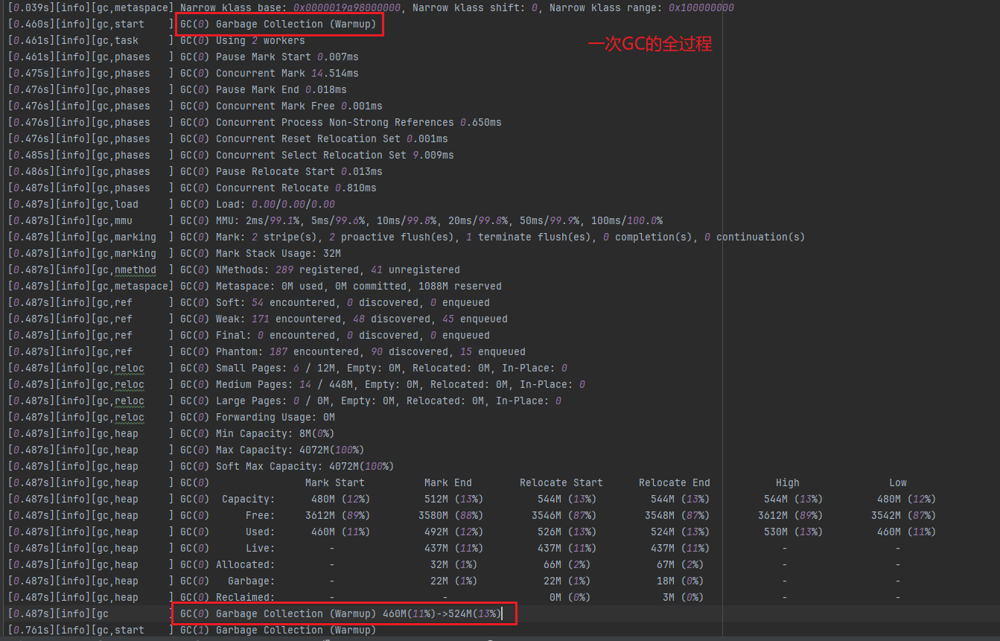

# 1、java程序(使用TencentKona-17.0.11.b1_jdk)

```java
public class ZGCExample {
    public static void main(String[] args) {
        List<byte[]> memoryHog = new ArrayList<>();
        int k = 1;
        while (true) {
            for (int i = 0; i < 1000; i++) {
                // 分配1MB的数组
                byte[] array = new byte[1024 * 1024];
                memoryHog.add(array);
            }
            System.out.println("第" + k++ + "分配1M内存" + "List 大小：" + memoryHog.size());
            // 模拟内存使用情况
            if (memoryHog.size() > 1000) {
                memoryHog.subList(0, 500).clear();
            }

            try {
                // 暂停一段时间，模拟应用程序的其他工作
                Thread.sleep(100);
            } catch (InterruptedException e) {
                e.printStackTrace();
            }
        }
    }
}
```

# 2、java命令

```
-XX:+UseZGC   
-Xlog:gc*:file=gc.log  
```

命令解释：

```angular2html
-XX:+UseZGC             //启用Z垃圾收集器（ZGC）
-Xlog:gc*:file=gc.log  //启用GC日志记录，并将所有GC相关的信息记录到文件gc.log中
```

# 3、运行结果


# 4、GC日志部分分析

<details>
    <summary>gc.log日志</summary>

```log
[0.018s][info][gc,init] Initializing The Z Garbage Collector
[0.018s][info][gc,init] Version: 17.0.2+8-86 (release)
[0.018s][info][gc,init] NUMA Support: Disabled
[0.018s][info][gc,init] CPUs: 8 total, 8 available
[0.018s][info][gc,init] Memory: 16281M
[0.018s][info][gc,init] Large Page Support: Disabled
[0.019s][info][gc,init] GC Workers: 2 (dynamic)
[0.019s][info][gc,init] Address Space Type: Contiguous/Unrestricted/Complete
[0.019s][info][gc,init] Address Space Size: 65152M x 3 = 195456M
[0.019s][info][gc,init] Min Capacity: 8M
[0.019s][info][gc,init] Initial Capacity: 256M
[0.019s][info][gc,init] Max Capacity: 4072M
[0.019s][info][gc,init] Medium Page Size: 32M
[0.019s][info][gc,init] Pre-touch: Disabled
[0.020s][info][gc,init] Uncommit: Enabled
[0.020s][info][gc,init] Uncommit Delay: 300s
[0.037s][info][gc,init] Runtime Workers: 5
[0.038s][info][gc     ] Using The Z Garbage Collector
[0.039s][info][gc,metaspace] CDS archive(s) mapped at: [0x0000000800000000-0x0000000800bc0000-0x0000000800bc0000), size 12320768, SharedBaseAddress: 0x0000000800000000, ArchiveRelocationMode: 0.
[0.039s][info][gc,metaspace] Compressed class space mapped at: 0x0000000800c00000-0x0000000840c00000, reserved size: 1073741824
[0.039s][info][gc,metaspace] Narrow klass base: 0x0000000800000000, Narrow klass shift: 0, Narrow klass range: 0x100000000
[0.468s][info][gc,start    ] GC(0) Garbage Collection (Warmup)
[0.468s][info][gc,task     ] GC(0) Using 2 workers
[0.468s][info][gc,phases   ] GC(0) Pause Mark Start 0.009ms
[0.484s][info][gc,phases   ] GC(0) Concurrent Mark 15.559ms
[0.484s][info][gc,phases   ] GC(0) Pause Mark End 0.015ms
[0.484s][info][gc,phases   ] GC(0) Concurrent Mark Free 0.001ms
[0.484s][info][gc,phases   ] GC(0) Concurrent Process Non-Strong References 0.514ms
[0.484s][info][gc,phases   ] GC(0) Concurrent Reset Relocation Set 0.000ms
[0.497s][info][gc,phases   ] GC(0) Concurrent Select Relocation Set 12.145ms
[0.497s][info][gc,phases   ] GC(0) Pause Relocate Start 0.012ms
[0.498s][info][gc,phases   ] GC(0) Concurrent Relocate 1.003ms
[0.498s][info][gc,load     ] GC(0) Load: 0.00/0.00/0.00
[0.498s][info][gc,mmu      ] GC(0) MMU: 2ms/99.3%, 5ms/99.7%, 10ms/99.9%, 20ms/99.9%, 50ms/99.9%, 100ms/100.0%
[0.498s][info][gc,marking  ] GC(0) Mark: 2 stripe(s), 2 proactive flush(es), 1 terminate flush(es), 0 completion(s), 0 continuation(s) 
[0.498s][info][gc,marking  ] GC(0) Mark Stack Usage: 32M
[0.498s][info][gc,nmethod  ] GC(0) NMethods: 289 registered, 0 unregistered
[0.498s][info][gc,metaspace] GC(0) Metaspace: 0M used, 0M committed, 1032M reserved
[0.498s][info][gc,ref      ] GC(0) Soft: 45 encountered, 0 discovered, 0 enqueued
[0.498s][info][gc,ref      ] GC(0) Weak: 132 encountered, 33 discovered, 32 enqueued
[0.498s][info][gc,ref      ] GC(0) Final: 0 encountered, 0 discovered, 0 enqueued
[0.498s][info][gc,ref      ] GC(0) Phantom: 196 encountered, 136 discovered, 24 enqueued
[0.498s][info][gc,reloc    ] GC(0) Small Pages: 5 / 10M, Empty: 0M, Relocated: 0M, In-Place: 0
[0.498s][info][gc,reloc    ] GC(0) Medium Pages: 15 / 480M, Empty: 0M, Relocated: 0M, In-Place: 0
[0.498s][info][gc,reloc    ] GC(0) Large Pages: 0 / 0M, Empty: 0M, Relocated: 0M, In-Place: 0
[0.498s][info][gc,reloc    ] GC(0) Forwarding Usage: 0M
[0.498s][info][gc,heap     ] GC(0) Min Capacity: 8M(0%)
[0.498s][info][gc,heap     ] GC(0) Max Capacity: 4072M(100%)
[0.498s][info][gc,heap     ] GC(0) Soft Max Capacity: 4072M(100%)
[0.498s][info][gc,heap     ] GC(0)                Mark Start          Mark End        Relocate Start      Relocate End           High               Low         
[0.498s][info][gc,heap     ] GC(0)  Capacity:      512M (13%)         544M (13%)         576M (14%)         576M (14%)         576M (14%)         512M (13%)    
[0.498s][info][gc,heap     ] GC(0)      Free:     3582M (88%)        3550M (87%)        3518M (86%)        3518M (86%)        3582M (88%)        3512M (86%)    
[0.498s][info][gc,heap     ] GC(0)      Used:      490M (12%)         522M (13%)         554M (14%)         554M (14%)         560M (14%)         490M (12%)    
[0.498s][info][gc,heap     ] GC(0)      Live:         -               449M (11%)         449M (11%)         449M (11%)            -                  -          
[0.498s][info][gc,heap     ] GC(0) Allocated:         -                32M (1%)           64M (2%)           65M (2%)             -                  -          
[0.498s][info][gc,heap     ] GC(0)   Garbage:         -                40M (1%)           40M (1%)           38M (1%)             -                  -          
[0.498s][info][gc,heap     ] GC(0) Reclaimed:         -                  -                 0M (0%)            1M (0%)             -                  -          
[0.498s][info][gc          ] GC(0) Garbage Collection (Warmup) 490M(12%)->554M(14%)
[0.781s][info][gc,start    ] GC(1) Garbage Collection (Warmup)
[0.781s][info][gc,task     ] GC(1) Using 2 workers
[0.781s][info][gc,phases   ] GC(1) Pause Mark Start 0.010ms
[0.797s][info][gc,phases   ] GC(1) Concurrent Mark 15.695ms
[0.797s][info][gc,phases   ] GC(1) Pause Mark End 0.014ms
[0.797s][info][gc,phases   ] GC(1) Concurrent Mark Free 0.001ms
[0.797s][info][gc,phases   ] GC(1) Concurrent Process Non-Strong References 0.451ms
[0.797s][info][gc,phases   ] GC(1) Concurrent Reset Relocation Set 0.001ms
[0.799s][info][gc,phases   ] GC(1) Concurrent Select Relocation Set 1.567ms
[0.799s][info][gc,phases   ] GC(1) Pause Relocate Start 0.013ms
[0.800s][info][gc,phases   ] GC(1) Concurrent Relocate 0.606ms
[0.800s][info][gc,load     ] GC(1) Load: 0.00/0.00/0.00
[0.800s][info][gc,mmu      ] GC(1) MMU: 2ms/99.3%, 5ms/99.5%, 10ms/99.7%, 20ms/99.8%, 50ms/99.9%, 100ms/100.0%
[0.800s][info][gc,marking  ] GC(1) Mark: 2 stripe(s), 2 proactive flush(es), 1 terminate flush(es), 0 completion(s), 0 continuation(s) 
[0.800s][info][gc,marking  ] GC(1) Mark Stack Usage: 32M
[0.800s][info][gc,nmethod  ] GC(1) NMethods: 289 registered, 0 unregistered
[0.800s][info][gc,metaspace] GC(1) Metaspace: 0M used, 0M committed, 1032M reserved
[0.800s][info][gc,ref      ] GC(1) Soft: 45 encountered, 0 discovered, 0 enqueued
[0.800s][info][gc,ref      ] GC(1) Weak: 100 encountered, 37 discovered, 0 enqueued
[0.800s][info][gc,ref      ] GC(1) Final: 0 encountered, 0 discovered, 0 enqueued
[0.800s][info][gc,ref      ] GC(1) Phantom: 172 encountered, 112 discovered, 0 enqueued
[0.800s][info][gc,reloc    ] GC(1) Small Pages: 5 / 10M, Empty: 0M, Relocated: 0M, In-Place: 0
[0.800s][info][gc,reloc    ] GC(1) Medium Pages: 29 / 928M, Empty: 0M, Relocated: 0M, In-Place: 0
[0.800s][info][gc,reloc    ] GC(1) Large Pages: 0 / 0M, Empty: 0M, Relocated: 0M, In-Place: 0
[0.800s][info][gc,reloc    ] GC(1) Forwarding Usage: 0M
[0.800s][info][gc,heap     ] GC(1) Min Capacity: 8M(0%)
[0.800s][info][gc,heap     ] GC(1) Max Capacity: 4072M(100%)
[0.800s][info][gc,heap     ] GC(1) Soft Max Capacity: 4072M(100%)
[0.800s][info][gc,heap     ] GC(1)                Mark Start          Mark End        Relocate Start      Relocate End           High               Low         
[0.800s][info][gc,heap     ] GC(1)  Capacity:      960M (24%)         992M (24%)         992M (24%)         992M (24%)         992M (24%)         960M (24%)    
[0.800s][info][gc,heap     ] GC(1)      Free:     3134M (77%)        3102M (76%)        3102M (76%)        3102M (76%)        3134M (77%)        3096M (76%)    
[0.800s][info][gc,heap     ] GC(1)      Used:      938M (23%)         970M (24%)         970M (24%)         970M (24%)         976M (24%)         938M (23%)    
[0.800s][info][gc,heap     ] GC(1)      Live:         -               881M (22%)         881M (22%)         881M (22%)            -                  -          
[0.800s][info][gc,heap     ] GC(1) Allocated:         -                32M (1%)           32M (1%)           33M (1%)             -                  -          
[0.800s][info][gc,heap     ] GC(1)   Garbage:         -                56M (1%)           56M (1%)           54M (1%)             -                  -          
[0.800s][info][gc,heap     ] GC(1) Reclaimed:         -                  -                 0M (0%)            1M (0%)             -                  -          
[0.800s][info][gc          ] GC(1) Garbage Collection (Warmup) 938M(23%)->970M(24%)
[1.171s][info][gc,start    ] GC(2) Garbage Collection (Warmup)
[1.171s][info][gc,task     ] GC(2) Using 2 workers
[1.171s][info][gc,phases   ] GC(2) Pause Mark Start 0.008ms
[1.187s][info][gc,phases   ] GC(2) Concurrent Mark 15.635ms
[1.187s][info][gc,phases   ] GC(2) Pause Mark End 0.014ms
[1.187s][info][gc,phases   ] GC(2) Concurrent Mark Free 0.001ms
[1.187s][info][gc,phases   ] GC(2) Concurrent Process Non-Strong References 0.474ms
[1.187s][info][gc,phases   ] GC(2) Concurrent Reset Relocation Set 0.001ms
[1.190s][info][gc,phases   ] GC(2) Concurrent Select Relocation Set 2.023ms
[1.190s][info][gc,phases   ] GC(2) Pause Relocate Start 0.010ms
[1.200s][info][gc,phases   ] GC(2) Concurrent Relocate 10.026ms
[1.200s][info][gc,load     ] GC(2) Load: 0.00/0.00/0.00
[1.200s][info][gc,mmu      ] GC(2) MMU: 2ms/99.3%, 5ms/99.5%, 10ms/99.7%, 20ms/99.8%, 50ms/99.9%, 100ms/100.0%
[1.200s][info][gc,marking  ] GC(2) Mark: 2 stripe(s), 2 proactive flush(es), 1 terminate flush(es), 0 completion(s), 0 continuation(s) 
[1.200s][info][gc,marking  ] GC(2) Mark Stack Usage: 32M
[1.200s][info][gc,nmethod  ] GC(2) NMethods: 347 registered, 0 unregistered
[1.200s][info][gc,metaspace] GC(2) Metaspace: 1M used, 1M committed, 1032M reserved
[1.200s][info][gc,ref      ] GC(2) Soft: 85 encountered, 0 discovered, 0 enqueued
[1.200s][info][gc,ref      ] GC(2) Weak: 121 encountered, 5 discovered, 5 enqueued
[1.200s][info][gc,ref      ] GC(2) Final: 0 encountered, 0 discovered, 0 enqueued
[1.200s][info][gc,ref      ] GC(2) Phantom: 177 encountered, 117 discovered, 5 enqueued
[1.200s][info][gc,reloc    ] GC(2) Small Pages: 7 / 14M, Empty: 0M, Relocated: 1M, In-Place: 0
[1.200s][info][gc,reloc    ] GC(2) Medium Pages: 42 / 1344M, Empty: 0M, Relocated: 16M, In-Place: 0
[1.200s][info][gc,reloc    ] GC(2) Large Pages: 0 / 0M, Empty: 0M, Relocated: 0M, In-Place: 0
[1.200s][info][gc,reloc    ] GC(2) Forwarding Usage: 0M
[1.200s][info][gc,heap     ] GC(2) Min Capacity: 8M(0%)
[1.200s][info][gc,heap     ] GC(2) Max Capacity: 4072M(100%)
[1.200s][info][gc,heap     ] GC(2) Soft Max Capacity: 4072M(100%)
[1.200s][info][gc,heap     ] GC(2)                Mark Start          Mark End        Relocate Start      Relocate End           High               Low         
[1.200s][info][gc,heap     ] GC(2)  Capacity:     1376M (34%)        1408M (35%)        1408M (35%)        1472M (36%)        1472M (36%)        1376M (34%)    
[1.200s][info][gc,heap     ] GC(2)      Free:     2714M (67%)        2682M (66%)        2682M (66%)        2688M (66%)        2714M (67%)        2616M (64%)    
[1.200s][info][gc,heap     ] GC(2)      Used:     1358M (33%)        1390M (34%)        1390M (34%)        1384M (34%)        1456M (36%)        1358M (33%)    
[1.200s][info][gc,heap     ] GC(2)      Live:         -              1261M (31%)        1261M (31%)        1261M (31%)            -                  -          
[1.200s][info][gc,heap     ] GC(2) Allocated:         -                32M (1%)           32M (1%)           65M (2%)             -                  -          
[1.200s][info][gc,heap     ] GC(2)   Garbage:         -                96M (2%)           96M (2%)           56M (1%)             -                  -          
[1.200s][info][gc,heap     ] GC(2) Reclaimed:         -                  -                 0M (0%)           39M (1%)             -                  -          
[1.200s][info][gc          ] GC(2) Garbage Collection (Warmup) 1358M(33%)->1384M(34%)
[2.767s][info][gc,start    ] GC(3) Garbage Collection (Allocation Rate)
[2.767s][info][gc,task     ] GC(3) Using 1 workers
[2.767s][info][gc,phases   ] GC(3) Pause Mark Start 0.010ms
[2.780s][info][gc,phases   ] GC(3) Concurrent Mark 12.778ms
[2.781s][info][gc,phases   ] GC(3) Pause Mark End 0.025ms
[2.781s][info][gc,phases   ] GC(3) Concurrent Mark Free 0.001ms
[2.782s][info][gc,phases   ] GC(3) Concurrent Process Non-Strong References 1.244ms
[2.782s][info][gc,phases   ] GC(3) Concurrent Reset Relocation Set 0.002ms
[2.784s][info][gc,phases   ] GC(3) Concurrent Select Relocation Set 1.979ms
[2.784s][info][gc,phases   ] GC(3) Pause Relocate Start 0.006ms
[2.788s][info][gc,phases   ] GC(3) Concurrent Relocate 3.182ms
[2.788s][info][gc,load     ] GC(3) Load: 0.00/0.00/0.00
[2.788s][info][gc,mmu      ] GC(3) MMU: 2ms/98.8%, 5ms/99.4%, 10ms/99.7%, 20ms/99.8%, 50ms/99.9%, 100ms/100.0%
[2.788s][info][gc,marking  ] GC(3) Mark: 1 stripe(s), 2 proactive flush(es), 1 terminate flush(es), 0 completion(s), 0 continuation(s) 
[2.788s][info][gc,marking  ] GC(3) Mark Stack Usage: 32M
[2.788s][info][gc,nmethod  ] GC(3) NMethods: 347 registered, 0 unregistered
[2.788s][info][gc,metaspace] GC(3) Metaspace: 1M used, 1M committed, 1032M reserved
[2.788s][info][gc,ref      ] GC(3) Soft: 85 encountered, 0 discovered, 0 enqueued
[2.788s][info][gc,ref      ] GC(3) Weak: 116 encountered, 0 discovered, 0 enqueued
[2.788s][info][gc,ref      ] GC(3) Final: 0 encountered, 0 discovered, 0 enqueued
[2.788s][info][gc,ref      ] GC(3) Phantom: 172 encountered, 86 discovered, 0 enqueued
[2.788s][info][gc,reloc    ] GC(3) Small Pages: 4 / 8M, Empty: 0M, Relocated: 1M, In-Place: 0
[2.788s][info][gc,reloc    ] GC(3) Medium Pages: 116 / 3712M, Empty: 992M, Relocated: 8M, In-Place: 0
[2.788s][info][gc,reloc    ] GC(3) Large Pages: 0 / 0M, Empty: 0M, Relocated: 0M, In-Place: 0
[2.788s][info][gc,reloc    ] GC(3) Forwarding Usage: 0M
[2.788s][info][gc,heap     ] GC(3) Min Capacity: 8M(0%)
[2.788s][info][gc,heap     ] GC(3) Max Capacity: 4072M(100%)
[2.788s][info][gc,heap     ] GC(3) Soft Max Capacity: 4072M(100%)
[2.788s][info][gc,heap     ] GC(3)                Mark Start          Mark End        Relocate Start      Relocate End           High               Low         
[2.788s][info][gc,heap     ] GC(3)  Capacity:     3744M (92%)        3776M (93%)        3776M (93%)        3776M (93%)        3776M (93%)        3744M (92%)    
[2.788s][info][gc,heap     ] GC(3)      Free:      352M (9%)          320M (8%)         1312M (32%)        1376M (34%)        1376M (34%)         320M (8%)     
[2.788s][info][gc,heap     ] GC(3)      Used:     3720M (91%)        3752M (92%)        2760M (68%)        2696M (66%)        3752M (92%)        2696M (66%)    
[2.788s][info][gc,heap     ] GC(3)      Live:         -              2562M (63%)        2562M (63%)        2562M (63%)            -                  -          
[2.788s][info][gc,heap     ] GC(3) Allocated:         -                32M (1%)           32M (1%)           33M (1%)             -                  -          
[2.788s][info][gc,heap     ] GC(3)   Garbage:         -              1157M (28%)         165M (4%)           99M (2%)             -                  -          
[2.788s][info][gc,heap     ] GC(3) Reclaimed:         -                  -               992M (24%)        1057M (26%)            -                  -          
[2.788s][info][gc          ] GC(3) Garbage Collection (Allocation Rate) 3720M(91%)->2696M(66%)
[3.066s][info][gc,start    ] GC(4) Garbage Collection (Allocation Rate)
[3.066s][info][gc,task     ] GC(4) Using 1 workers
[3.066s][info][gc,phases   ] GC(4) Pause Mark Start 0.007ms
[3.078s][info][gc,phases   ] GC(4) Concurrent Mark 12.059ms
[3.078s][info][gc,phases   ] GC(4) Pause Mark End 0.009ms
[3.078s][info][gc,phases   ] GC(4) Concurrent Mark Free 0.001ms
[3.079s][info][gc,phases   ] GC(4) Concurrent Process Non-Strong References 0.964ms
[3.079s][info][gc,phases   ] GC(4) Concurrent Reset Relocation Set 0.001ms
[3.083s][info][gc,phases   ] GC(4) Concurrent Select Relocation Set 3.275ms
[3.083s][info][gc,phases   ] GC(4) Pause Relocate Start 0.009ms
[3.088s][info][gc,phases   ] GC(4) Concurrent Relocate 5.406ms
[3.088s][info][gc,load     ] GC(4) Load: 0.00/0.00/0.00
[3.088s][info][gc,mmu      ] GC(4) MMU: 2ms/98.8%, 5ms/99.4%, 10ms/99.7%, 20ms/99.8%, 50ms/99.9%, 100ms/100.0%
[3.088s][info][gc,marking  ] GC(4) Mark: 1 stripe(s), 2 proactive flush(es), 1 terminate flush(es), 0 completion(s), 0 continuation(s) 
[3.089s][info][gc,marking  ] GC(4) Mark Stack Usage: 32M
[3.089s][info][gc,nmethod  ] GC(4) NMethods: 347 registered, 0 unregistered
[3.089s][info][gc,metaspace] GC(4) Metaspace: 1M used, 1M committed, 1032M reserved
[3.089s][info][gc,ref      ] GC(4) Soft: 85 encountered, 0 discovered, 0 enqueued
[3.089s][info][gc,ref      ] GC(4) Weak: 116 encountered, 0 discovered, 0 enqueued
[3.089s][info][gc,ref      ] GC(4) Final: 0 encountered, 0 discovered, 0 enqueued
[3.089s][info][gc,ref      ] GC(4) Phantom: 172 encountered, 86 discovered, 0 enqueued
[3.089s][info][gc,reloc    ] GC(4) Small Pages: 4 / 8M, Empty: 0M, Relocated: 1M, In-Place: 0
[3.089s][info][gc,reloc    ] GC(4) Medium Pages: 118 / 3776M, Empty: 512M, Relocated: 15M, In-Place: 0
[3.089s][info][gc,reloc    ] GC(4) Large Pages: 0 / 0M, Empty: 0M, Relocated: 0M, In-Place: 0
[3.089s][info][gc,reloc    ] GC(4) Forwarding Usage: 0M
[3.089s][info][gc,heap     ] GC(4) Min Capacity: 8M(0%)
[3.089s][info][gc,heap     ] GC(4) Max Capacity: 4072M(100%)
[3.089s][info][gc,heap     ] GC(4) Soft Max Capacity: 4072M(100%)
[3.089s][info][gc,heap     ] GC(4)                Mark Start          Mark End        Relocate Start      Relocate End           High               Low         
[3.089s][info][gc,heap     ] GC(4)  Capacity:     3808M (94%)        3840M (94%)        3840M (94%)        3840M (94%)        3840M (94%)        3808M (94%)    
[3.089s][info][gc,heap     ] GC(4)      Free:      288M (7%)          256M (6%)          768M (19%)         800M (20%)         800M (20%)         256M (6%)     
[3.089s][info][gc,heap     ] GC(4)      Used:     3784M (93%)        3816M (94%)        3304M (81%)        3272M (80%)        3816M (94%)        3272M (80%)    
[3.089s][info][gc,heap     ] GC(4)      Live:         -              3131M (77%)        3131M (77%)        3131M (77%)            -                  -          
[3.089s][info][gc,heap     ] GC(4) Allocated:         -                32M (1%)           32M (1%)           33M (1%)             -                  -          
[3.089s][info][gc,heap     ] GC(4)   Garbage:         -               652M (16%)         140M (3%)          106M (3%)             -                  -          
[3.089s][info][gc,heap     ] GC(4) Reclaimed:         -                  -               512M (13%)         545M (13%)            -                  -          
[3.089s][info][gc          ] GC(4) Garbage Collection (Allocation Rate) 3784M(93%)->3272M(80%)
[3.176s][info][gc,start    ] GC(5) Garbage Collection (Allocation Rate)
[3.176s][info][gc,task     ] GC(5) Using 1 workers
[3.176s][info][gc,phases   ] GC(5) Pause Mark Start 0.020ms
[3.182s][info][gc,phases   ] GC(5) Concurrent Mark 5.505ms
[3.182s][info][gc,phases   ] GC(5) Pause Mark End 0.014ms
[3.182s][info][gc,phases   ] GC(5) Concurrent Mark Free 0.001ms
[3.182s][info][gc,phases   ] GC(5) Concurrent Process Non-Strong References 0.667ms
[3.182s][info][gc,phases   ] GC(5) Concurrent Reset Relocation Set 0.001ms
[3.184s][info][gc,phases   ] GC(5) Concurrent Select Relocation Set 1.555ms
[3.184s][info][gc,phases   ] GC(5) Pause Relocate Start 0.006ms
[3.185s][info][gc,phases   ] GC(5) Concurrent Relocate 0.777ms
[3.185s][info][gc,load     ] GC(5) Load: 0.00/0.00/0.00
[3.185s][info][gc,mmu      ] GC(5) MMU: 2ms/98.8%, 5ms/99.4%, 10ms/99.6%, 20ms/99.8%, 50ms/99.9%, 100ms/100.0%
[3.185s][info][gc,marking  ] GC(5) Mark: 1 stripe(s), 1 proactive flush(es), 1 terminate flush(es), 0 completion(s), 0 continuation(s) 
[3.185s][info][gc,marking  ] GC(5) Mark Stack Usage: 32M
[3.185s][info][gc,nmethod  ] GC(5) NMethods: 347 registered, 0 unregistered
[3.185s][info][gc,metaspace] GC(5) Metaspace: 1M used, 1M committed, 1032M reserved
[3.185s][info][gc,ref      ] GC(5) Soft: 85 encountered, 0 discovered, 0 enqueued
[3.185s][info][gc,ref      ] GC(5) Weak: 116 encountered, 0 discovered, 0 enqueued
[3.185s][info][gc,ref      ] GC(5) Final: 0 encountered, 0 discovered, 0 enqueued
[3.185s][info][gc,ref      ] GC(5) Phantom: 172 encountered, 86 discovered, 0 enqueued
[3.185s][info][gc,reloc    ] GC(5) Small Pages: 4 / 8M, Empty: 0M, Relocated: 1M, In-Place: 0
[3.185s][info][gc,reloc    ] GC(5) Medium Pages: 114 / 3648M, Empty: 512M, Relocated: 0M, In-Place: 0
[3.185s][info][gc,reloc    ] GC(5) Large Pages: 0 / 0M, Empty: 0M, Relocated: 0M, In-Place: 0
[3.185s][info][gc,reloc    ] GC(5) Forwarding Usage: 0M
[3.185s][info][gc,heap     ] GC(5) Min Capacity: 8M(0%)
[3.185s][info][gc,heap     ] GC(5) Max Capacity: 4072M(100%)
[3.185s][info][gc,heap     ] GC(5) Soft Max Capacity: 4072M(100%)
[3.185s][info][gc,heap     ] GC(5)                Mark Start          Mark End        Relocate Start      Relocate End           High               Low         
[3.185s][info][gc,heap     ] GC(5)  Capacity:     3840M (94%)        3840M (94%)        3840M (94%)        3840M (94%)        3840M (94%)        3840M (94%)    
[3.185s][info][gc,heap     ] GC(5)      Free:      416M (10%)         416M (10%)         928M (23%)         930M (23%)         930M (23%)         416M (10%)    
[3.185s][info][gc,heap     ] GC(5)      Used:     3656M (90%)        3656M (90%)        3144M (77%)        3142M (77%)        3656M (90%)        3142M (77%)    
[3.185s][info][gc,heap     ] GC(5)      Live:         -              3016M (74%)        3016M (74%)        3016M (74%)            -                  -          
[3.185s][info][gc,heap     ] GC(5) Allocated:         -                 0M (0%)            0M (0%)            0M (0%)             -                  -          
[3.185s][info][gc,heap     ] GC(5)   Garbage:         -               639M (16%)         127M (3%)          125M (3%)             -                  -          
[3.185s][info][gc,heap     ] GC(5) Reclaimed:         -                  -               512M (13%)         514M (13%)            -                  -          
[3.185s][info][gc          ] GC(5) Garbage Collection (Allocation Rate) 3656M(90%)->3142M(77%)
[3.379s][info][gc,start    ] GC(6) Garbage Collection (Allocation Rate)
[3.379s][info][gc,task     ] GC(6) Using 2 workers
[3.380s][info][gc,phases   ] GC(6) Pause Mark Start 0.005ms
[3.394s][info][gc,phases   ] GC(6) Concurrent Mark 14.186ms
[3.394s][info][gc,phases   ] GC(6) Pause Mark End 0.014ms
[3.394s][info][gc,phases   ] GC(6) Concurrent Mark Free 0.001ms
[3.395s][info][gc,phases   ] GC(6) Concurrent Process Non-Strong References 0.785ms
[3.395s][info][gc,phases   ] GC(6) Concurrent Reset Relocation Set 0.002ms
[3.397s][info][gc,phases   ] GC(6) Concurrent Select Relocation Set 1.797ms
[3.397s][info][gc,phases   ] GC(6) Pause Relocate Start 0.006ms
[3.409s][info][gc,phases   ] GC(6) Concurrent Relocate 11.921ms
[3.409s][info][gc,load     ] GC(6) Load: 0.00/0.00/0.00
[3.409s][info][gc,mmu      ] GC(6) MMU: 2ms/98.8%, 5ms/99.4%, 10ms/99.6%, 20ms/99.8%, 50ms/99.9%, 100ms/100.0%
[3.409s][info][gc,marking  ] GC(6) Mark: 2 stripe(s), 2 proactive flush(es), 1 terminate flush(es), 0 completion(s), 0 continuation(s) 
[3.409s][info][gc,marking  ] GC(6) Mark Stack Usage: 32M
[3.409s][info][gc,nmethod  ] GC(6) NMethods: 348 registered, 0 unregistered
[3.409s][info][gc,metaspace] GC(6) Metaspace: 1M used, 1M committed, 1032M reserved
[3.409s][info][gc,ref      ] GC(6) Soft: 85 encountered, 0 discovered, 0 enqueued
[3.409s][info][gc,ref      ] GC(6) Weak: 116 encountered, 92 discovered, 0 enqueued
[3.409s][info][gc,ref      ] GC(6) Final: 0 encountered, 0 discovered, 0 enqueued
[3.409s][info][gc,ref      ] GC(6) Phantom: 172 encountered, 154 discovered, 0 enqueued
[3.410s][info][gc,reloc    ] GC(6) Small Pages: 4 / 8M, Empty: 0M, Relocated: 1M, In-Place: 0
[3.410s][info][gc,reloc    ] GC(6) Medium Pages: 124 / 3968M, Empty: 0M, Relocated: 14M, In-Place: 0
[3.410s][info][gc,reloc    ] GC(6) Large Pages: 0 / 0M, Empty: 0M, Relocated: 0M, In-Place: 0
[3.410s][info][gc,reloc    ] GC(6) Forwarding Usage: 0M
[3.410s][info][gc,heap     ] GC(6) Min Capacity: 8M(0%)
[3.410s][info][gc,heap     ] GC(6) Max Capacity: 4072M(100%)
[3.410s][info][gc,heap     ] GC(6) Soft Max Capacity: 4072M(100%)
[3.410s][info][gc,heap     ] GC(6)                Mark Start          Mark End        Relocate Start      Relocate End           High               Low         
[3.410s][info][gc,heap     ] GC(6)  Capacity:     4000M (98%)        4032M (99%)        4032M (99%)        4064M (100%)       4064M (100%)       4000M (98%)    
[3.410s][info][gc,heap     ] GC(6)      Free:       96M (2%)           64M (2%)           64M (2%)           64M (2%)           96M (2%)           30M (1%)     
[3.410s][info][gc,heap     ] GC(6)      Used:     3976M (98%)        4008M (98%)        4008M (98%)        4008M (98%)        4042M (99%)        3976M (98%)    
[3.410s][info][gc,heap     ] GC(6)      Live:         -              3795M (93%)        3795M (93%)        3795M (93%)            -                  -          
[3.410s][info][gc,heap     ] GC(6) Allocated:         -                32M (1%)           32M (1%)           65M (2%)             -                  -          
[3.410s][info][gc,heap     ] GC(6)   Garbage:         -               180M (4%)          180M (4%)          146M (4%)             -                  -          
[3.410s][info][gc,heap     ] GC(6) Reclaimed:         -                  -                 0M (0%)           33M (1%)             -                  -          
[3.410s][info][gc          ] GC(6) Garbage Collection (Allocation Rate) 3976M(98%)->4008M(98%)
[3.449s][info][gc,start    ] GC(7) Garbage Collection (Allocation Stall)
[3.449s][info][gc,ref      ] GC(7) Clearing All SoftReferences
[3.449s][info][gc,task     ] GC(7) Using 2 workers
[3.449s][info][gc,phases   ] GC(7) Pause Mark Start 0.006ms
[3.457s][info][gc,phases   ] GC(7) Concurrent Mark 8.020ms
[3.457s][info][gc,phases   ] GC(7) Pause Mark End 0.008ms
[3.457s][info][gc,phases   ] GC(7) Concurrent Mark Free 0.001ms
[3.458s][info][gc,phases   ] GC(7) Concurrent Process Non-Strong References 0.758ms
[3.458s][info][gc,phases   ] GC(7) Concurrent Reset Relocation Set 0.001ms
[3.460s][info][gc,phases   ] GC(7) Concurrent Select Relocation Set 1.592ms
[3.460s][info][gc,phases   ] GC(7) Pause Relocate Start 0.004ms
[3.461s][info][gc,phases   ] GC(7) Concurrent Relocate 0.776ms
[3.461s][info][gc,load     ] GC(7) Load: 0.00/0.00/0.00
[3.461s][info][gc,mmu      ] GC(7) MMU: 2ms/98.8%, 5ms/99.4%, 10ms/99.6%, 20ms/99.8%, 50ms/99.9%, 100ms/100.0%
[3.461s][info][gc,marking  ] GC(7) Mark: 2 stripe(s), 1 proactive flush(es), 1 terminate flush(es), 0 completion(s), 0 continuation(s) 
[3.461s][info][gc,marking  ] GC(7) Mark Stack Usage: 32M
[3.461s][info][gc,nmethod  ] GC(7) NMethods: 348 registered, 0 unregistered
[3.461s][info][gc,metaspace] GC(7) Metaspace: 1M used, 1M committed, 1032M reserved
[3.461s][info][gc,ref      ] GC(7) Soft: 85 encountered, 55 discovered, 43 enqueued
[3.461s][info][gc,ref      ] GC(7) Weak: 116 encountered, 4 discovered, 0 enqueued
[3.461s][info][gc,ref      ] GC(7) Final: 0 encountered, 0 discovered, 0 enqueued
[3.461s][info][gc,ref      ] GC(7) Phantom: 172 encountered, 170 discovered, 0 enqueued
[3.461s][info][gc,reloc    ] GC(7) Small Pages: 4 / 8M, Empty: 0M, Relocated: 1M, In-Place: 1
[3.461s][info][gc,reloc    ] GC(7) Medium Pages: 127 / 4064M, Empty: 0M, Relocated: 0M, In-Place: 0
[3.461s][info][gc,reloc    ] GC(7) Large Pages: 0 / 0M, Empty: 0M, Relocated: 0M, In-Place: 0
[3.461s][info][gc,reloc    ] GC(7) Forwarding Usage: 0M
[3.461s][info][gc,heap     ] GC(7) Min Capacity: 8M(0%)
[3.461s][info][gc,heap     ] GC(7) Max Capacity: 4072M(100%)
[3.461s][info][gc,heap     ] GC(7) Soft Max Capacity: 4072M(100%)
[3.461s][info][gc,heap     ] GC(7)                Mark Start          Mark End        Relocate Start      Relocate End           High               Low         
[3.461s][info][gc,heap     ] GC(7)  Capacity:     4072M (100%)       4072M (100%)       4072M (100%)       4072M (100%)       4072M (100%)       4072M (100%)   
[3.461s][info][gc,heap     ] GC(7)      Free:        0M (0%)            0M (0%)            0M (0%)            2M (0%)            2M (0%)            0M (0%)     
[3.461s][info][gc,heap     ] GC(7)      Used:     4072M (100%)       4072M (100%)       4072M (100%)       4070M (100%)       4072M (100%)       4070M (100%)   
[3.461s][info][gc,heap     ] GC(7)      Live:         -              3919M (96%)        3919M (96%)        3919M (96%)            -                  -          
[3.461s][info][gc,heap     ] GC(7) Allocated:         -                 0M (0%)            0M (0%)            0M (0%)             -                  -          
[3.461s][info][gc,heap     ] GC(7)   Garbage:         -               152M (4%)          152M (4%)          150M (4%)             -                  -          
[3.461s][info][gc,heap     ] GC(7) Reclaimed:         -                  -                 0M (0%)            2M (0%)             -                  -          
[3.461s][info][gc          ] GC(7) Garbage Collection (Allocation Stall) 4072M(100%)->4070M(100%)
[3.461s][info][gc          ] Allocation Stall (main) 12.590ms
[3.461s][info][gc          ] Out Of Memory (main)
[3.462s][info][gc,heap,exit] Heap
[3.462s][info][gc,heap,exit]  ZHeap           used 4072M, capacity 4072M, max capacity 4072M
[3.462s][info][gc,heap,exit]  Metaspace       used 1039K, committed 1216K, reserved 1056768K
[3.462s][info][gc,heap,exit]   class space    used 77K, committed 192K, reserved 1048576K

```

</details>

## 1、基础信息分析

<details>
    <summary>基础日志（未涉及垃圾回收）</summary>

| 基础日志分析   |                                                                                                |
|----------|------------------------------------------------------------------------------------------------|
| 相对时间     | 日志内容及解释                                                                                        |
| [0.013s] | [gc,init] Initializing The Z Garbage  Collector：  JVM在启动0.013秒时开始初始化ZGC。                       |
| [0.014s] | [gc,init] Version: 21.0.3+9-LTS (release)：  使用的是Java 21的版本21.0.3+9-LTS（长期支持版本）。                |
| [0.014s] | [gc,init] Using legacy single-generation  mode：  使用传统的单代模式，这意味着不区分年轻代和老年代。                     |
| [0.014s] | [gc,init] NUMA Support: Disabled：  非统一内存访问（NUMA）支持被禁用。                                         |
| [0.014s] | [gc,init] CPUs: 8 total, 8 available：  系统有8个CPU核心，全部可用。                                        |
| [0.014s] | [gc,init] Memory: 16281M：  系统有16281MB（约15.9GB）的内存。                                             |
| [0.014s] | [gc,init] Large Page Support: Disabled：  大页内存支持被禁用。                                            |
| [0.014s] | [gc,init] GC Workers: 2 (dynamic)：  有2个动态分配的GC工作线程。                                            |
| [0.015s] | [gc,init] Address Space Type:  Contiguous/Unrestricted/Complete：  地址空间类型为连续、无限制、完整。            |
| [0.015s] | [gc,init] Address Space Size: 65152M x 3  = 195456M：  地址空间大小为65152MB x 3 = 195456MB（约190.5GB）。 |
| [0.015s] | [gc,init] Min Capacity: 8M：  最小堆容量为8MB。                                                        |
| [0.015s] | [gc,init] Initial Capacity: 256M：  初始堆容量为256MB。                                                |
| [0.015s] | [gc,init] Max Capacity: 4072M：  最大堆容量为4072MB（约3.98GB）。                                         |
| [0.015s] | [gc,init] Medium Page Size: 32M：  中等页面大小为32MB。                                                 |
| [0.015s] | [gc,init] Pre-touch: Disabled：  预触摸内存页面的功能被禁用。                                                 |
| [0.015s] | [gc,init] Uncommit: Enabled：  允许未使用的堆内存被操作系统回收。                                                |
| [0.015s] | [gc,init] Uncommit Delay: 300s：  未使用内存被回收前的延迟时间为300秒。                                          |
| [0.027s] | [gc,init] Runtime Workers: 5：  有5个运行时工作线程。                                                     |
| [0.028s] | [gc ] Using The Z Garbage Collector：  确认使用Z垃圾收集器。                                              |

</details>

## 2、垃圾回收日志
下图是一次GC的全过程

<details>
    <summary>垃圾回收过程日志</summary>

| GC日志分析                                     |                                                                                                                                                                                                                                                                                                                                                                                                                                                                                                                                                                                                                                                                                                                                                                                                                                                                      |
|--------------------------------------------|----------------------------------------------------------------------------------------------------------------------------------------------------------------------------------------------------------------------------------------------------------------------------------------------------------------------------------------------------------------------------------------------------------------------------------------------------------------------------------------------------------------------------------------------------------------------------------------------------------------------------------------------------------------------------------------------------------------------------------------------------------------------------------------------------------------------------------------------------------------------|
| GC启动：                                      |                                                                                                                                                                                                                                                                                                                                                                                                                                                                                                                                                                                                                                                                                                                                                                                                                                                                      |
| [0.460s]                                   | [gc,start] GC(0) Garbage Collection  (Warmup)<br> 在0.460秒时，JVM开始了一次垃圾收集（GC），这是一次预热（Warmup）GC。                                                                                                                                                                                                                                                                                                                                                                                                                                                                                                                                                                                                                                                                                                                                                                        |
| GC任务<br>                                   |                                                                                                                                                                                                                                                                                                                                                                                                                                                                                                                                                                                                                                                                                                                                                                                                                                                                      |
| [0.461s]                                   | [gc,task]  GC(0) Using 2 workers<br>使用了2个GC工作线程。                                                                                                                                                                                                                                                                                                                                                                                                                                                                                                                                                                                                                                                                                                                                                                                                                     |
| GC阶段<br>                                   |                                                                                                                                                                                                                                                                                                                                                                                                                                                                                                                                                                                                                                                                                                                                                                                                                                                                      |
| [0.461s]                                   | [gc,phases]  GC(0) Pause Mark Start 0.007ms<br>  标记阶段开始，暂停时间为0.007毫秒。                                                                                                                                                                                                                                                                                                                                                                                                                                                                                                                                                                                                                                                                                                                                                                                                |
| [0.475s]                                   | [gc,phases]  GC(0) Concurrent Mark 14.514ms<br>  并发标记阶段，耗时14.514毫秒。                                                                                                                                                                                                                                                                                                                                                                                                                                                                                                                                                                                                                                                                                                                                                                                                  |
| [0.476s]                                   | [gc,phases]  GC(0) Pause Mark End 0.018ms<br>  标记阶段结束，暂停时间为0.018毫秒。                                                                                                                                                                                                                                                                                                                                                                                                                                                                                                                                                                                                                                                                                                                                                                                                  |
| [0.476s]                                   | [gc,phases]  GC(0) Concurrent Process Non-Strong References 0.650ms<br>  并发处理非强引用阶段，耗时0.650毫秒。                                                                                                                                                                                                                                                                                                                                                                                                                                                                                                                                                                                                                                                                                                                                                                       |
| [0.476s]                                   | [gc,phases]  GC(0) Concurrent Reset Relocation Set 0.001ms<br>  并发重置重定位集阶段，耗时0.001毫秒。                                                                                                                                                                                                                                                                                                                                                                                                                                                                                                                                                                                                                                                                                                                                                                                |
| [0.485s]                                   | [gc,phases]  GC(0) Concurrent Select Relocation Set 9.009ms<br>  并发选择重定位集阶段，耗时9.009毫秒。                                                                                                                                                                                                                                                                                                                                                                                                                                                                                                                                                                                                                                                                                                                                                                               |
| [0.486s]                                   | [gc,phases]  GC(0) Pause Relocate Start 0.013ms<br>  重定位阶段开始，暂停时间为0.013毫秒。                                                                                                                                                                                                                                                                                                                                                                                                                                                                                                                                                                                                                                                                                                                                                                                           |
| [0.487s]                                   | [gc,phases]  GC(0) Concurrent Relocate 0.810ms<br>  并发重定位阶段，耗时0.810毫秒。                                                                                                                                                                                                                                                                                                                                                                                                                                                                                                                                                                                                                                                                                                                                                                                               |
| GC负载<br>                                   |                                                                                                                                                                                                                                                                                                                                                                                                                                                                                                                                                                                                                                                                                                                                                                                                                                                                      |
| [0.487s]                                   | [gc,load]  GC(0) Load: 0.00/0.00/0.00<br>  GC负载信息。                                                                                                                                                                                                                                                                                                                                                                                                                                                                                                                                                                                                                                                                                                                                                                                                                   |
| GC（Minimum  Mutator Utilisation）=非GC时间/时间片 |                                                                                                                                                                                                                                                                                                                                                                                                                                                                                                                                                                                                                                                                                                                                                                                                                                                                      |
| [0.487s]                                   | [gc,mmu]  GC(0) MMU: 2ms/99.1%, 5ms/99.6%, 10ms/99.8%, 20ms/99.8%, 50ms/99.9%,  100ms/100.0%<br>  是一个指标2ms/99.1%在 2 毫秒的时间片内，至少 99.1% 的时间用于应用程序线程的执行。                                                                                                                                                                                                                                                                                                                                                                                                                                                                                                                                                                                                                                                                                                                 |
| GC标记                                       |                                                                                                                                                                                                                                                                                                                                                                                                                                                                                                                                                                                                                                                                                                                                                                                                                                                                      |
| [0.487s]                                   | [gc,marking]  GC(0) Mark: 2 stripe(s), 2 proactive flush(es), 1 terminate flush(es), 0  completion(s), 0 continuation(s)<br>  2 stripe(s)：表示标记阶段分为两个条带（stri），每个条带是并行标记的pe一部分。  <br>2 proactive flush(es)：表示在标记过程中进行了两次主动刷新（flush），这通常是为了确保标记信息及时更新。<br>  1 terminate flush(es)：表示在标记阶段结束时进行了1次终止刷新，确保所有标记信息都已处理完毕。<br>  0 completion(s)：表示没有完成的标记任务。 <br> 0 continuation(s)：表示没有需要继续的标记任务。                                                                                                                                                                                                                                                                                                                                                                                                                                                                           |
| [0.487s]                                   | [gc,marking]  GC(0) Mark Stack Usage: 32M<br>  表示在标记阶段使用了 32MB 的标记栈（Mark Stack）。标记栈用于存储在标记过程中需要处理的对象引用。                                                                                                                                                                                                                                                                                                                                                                                                                                                                                                                                                                                                                                                                                                                                                              |
| GC方法<br>                                   |                                                                                                                                                                                                                                                                                                                                                                                                                                                                                                                                                                                                                                                                                                                                                                                                                                                                      |
| [0.487s]                                   | [gc,nmethod] GC(0) NMethods: 289  registered, 41 unregistered<br>  289 registered：当前注册的本地方法（NMethods）数量为 289，这些方法已经被编译并存储在代码缓存中，供 JVM 执行。  <br>41 unregistered：当前未注册的本地方法数量为 41，这些方法可能已经被移除或不再使用。                                                                                                                                                                                                                                                                                                                                                                                                                                                                                                                                                                                                                                                                    |
| 元空间<br>                                    |                                                                                                                                                                                                                                                                                                                                                                                                                                                                                                                                                                                                                                                                                                                                                                                                                                                                      |
| [0.487s]                                   | [gc,metaspace]  GC(0) Metaspace: 0M used, 0M committed, 1088M reserved<br>  0M used<br>当前没有使用的元空间（Metaspace）。  0M committed<br>当前没有分配的元空间。  1088M reserved<br>预留了 1088MB 的元空间。                                                                                                                                                                                                                                                                                                                                                                                                                                                                                                                                                                                                                                                                                       |
| 引用处理<br>                                   |                                                                                                                                                                                                                                                                                                                                                                                                                                                                                                                                                                                                                                                                                                                                                                                                                                                                      |
| [0.487s]                                   | [gc,ref] GC(0) Soft: 54 encountered, 0  discovered, 0 enqueued<br>[gc,ref] GC(0) Weak: 171 encountered, 48  discovered, 45 enqueued<br>[gc,ref] GC(0) Final: 0 encountered, 0  discovered, 0 enqueued<br>[gc,ref] GC(0) Phantom: 187 encountered,  90 discovered, 15 enqueued<br>软引用（Soft Reference）：<br>54 encountered：遇到了 54 个软引用。  0 discovered：发现了  0 个需要处理的软引用。  0 enqueued：入队了 0 个软引用。  <br/>弱引用（Weak Reference）：<br> 171 encountered：遇到了 171 个弱引用。  48 discovered：发现了  48 个需要处理的弱引用。  45 enqueued：入队了  45 个弱引用。  <br/>终结引用（Final Reference）：<br>  0 encountered：遇到了0  个终结引用。  0 discovered：发现了0  个需要处理的终结引用。  0 enqueued：入队了0 个终结引用。  <br/>虚引用（Phantom Reference）：<br>187 encountered：遇到了 187 个虚引用。  90 discovered：发现了  90 个需要处理的虚引用。  15 enqueued：入队了  15 个虚引用。  <br/>强引用是默认的引用类型，任何通过普通变量引用的对象都是强引用。强引用的对象在 GC  时不会被回收，除非没有任何强引用指向它们。因此，强引用不需要在 GC 日志中单独记录。 |
| 重定位<br>                                    |                                                                                                                                                                                                                                                                                                                                                                                                                                                                                                                                                                                                                                                                                                                                                                                                                                                                      |
| [0.487s]                                   | [gc,reloc]  GC(0) Small Pages: 6 / 12M, Empty: 0M, Relocated: 0M, In-Place: 0<br>[gc,reloc]  GC(0) Medium Pages: 14 / 448M, Empty: 0M, Relocated: 0M, In-Place: 0<br>[gc,reloc]  GC(0) Large Pages: 0 / 0M, Empty: 0M, Relocated: 0M, In-Place: 0<br>[gc,reloc] GC(0) Forwarding Usage: 0M<br>Small Pages：  6 / 12M：表示有 6 个小页面，总共 12MB。<br/>Empty: 0M：没有空闲的小页面。<br/>Relocated: 0M：没有小页面被重新定位。  <br/>In-Place: 0：没有小页面在原地处理。<br/>Medium Pages:14 / 448M：表示有 14 个中等大小的页面，总共 448MB。<br/>Empty: 0M：没有空闲的中等页面。  <br/>Relocated: 0M：没有中等页面被重新定位。<br/>In-Place: 0：没有中等页面在原地处理。<br/>Large Pages: 0 / 0M：没有大页面。  <br/>Empty: 0M：没有空闲的大页面。  <br/>Relocated: 0M：没有大页面被重新定位。  <br/>In-Place: 0：没有大页面在原地处理。  <br/>Forwarding Usage：  0M：没有使用转发内存。                                                                                                                                 |
| 堆内存<br>                                    | [gc,heap     ] GC(0) Min Capacity: 8M(0%)[gc,heap     ] GC(0) Max Capacity: 4072M(100%)<br/>[gc,heap     ] GC(0) Soft Max Capacity: 4072M(100%)Min Capacity: 8M (0%)<br>最小堆容量为 8MB，占总容量的 0%。这是 JVM 启动时的初始堆大小。<br/>Max Capacity: 4072M (100%)：最大堆容量为 4072MB，占总容量的 100%。这是 JVM 可以扩展到的最大堆大小。：<br/>Soft Max Capacity: 4072M (100%)：软最大堆容量为 4072MB，占总容量的 100%。这是 JVM 在正常情况下不会超过的堆大小，但在特殊情况下可以临时超过。                                                                                                                                                                                                                                                                                                                                                                                                                                                                        |

堆内存日志


| 时间   | 0.487s      | 0.487s      | 0.487s         | 0.487s       | 0.487s      | 0.487s      |
|------|-------------|-------------|----------------|--------------|-------------|-------------|
| 阶段   | Mark Start  | Mark End    | Relocate Start | Relocate End | High        | Low         |
| 容量变化 | 480M (12%)  | 512M (13%)  | 544M (13%)     | 544M (13%)   | 544M (13%)  | 480M (12%)  |
| 空闲变化 | 3612M (89%) | 3580M (88%) | 3546M (87%)    | 3548M (87%)  | 3612M (89%) | 3542M (87%) |
| 使用变化 | 460M (11%)  | 492M (12%)  | 526M (13%)     | 524M (13%)   | 530M (13%)  | 460M (11%)  |
| 活跃对象 | -           | 437M (11%)  | 437M (11%)     | 437M (11%)   | -           | -           |
| 分配内存 | -           | 32M (1%)    | 66M (2%)       | 67M (2%)     | -           | -           |
| 垃圾内存 | -           | 22M (1%)    | 22M (1%)       | 18M (0%)     | -           | -           |
| 回收内存 | -           | -           | 0M (0%)        | 3M (0%)      | -           | -           |
</details>


## 3、垃圾回收器特点的体现
### 3.1 垃圾回收过程中的暂停
为了能更好的对比，没有删除其他的日志

| 基础日志分析     |                                                                                                            |
|------------|------------------------------------------------------------------------------------------------------------|
| GC阶段<br>   |                                                                                                            |
| [0.461s]   |  <span style="color:red">[gc,phases] GC(0) Pause Mark Start 0.007ms</span> <br>  标记阶段开始，暂停时间为0.007毫秒。 |
| [0.475s]   | [gc,phases]  GC(0) Concurrent Mark 14.514ms<br>  并发标记阶段，耗时14.514毫秒。                                        |
| [0.476s]   |  <span style="color:red">[gc,phases]  GC(0) Pause Mark End 0.018ms<br></span>  标记阶段结束，暂停时间为0.018毫秒。                                        |
| [0.476s]   | [gc,phases]  GC(0) Concurrent Process Non-Strong References 0.650ms<br>  并发处理非强引用阶段，耗时0.650毫秒。             |
| [0.476s]   | [gc,phases]  GC(0) Concurrent Reset Relocation Set 0.001ms<br>  并发重置重定位集阶段，耗时0.001毫秒。                      |
| [0.485s]   | [gc,phases]  GC(0) Concurrent Select Relocation Set 9.009ms<br>  并发选择重定位集阶段，耗时9.009毫秒。                     |
| [0.486s]   |  <span style="color:red">[gc,phases]  GC(0) Pause Relocate Start 0.013ms</span><br>  重定位阶段开始，暂停时间为0.013毫秒。                                 |
| [0.487s]   | [gc,phases]  GC(0) Concurrent Relocate 0.810ms<br>  并发重定位阶段，耗时0.810毫秒。                                     |
其中，表里有三次进行了程序的暂停，分别是

| 阶段                               | 解释                                                                                                                                                                     |
|----------------------------------|------------------------------------------------------------------------------------------------------------------------------------------------------------------------|
| Phase-Pause Mark Start（初始标记）     | 这是垃圾回收过程的开始，ZGC会扫描所有的GC Roots，并标记直接可达的对象。由于需要访问所有的GC Roots，这个阶段需要STW暂停。这个阶段通常很快，因为GC Roots的数量相对较少。<br>                                                                 |
| Phase-Pause Mark End（再次标记）       | 在并发标记阶段之后，ZGC会进行再次标记，这个阶段也是STW的。它的目的是重新标记那些在并发标记阶段可能发生变化的对象。这个阶段的暂停时间通常也很短。<br>                                                                                        |
| Phase-Pause Relocate Start（初始转移） | 在这个阶段，ZGC会开始转移阶段，这也是一个STW暂停。在这个阶段，ZGC会处理所有存活的对象，将它们复制到新的内存地址上。虽然内存分配通常耗时非常短，但对象成员变量的复制耗时可能较长，因为复制耗时与存活对象数量和对象复杂度成正比。对象越复杂，复制耗时越长。这个阶段的耗时可能会比前两个阶段长，因为它需要处理所有存活的对象。<br> |

### 3.2 垃圾回收策略

| 日志                                           | 阶段 | 解释 |
|----------------------------------------------|----|----|
| GC(0) Garbage Collection (Warmup)<br>        | 预热垃圾回收   |  在 JVM 启动时进行的第一次垃圾回收，用于初始化和预热内存管理系统  |
| GC(3) Garbage Collection (Proactive)<br>         |  主动垃圾回收  |  由 ZGC 主动触发，以确保内存使用保持在合理范围内，避免内存不足的情况  |
| GC(4) Garbage Collection (Allocation Rate) <br>  |  分配率垃圾回收  |  当对象分配速率过高时触发，以防止内存快速耗尽  |
| GC(10) Garbage Collection (Allocation Stall)<br> |  分配停滞垃圾回收  |  当内存分配出现停滞（例如没有足够的空闲内存页面）时触发，以确保内存分配能够继续进行  |

# 5、调优 //todo
