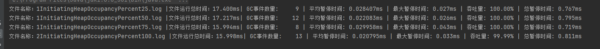

[TOC]


# 1、java程序(使用TencentKona-17.0.11.b1_jdk)

```java
public class ZGCExample {
    public static void main(String[] args) {
        List<byte[]> memoryHog = new ArrayList<>();
        int k = 1;
        while (true) {
            for (int i = 0; i < 1000; i++) {
                // 分配1MB的数组
                byte[] array = new byte[1024 * 1024];
                memoryHog.add(array);
            }
            System.out.println("第" + k++ + "分配1M内存" + "List 大小：" + memoryHog.size());
            // 模拟内存使用情况
            if (memoryHog.size() > 1000) {
                memoryHog.subList(0, 500).clear();
            }

            try {
                // 暂停一段时间，模拟应用程序的其他工作
                Thread.sleep(100);
            } catch (InterruptedException e) {
                e.printStackTrace();
            }
        }
    }
}
```

# 2、java命令

```
-XX:+UseZGC   
-Xlog:gc*:file=gc.log  
```

命令解释：

```angular2html
-XX:+UseZGC             //启用Z垃圾收集器（ZGC）
-Xlog:gc*:file=gc.log  //启用GC日志记录，并将所有GC相关的信息记录到文件gc.log中
```

# 3、运行结果


# 4、GC日志部分分析
[gc.log日志](最初的.log)

## 1、基础信息分析

<details>
    <summary>基础日志（未涉及垃圾回收）</summary>

| 基础日志分析   |                                                                                                |
|----------|------------------------------------------------------------------------------------------------|
| 相对时间     | 日志内容及解释                                                                                        |
| [0.013s] | [gc,init] Initializing The Z Garbage  Collector：  JVM在启动0.013秒时开始初始化ZGC。                       |
| [0.014s] | [gc,init] Version: 21.0.3+9-LTS (release)：  使用的是Java 21的版本21.0.3+9-LTS（长期支持版本）。                |
| [0.014s] | [gc,init] Using legacy single-generation  mode：  使用传统的单代模式，这意味着不区分年轻代和老年代。                     |
| [0.014s] | [gc,init] NUMA Support: Disabled：  非统一内存访问（NUMA）支持被禁用。                                         |
| [0.014s] | [gc,init] CPUs: 8 total, 8 available：  系统有8个CPU核心，全部可用。                                        |
| [0.014s] | [gc,init] Memory: 16281M：  系统有16281MB（约15.9GB）的内存。                                             |
| [0.014s] | [gc,init] Large Page Support: Disabled：  大页内存支持被禁用。                                            |
| [0.014s] | [gc,init] GC Workers: 2 (dynamic)：  有2个动态分配的GC工作线程。                                            |
| [0.015s] | [gc,init] Address Space Type:  Contiguous/Unrestricted/Complete：  地址空间类型为连续、无限制、完整。            |
| [0.015s] | [gc,init] Address Space Size: 65152M x 3  = 195456M：  地址空间大小为65152MB x 3 = 195456MB（约190.5GB）。 |
| [0.015s] | [gc,init] Min Capacity: 8M：  最小堆容量为8MB。                                                        |
| [0.015s] | [gc,init] Initial Capacity: 256M：  初始堆容量为256MB。                                                |
| [0.015s] | [gc,init] Max Capacity: 4072M：  最大堆容量为4072MB（约3.98GB）。                                         |
| [0.015s] | [gc,init] Medium Page Size: 32M：  中等页面大小为32MB。                                                 |
| [0.015s] | [gc,init] Pre-touch: Disabled：  预触摸内存页面的功能被禁用。                                                 |
| [0.015s] | [gc,init] Uncommit: Enabled：  允许未使用的堆内存被操作系统回收。                                                |
| [0.015s] | [gc,init] Uncommit Delay: 300s：  未使用内存被回收前的延迟时间为300秒。                                          |
| [0.027s] | [gc,init] Runtime Workers: 5：  有5个运行时工作线程。                                                     |
| [0.028s] | [gc ] Using The Z Garbage Collector：  确认使用Z垃圾收集器。                                              |

</details>

## 2、垃圾回收日志
下图是一次GC的全过程

<details>
    <summary>垃圾回收过程日志</summary>

| GC日志分析                                     |                                                                                                                                                                                                                                                                                                                                                                                                                                                                                                                                                                                                                                                                                                                                                                                                                                                                      |
|--------------------------------------------|----------------------------------------------------------------------------------------------------------------------------------------------------------------------------------------------------------------------------------------------------------------------------------------------------------------------------------------------------------------------------------------------------------------------------------------------------------------------------------------------------------------------------------------------------------------------------------------------------------------------------------------------------------------------------------------------------------------------------------------------------------------------------------------------------------------------------------------------------------------------|
| GC启动：                                      |                                                                                                                                                                                                                                                                                                                                                                                                                                                                                                                                                                                                                                                                                                                                                                                                                                                                      |
| [0.460s]                                   | [gc,start] GC(0) Garbage Collection  (Warmup)<br> 在0.460秒时，JVM开始了一次垃圾收集（GC），这是一次预热（Warmup）GC。                                                                                                                                                                                                                                                                                                                                                                                                                                                                                                                                                                                                                                                                                                                                                                        |
| GC任务<br>                                   |                                                                                                                                                                                                                                                                                                                                                                                                                                                                                                                                                                                                                                                                                                                                                                                                                                                                      |
| [0.461s]                                   | [gc,task]  GC(0) Using 2 workers<br>使用了2个GC工作线程。                                                                                                                                                                                                                                                                                                                                                                                                                                                                                                                                                                                                                                                                                                                                                                                                                     |
| GC阶段<br>                                   |                                                                                                                                                                                                                                                                                                                                                                                                                                                                                                                                                                                                                                                                                                                                                                                                                                                                      |
| [0.461s]                                   | [gc,phases]  GC(0) Pause Mark Start 0.007ms<br>  标记阶段开始，暂停时间为0.007毫秒。                                                                                                                                                                                                                                                                                                                                                                                                                                                                                                                                                                                                                                                                                                                                                                                                |
| [0.475s]                                   | [gc,phases]  GC(0) Concurrent Mark 14.514ms<br>  并发标记阶段，耗时14.514毫秒。                                                                                                                                                                                                                                                                                                                                                                                                                                                                                                                                                                                                                                                                                                                                                                                                  |
| [0.476s]                                   | [gc,phases]  GC(0) Pause Mark End 0.018ms<br>  标记阶段结束，暂停时间为0.018毫秒。                                                                                                                                                                                                                                                                                                                                                                                                                                                                                                                                                                                                                                                                                                                                                                                                  |
| [0.476s]                                   | [gc,phases]  GC(0) Concurrent Process Non-Strong References 0.650ms<br>  并发处理非强引用阶段，耗时0.650毫秒。                                                                                                                                                                                                                                                                                                                                                                                                                                                                                                                                                                                                                                                                                                                                                                       |
| [0.476s]                                   | [gc,phases]  GC(0) Concurrent Reset Relocation Set 0.001ms<br>  并发重置重定位集阶段，耗时0.001毫秒。                                                                                                                                                                                                                                                                                                                                                                                                                                                                                                                                                                                                                                                                                                                                                                                |
| [0.485s]                                   | [gc,phases]  GC(0) Concurrent Select Relocation Set 9.009ms<br>  并发选择重定位集阶段，耗时9.009毫秒。                                                                                                                                                                                                                                                                                                                                                                                                                                                                                                                                                                                                                                                                                                                                                                               |
| [0.486s]                                   | [gc,phases]  GC(0) Pause Relocate Start 0.013ms<br>  重定位阶段开始，暂停时间为0.013毫秒。                                                                                                                                                                                                                                                                                                                                                                                                                                                                                                                                                                                                                                                                                                                                                                                           |
| [0.487s]                                   | [gc,phases]  GC(0) Concurrent Relocate 0.810ms<br>  并发重定位阶段，耗时0.810毫秒。                                                                                                                                                                                                                                                                                                                                                                                                                                                                                                                                                                                                                                                                                                                                                                                               |
| GC负载<br>                                   |                                                                                                                                                                                                                                                                                                                                                                                                                                                                                                                                                                                                                                                                                                                                                                                                                                                                      |
| [0.487s]                                   | [gc,load]  GC(0) Load: 0.00/0.00/0.00<br>  GC负载信息。                                                                                                                                                                                                                                                                                                                                                                                                                                                                                                                                                                                                                                                                                                                                                                                                                   |
| GC（Minimum  Mutator Utilisation）=非GC时间/时间片 |                                                                                                                                                                                                                                                                                                                                                                                                                                                                                                                                                                                                                                                                                                                                                                                                                                                                      |
| [0.487s]                                   | [gc,mmu]  GC(0) MMU: 2ms/99.1%, 5ms/99.6%, 10ms/99.8%, 20ms/99.8%, 50ms/99.9%,  100ms/100.0%<br>  是一个指标2ms/99.1%在 2 毫秒的时间片内，至少 99.1% 的时间用于应用程序线程的执行。                                                                                                                                                                                                                                                                                                                                                                                                                                                                                                                                                                                                                                                                                                                 |
| GC标记                                       |                                                                                                                                                                                                                                                                                                                                                                                                                                                                                                                                                                                                                                                                                                                                                                                                                                                                      |
| [0.487s]                                   | [gc,marking]  GC(0) Mark: 2 stripe(s), 2 proactive flush(es), 1 terminate flush(es), 0  completion(s), 0 continuation(s)<br>  2 stripe(s)：表示标记阶段分为两个条带（stri），每个条带是并行标记的pe一部分。  <br>2 proactive flush(es)：表示在标记过程中进行了两次主动刷新（flush），这通常是为了确保标记信息及时更新。<br>  1 terminate flush(es)：表示在标记阶段结束时进行了1次终止刷新，确保所有标记信息都已处理完毕。<br>  0 completion(s)：表示没有完成的标记任务。 <br> 0 continuation(s)：表示没有需要继续的标记任务。                                                                                                                                                                                                                                                                                                                                                                                                                                                                           |
| [0.487s]                                   | [gc,marking]  GC(0) Mark Stack Usage: 32M<br>  表示在标记阶段使用了 32MB 的标记栈（Mark Stack）。标记栈用于存储在标记过程中需要处理的对象引用。                                                                                                                                                                                                                                                                                                                                                                                                                                                                                                                                                                                                                                                                                                                                                              |
| GC方法<br>                                   |                                                                                                                                                                                                                                                                                                                                                                                                                                                                                                                                                                                                                                                                                                                                                                                                                                                                      |
| [0.487s]                                   | [gc,nmethod] GC(0) NMethods: 289  registered, 41 unregistered<br>  289 registered：当前注册的本地方法（NMethods）数量为 289，这些方法已经被编译并存储在代码缓存中，供 JVM 执行。  <br>41 unregistered：当前未注册的本地方法数量为 41，这些方法可能已经被移除或不再使用。                                                                                                                                                                                                                                                                                                                                                                                                                                                                                                                                                                                                                                                                    |
| 元空间<br>                                    |                                                                                                                                                                                                                                                                                                                                                                                                                                                                                                                                                                                                                                                                                                                                                                                                                                                                      |
| [0.487s]                                   | [gc,metaspace]  GC(0) Metaspace: 0M used, 0M committed, 1088M reserved<br>  0M used<br>当前没有使用的元空间（Metaspace）。  0M committed<br>当前没有分配的元空间。  1088M reserved<br>预留了 1088MB 的元空间。                                                                                                                                                                                                                                                                                                                                                                                                                                                                                                                                                                                                                                                                                       |
| 引用处理<br>                                   |                                                                                                                                                                                                                                                                                                                                                                                                                                                                                                                                                                                                                                                                                                                                                                                                                                                                      |
| [0.487s]                                   | [gc,ref] GC(0) Soft: 54 encountered, 0  discovered, 0 enqueued<br>[gc,ref] GC(0) Weak: 171 encountered, 48  discovered, 45 enqueued<br>[gc,ref] GC(0) Final: 0 encountered, 0  discovered, 0 enqueued<br>[gc,ref] GC(0) Phantom: 187 encountered,  90 discovered, 15 enqueued<br>软引用（Soft Reference）：<br>54 encountered：遇到了 54 个软引用。  0 discovered：发现了  0 个需要处理的软引用。  0 enqueued：入队了 0 个软引用。  <br/>弱引用（Weak Reference）：<br> 171 encountered：遇到了 171 个弱引用。  48 discovered：发现了  48 个需要处理的弱引用。  45 enqueued：入队了  45 个弱引用。  <br/>终结引用（Final Reference）：<br>  0 encountered：遇到了0  个终结引用。  0 discovered：发现了0  个需要处理的终结引用。  0 enqueued：入队了0 个终结引用。  <br/>虚引用（Phantom Reference）：<br>187 encountered：遇到了 187 个虚引用。  90 discovered：发现了  90 个需要处理的虚引用。  15 enqueued：入队了  15 个虚引用。  <br/>强引用是默认的引用类型，任何通过普通变量引用的对象都是强引用。强引用的对象在 GC  时不会被回收，除非没有任何强引用指向它们。因此，强引用不需要在 GC 日志中单独记录。 |
| 重定位<br>                                    |                                                                                                                                                                                                                                                                                                                                                                                                                                                                                                                                                                                                                                                                                                                                                                                                                                                                      |
| [0.487s]                                   | [gc,reloc]  GC(0) Small Pages: 6 / 12M, Empty: 0M, Relocated: 0M, In-Place: 0<br>[gc,reloc]  GC(0) Medium Pages: 14 / 448M, Empty: 0M, Relocated: 0M, In-Place: 0<br>[gc,reloc]  GC(0) Large Pages: 0 / 0M, Empty: 0M, Relocated: 0M, In-Place: 0<br>[gc,reloc] GC(0) Forwarding Usage: 0M<br>Small Pages：  6 / 12M：表示有 6 个小页面，总共 12MB。<br/>Empty: 0M：没有空闲的小页面。<br/>Relocated: 0M：没有小页面被重新定位。  <br/>In-Place: 0：没有小页面在原地处理。<br/>Medium Pages:14 / 448M：表示有 14 个中等大小的页面，总共 448MB。<br/>Empty: 0M：没有空闲的中等页面。  <br/>Relocated: 0M：没有中等页面被重新定位。<br/>In-Place: 0：没有中等页面在原地处理。<br/>Large Pages: 0 / 0M：没有大页面。  <br/>Empty: 0M：没有空闲的大页面。  <br/>Relocated: 0M：没有大页面被重新定位。  <br/>In-Place: 0：没有大页面在原地处理。  <br/>Forwarding Usage：  0M：没有使用转发内存。                                                                                                                                 |
| 堆内存<br>                                    | [gc,heap     ] GC(0) Min Capacity: 8M(0%)[gc,heap     ] GC(0) Max Capacity: 4072M(100%)<br/>[gc,heap     ] GC(0) Soft Max Capacity: 4072M(100%)Min Capacity: 8M (0%)<br>最小堆容量为 8MB，占总容量的 0%。这是 JVM 启动时的初始堆大小。<br/>Max Capacity: 4072M (100%)：最大堆容量为 4072MB，占总容量的 100%。这是 JVM 可以扩展到的最大堆大小。：<br/>Soft Max Capacity: 4072M (100%)：软最大堆容量为 4072MB，占总容量的 100%。这是 JVM 在正常情况下不会超过的堆大小，但在特殊情况下可以临时超过。                                                                                                                                                                                                                                                                                                                                                                                                                                                                        |

堆内存日志


| 时间   | 0.487s      | 0.487s      | 0.487s         | 0.487s       | 0.487s      | 0.487s      |
|------|-------------|-------------|----------------|--------------|-------------|-------------|
| 阶段   | Mark Start  | Mark End    | Relocate Start | Relocate End | High        | Low         |
| 容量变化 | 480M (12%)  | 512M (13%)  | 544M (13%)     | 544M (13%)   | 544M (13%)  | 480M (12%)  |
| 空闲变化 | 3612M (89%) | 3580M (88%) | 3546M (87%)    | 3548M (87%)  | 3612M (89%) | 3542M (87%) |
| 使用变化 | 460M (11%)  | 492M (12%)  | 526M (13%)     | 524M (13%)   | 530M (13%)  | 460M (11%)  |
| 活跃对象 | -           | 437M (11%)  | 437M (11%)     | 437M (11%)   | -           | -           |
| 分配内存 | -           | 32M (1%)    | 66M (2%)       | 67M (2%)     | -           | -           |
| 垃圾内存 | -           | 22M (1%)    | 22M (1%)       | 18M (0%)     | -           | -           |
| 回收内存 | -           | -           | 0M (0%)        | 3M (0%)      | -           | -           |
</details>

## 3、其他触发条件得到的日志（修改了程序） 

<details>
    <summary>修改后的程序</summary>

```java

public class IdleGCTest {

    public static void main(String[] args) {
        System.out.println("Starting Idle GC Test...");

        // 分配大量对象以填充堆内存
        for (int i = 0; i < 100_000; i++) {
            byte[] array = new byte[1024 * 1024]; // 1MB
        }

        System.out.println("Finished allocating memory. Waiting for Idle GC...");
        System.gc();
        try {
            // 保持空闲状态，等待Idle GC触发
            Thread.sleep(30000); // 30秒
        } catch (InterruptedException e) {
            e.printStackTrace();
        }

        System.out.println("Test finished.");
    }
}

```
</details>
<details>
    <summary>修改的jvm参数</summary>

``` log
-XX:+UseZGC
-XX:ZCollectionInterval=15
-Xlog:gc*:file=./gc.log
```


</details>

<details>
    <summary>新增加的日志截取</summary>

``` log
[13.786s][info][gc,start    ] GC(46) Garbage Collection (System.gc())
[13.787s][info][gc,task     ] GC(46) Using 2 workers
[13.787s][info][gc,phases   ] GC(46) Pause Mark Start 0.007ms
[13.802s][info][gc,phases   ] GC(46) Concurrent Mark 15.370ms
[13.802s][info][gc,phases   ] GC(46) Pause Mark End 0.010ms
[13.803s][info][gc,phases   ] GC(46) Concurrent Mark Free 0.001ms
[13.804s][info][gc,phases   ] GC(46) Concurrent Process Non-Strong References 0.876ms
[13.804s][info][gc,phases   ] GC(46) Concurrent Reset Relocation Set 0.000ms
[13.805s][info][gc,phases   ] GC(46) Concurrent Select Relocation Set 1.803ms
[13.806s][info][gc,phases   ] GC(46) Pause Relocate Start 0.005ms
[13.806s][info][gc,phases   ] GC(46) Concurrent Relocate 0.124ms
[13.806s][info][gc,load     ] GC(46) Load: 0.00/0.00/0.00
[13.806s][info][gc,mmu      ] GC(46) MMU: 2ms/97.7%, 5ms/98.8%, 10ms/99.2%, 20ms/99.6%, 50ms/99.8%, 100ms/99.9%
[13.806s][info][gc,marking  ] GC(46) Mark: 2 stripe(s), 1 proactive flush(es), 1 terminate flush(es), 0 completion(s), 0 continuation(s) 
[13.806s][info][gc,marking  ] GC(46) Mark Stack Usage: 32M
[13.806s][info][gc,nmethod  ] GC(46) NMethods: 344 registered, 0 unregistered
[13.806s][info][gc,metaspace] GC(46) Metaspace: 1M used, 1M committed, 1032M reserved
[13.806s][info][gc,ref      ] GC(46) Soft: 85 encountered, 0 discovered, 0 enqueued
[13.806s][info][gc,ref      ] GC(46) Weak: 116 encountered, 1 discovered, 0 enqueued
[13.806s][info][gc,ref      ] GC(46) Final: 0 encountered, 0 discovered, 0 enqueued
[13.806s][info][gc,ref      ] GC(46) Phantom: 184 encountered, 180 discovered, 0 enqueued
[13.806s][info][gc,reloc    ] GC(46) Small Pages: 3 / 6M, Empty: 0M, Relocated: 0M, In-Place: 0
[13.806s][info][gc,reloc    ] GC(46) Medium Pages: 1 / 32M, Empty: 0M, Relocated: 0M, In-Place: 0
[13.806s][info][gc,reloc    ] GC(46) Large Pages: 0 / 0M, Empty: 0M, Relocated: 0M, In-Place: 0
[13.806s][info][gc,reloc    ] GC(46) Forwarding Usage: 0M
[13.806s][info][gc,heap     ] GC(46) Min Capacity: 8M(0%)
[13.806s][info][gc,heap     ] GC(46) Max Capacity: 4072M(100%)
[13.806s][info][gc,heap     ] GC(46) Soft Max Capacity: 4072M(100%)
[13.806s][info][gc,heap     ] GC(46)                Mark Start          Mark End        Relocate Start      Relocate End           High               Low         
[13.806s][info][gc,heap     ] GC(46)  Capacity:     3776M (93%)        3776M (93%)        3776M (93%)        3776M (93%)        3776M (93%)        3776M (93%)    
[13.806s][info][gc,heap     ] GC(46)      Free:     4034M (99%)        4034M (99%)        4034M (99%)        4034M (99%)        4034M (99%)        4034M (99%)    
[13.806s][info][gc,heap     ] GC(46)      Used:       38M (1%)           38M (1%)           38M (1%)           38M (1%)           38M (1%)           38M (1%)     
[13.806s][info][gc,heap     ] GC(46)      Live:         -                 4M (0%)            4M (0%)            4M (0%)             -                  -          
[13.806s][info][gc,heap     ] GC(46) Allocated:         -                 0M (0%)            0M (0%)            0M (0%)             -                  -          
[13.806s][info][gc,heap     ] GC(46)   Garbage:         -                33M (1%)           33M (1%)           33M (1%)             -                  -          
[13.806s][info][gc,heap     ] GC(46) Reclaimed:         -                  -                 0M (0%)            0M (0%)             -                  -          
[13.806s][info][gc          ] GC(46) Garbage Collection (System.gc()) 38M(1%)->38M(1%)
[20.070s][info][gc,stats    ] === Garbage Collection Statistics =======================================================================================================================
[20.071s][info][gc,stats    ]                                                              Last 10s              Last 10m              Last 10h                Total
[20.071s][info][gc,stats    ]                                                              Avg / Max             Avg / Max             Avg / Max             Avg / Max
[20.071s][info][gc,stats    ]   Collector: Garbage Collection Cycle                     15.002 / 19.739       14.516 / 29.018       14.516 / 29.018       14.516 / 29.018      ms
[20.071s][info][gc,stats    ]  Contention: Mark Segment Reset Contention                     0 / 0                 0 / 2                 0 / 2                 0 / 2           ops/s
[20.071s][info][gc,stats    ]  Contention: Mark SeqNum Reset Contention                      0 / 0                 0 / 2                 0 / 2                 0 / 2           ops/s
[20.071s][info][gc,stats    ]    Critical: Allocation Stall                                  0 / 0                 0 / 0                 0 / 0                 0 / 0           ops/s
[20.071s][info][gc,stats    ]    Critical: Allocation Stall                              0.000 / 0.000         0.000 / 0.000         0.000 / 0.000         0.000 / 0.000       ms
[20.071s][info][gc,stats    ]    Critical: GC Locker Stall                                   0 / 0                 0 / 0                 0 / 0                 0 / 0           ops/s
[20.071s][info][gc,stats    ]    Critical: GC Locker Stall                               0.000 / 0.000         0.000 / 0.000         0.000 / 0.000         0.000 / 0.000       ms
[20.071s][info][gc,stats    ]    Critical: Relocation Stall                                  0 / 0                 0 / 0                 0 / 0                 0 / 0           ops/s
[20.071s][info][gc,stats    ]    Critical: Relocation Stall                              0.000 / 0.000         0.000 / 0.000         0.000 / 0.000         0.000 / 0.000       ms
[20.071s][info][gc,stats    ]      Memory: Allocation Rate                                1018 / 10184          5198 / 13482          5198 / 13482          5198 / 13482       MB/s
[20.071s][info][gc,stats    ]      Memory: Out Of Memory                                     0 / 0                 0 / 0                 0 / 0                 0 / 0           ops/s
[20.071s][info][gc,stats    ]      Memory: Page Cache Flush                                  0 / 0                 0 / 0                 0 / 0                 0 / 0           MB/s
[20.071s][info][gc,stats    ]      Memory: Page Cache Hit L1                                33 / 330             163 / 436             163 / 436             163 / 436         ops/s
[20.071s][info][gc,stats    ]      Memory: Page Cache Hit L2                                 0 / 0                 0 / 0                 0 / 0                 0 / 0           ops/s
[20.071s][info][gc,stats    ]      Memory: Page Cache Hit L3                                 0 / 0                 0 / 14                0 / 14                0 / 14          ops/s
[20.071s][info][gc,stats    ]      Memory: Page Cache Miss                                   0 / 0                 5 / 44                5 / 44                5 / 44          ops/s
[20.071s][info][gc,stats    ]      Memory: Uncommit                                          0 / 0                 0 / 0                 0 / 0                 0 / 0           MB/s
[20.071s][info][gc,stats    ]      Memory: Undo Object Allocation Failed                     0 / 0                 0 / 0                 0 / 0                 0 / 0           ops/s
[20.071s][info][gc,stats    ]      Memory: Undo Object Allocation Succeeded                  0 / 0                 0 / 0                 0 / 0                 0 / 0           ops/s
[20.071s][info][gc,stats    ]      Memory: Undo Page Allocation                              0 / 0                 0 / 0                 0 / 0                 0 / 0           ops/s
[20.071s][info][gc,stats    ]       Phase: Concurrent Mark                              10.287 / 15.606        8.379 / 15.943        8.379 / 15.943        8.379 / 15.943      ms
[20.071s][info][gc,stats    ]       Phase: Concurrent Mark Continue                      0.000 / 0.000         0.000 / 0.000         0.000 / 0.000         0.000 / 0.000       ms
[20.071s][info][gc,stats    ]       Phase: Concurrent Mark Free                          0.001 / 0.001         0.001 / 0.003         0.001 / 0.003         0.001 / 0.003       ms
[20.071s][info][gc,stats    ]       Phase: Concurrent Process Non-Strong References      0.912 / 1.078         0.952 / 1.417         0.952 / 1.417         0.952 / 1.417       ms
[20.071s][info][gc,stats    ]       Phase: Concurrent Relocate                           0.641 / 1.219         1.472 / 4.077         1.472 / 4.077         1.472 / 4.077       ms
[20.071s][info][gc,stats    ]       Phase: Concurrent Reset Relocation Set               0.001 / 0.001         0.001 / 0.004         0.001 / 0.004         0.001 / 0.004       ms
[20.071s][info][gc,stats    ]       Phase: Concurrent Select Relocation Set              1.839 / 1.888         2.277 / 10.574        2.277 / 10.574        2.277 / 10.574      ms
[20.071s][info][gc,stats    ]       Phase: Pause Mark End                                0.011 / 0.014         0.013 / 0.045         0.013 / 0.045         0.013 / 0.045       ms
[20.071s][info][gc,stats    ]       Phase: Pause Mark Start                              0.007 / 0.008         0.009 / 0.038         0.009 / 0.038         0.009 / 0.038       ms
[20.071s][info][gc,stats    ]       Phase: Pause Relocate Start                          0.006 / 0.006         0.008 / 0.046         0.008 / 0.046         0.008 / 0.046       ms
[20.071s][info][gc,stats    ]    Subphase: Concurrent Classes Purge                      0.121 / 0.131         0.097 / 0.171         0.097 / 0.171         0.097 / 0.171       ms
[20.071s][info][gc,stats    ]    Subphase: Concurrent Classes Unlink                     0.319 / 0.415         0.369 / 0.695         0.369 / 0.695         0.369 / 0.695       ms
[20.071s][info][gc,stats    ]    Subphase: Concurrent Mark                               6.843 / 15.079        6.402 / 15.489        6.402 / 15.489        6.402 / 15.489      ms
[20.071s][info][gc,stats    ]    Subphase: Concurrent Mark Try Flush                     0.124 / 0.157         0.112 / 0.244         0.112 / 0.244         0.112 / 0.244       ms
[20.071s][info][gc,stats    ]    Subphase: Concurrent Mark Try Terminate                 2.948 / 13.777        2.001 / 13.777        2.001 / 13.777        2.001 / 13.777      ms
[20.071s][info][gc,stats    ]    Subphase: Concurrent References Enqueue                 0.000 / 0.000         0.000 / 0.005         0.000 / 0.005         0.000 / 0.005       ms
[20.071s][info][gc,stats    ]    Subphase: Concurrent References Process                 0.125 / 0.174         0.097 / 0.174         0.097 / 0.174         0.097 / 0.174       ms
[20.071s][info][gc,stats    ]    Subphase: Concurrent Roots ClassLoaderDataGraph         0.042 / 0.081         0.080 / 0.398         0.080 / 0.398         0.080 / 0.398       ms
[20.071s][info][gc,stats    ]    Subphase: Concurrent Roots CodeCache                    0.000 / 0.000         0.000 / 0.000         0.000 / 0.000         0.000 / 0.000       ms
[20.071s][info][gc,stats    ]    Subphase: Concurrent Roots JavaThreads                  0.204 / 0.303         0.257 / 0.777         0.257 / 0.777         0.257 / 0.777       ms
[20.071s][info][gc,stats    ]    Subphase: Concurrent Roots OopStorageSet                0.008 / 0.013         0.015 / 0.058         0.015 / 0.058         0.015 / 0.058       ms
[20.071s][info][gc,stats    ]    Subphase: Concurrent Weak Roots OopStorageSet           0.102 / 0.155         0.191 / 0.464         0.191 / 0.464         0.191 / 0.464       ms
[20.071s][info][gc,stats    ]    Subphase: Pause Mark Try Complete                       0.000 / 0.000         0.000 / 0.000         0.000 / 0.000         0.000 / 0.000       ms
[20.071s][info][gc,stats    ]      System: Java Threads                                     13 / 13               13 / 14               13 / 14               13 / 14          threads
[20.071s][info][gc,stats    ] =========================================================================================================================================================
[28.867s][info][gc,start    ] GC(47) Garbage Collection (Timer)
[28.867s][info][gc,task     ] GC(47) Using 2 workers
[28.868s][info][gc,phases   ] GC(47) Pause Mark Start 0.007ms
[28.883s][info][gc,phases   ] GC(47) Concurrent Mark 15.099ms
[28.883s][info][gc,phases   ] GC(47) Pause Mark End 0.012ms
[28.883s][info][gc,phases   ] GC(47) Concurrent Mark Free 0.001ms
[28.884s][info][gc,phases   ] GC(47) Concurrent Process Non-Strong References 0.909ms
[28.884s][info][gc,phases   ] GC(47) Concurrent Reset Relocation Set 0.000ms
[28.886s][info][gc,phases   ] GC(47) Concurrent Select Relocation Set 1.788ms
[28.886s][info][gc,phases   ] GC(47) Pause Relocate Start 0.005ms
[28.887s][info][gc,phases   ] GC(47) Concurrent Relocate 0.125ms
[28.887s][info][gc,load     ] GC(47) Load: 0.00/0.00/0.00
[28.887s][info][gc,mmu      ] GC(47) MMU: 2ms/97.7%, 5ms/98.8%, 10ms/99.2%, 20ms/99.6%, 50ms/99.8%, 100ms/99.9%
[28.887s][info][gc,marking  ] GC(47) Mark: 2 stripe(s), 1 proactive flush(es), 1 terminate flush(es), 0 completion(s), 0 continuation(s) 
[28.887s][info][gc,marking  ] GC(47) Mark Stack Usage: 32M
[28.887s][info][gc,nmethod  ] GC(47) NMethods: 344 registered, 0 unregistered
[28.887s][info][gc,metaspace] GC(47) Metaspace: 1M used, 1M committed, 1032M reserved
[28.887s][info][gc,ref      ] GC(47) Soft: 85 encountered, 0 discovered, 0 enqueued
[28.887s][info][gc,ref      ] GC(47) Weak: 116 encountered, 1 discovered, 0 enqueued
[28.887s][info][gc,ref      ] GC(47) Final: 0 encountered, 0 discovered, 0 enqueued
[28.887s][info][gc,ref      ] GC(47) Phantom: 184 encountered, 180 discovered, 0 enqueued
[28.887s][info][gc,reloc    ] GC(47) Small Pages: 3 / 6M, Empty: 0M, Relocated: 0M, In-Place: 0
[28.887s][info][gc,reloc    ] GC(47) Medium Pages: 1 / 32M, Empty: 0M, Relocated: 0M, In-Place: 0
[28.887s][info][gc,reloc    ] GC(47) Large Pages: 0 / 0M, Empty: 0M, Relocated: 0M, In-Place: 0
[28.887s][info][gc,reloc    ] GC(47) Forwarding Usage: 0M
[28.887s][info][gc,heap     ] GC(47) Min Capacity: 8M(0%)
[28.887s][info][gc,heap     ] GC(47) Max Capacity: 4072M(100%)
[28.887s][info][gc,heap     ] GC(47) Soft Max Capacity: 4072M(100%)
[28.887s][info][gc,heap     ] GC(47)                Mark Start          Mark End        Relocate Start      Relocate End           High               Low         
[28.887s][info][gc,heap     ] GC(47)  Capacity:     3776M (93%)        3776M (93%)        3776M (93%)        3776M (93%)        3776M (93%)        3776M (93%)    
[28.887s][info][gc,heap     ] GC(47)      Free:     4034M (99%)        4034M (99%)        4034M (99%)        4034M (99%)        4034M (99%)        4034M (99%)    
[28.887s][info][gc,heap     ] GC(47)      Used:       38M (1%)           38M (1%)           38M (1%)           38M (1%)           38M (1%)           38M (1%)     
[28.887s][info][gc,heap     ] GC(47)      Live:         -                 4M (0%)            4M (0%)            4M (0%)             -                  -          
[28.887s][info][gc,heap     ] GC(47) Allocated:         -                 0M (0%)            0M (0%)            0M (0%)             -                  -          
[28.887s][info][gc,heap     ] GC(47)   Garbage:         -                33M (1%)           33M (1%)           33M (1%)             -                  -          
[28.887s][info][gc,heap     ] GC(47) Reclaimed:         -                  -                 0M (0%)            0M (0%)             -                  -          
[28.887s][info][gc          ] GC(47) Garbage Collection (Timer) 38M(1%)->38M(1%)
```

</details>

## 4、垃圾回收器特点的体现
### 4.1 垃圾回收过程中的暂停
为了能更好的对比，没有删除其他的日志

| 基础日志分析     |                                                                                                            |
|------------|------------------------------------------------------------------------------------------------------------|
| GC阶段<br>   |                                                                                                            |
| [0.461s]   |  <span style="color:red">[gc,phases] GC(0) Pause Mark Start 0.007ms</span> <br>  标记阶段开始，暂停时间为0.007毫秒。 |
| [0.475s]   | [gc,phases]  GC(0) Concurrent Mark 14.514ms<br>  并发标记阶段，耗时14.514毫秒。                                        |
| [0.476s]   |  <span style="color:red">[gc,phases]  GC(0) Pause Mark End 0.018ms<br></span>  标记阶段结束，暂停时间为0.018毫秒。                                        |
| [0.476s]   | [gc,phases]  GC(0) Concurrent Process Non-Strong References 0.650ms<br>  并发处理非强引用阶段，耗时0.650毫秒。             |
| [0.476s]   | [gc,phases]  GC(0) Concurrent Reset Relocation Set 0.001ms<br>  并发重置重定位集阶段，耗时0.001毫秒。                      |
| [0.485s]   | [gc,phases]  GC(0) Concurrent Select Relocation Set 9.009ms<br>  并发选择重定位集阶段，耗时9.009毫秒。                     |
| [0.486s]   |  <span style="color:red">[gc,phases]  GC(0) Pause Relocate Start 0.013ms</span><br>  重定位阶段开始，暂停时间为0.013毫秒。                                 |
| [0.487s]   | [gc,phases]  GC(0) Concurrent Relocate 0.810ms<br>  并发重定位阶段，耗时0.810毫秒。                                     |
其中，表里有三次进行了程序的暂停，分别是

| 阶段                               | 解释                                                                                                                                                                     |
|----------------------------------|------------------------------------------------------------------------------------------------------------------------------------------------------------------------|
| Phase-Pause Mark Start（初始标记）     | 这是垃圾回收过程的开始，ZGC会扫描所有的GC Roots，并标记直接可达的对象。由于需要访问所有的GC Roots，这个阶段需要STW暂停。这个阶段通常很快，因为GC Roots的数量相对较少。<br>                                                                 |
| Phase-Pause Mark End（再次标记）       | 在并发标记阶段之后，ZGC会进行再次标记，这个阶段也是STW的。它的目的是重新标记那些在并发标记阶段可能发生变化的对象。这个阶段的暂停时间通常也很短。<br>                                                                                        |
| Phase-Pause Relocate Start（初始转移） | 在这个阶段，ZGC会开始转移阶段，这也是一个STW暂停。在这个阶段，ZGC会处理所有存活的对象，将它们复制到新的内存地址上。虽然内存分配通常耗时非常短，但对象成员变量的复制耗时可能较长，因为复制耗时与存活对象数量和对象复杂度成正比。对象越复杂，复制耗时越长。这个阶段的耗时可能会比前两个阶段长，因为它需要处理所有存活的对象。<br> |

### 4.2 垃圾回收触发
#### 4.2.1之前的日志中出现过的触发条件
| 日志                                           | 阶段 | 解释 |
|----------------------------------------------|----|----|
| GC(0) Garbage Collection (Warmup)<br>        | 预热垃圾回收   |  在 JVM 启动时进行的第一次垃圾回收，用于初始化和预热内存管理系统  |
| GC(3) Garbage Collection (Proactive)<br>         |  主动垃圾回收  |  由 ZGC 主动触发，以确保内存使用保持在合理范围内，避免内存不足的情况  |
| GC(4) Garbage Collection (Allocation Rate) <br>  |  分配率垃圾回收  |  当对象分配速率过高时触发，以防止内存快速耗尽  |
| GC(10) Garbage Collection (Allocation Stall)<br> |  分配停滞垃圾回收  |  当内存分配出现停滞（例如没有足够的空闲内存页面）时触发，以确保内存分配能够继续进行  |
|GC(46) Garbage Collection (System.gc())|手动垃圾回收|由调用 System.gc() 方法触发，通常用于手动请求垃圾回收|
|GC(47) Garbage Collection (Timer)|定时垃圾回收|由定时器触发的垃圾回收，用于定期清理内存|


# 5、调优 

[进行调优的java程序](ZgcOptimization.java)
<details>
    <summary>进行调优的java程序</summary>

```java
public class Zgc {
    public static void main(String[] args) {

        MemoryMXBean memoryMXBean = ManagementFactory.getMemoryMXBean();
        List<byte[]> memoryHog = new ArrayList<>();
        int k = 1;
        int allAllocate = 10000;
        int oneAllocate = 10;
        while (k <= allAllocate / oneAllocate) {
            for (int i = 0; i < oneAllocate; i++) {
                // 分配1MB的数组
                byte[] array = new byte[1024 * 1024];
                memoryHog.add(array);
            }

            MemoryUsage heapMemoryUsage = memoryMXBean.getHeapMemoryUsage();
            long usedHeapMemorySize = heapMemoryUsage.getUsed();
            long committedHeapMemorySize = heapMemoryUsage.getCommitted();
            System.out.println("第" + k++ + "次分配内存。已使用的堆内存大小：" + usedHeapMemorySize / (1024 * 1024) + " MB。已分配的堆内存：" + committedHeapMemorySize / (1024 * 1024) + " MB");
            // 模拟内存使用情况
            if (memoryHog.size() > oneAllocate) {
                memoryHog.subList(0, memoryHog.size()).clear();
            }

            try {
                // 暂停一段时间，模拟应用程序的其他工作
                Thread.sleep(oneAllocate);
            } catch (InterruptedException e) {
                e.printStackTrace();
            }
        }
    }
}

```


</details>
程序的介绍：程序分配10000M内存，并使用。中间打印各种数据。

## 1、对程序的Xmx（最大堆内存）参数进行调优
参数为
```
-XX:+UseZGC
-Xlog:gc*:file=./gc.log:time,uptime
```
增加调整参数及其对应log文件

- [Xmx128m](Xmx/1Xmx128m.log)
- [Xmx256m](Xmx/2Xmx256m.log)
- [Xmx512m](Xmx/3Xmx512m.log)
- [Xmx1g](Xmx/4Xmx1g.log)
- [Xmx2g](Xmx/5Xmx2g.log)
- [Xmx4g](Xmx/6Xmx4g.log)

### GC性能分析
根据[ZGCLogAnalysis](../analysis/ZGCLogAnalysis.java)运行结果

得出结论：zgc在Xmx进行成倍增加对应的:<br>

| 指标               | 趋势描述                                    |
|------------------|----------------------------------------|
| GC事件数量          | 在内存小于等于2G有明显的成倍减少趋势       |
| 平均暂停时间         | 在内存小于等于2G有明显的增加趋势           |
| 最大暂停时间         | 变化并不明显                               |
| 吞吐量             | 有变大趋势，但极不明显                      |
| 程序总暂停时间        | 逐渐减少趋势                                |

对于该程序，设置Xmx=2g可以达到最优效果

## 2、修改程序的SoftMaxHeapSize（最大堆为2g）

基础参数为
```
-XX:+UseZGC
-Xmx2g
-Xlog:gc*:file=./gc.log:time,uptime,tags
```
增加调整参数及其对应的log日志文件
```
-XX:SoftMaxHeapSize=128m
-XX:SoftMaxHeapSize=256m
-XX:SoftMaxHeapSize=512m
-XX:SoftMaxHeapSize=1g	
-XX:SoftMaxHeapSize=2g	
```
- [SoftMaxHeapSize=128m](SoftMaxHeapSize/0SoftMaxHeapSize=128m)
- [SoftMaxHeapSize=256m](SoftMaxHeapSize/1SoftMaxHeapSize=256m)
- [SoftMaxHeapSize=512m](SoftMaxHeapSize/2SoftMaxHeapSize=512m)
- [SoftMaxHeapSize=1g](SoftMaxHeapSize/3SoftMaxHeapSize=1g)
- [SoftMaxHeapSize=2g](SoftMaxHeapSize/4SoftMaxHeapSize=2g)

### GC性能分析
根据[ZGCLogAnalysis](../analysis/ZGCLogAnalysis.java)运行结果

得出结论：SoftMaxHeapSize的设置让该程序的性能有逐渐提升，设置为最大堆空间时，程序有最高性能。<br>

## 3、修改程序的InitiatingHeapOccupancyPercent(并不算成功)
参数为(在Xmx2g下)
```
-XX:+UseZGC
-Xmx2g
-Xlog:gc*:file=./gc.log:time,uptime，tags
```
堆内存使用达到指定百分比时开始垃圾收集的阈值
```
-XX:InitiatingHeapOccupancyPercent=25	
-XX:InitiatingHeapOccupancyPercent=50	
-XX:InitiatingHeapOccupancyPercent=75	
-XX:InitiatingHeapOccupancyPercent=100	
```

得到结果并不明显，
增加百分比粒度
```
-XX:InitiatingHeapOccupancyPercent=10	
-XX:InitiatingHeapOccupancyPercent=20	
-XX:InitiatingHeapOccupancyPercent=30	
-XX:InitiatingHeapOccupancyPercent=40
-XX:InitiatingHeapOccupancyPercent=60	
-XX:InitiatingHeapOccupancyPercent=70	
-XX:InitiatingHeapOccupancyPercent=80	
-XX:InitiatingHeapOccupancyPercent=90	
```
<details>
    <summary>对应的日志</summary>

- [InitiatingHeapOccupancyPercent=10](InitiatingHeapOccupancyPercent/1InitiatingHeapOccupancyPercent10.log)
- [InitiatingHeapOccupancyPercent=20](InitiatingHeapOccupancyPercent/1InitiatingHeapOccupancyPercent20.log)
- [InitiatingHeapOccupancyPercent=25](InitiatingHeapOccupancyPercent/1InitiatingHeapOccupancyPercent25.log)
- [InitiatingHeapOccupancyPercent=30](InitiatingHeapOccupancyPercent/1InitiatingHeapOccupancyPercent30.log)
- [InitiatingHeapOccupancyPercent=40](InitiatingHeapOccupancyPercent/1InitiatingHeapOccupancyPercent40.log)
- [InitiatingHeapOccupancyPercent=50](InitiatingHeapOccupancyPercent/1InitiatingHeapOccupancyPercent50.log)
- [InitiatingHeapOccupancyPercent=60](InitiatingHeapOccupancyPercent/1InitiatingHeapOccupancyPercent60.log)
- [InitiatingHeapOccupancyPercent=70](InitiatingHeapOccupancyPercent/1InitiatingHeapOccupancyPercent70.log)
- [InitiatingHeapOccupancyPercent=75](InitiatingHeapOccupancyPercent/1InitiatingHeapOccupancyPercent75.log)
- [InitiatingHeapOccupancyPercent=80](InitiatingHeapOccupancyPercent/1InitiatingHeapOccupancyPercent80.log)
- [InitiatingHeapOccupancyPercent=90](InitiatingHeapOccupancyPercent/1InitiatingHeapOccupancyPercent90.log)
- [InitiatingHeapOccupancyPercent=100](InitiatingHeapOccupancyPercent/2InitiatingHeapOccupancyPercent100.log)

</details>


得到的结果依然不明显

考虑在堆内存为128m的情况下进行调优（Zgc在内存足够的情况下，性能本来就很高）

参数为(在Xmx128m下)
```
-XX:+UseZGC
-Xmx128m
-Xlog:gc*:file=./gc.log:time,uptime，tags
```
堆内存使用达到指定百分比时开始垃圾收集的阈值
```
-XX:InitiatingHeapOccupancyPercent=25	
-XX:InitiatingHeapOccupancyPercent=50	
-XX:InitiatingHeapOccupancyPercent=75	
-XX:InitiatingHeapOccupancyPercent=100	
```
<details>
    <summary>对应的日志</summary>

- [InitiatingHeapOccupancyPercent=25](InitiatingHeapOccupancyPercent/3InitiatingHeapOccupancyPercent25.log)
- [InitiatingHeapOccupancyPercent=50](InitiatingHeapOccupancyPercent/3InitiatingHeapOccupancyPercent50.log)
- [InitiatingHeapOccupancyPercent=75](InitiatingHeapOccupancyPercent/3InitiatingHeapOccupancyPercent75.log)
- [InitiatingHeapOccupancyPercent=100](InitiatingHeapOccupancyPercent/4InitiatingHeapOccupancyPercent100.log)

</details>

结果依然不够明显

其中不论在那种Xmx下都是25%和75%总暂停时间最短，所以设计一共更小的粒度进行，每百分之一进行一次日志记录
脚本如下 //todo

```shell

@echo off
setlocal enabledelayedexpansion

for /L %%i in (1,1,10) do (
    set "logfile=gc_%%i.log"
    java -XX:+UseZGC -Xmx128m -XX:InitiatingHeapOccupancyPercent=%%i -Xlog:gc*:file=./!logfile!:time,uptime,tags GC/ZGC/ZgcOptimization
)

endlocal

```

## 4、修改程序的初始堆大小
参数为
```
-XX:+UseZGC
-Xmx2g
-Xlog:gc*:file=./gc.log:time,uptime,tags
```
增加调整参数
```
-Xms128m
-Xms256m
-Xms512m
-Xms1g
-Xms2g
```

<details>
    <summary>对应的日志</summary>

- [Xms128m](Xms/1Xms128m.log)
- [Xms256m](Xms/2Xms256m.log)
- [Xms512m](Xms/3Xms512m.log)
- [Xms1g](Xms/4Xms1g.log)
- [Xms2g](Xms/5Xms2g.log)
</details>

从下图中可以看出，当初始堆大小不断增加的时候，文件运行总时间在不断下降。但是其他的指标并没有太大规律。


## 5、修改程序的ConcGCThreads
参数为
```
-XX:+UseZGC
-Xms1g
-Xmx2g
-Xlog:gc*:file=./gc.log:time,uptime,tags
```
增加调整脚本参数
解释：针对-XX:ConcGCThreads 参数，运行-XX:ConcGCThreads=1到-XX:ConcGCThreads=8
``` shell
@echo off
setlocal enabledelayedexpansion

for /L %%i in (1,1,8) do (
    set "logfile=./gcLog/%%iConcGCThreads=%%i.log"
    java -XX:+UseZGC -Xms1g  -Xmx2g -XX:ConcGCThreads=%%i -Xlog:gc*:file=./!logfile!:time,uptime,tags com.code.tryOne.jvmGc.ZGc.ZgcOptimization
)

endlocal

```
<details>
    <summary>对应的日志</summary>

- [ConcGCThreads1](ConcGCThreads/1ConcGCThreads=1.log)
- [ConcGCThreads2](ConcGCThreads/2ConcGCThreads=2.log)
- [ConcGCThreads3](ConcGCThreads/3ConcGCThreads=3.log)
- [ConcGCThreads4](ConcGCThreads/4ConcGCThreads=4.log)
- [ConcGCThreads5](ConcGCThreads/5ConcGCThreads=5.log)
- [ConcGCThreads6](ConcGCThreads/6ConcGCThreads=6.log)
- [ConcGCThreads7](ConcGCThreads/7ConcGCThreads=7.log)
- [ConcGCThreads8](ConcGCThreads/8ConcGCThreads=8.log)
</details>
从图中可以看出，最大暂停时间和总暂停时间最小的是ConcGCThreads=4或者5，其他数量相差不大，不做比较


