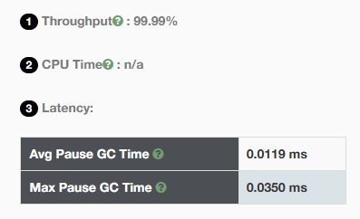
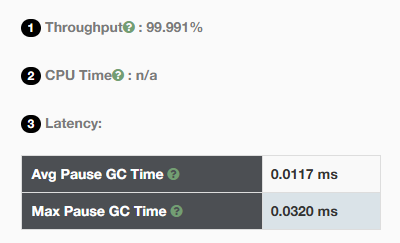
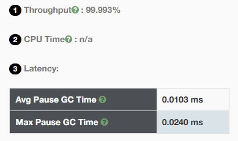

## 3、修改程序的InitiatingHeapOccupancyPercent
参数为
```
-XX:+UseZGC
-Xlog:gc*:file=./gc.log:time,uptime
```
堆内存使用达到指定百分比时开始垃圾收集的阈值
```
-XX:InitiatingHeapOccupancyPercent=25	
-XX:InitiatingHeapOccupancyPercent=50	
-XX:InitiatingHeapOccupancyPercent=75	
-XX:InitiatingHeapOccupancyPercent=100	
```
下面是日志
<details>
    <summary>InitiatingHeapOccupancyPercent=25</summary>

```text
[2024-07-14T21:12:21.562+0800][0.014s] Initializing The Z Garbage Collector
[2024-07-14T21:12:21.562+0800][0.014s] Version: 17.0.2+8-86 (release)
[2024-07-14T21:12:21.563+0800][0.014s] NUMA Support: Disabled
[2024-07-14T21:12:21.563+0800][0.014s] CPUs: 8 total, 8 available
[2024-07-14T21:12:21.563+0800][0.014s] Memory: 16281M
[2024-07-14T21:12:21.563+0800][0.014s] Large Page Support: Disabled
[2024-07-14T21:12:21.563+0800][0.014s] GC Workers: 2 (dynamic)
[2024-07-14T21:12:21.563+0800][0.015s] Address Space Type: Contiguous/Unrestricted/Complete
[2024-07-14T21:12:21.563+0800][0.015s] Address Space Size: 65536M x 3 = 196608M
[2024-07-14T21:12:21.563+0800][0.015s] Min Capacity: 2048M
[2024-07-14T21:12:21.565+0800][0.016s] Initial Capacity: 2048M
[2024-07-14T21:12:21.565+0800][0.016s] Max Capacity: 4096M
[2024-07-14T21:12:21.565+0800][0.016s] Medium Page Size: 32M
[2024-07-14T21:12:21.565+0800][0.016s] Pre-touch: Disabled
[2024-07-14T21:12:21.565+0800][0.016s] Uncommit: Enabled
[2024-07-14T21:12:21.565+0800][0.016s] Uncommit Delay: 300s
[2024-07-14T21:12:21.666+0800][0.118s] Runtime Workers: 5
[2024-07-14T21:12:21.667+0800][0.119s] Using The Z Garbage Collector
[2024-07-14T21:12:21.667+0800][0.119s] CDS archive(s) mapped at: [0x0000000800000000-0x0000000800bc0000-0x0000000800bc0000), size 12320768, SharedBaseAddress: 0x0000000800000000, ArchiveRelocationMode: 0.
[2024-07-14T21:12:21.668+0800][0.119s] Compressed class space mapped at: 0x0000000800c00000-0x0000000840c00000, reserved size: 1073741824
[2024-07-14T21:12:21.668+0800][0.119s] Narrow klass base: 0x0000000800000000, Narrow klass shift: 0, Narrow klass range: 0x100000000
[2024-07-14T21:12:22.101+0800][0.553s] GC(0) Garbage Collection (Warmup)
[2024-07-14T21:12:22.101+0800][0.553s] GC(0) Using 2 workers
[2024-07-14T21:12:22.101+0800][0.553s] GC(0) Pause Mark Start 0.008ms
[2024-07-14T21:12:22.117+0800][0.568s] GC(0) Concurrent Mark 14.755ms
[2024-07-14T21:12:22.117+0800][0.568s] GC(0) Pause Mark End 0.021ms
[2024-07-14T21:12:22.117+0800][0.568s] GC(0) Concurrent Mark Free 0.002ms
[2024-07-14T21:12:22.117+0800][0.568s] GC(0) Concurrent Process Non-Strong References 0.509ms
[2024-07-14T21:12:22.117+0800][0.569s] GC(0) Concurrent Reset Relocation Set 0.001ms
[2024-07-14T21:12:22.130+0800][0.581s] GC(0) Concurrent Select Relocation Set 12.629ms
[2024-07-14T21:12:22.130+0800][0.581s] GC(0) Pause Relocate Start 0.007ms
[2024-07-14T21:12:22.132+0800][0.584s] GC(0) Concurrent Relocate 2.122ms
[2024-07-14T21:12:22.132+0800][0.584s] GC(0) Load: 0.00/0.00/0.00
[2024-07-14T21:12:22.132+0800][0.584s] GC(0) MMU: 2ms/98.9%, 5ms/99.6%, 10ms/99.8%, 20ms/99.9%, 50ms/99.9%, 100ms/100.0%
[2024-07-14T21:12:22.132+0800][0.584s] GC(0) Mark: 2 stripe(s), 2 proactive flush(es), 1 terminate flush(es), 0 completion(s), 0 continuation(s) 
[2024-07-14T21:12:22.132+0800][0.584s] GC(0) Mark Stack Usage: 32M
[2024-07-14T21:12:22.132+0800][0.584s] GC(0) NMethods: 293 registered, 0 unregistered
[2024-07-14T21:12:22.132+0800][0.584s] GC(0) Metaspace: 0M used, 0M committed, 1032M reserved
[2024-07-14T21:12:22.132+0800][0.584s] GC(0) Soft: 45 encountered, 0 discovered, 0 enqueued
[2024-07-14T21:12:22.132+0800][0.584s] GC(0) Weak: 132 encountered, 55 discovered, 32 enqueued
[2024-07-14T21:12:22.132+0800][0.584s] GC(0) Final: 0 encountered, 0 discovered, 0 enqueued
[2024-07-14T21:12:22.132+0800][0.584s] GC(0) Phantom: 208 encountered, 188 discovered, 24 enqueued
[2024-07-14T21:12:22.132+0800][0.584s] GC(0) Small Pages: 6 / 12M, Empty: 0M, Relocated: 1M, In-Place: 0
[2024-07-14T21:12:22.133+0800][0.584s] GC(0) Medium Pages: 16 / 512M, Empty: 0M, Relocated: 0M, In-Place: 0
[2024-07-14T21:12:22.133+0800][0.584s] GC(0) Large Pages: 0 / 0M, Empty: 0M, Relocated: 0M, In-Place: 0
[2024-07-14T21:12:22.133+0800][0.584s] GC(0) Forwarding Usage: 0M
[2024-07-14T21:12:22.133+0800][0.584s] GC(0) Min Capacity: 2048M(50%)
[2024-07-14T21:12:22.133+0800][0.584s] GC(0) Max Capacity: 4096M(100%)
[2024-07-14T21:12:22.133+0800][0.584s] GC(0) Soft Max Capacity: 4096M(100%)
[2024-07-14T21:12:22.133+0800][0.584s] GC(0)                Mark Start          Mark End        Relocate Start      Relocate End           High               Low         
[2024-07-14T21:12:22.133+0800][0.584s] GC(0)  Capacity:     2048M (50%)        2048M (50%)        2048M (50%)        2048M (50%)        2048M (50%)        2048M (50%)    
[2024-07-14T21:12:22.133+0800][0.584s] GC(0)      Free:     3572M (87%)        3540M (86%)        3508M (86%)        3510M (86%)        3572M (87%)        3502M (85%)    
[2024-07-14T21:12:22.133+0800][0.584s] GC(0)      Used:      524M (13%)         556M (14%)         588M (14%)         586M (14%)         594M (15%)         524M (13%)    
[2024-07-14T21:12:22.133+0800][0.584s] GC(0)      Live:         -               487M (12%)         487M (12%)         487M (12%)            -                  -          
[2024-07-14T21:12:22.133+0800][0.584s] GC(0) Allocated:         -                32M (1%)           64M (2%)           65M (2%)             -                  -          
[2024-07-14T21:12:22.133+0800][0.584s] GC(0)   Garbage:         -                36M (1%)           36M (1%)           32M (1%)             -                  -          
[2024-07-14T21:12:22.133+0800][0.584s] GC(0) Reclaimed:         -                  -                 0M (0%)            3M (0%)             -                  -          
[2024-07-14T21:12:22.133+0800][0.584s] GC(0) Garbage Collection (Warmup) 524M(13%)->586M(14%)
[2024-07-14T21:12:22.396+0800][0.847s] GC(1) Garbage Collection (Warmup)
[2024-07-14T21:12:22.396+0800][0.847s] GC(1) Using 2 workers
[2024-07-14T21:12:22.396+0800][0.848s] GC(1) Pause Mark Start 0.009ms
[2024-07-14T21:12:22.412+0800][0.863s] GC(1) Concurrent Mark 15.743ms
[2024-07-14T21:12:22.412+0800][0.864s] GC(1) Pause Mark End 0.035ms
[2024-07-14T21:12:22.412+0800][0.864s] GC(1) Concurrent Mark Free 0.001ms
[2024-07-14T21:12:22.413+0800][0.864s] GC(1) Concurrent Process Non-Strong References 0.627ms
[2024-07-14T21:12:22.413+0800][0.864s] GC(1) Concurrent Reset Relocation Set 0.001ms
[2024-07-14T21:12:22.417+0800][0.868s] GC(1) Concurrent Select Relocation Set 3.982ms
[2024-07-14T21:12:22.417+0800][0.869s] GC(1) Pause Relocate Start 0.032ms
[2024-07-14T21:12:22.418+0800][0.870s] GC(1) Concurrent Relocate 1.018ms
[2024-07-14T21:12:22.418+0800][0.870s] GC(1) Load: 0.00/0.00/0.00
[2024-07-14T21:12:22.418+0800][0.870s] GC(1) MMU: 2ms/98.3%, 5ms/99.1%, 10ms/99.3%, 20ms/99.7%, 50ms/99.8%, 100ms/99.9%
[2024-07-14T21:12:22.418+0800][0.870s] GC(1) Mark: 2 stripe(s), 2 proactive flush(es), 1 terminate flush(es), 0 completion(s), 0 continuation(s) 
[2024-07-14T21:12:22.418+0800][0.870s] GC(1) Mark Stack Usage: 32M
[2024-07-14T21:12:22.418+0800][0.870s] GC(1) NMethods: 293 registered, 0 unregistered
[2024-07-14T21:12:22.418+0800][0.870s] GC(1) Metaspace: 0M used, 0M committed, 1032M reserved
[2024-07-14T21:12:22.418+0800][0.870s] GC(1) Soft: 45 encountered, 0 discovered, 0 enqueued
[2024-07-14T21:12:22.418+0800][0.870s] GC(1) Weak: 100 encountered, 0 discovered, 0 enqueued
[2024-07-14T21:12:22.418+0800][0.870s] GC(1) Final: 0 encountered, 0 discovered, 0 enqueued
[2024-07-14T21:12:22.418+0800][0.870s] GC(1) Phantom: 184 encountered, 119 discovered, 0 enqueued
[2024-07-14T21:12:22.418+0800][0.870s] GC(1) Small Pages: 5 / 10M, Empty: 0M, Relocated: 1M, In-Place: 0
[2024-07-14T21:12:22.418+0800][0.870s] GC(1) Medium Pages: 29 / 928M, Empty: 0M, Relocated: 0M, In-Place: 0
[2024-07-14T21:12:22.418+0800][0.870s] GC(1) Large Pages: 0 / 0M, Empty: 0M, Relocated: 0M, In-Place: 0
[2024-07-14T21:12:22.418+0800][0.870s] GC(1) Forwarding Usage: 0M
[2024-07-14T21:12:22.418+0800][0.870s] GC(1) Min Capacity: 2048M(50%)
[2024-07-14T21:12:22.418+0800][0.870s] GC(1) Max Capacity: 4096M(100%)
[2024-07-14T21:12:22.418+0800][0.870s] GC(1) Soft Max Capacity: 4096M(100%)
[2024-07-14T21:12:22.418+0800][0.870s] GC(1)                Mark Start          Mark End        Relocate Start      Relocate End           High               Low         
[2024-07-14T21:12:22.418+0800][0.870s] GC(1)  Capacity:     2048M (50%)        2048M (50%)        2048M (50%)        2048M (50%)        2048M (50%)        2048M (50%)    
[2024-07-14T21:12:22.419+0800][0.870s] GC(1)      Free:     3158M (77%)        3126M (76%)        3126M (76%)        3126M (76%)        3158M (77%)        3120M (76%)    
[2024-07-14T21:12:22.419+0800][0.870s] GC(1)      Used:      938M (23%)         970M (24%)         970M (24%)         970M (24%)         976M (24%)         938M (23%)    
[2024-07-14T21:12:22.419+0800][0.870s] GC(1)      Live:         -               884M (22%)         884M (22%)         884M (22%)            -                  -          
[2024-07-14T21:12:22.419+0800][0.870s] GC(1) Allocated:         -                32M (1%)           32M (1%)           33M (1%)             -                  -          
[2024-07-14T21:12:22.419+0800][0.870s] GC(1)   Garbage:         -                53M (1%)           53M (1%)           51M (1%)             -                  -          
[2024-07-14T21:12:22.419+0800][0.870s] GC(1) Reclaimed:         -                  -                 0M (0%)            1M (0%)             -                  -          
[2024-07-14T21:12:22.419+0800][0.870s] GC(1) Garbage Collection (Warmup) 938M(23%)->970M(24%)
[2024-07-14T21:12:22.694+0800][1.145s] GC(2) Garbage Collection (Warmup)
[2024-07-14T21:12:22.694+0800][1.145s] GC(2) Using 2 workers
[2024-07-14T21:12:22.694+0800][1.145s] GC(2) Pause Mark Start 0.010ms
[2024-07-14T21:12:22.709+0800][1.160s] GC(2) Concurrent Mark 14.883ms
[2024-07-14T21:12:22.709+0800][1.160s] GC(2) Pause Mark End 0.018ms
[2024-07-14T21:12:22.709+0800][1.161s] GC(2) Concurrent Mark Free 0.001ms
[2024-07-14T21:12:22.710+0800][1.161s] GC(2) Concurrent Process Non-Strong References 0.676ms
[2024-07-14T21:12:22.710+0800][1.161s] GC(2) Concurrent Reset Relocation Set 0.001ms
[2024-07-14T21:12:22.713+0800][1.165s] GC(2) Concurrent Select Relocation Set 3.361ms
[2024-07-14T21:12:22.714+0800][1.165s] GC(2) Pause Relocate Start 0.009ms
[2024-07-14T21:12:22.744+0800][1.195s] GC(2) Concurrent Relocate 30.195ms
[2024-07-14T21:12:22.744+0800][1.195s] GC(2) Load: 0.00/0.00/0.00
[2024-07-14T21:12:22.744+0800][1.195s] GC(2) MMU: 2ms/98.3%, 5ms/99.1%, 10ms/99.3%, 20ms/99.7%, 50ms/99.8%, 100ms/99.9%
[2024-07-14T21:12:22.744+0800][1.195s] GC(2) Mark: 2 stripe(s), 2 proactive flush(es), 1 terminate flush(es), 0 completion(s), 0 continuation(s) 
[2024-07-14T21:12:22.744+0800][1.195s] GC(2) Mark Stack Usage: 32M
[2024-07-14T21:12:22.744+0800][1.195s] GC(2) NMethods: 345 registered, 0 unregistered
[2024-07-14T21:12:22.744+0800][1.195s] GC(2) Metaspace: 1M used, 1M committed, 1032M reserved
[2024-07-14T21:12:22.744+0800][1.195s] GC(2) Soft: 85 encountered, 0 discovered, 0 enqueued
[2024-07-14T21:12:22.744+0800][1.195s] GC(2) Weak: 121 encountered, 32 discovered, 5 enqueued
[2024-07-14T21:12:22.744+0800][1.195s] GC(2) Final: 0 encountered, 0 discovered, 0 enqueued
[2024-07-14T21:12:22.744+0800][1.195s] GC(2) Phantom: 189 encountered, 139 discovered, 5 enqueued
[2024-07-14T21:12:22.744+0800][1.196s] GC(2) Small Pages: 7 / 14M, Empty: 0M, Relocated: 2M, In-Place: 0
[2024-07-14T21:12:22.744+0800][1.196s] GC(2) Medium Pages: 39 / 1248M, Empty: 0M, Relocated: 51M, In-Place: 0
[2024-07-14T21:12:22.744+0800][1.196s] GC(2) Large Pages: 0 / 0M, Empty: 0M, Relocated: 0M, In-Place: 0
[2024-07-14T21:12:22.744+0800][1.196s] GC(2) Forwarding Usage: 0M
[2024-07-14T21:12:22.744+0800][1.196s] GC(2) Min Capacity: 2048M(50%)
[2024-07-14T21:12:22.744+0800][1.196s] GC(2) Max Capacity: 4096M(100%)
[2024-07-14T21:12:22.744+0800][1.196s] GC(2) Soft Max Capacity: 4096M(100%)
[2024-07-14T21:12:22.744+0800][1.196s] GC(2)                Mark Start          Mark End        Relocate Start      Relocate End           High               Low         
[2024-07-14T21:12:22.744+0800][1.196s] GC(2)  Capacity:     2048M (50%)        2048M (50%)        2048M (50%)        2048M (50%)        2048M (50%)        2048M (50%)    
[2024-07-14T21:12:22.744+0800][1.196s] GC(2)      Free:     2834M (69%)        2802M (68%)        2802M (68%)        2808M (69%)        2834M (69%)        2736M (67%)    
[2024-07-14T21:12:22.744+0800][1.196s] GC(2)      Used:     1262M (31%)        1294M (32%)        1294M (32%)        1288M (31%)        1360M (33%)        1262M (31%)    
[2024-07-14T21:12:22.744+0800][1.196s] GC(2)      Live:         -              1176M (29%)        1176M (29%)        1176M (29%)            -                  -          
[2024-07-14T21:12:22.744+0800][1.196s] GC(2) Allocated:         -                32M (1%)           32M (1%)           65M (2%)             -                  -          
[2024-07-14T21:12:22.744+0800][1.196s] GC(2)   Garbage:         -                85M (2%)           85M (2%)           45M (1%)             -                  -          
[2024-07-14T21:12:22.744+0800][1.196s] GC(2) Reclaimed:         -                  -                 0M (0%)           39M (1%)             -                  -          
[2024-07-14T21:12:22.744+0800][1.196s] GC(2) Garbage Collection (Warmup) 1262M(31%)->1288M(31%)
[2024-07-14T21:12:24.405+0800][2.856s] GC(3) Garbage Collection (Allocation Rate)
[2024-07-14T21:12:24.405+0800][2.856s] GC(3) Using 1 workers
[2024-07-14T21:12:24.405+0800][2.856s] GC(3) Pause Mark Start 0.007ms
[2024-07-14T21:12:24.419+0800][2.871s] GC(3) Concurrent Mark 14.500ms
[2024-07-14T21:12:24.419+0800][2.871s] GC(3) Pause Mark End 0.024ms
[2024-07-14T21:12:24.419+0800][2.871s] GC(3) Concurrent Mark Free 0.001ms
[2024-07-14T21:12:24.421+0800][2.873s] GC(3) Concurrent Process Non-Strong References 1.160ms
[2024-07-14T21:12:24.421+0800][2.873s] GC(3) Concurrent Reset Relocation Set 0.002ms
[2024-07-14T21:12:24.424+0800][2.876s] GC(3) Concurrent Select Relocation Set 2.835ms
[2024-07-14T21:12:24.425+0800][2.876s] GC(3) Pause Relocate Start 0.009ms
[2024-07-14T21:12:24.427+0800][2.879s] GC(3) Concurrent Relocate 3.107ms
[2024-07-14T21:12:24.427+0800][2.879s] GC(3) Load: 0.00/0.00/0.00
[2024-07-14T21:12:24.427+0800][2.879s] GC(3) MMU: 2ms/98.3%, 5ms/99.1%, 10ms/99.3%, 20ms/99.7%, 50ms/99.8%, 100ms/99.9%
[2024-07-14T21:12:24.427+0800][2.879s] GC(3) Mark: 1 stripe(s), 2 proactive flush(es), 1 terminate flush(es), 0 completion(s), 0 continuation(s) 
[2024-07-14T21:12:24.427+0800][2.879s] GC(3) Mark Stack Usage: 32M
[2024-07-14T21:12:24.427+0800][2.879s] GC(3) NMethods: 345 registered, 0 unregistered
[2024-07-14T21:12:24.427+0800][2.879s] GC(3) Metaspace: 1M used, 1M committed, 1032M reserved
[2024-07-14T21:12:24.427+0800][2.879s] GC(3) Soft: 85 encountered, 0 discovered, 0 enqueued
[2024-07-14T21:12:24.427+0800][2.879s] GC(3) Weak: 116 encountered, 0 discovered, 0 enqueued
[2024-07-14T21:12:24.427+0800][2.879s] GC(3) Final: 0 encountered, 0 discovered, 0 enqueued
[2024-07-14T21:12:24.427+0800][2.879s] GC(3) Phantom: 184 encountered, 98 discovered, 0 enqueued
[2024-07-14T21:12:24.427+0800][2.879s] GC(3) Small Pages: 4 / 8M, Empty: 0M, Relocated: 0M, In-Place: 0
[2024-07-14T21:12:24.427+0800][2.879s] GC(3) Medium Pages: 114 / 3648M, Empty: 960M, Relocated: 12M, In-Place: 0
[2024-07-14T21:12:24.427+0800][2.879s] GC(3) Large Pages: 0 / 0M, Empty: 0M, Relocated: 0M, In-Place: 0
[2024-07-14T21:12:24.428+0800][2.879s] GC(3) Forwarding Usage: 0M
[2024-07-14T21:12:24.428+0800][2.879s] GC(3) Min Capacity: 2048M(50%)
[2024-07-14T21:12:24.428+0800][2.879s] GC(3) Max Capacity: 4096M(100%)
[2024-07-14T21:12:24.428+0800][2.879s] GC(3) Soft Max Capacity: 4096M(100%)
[2024-07-14T21:12:24.428+0800][2.879s] GC(3)                Mark Start          Mark End        Relocate Start      Relocate End           High               Low         
[2024-07-14T21:12:24.428+0800][2.879s] GC(3)  Capacity:     3680M (90%)        3712M (91%)        3712M (91%)        3712M (91%)        3712M (91%)        3680M (90%)    
[2024-07-14T21:12:24.428+0800][2.880s] GC(3)      Free:      440M (11%)         408M (10%)        1368M (33%)        1400M (34%)        1430M (35%)         408M (10%)    
[2024-07-14T21:12:24.428+0800][2.880s] GC(3)      Used:     3656M (89%)        3688M (90%)        2728M (67%)        2696M (66%)        3688M (90%)        2666M (65%)    
[2024-07-14T21:12:24.428+0800][2.880s] GC(3)      Live:         -              2533M (62%)        2533M (62%)        2533M (62%)            -                  -          
[2024-07-14T21:12:24.428+0800][2.880s] GC(3) Allocated:         -                32M (1%)           32M (1%)           65M (2%)             -                  -          
[2024-07-14T21:12:24.428+0800][2.880s] GC(3)   Garbage:         -              1122M (27%)         162M (4%)           96M (2%)             -                  -          
[2024-07-14T21:12:24.428+0800][2.880s] GC(3) Reclaimed:         -                  -               960M (23%)        1025M (25%)            -                  -          
[2024-07-14T21:12:24.428+0800][2.880s] GC(3) Garbage Collection (Allocation Rate) 3656M(89%)->2696M(66%)
[2024-07-14T21:12:24.706+0800][3.157s] GC(4) Garbage Collection (Allocation Rate)
[2024-07-14T21:12:24.706+0800][3.157s] GC(4) Using 2 workers
[2024-07-14T21:12:24.721+0800][3.172s] GC(4) Pause Mark Start 0.023ms
[2024-07-14T21:12:24.737+0800][3.188s] GC(4) Concurrent Mark 15.574ms
[2024-07-14T21:12:24.737+0800][3.188s] GC(4) Pause Mark End 0.009ms
[2024-07-14T21:12:24.737+0800][3.188s] GC(4) Concurrent Mark Free 0.001ms
[2024-07-14T21:12:24.738+0800][3.189s] GC(4) Concurrent Process Non-Strong References 0.816ms
[2024-07-14T21:12:24.738+0800][3.189s] GC(4) Concurrent Reset Relocation Set 0.001ms
[2024-07-14T21:12:24.740+0800][3.191s] GC(4) Concurrent Select Relocation Set 2.041ms
[2024-07-14T21:12:24.740+0800][3.191s] GC(4) Pause Relocate Start 0.006ms
[2024-07-14T21:12:24.742+0800][3.194s] GC(4) Concurrent Relocate 2.372ms
[2024-07-14T21:12:24.742+0800][3.194s] GC(4) Load: 0.00/0.00/0.00
[2024-07-14T21:12:24.742+0800][3.194s] GC(4) MMU: 2ms/98.3%, 5ms/99.1%, 10ms/99.3%, 20ms/99.7%, 50ms/99.8%, 100ms/99.9%
[2024-07-14T21:12:24.742+0800][3.194s] GC(4) Mark: 2 stripe(s), 2 proactive flush(es), 1 terminate flush(es), 0 completion(s), 0 continuation(s) 
[2024-07-14T21:12:24.742+0800][3.194s] GC(4) Mark Stack Usage: 32M
[2024-07-14T21:12:24.742+0800][3.194s] GC(4) NMethods: 345 registered, 0 unregistered
[2024-07-14T21:12:24.742+0800][3.194s] GC(4) Metaspace: 1M used, 1M committed, 1032M reserved
[2024-07-14T21:12:24.742+0800][3.194s] GC(4) Soft: 85 encountered, 0 discovered, 0 enqueued
[2024-07-14T21:12:24.742+0800][3.194s] GC(4) Weak: 116 encountered, 91 discovered, 0 enqueued
[2024-07-14T21:12:24.742+0800][3.194s] GC(4) Final: 0 encountered, 0 discovered, 0 enqueued
[2024-07-14T21:12:24.742+0800][3.194s] GC(4) Phantom: 184 encountered, 156 discovered, 0 enqueued
[2024-07-14T21:12:24.742+0800][3.194s] GC(4) Small Pages: 4 / 8M, Empty: 0M, Relocated: 0M, In-Place: 0
[2024-07-14T21:12:24.742+0800][3.194s] GC(4) Medium Pages: 119 / 3808M, Empty: 480M, Relocated: 9M, In-Place: 0
[2024-07-14T21:12:24.742+0800][3.194s] GC(4) Large Pages: 0 / 0M, Empty: 0M, Relocated: 0M, In-Place: 0
[2024-07-14T21:12:24.743+0800][3.194s] GC(4) Forwarding Usage: 0M
[2024-07-14T21:12:24.743+0800][3.194s] GC(4) Min Capacity: 2048M(50%)
[2024-07-14T21:12:24.743+0800][3.194s] GC(4) Max Capacity: 4096M(100%)
[2024-07-14T21:12:24.743+0800][3.194s] GC(4) Soft Max Capacity: 4096M(100%)
[2024-07-14T21:12:24.743+0800][3.194s] GC(4)                Mark Start          Mark End        Relocate Start      Relocate End           High               Low         
[2024-07-14T21:12:24.743+0800][3.194s] GC(4)  Capacity:     3840M (94%)        3872M (95%)        3872M (95%)        3872M (95%)        3872M (95%)        3840M (94%)    
[2024-07-14T21:12:24.743+0800][3.194s] GC(4)      Free:      280M (7%)          248M (6%)          728M (18%)         792M (19%)         792M (19%)         248M (6%)     
[2024-07-14T21:12:24.743+0800][3.194s] GC(4)      Used:     3816M (93%)        3848M (94%)        3368M (82%)        3304M (81%)        3848M (94%)        3304M (81%)    
[2024-07-14T21:12:24.743+0800][3.195s] GC(4)      Live:         -              3152M (77%)        3152M (77%)        3152M (77%)            -                  -          
[2024-07-14T21:12:24.743+0800][3.195s] GC(4) Allocated:         -                32M (1%)           32M (1%)           33M (1%)             -                  -          
[2024-07-14T21:12:24.743+0800][3.195s] GC(4)   Garbage:         -               663M (16%)         183M (4%)          117M (3%)             -                  -          
[2024-07-14T21:12:24.743+0800][3.195s] GC(4) Reclaimed:         -                  -               480M (12%)         545M (13%)            -                  -          
[2024-07-14T21:12:24.743+0800][3.195s] GC(4) Garbage Collection (Allocation Rate) 3816M(93%)->3304M(81%)
[2024-07-14T21:12:24.800+0800][3.251s] GC(5) Garbage Collection (Allocation Rate)
[2024-07-14T21:12:24.800+0800][3.251s] GC(5) Using 2 workers
[2024-07-14T21:12:24.800+0800][3.252s] GC(5) Pause Mark Start 0.009ms
[2024-07-14T21:12:24.816+0800][3.267s] GC(5) Concurrent Mark 15.509ms
[2024-07-14T21:12:24.816+0800][3.267s] GC(5) Pause Mark End 0.011ms
[2024-07-14T21:12:24.816+0800][3.267s] GC(5) Concurrent Mark Free 0.001ms
[2024-07-14T21:12:24.817+0800][3.268s] GC(5) Concurrent Process Non-Strong References 0.851ms
[2024-07-14T21:12:24.817+0800][3.268s] GC(5) Concurrent Reset Relocation Set 0.001ms
[2024-07-14T21:12:24.819+0800][3.270s] GC(5) Concurrent Select Relocation Set 1.573ms
[2024-07-14T21:12:24.819+0800][3.270s] GC(5) Pause Relocate Start 0.005ms
[2024-07-14T21:12:24.823+0800][3.274s] GC(5) Concurrent Relocate 4.099ms
[2024-07-14T21:12:24.823+0800][3.274s] GC(5) Load: 0.00/0.00/0.00
[2024-07-14T21:12:24.823+0800][3.274s] GC(5) MMU: 2ms/98.3%, 5ms/99.1%, 10ms/99.3%, 20ms/99.7%, 50ms/99.8%, 100ms/99.9%
[2024-07-14T21:12:24.823+0800][3.274s] GC(5) Mark: 2 stripe(s), 2 proactive flush(es), 1 terminate flush(es), 0 completion(s), 0 continuation(s) 
[2024-07-14T21:12:24.823+0800][3.274s] GC(5) Mark Stack Usage: 32M
[2024-07-14T21:12:24.823+0800][3.274s] GC(5) NMethods: 345 registered, 0 unregistered
[2024-07-14T21:12:24.823+0800][3.275s] GC(5) Metaspace: 1M used, 1M committed, 1032M reserved
[2024-07-14T21:12:24.823+0800][3.275s] GC(5) Soft: 85 encountered, 0 discovered, 0 enqueued
[2024-07-14T21:12:24.823+0800][3.275s] GC(5) Weak: 116 encountered, 66 discovered, 0 enqueued
[2024-07-14T21:12:24.823+0800][3.275s] GC(5) Final: 0 encountered, 0 discovered, 0 enqueued
[2024-07-14T21:12:24.823+0800][3.275s] GC(5) Phantom: 184 encountered, 169 discovered, 0 enqueued
[2024-07-14T21:12:24.823+0800][3.275s] GC(5) Small Pages: 4 / 8M, Empty: 0M, Relocated: 0M, In-Place: 0
[2024-07-14T21:12:24.823+0800][3.275s] GC(5) Medium Pages: 114 / 3648M, Empty: 0M, Relocated: 20M, In-Place: 0
[2024-07-14T21:12:24.823+0800][3.275s] GC(5) Large Pages: 0 / 0M, Empty: 0M, Relocated: 0M, In-Place: 0
[2024-07-14T21:12:24.823+0800][3.275s] GC(5) Forwarding Usage: 0M
[2024-07-14T21:12:24.823+0800][3.275s] GC(5) Min Capacity: 2048M(50%)
[2024-07-14T21:12:24.823+0800][3.275s] GC(5) Max Capacity: 4096M(100%)
[2024-07-14T21:12:24.823+0800][3.275s] GC(5) Soft Max Capacity: 4096M(100%)
[2024-07-14T21:12:24.823+0800][3.275s] GC(5)                Mark Start          Mark End        Relocate Start      Relocate End           High               Low         
[2024-07-14T21:12:24.823+0800][3.275s] GC(5)  Capacity:     3872M (95%)        3872M (95%)        3872M (95%)        3872M (95%)        3872M (95%)        3872M (95%)    
[2024-07-14T21:12:24.823+0800][3.275s] GC(5)      Free:      440M (11%)         406M (10%)         406M (10%)         440M (11%)         440M (11%)         374M (9%)     
[2024-07-14T21:12:24.824+0800][3.275s] GC(5)      Used:     3656M (89%)        3690M (90%)        3690M (90%)        3656M (89%)        3722M (91%)        3656M (89%)    
[2024-07-14T21:12:24.824+0800][3.275s] GC(5)      Live:         -              3506M (86%)        3506M (86%)        3506M (86%)            -                  -          
[2024-07-14T21:12:24.824+0800][3.275s] GC(5) Allocated:         -                34M (1%)           34M (1%)           34M (1%)             -                  -          
[2024-07-14T21:12:24.824+0800][3.275s] GC(5)   Garbage:         -               149M (4%)          149M (4%)          115M (3%)             -                  -          
[2024-07-14T21:12:24.824+0800][3.275s] GC(5) Reclaimed:         -                  -                 0M (0%)           34M (1%)             -                  -          
[2024-07-14T21:12:24.824+0800][3.275s] GC(5) Garbage Collection (Allocation Rate) 3656M(89%)->3656M(89%)
[2024-07-14T21:12:24.897+0800][3.348s] GC(6) Garbage Collection (Allocation Rate)
[2024-07-14T21:12:24.897+0800][3.348s] GC(6) Using 2 workers
[2024-07-14T21:12:24.897+0800][3.348s] GC(6) Pause Mark Start 0.006ms
[2024-07-14T21:12:24.913+0800][3.364s] GC(6) Concurrent Mark 15.674ms
[2024-07-14T21:12:24.913+0800][3.364s] GC(6) Pause Mark End 0.009ms
[2024-07-14T21:12:24.913+0800][3.364s] GC(6) Concurrent Mark Free 0.001ms
[2024-07-14T21:12:24.913+0800][3.365s] GC(6) Concurrent Process Non-Strong References 0.879ms
[2024-07-14T21:12:24.913+0800][3.365s] GC(6) Concurrent Reset Relocation Set 0.001ms
[2024-07-14T21:12:24.916+0800][3.368s] GC(6) Concurrent Select Relocation Set 2.232ms
[2024-07-14T21:12:24.916+0800][3.368s] GC(6) Pause Relocate Start 0.007ms
[2024-07-14T21:12:24.921+0800][3.373s] GC(6) Concurrent Relocate 5.206ms
[2024-07-14T21:12:24.921+0800][3.373s] GC(6) Load: 0.00/0.00/0.00
[2024-07-14T21:12:24.921+0800][3.373s] GC(6) MMU: 2ms/98.3%, 5ms/99.1%, 10ms/99.3%, 20ms/99.7%, 50ms/99.8%, 100ms/99.9%
[2024-07-14T21:12:24.921+0800][3.373s] GC(6) Mark: 2 stripe(s), 1 proactive flush(es), 1 terminate flush(es), 0 completion(s), 0 continuation(s) 
[2024-07-14T21:12:24.921+0800][3.373s] GC(6) Mark Stack Usage: 32M
[2024-07-14T21:12:24.921+0800][3.373s] GC(6) NMethods: 345 registered, 0 unregistered
[2024-07-14T21:12:24.921+0800][3.373s] GC(6) Metaspace: 1M used, 1M committed, 1032M reserved
[2024-07-14T21:12:24.921+0800][3.373s] GC(6) Soft: 85 encountered, 0 discovered, 0 enqueued
[2024-07-14T21:12:24.921+0800][3.373s] GC(6) Weak: 116 encountered, 5 discovered, 0 enqueued
[2024-07-14T21:12:24.921+0800][3.373s] GC(6) Final: 0 encountered, 0 discovered, 0 enqueued
[2024-07-14T21:12:24.922+0800][3.373s] GC(6) Phantom: 184 encountered, 178 discovered, 0 enqueued
[2024-07-14T21:12:24.922+0800][3.374s] GC(6) Small Pages: 4 / 8M, Empty: 2M, Relocated: 0M, In-Place: 0
[2024-07-14T21:12:24.922+0800][3.374s] GC(6) Medium Pages: 114 / 3648M, Empty: 480M, Relocated: 16M, In-Place: 0
[2024-07-14T21:12:24.922+0800][3.374s] GC(6) Large Pages: 0 / 0M, Empty: 0M, Relocated: 0M, In-Place: 0
[2024-07-14T21:12:24.922+0800][3.374s] GC(6) Forwarding Usage: 0M
[2024-07-14T21:12:24.922+0800][3.374s] GC(6) Min Capacity: 2048M(50%)
[2024-07-14T21:12:24.922+0800][3.374s] GC(6) Max Capacity: 4096M(100%)
[2024-07-14T21:12:24.922+0800][3.374s] GC(6) Soft Max Capacity: 4096M(100%)
[2024-07-14T21:12:24.922+0800][3.374s] GC(6)                Mark Start          Mark End        Relocate Start      Relocate End           High               Low         
[2024-07-14T21:12:24.922+0800][3.374s] GC(6)  Capacity:     3872M (95%)        3872M (95%)        3872M (95%)        3872M (95%)        3872M (95%)        3872M (95%)    
[2024-07-14T21:12:24.922+0800][3.374s] GC(6)      Free:      440M (11%)         408M (10%)         890M (22%)         890M (22%)         890M (22%)         408M (10%)    
[2024-07-14T21:12:24.922+0800][3.374s] GC(6)      Used:     3656M (89%)        3688M (90%)        3206M (78%)        3206M (78%)        3688M (90%)        3206M (78%)    
[2024-07-14T21:12:24.922+0800][3.374s] GC(6)      Live:         -              3016M (74%)        3016M (74%)        3016M (74%)            -                  -          
[2024-07-14T21:12:24.922+0800][3.374s] GC(6) Allocated:         -                32M (1%)           32M (1%)           64M (2%)             -                  -          
[2024-07-14T21:12:24.922+0800][3.374s] GC(6)   Garbage:         -               639M (16%)         157M (4%)          125M (3%)             -                  -          
[2024-07-14T21:12:24.922+0800][3.374s] GC(6) Reclaimed:         -                  -               482M (12%)         514M (13%)            -                  -          
[2024-07-14T21:12:24.922+0800][3.374s] GC(6) Garbage Collection (Allocation Rate) 3656M(89%)->3206M(78%)
[2024-07-14T21:12:25.007+0800][3.458s] GC(7) Garbage Collection (Allocation Rate)
[2024-07-14T21:12:25.007+0800][3.458s] GC(7) Using 2 workers
[2024-07-14T21:12:25.007+0800][3.458s] GC(7) Pause Mark Start 0.006ms
[2024-07-14T21:12:25.022+0800][3.473s] GC(7) Concurrent Mark 14.514ms
[2024-07-14T21:12:25.022+0800][3.473s] GC(7) Pause Mark End 0.009ms
[2024-07-14T21:12:25.022+0800][3.473s] GC(7) Concurrent Mark Free 0.001ms
[2024-07-14T21:12:25.023+0800][3.474s] GC(7) Concurrent Process Non-Strong References 0.736ms
[2024-07-14T21:12:25.023+0800][3.474s] GC(7) Concurrent Reset Relocation Set 0.001ms
[2024-07-14T21:12:25.025+0800][3.476s] GC(7) Concurrent Select Relocation Set 2.286ms
[2024-07-14T21:12:25.025+0800][3.476s] GC(7) Pause Relocate Start 0.017ms
[2024-07-14T21:12:25.045+0800][3.496s] GC(7) Concurrent Relocate 19.511ms
[2024-07-14T21:12:25.045+0800][3.496s] GC(7) Load: 0.00/0.00/0.00
[2024-07-14T21:12:25.045+0800][3.496s] GC(7) MMU: 2ms/98.3%, 5ms/99.1%, 10ms/99.3%, 20ms/99.7%, 50ms/99.8%, 100ms/99.9%
[2024-07-14T21:12:25.045+0800][3.496s] GC(7) Mark: 2 stripe(s), 2 proactive flush(es), 1 terminate flush(es), 0 completion(s), 0 continuation(s) 
[2024-07-14T21:12:25.045+0800][3.496s] GC(7) Mark Stack Usage: 32M
[2024-07-14T21:12:25.045+0800][3.496s] GC(7) NMethods: 346 registered, 0 unregistered
[2024-07-14T21:12:25.045+0800][3.496s] GC(7) Metaspace: 1M used, 1M committed, 1032M reserved
[2024-07-14T21:12:25.045+0800][3.496s] GC(7) Soft: 85 encountered, 0 discovered, 0 enqueued
[2024-07-14T21:12:25.045+0800][3.496s] GC(7) Weak: 116 encountered, 5 discovered, 0 enqueued
[2024-07-14T21:12:25.045+0800][3.496s] GC(7) Final: 0 encountered, 0 discovered, 0 enqueued
[2024-07-14T21:12:25.045+0800][3.496s] GC(7) Phantom: 184 encountered, 70 discovered, 0 enqueued
[2024-07-14T21:12:25.045+0800][3.496s] GC(7) Small Pages: 4 / 8M, Empty: 0M, Relocated: 0M, In-Place: 0
[2024-07-14T21:12:25.045+0800][3.496s] GC(7) Medium Pages: 122 / 3904M, Empty: 0M, Relocated: 48M, In-Place: 0
[2024-07-14T21:12:25.045+0800][3.496s] GC(7) Large Pages: 0 / 0M, Empty: 0M, Relocated: 0M, In-Place: 0
[2024-07-14T21:12:25.045+0800][3.496s] GC(7) Forwarding Usage: 0M
[2024-07-14T21:12:25.045+0800][3.496s] GC(7) Min Capacity: 2048M(50%)
[2024-07-14T21:12:25.045+0800][3.496s] GC(7) Max Capacity: 4096M(100%)
[2024-07-14T21:12:25.045+0800][3.496s] GC(7) Soft Max Capacity: 4096M(100%)
[2024-07-14T21:12:25.045+0800][3.496s] GC(7)                Mark Start          Mark End        Relocate Start      Relocate End           High               Low         
[2024-07-14T21:12:25.045+0800][3.496s] GC(7)  Capacity:     3936M (96%)        3968M (97%)        3968M (97%)        4032M (98%)        4032M (98%)        3936M (96%)    
[2024-07-14T21:12:25.045+0800][3.497s] GC(7)      Free:      184M (4%)          152M (4%)          152M (4%)          152M (4%)          184M (4%)           86M (2%)     
[2024-07-14T21:12:25.045+0800][3.497s] GC(7)      Used:     3912M (96%)        3944M (96%)        3944M (96%)        3944M (96%)        4010M (98%)        3912M (96%)    
[2024-07-14T21:12:25.045+0800][3.497s] GC(7)      Live:         -              3752M (92%)        3752M (92%)        3752M (92%)            -                  -          
[2024-07-14T21:12:25.045+0800][3.497s] GC(7) Allocated:         -                32M (1%)           32M (1%)           65M (2%)             -                  -          
[2024-07-14T21:12:25.045+0800][3.497s] GC(7)   Garbage:         -               159M (4%)          159M (4%)          125M (3%)             -                  -          
[2024-07-14T21:12:25.045+0800][3.497s] GC(7) Reclaimed:         -                  -                 0M (0%)           33M (1%)             -                  -          
[2024-07-14T21:12:25.046+0800][3.497s] GC(7) Garbage Collection (Allocation Rate) 3912M(96%)->3944M(96%)
[2024-07-14T21:12:25.099+0800][3.550s] GC(8) Garbage Collection (Allocation Rate)
[2024-07-14T21:12:25.099+0800][3.550s] GC(8) Using 2 workers
[2024-07-14T21:12:25.099+0800][3.550s] GC(8) Pause Mark Start 0.009ms
[2024-07-14T21:12:25.114+0800][3.565s] GC(8) Concurrent Mark 15.288ms
[2024-07-14T21:12:25.115+0800][3.566s] GC(8) Pause Mark End 0.009ms
[2024-07-14T21:12:25.115+0800][3.566s] GC(8) Concurrent Mark Free 0.001ms
[2024-07-14T21:12:25.115+0800][3.567s] GC(8) Concurrent Process Non-Strong References 0.869ms
[2024-07-14T21:12:25.115+0800][3.567s] GC(8) Concurrent Reset Relocation Set 0.001ms
[2024-07-14T21:12:25.117+0800][3.568s] GC(8) Concurrent Select Relocation Set 1.568ms
[2024-07-14T21:12:25.117+0800][3.568s] GC(8) Pause Relocate Start 0.009ms
[2024-07-14T21:12:25.118+0800][3.569s] GC(8) Concurrent Relocate 0.633ms
[2024-07-14T21:12:25.118+0800][3.569s] GC(8) Load: 0.00/0.00/0.00
[2024-07-14T21:12:25.118+0800][3.569s] GC(8) MMU: 2ms/98.3%, 5ms/99.1%, 10ms/99.3%, 20ms/99.7%, 50ms/99.8%, 100ms/99.9%
[2024-07-14T21:12:25.118+0800][3.569s] GC(8) Mark: 2 stripe(s), 2 proactive flush(es), 1 terminate flush(es), 0 completion(s), 0 continuation(s) 
[2024-07-14T21:12:25.118+0800][3.569s] GC(8) Mark Stack Usage: 32M
[2024-07-14T21:12:25.118+0800][3.569s] GC(8) NMethods: 346 registered, 0 unregistered
[2024-07-14T21:12:25.118+0800][3.569s] GC(8) Metaspace: 1M used, 1M committed, 1032M reserved
[2024-07-14T21:12:25.118+0800][3.569s] GC(8) Soft: 85 encountered, 0 discovered, 0 enqueued
[2024-07-14T21:12:25.118+0800][3.569s] GC(8) Weak: 116 encountered, 85 discovered, 0 enqueued
[2024-07-14T21:12:25.118+0800][3.569s] GC(8) Final: 0 encountered, 0 discovered, 0 enqueued
[2024-07-14T21:12:25.118+0800][3.569s] GC(8) Phantom: 184 encountered, 169 discovered, 0 enqueued
[2024-07-14T21:12:25.118+0800][3.569s] GC(8) Small Pages: 4 / 8M, Empty: 0M, Relocated: 0M, In-Place: 0
[2024-07-14T21:12:25.118+0800][3.569s] GC(8) Medium Pages: 127 / 4064M, Empty: 0M, Relocated: 0M, In-Place: 0
[2024-07-14T21:12:25.118+0800][3.569s] GC(8) Large Pages: 0 / 0M, Empty: 0M, Relocated: 0M, In-Place: 0
[2024-07-14T21:12:25.118+0800][3.569s] GC(8) Forwarding Usage: 0M
[2024-07-14T21:12:25.118+0800][3.569s] GC(8) Min Capacity: 2048M(50%)
[2024-07-14T21:12:25.118+0800][3.569s] GC(8) Max Capacity: 4096M(100%)
[2024-07-14T21:12:25.118+0800][3.569s] GC(8) Soft Max Capacity: 4096M(100%)
[2024-07-14T21:12:25.118+0800][3.569s] GC(8)                Mark Start          Mark End        Relocate Start      Relocate End           High               Low         
[2024-07-14T21:12:25.118+0800][3.569s] GC(8)  Capacity:     4096M (100%)       4096M (100%)       4096M (100%)       4096M (100%)       4096M (100%)       4096M (100%)   
[2024-07-14T21:12:25.118+0800][3.569s] GC(8)      Free:       24M (1%)           24M (1%)           24M (1%)           26M (1%)           26M (1%)           22M (1%)     
[2024-07-14T21:12:25.118+0800][3.569s] GC(8)      Used:     4072M (99%)        4072M (99%)        4072M (99%)        4070M (99%)        4074M (99%)        4070M (99%)    
[2024-07-14T21:12:25.118+0800][3.570s] GC(8)      Live:         -              3937M (96%)        3937M (96%)        3937M (96%)            -                  -          
[2024-07-14T21:12:25.118+0800][3.570s] GC(8) Allocated:         -                 0M (0%)            0M (0%)            0M (0%)             -                  -          
[2024-07-14T21:12:25.118+0800][3.570s] GC(8)   Garbage:         -               134M (3%)          134M (3%)          132M (3%)             -                  -          
[2024-07-14T21:12:25.118+0800][3.570s] GC(8) Reclaimed:         -                  -                 0M (0%)            2M (0%)             -                  -          
[2024-07-14T21:12:25.118+0800][3.570s] GC(8) Garbage Collection (Allocation Rate) 4072M(99%)->4070M(99%)
[2024-07-14T21:12:25.118+0800][3.570s] GC(9) Garbage Collection (Allocation Stall)
[2024-07-14T21:12:25.118+0800][3.570s] GC(9) Clearing All SoftReferences
[2024-07-14T21:12:25.118+0800][3.570s] GC(9) Using 2 workers
[2024-07-14T21:12:25.118+0800][3.570s] GC(9) Pause Mark Start 0.004ms
[2024-07-14T21:12:25.129+0800][3.581s] GC(9) Concurrent Mark 10.415ms
[2024-07-14T21:12:25.130+0800][3.581s] GC(9) Pause Mark End 0.014ms
[2024-07-14T21:12:25.130+0800][3.581s] GC(9) Concurrent Mark Free 0.001ms
[2024-07-14T21:12:25.130+0800][3.582s] GC(9) Concurrent Process Non-Strong References 0.766ms
[2024-07-14T21:12:25.130+0800][3.582s] GC(9) Concurrent Reset Relocation Set 0.001ms
[2024-07-14T21:12:25.132+0800][3.583s] GC(9) Concurrent Select Relocation Set 1.623ms
[2024-07-14T21:12:25.132+0800][3.584s] GC(9) Pause Relocate Start 0.005ms
[2024-07-14T21:12:25.132+0800][3.584s] GC(9) Concurrent Relocate 0.104ms
[2024-07-14T21:12:25.132+0800][3.584s] GC(9) Load: 0.00/0.00/0.00
[2024-07-14T21:12:25.132+0800][3.584s] GC(9) MMU: 2ms/98.3%, 5ms/99.1%, 10ms/99.3%, 20ms/99.7%, 50ms/99.8%, 100ms/99.9%
[2024-07-14T21:12:25.132+0800][3.584s] GC(9) Mark: 2 stripe(s), 1 proactive flush(es), 1 terminate flush(es), 0 completion(s), 0 continuation(s) 
[2024-07-14T21:12:25.132+0800][3.584s] GC(9) Mark Stack Usage: 32M
[2024-07-14T21:12:25.132+0800][3.584s] GC(9) NMethods: 346 registered, 0 unregistered
[2024-07-14T21:12:25.132+0800][3.584s] GC(9) Metaspace: 1M used, 1M committed, 1032M reserved
[2024-07-14T21:12:25.132+0800][3.584s] GC(9) Soft: 85 encountered, 60 discovered, 43 enqueued
[2024-07-14T21:12:25.132+0800][3.584s] GC(9) Weak: 116 encountered, 16 discovered, 0 enqueued
[2024-07-14T21:12:25.132+0800][3.584s] GC(9) Final: 0 encountered, 0 discovered, 0 enqueued
[2024-07-14T21:12:25.132+0800][3.584s] GC(9) Phantom: 184 encountered, 179 discovered, 0 enqueued
[2024-07-14T21:12:25.132+0800][3.584s] GC(9) Small Pages: 3 / 6M, Empty: 0M, Relocated: 0M, In-Place: 0
[2024-07-14T21:12:25.132+0800][3.584s] GC(9) Medium Pages: 127 / 4064M, Empty: 0M, Relocated: 0M, In-Place: 0
[2024-07-14T21:12:25.132+0800][3.584s] GC(9) Large Pages: 0 / 0M, Empty: 0M, Relocated: 0M, In-Place: 0
[2024-07-14T21:12:25.132+0800][3.584s] GC(9) Forwarding Usage: 0M
[2024-07-14T21:12:25.132+0800][3.584s] GC(9) Min Capacity: 2048M(50%)
[2024-07-14T21:12:25.132+0800][3.584s] GC(9) Max Capacity: 4096M(100%)
[2024-07-14T21:12:25.132+0800][3.584s] GC(9) Soft Max Capacity: 4096M(100%)
[2024-07-14T21:12:25.132+0800][3.584s] GC(9)                Mark Start          Mark End        Relocate Start      Relocate End           High               Low         
[2024-07-14T21:12:25.132+0800][3.584s] GC(9)  Capacity:     4096M (100%)       4096M (100%)       4096M (100%)       4096M (100%)       4096M (100%)       4096M (100%)   
[2024-07-14T21:12:25.132+0800][3.584s] GC(9)      Free:       26M (1%)           26M (1%)           26M (1%)           26M (1%)           26M (1%)           26M (1%)     
[2024-07-14T21:12:25.132+0800][3.584s] GC(9)      Used:     4070M (99%)        4070M (99%)        4070M (99%)        4070M (99%)        4070M (99%)        4070M (99%)    
[2024-07-14T21:12:25.132+0800][3.584s] GC(9)      Live:         -              3936M (96%)        3936M (96%)        3936M (96%)            -                  -          
[2024-07-14T21:12:25.132+0800][3.584s] GC(9) Allocated:         -                 0M (0%)            0M (0%)            0M (0%)             -                  -          
[2024-07-14T21:12:25.132+0800][3.584s] GC(9)   Garbage:         -               133M (3%)          133M (3%)          133M (3%)             -                  -          
[2024-07-14T21:12:25.132+0800][3.584s] GC(9) Reclaimed:         -                  -                 0M (0%)            0M (0%)             -                  -          
[2024-07-14T21:12:25.132+0800][3.584s] GC(9) Garbage Collection (Allocation Stall) 4070M(99%)->4070M(99%)
[2024-07-14T21:12:25.133+0800][3.584s] Allocation Stall (main) 33.681ms
[2024-07-14T21:12:25.133+0800][3.584s] Out Of Memory (main)
[2024-07-14T21:12:25.134+0800][3.585s] Heap
[2024-07-14T21:12:25.134+0800][3.585s]  ZHeap           used 4072M, capacity 4096M, max capacity 4096M
[2024-07-14T21:12:25.134+0800][3.585s]  Metaspace       used 1039K, committed 1216K, reserved 1056768K
[2024-07-14T21:12:25.134+0800][3.585s]   class space    used 77K, committed 192K, reserved 1048576K

```

</details>
<details>
    <summary>InitiatingHeapOccupancyPercent=50</summary>

```text
[2024-07-14T21:12:38.017+0800][0.015s] Initializing The Z Garbage Collector
[2024-07-14T21:12:38.019+0800][0.015s] Version: 17.0.2+8-86 (release)
[2024-07-14T21:12:38.019+0800][0.015s] NUMA Support: Disabled
[2024-07-14T21:12:38.019+0800][0.015s] CPUs: 8 total, 8 available
[2024-07-14T21:12:38.019+0800][0.016s] Memory: 16281M
[2024-07-14T21:12:38.019+0800][0.016s] Large Page Support: Disabled
[2024-07-14T21:12:38.019+0800][0.016s] GC Workers: 2 (dynamic)
[2024-07-14T21:12:38.019+0800][0.016s] Address Space Type: Contiguous/Unrestricted/Complete
[2024-07-14T21:12:38.019+0800][0.016s] Address Space Size: 65536M x 3 = 196608M
[2024-07-14T21:12:38.020+0800][0.016s] Min Capacity: 2048M
[2024-07-14T21:12:38.021+0800][0.017s] Initial Capacity: 2048M
[2024-07-14T21:12:38.021+0800][0.017s] Max Capacity: 4096M
[2024-07-14T21:12:38.021+0800][0.017s] Medium Page Size: 32M
[2024-07-14T21:12:38.021+0800][0.017s] Pre-touch: Disabled
[2024-07-14T21:12:38.021+0800][0.018s] Uncommit: Enabled
[2024-07-14T21:12:38.021+0800][0.018s] Uncommit Delay: 300s
[2024-07-14T21:12:38.142+0800][0.139s] Runtime Workers: 5
[2024-07-14T21:12:38.143+0800][0.140s] Using The Z Garbage Collector
[2024-07-14T21:12:38.143+0800][0.140s] CDS archive(s) mapped at: [0x0000000800000000-0x0000000800bc0000-0x0000000800bc0000), size 12320768, SharedBaseAddress: 0x0000000800000000, ArchiveRelocationMode: 0.
[2024-07-14T21:12:38.144+0800][0.140s] Compressed class space mapped at: 0x0000000800c00000-0x0000000840c00000, reserved size: 1073741824
[2024-07-14T21:12:38.144+0800][0.140s] Narrow klass base: 0x0000000800000000, Narrow klass shift: 0, Narrow klass range: 0x100000000
[2024-07-14T21:12:38.583+0800][0.580s] GC(0) Garbage Collection (Warmup)
[2024-07-14T21:12:38.583+0800][0.580s] GC(0) Using 2 workers
[2024-07-14T21:12:38.583+0800][0.580s] GC(0) Pause Mark Start 0.005ms
[2024-07-14T21:12:38.598+0800][0.595s] GC(0) Concurrent Mark 15.020ms
[2024-07-14T21:12:38.598+0800][0.595s] GC(0) Pause Mark End 0.023ms
[2024-07-14T21:12:38.598+0800][0.595s] GC(0) Concurrent Mark Free 0.001ms
[2024-07-14T21:12:38.599+0800][0.596s] GC(0) Concurrent Process Non-Strong References 0.534ms
[2024-07-14T21:12:38.599+0800][0.596s] GC(0) Concurrent Reset Relocation Set 0.000ms
[2024-07-14T21:12:38.609+0800][0.606s] GC(0) Concurrent Select Relocation Set 10.353ms
[2024-07-14T21:12:38.609+0800][0.607s] GC(0) Pause Relocate Start 0.007ms
[2024-07-14T21:12:38.611+0800][0.608s] GC(0) Concurrent Relocate 1.165ms
[2024-07-14T21:12:38.611+0800][0.608s] GC(0) Load: 0.00/0.00/0.00
[2024-07-14T21:12:38.611+0800][0.608s] GC(0) MMU: 2ms/98.9%, 5ms/99.5%, 10ms/99.8%, 20ms/99.9%, 50ms/99.9%, 100ms/100.0%
[2024-07-14T21:12:38.611+0800][0.608s] GC(0) Mark: 2 stripe(s), 2 proactive flush(es), 1 terminate flush(es), 0 completion(s), 0 continuation(s) 
[2024-07-14T21:12:38.611+0800][0.608s] GC(0) Mark Stack Usage: 32M
[2024-07-14T21:12:38.611+0800][0.608s] GC(0) NMethods: 295 registered, 0 unregistered
[2024-07-14T21:12:38.611+0800][0.608s] GC(0) Metaspace: 0M used, 0M committed, 1032M reserved
[2024-07-14T21:12:38.611+0800][0.608s] GC(0) Soft: 45 encountered, 0 discovered, 0 enqueued
[2024-07-14T21:12:38.611+0800][0.608s] GC(0) Weak: 132 encountered, 33 discovered, 32 enqueued
[2024-07-14T21:12:38.611+0800][0.608s] GC(0) Final: 0 encountered, 0 discovered, 0 enqueued
[2024-07-14T21:12:38.611+0800][0.608s] GC(0) Phantom: 208 encountered, 137 discovered, 24 enqueued
[2024-07-14T21:12:38.611+0800][0.608s] GC(0) Small Pages: 5 / 10M, Empty: 0M, Relocated: 1M, In-Place: 0
[2024-07-14T21:12:38.611+0800][0.608s] GC(0) Medium Pages: 14 / 448M, Empty: 0M, Relocated: 0M, In-Place: 0
[2024-07-14T21:12:38.611+0800][0.608s] GC(0) Large Pages: 0 / 0M, Empty: 0M, Relocated: 0M, In-Place: 0
[2024-07-14T21:12:38.611+0800][0.608s] GC(0) Forwarding Usage: 0M
[2024-07-14T21:12:38.611+0800][0.608s] GC(0) Min Capacity: 2048M(50%)
[2024-07-14T21:12:38.611+0800][0.608s] GC(0) Max Capacity: 4096M(100%)
[2024-07-14T21:12:38.611+0800][0.608s] GC(0) Soft Max Capacity: 4096M(100%)
[2024-07-14T21:12:38.611+0800][0.608s] GC(0)                Mark Start          Mark End        Relocate Start      Relocate End           High               Low         
[2024-07-14T21:12:38.611+0800][0.608s] GC(0)  Capacity:     2048M (50%)        2048M (50%)        2048M (50%)        2048M (50%)        2048M (50%)        2048M (50%)    
[2024-07-14T21:12:38.611+0800][0.608s] GC(0)      Free:     3638M (89%)        3606M (88%)        3574M (87%)        3574M (87%)        3638M (89%)        3568M (87%)    
[2024-07-14T21:12:38.611+0800][0.608s] GC(0)      Used:      458M (11%)         490M (12%)         522M (13%)         522M (13%)         528M (13%)         458M (11%)    
[2024-07-14T21:12:38.611+0800][0.608s] GC(0)      Live:         -               433M (11%)         433M (11%)         433M (11%)            -                  -          
[2024-07-14T21:12:38.611+0800][0.608s] GC(0) Allocated:         -                32M (1%)           64M (2%)           65M (2%)             -                  -          
[2024-07-14T21:12:38.611+0800][0.608s] GC(0)   Garbage:         -                24M (1%)           24M (1%)           22M (1%)             -                  -          
[2024-07-14T21:12:38.611+0800][0.608s] GC(0) Reclaimed:         -                  -                 0M (0%)            1M (0%)             -                  -          
[2024-07-14T21:12:38.611+0800][0.608s] GC(0) Garbage Collection (Warmup) 458M(11%)->522M(13%)
[2024-07-14T21:12:38.876+0800][0.873s] GC(1) Garbage Collection (Warmup)
[2024-07-14T21:12:38.876+0800][0.873s] GC(1) Using 2 workers
[2024-07-14T21:12:38.876+0800][0.873s] GC(1) Pause Mark Start 0.009ms
[2024-07-14T21:12:38.892+0800][0.888s] GC(1) Concurrent Mark 15.275ms
[2024-07-14T21:12:38.892+0800][0.888s] GC(1) Pause Mark End 0.019ms
[2024-07-14T21:12:38.892+0800][0.888s] GC(1) Concurrent Mark Free 0.001ms
[2024-07-14T21:12:38.892+0800][0.889s] GC(1) Concurrent Process Non-Strong References 0.461ms
[2024-07-14T21:12:38.892+0800][0.889s] GC(1) Concurrent Reset Relocation Set 0.001ms
[2024-07-14T21:12:38.896+0800][0.893s] GC(1) Concurrent Select Relocation Set 3.667ms
[2024-07-14T21:12:38.896+0800][0.893s] GC(1) Pause Relocate Start 0.015ms
[2024-07-14T21:12:38.898+0800][0.895s] GC(1) Concurrent Relocate 1.268ms
[2024-07-14T21:12:38.898+0800][0.895s] GC(1) Load: 0.00/0.00/0.00
[2024-07-14T21:12:38.898+0800][0.895s] GC(1) MMU: 2ms/98.9%, 5ms/99.3%, 10ms/99.7%, 20ms/99.8%, 50ms/99.9%, 100ms/100.0%
[2024-07-14T21:12:38.898+0800][0.895s] GC(1) Mark: 2 stripe(s), 3 proactive flush(es), 1 terminate flush(es), 0 completion(s), 0 continuation(s) 
[2024-07-14T21:12:38.898+0800][0.895s] GC(1) Mark Stack Usage: 32M
[2024-07-14T21:12:38.898+0800][0.895s] GC(1) NMethods: 295 registered, 0 unregistered
[2024-07-14T21:12:38.898+0800][0.895s] GC(1) Metaspace: 0M used, 0M committed, 1032M reserved
[2024-07-14T21:12:38.898+0800][0.895s] GC(1) Soft: 45 encountered, 0 discovered, 0 enqueued
[2024-07-14T21:12:38.898+0800][0.895s] GC(1) Weak: 100 encountered, 7 discovered, 0 enqueued
[2024-07-14T21:12:38.898+0800][0.895s] GC(1) Final: 0 encountered, 0 discovered, 0 enqueued
[2024-07-14T21:12:38.898+0800][0.895s] GC(1) Phantom: 184 encountered, 141 discovered, 0 enqueued
[2024-07-14T21:12:38.898+0800][0.895s] GC(1) Small Pages: 5 / 10M, Empty: 0M, Relocated: 1M, In-Place: 0
[2024-07-14T21:12:38.898+0800][0.895s] GC(1) Medium Pages: 29 / 928M, Empty: 0M, Relocated: 0M, In-Place: 0
[2024-07-14T21:12:38.898+0800][0.895s] GC(1) Large Pages: 0 / 0M, Empty: 0M, Relocated: 0M, In-Place: 0
[2024-07-14T21:12:38.898+0800][0.895s] GC(1) Forwarding Usage: 0M
[2024-07-14T21:12:38.898+0800][0.895s] GC(1) Min Capacity: 2048M(50%)
[2024-07-14T21:12:38.898+0800][0.895s] GC(1) Max Capacity: 4096M(100%)
[2024-07-14T21:12:38.898+0800][0.895s] GC(1) Soft Max Capacity: 4096M(100%)
[2024-07-14T21:12:38.898+0800][0.895s] GC(1)                Mark Start          Mark End        Relocate Start      Relocate End           High               Low         
[2024-07-14T21:12:38.898+0800][0.895s] GC(1)  Capacity:     2048M (50%)        2048M (50%)        2048M (50%)        2048M (50%)        2048M (50%)        2048M (50%)    
[2024-07-14T21:12:38.898+0800][0.895s] GC(1)      Free:     3158M (77%)        3126M (76%)        3126M (76%)        3126M (76%)        3158M (77%)        3120M (76%)    
[2024-07-14T21:12:38.898+0800][0.895s] GC(1)      Used:      938M (23%)         970M (24%)         970M (24%)         970M (24%)         976M (24%)         938M (23%)    
[2024-07-14T21:12:38.898+0800][0.895s] GC(1)      Live:         -               893M (22%)         893M (22%)         893M (22%)            -                  -          
[2024-07-14T21:12:38.898+0800][0.895s] GC(1) Allocated:         -                32M (1%)           32M (1%)           33M (1%)             -                  -          
[2024-07-14T21:12:38.898+0800][0.895s] GC(1)   Garbage:         -                44M (1%)           44M (1%)           42M (1%)             -                  -          
[2024-07-14T21:12:38.898+0800][0.895s] GC(1) Reclaimed:         -                  -                 0M (0%)            1M (0%)             -                  -          
[2024-07-14T21:12:38.898+0800][0.895s] GC(1) Garbage Collection (Warmup) 938M(23%)->970M(24%)
[2024-07-14T21:12:39.187+0800][1.183s] GC(2) Garbage Collection (Warmup)
[2024-07-14T21:12:39.187+0800][1.184s] GC(2) Using 2 workers
[2024-07-14T21:12:39.187+0800][1.184s] GC(2) Pause Mark Start 0.008ms
[2024-07-14T21:12:39.203+0800][1.200s] GC(2) Concurrent Mark 15.741ms
[2024-07-14T21:12:39.203+0800][1.200s] GC(2) Pause Mark End 0.032ms
[2024-07-14T21:12:39.203+0800][1.200s] GC(2) Concurrent Mark Free 0.001ms
[2024-07-14T21:12:39.204+0800][1.200s] GC(2) Concurrent Process Non-Strong References 0.554ms
[2024-07-14T21:12:39.204+0800][1.200s] GC(2) Concurrent Reset Relocation Set 0.001ms
[2024-07-14T21:12:39.206+0800][1.203s] GC(2) Concurrent Select Relocation Set 2.597ms
[2024-07-14T21:12:39.207+0800][1.203s] GC(2) Pause Relocate Start 0.029ms
[2024-07-14T21:12:39.208+0800][1.205s] GC(2) Concurrent Relocate 1.850ms
[2024-07-14T21:12:39.208+0800][1.205s] GC(2) Load: 0.00/0.00/0.00
[2024-07-14T21:12:39.208+0800][1.205s] GC(2) MMU: 2ms/98.4%, 5ms/98.8%, 10ms/99.4%, 20ms/99.7%, 50ms/99.9%, 100ms/99.9%
[2024-07-14T21:12:39.209+0800][1.205s] GC(2) Mark: 2 stripe(s), 2 proactive flush(es), 1 terminate flush(es), 0 completion(s), 0 continuation(s) 
[2024-07-14T21:12:39.209+0800][1.205s] GC(2) Mark Stack Usage: 32M
[2024-07-14T21:12:39.209+0800][1.205s] GC(2) NMethods: 346 registered, 0 unregistered
[2024-07-14T21:12:39.209+0800][1.205s] GC(2) Metaspace: 1M used, 1M committed, 1032M reserved
[2024-07-14T21:12:39.209+0800][1.206s] GC(2) Soft: 85 encountered, 0 discovered, 0 enqueued
[2024-07-14T21:12:39.209+0800][1.206s] GC(2) Weak: 121 encountered, 74 discovered, 5 enqueued
[2024-07-14T21:12:39.209+0800][1.206s] GC(2) Final: 0 encountered, 0 discovered, 0 enqueued
[2024-07-14T21:12:39.209+0800][1.206s] GC(2) Phantom: 189 encountered, 102 discovered, 5 enqueued
[2024-07-14T21:12:39.209+0800][1.206s] GC(2) Small Pages: 7 / 14M, Empty: 0M, Relocated: 1M, In-Place: 0
[2024-07-14T21:12:39.209+0800][1.206s] GC(2) Medium Pages: 38 / 1216M, Empty: 0M, Relocated: 0M, In-Place: 0
[2024-07-14T21:12:39.209+0800][1.206s] GC(2) Large Pages: 0 / 0M, Empty: 0M, Relocated: 0M, In-Place: 0
[2024-07-14T21:12:39.209+0800][1.206s] GC(2) Forwarding Usage: 0M
[2024-07-14T21:12:39.209+0800][1.206s] GC(2) Min Capacity: 2048M(50%)
[2024-07-14T21:12:39.209+0800][1.206s] GC(2) Max Capacity: 4096M(100%)
[2024-07-14T21:12:39.209+0800][1.206s] GC(2) Soft Max Capacity: 4096M(100%)
[2024-07-14T21:12:39.209+0800][1.206s] GC(2)                Mark Start          Mark End        Relocate Start      Relocate End           High               Low         
[2024-07-14T21:12:39.209+0800][1.206s] GC(2)  Capacity:     2048M (50%)        2048M (50%)        2048M (50%)        2048M (50%)        2048M (50%)        2048M (50%)    
[2024-07-14T21:12:39.209+0800][1.206s] GC(2)      Free:     2866M (70%)        2834M (69%)        2834M (69%)        2838M (69%)        2866M (70%)        2828M (69%)    
[2024-07-14T21:12:39.209+0800][1.206s] GC(2)      Used:     1230M (30%)        1262M (31%)        1262M (31%)        1258M (31%)        1268M (31%)        1230M (30%)    
[2024-07-14T21:12:39.209+0800][1.206s] GC(2)      Live:         -              1161M (28%)        1161M (28%)        1161M (28%)            -                  -          
[2024-07-14T21:12:39.209+0800][1.206s] GC(2) Allocated:         -                32M (1%)           32M (1%)           33M (1%)             -                  -          
[2024-07-14T21:12:39.209+0800][1.206s] GC(2)   Garbage:         -                68M (2%)           68M (2%)           62M (2%)             -                  -          
[2024-07-14T21:12:39.209+0800][1.206s] GC(2) Reclaimed:         -                  -                 0M (0%)            5M (0%)             -                  -          
[2024-07-14T21:12:39.209+0800][1.206s] GC(2) Garbage Collection (Warmup) 1230M(30%)->1258M(31%)
[2024-07-14T21:12:40.788+0800][2.785s] GC(3) Garbage Collection (Proactive)
[2024-07-14T21:12:40.788+0800][2.785s] GC(3) Using 2 workers
[2024-07-14T21:12:40.789+0800][2.786s] GC(3) Pause Mark Start 0.009ms
[2024-07-14T21:12:40.804+0800][2.801s] GC(3) Concurrent Mark 14.766ms
[2024-07-14T21:12:40.804+0800][2.801s] GC(3) Pause Mark End 0.016ms
[2024-07-14T21:12:40.804+0800][2.801s] GC(3) Concurrent Mark Free 0.001ms
[2024-07-14T21:12:40.805+0800][2.802s] GC(3) Concurrent Process Non-Strong References 0.873ms
[2024-07-14T21:12:40.805+0800][2.802s] GC(3) Concurrent Reset Relocation Set 0.001ms
[2024-07-14T21:12:40.808+0800][2.805s] GC(3) Concurrent Select Relocation Set 2.786ms
[2024-07-14T21:12:40.808+0800][2.805s] GC(3) Pause Relocate Start 0.007ms
[2024-07-14T21:12:40.811+0800][2.809s] GC(3) Concurrent Relocate 3.110ms
[2024-07-14T21:12:40.812+0800][2.809s] GC(3) Load: 0.00/0.00/0.00
[2024-07-14T21:12:40.812+0800][2.809s] GC(3) MMU: 2ms/98.4%, 5ms/98.8%, 10ms/99.4%, 20ms/99.7%, 50ms/99.9%, 100ms/99.9%
[2024-07-14T21:12:40.812+0800][2.809s] GC(3) Mark: 2 stripe(s), 2 proactive flush(es), 1 terminate flush(es), 0 completion(s), 0 continuation(s) 
[2024-07-14T21:12:40.812+0800][2.809s] GC(3) Mark Stack Usage: 32M
[2024-07-14T21:12:40.812+0800][2.809s] GC(3) NMethods: 346 registered, 0 unregistered
[2024-07-14T21:12:40.812+0800][2.809s] GC(3) Metaspace: 1M used, 1M committed, 1032M reserved
[2024-07-14T21:12:40.812+0800][2.809s] GC(3) Soft: 85 encountered, 0 discovered, 0 enqueued
[2024-07-14T21:12:40.812+0800][2.809s] GC(3) Weak: 116 encountered, 94 discovered, 0 enqueued
[2024-07-14T21:12:40.812+0800][2.809s] GC(3) Final: 0 encountered, 0 discovered, 0 enqueued
[2024-07-14T21:12:40.812+0800][2.809s] GC(3) Phantom: 184 encountered, 179 discovered, 0 enqueued
[2024-07-14T21:12:40.812+0800][2.809s] GC(3) Small Pages: 5 / 10M, Empty: 0M, Relocated: 1M, In-Place: 0
[2024-07-14T21:12:40.812+0800][2.809s] GC(3) Medium Pages: 113 / 3616M, Empty: 992M, Relocated: 11M, In-Place: 0
[2024-07-14T21:12:40.812+0800][2.809s] GC(3) Large Pages: 0 / 0M, Empty: 0M, Relocated: 0M, In-Place: 0
[2024-07-14T21:12:40.812+0800][2.809s] GC(3) Forwarding Usage: 0M
[2024-07-14T21:12:40.812+0800][2.809s] GC(3) Min Capacity: 2048M(50%)
[2024-07-14T21:12:40.812+0800][2.809s] GC(3) Max Capacity: 4096M(100%)
[2024-07-14T21:12:40.812+0800][2.809s] GC(3) Soft Max Capacity: 4096M(100%)
[2024-07-14T21:12:40.812+0800][2.809s] GC(3)                Mark Start          Mark End        Relocate Start      Relocate End           High               Low         
[2024-07-14T21:12:40.812+0800][2.809s] GC(3)  Capacity:     3648M (89%)        3680M (90%)        3680M (90%)        3680M (90%)        3680M (90%)        3648M (89%)    
[2024-07-14T21:12:40.812+0800][2.809s] GC(3)      Free:      470M (11%)         438M (11%)        1430M (35%)        1464M (36%)        1464M (36%)         438M (11%)    
[2024-07-14T21:12:40.812+0800][2.809s] GC(3)      Used:     3626M (89%)        3658M (89%)        2666M (65%)        2632M (64%)        3658M (89%)        2632M (64%)    
[2024-07-14T21:12:40.812+0800][2.809s] GC(3)      Live:         -              2461M (60%)        2461M (60%)        2461M (60%)            -                  -          
[2024-07-14T21:12:40.812+0800][2.809s] GC(3) Allocated:         -                32M (1%)           32M (1%)           65M (2%)             -                  -          
[2024-07-14T21:12:40.812+0800][2.809s] GC(3)   Garbage:         -              1164M (28%)         172M (4%)          104M (3%)             -                  -          
[2024-07-14T21:12:40.812+0800][2.809s] GC(3) Reclaimed:         -                  -               992M (24%)        1059M (26%)            -                  -          
[2024-07-14T21:12:40.812+0800][2.809s] GC(3) Garbage Collection (Proactive) 3626M(89%)->2632M(64%)
[2024-07-14T21:12:41.086+0800][3.083s] GC(4) Garbage Collection (Allocation Rate)
[2024-07-14T21:12:41.086+0800][3.083s] GC(4) Using 2 workers
[2024-07-14T21:12:41.086+0800][3.083s] GC(4) Pause Mark Start 0.006ms
[2024-07-14T21:12:41.102+0800][3.099s] GC(4) Concurrent Mark 15.539ms
[2024-07-14T21:12:41.102+0800][3.099s] GC(4) Pause Mark End 0.022ms
[2024-07-14T21:12:41.102+0800][3.099s] GC(4) Concurrent Mark Free 0.002ms
[2024-07-14T21:12:41.103+0800][3.100s] GC(4) Concurrent Process Non-Strong References 0.732ms
[2024-07-14T21:12:41.103+0800][3.100s] GC(4) Concurrent Reset Relocation Set 0.001ms
[2024-07-14T21:12:41.104+0800][3.101s] GC(4) Concurrent Select Relocation Set 1.660ms
[2024-07-14T21:12:41.105+0800][3.102s] GC(4) Pause Relocate Start 0.006ms
[2024-07-14T21:12:41.109+0800][3.106s] GC(4) Concurrent Relocate 3.787ms
[2024-07-14T21:12:41.109+0800][3.106s] GC(4) Load: 0.00/0.00/0.00
[2024-07-14T21:12:41.109+0800][3.106s] GC(4) MMU: 2ms/98.4%, 5ms/98.8%, 10ms/99.4%, 20ms/99.7%, 50ms/99.9%, 100ms/99.9%
[2024-07-14T21:12:41.109+0800][3.106s] GC(4) Mark: 2 stripe(s), 2 proactive flush(es), 1 terminate flush(es), 0 completion(s), 0 continuation(s) 
[2024-07-14T21:12:41.109+0800][3.106s] GC(4) Mark Stack Usage: 32M
[2024-07-14T21:12:41.109+0800][3.106s] GC(4) NMethods: 346 registered, 0 unregistered
[2024-07-14T21:12:41.109+0800][3.106s] GC(4) Metaspace: 1M used, 1M committed, 1032M reserved
[2024-07-14T21:12:41.109+0800][3.106s] GC(4) Soft: 85 encountered, 0 discovered, 0 enqueued
[2024-07-14T21:12:41.109+0800][3.106s] GC(4) Weak: 116 encountered, 92 discovered, 0 enqueued
[2024-07-14T21:12:41.109+0800][3.106s] GC(4) Final: 0 encountered, 0 discovered, 0 enqueued
[2024-07-14T21:12:41.109+0800][3.106s] GC(4) Phantom: 184 encountered, 133 discovered, 0 enqueued
[2024-07-14T21:12:41.109+0800][3.106s] GC(4) Small Pages: 4 / 8M, Empty: 0M, Relocated: 1M, In-Place: 0
[2024-07-14T21:12:41.109+0800][3.106s] GC(4) Medium Pages: 115 / 3680M, Empty: 512M, Relocated: 12M, In-Place: 0
[2024-07-14T21:12:41.109+0800][3.106s] GC(4) Large Pages: 0 / 0M, Empty: 0M, Relocated: 0M, In-Place: 0
[2024-07-14T21:12:41.109+0800][3.106s] GC(4) Forwarding Usage: 0M
[2024-07-14T21:12:41.109+0800][3.106s] GC(4) Min Capacity: 2048M(50%)
[2024-07-14T21:12:41.109+0800][3.106s] GC(4) Max Capacity: 4096M(100%)
[2024-07-14T21:12:41.109+0800][3.106s] GC(4) Soft Max Capacity: 4096M(100%)
[2024-07-14T21:12:41.109+0800][3.106s] GC(4)                Mark Start          Mark End        Relocate Start      Relocate End           High               Low         
[2024-07-14T21:12:41.109+0800][3.106s] GC(4)  Capacity:     3712M (91%)        3744M (91%)        3744M (91%)        3744M (91%)        3744M (91%)        3712M (91%)    
[2024-07-14T21:12:41.109+0800][3.106s] GC(4)      Free:      408M (10%)         376M (9%)          888M (22%)         888M (22%)         888M (22%)         376M (9%)     
[2024-07-14T21:12:41.109+0800][3.106s] GC(4)      Used:     3688M (90%)        3720M (91%)        3208M (78%)        3208M (78%)        3720M (91%)        3208M (78%)    
[2024-07-14T21:12:41.109+0800][3.106s] GC(4)      Live:         -              3028M (74%)        3028M (74%)        3028M (74%)            -                  -          
[2024-07-14T21:12:41.109+0800][3.106s] GC(4) Allocated:         -                32M (1%)           32M (1%)           65M (2%)             -                  -          
[2024-07-14T21:12:41.109+0800][3.106s] GC(4)   Garbage:         -               659M (16%)         147M (4%)          113M (3%)             -                  -          
[2024-07-14T21:12:41.109+0800][3.106s] GC(4) Reclaimed:         -                  -               512M (12%)         545M (13%)            -                  -          
[2024-07-14T21:12:41.109+0800][3.106s] GC(4) Garbage Collection (Allocation Rate) 3688M(90%)->3208M(78%)
[2024-07-14T21:12:41.181+0800][3.177s] GC(5) Garbage Collection (Allocation Rate)
[2024-07-14T21:12:41.181+0800][3.177s] GC(5) Using 2 workers
[2024-07-14T21:12:41.181+0800][3.178s] GC(5) Pause Mark Start 0.006ms
[2024-07-14T21:12:41.197+0800][3.193s] GC(5) Concurrent Mark 15.605ms
[2024-07-14T21:12:41.197+0800][3.193s] GC(5) Pause Mark End 0.009ms
[2024-07-14T21:12:41.197+0800][3.193s] GC(5) Concurrent Mark Free 0.001ms
[2024-07-14T21:12:41.197+0800][3.194s] GC(5) Concurrent Process Non-Strong References 0.733ms
[2024-07-14T21:12:41.197+0800][3.194s] GC(5) Concurrent Reset Relocation Set 0.001ms
[2024-07-14T21:12:41.199+0800][3.196s] GC(5) Concurrent Select Relocation Set 1.713ms
[2024-07-14T21:12:41.199+0800][3.196s] GC(5) Pause Relocate Start 0.007ms
[2024-07-14T21:12:41.209+0800][3.206s] GC(5) Concurrent Relocate 9.929ms
[2024-07-14T21:12:41.209+0800][3.206s] GC(5) Load: 0.00/0.00/0.00
[2024-07-14T21:12:41.209+0800][3.206s] GC(5) MMU: 2ms/98.4%, 5ms/98.8%, 10ms/99.4%, 20ms/99.7%, 50ms/99.9%, 100ms/99.9%
[2024-07-14T21:12:41.209+0800][3.206s] GC(5) Mark: 2 stripe(s), 1 proactive flush(es), 1 terminate flush(es), 0 completion(s), 0 continuation(s) 
[2024-07-14T21:12:41.209+0800][3.206s] GC(5) Mark Stack Usage: 32M
[2024-07-14T21:12:41.209+0800][3.206s] GC(5) NMethods: 346 registered, 0 unregistered
[2024-07-14T21:12:41.209+0800][3.206s] GC(5) Metaspace: 1M used, 1M committed, 1032M reserved
[2024-07-14T21:12:41.209+0800][3.206s] GC(5) Soft: 85 encountered, 0 discovered, 0 enqueued
[2024-07-14T21:12:41.209+0800][3.206s] GC(5) Weak: 116 encountered, 69 discovered, 0 enqueued
[2024-07-14T21:12:41.209+0800][3.206s] GC(5) Final: 0 encountered, 0 discovered, 0 enqueued
[2024-07-14T21:12:41.209+0800][3.206s] GC(5) Phantom: 184 encountered, 180 discovered, 0 enqueued
[2024-07-14T21:12:41.209+0800][3.206s] GC(5) Small Pages: 4 / 8M, Empty: 0M, Relocated: 1M, In-Place: 0
[2024-07-14T21:12:41.209+0800][3.206s] GC(5) Medium Pages: 114 / 3648M, Empty: 512M, Relocated: 55M, In-Place: 0
[2024-07-14T21:12:41.209+0800][3.206s] GC(5) Large Pages: 0 / 0M, Empty: 0M, Relocated: 0M, In-Place: 0
[2024-07-14T21:12:41.209+0800][3.206s] GC(5) Forwarding Usage: 0M
[2024-07-14T21:12:41.209+0800][3.206s] GC(5) Min Capacity: 2048M(50%)
[2024-07-14T21:12:41.209+0800][3.206s] GC(5) Max Capacity: 4096M(100%)
[2024-07-14T21:12:41.209+0800][3.206s] GC(5) Soft Max Capacity: 4096M(100%)
[2024-07-14T21:12:41.209+0800][3.206s] GC(5)                Mark Start          Mark End        Relocate Start      Relocate End           High               Low         
[2024-07-14T21:12:41.209+0800][3.206s] GC(5)  Capacity:     3744M (91%)        3744M (91%)        3744M (91%)        3744M (91%)        3744M (91%)        3744M (91%)    
[2024-07-14T21:12:41.209+0800][3.206s] GC(5)      Free:      440M (11%)         440M (11%)         952M (23%)         986M (24%)         986M (24%)         440M (11%)    
[2024-07-14T21:12:41.209+0800][3.206s] GC(5)      Used:     3656M (89%)        3656M (89%)        3144M (77%)        3110M (76%)        3656M (89%)        3110M (76%)    
[2024-07-14T21:12:41.209+0800][3.206s] GC(5)      Live:         -              3016M (74%)        3016M (74%)        3016M (74%)            -                  -          
[2024-07-14T21:12:41.209+0800][3.206s] GC(5) Allocated:         -                 0M (0%)            0M (0%)            0M (0%)             -                  -          
[2024-07-14T21:12:41.209+0800][3.206s] GC(5)   Garbage:         -               639M (16%)         127M (3%)           93M (2%)             -                  -          
[2024-07-14T21:12:41.209+0800][3.207s] GC(5) Reclaimed:         -                  -               512M (12%)         546M (13%)            -                  -          
[2024-07-14T21:12:41.209+0800][3.207s] GC(5) Garbage Collection (Allocation Rate) 3656M(89%)->3110M(76%)
[2024-07-14T21:12:41.383+0800][3.380s] GC(6) Garbage Collection (Allocation Rate)
[2024-07-14T21:12:41.383+0800][3.380s] GC(6) Using 2 workers
[2024-07-14T21:12:41.383+0800][3.380s] GC(6) Pause Mark Start 0.006ms
[2024-07-14T21:12:41.399+0800][3.396s] GC(6) Concurrent Mark 15.500ms
[2024-07-14T21:12:41.399+0800][3.396s] GC(6) Pause Mark End 0.010ms
[2024-07-14T21:12:41.399+0800][3.396s] GC(6) Concurrent Mark Free 0.001ms
[2024-07-14T21:12:41.400+0800][3.397s] GC(6) Concurrent Process Non-Strong References 0.851ms
[2024-07-14T21:12:41.400+0800][3.397s] GC(6) Concurrent Reset Relocation Set 0.001ms
[2024-07-14T21:12:41.402+0800][3.399s] GC(6) Concurrent Select Relocation Set 1.669ms
[2024-07-14T21:12:41.402+0800][3.399s] GC(6) Pause Relocate Start 0.006ms
[2024-07-14T21:12:41.403+0800][3.400s] GC(6) Concurrent Relocate 1.026ms
[2024-07-14T21:12:41.403+0800][3.400s] GC(6) Load: 0.00/0.00/0.00
[2024-07-14T21:12:41.403+0800][3.400s] GC(6) MMU: 2ms/98.4%, 5ms/98.8%, 10ms/99.4%, 20ms/99.7%, 50ms/99.9%, 100ms/99.9%
[2024-07-14T21:12:41.403+0800][3.400s] GC(6) Mark: 2 stripe(s), 2 proactive flush(es), 1 terminate flush(es), 0 completion(s), 0 continuation(s) 
[2024-07-14T21:12:41.403+0800][3.400s] GC(6) Mark Stack Usage: 32M
[2024-07-14T21:12:41.403+0800][3.400s] GC(6) NMethods: 347 registered, 0 unregistered
[2024-07-14T21:12:41.403+0800][3.400s] GC(6) Metaspace: 1M used, 1M committed, 1032M reserved
[2024-07-14T21:12:41.403+0800][3.401s] GC(6) Soft: 85 encountered, 0 discovered, 0 enqueued
[2024-07-14T21:12:41.403+0800][3.401s] GC(6) Weak: 116 encountered, 92 discovered, 0 enqueued
[2024-07-14T21:12:41.403+0800][3.401s] GC(6) Final: 0 encountered, 0 discovered, 0 enqueued
[2024-07-14T21:12:41.403+0800][3.401s] GC(6) Phantom: 184 encountered, 132 discovered, 0 enqueued
[2024-07-14T21:12:41.403+0800][3.401s] GC(6) Small Pages: 4 / 8M, Empty: 0M, Relocated: 1M, In-Place: 0
[2024-07-14T21:12:41.403+0800][3.401s] GC(6) Medium Pages: 119 / 3808M, Empty: 0M, Relocated: 0M, In-Place: 0
[2024-07-14T21:12:41.403+0800][3.401s] GC(6) Large Pages: 0 / 0M, Empty: 0M, Relocated: 0M, In-Place: 0
[2024-07-14T21:12:41.403+0800][3.401s] GC(6) Forwarding Usage: 0M
[2024-07-14T21:12:41.403+0800][3.401s] GC(6) Min Capacity: 2048M(50%)
[2024-07-14T21:12:41.403+0800][3.401s] GC(6) Max Capacity: 4096M(100%)
[2024-07-14T21:12:41.403+0800][3.401s] GC(6) Soft Max Capacity: 4096M(100%)
[2024-07-14T21:12:41.403+0800][3.401s] GC(6)                Mark Start          Mark End        Relocate Start      Relocate End           High               Low         
[2024-07-14T21:12:41.403+0800][3.401s] GC(6)  Capacity:     3840M (94%)        3872M (95%)        3872M (95%)        3904M (95%)        3904M (95%)        3840M (94%)    
[2024-07-14T21:12:41.403+0800][3.401s] GC(6)      Free:      280M (7%)          248M (6%)          248M (6%)          216M (5%)          280M (7%)          214M (5%)     
[2024-07-14T21:12:41.403+0800][3.401s] GC(6)      Used:     3816M (93%)        3848M (94%)        3848M (94%)        3880M (95%)        3882M (95%)        3816M (93%)    
[2024-07-14T21:12:41.403+0800][3.401s] GC(6)      Live:         -              3685M (90%)        3685M (90%)        3685M (90%)            -                  -          
[2024-07-14T21:12:41.403+0800][3.401s] GC(6) Allocated:         -                32M (1%)           32M (1%)           65M (2%)             -                  -          
[2024-07-14T21:12:41.403+0800][3.401s] GC(6)   Garbage:         -               130M (3%)          130M (3%)          128M (3%)             -                  -          
[2024-07-14T21:12:41.404+0800][3.401s] GC(6) Reclaimed:         -                  -                 0M (0%)            1M (0%)             -                  -          
[2024-07-14T21:12:41.404+0800][3.401s] GC(6) Garbage Collection (Allocation Rate) 3816M(93%)->3880M(95%)
[2024-07-14T21:12:41.479+0800][3.476s] GC(7) Garbage Collection (Allocation Rate)
[2024-07-14T21:12:41.479+0800][3.476s] GC(7) Using 2 workers
[2024-07-14T21:12:41.480+0800][3.477s] GC(7) Pause Mark Start 0.005ms
[2024-07-14T21:12:41.495+0800][3.492s] GC(7) Concurrent Mark 14.785ms
[2024-07-14T21:12:41.495+0800][3.492s] GC(7) Pause Mark End 0.011ms
[2024-07-14T21:12:41.495+0800][3.492s] GC(7) Concurrent Mark Free 0.001ms
[2024-07-14T21:12:41.496+0800][3.493s] GC(7) Concurrent Process Non-Strong References 0.649ms
[2024-07-14T21:12:41.496+0800][3.493s] GC(7) Concurrent Reset Relocation Set 0.001ms
[2024-07-14T21:12:41.498+0800][3.495s] GC(7) Concurrent Select Relocation Set 1.817ms
[2024-07-14T21:12:41.498+0800][3.495s] GC(7) Pause Relocate Start 0.008ms
[2024-07-14T21:12:41.501+0800][3.498s] Allocation Stall (main) 0.903ms
[2024-07-14T21:12:41.512+0800][3.509s] GC(7) Concurrent Relocate 14.379ms
[2024-07-14T21:12:41.513+0800][3.510s] GC(7) Load: 0.00/0.00/0.00
[2024-07-14T21:12:41.513+0800][3.510s] GC(7) MMU: 2ms/98.4%, 5ms/98.8%, 10ms/99.4%, 20ms/99.7%, 50ms/99.9%, 100ms/99.9%
[2024-07-14T21:12:41.513+0800][3.510s] GC(7) Mark: 2 stripe(s), 2 proactive flush(es), 1 terminate flush(es), 0 completion(s), 0 continuation(s) 
[2024-07-14T21:12:41.513+0800][3.510s] GC(7) Mark Stack Usage: 32M
[2024-07-14T21:12:41.513+0800][3.510s] GC(7) NMethods: 347 registered, 0 unregistered
[2024-07-14T21:12:41.513+0800][3.510s] GC(7) Metaspace: 1M used, 1M committed, 1032M reserved
[2024-07-14T21:12:41.513+0800][3.510s] GC(7) Soft: 85 encountered, 0 discovered, 0 enqueued
[2024-07-14T21:12:41.513+0800][3.510s] GC(7) Weak: 116 encountered, 92 discovered, 0 enqueued
[2024-07-14T21:12:41.513+0800][3.510s] GC(7) Final: 0 encountered, 0 discovered, 0 enqueued
[2024-07-14T21:12:41.513+0800][3.510s] GC(7) Phantom: 184 encountered, 169 discovered, 0 enqueued
[2024-07-14T21:12:41.513+0800][3.510s] GC(7) Small Pages: 4 / 8M, Empty: 0M, Relocated: 1M, In-Place: 0
[2024-07-14T21:12:41.513+0800][3.510s] GC(7) Medium Pages: 125 / 4000M, Empty: 0M, Relocated: 16M, In-Place: 0
[2024-07-14T21:12:41.513+0800][3.510s] GC(7) Large Pages: 0 / 0M, Empty: 0M, Relocated: 0M, In-Place: 0
[2024-07-14T21:12:41.513+0800][3.510s] GC(7) Forwarding Usage: 0M
[2024-07-14T21:12:41.513+0800][3.510s] GC(7) Min Capacity: 2048M(50%)
[2024-07-14T21:12:41.513+0800][3.510s] GC(7) Max Capacity: 4096M(100%)
[2024-07-14T21:12:41.513+0800][3.510s] GC(7) Soft Max Capacity: 4096M(100%)
[2024-07-14T21:12:41.513+0800][3.510s] GC(7)                Mark Start          Mark End        Relocate Start      Relocate End           High               Low         
[2024-07-14T21:12:41.513+0800][3.510s] GC(7)  Capacity:     4032M (98%)        4064M (99%)        4064M (99%)        4096M (100%)       4096M (100%)       4032M (98%)    
[2024-07-14T21:12:41.513+0800][3.510s] GC(7)      Free:       88M (2%)           56M (1%)           56M (1%)           56M (1%)           88M (2%)           22M (1%)     
[2024-07-14T21:12:41.513+0800][3.510s] GC(7)      Used:     4008M (98%)        4040M (99%)        4040M (99%)        4040M (99%)        4074M (99%)        4008M (98%)    
[2024-07-14T21:12:41.513+0800][3.510s] GC(7)      Live:         -              3841M (94%)        3841M (94%)        3841M (94%)            -                  -          
[2024-07-14T21:12:41.513+0800][3.510s] GC(7) Allocated:         -                32M (1%)           32M (1%)           65M (2%)             -                  -          
[2024-07-14T21:12:41.513+0800][3.510s] GC(7)   Garbage:         -               166M (4%)          166M (4%)          132M (3%)             -                  -          
[2024-07-14T21:12:41.513+0800][3.510s] GC(7) Reclaimed:         -                  -                 0M (0%)           33M (1%)             -                  -          
[2024-07-14T21:12:41.513+0800][3.510s] GC(7) Garbage Collection (Allocation Rate) 4008M(98%)->4040M(99%)
[2024-07-14T21:12:41.531+0800][3.528s] GC(8) Garbage Collection (Allocation Stall)
[2024-07-14T21:12:41.531+0800][3.528s] GC(8) Clearing All SoftReferences
[2024-07-14T21:12:41.531+0800][3.528s] GC(8) Using 2 workers
[2024-07-14T21:12:41.532+0800][3.529s] GC(8) Pause Mark Start 0.007ms
[2024-07-14T21:12:41.542+0800][3.539s] GC(8) Concurrent Mark 10.160ms
[2024-07-14T21:12:41.542+0800][3.539s] GC(8) Pause Mark End 0.021ms
[2024-07-14T21:12:41.543+0800][3.539s] GC(8) Concurrent Mark Free 0.001ms
[2024-07-14T21:12:41.543+0800][3.540s] GC(8) Concurrent Process Non-Strong References 0.651ms
[2024-07-14T21:12:41.543+0800][3.540s] GC(8) Concurrent Reset Relocation Set 0.001ms
[2024-07-14T21:12:41.545+0800][3.542s] GC(8) Concurrent Select Relocation Set 1.646ms
[2024-07-14T21:12:41.545+0800][3.542s] GC(8) Pause Relocate Start 0.006ms
[2024-07-14T21:12:41.546+0800][3.543s] GC(8) Concurrent Relocate 0.774ms
[2024-07-14T21:12:41.546+0800][3.543s] GC(8) Load: 0.00/0.00/0.00
[2024-07-14T21:12:41.546+0800][3.543s] GC(8) MMU: 2ms/98.4%, 5ms/98.8%, 10ms/99.4%, 20ms/99.7%, 50ms/99.9%, 100ms/99.9%
[2024-07-14T21:12:41.546+0800][3.543s] GC(8) Mark: 2 stripe(s), 1 proactive flush(es), 1 terminate flush(es), 0 completion(s), 0 continuation(s) 
[2024-07-14T21:12:41.546+0800][3.543s] GC(8) Mark Stack Usage: 32M
[2024-07-14T21:12:41.546+0800][3.543s] GC(8) NMethods: 347 registered, 0 unregistered
[2024-07-14T21:12:41.546+0800][3.543s] GC(8) Metaspace: 1M used, 1M committed, 1032M reserved
[2024-07-14T21:12:41.546+0800][3.543s] GC(8) Soft: 85 encountered, 57 discovered, 43 enqueued
[2024-07-14T21:12:41.546+0800][3.543s] GC(8) Weak: 116 encountered, 68 discovered, 0 enqueued
[2024-07-14T21:12:41.546+0800][3.543s] GC(8) Final: 0 encountered, 0 discovered, 0 enqueued
[2024-07-14T21:12:41.546+0800][3.543s] GC(8) Phantom: 184 encountered, 178 discovered, 0 enqueued
[2024-07-14T21:12:41.546+0800][3.543s] GC(8) Small Pages: 4 / 8M, Empty: 0M, Relocated: 1M, In-Place: 0
[2024-07-14T21:12:41.546+0800][3.543s] GC(8) Medium Pages: 127 / 4064M, Empty: 0M, Relocated: 0M, In-Place: 0
[2024-07-14T21:12:41.546+0800][3.543s] GC(8) Large Pages: 0 / 0M, Empty: 0M, Relocated: 0M, In-Place: 0
[2024-07-14T21:12:41.546+0800][3.543s] GC(8) Forwarding Usage: 0M
[2024-07-14T21:12:41.546+0800][3.543s] GC(8) Min Capacity: 2048M(50%)
[2024-07-14T21:12:41.546+0800][3.543s] GC(8) Max Capacity: 4096M(100%)
[2024-07-14T21:12:41.546+0800][3.543s] GC(8) Soft Max Capacity: 4096M(100%)
[2024-07-14T21:12:41.546+0800][3.543s] GC(8)                Mark Start          Mark End        Relocate Start      Relocate End           High               Low         
[2024-07-14T21:12:41.546+0800][3.543s] GC(8)  Capacity:     4096M (100%)       4096M (100%)       4096M (100%)       4096M (100%)       4096M (100%)       4096M (100%)   
[2024-07-14T21:12:41.546+0800][3.543s] GC(8)      Free:       24M (1%)           24M (1%)           24M (1%)           26M (1%)           26M (1%)           22M (1%)     
[2024-07-14T21:12:41.546+0800][3.543s] GC(8)      Used:     4072M (99%)        4072M (99%)        4072M (99%)        4070M (99%)        4074M (99%)        4070M (99%)    
[2024-07-14T21:12:41.546+0800][3.543s] GC(8)      Live:         -              3934M (96%)        3934M (96%)        3934M (96%)            -                  -          
[2024-07-14T21:12:41.546+0800][3.543s] GC(8) Allocated:         -                 0M (0%)            0M (0%)            0M (0%)             -                  -          
[2024-07-14T21:12:41.546+0800][3.543s] GC(8)   Garbage:         -               137M (3%)          137M (3%)          135M (3%)             -                  -          
[2024-07-14T21:12:41.546+0800][3.543s] GC(8) Reclaimed:         -                  -                 0M (0%)            2M (0%)             -                  -          
[2024-07-14T21:12:41.546+0800][3.543s] GC(8) Garbage Collection (Allocation Stall) 4072M(99%)->4070M(99%)
[2024-07-14T21:12:41.546+0800][3.543s] Allocation Stall (main) 14.954ms
[2024-07-14T21:12:41.546+0800][3.543s] Out Of Memory (main)
[2024-07-14T21:12:41.547+0800][3.544s] Heap
[2024-07-14T21:12:41.547+0800][3.544s]  ZHeap           used 4072M, capacity 4096M, max capacity 4096M
[2024-07-14T21:12:41.547+0800][3.544s]  Metaspace       used 1038K, committed 1216K, reserved 1056768K
[2024-07-14T21:12:41.547+0800][3.544s]   class space    used 77K, committed 192K, reserved 1048576K

```

</details>
<details>
    <summary>InitiatingHeapOccupancyPercent=75</summary>

```text
[2024-07-14T21:13:13.585+0800][0.011s] Initializing The Z Garbage Collector
[2024-07-14T21:13:13.585+0800][0.011s] Version: 17.0.2+8-86 (release)
[2024-07-14T21:13:13.585+0800][0.011s] NUMA Support: Disabled
[2024-07-14T21:13:13.585+0800][0.011s] CPUs: 8 total, 8 available
[2024-07-14T21:13:13.585+0800][0.012s] Memory: 16281M
[2024-07-14T21:13:13.585+0800][0.012s] Large Page Support: Disabled
[2024-07-14T21:13:13.585+0800][0.012s] GC Workers: 2 (dynamic)
[2024-07-14T21:13:13.586+0800][0.012s] Address Space Type: Contiguous/Unrestricted/Complete
[2024-07-14T21:13:13.586+0800][0.012s] Address Space Size: 65536M x 3 = 196608M
[2024-07-14T21:13:13.586+0800][0.012s] Min Capacity: 2048M
[2024-07-14T21:13:13.587+0800][0.013s] Initial Capacity: 2048M
[2024-07-14T21:13:13.587+0800][0.013s] Max Capacity: 4096M
[2024-07-14T21:13:13.587+0800][0.013s] Medium Page Size: 32M
[2024-07-14T21:13:13.587+0800][0.013s] Pre-touch: Disabled
[2024-07-14T21:13:13.587+0800][0.013s] Uncommit: Enabled
[2024-07-14T21:13:13.587+0800][0.013s] Uncommit Delay: 300s
[2024-07-14T21:13:13.685+0800][0.111s] Runtime Workers: 5
[2024-07-14T21:13:13.686+0800][0.112s] Using The Z Garbage Collector
[2024-07-14T21:13:13.686+0800][0.112s] CDS archive(s) mapped at: [0x0000000800000000-0x0000000800bc0000-0x0000000800bc0000), size 12320768, SharedBaseAddress: 0x0000000800000000, ArchiveRelocationMode: 0.
[2024-07-14T21:13:13.686+0800][0.112s] Compressed class space mapped at: 0x0000000800c00000-0x0000000840c00000, reserved size: 1073741824
[2024-07-14T21:13:13.686+0800][0.112s] Narrow klass base: 0x0000000800000000, Narrow klass shift: 0, Narrow klass range: 0x100000000
[2024-07-14T21:13:14.114+0800][0.539s] GC(0) Garbage Collection (Warmup)
[2024-07-14T21:13:14.114+0800][0.540s] GC(0) Using 2 workers
[2024-07-14T21:13:14.114+0800][0.540s] GC(0) Pause Mark Start 0.016ms
[2024-07-14T21:13:14.130+0800][0.556s] GC(0) Concurrent Mark 15.701ms
[2024-07-14T21:13:14.130+0800][0.556s] GC(0) Pause Mark End 0.029ms
[2024-07-14T21:13:14.130+0800][0.556s] GC(0) Concurrent Mark Free 0.001ms
[2024-07-14T21:13:14.131+0800][0.556s] GC(0) Concurrent Process Non-Strong References 0.560ms
[2024-07-14T21:13:14.131+0800][0.556s] GC(0) Concurrent Reset Relocation Set 0.000ms
[2024-07-14T21:13:14.142+0800][0.568s] GC(0) Concurrent Select Relocation Set 11.579ms
[2024-07-14T21:13:14.143+0800][0.568s] GC(0) Pause Relocate Start 0.009ms
[2024-07-14T21:13:14.144+0800][0.569s] GC(0) Concurrent Relocate 1.147ms
[2024-07-14T21:13:14.144+0800][0.570s] GC(0) Load: 0.00/0.00/0.00
[2024-07-14T21:13:14.144+0800][0.570s] GC(0) MMU: 2ms/98.5%, 5ms/99.4%, 10ms/99.7%, 20ms/99.8%, 50ms/99.9%, 100ms/99.9%
[2024-07-14T21:13:14.144+0800][0.570s] GC(0) Mark: 2 stripe(s), 2 proactive flush(es), 1 terminate flush(es), 0 completion(s), 0 continuation(s) 
[2024-07-14T21:13:14.144+0800][0.570s] GC(0) Mark Stack Usage: 32M
[2024-07-14T21:13:14.144+0800][0.570s] GC(0) NMethods: 300 registered, 0 unregistered
[2024-07-14T21:13:14.144+0800][0.570s] GC(0) Metaspace: 0M used, 0M committed, 1032M reserved
[2024-07-14T21:13:14.144+0800][0.570s] GC(0) Soft: 45 encountered, 0 discovered, 0 enqueued
[2024-07-14T21:13:14.144+0800][0.570s] GC(0) Weak: 132 encountered, 69 discovered, 32 enqueued
[2024-07-14T21:13:14.144+0800][0.570s] GC(0) Final: 0 encountered, 0 discovered, 0 enqueued
[2024-07-14T21:13:14.144+0800][0.570s] GC(0) Phantom: 208 encountered, 148 discovered, 24 enqueued
[2024-07-14T21:13:14.144+0800][0.570s] GC(0) Small Pages: 6 / 12M, Empty: 0M, Relocated: 1M, In-Place: 0
[2024-07-14T21:13:14.144+0800][0.570s] GC(0) Medium Pages: 15 / 480M, Empty: 0M, Relocated: 0M, In-Place: 0
[2024-07-14T21:13:14.144+0800][0.570s] GC(0) Large Pages: 0 / 0M, Empty: 0M, Relocated: 0M, In-Place: 0
[2024-07-14T21:13:14.144+0800][0.570s] GC(0) Forwarding Usage: 0M
[2024-07-14T21:13:14.144+0800][0.570s] GC(0) Min Capacity: 2048M(50%)
[2024-07-14T21:13:14.144+0800][0.570s] GC(0) Max Capacity: 4096M(100%)
[2024-07-14T21:13:14.144+0800][0.570s] GC(0) Soft Max Capacity: 4096M(100%)
[2024-07-14T21:13:14.144+0800][0.570s] GC(0)                Mark Start          Mark End        Relocate Start      Relocate End           High               Low         
[2024-07-14T21:13:14.144+0800][0.570s] GC(0)  Capacity:     2048M (50%)        2048M (50%)        2048M (50%)        2048M (50%)        2048M (50%)        2048M (50%)    
[2024-07-14T21:13:14.144+0800][0.570s] GC(0)      Free:     3604M (88%)        3572M (87%)        3540M (86%)        3542M (86%)        3604M (88%)        3534M (86%)    
[2024-07-14T21:13:14.144+0800][0.570s] GC(0)      Used:      492M (12%)         524M (13%)         556M (14%)         554M (14%)         562M (14%)         492M (12%)    
[2024-07-14T21:13:14.144+0800][0.570s] GC(0)      Live:         -               447M (11%)         447M (11%)         447M (11%)            -                  -          
[2024-07-14T21:13:14.144+0800][0.570s] GC(0) Allocated:         -                32M (1%)           64M (2%)           65M (2%)             -                  -          
[2024-07-14T21:13:14.144+0800][0.570s] GC(0)   Garbage:         -                44M (1%)           44M (1%)           40M (1%)             -                  -          
[2024-07-14T21:13:14.144+0800][0.570s] GC(0) Reclaimed:         -                  -                 0M (0%)            3M (0%)             -                  -          
[2024-07-14T21:13:14.144+0800][0.570s] GC(0) Garbage Collection (Warmup) 492M(12%)->554M(14%)
[2024-07-14T21:13:14.318+0800][0.743s] GC(1) Garbage Collection (Warmup)
[2024-07-14T21:13:14.318+0800][0.744s] GC(1) Using 2 workers
[2024-07-14T21:13:14.318+0800][0.744s] GC(1) Pause Mark Start 0.007ms
[2024-07-14T21:13:14.333+0800][0.759s] GC(1) Concurrent Mark 15.071ms
[2024-07-14T21:13:14.333+0800][0.759s] GC(1) Pause Mark End 0.013ms
[2024-07-14T21:13:14.333+0800][0.759s] GC(1) Concurrent Mark Free 0.001ms
[2024-07-14T21:13:14.333+0800][0.760s] GC(1) Concurrent Process Non-Strong References 0.489ms
[2024-07-14T21:13:14.333+0800][0.760s] GC(1) Concurrent Reset Relocation Set 0.001ms
[2024-07-14T21:13:14.336+0800][0.763s] GC(1) Concurrent Select Relocation Set 2.961ms
[2024-07-14T21:13:14.337+0800][0.763s] GC(1) Pause Relocate Start 0.008ms
[2024-07-14T21:13:14.346+0800][0.771s] GC(1) Concurrent Relocate 8.481ms
[2024-07-14T21:13:14.346+0800][0.771s] GC(1) Load: 0.00/0.00/0.00
[2024-07-14T21:13:14.346+0800][0.771s] GC(1) MMU: 2ms/98.5%, 5ms/99.4%, 10ms/99.7%, 20ms/99.8%, 50ms/99.9%, 100ms/99.9%
[2024-07-14T21:13:14.346+0800][0.772s] GC(1) Mark: 2 stripe(s), 2 proactive flush(es), 1 terminate flush(es), 0 completion(s), 0 continuation(s) 
[2024-07-14T21:13:14.346+0800][0.772s] GC(1) Mark Stack Usage: 32M
[2024-07-14T21:13:14.346+0800][0.772s] GC(1) NMethods: 300 registered, 0 unregistered
[2024-07-14T21:13:14.346+0800][0.772s] GC(1) Metaspace: 0M used, 0M committed, 1032M reserved
[2024-07-14T21:13:14.346+0800][0.772s] GC(1) Soft: 45 encountered, 0 discovered, 0 enqueued
[2024-07-14T21:13:14.346+0800][0.772s] GC(1) Weak: 100 encountered, 37 discovered, 0 enqueued
[2024-07-14T21:13:14.346+0800][0.772s] GC(1) Final: 0 encountered, 0 discovered, 0 enqueued
[2024-07-14T21:13:14.346+0800][0.772s] GC(1) Phantom: 184 encountered, 122 discovered, 0 enqueued
[2024-07-14T21:13:14.346+0800][0.772s] GC(1) Small Pages: 5 / 10M, Empty: 0M, Relocated: 1M, In-Place: 0
[2024-07-14T21:13:14.346+0800][0.772s] GC(1) Medium Pages: 26 / 832M, Empty: 0M, Relocated: 12M, In-Place: 0
[2024-07-14T21:13:14.346+0800][0.772s] GC(1) Large Pages: 0 / 0M, Empty: 0M, Relocated: 0M, In-Place: 0
[2024-07-14T21:13:14.346+0800][0.772s] GC(1) Forwarding Usage: 0M
[2024-07-14T21:13:14.346+0800][0.772s] GC(1) Min Capacity: 2048M(50%)
[2024-07-14T21:13:14.346+0800][0.772s] GC(1) Max Capacity: 4096M(100%)
[2024-07-14T21:13:14.346+0800][0.772s] GC(1) Soft Max Capacity: 4096M(100%)
[2024-07-14T21:13:14.346+0800][0.772s] GC(1)                Mark Start          Mark End        Relocate Start      Relocate End           High               Low         
[2024-07-14T21:13:14.346+0800][0.772s] GC(1)  Capacity:     2048M (50%)        2048M (50%)        2048M (50%)        2048M (50%)        2048M (50%)        2048M (50%)    
[2024-07-14T21:13:14.346+0800][0.772s] GC(1)      Free:     3254M (79%)        3222M (79%)        3222M (79%)        3224M (79%)        3254M (79%)        3188M (78%)    
[2024-07-14T21:13:14.346+0800][0.772s] GC(1)      Used:      842M (21%)         874M (21%)         874M (21%)         872M (21%)         908M (22%)         842M (21%)    
[2024-07-14T21:13:14.346+0800][0.772s] GC(1)      Live:         -               763M (19%)         763M (19%)         763M (19%)            -                  -          
[2024-07-14T21:13:14.346+0800][0.772s] GC(1) Allocated:         -                32M (1%)           32M (1%)           65M (2%)             -                  -          
[2024-07-14T21:13:14.346+0800][0.772s] GC(1)   Garbage:         -                78M (2%)           78M (2%)           42M (1%)             -                  -          
[2024-07-14T21:13:14.347+0800][0.772s] GC(1) Reclaimed:         -                  -                 0M (0%)           35M (1%)             -                  -          
[2024-07-14T21:13:14.347+0800][0.772s] GC(1) Garbage Collection (Warmup) 842M(21%)->872M(21%)
[2024-07-14T21:13:14.721+0800][1.146s] GC(2) Garbage Collection (Warmup)
[2024-07-14T21:13:14.721+0800][1.146s] GC(2) Using 2 workers
[2024-07-14T21:13:14.721+0800][1.147s] GC(2) Pause Mark Start 0.009ms
[2024-07-14T21:13:14.736+0800][1.162s] GC(2) Concurrent Mark 15.419ms
[2024-07-14T21:13:14.736+0800][1.162s] GC(2) Pause Mark End 0.013ms
[2024-07-14T21:13:14.736+0800][1.162s] GC(2) Concurrent Mark Free 0.003ms
[2024-07-14T21:13:14.736+0800][1.163s] GC(2) Concurrent Process Non-Strong References 0.527ms
[2024-07-14T21:13:14.736+0800][1.163s] GC(2) Concurrent Reset Relocation Set 0.002ms
[2024-07-14T21:13:14.739+0800][1.166s] GC(2) Concurrent Select Relocation Set 2.652ms
[2024-07-14T21:13:14.739+0800][1.166s] GC(2) Pause Relocate Start 0.008ms
[2024-07-14T21:13:14.750+0800][1.177s] GC(2) Concurrent Relocate 10.783ms
[2024-07-14T21:13:14.750+0800][1.177s] GC(2) Load: 0.00/0.00/0.00
[2024-07-14T21:13:14.750+0800][1.177s] GC(2) MMU: 2ms/98.5%, 5ms/99.4%, 10ms/99.7%, 20ms/99.8%, 50ms/99.9%, 100ms/99.9%
[2024-07-14T21:13:14.750+0800][1.177s] GC(2) Mark: 2 stripe(s), 2 proactive flush(es), 1 terminate flush(es), 0 completion(s), 0 continuation(s) 
[2024-07-14T21:13:14.750+0800][1.177s] GC(2) Mark Stack Usage: 32M
[2024-07-14T21:13:14.750+0800][1.177s] GC(2) NMethods: 346 registered, 0 unregistered
[2024-07-14T21:13:14.750+0800][1.177s] GC(2) Metaspace: 1M used, 1M committed, 1032M reserved
[2024-07-14T21:13:14.750+0800][1.177s] GC(2) Soft: 85 encountered, 0 discovered, 0 enqueued
[2024-07-14T21:13:14.750+0800][1.177s] GC(2) Weak: 121 encountered, 96 discovered, 5 enqueued
[2024-07-14T21:13:14.750+0800][1.177s] GC(2) Final: 0 encountered, 0 discovered, 0 enqueued
[2024-07-14T21:13:14.750+0800][1.177s] GC(2) Phantom: 189 encountered, 175 discovered, 5 enqueued
[2024-07-14T21:13:14.750+0800][1.177s] GC(2) Small Pages: 6 / 12M, Empty: 0M, Relocated: 1M, In-Place: 0
[2024-07-14T21:13:14.750+0800][1.177s] GC(2) Medium Pages: 41 / 1312M, Empty: 0M, Relocated: 18M, In-Place: 0
[2024-07-14T21:13:14.750+0800][1.177s] GC(2) Large Pages: 0 / 0M, Empty: 0M, Relocated: 0M, In-Place: 0
[2024-07-14T21:13:14.750+0800][1.177s] GC(2) Forwarding Usage: 0M
[2024-07-14T21:13:14.750+0800][1.177s] GC(2) Min Capacity: 2048M(50%)
[2024-07-14T21:13:14.750+0800][1.177s] GC(2) Max Capacity: 4096M(100%)
[2024-07-14T21:13:14.750+0800][1.177s] GC(2) Soft Max Capacity: 4096M(100%)
[2024-07-14T21:13:14.750+0800][1.177s] GC(2)                Mark Start          Mark End        Relocate Start      Relocate End           High               Low         
[2024-07-14T21:13:14.750+0800][1.177s] GC(2)  Capacity:     2048M (50%)        2048M (50%)        2048M (50%)        2048M (50%)        2048M (50%)        2048M (50%)    
[2024-07-14T21:13:14.750+0800][1.177s] GC(2)      Free:     2772M (68%)        2738M (67%)        2738M (67%)        2744M (67%)        2772M (68%)        2674M (65%)    
[2024-07-14T21:13:14.751+0800][1.177s] GC(2)      Used:     1324M (32%)        1358M (33%)        1358M (33%)        1352M (33%)        1422M (35%)        1324M (32%)    
[2024-07-14T21:13:14.751+0800][1.177s] GC(2)      Live:         -              1236M (30%)        1236M (30%)        1236M (30%)            -                  -          
[2024-07-14T21:13:14.751+0800][1.177s] GC(2) Allocated:         -                34M (1%)           34M (1%)           65M (2%)             -                  -          
[2024-07-14T21:13:14.751+0800][1.177s] GC(2)   Garbage:         -                87M (2%)           87M (2%)           49M (1%)             -                  -          
[2024-07-14T21:13:14.751+0800][1.177s] GC(2) Reclaimed:         -                  -                 0M (0%)           37M (1%)             -                  -          
[2024-07-14T21:13:14.751+0800][1.177s] GC(2) Garbage Collection (Warmup) 1324M(32%)->1352M(33%)
[2024-07-14T21:13:16.316+0800][2.741s] GC(3) Garbage Collection (Allocation Rate)
[2024-07-14T21:13:16.316+0800][2.741s] GC(3) Using 1 workers
[2024-07-14T21:13:16.316+0800][2.742s] GC(3) Pause Mark Start 0.006ms
[2024-07-14T21:13:16.330+0800][2.756s] GC(3) Concurrent Mark 14.116ms
[2024-07-14T21:13:16.330+0800][2.756s] GC(3) Pause Mark End 0.009ms
[2024-07-14T21:13:16.331+0800][2.756s] GC(3) Concurrent Mark Free 0.001ms
[2024-07-14T21:13:16.332+0800][2.758s] GC(3) Concurrent Process Non-Strong References 1.550ms
[2024-07-14T21:13:16.332+0800][2.758s] GC(3) Concurrent Reset Relocation Set 0.002ms
[2024-07-14T21:13:16.334+0800][2.760s] GC(3) Concurrent Select Relocation Set 1.964ms
[2024-07-14T21:13:16.334+0800][2.760s] GC(3) Pause Relocate Start 0.020ms
[2024-07-14T21:13:16.337+0800][2.763s] GC(3) Concurrent Relocate 2.412ms
[2024-07-14T21:13:16.337+0800][2.763s] GC(3) Load: 0.00/0.00/0.00
[2024-07-14T21:13:16.337+0800][2.763s] GC(3) MMU: 2ms/98.5%, 5ms/99.4%, 10ms/99.7%, 20ms/99.8%, 50ms/99.9%, 100ms/99.9%
[2024-07-14T21:13:16.337+0800][2.763s] GC(3) Mark: 1 stripe(s), 2 proactive flush(es), 1 terminate flush(es), 0 completion(s), 0 continuation(s) 
[2024-07-14T21:13:16.337+0800][2.763s] GC(3) Mark Stack Usage: 32M
[2024-07-14T21:13:16.337+0800][2.763s] GC(3) NMethods: 346 registered, 0 unregistered
[2024-07-14T21:13:16.337+0800][2.763s] GC(3) Metaspace: 1M used, 1M committed, 1032M reserved
[2024-07-14T21:13:16.337+0800][2.763s] GC(3) Soft: 85 encountered, 0 discovered, 0 enqueued
[2024-07-14T21:13:16.337+0800][2.763s] GC(3) Weak: 116 encountered, 0 discovered, 0 enqueued
[2024-07-14T21:13:16.337+0800][2.763s] GC(3) Final: 0 encountered, 0 discovered, 0 enqueued
[2024-07-14T21:13:16.337+0800][2.763s] GC(3) Phantom: 184 encountered, 98 discovered, 0 enqueued
[2024-07-14T21:13:16.337+0800][2.763s] GC(3) Small Pages: 4 / 8M, Empty: 0M, Relocated: 1M, In-Place: 0
[2024-07-14T21:13:16.337+0800][2.763s] GC(3) Medium Pages: 118 / 3776M, Empty: 960M, Relocated: 11M, In-Place: 0
[2024-07-14T21:13:16.337+0800][2.763s] GC(3) Large Pages: 0 / 0M, Empty: 0M, Relocated: 0M, In-Place: 0
[2024-07-14T21:13:16.337+0800][2.763s] GC(3) Forwarding Usage: 0M
[2024-07-14T21:13:16.337+0800][2.763s] GC(3) Min Capacity: 2048M(50%)
[2024-07-14T21:13:16.337+0800][2.763s] GC(3) Max Capacity: 4096M(100%)
[2024-07-14T21:13:16.337+0800][2.763s] GC(3) Soft Max Capacity: 4096M(100%)
[2024-07-14T21:13:16.337+0800][2.763s] GC(3)                Mark Start          Mark End        Relocate Start      Relocate End           High               Low         
[2024-07-14T21:13:16.337+0800][2.763s] GC(3)  Capacity:     3808M (93%)        3840M (94%)        3840M (94%)        3840M (94%)        3840M (94%)        3808M (93%)    
[2024-07-14T21:13:16.337+0800][2.763s] GC(3)      Free:      312M (8%)          280M (7%)         1240M (30%)        1336M (33%)        1336M (33%)         280M (7%)     
[2024-07-14T21:13:16.337+0800][2.763s] GC(3)      Used:     3784M (92%)        3816M (93%)        2856M (70%)        2760M (67%)        3816M (93%)        2760M (67%)    
[2024-07-14T21:13:16.337+0800][2.763s] GC(3)      Live:         -              2629M (64%)        2629M (64%)        2629M (64%)            -                  -          
[2024-07-14T21:13:16.337+0800][2.763s] GC(3) Allocated:         -                32M (1%)           32M (1%)           33M (1%)             -                  -          
[2024-07-14T21:13:16.338+0800][2.763s] GC(3)   Garbage:         -              1154M (28%)         194M (5%)           96M (2%)             -                  -          
[2024-07-14T21:13:16.338+0800][2.763s] GC(3) Reclaimed:         -                  -               960M (23%)        1057M (26%)            -                  -          
[2024-07-14T21:13:16.338+0800][2.763s] GC(3) Garbage Collection (Allocation Rate) 3784M(92%)->2760M(67%)
[2024-07-14T21:13:16.610+0800][3.036s] GC(4) Garbage Collection (Allocation Rate)
[2024-07-14T21:13:16.610+0800][3.036s] GC(4) Using 2 workers
[2024-07-14T21:13:16.610+0800][3.036s] GC(4) Pause Mark Start 0.006ms
[2024-07-14T21:13:16.626+0800][3.052s] GC(4) Concurrent Mark 15.833ms
[2024-07-14T21:13:16.626+0800][3.052s] GC(4) Pause Mark End 0.017ms
[2024-07-14T21:13:16.626+0800][3.052s] GC(4) Concurrent Mark Free 0.001ms
[2024-07-14T21:13:16.627+0800][3.053s] GC(4) Concurrent Process Non-Strong References 0.829ms
[2024-07-14T21:13:16.627+0800][3.053s] GC(4) Concurrent Reset Relocation Set 0.001ms
[2024-07-14T21:13:16.630+0800][3.055s] GC(4) Concurrent Select Relocation Set 2.105ms
[2024-07-14T21:13:16.630+0800][3.056s] GC(4) Pause Relocate Start 0.009ms
[2024-07-14T21:13:16.631+0800][3.058s] GC(4) Concurrent Relocate 2.016ms
[2024-07-14T21:13:16.631+0800][3.058s] GC(4) Load: 0.00/0.00/0.00
[2024-07-14T21:13:16.631+0800][3.058s] GC(4) MMU: 2ms/98.5%, 5ms/99.4%, 10ms/99.7%, 20ms/99.8%, 50ms/99.9%, 100ms/99.9%
[2024-07-14T21:13:16.631+0800][3.058s] GC(4) Mark: 2 stripe(s), 2 proactive flush(es), 1 terminate flush(es), 0 completion(s), 0 continuation(s) 
[2024-07-14T21:13:16.631+0800][3.058s] GC(4) Mark Stack Usage: 32M
[2024-07-14T21:13:16.631+0800][3.058s] GC(4) NMethods: 346 registered, 0 unregistered
[2024-07-14T21:13:16.631+0800][3.058s] GC(4) Metaspace: 1M used, 1M committed, 1032M reserved
[2024-07-14T21:13:16.631+0800][3.058s] GC(4) Soft: 85 encountered, 0 discovered, 0 enqueued
[2024-07-14T21:13:16.631+0800][3.058s] GC(4) Weak: 116 encountered, 92 discovered, 0 enqueued
[2024-07-14T21:13:16.632+0800][3.058s] GC(4) Final: 0 encountered, 0 discovered, 0 enqueued
[2024-07-14T21:13:16.632+0800][3.058s] GC(4) Phantom: 184 encountered, 131 discovered, 0 enqueued
[2024-07-14T21:13:16.632+0800][3.058s] GC(4) Small Pages: 4 / 8M, Empty: 0M, Relocated: 1M, In-Place: 0
[2024-07-14T21:13:16.632+0800][3.058s] GC(4) Medium Pages: 121 / 3872M, Empty: 480M, Relocated: 7M, In-Place: 0
[2024-07-14T21:13:16.632+0800][3.058s] GC(4) Large Pages: 0 / 0M, Empty: 0M, Relocated: 0M, In-Place: 0
[2024-07-14T21:13:16.632+0800][3.058s] GC(4) Forwarding Usage: 0M
[2024-07-14T21:13:16.632+0800][3.058s] GC(4) Min Capacity: 2048M(50%)
[2024-07-14T21:13:16.632+0800][3.058s] GC(4) Max Capacity: 4096M(100%)
[2024-07-14T21:13:16.632+0800][3.058s] GC(4) Soft Max Capacity: 4096M(100%)
[2024-07-14T21:13:16.632+0800][3.058s] GC(4)                Mark Start          Mark End        Relocate Start      Relocate End           High               Low         
[2024-07-14T21:13:16.632+0800][3.058s] GC(4)  Capacity:     3904M (95%)        3936M (96%)        3936M (96%)        3936M (96%)        3936M (96%)        3904M (95%)    
[2024-07-14T21:13:16.632+0800][3.058s] GC(4)      Free:      216M (5%)          184M (4%)          664M (16%)         696M (17%)         696M (17%)         184M (4%)     
[2024-07-14T21:13:16.632+0800][3.058s] GC(4)      Used:     3880M (95%)        3912M (96%)        3432M (84%)        3400M (83%)        3912M (96%)        3400M (83%)    
[2024-07-14T21:13:16.632+0800][3.058s] GC(4)      Live:         -              3238M (79%)        3238M (79%)        3238M (79%)            -                  -          
[2024-07-14T21:13:16.632+0800][3.058s] GC(4) Allocated:         -                32M (1%)           32M (1%)           33M (1%)             -                  -          
[2024-07-14T21:13:16.632+0800][3.058s] GC(4)   Garbage:         -               641M (16%)         161M (4%)          127M (3%)             -                  -          
[2024-07-14T21:13:16.632+0800][3.058s] GC(4) Reclaimed:         -                  -               480M (12%)         513M (13%)            -                  -          
[2024-07-14T21:13:16.632+0800][3.058s] GC(4) Garbage Collection (Allocation Rate) 3880M(95%)->3400M(83%)
[2024-07-14T21:13:16.720+0800][3.145s] GC(5) Garbage Collection (Allocation Rate)
[2024-07-14T21:13:16.720+0800][3.145s] GC(5) Using 2 workers
[2024-07-14T21:13:16.720+0800][3.146s] GC(5) Pause Mark Start 0.009ms
[2024-07-14T21:13:16.736+0800][3.161s] GC(5) Concurrent Mark 15.578ms
[2024-07-14T21:13:16.736+0800][3.162s] GC(5) Pause Mark End 0.010ms
[2024-07-14T21:13:16.736+0800][3.162s] GC(5) Concurrent Mark Free 0.001ms
[2024-07-14T21:13:16.736+0800][3.162s] GC(5) Concurrent Process Non-Strong References 0.853ms
[2024-07-14T21:13:16.736+0800][3.163s] GC(5) Concurrent Reset Relocation Set 0.001ms
[2024-07-14T21:13:16.738+0800][3.164s] GC(5) Concurrent Select Relocation Set 1.825ms
[2024-07-14T21:13:16.738+0800][3.165s] GC(5) Pause Relocate Start 0.004ms
[2024-07-14T21:13:16.744+0800][3.170s] GC(5) Concurrent Relocate 4.910ms
[2024-07-14T21:13:16.744+0800][3.170s] GC(5) Load: 0.00/0.00/0.00
[2024-07-14T21:13:16.744+0800][3.170s] GC(5) MMU: 2ms/98.5%, 5ms/99.4%, 10ms/99.7%, 20ms/99.8%, 50ms/99.9%, 100ms/99.9%
[2024-07-14T21:13:16.744+0800][3.170s] GC(5) Mark: 2 stripe(s), 2 proactive flush(es), 1 terminate flush(es), 0 completion(s), 0 continuation(s) 
[2024-07-14T21:13:16.744+0800][3.170s] GC(5) Mark Stack Usage: 32M
[2024-07-14T21:13:16.744+0800][3.170s] GC(5) NMethods: 346 registered, 0 unregistered
[2024-07-14T21:13:16.744+0800][3.170s] GC(5) Metaspace: 1M used, 1M committed, 1032M reserved
[2024-07-14T21:13:16.744+0800][3.170s] GC(5) Soft: 85 encountered, 0 discovered, 0 enqueued
[2024-07-14T21:13:16.744+0800][3.170s] GC(5) Weak: 116 encountered, 12 discovered, 0 enqueued
[2024-07-14T21:13:16.744+0800][3.170s] GC(5) Final: 0 encountered, 0 discovered, 0 enqueued
[2024-07-14T21:13:16.744+0800][3.170s] GC(5) Phantom: 184 encountered, 127 discovered, 0 enqueued
[2024-07-14T21:13:16.744+0800][3.170s] GC(5) Small Pages: 4 / 8M, Empty: 0M, Relocated: 1M, In-Place: 0
[2024-07-14T21:13:16.744+0800][3.170s] GC(5) Medium Pages: 114 / 3648M, Empty: 480M, Relocated: 24M, In-Place: 0
[2024-07-14T21:13:16.744+0800][3.170s] GC(5) Large Pages: 0 / 0M, Empty: 0M, Relocated: 0M, In-Place: 0
[2024-07-14T21:13:16.744+0800][3.170s] GC(5) Forwarding Usage: 0M
[2024-07-14T21:13:16.744+0800][3.170s] GC(5) Min Capacity: 2048M(50%)
[2024-07-14T21:13:16.744+0800][3.170s] GC(5) Max Capacity: 4096M(100%)
[2024-07-14T21:13:16.744+0800][3.170s] GC(5) Soft Max Capacity: 4096M(100%)
[2024-07-14T21:13:16.744+0800][3.170s] GC(5)                Mark Start          Mark End        Relocate Start      Relocate End           High               Low         
[2024-07-14T21:13:16.744+0800][3.170s] GC(5)  Capacity:     3936M (96%)        3936M (96%)        3936M (96%)        3936M (96%)        3936M (96%)        3936M (96%)    
[2024-07-14T21:13:16.744+0800][3.170s] GC(5)      Free:      440M (11%)         440M (11%)         920M (22%)         986M (24%)         986M (24%)         440M (11%)    
[2024-07-14T21:13:16.744+0800][3.170s] GC(5)      Used:     3656M (89%)        3656M (89%)        3176M (78%)        3110M (76%)        3656M (89%)        3110M (76%)    
[2024-07-14T21:13:16.744+0800][3.170s] GC(5)      Live:         -              3016M (74%)        3016M (74%)        3016M (74%)            -                  -          
[2024-07-14T21:13:16.744+0800][3.170s] GC(5) Allocated:         -                 0M (0%)            0M (0%)            0M (0%)             -                  -          
[2024-07-14T21:13:16.744+0800][3.170s] GC(5)   Garbage:         -               639M (16%)         159M (4%)           93M (2%)             -                  -          
[2024-07-14T21:13:16.744+0800][3.170s] GC(5) Reclaimed:         -                  -               480M (12%)         546M (13%)            -                  -          
[2024-07-14T21:13:16.744+0800][3.170s] GC(5) Garbage Collection (Allocation Rate) 3656M(89%)->3110M(76%)
[2024-07-14T21:13:16.813+0800][3.239s] GC(6) Garbage Collection (Allocation Rate)
[2024-07-14T21:13:16.814+0800][3.239s] GC(6) Using 2 workers
[2024-07-14T21:13:16.814+0800][3.239s] GC(6) Pause Mark Start 0.006ms
[2024-07-14T21:13:16.829+0800][3.255s] GC(6) Concurrent Mark 15.270ms
[2024-07-14T21:13:16.829+0800][3.255s] GC(6) Pause Mark End 0.013ms
[2024-07-14T21:13:16.829+0800][3.255s] GC(6) Concurrent Mark Free 0.001ms
[2024-07-14T21:13:16.830+0800][3.256s] GC(6) Concurrent Process Non-Strong References 0.774ms
[2024-07-14T21:13:16.830+0800][3.256s] GC(6) Concurrent Reset Relocation Set 0.001ms
[2024-07-14T21:13:16.832+0800][3.258s] GC(6) Concurrent Select Relocation Set 1.797ms
[2024-07-14T21:13:16.833+0800][3.258s] GC(6) Pause Relocate Start 0.008ms
[2024-07-14T21:13:16.833+0800][3.259s] GC(6) Concurrent Relocate 0.772ms
[2024-07-14T21:13:16.833+0800][3.259s] GC(6) Load: 0.00/0.00/0.00
[2024-07-14T21:13:16.833+0800][3.259s] GC(6) MMU: 2ms/98.5%, 5ms/99.4%, 10ms/99.7%, 20ms/99.8%, 50ms/99.9%, 100ms/99.9%
[2024-07-14T21:13:16.833+0800][3.259s] GC(6) Mark: 2 stripe(s), 2 proactive flush(es), 1 terminate flush(es), 0 completion(s), 0 continuation(s) 
[2024-07-14T21:13:16.833+0800][3.259s] GC(6) Mark Stack Usage: 32M
[2024-07-14T21:13:16.833+0800][3.259s] GC(6) NMethods: 347 registered, 0 unregistered
[2024-07-14T21:13:16.833+0800][3.259s] GC(6) Metaspace: 1M used, 1M committed, 1032M reserved
[2024-07-14T21:13:16.834+0800][3.259s] GC(6) Soft: 85 encountered, 0 discovered, 0 enqueued
[2024-07-14T21:13:16.834+0800][3.259s] GC(6) Weak: 116 encountered, 0 discovered, 0 enqueued
[2024-07-14T21:13:16.834+0800][3.259s] GC(6) Final: 0 encountered, 0 discovered, 0 enqueued
[2024-07-14T21:13:16.834+0800][3.259s] GC(6) Phantom: 184 encountered, 170 discovered, 0 enqueued
[2024-07-14T21:13:16.834+0800][3.260s] GC(6) Small Pages: 4 / 8M, Empty: 0M, Relocated: 1M, In-Place: 0
[2024-07-14T21:13:16.834+0800][3.260s] GC(6) Medium Pages: 109 / 3488M, Empty: 0M, Relocated: 0M, In-Place: 0
[2024-07-14T21:13:16.834+0800][3.260s] GC(6) Large Pages: 0 / 0M, Empty: 0M, Relocated: 0M, In-Place: 0
[2024-07-14T21:13:16.834+0800][3.260s] GC(6) Forwarding Usage: 0M
[2024-07-14T21:13:16.834+0800][3.260s] GC(6) Min Capacity: 2048M(50%)
[2024-07-14T21:13:16.834+0800][3.260s] GC(6) Max Capacity: 4096M(100%)
[2024-07-14T21:13:16.834+0800][3.260s] GC(6) Soft Max Capacity: 4096M(100%)
[2024-07-14T21:13:16.834+0800][3.260s] GC(6)                Mark Start          Mark End        Relocate Start      Relocate End           High               Low         
[2024-07-14T21:13:16.834+0800][3.260s] GC(6)  Capacity:     3936M (96%)        3936M (96%)        3936M (96%)        3936M (96%)        3936M (96%)        3936M (96%)    
[2024-07-14T21:13:16.834+0800][3.260s] GC(6)      Free:      600M (15%)         536M (13%)         536M (13%)         534M (13%)         600M (15%)         530M (13%)    
[2024-07-14T21:13:16.834+0800][3.260s] GC(6)      Used:     3496M (85%)        3560M (87%)        3560M (87%)        3562M (87%)        3566M (87%)        3496M (85%)    
[2024-07-14T21:13:16.834+0800][3.260s] GC(6)      Live:         -              3378M (82%)        3378M (82%)        3378M (82%)            -                  -          
[2024-07-14T21:13:16.834+0800][3.260s] GC(6) Allocated:         -                64M (2%)           64M (2%)           66M (2%)             -                  -          
[2024-07-14T21:13:16.834+0800][3.260s] GC(6)   Garbage:         -               117M (3%)          117M (3%)          117M (3%)             -                  -          
[2024-07-14T21:13:16.834+0800][3.260s] GC(6) Reclaimed:         -                  -                 0M (0%)            0M (0%)             -                  -          
[2024-07-14T21:13:16.834+0800][3.260s] GC(6) Garbage Collection (Allocation Rate) 3496M(85%)->3562M(87%)
[2024-07-14T21:13:16.922+0800][3.347s] GC(7) Garbage Collection (Allocation Rate)
[2024-07-14T21:13:16.922+0800][3.347s] GC(7) Using 2 workers
[2024-07-14T21:13:16.922+0800][3.348s] GC(7) Pause Mark Start 0.005ms
[2024-07-14T21:13:16.937+0800][3.363s] GC(7) Concurrent Mark 15.488ms
[2024-07-14T21:13:16.938+0800][3.363s] GC(7) Pause Mark End 0.012ms
[2024-07-14T21:13:16.938+0800][3.364s] GC(7) Concurrent Mark Free 0.001ms
[2024-07-14T21:13:16.939+0800][3.364s] GC(7) Concurrent Process Non-Strong References 0.756ms
[2024-07-14T21:13:16.939+0800][3.364s] GC(7) Concurrent Reset Relocation Set 0.001ms
[2024-07-14T21:13:16.940+0800][3.366s] GC(7) Concurrent Select Relocation Set 1.662ms
[2024-07-14T21:13:16.940+0800][3.366s] GC(7) Pause Relocate Start 0.006ms
[2024-07-14T21:13:16.941+0800][3.367s] GC(7) Concurrent Relocate 0.401ms
[2024-07-14T21:13:16.941+0800][3.367s] GC(7) Load: 0.00/0.00/0.00
[2024-07-14T21:13:16.941+0800][3.367s] GC(7) MMU: 2ms/98.5%, 5ms/99.4%, 10ms/99.7%, 20ms/99.8%, 50ms/99.9%, 100ms/99.9%
[2024-07-14T21:13:16.941+0800][3.367s] GC(7) Mark: 2 stripe(s), 3 proactive flush(es), 1 terminate flush(es), 0 completion(s), 0 continuation(s) 
[2024-07-14T21:13:16.941+0800][3.367s] GC(7) Mark Stack Usage: 32M
[2024-07-14T21:13:16.941+0800][3.367s] GC(7) NMethods: 347 registered, 0 unregistered
[2024-07-14T21:13:16.941+0800][3.367s] GC(7) Metaspace: 1M used, 1M committed, 1032M reserved
[2024-07-14T21:13:16.941+0800][3.367s] GC(7) Soft: 85 encountered, 0 discovered, 0 enqueued
[2024-07-14T21:13:16.941+0800][3.367s] GC(7) Weak: 116 encountered, 92 discovered, 0 enqueued
[2024-07-14T21:13:16.941+0800][3.367s] GC(7) Final: 0 encountered, 0 discovered, 0 enqueued
[2024-07-14T21:13:16.941+0800][3.367s] GC(7) Phantom: 184 encountered, 133 discovered, 0 enqueued
[2024-07-14T21:13:16.941+0800][3.367s] GC(7) Small Pages: 5 / 10M, Empty: 0M, Relocated: 1M, In-Place: 0
[2024-07-14T21:13:16.941+0800][3.367s] GC(7) Medium Pages: 126 / 4032M, Empty: 0M, Relocated: 0M, In-Place: 0
[2024-07-14T21:13:16.941+0800][3.367s] GC(7) Large Pages: 0 / 0M, Empty: 0M, Relocated: 0M, In-Place: 0
[2024-07-14T21:13:16.941+0800][3.367s] GC(7) Forwarding Usage: 0M
[2024-07-14T21:13:16.941+0800][3.367s] GC(7) Min Capacity: 2048M(50%)
[2024-07-14T21:13:16.941+0800][3.367s] GC(7) Max Capacity: 4096M(100%)
[2024-07-14T21:13:16.941+0800][3.367s] GC(7) Soft Max Capacity: 4096M(100%)
[2024-07-14T21:13:16.941+0800][3.367s] GC(7)                Mark Start          Mark End        Relocate Start      Relocate End           High               Low         
[2024-07-14T21:13:16.941+0800][3.367s] GC(7)  Capacity:     4064M (99%)        4096M (100%)       4096M (100%)       4096M (100%)       4096M (100%)       4064M (99%)    
[2024-07-14T21:13:16.941+0800][3.367s] GC(7)      Free:       54M (1%)           22M (1%)           22M (1%)           24M (1%)           54M (1%)           18M (0%)     
[2024-07-14T21:13:16.941+0800][3.367s] GC(7)      Used:     4042M (99%)        4074M (99%)        4074M (99%)        4072M (99%)        4078M (100%)       4042M (99%)    
[2024-07-14T21:13:16.941+0800][3.368s] GC(7)      Live:         -              3886M (95%)        3886M (95%)        3886M (95%)            -                  -          
[2024-07-14T21:13:16.941+0800][3.368s] GC(7) Allocated:         -                32M (1%)           32M (1%)           33M (1%)             -                  -          
[2024-07-14T21:13:16.941+0800][3.368s] GC(7)   Garbage:         -               155M (4%)          155M (4%)          151M (4%)             -                  -          
[2024-07-14T21:13:16.941+0800][3.368s] GC(7) Reclaimed:         -                  -                 0M (0%)            3M (0%)             -                  -          
[2024-07-14T21:13:16.941+0800][3.368s] GC(7) Garbage Collection (Allocation Rate) 4042M(99%)->4072M(99%)
[2024-07-14T21:13:16.942+0800][3.369s] GC(8) Garbage Collection (Allocation Stall)
[2024-07-14T21:13:16.942+0800][3.369s] GC(8) Clearing All SoftReferences
[2024-07-14T21:13:16.942+0800][3.369s] GC(8) Using 2 workers
[2024-07-14T21:13:16.943+0800][3.369s] GC(8) Pause Mark Start 0.005ms
[2024-07-14T21:13:16.953+0800][3.378s] GC(8) Concurrent Mark 9.210ms
[2024-07-14T21:13:16.953+0800][3.379s] GC(8) Pause Mark End 0.011ms
[2024-07-14T21:13:16.953+0800][3.379s] GC(8) Concurrent Mark Free 0.001ms
[2024-07-14T21:13:16.953+0800][3.380s] GC(8) Concurrent Process Non-Strong References 0.824ms
[2024-07-14T21:13:16.953+0800][3.380s] GC(8) Concurrent Reset Relocation Set 0.001ms
[2024-07-14T21:13:16.955+0800][3.381s] GC(8) Concurrent Select Relocation Set 1.617ms
[2024-07-14T21:13:16.955+0800][3.381s] GC(8) Pause Relocate Start 0.006ms
[2024-07-14T21:13:16.955+0800][3.382s] GC(8) Concurrent Relocate 0.375ms
[2024-07-14T21:13:16.956+0800][3.382s] GC(8) Load: 0.00/0.00/0.00
[2024-07-14T21:13:16.956+0800][3.382s] GC(8) MMU: 2ms/98.5%, 5ms/99.4%, 10ms/99.7%, 20ms/99.8%, 50ms/99.9%, 100ms/99.9%
[2024-07-14T21:13:16.956+0800][3.382s] GC(8) Mark: 2 stripe(s), 1 proactive flush(es), 1 terminate flush(es), 0 completion(s), 0 continuation(s) 
[2024-07-14T21:13:16.956+0800][3.382s] GC(8) Mark Stack Usage: 32M
[2024-07-14T21:13:16.956+0800][3.382s] GC(8) NMethods: 347 registered, 0 unregistered
[2024-07-14T21:13:16.956+0800][3.382s] GC(8) Metaspace: 1M used, 1M committed, 1032M reserved
[2024-07-14T21:13:16.956+0800][3.382s] GC(8) Soft: 85 encountered, 81 discovered, 43 enqueued
[2024-07-14T21:13:16.956+0800][3.382s] GC(8) Weak: 116 encountered, 0 discovered, 0 enqueued
[2024-07-14T21:13:16.956+0800][3.382s] GC(8) Final: 0 encountered, 0 discovered, 0 enqueued
[2024-07-14T21:13:16.956+0800][3.382s] GC(8) Phantom: 184 encountered, 169 discovered, 0 enqueued
[2024-07-14T21:13:16.956+0800][3.382s] GC(8) Small Pages: 4 / 8M, Empty: 0M, Relocated: 1M, In-Place: 0
[2024-07-14T21:13:16.956+0800][3.382s] GC(8) Medium Pages: 127 / 4064M, Empty: 0M, Relocated: 0M, In-Place: 0
[2024-07-14T21:13:16.956+0800][3.382s] GC(8) Large Pages: 0 / 0M, Empty: 0M, Relocated: 0M, In-Place: 0
[2024-07-14T21:13:16.956+0800][3.382s] GC(8) Forwarding Usage: 0M
[2024-07-14T21:13:16.956+0800][3.382s] GC(8) Min Capacity: 2048M(50%)
[2024-07-14T21:13:16.956+0800][3.382s] GC(8) Max Capacity: 4096M(100%)
[2024-07-14T21:13:16.956+0800][3.382s] GC(8) Soft Max Capacity: 4096M(100%)
[2024-07-14T21:13:16.956+0800][3.382s] GC(8)                Mark Start          Mark End        Relocate Start      Relocate End           High               Low         
[2024-07-14T21:13:16.956+0800][3.382s] GC(8)  Capacity:     4096M (100%)       4096M (100%)       4096M (100%)       4096M (100%)       4096M (100%)       4096M (100%)   
[2024-07-14T21:13:16.956+0800][3.382s] GC(8)      Free:       24M (1%)           24M (1%)           24M (1%)           24M (1%)           24M (1%)           22M (1%)     
[2024-07-14T21:13:16.956+0800][3.382s] GC(8)      Used:     4072M (99%)        4072M (99%)        4072M (99%)        4072M (99%)        4074M (99%)        4072M (99%)    
[2024-07-14T21:13:16.956+0800][3.382s] GC(8)      Live:         -              3917M (96%)        3917M (96%)        3917M (96%)            -                  -          
[2024-07-14T21:13:16.956+0800][3.382s] GC(8) Allocated:         -                 0M (0%)            0M (0%)            0M (0%)             -                  -          
[2024-07-14T21:13:16.956+0800][3.382s] GC(8)   Garbage:         -               154M (4%)          154M (4%)          154M (4%)             -                  -          
[2024-07-14T21:13:16.956+0800][3.382s] GC(8) Reclaimed:         -                  -                 0M (0%)            0M (0%)             -                  -          
[2024-07-14T21:13:16.956+0800][3.382s] GC(8) Garbage Collection (Allocation Stall) 4072M(99%)->4072M(99%)
[2024-07-14T21:13:16.956+0800][3.382s] Allocation Stall (main) 13.612ms
[2024-07-14T21:13:16.956+0800][3.382s] Out Of Memory (main)
[2024-07-14T21:13:16.957+0800][3.384s] Heap
[2024-07-14T21:13:16.957+0800][3.384s]  ZHeap           used 4074M, capacity 4096M, max capacity 4096M
[2024-07-14T21:13:16.957+0800][3.384s]  Metaspace       used 1041K, committed 1216K, reserved 1056768K
[2024-07-14T21:13:16.957+0800][3.384s]   class space    used 77K, committed 192K, reserved 1048576K

```

</details>
<details>
    <summary>InitiatingHeapOccupancyPercent=100</summary>

```text
[2024-07-14T21:12:54.741+0800][0.014s] Initializing The Z Garbage Collector
[2024-07-14T21:12:54.741+0800][0.014s] Version: 17.0.2+8-86 (release)
[2024-07-14T21:12:54.741+0800][0.014s] NUMA Support: Disabled
[2024-07-14T21:12:54.741+0800][0.015s] CPUs: 8 total, 8 available
[2024-07-14T21:12:54.741+0800][0.015s] Memory: 16281M
[2024-07-14T21:12:54.742+0800][0.015s] Large Page Support: Disabled
[2024-07-14T21:12:54.742+0800][0.015s] GC Workers: 2 (dynamic)
[2024-07-14T21:12:54.743+0800][0.015s] Address Space Type: Contiguous/Unrestricted/Complete
[2024-07-14T21:12:54.743+0800][0.015s] Address Space Size: 65536M x 3 = 196608M
[2024-07-14T21:12:54.743+0800][0.015s] Min Capacity: 2048M
[2024-07-14T21:12:54.744+0800][0.016s] Initial Capacity: 2048M
[2024-07-14T21:12:54.744+0800][0.016s] Max Capacity: 4096M
[2024-07-14T21:12:54.744+0800][0.016s] Medium Page Size: 32M
[2024-07-14T21:12:54.744+0800][0.016s] Pre-touch: Disabled
[2024-07-14T21:12:54.744+0800][0.017s] Uncommit: Enabled
[2024-07-14T21:12:54.744+0800][0.017s] Uncommit Delay: 300s
[2024-07-14T21:12:54.851+0800][0.123s] Runtime Workers: 5
[2024-07-14T21:12:54.851+0800][0.124s] Using The Z Garbage Collector
[2024-07-14T21:12:54.851+0800][0.124s] CDS archive(s) mapped at: [0x0000000800000000-0x0000000800bc0000-0x0000000800bc0000), size 12320768, SharedBaseAddress: 0x0000000800000000, ArchiveRelocationMode: 0.
[2024-07-14T21:12:54.851+0800][0.124s] Compressed class space mapped at: 0x0000000800c00000-0x0000000840c00000, reserved size: 1073741824
[2024-07-14T21:12:54.851+0800][0.124s] Narrow klass base: 0x0000000800000000, Narrow klass shift: 0, Narrow klass range: 0x100000000
[2024-07-14T21:12:55.286+0800][0.558s] GC(0) Garbage Collection (Warmup)
[2024-07-14T21:12:55.286+0800][0.558s] GC(0) Using 2 workers
[2024-07-14T21:12:55.286+0800][0.559s] GC(0) Pause Mark Start 0.006ms
[2024-07-14T21:12:55.302+0800][0.574s] GC(0) Concurrent Mark 15.579ms
[2024-07-14T21:12:55.302+0800][0.574s] GC(0) Pause Mark End 0.014ms
[2024-07-14T21:12:55.302+0800][0.575s] GC(0) Concurrent Mark Free 0.001ms
[2024-07-14T21:12:55.302+0800][0.575s] GC(0) Concurrent Process Non-Strong References 0.433ms
[2024-07-14T21:12:55.302+0800][0.575s] GC(0) Concurrent Reset Relocation Set 0.000ms
[2024-07-14T21:12:55.312+0800][0.585s] GC(0) Concurrent Select Relocation Set 9.637ms
[2024-07-14T21:12:55.312+0800][0.585s] GC(0) Pause Relocate Start 0.008ms
[2024-07-14T21:12:55.313+0800][0.586s] GC(0) Concurrent Relocate 0.967ms
[2024-07-14T21:12:55.313+0800][0.586s] GC(0) Load: 0.00/0.00/0.00
[2024-07-14T21:12:55.313+0800][0.586s] GC(0) MMU: 2ms/99.3%, 5ms/99.7%, 10ms/99.9%, 20ms/99.9%, 50ms/99.9%, 100ms/100.0%
[2024-07-14T21:12:55.313+0800][0.586s] GC(0) Mark: 2 stripe(s), 2 proactive flush(es), 1 terminate flush(es), 0 completion(s), 0 continuation(s) 
[2024-07-14T21:12:55.313+0800][0.586s] GC(0) Mark Stack Usage: 32M
[2024-07-14T21:12:55.313+0800][0.586s] GC(0) NMethods: 289 registered, 0 unregistered
[2024-07-14T21:12:55.313+0800][0.586s] GC(0) Metaspace: 0M used, 0M committed, 1032M reserved
[2024-07-14T21:12:55.313+0800][0.586s] GC(0) Soft: 45 encountered, 0 discovered, 0 enqueued
[2024-07-14T21:12:55.313+0800][0.586s] GC(0) Weak: 132 encountered, 69 discovered, 32 enqueued
[2024-07-14T21:12:55.313+0800][0.586s] GC(0) Final: 0 encountered, 0 discovered, 0 enqueued
[2024-07-14T21:12:55.314+0800][0.586s] GC(0) Phantom: 208 encountered, 144 discovered, 24 enqueued
[2024-07-14T21:12:55.314+0800][0.586s] GC(0) Small Pages: 6 / 12M, Empty: 0M, Relocated: 1M, In-Place: 0
[2024-07-14T21:12:55.314+0800][0.586s] GC(0) Medium Pages: 15 / 480M, Empty: 0M, Relocated: 0M, In-Place: 0
[2024-07-14T21:12:55.314+0800][0.586s] GC(0) Large Pages: 0 / 0M, Empty: 0M, Relocated: 0M, In-Place: 0
[2024-07-14T21:12:55.314+0800][0.586s] GC(0) Forwarding Usage: 0M
[2024-07-14T21:12:55.314+0800][0.586s] GC(0) Min Capacity: 2048M(50%)
[2024-07-14T21:12:55.314+0800][0.586s] GC(0) Max Capacity: 4096M(100%)
[2024-07-14T21:12:55.314+0800][0.586s] GC(0) Soft Max Capacity: 4096M(100%)
[2024-07-14T21:12:55.314+0800][0.586s] GC(0)                Mark Start          Mark End        Relocate Start      Relocate End           High               Low         
[2024-07-14T21:12:55.314+0800][0.587s] GC(0)  Capacity:     2048M (50%)        2048M (50%)        2048M (50%)        2048M (50%)        2048M (50%)        2048M (50%)    
[2024-07-14T21:12:55.314+0800][0.587s] GC(0)      Free:     3604M (88%)        3572M (87%)        3540M (86%)        3542M (86%)        3604M (88%)        3534M (86%)    
[2024-07-14T21:12:55.314+0800][0.587s] GC(0)      Used:      492M (12%)         524M (13%)         556M (14%)         554M (14%)         562M (14%)         492M (12%)    
[2024-07-14T21:12:55.314+0800][0.587s] GC(0)      Live:         -               446M (11%)         446M (11%)         446M (11%)            -                  -          
[2024-07-14T21:12:55.314+0800][0.587s] GC(0) Allocated:         -                32M (1%)           64M (2%)           65M (2%)             -                  -          
[2024-07-14T21:12:55.314+0800][0.587s] GC(0)   Garbage:         -                45M (1%)           45M (1%)           41M (1%)             -                  -          
[2024-07-14T21:12:55.314+0800][0.587s] GC(0) Reclaimed:         -                  -                 0M (0%)            3M (0%)             -                  -          
[2024-07-14T21:12:55.314+0800][0.587s] GC(0) Garbage Collection (Warmup) 492M(12%)->554M(14%)
[2024-07-14T21:12:55.487+0800][0.759s] GC(1) Garbage Collection (Warmup)
[2024-07-14T21:12:55.487+0800][0.759s] GC(1) Using 2 workers
[2024-07-14T21:12:55.487+0800][0.759s] GC(1) Pause Mark Start 0.007ms
[2024-07-14T21:12:55.502+0800][0.775s] GC(1) Concurrent Mark 15.072ms
[2024-07-14T21:12:55.502+0800][0.775s] GC(1) Pause Mark End 0.017ms
[2024-07-14T21:12:55.502+0800][0.775s] GC(1) Concurrent Mark Free 0.002ms
[2024-07-14T21:12:55.503+0800][0.775s] GC(1) Concurrent Process Non-Strong References 0.492ms
[2024-07-14T21:12:55.503+0800][0.775s] GC(1) Concurrent Reset Relocation Set 0.001ms
[2024-07-14T21:12:55.506+0800][0.779s] GC(1) Concurrent Select Relocation Set 3.478ms
[2024-07-14T21:12:55.506+0800][0.779s] GC(1) Pause Relocate Start 0.012ms
[2024-07-14T21:12:55.508+0800][0.780s] GC(1) Concurrent Relocate 1.251ms
[2024-07-14T21:12:55.508+0800][0.781s] GC(1) Load: 0.00/0.00/0.00
[2024-07-14T21:12:55.508+0800][0.781s] GC(1) MMU: 2ms/99.2%, 5ms/99.4%, 10ms/99.7%, 20ms/99.8%, 50ms/99.9%, 100ms/100.0%
[2024-07-14T21:12:55.508+0800][0.781s] GC(1) Mark: 2 stripe(s), 2 proactive flush(es), 1 terminate flush(es), 0 completion(s), 0 continuation(s) 
[2024-07-14T21:12:55.508+0800][0.781s] GC(1) Mark Stack Usage: 32M
[2024-07-14T21:12:55.508+0800][0.781s] GC(1) NMethods: 289 registered, 0 unregistered
[2024-07-14T21:12:55.508+0800][0.781s] GC(1) Metaspace: 0M used, 0M committed, 1032M reserved
[2024-07-14T21:12:55.508+0800][0.781s] GC(1) Soft: 45 encountered, 0 discovered, 0 enqueued
[2024-07-14T21:12:55.508+0800][0.781s] GC(1) Weak: 100 encountered, 37 discovered, 0 enqueued
[2024-07-14T21:12:55.508+0800][0.781s] GC(1) Final: 0 encountered, 0 discovered, 0 enqueued
[2024-07-14T21:12:55.508+0800][0.781s] GC(1) Phantom: 184 encountered, 122 discovered, 0 enqueued
[2024-07-14T21:12:55.508+0800][0.781s] GC(1) Small Pages: 5 / 10M, Empty: 0M, Relocated: 1M, In-Place: 0
[2024-07-14T21:12:55.508+0800][0.781s] GC(1) Medium Pages: 26 / 832M, Empty: 0M, Relocated: 0M, In-Place: 0
[2024-07-14T21:12:55.508+0800][0.781s] GC(1) Large Pages: 0 / 0M, Empty: 0M, Relocated: 0M, In-Place: 0
[2024-07-14T21:12:55.508+0800][0.781s] GC(1) Forwarding Usage: 0M
[2024-07-14T21:12:55.508+0800][0.781s] GC(1) Min Capacity: 2048M(50%)
[2024-07-14T21:12:55.508+0800][0.781s] GC(1) Max Capacity: 4096M(100%)
[2024-07-14T21:12:55.508+0800][0.781s] GC(1) Soft Max Capacity: 4096M(100%)
[2024-07-14T21:12:55.508+0800][0.781s] GC(1)                Mark Start          Mark End        Relocate Start      Relocate End           High               Low         
[2024-07-14T21:12:55.508+0800][0.781s] GC(1)  Capacity:     2048M (50%)        2048M (50%)        2048M (50%)        2048M (50%)        2048M (50%)        2048M (50%)    
[2024-07-14T21:12:55.508+0800][0.781s] GC(1)      Free:     3254M (79%)        3222M (79%)        3222M (79%)        3222M (79%)        3254M (79%)        3216M (79%)    
[2024-07-14T21:12:55.508+0800][0.781s] GC(1)      Used:      842M (21%)         874M (21%)         874M (21%)         874M (21%)         880M (21%)         842M (21%)    
[2024-07-14T21:12:55.508+0800][0.781s] GC(1)      Live:         -               782M (19%)         782M (19%)         782M (19%)            -                  -          
[2024-07-14T21:12:55.508+0800][0.781s] GC(1) Allocated:         -                32M (1%)           32M (1%)           34M (1%)             -                  -          
[2024-07-14T21:12:55.508+0800][0.781s] GC(1)   Garbage:         -                59M (1%)           59M (1%)           57M (1%)             -                  -          
[2024-07-14T21:12:55.508+0800][0.781s] GC(1) Reclaimed:         -                  -                 0M (0%)            2M (0%)             -                  -          
[2024-07-14T21:12:55.508+0800][0.781s] GC(1) Garbage Collection (Warmup) 842M(21%)->874M(21%)
[2024-07-14T21:12:55.876+0800][1.149s] GC(2) Garbage Collection (Warmup)
[2024-07-14T21:12:55.876+0800][1.149s] GC(2) Using 2 workers
[2024-07-14T21:12:55.876+0800][1.149s] GC(2) Pause Mark Start 0.007ms
[2024-07-14T21:12:55.891+0800][1.164s] GC(2) Concurrent Mark 14.654ms
[2024-07-14T21:12:55.891+0800][1.164s] GC(2) Pause Mark End 0.018ms
[2024-07-14T21:12:55.891+0800][1.164s] GC(2) Concurrent Mark Free 0.001ms
[2024-07-14T21:12:55.892+0800][1.165s] GC(2) Concurrent Process Non-Strong References 0.574ms
[2024-07-14T21:12:55.892+0800][1.165s] GC(2) Concurrent Reset Relocation Set 0.001ms
[2024-07-14T21:12:55.896+0800][1.169s] GC(2) Concurrent Select Relocation Set 3.914ms
[2024-07-14T21:12:55.896+0800][1.169s] GC(2) Pause Relocate Start 0.012ms
[2024-07-14T21:12:55.910+0800][1.183s] GC(2) Concurrent Relocate 13.700ms
[2024-07-14T21:12:55.910+0800][1.183s] GC(2) Load: 0.00/0.00/0.00
[2024-07-14T21:12:55.910+0800][1.183s] GC(2) MMU: 2ms/99.1%, 5ms/99.4%, 10ms/99.7%, 20ms/99.8%, 50ms/99.9%, 100ms/100.0%
[2024-07-14T21:12:55.910+0800][1.183s] GC(2) Mark: 2 stripe(s), 2 proactive flush(es), 1 terminate flush(es), 0 completion(s), 0 continuation(s) 
[2024-07-14T21:12:55.910+0800][1.183s] GC(2) Mark Stack Usage: 32M
[2024-07-14T21:12:55.910+0800][1.183s] GC(2) NMethods: 338 registered, 0 unregistered
[2024-07-14T21:12:55.910+0800][1.183s] GC(2) Metaspace: 1M used, 1M committed, 1032M reserved
[2024-07-14T21:12:55.910+0800][1.183s] GC(2) Soft: 85 encountered, 0 discovered, 0 enqueued
[2024-07-14T21:12:55.910+0800][1.183s] GC(2) Weak: 121 encountered, 21 discovered, 5 enqueued
[2024-07-14T21:12:55.910+0800][1.183s] GC(2) Final: 0 encountered, 0 discovered, 0 enqueued
[2024-07-14T21:12:55.910+0800][1.183s] GC(2) Phantom: 189 encountered, 185 discovered, 5 enqueued
[2024-07-14T21:12:55.910+0800][1.183s] GC(2) Small Pages: 7 / 14M, Empty: 0M, Relocated: 1M, In-Place: 0
[2024-07-14T21:12:55.910+0800][1.183s] GC(2) Medium Pages: 39 / 1248M, Empty: 0M, Relocated: 18M, In-Place: 0
[2024-07-14T21:12:55.910+0800][1.183s] GC(2) Large Pages: 0 / 0M, Empty: 0M, Relocated: 0M, In-Place: 0
[2024-07-14T21:12:55.910+0800][1.183s] GC(2) Forwarding Usage: 0M
[2024-07-14T21:12:55.910+0800][1.183s] GC(2) Min Capacity: 2048M(50%)
[2024-07-14T21:12:55.910+0800][1.183s] GC(2) Max Capacity: 4096M(100%)
[2024-07-14T21:12:55.910+0800][1.183s] GC(2) Soft Max Capacity: 4096M(100%)
[2024-07-14T21:12:55.910+0800][1.183s] GC(2)                Mark Start          Mark End        Relocate Start      Relocate End           High               Low         
[2024-07-14T21:12:55.910+0800][1.183s] GC(2)  Capacity:     2048M (50%)        2048M (50%)        2048M (50%)        2048M (50%)        2048M (50%)        2048M (50%)    
[2024-07-14T21:12:55.910+0800][1.183s] GC(2)      Free:     2834M (69%)        2802M (68%)        2802M (68%)        2808M (69%)        2834M (69%)        2736M (67%)    
[2024-07-14T21:12:55.910+0800][1.184s] GC(2)      Used:     1262M (31%)        1294M (32%)        1294M (32%)        1288M (31%)        1360M (33%)        1262M (31%)    
[2024-07-14T21:12:55.910+0800][1.184s] GC(2)      Live:         -              1167M (28%)        1167M (28%)        1167M (28%)            -                  -          
[2024-07-14T21:12:55.910+0800][1.184s] GC(2) Allocated:         -                32M (1%)           32M (1%)           65M (2%)             -                  -          
[2024-07-14T21:12:55.911+0800][1.184s] GC(2)   Garbage:         -                94M (2%)           94M (2%)           54M (1%)             -                  -          
[2024-07-14T21:12:55.911+0800][1.184s] GC(2) Reclaimed:         -                  -                 0M (0%)           39M (1%)             -                  -          
[2024-07-14T21:12:55.911+0800][1.184s] GC(2) Garbage Collection (Warmup) 1262M(31%)->1288M(31%)
[2024-07-14T21:12:57.587+0800][2.859s] GC(3) Garbage Collection (Allocation Rate)
[2024-07-14T21:12:57.587+0800][2.859s] GC(3) Using 1 workers
[2024-07-14T21:12:57.587+0800][2.860s] GC(3) Pause Mark Start 0.024ms
[2024-07-14T21:12:57.601+0800][2.873s] GC(3) Concurrent Mark 13.444ms
[2024-07-14T21:12:57.601+0800][2.874s] GC(3) Pause Mark End 0.009ms
[2024-07-14T21:12:57.601+0800][2.874s] GC(3) Concurrent Mark Free 0.001ms
[2024-07-14T21:12:57.602+0800][2.875s] GC(3) Concurrent Process Non-Strong References 1.177ms
[2024-07-14T21:12:57.602+0800][2.875s] GC(3) Concurrent Reset Relocation Set 0.001ms
[2024-07-14T21:12:57.604+0800][2.877s] GC(3) Concurrent Select Relocation Set 1.905ms
[2024-07-14T21:12:57.604+0800][2.877s] GC(3) Pause Relocate Start 0.008ms
[2024-07-14T21:12:57.610+0800][2.882s] GC(3) Concurrent Relocate 4.772ms
[2024-07-14T21:12:57.610+0800][2.882s] GC(3) Load: 0.00/0.00/0.00
[2024-07-14T21:12:57.610+0800][2.882s] GC(3) MMU: 2ms/98.8%, 5ms/99.4%, 10ms/99.7%, 20ms/99.8%, 50ms/99.9%, 100ms/100.0%
[2024-07-14T21:12:57.610+0800][2.882s] GC(3) Mark: 1 stripe(s), 2 proactive flush(es), 1 terminate flush(es), 0 completion(s), 0 continuation(s) 
[2024-07-14T21:12:57.610+0800][2.882s] GC(3) Mark Stack Usage: 32M
[2024-07-14T21:12:57.610+0800][2.882s] GC(3) NMethods: 338 registered, 0 unregistered
[2024-07-14T21:12:57.610+0800][2.882s] GC(3) Metaspace: 1M used, 1M committed, 1032M reserved
[2024-07-14T21:12:57.610+0800][2.882s] GC(3) Soft: 85 encountered, 0 discovered, 0 enqueued
[2024-07-14T21:12:57.610+0800][2.882s] GC(3) Weak: 116 encountered, 0 discovered, 0 enqueued
[2024-07-14T21:12:57.610+0800][2.882s] GC(3) Final: 0 encountered, 0 discovered, 0 enqueued
[2024-07-14T21:12:57.610+0800][2.882s] GC(3) Phantom: 184 encountered, 98 discovered, 0 enqueued
[2024-07-14T21:12:57.610+0800][2.882s] GC(3) Small Pages: 4 / 8M, Empty: 0M, Relocated: 1M, In-Place: 0
[2024-07-14T21:12:57.610+0800][2.882s] GC(3) Medium Pages: 120 / 3840M, Empty: 992M, Relocated: 12M, In-Place: 0
[2024-07-14T21:12:57.610+0800][2.882s] GC(3) Large Pages: 0 / 0M, Empty: 0M, Relocated: 0M, In-Place: 0
[2024-07-14T21:12:57.610+0800][2.882s] GC(3) Forwarding Usage: 0M
[2024-07-14T21:12:57.610+0800][2.882s] GC(3) Min Capacity: 2048M(50%)
[2024-07-14T21:12:57.610+0800][2.882s] GC(3) Max Capacity: 4096M(100%)
[2024-07-14T21:12:57.610+0800][2.882s] GC(3) Soft Max Capacity: 4096M(100%)
[2024-07-14T21:12:57.610+0800][2.882s] GC(3)                Mark Start          Mark End        Relocate Start      Relocate End           High               Low         
[2024-07-14T21:12:57.610+0800][2.882s] GC(3)  Capacity:     3872M (95%)        3904M (95%)        3904M (95%)        3904M (95%)        3904M (95%)        3872M (95%)    
[2024-07-14T21:12:57.610+0800][2.883s] GC(3)      Free:      248M (6%)          216M (5%)         1208M (29%)        1240M (30%)        1270M (31%)         216M (5%)     
[2024-07-14T21:12:57.610+0800][2.883s] GC(3)      Used:     3848M (94%)        3880M (95%)        2888M (71%)        2856M (70%)        3880M (95%)        2826M (69%)    
[2024-07-14T21:12:57.610+0800][2.883s] GC(3)      Live:         -              2685M (66%)        2685M (66%)        2685M (66%)            -                  -          
[2024-07-14T21:12:57.610+0800][2.883s] GC(3) Allocated:         -                32M (1%)           32M (1%)           65M (2%)             -                  -          
[2024-07-14T21:12:57.610+0800][2.883s] GC(3)   Garbage:         -              1162M (28%)         170M (4%)          104M (3%)             -                  -          
[2024-07-14T21:12:57.610+0800][2.883s] GC(3) Reclaimed:         -                  -               992M (24%)        1057M (26%)            -                  -          
[2024-07-14T21:12:57.610+0800][2.883s] GC(3) Garbage Collection (Allocation Rate) 3848M(94%)->2856M(70%)
[2024-07-14T21:12:57.887+0800][3.159s] GC(4) Garbage Collection (Allocation Rate)
[2024-07-14T21:12:57.887+0800][3.159s] GC(4) Using 2 workers
[2024-07-14T21:12:57.887+0800][3.159s] GC(4) Pause Mark Start 0.010ms
[2024-07-14T21:12:57.902+0800][3.175s] GC(4) Concurrent Mark 15.489ms
[2024-07-14T21:12:57.903+0800][3.175s] GC(4) Pause Mark End 0.011ms
[2024-07-14T21:12:57.903+0800][3.175s] GC(4) Concurrent Mark Free 0.001ms
[2024-07-14T21:12:57.903+0800][3.176s] GC(4) Concurrent Process Non-Strong References 0.890ms
[2024-07-14T21:12:57.903+0800][3.176s] GC(4) Concurrent Reset Relocation Set 0.001ms
[2024-07-14T21:12:57.905+0800][3.179s] GC(4) Concurrent Select Relocation Set 2.282ms
[2024-07-14T21:12:57.906+0800][3.179s] GC(4) Pause Relocate Start 0.007ms
[2024-07-14T21:12:57.908+0800][3.181s] GC(4) Concurrent Relocate 1.851ms
[2024-07-14T21:12:57.908+0800][3.181s] GC(4) Load: 0.00/0.00/0.00
[2024-07-14T21:12:57.908+0800][3.181s] GC(4) MMU: 2ms/98.8%, 5ms/99.4%, 10ms/99.7%, 20ms/99.8%, 50ms/99.9%, 100ms/100.0%
[2024-07-14T21:12:57.908+0800][3.181s] GC(4) Mark: 2 stripe(s), 2 proactive flush(es), 1 terminate flush(es), 0 completion(s), 0 continuation(s) 
[2024-07-14T21:12:57.908+0800][3.181s] GC(4) Mark Stack Usage: 32M
[2024-07-14T21:12:57.908+0800][3.181s] GC(4) NMethods: 338 registered, 0 unregistered
[2024-07-14T21:12:57.908+0800][3.181s] GC(4) Metaspace: 1M used, 1M committed, 1032M reserved
[2024-07-14T21:12:57.908+0800][3.181s] GC(4) Soft: 85 encountered, 0 discovered, 0 enqueued
[2024-07-14T21:12:57.908+0800][3.181s] GC(4) Weak: 116 encountered, 69 discovered, 0 enqueued
[2024-07-14T21:12:57.908+0800][3.181s] GC(4) Final: 0 encountered, 0 discovered, 0 enqueued
[2024-07-14T21:12:57.908+0800][3.181s] GC(4) Phantom: 184 encountered, 137 discovered, 0 enqueued
[2024-07-14T21:12:57.908+0800][3.181s] GC(4) Small Pages: 4 / 8M, Empty: 0M, Relocated: 1M, In-Place: 0
[2024-07-14T21:12:57.908+0800][3.181s] GC(4) Medium Pages: 124 / 3968M, Empty: 512M, Relocated: 2M, In-Place: 0
[2024-07-14T21:12:57.908+0800][3.181s] GC(4) Large Pages: 0 / 0M, Empty: 0M, Relocated: 0M, In-Place: 0
[2024-07-14T21:12:57.908+0800][3.181s] GC(4) Forwarding Usage: 0M
[2024-07-14T21:12:57.908+0800][3.181s] GC(4) Min Capacity: 2048M(50%)
[2024-07-14T21:12:57.908+0800][3.181s] GC(4) Max Capacity: 4096M(100%)
[2024-07-14T21:12:57.908+0800][3.181s] GC(4) Soft Max Capacity: 4096M(100%)
[2024-07-14T21:12:57.908+0800][3.181s] GC(4)                Mark Start          Mark End        Relocate Start      Relocate End           High               Low         
[2024-07-14T21:12:57.908+0800][3.181s] GC(4)  Capacity:     4000M (98%)        4032M (98%)        4032M (98%)        4032M (98%)        4032M (98%)        4000M (98%)    
[2024-07-14T21:12:57.908+0800][3.181s] GC(4)      Free:      120M (3%)           88M (2%)          600M (15%)         600M (15%)         630M (15%)          88M (2%)     
[2024-07-14T21:12:57.908+0800][3.181s] GC(4)      Used:     3976M (97%)        4008M (98%)        3496M (85%)        3496M (85%)        4008M (98%)        3466M (85%)    
[2024-07-14T21:12:57.908+0800][3.181s] GC(4)      Live:         -              3304M (81%)        3304M (81%)        3304M (81%)            -                  -          
[2024-07-14T21:12:57.908+0800][3.181s] GC(4) Allocated:         -                32M (1%)           32M (1%)           65M (2%)             -                  -          
[2024-07-14T21:12:57.908+0800][3.181s] GC(4)   Garbage:         -               671M (16%)         159M (4%)          125M (3%)             -                  -          
[2024-07-14T21:12:57.908+0800][3.181s] GC(4) Reclaimed:         -                  -               512M (12%)         545M (13%)            -                  -          
[2024-07-14T21:12:57.908+0800][3.181s] GC(4) Garbage Collection (Allocation Rate) 3976M(97%)->3496M(85%)
[2024-07-14T21:12:57.980+0800][3.253s] GC(5) Garbage Collection (Allocation Rate)
[2024-07-14T21:12:57.980+0800][3.253s] GC(5) Using 2 workers
[2024-07-14T21:12:57.980+0800][3.253s] GC(5) Pause Mark Start 0.006ms
[2024-07-14T21:12:57.996+0800][3.269s] GC(5) Concurrent Mark 15.853ms
[2024-07-14T21:12:57.997+0800][3.270s] GC(5) Pause Mark End 0.010ms
[2024-07-14T21:12:57.997+0800][3.270s] GC(5) Concurrent Mark Free 0.001ms
[2024-07-14T21:12:57.998+0800][3.271s] GC(5) Concurrent Process Non-Strong References 0.938ms
[2024-07-14T21:12:57.998+0800][3.271s] GC(5) Concurrent Reset Relocation Set 0.001ms
[2024-07-14T21:12:58.000+0800][3.273s] GC(5) Concurrent Select Relocation Set 1.944ms
[2024-07-14T21:12:58.000+0800][3.273s] GC(5) Pause Relocate Start 0.013ms
[2024-07-14T21:12:58.001+0800][3.274s] GC(5) Concurrent Relocate 0.817ms
[2024-07-14T21:12:58.001+0800][3.274s] GC(5) Load: 0.00/0.00/0.00
[2024-07-14T21:12:58.001+0800][3.274s] GC(5) MMU: 2ms/98.8%, 5ms/99.4%, 10ms/99.7%, 20ms/99.8%, 50ms/99.9%, 100ms/100.0%
[2024-07-14T21:12:58.001+0800][3.274s] GC(5) Mark: 2 stripe(s), 1 proactive flush(es), 1 terminate flush(es), 0 completion(s), 0 continuation(s) 
[2024-07-14T21:12:58.001+0800][3.274s] GC(5) Mark Stack Usage: 32M
[2024-07-14T21:12:58.001+0800][3.274s] GC(5) NMethods: 338 registered, 0 unregistered
[2024-07-14T21:12:58.001+0800][3.274s] GC(5) Metaspace: 1M used, 1M committed, 1032M reserved
[2024-07-14T21:12:58.001+0800][3.274s] GC(5) Soft: 85 encountered, 0 discovered, 0 enqueued
[2024-07-14T21:12:58.001+0800][3.274s] GC(5) Weak: 116 encountered, 91 discovered, 0 enqueued
[2024-07-14T21:12:58.001+0800][3.274s] GC(5) Final: 0 encountered, 0 discovered, 0 enqueued
[2024-07-14T21:12:58.001+0800][3.274s] GC(5) Phantom: 184 encountered, 170 discovered, 0 enqueued
[2024-07-14T21:12:58.001+0800][3.274s] GC(5) Small Pages: 4 / 8M, Empty: 0M, Relocated: 1M, In-Place: 0
[2024-07-14T21:12:58.001+0800][3.274s] GC(5) Medium Pages: 114 / 3648M, Empty: 512M, Relocated: 0M, In-Place: 0
[2024-07-14T21:12:58.001+0800][3.274s] GC(5) Large Pages: 0 / 0M, Empty: 0M, Relocated: 0M, In-Place: 0
[2024-07-14T21:12:58.001+0800][3.274s] GC(5) Forwarding Usage: 0M
[2024-07-14T21:12:58.001+0800][3.274s] GC(5) Min Capacity: 2048M(50%)
[2024-07-14T21:12:58.001+0800][3.274s] GC(5) Max Capacity: 4096M(100%)
[2024-07-14T21:12:58.001+0800][3.274s] GC(5) Soft Max Capacity: 4096M(100%)
[2024-07-14T21:12:58.001+0800][3.274s] GC(5)                Mark Start          Mark End        Relocate Start      Relocate End           High               Low         
[2024-07-14T21:12:58.001+0800][3.274s] GC(5)  Capacity:     4032M (98%)        4032M (98%)        4032M (98%)        4032M (98%)        4032M (98%)        4032M (98%)    
[2024-07-14T21:12:58.001+0800][3.274s] GC(5)      Free:      440M (11%)         440M (11%)         952M (23%)         952M (23%)         952M (23%)         440M (11%)    
[2024-07-14T21:12:58.001+0800][3.274s] GC(5)      Used:     3656M (89%)        3656M (89%)        3144M (77%)        3144M (77%)        3656M (89%)        3144M (77%)    
[2024-07-14T21:12:58.001+0800][3.274s] GC(5)      Live:         -              3016M (74%)        3016M (74%)        3016M (74%)            -                  -          
[2024-07-14T21:12:58.001+0800][3.274s] GC(5) Allocated:         -                 0M (0%)            0M (0%)            0M (0%)             -                  -          
[2024-07-14T21:12:58.001+0800][3.274s] GC(5)   Garbage:         -               639M (16%)         127M (3%)          127M (3%)             -                  -          
[2024-07-14T21:12:58.001+0800][3.274s] GC(5) Reclaimed:         -                  -               512M (12%)         512M (12%)            -                  -          
[2024-07-14T21:12:58.001+0800][3.274s] GC(5) Garbage Collection (Allocation Rate) 3656M(89%)->3144M(77%)
[2024-07-14T21:12:58.090+0800][3.362s] GC(6) Garbage Collection (Allocation Rate)
[2024-07-14T21:12:58.090+0800][3.362s] GC(6) Using 2 workers
[2024-07-14T21:12:58.090+0800][3.362s] GC(6) Pause Mark Start 0.006ms
[2024-07-14T21:12:58.105+0800][3.378s] GC(6) Concurrent Mark 15.289ms
[2024-07-14T21:12:58.105+0800][3.378s] GC(6) Pause Mark End 0.010ms
[2024-07-14T21:12:58.105+0800][3.378s] GC(6) Concurrent Mark Free 0.001ms
[2024-07-14T21:12:58.106+0800][3.380s] GC(6) Concurrent Process Non-Strong References 1.282ms
[2024-07-14T21:12:58.106+0800][3.380s] GC(6) Concurrent Reset Relocation Set 0.002ms
[2024-07-14T21:12:58.109+0800][3.382s] GC(6) Concurrent Select Relocation Set 2.191ms
[2024-07-14T21:12:58.109+0800][3.382s] GC(6) Pause Relocate Start 0.006ms
[2024-07-14T21:12:58.117+0800][3.390s] GC(6) Concurrent Relocate 7.616ms
[2024-07-14T21:12:58.117+0800][3.390s] GC(6) Load: 0.00/0.00/0.00
[2024-07-14T21:12:58.117+0800][3.390s] GC(6) MMU: 2ms/98.8%, 5ms/99.4%, 10ms/99.7%, 20ms/99.8%, 50ms/99.9%, 100ms/100.0%
[2024-07-14T21:12:58.117+0800][3.390s] GC(6) Mark: 2 stripe(s), 2 proactive flush(es), 1 terminate flush(es), 0 completion(s), 0 continuation(s) 
[2024-07-14T21:12:58.117+0800][3.390s] GC(6) Mark Stack Usage: 32M
[2024-07-14T21:12:58.117+0800][3.390s] GC(6) NMethods: 339 registered, 0 unregistered
[2024-07-14T21:12:58.117+0800][3.390s] GC(6) Metaspace: 1M used, 1M committed, 1032M reserved
[2024-07-14T21:12:58.117+0800][3.390s] GC(6) Soft: 85 encountered, 0 discovered, 0 enqueued
[2024-07-14T21:12:58.117+0800][3.390s] GC(6) Weak: 116 encountered, 92 discovered, 0 enqueued
[2024-07-14T21:12:58.117+0800][3.390s] GC(6) Final: 0 encountered, 0 discovered, 0 enqueued
[2024-07-14T21:12:58.117+0800][3.390s] GC(6) Phantom: 184 encountered, 131 discovered, 0 enqueued
[2024-07-14T21:12:58.117+0800][3.390s] GC(6) Small Pages: 5 / 10M, Empty: 0M, Relocated: 1M, In-Place: 0
[2024-07-14T21:12:58.117+0800][3.390s] GC(6) Medium Pages: 116 / 3712M, Empty: 0M, Relocated: 20M, In-Place: 0
[2024-07-14T21:12:58.117+0800][3.390s] GC(6) Large Pages: 0 / 0M, Empty: 0M, Relocated: 0M, In-Place: 0
[2024-07-14T21:12:58.117+0800][3.390s] GC(6) Forwarding Usage: 0M
[2024-07-14T21:12:58.117+0800][3.390s] GC(6) Min Capacity: 2048M(50%)
[2024-07-14T21:12:58.117+0800][3.390s] GC(6) Max Capacity: 4096M(100%)
[2024-07-14T21:12:58.117+0800][3.390s] GC(6) Soft Max Capacity: 4096M(100%)
[2024-07-14T21:12:58.117+0800][3.390s] GC(6)                Mark Start          Mark End        Relocate Start      Relocate End           High               Low         
[2024-07-14T21:12:58.117+0800][3.390s] GC(6)  Capacity:     4032M (98%)        4032M (98%)        4032M (98%)        4032M (98%)        4032M (98%)        4032M (98%)    
[2024-07-14T21:12:58.117+0800][3.390s] GC(6)      Free:      374M (9%)          310M (8%)          310M (8%)          280M (7%)          374M (9%)          244M (6%)     
[2024-07-14T21:12:58.117+0800][3.390s] GC(6)      Used:     3722M (91%)        3786M (92%)        3786M (92%)        3816M (93%)        3852M (94%)        3722M (91%)    
[2024-07-14T21:12:58.117+0800][3.390s] GC(6)      Live:         -              3563M (87%)        3563M (87%)        3563M (87%)            -                  -          
[2024-07-14T21:12:58.117+0800][3.390s] GC(6) Allocated:         -                64M (2%)           64M (2%)          129M (3%)             -                  -          
[2024-07-14T21:12:58.117+0800][3.390s] GC(6)   Garbage:         -               158M (4%)          158M (4%)          122M (3%)             -                  -          
[2024-07-14T21:12:58.117+0800][3.390s] GC(6) Reclaimed:         -                  -                 0M (0%)           35M (1%)             -                  -          
[2024-07-14T21:12:58.117+0800][3.391s] GC(6) Garbage Collection (Allocation Rate) 3722M(91%)->3816M(93%)
[2024-07-14T21:12:58.176+0800][3.449s] GC(7) Garbage Collection (Allocation Stall)
[2024-07-14T21:12:58.176+0800][3.449s] GC(7) Clearing All SoftReferences
[2024-07-14T21:12:58.176+0800][3.449s] GC(7) Using 2 workers
[2024-07-14T21:12:58.176+0800][3.450s] GC(7) Pause Mark Start 0.006ms
[2024-07-14T21:12:58.184+0800][3.456s] GC(7) Concurrent Mark 6.548ms
[2024-07-14T21:12:58.184+0800][3.456s] GC(7) Pause Mark End 0.011ms
[2024-07-14T21:12:58.184+0800][3.457s] GC(7) Concurrent Mark Free 0.001ms
[2024-07-14T21:12:58.184+0800][3.457s] GC(7) Concurrent Process Non-Strong References 0.755ms
[2024-07-14T21:12:58.184+0800][3.457s] GC(7) Concurrent Reset Relocation Set 0.001ms
[2024-07-14T21:12:58.187+0800][3.460s] GC(7) Concurrent Select Relocation Set 3.055ms
[2024-07-14T21:12:58.188+0800][3.461s] GC(7) Pause Relocate Start 0.009ms
[2024-07-14T21:12:58.188+0800][3.462s] GC(7) Concurrent Relocate 0.739ms
[2024-07-14T21:12:58.188+0800][3.462s] GC(7) Load: 0.00/0.00/0.00
[2024-07-14T21:12:58.188+0800][3.462s] GC(7) MMU: 2ms/98.8%, 5ms/99.4%, 10ms/99.7%, 20ms/99.8%, 50ms/99.9%, 100ms/100.0%
[2024-07-14T21:12:58.188+0800][3.462s] GC(7) Mark: 2 stripe(s), 1 proactive flush(es), 1 terminate flush(es), 0 completion(s), 0 continuation(s) 
[2024-07-14T21:12:58.188+0800][3.462s] GC(7) Mark Stack Usage: 32M
[2024-07-14T21:12:58.188+0800][3.462s] GC(7) NMethods: 339 registered, 0 unregistered
[2024-07-14T21:12:58.188+0800][3.462s] GC(7) Metaspace: 1M used, 1M committed, 1032M reserved
[2024-07-14T21:12:58.188+0800][3.462s] GC(7) Soft: 85 encountered, 58 discovered, 43 enqueued
[2024-07-14T21:12:58.188+0800][3.462s] GC(7) Weak: 116 encountered, 66 discovered, 0 enqueued
[2024-07-14T21:12:58.188+0800][3.462s] GC(7) Final: 0 encountered, 0 discovered, 0 enqueued
[2024-07-14T21:12:58.188+0800][3.462s] GC(7) Phantom: 184 encountered, 182 discovered, 0 enqueued
[2024-07-14T21:12:58.188+0800][3.462s] GC(7) Small Pages: 4 / 8M, Empty: 0M, Relocated: 1M, In-Place: 0
[2024-07-14T21:12:58.188+0800][3.462s] GC(7) Medium Pages: 127 / 4064M, Empty: 0M, Relocated: 0M, In-Place: 0
[2024-07-14T21:12:58.188+0800][3.462s] GC(7) Large Pages: 0 / 0M, Empty: 0M, Relocated: 0M, In-Place: 0
[2024-07-14T21:12:58.189+0800][3.462s] GC(7) Forwarding Usage: 0M
[2024-07-14T21:12:58.189+0800][3.462s] GC(7) Min Capacity: 2048M(50%)
[2024-07-14T21:12:58.189+0800][3.462s] GC(7) Max Capacity: 4096M(100%)
[2024-07-14T21:12:58.189+0800][3.462s] GC(7) Soft Max Capacity: 4096M(100%)
[2024-07-14T21:12:58.189+0800][3.462s] GC(7)                Mark Start          Mark End        Relocate Start      Relocate End           High               Low         
[2024-07-14T21:12:58.189+0800][3.462s] GC(7)  Capacity:     4096M (100%)       4096M (100%)       4096M (100%)       4096M (100%)       4096M (100%)       4096M (100%)   
[2024-07-14T21:12:58.189+0800][3.462s] GC(7)      Free:       24M (1%)           24M (1%)           24M (1%)           26M (1%)           26M (1%)           22M (1%)     
[2024-07-14T21:12:58.189+0800][3.462s] GC(7)      Used:     4072M (99%)        4072M (99%)        4072M (99%)        4070M (99%)        4074M (99%)        4070M (99%)    
[2024-07-14T21:12:58.189+0800][3.462s] GC(7)      Live:         -              3936M (96%)        3936M (96%)        3936M (96%)            -                  -          
[2024-07-14T21:12:58.189+0800][3.462s] GC(7) Allocated:         -                 0M (0%)            0M (0%)            0M (0%)             -                  -          
[2024-07-14T21:12:58.189+0800][3.462s] GC(7)   Garbage:         -               135M (3%)          135M (3%)          133M (3%)             -                  -          
[2024-07-14T21:12:58.189+0800][3.462s] GC(7) Reclaimed:         -                  -                 0M (0%)            2M (0%)             -                  -          
[2024-07-14T21:12:58.189+0800][3.462s] GC(7) Garbage Collection (Allocation Stall) 4072M(99%)->4070M(99%)
[2024-07-14T21:12:58.189+0800][3.462s] Allocation Stall (main) 12.915ms
[2024-07-14T21:12:58.189+0800][3.462s] Out Of Memory (main)
[2024-07-14T21:12:58.190+0800][3.463s] Heap
[2024-07-14T21:12:58.190+0800][3.463s]  ZHeap           used 4072M, capacity 4096M, max capacity 4096M
[2024-07-14T21:12:58.190+0800][3.463s]  Metaspace       used 1037K, committed 1216K, reserved 1056768K
[2024-07-14T21:12:58.190+0800][3.463s]   class space    used 77K, committed 192K, reserved 1048576K

```

</details>
<p>吞吐量和平均时间对比如下图 <a href="#comparison-table1">吞吐量和平均时间对比表</a></p>
根据吞吐量和最大暂停时间对比，可以明显看出吞吐量有变化，但是变化很小，这是由于程序体量造成的。对于平均暂停时间，理论上应该变得更小，由于程序体量原因，展示中没用体现出来。

<h3 id="comparison-table1">吞吐量和平均时间对比表</h3>
<table>
  <tr>
    <td><br>InitiatingHeapOccupancyPercent=25</td>
    <td><br>InitiatingHeapOccupancyPercent=50</td>
  </tr>
  <tr>
    <td><br>InitiatingHeapOccupancyPercent=75</td>
    <td><br>InitiatingHeapOccupancyPercent=100</td>
  </tr>
</table>


